# 你应该知道的 11 个 Python 内置函数

> 原文：<https://towardsdatascience.com/11-python-built-in-functions-you-should-know-877a2c2139db?source=collection_archive---------1----------------------->


由[弗兰克·温克勒](https://pixabay.com/users/frankwinkler-64960/)在 [Pixabay](https://pixabay.com/photos/country-house-building-house-540796/) 上拍摄的照片

## 无需安装、导入和初始化——只需使用它们！

我想你一定知道 Python 很出名，因为它很简单。你不需要写很多行代码来实现你的想法。此外，由于社区的蓬勃发展，有许多开源库不断扩展 Python 的这一特性。你可以用几行代码做很多事情。以下是一些例子:

1.  [3 行 Python 代码创建交互式新冠肺炎泡泡地图](/3-lines-of-python-code-to-create-an-interactive-playable-covid-19-bubble-map-74807939e887)
2.  [Python 中的三个“开箱即用”Web 内容抓取应用](/three-out-of-box-web-content-scraping-applications-in-python-e342a6836ba4)
3.  [从网页中抓取数据集的 1 行 Python 代码](/a-single-line-of-python-code-scraping-dataset-from-webpages-c9d2a8805d61)
4.  [用 3 行 Python 代码写一个 Web 服务器](/3-lines-of-python-code-to-write-a-web-server-46a109666dbf)
5.  [在 Python 对象和 JSON 之间交换的 1 行代码](/single-line-of-code-to-interchange-between-python-objects-and-json-b0f23fbaaa65)
6.  [第 2 行 Python 代码编辑照片](/2-lines-of-python-code-to-edit-photos-187dc76a84c5)
7.  [1 行 Python 代码帮助你理解一篇文章](/one-line-of-python-code-to-help-you-understand-an-article-c8aacab33dcb)

无耻广告完了:)嗯，这篇文章的题目会有点不一样。也就是说，我们有时甚至不需要导入这样的第三方库。Python 有很多**内置函数**，不用安装、导入甚至初始化就能实现一些有趣的功能**。**

# 1.all()和 any()

许多分享 Python 技巧的文章都有这两个功能。我不想一遍又一遍的重复。然而，它们真的很有用。

这两个函数期望一个 *iterable* 作为参数，比如一个布尔值列表，并将评估其中的所有布尔值。请参见下面的示例。

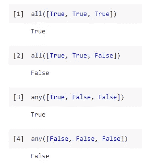

基本上，你可以认为`all()`函数对所有的布尔值使用`and`，而`any()`函数使用`or`。这有时候挺有用的。请参见下面的示例。假设我们想测试一个列表中的所有数字是否都是偶数。

```
all([num % 2 == 0 for num in [2, 4, 6, 8, 10]])
all([num % 2 == 0 for num in [2, 4, 6, 8, 9]])
```

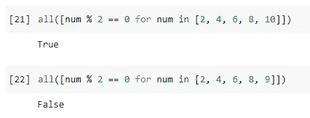

# 2.chr()和 ord()

我在其他文章中很少看到这两个函数。我猜是因为这些不太常用。然而，根据您正在开发的东西，如果您正在处理一些 Unicode 和特殊字符，您可能会发现这些非常有用。

第一个函数`chr()`是根据 Unicode 表将整数转换成字符。例如，在 Unicode 列表中可以找到许多外币。

```
chr(165) + '3,000'
'x ' + chr(215) + ' y'
```

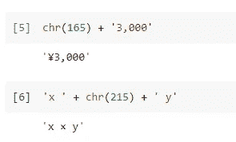

只要系统支持 Unicode，你的程序现在就可以输出特殊字符。有关 Unicode 字符的完整列表，请参考维基百科页面。

<https://en.wikipedia.org/wiki/List_of_Unicode_characters>  

另一个函数`ord()`是`chr()`的逆函数。

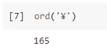

# 3.目录()

我也在许多 Python 技巧文章中看到过这种介绍。所以，这里就不多费口舌了。函数将简单地显示一个对象的所有属性。

不要忘记 Python 中的一切都是对象。因此，这个函数实际上显示了一个对象的所有属性和方法名(没有签名)。例如，我们可以让它显示 OS 库中的所有内容。

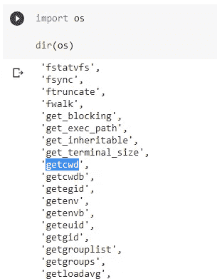

# 4.枚举()

这个函数是另一个实用的函数。我打赌你一定曾经谷歌过类似“在 Python 中使用 for-时获取索引”的东西。最常见的解决方案是建议如下使用`enumerate()`。

```
for index, char in enumerate(['a', 'b', 'c']):
    print(f'index: {index}, character: {char}')
```

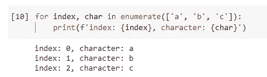

学习或记忆某事的最好方法总是去理解它。你想过它是如何工作的吗？让我们看看枚举对象是什么样子的。

```
list(enumerate(['a', 'b', 'c']))
```

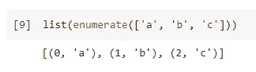

如图所示，该函数将元素列表转换为元组列表。每个元组的第一个元素是索引，第二个元素是原始元素。所以，我想现在你一定明白为什么`for index char in enumerate(...)`会起作用了:)

# 5.eval()

这个函数非常强大，因为它可以执行任何字符串格式的 Python 代码。例如，我们允许用户输入数学表达式，程序将计算它并返回答案。

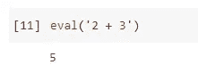

然而，它极其危险，因为它是如此强大。它将编译任何传入的参数，并在运行时将其作为代码执行。

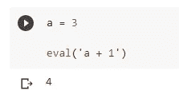

不小心使用`eval()`相当于留下一个后门，允许任何人使用你的程序运行任何东西。

# 6.过滤器()

在我看来，这个功能有时候非常好用。但是，我很少在其他文章里看到。它需要两个参数。第一个是一个函数，它将根据参数的一些测试结果返回一个布尔值。第二个应该是可迭代的。

```
def is_even(num):
    if num % 2 == 0:
        return True
    return Falsef_even = filter(is_even, [1,2,3,4,5,6,7,8])
list(f_even)
```

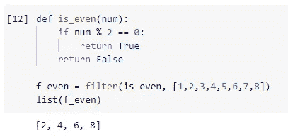

上面的例子是过滤列表提取所有偶数。在我看来，它比下面的列表理解(做同样的事情)更具可读性。

```
[num for num in [1,2,3,4,5,6,7,8] if is_even(num)]
```

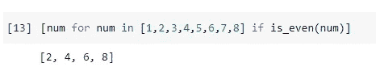

# 7.帮助()

如果您使用的是 PyCharm 之类的强大 IDE，您可能会忽略这一点。如果没有，你会发现`help()`函数很有用。它可以直接返回您传入的任何对象的文档。当然，文档需要在源代码中实现。当然，Python 中的所有内置函数都必须实现它。

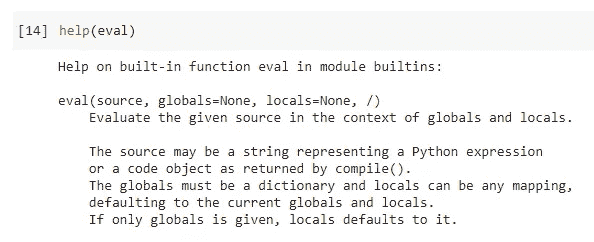

# 8.局部变量()

如果您使用 Spyder 之类的科学 ide，您可能不需要这个函数。如果没有，这个函数可以帮助您获得在这个 Python 会话中定义的任何变量(在 RAM 中)。

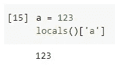

当你使用没有任何扩展的 Jupyter 来帮助你列出所有定义的变量时，这也是有用的。有时，我们可能已经声明了一些东西，但是丢失了它，并且忘记了它，因为单元格甚至可能被删除。幸运的是，只要它们还在内存中，就会通过调用`locals()`列出。

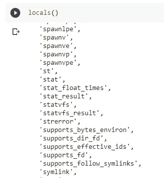

# 9.范围()

我想我实际上可以跳过这个，因为它太常见了，无法使用:)

`range()`函数将帮助生成一个基于开始和结束数字以及步骤的数字列表。

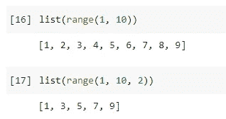

当我们想让某个东西循环一定的时间，并且想知道我们在循环中的是哪一轮时，这个函数经常被用到。

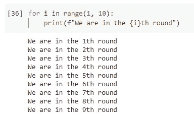

如果我们需要一些更复杂的功能，Numpy 将是一个更好的选择，但`range()`是一个内置函数，永远是第一选择。

# 10.排序()和反转()

这两个也很常见。Python 为我们提供了一种简单而智能的方法，使用函数`sorted()`对任何可重复项进行排序。

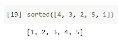

另一个功能`reversed()`大概用的比较少。但是当你想反转一个 iterable 的时候，这就变得非常容易了。

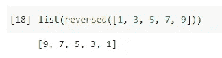

# 11.zip()

我喜欢这个函数，因为它是“Pythonic 式”编程的标志性标志之一。创建它是为了方便地对应迭代两个列表中的元素。请参见下面的示例。

```
for num, letter in zip([1, 2, 3], ['a', 'b', 'c']):
    print(num, letter)
```

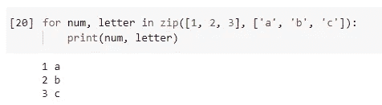

然而，在我看来，它比它的本意更加强大。事实上，值得写一篇独立的文章来介绍`zip()`函数，我以前就做过:)

</fasten-python-objects-using-zip-88a1e7a68c7>  

如果您有兴趣深入研究这个函数，强烈建议您查看上面的文章。

# 摘要


照片由 [sontung57](https://pixabay.com/users/sontung57-19733131/) 在 [Pixabay](https://pixabay.com/photos/buildings-facade-windows-5941345/) 上拍摄

在这篇文章中，我列出了 11 个(实际上不止 11 个，因为其中一些是成对的，因为它们彼此相关)我认为在我们的日常编程中或多或少有用的 Python 内置函数。

作为一种编程语言，这些函数是 Python 的标志性特征。基本上，直接实施你的想法，没有任何不必要的开销。

当然还有更多 Python 内置函数。我跳过了其中的大部分，因为它们要么不太常见，要么只在非常特殊的情况下使用。别忘了，永远不要压抑自己的求知欲。你可以在官方文件中查到所有这些。

【https://docs.python.org/3.9/library/functions.htm 

<https://medium.com/@qiuyujx/membership>  

如果你觉得我的文章有帮助，请考虑加入 Medium 会员来支持我和成千上万的其他作者！(点击上面的链接)