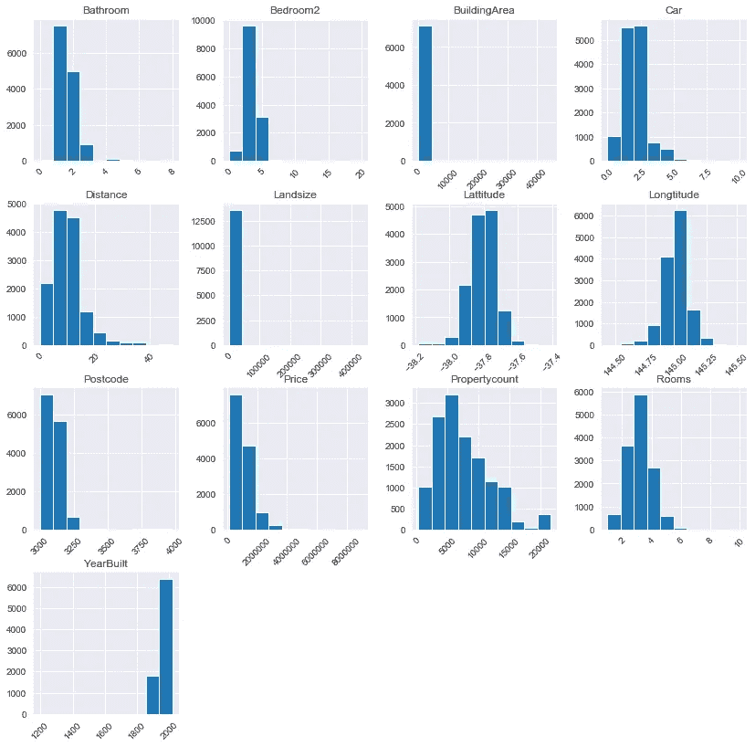
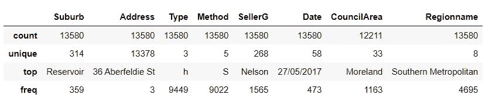
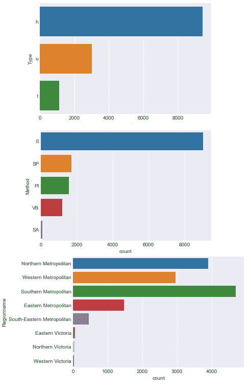
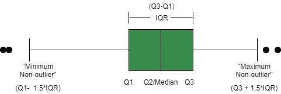
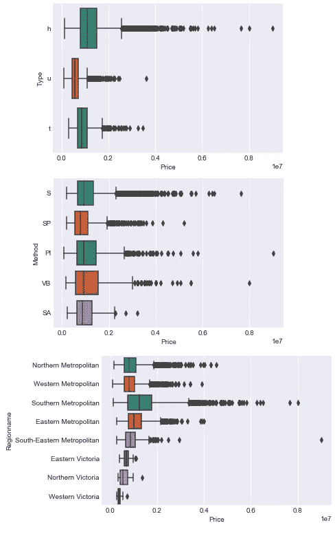
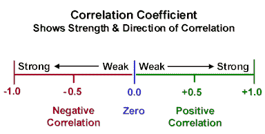
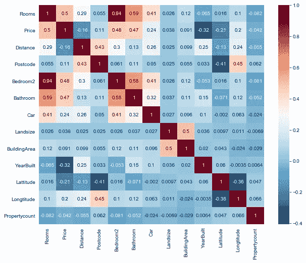

# 完成 EDA(探索性数据分析)-回归任务的 11 个基本代码块

> 原文：<https://towardsdatascience.com/11-simple-code-blocks-for-complete-exploratory-data-analysis-eda-67c2817f56cd?source=collection_archive---------4----------------------->

## 探索任何数据科学项目并获得宝贵见解的实用指南


Joshua Earle 在 [Unsplash](https://unsplash.com?utm_source=medium&utm_medium=referral) 上拍摄的照片

探索性数据分析或 EDA 是[数据科学流程](https://www.datasciencegraduateprograms.com/the-data-science-process/)的首要步骤之一。它包括尽可能多地了解数据，而不需要花费太多时间。在这里，您可以获得对数据的直觉和高层次的实际理解。在这个过程结束时，您应该对数据集的结构有一个总体的概念，一些清理的想法，目标变量和可能的建模技术。

在大多数问题中，有一些通用策略可以快速执行 EDA。在本文中，我将使用来自 Kaggle 的[墨尔本房屋快照数据集](https://www.kaggle.com/dansbecker/melbourne-housing-snapshot)来演示您可以用来执行令人满意的探索性数据分析的 11 个代码块。数据集包括房地产的`Address`、`Type`、销售的`Suburb`、`Method`、`Rooms`、`Price`(目标特征)、房产中介的`(SellerG)`、`Date`销售、来自 C.B.D 的`Distance`，你可以在这里下载数据集[跟随。](https://www.kaggle.com/dansbecker/melbourne-housing-snapshot/download)

注意:如果你的项目涉及到预测一个二进制或多类特性，你可以遵循[这篇文章。](/13-key-code-blocks-for-eda-classification-task-94890622be57)

</13-key-code-blocks-for-eda-classification-task-94890622be57>  

第一步是导入所需的库。我们将需要[熊猫](https://en.wikipedia.org/wiki/Pandas_(software))， [Numpy](/4-fundamental-numpy-properties-every-data-scientist-must-master-c906236eb44b) ， [matplotlib](https://en.wikipedia.org/wiki/Matplotlib) 和 [seaborn](https://seaborn.pydata.org/) 。为了确保显示所有的列，使用`pd.set_option(’display.max_columns’, 100)`。默认情况下，pandas 显示 20 列，隐藏其余的列。

```
import pandas as pd
pd.set_option('display.max_columns',100)import numpy as npimport matplotlib.pyplot as plt
%matplotlib inlineimport seaborn as sns
sns.set_style('darkgrid')
```

Panda 的`pd.read_csv(path)`以数据帧的形式读入 csv 文件。

```
data = pd.read_csv('melb_data.csv')
```

## 基本数据集探索

1.  **数据框的形状(尺寸)**

熊猫数据帧的`.shape`属性给出了数据的整体结构。它返回一个长度为 2 的[元组](/ultimate-guide-to-lists-tuples-arrays-and-dictionaries-for-beginners-8d1497f9777c)，该元组转化为数据集有多少行观察值和多少列。

```
data.shape### Results
(13580, 21)
```

我们可以看到数据集有 13，580 个观察值和 21 个特征，其中一个特征是目标变量。

**2。各列的数据类型**

DataFrame 的`.dtypes`属性将列的数据类型显示为 Panda 的[系列](https://www.geeksforgeeks.org/python-pandas-series/)(系列表示一列值及其索引)。

```
data.dtypes### Results
Suburb            object
Address           object
Rooms              int64
Type              object
Price            float64
Method            object
SellerG           object
Date              object
Distance         float64
Postcode         float64
Bedroom2         float64
Bathroom         float64
Car              float64
Landsize         float64
BuildingArea     float64
YearBuilt        float64
CouncilArea       object
Lattitude        float64
Longtitude       float64
Regionname        object
Propertycount    float64
dtype: object
```

我们观察到我们的数据集结合了**分类**(对象)和**数值**(浮点和整型)特征。此时，我回到 Kaggle 页面来理解这些列及其含义。查看用 [Datawrapper](https://www.datawrapper.de/) 创建的列及其定义的表格。

需要注意什么；

*   应该是分类的数字特征，反之亦然。

通过快速分析，我没有发现任何数据类型的不匹配。这是有意义的，因为这个数据集版本是原始[墨尔本数据](https://www.kaggle.com/anthonypino/melbourne-housing-market)的干净快照。

**3。显示几行**

熊猫数据框有非常方便的功能来显示一些观察结果。`data.head()`显示前 5 个观察值，`data.tail()`显示后 5 个观察值，`data.sample()`显示从数据集中随机选择的一个观察值。您可以使用`data.sample(5)`显示 5 次随机观察

```
data.head()
data.tail()
data.sample(5)
```

需要注意的事项:

*   你能理解列名吗？它们有意义吗？(如果需要，再次检查变量定义)
*   这些列中的值有意义吗？
*   是否发现重大缺失值(NaN)？
*   分类特征有哪些类型的类？

我的见解；`Postcode` 和`Propertycount` 功能都根据`Suburb` 功能进行了更改。此外，`BuildingArea` 和`YearBuilt`的值明显缺失。

## 分配

这是指要素中的值是如何分布的，或者它们出现的频率。对于数字特征，我们将看到一组数字在一个特定的列中出现了多少次，对于分类特征，我们将看到每一列的类及其出现的频率。我们将使用**图表**和实际汇总**统计数据**。图表使我们能够对分布有一个总体的了解，而统计数字则给我们提供了实际的数字。这两种策略都值得推荐，因为它们是相辅相成的。

## 数字特征

**4。绘制每个数字特征**

我们将使用熊猫[直方图](https://pandas.pydata.org/pandas-docs/stable/reference/api/pandas.DataFrame.hist.html)。直方图将数字分成不同的范围(或仓),条形图的高度显示有多少数字落在该范围内。`df.hist()`绘制网格中数据数字特征的直方图。我们还将提供`figsize`和`xrot`参数来增加网格大小并将 x 轴旋转 45 度。

```
data.hist(figsize=(14,14), xrot=45)
plt.show()
```



作者直方图

需要注意的事项:

*   无法解释的可能异常值，或者可能是测量误差
*   应该是分类的数字特征。例如，`Gender`用 1 和 0 表示。
*   没有意义的边界，如百分比值> 100。

从直方图中，我注意到`BuildingArea`和`LandSize`右侧有潜在的异常值。我们的目标特征`Price`也非常向右倾斜。我还注意到`YearBuilt`非常向左倾斜，边界开始于 1200 年，这很奇怪。为了更清楚地了解情况，让我们转到汇总统计数据。

**5。数字特征的汇总统计**

现在我们对数字特性有了一个直观的感觉，我们将使用`df.describe()`来查看实际的统计数据，它显示了它们的汇总统计数据。

```
data.describe()
```

我们可以看到，对于每个数字特征，其中值的*计数*、均值值、*标准差*或标准偏差、*最小*值、*第 25*百分位、*第 50*百分位或中值、*第 75*百分位和*最大*值。从计数中，我们还可以识别带有**缺失值**的特征；它们的计数不等于数据集的总行数。这些是`Car`、`LandSize`和`YearBuilt.`

我注意到`LandSize`和`BuildingArea`的最小值都是 0。我们还看到`Price`的范围从 85，000 到 9，000，000，这是一个很大的范围。我们将在项目后面的详细分析中探索这些列。

然而，查看`YearBuilt`特性，我们注意到最小年份是 1196 年。这可能是一个可能的数据输入错误，将在清理过程中删除。

## 分类特征

**6。分类特征的汇总统计数据**

对于分类特征，在我们绘制图表之前显示汇总统计数据是很重要的，因为一些特征有许多独特的类(就像我们将在`Address`中看到的)，如果在计数图上可视化，这些类将是不可读的。

为了只检查分类特征的汇总统计，我们将使用`df.describe(include=’object’)`

```
data.describe(include='object')
```



按作者分类的汇总统计

该表与数值特征表略有不同。在这里，我们得到每个特性的值的*计数*，唯一的类的数量，*最频繁的*类，以及该类在数据集中出现的*频率*。

我们注意到一些类有很多唯一的值，比如`Address`，后面跟着`Suburb`和`SellerG`。根据这些发现，我将只绘制具有 10 个或更少独特类的列。我们还注意到`CouncilArea`有缺失值。

**7。绘制每个分类特征**

使用上面的统计数据，我们注意到`Type`、`Method` 和`Regionname` 有不到 10 个类，并且可以有效地可视化。我们将使用 [Seaborn countplot](https://seaborn.pydata.org/generated/seaborn.countplot.html) 来绘制这些特征，它类似于分类变量的直方图。计数图中的每个条形代表一个唯一的类。

我为循环创建了一个[。对于每个分类特征，将显示一个计数图，以显示该特征的类分布情况。第`df.select_dtypes(include=’object’)`行选择分类列及其值并显示它们。我们还将包含一个](/a-gentle-introduction-to-flow-control-loops-and-list-comprehensions-for-beginners-3dbaabd7cd8a) [If 语句](/a-gentle-introduction-to-flow-control-loops-and-list-comprehensions-for-beginners-3dbaabd7cd8a)，以便使用行`Series.nunique() < 10`只选择包含 10 个或更少类的三列。在此阅读`.nunique()`文档[。](https://pandas.pydata.org/pandas-docs/stable/reference/api/pandas.Series.nunique.html)

```
for column in data.select_dtypes(include='object'):
    if data[column].nunique() < 10:
        sns.countplot(y=column, data=data)
        plt.show()
```



按作者统计地块

需要注意的事项:

*   有可能影响模型性能的稀疏类。
*   类别标注错误，例如 2 个完全相同的类别有微小的拼写差异。

我们注意到`Regionname`有一些稀疏的类，在建模过程中可能需要合并或重新分配。

## 分组和分段

分割允许我们切割数据并观察分类和数字特征之间的关系。

8。通过分类特征分割目标变量。

这里，我们将在我们的主要分类特征`(Type`、`Method`和`Regionname)`的各个类别之间比较目标特征`Price`，并查看`Price`如何随着类别而变化。

我们使用 [Seaborn 箱线图](https://seaborn.pydata.org/generated/seaborn.boxplot.html)，它绘制了`Price`在分类特征类别中的分布。[这个](https://www.geeksforgeeks.org/how-to-show-mean-on-boxplot-using-seaborn-in-python/)教程，我借用了下面的图片，清楚地解释了箱线图的特征。两端的点代表异常值。



图片来自[www.geekeforgeeks.org](https://www.geeksforgeeks.org/how-to-show-mean-on-boxplot-using-seaborn-in-python/)

同样，我使用循环的*来绘制带有`Price`的每个分类特征的箱线图。*

```
for column in data.select_dtypes(include=’object’):
 if data[column].nunique() < 10:
 sns.boxplot(y=column, x=’Price’, data=data)
 plt.show()
```



按作者分类的方框图

需要注意的事项:

*   哪些类对目标变量影响最大。

注意`Price`仍然稀疏地分布在前面看到的 3 个稀疏的`Regionname`类中，这加强了我们反对这些类的理由。

还要注意`SA`类(最不频繁的`Method`类)的价格很高，几乎与最频繁出现的类`S.`的价格相似

9。根据每个分类特征对数字特征进行分组。

在这里，我们将通过汇总所有类别的数字特征来了解所有其他数字特征，而不仅仅是`Price`是如何随着每个分类特征而变化的。我们使用 [Dataframe 的 groupby](https://www.shanelynn.ie/summarising-aggregation-and-grouping-data-in-python-pandas/) 函数按类别对数据进行分组，并计算各种数字特征的度量(如*平均值*、*中值*、*最小值*、*标准值、*等)。

对于少于 10 个类别的 3 个分类特征，我们将数据分组，然后跨数字特征计算`mean`。我们使用`display()`，它比`print()`产生一个更干净的表。

```
for column in data.select_dtypes(include='object'):
    if data[column].nunique() < 10:
        display(data.groupby(column).mean())
```

我们将比较数字特性中的`Type,` `Method`和`Regionname`类，看看它们是如何分布的。

## 数字特征和其他数字特征之间的关系

**10。不同数字特征的相关矩阵**

[相关性](https://www.mathsisfun.com/data/correlation.html)是介于-1 和 1 之间的值，表示两个独立特征的值同时移动的接近程度。*正*相关性意味着一个特性增加，另一个特性也增加，而*负*相关性意味着一个特性增加，另一个特性减少。接近 0 的相关性表示*弱*关系，而接近-1 或 1 表示*强*关系。



图片来自 [edugyan.in](http://www.edugyan.in/2017/02/correlation-coefficient.html)

我们将使用`df.corr()`来计算数字特征之间的[相关性](https://machinelearningmastery.com/how-to-use-correlation-to-understand-the-relationship-between-variables/)，并返回一个数据帧。

```
corrs = data.corr()
corrs
```

现在这可能没有多大意义，所以让我们绘制一个热图来可视化这种相关性。

11。相关性热图

我们将使用 [Seaborn 热图](https://seaborn.pydata.org/generated/seaborn.heatmap.html)将网格绘制成一个矩形颜色编码矩阵。我们用`sns.heatmap(corrs, cmap=’RdBu_r’,annot=True)`。

`cmap=‘RdBu_r’`参数告诉热图使用什么调色板。高度正相关显示为*深红色*，高度负相关显示为*深蓝色*。越接近白色意味着关系越脆弱。阅读[这篇](https://medium.com/@morganjonesartist/color-guide-to-seaborn-palettes-da849406d44f)关于其他调色板的精彩教程。`annot=True`包括方框中的相关值，以便于阅读和解释。

```
plt.figure(figsize=(10,8))
sns.heatmap(corrs, cmap='RdBu_r', annot=True)
plt.show()
```



作者热图

需要注意的事项:

*   高度相关的特征；不是深红(正)就是深蓝(负)。
*   目标变量；如果它与其他特征有很强的正面或负面关系。

我们注意到`Rooms`、`Bedrooms2`、`Bathrooms`和`Price`有很强的正相关关系。另一方面，我们的目标特征`Price`与来自 CBD 的`YearBuilt`的*负*相关性稍弱，与`Distance`的*负*相关性更弱。

在本文中，我们研究了墨尔本数据集，并对其结构和特性有了较高的理解。在这个阶段，我们不需要做到 100%的全面，因为在未来的阶段，我们将更细致地探索数据。你可以在 Github [这里](https://github.com/suemnjeri/medium-articles/blob/main/11%20EDA%20blocks%20melbourne%20data%20and%20code/EDA_melbourne_for_medium.ipynb)获得完整的代码。我将很快上传数据集的清理概念。

还可以查看用于 EDA 分类任务的 [13 个关键代码块，用于处理二元或多类预测问题。](/13-key-code-blocks-for-eda-classification-task-94890622be57)

</13-key-code-blocks-for-eda-classification-task-94890622be57> 