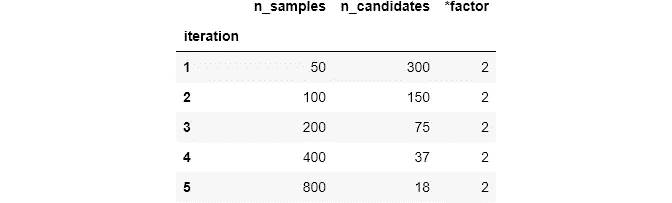
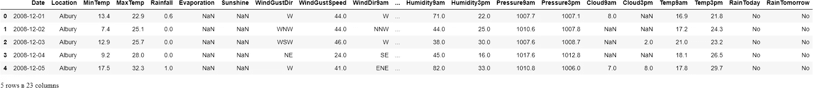

# HalvingGridSearch 将超参数调谐速度提高了 11 倍

> 原文：<https://towardsdatascience.com/11-times-faster-hyperparameter-tuning-with-halvinggridsearch-232ed0160155?source=collection_archive---------8----------------------->

## 连续减半彻底粉碎了 GridSearch 和 RandomSearch

**照片由** [**卡罗林娜**](https://www.pexels.com/@karolina-grabowska?utm_content=attributionCopyText&utm_medium=referral&utm_source=pexels) **上** [**像素**](https://www.pexels.com/photo/person-holding-tuning-pegs-4472108/?utm_content=attributionCopyText&utm_medium=referral&utm_source=pexels)

## 介绍

一段时间以来，Scikit-learn 的`GridSearchCV`和`RandomizedSearchCV`类一直是超参数调优的首选。给定一个可能参数的网格，两者都使用蛮力方法来计算任何给定模型的最佳超参数集。虽然它们提供了非常健壮的结果，但是在大型数据集上调整较重的模型会花费太多时间(这里我们说的是几个小时)。这意味着除非你有一台 16 核以上的机器，否则你就有麻烦了。

但是在 2020 年 12 月，Scikit-learn 的 0.24 版本推出了两个新的超参数调优类— `HalvingGridSearch`和`HalvingRandomSearchCV`。在[官方用户指南](https://scikit-learn.org/stable/modules/grid_search.html#exhausting-the-resources)中，Scikit-learned 声称“他们可以更快地找到一个好的参数组合”，天哪，他们是对的吗！

在我比较`GridSearchCV`和`HalvingGridSearchCV`的第一个实验中，后者找到最佳超参数集的速度比 GridSearch 快 11 倍。在第二个实验中，我将参数网格的大小增加了 30 倍(大约 3000 个最终候选)，我使用了`HalvingRandomSearchCV`,结果性能提高了 6%,整个过程只花了 10 分钟。

请继续阅读，了解这两个非凡的类是如何工作的，并学习如何在自己的工作流程中使用它们。

 [## 通过我的推荐链接加入 Medium-BEXGBoost

### 获得独家访问我的所有⚡premium⚡内容和所有媒体没有限制。支持我的工作，给我买一个…

ibexorigin.medium.com](https://ibexorigin.medium.com/membership) 

获得由强大的 AI-Alpha 信号选择和总结的最佳和最新的 ML 和 AI 论文:

 [## 阿尔法信号|机器学习的极品。艾总结的。

### 留在循环中，不用花无数时间浏览下一个突破；我们的算法识别…

alphasignal.ai](https://alphasignal.ai/?referrer=Bex) 

## 术语注释

在我们继续之前，让我们确保我们对我今天将使用的一些术语有相同的理解。

**1。超参数**:应该由用户设置的模型内部设置。模型无法从训练数据中学习这些。一个例子是`xgboost`估计器中的学习率。

**2。参数网格**:一个字典，以参数名作为键，以可能的超参数列表作为值。以下是`XGBClassifier`的参数网格示例:

参数网格的大小或所有可能的组合通过乘以每个参数的可能值的数量来计算。所以，上面的网格有 4 * 3 * 3 = 36 种可能的组合。一般来说，参数网格会比这个大得多。

**3。候选者**:参数网格中所有可能的超参数集合的单一组合。

**4。资源或样本**:手头数据的别称。一个示例引用训练数据中的一行。

**5。迭代**:对训练数据使用一组超参数的任何一轮。

## `GridSearchCV`和`RanomizedSearchCV`概述

因为新类的主要思想与 GridSearch 和 RandomSearch 相关，所以让我简单介绍一下它们是如何工作的。

GridSearch 是一个详尽的强力估算工具。这意味着将使用交叉验证来训练超参数的所有组合。如果有 100 个可能的候选项，并且您正在进行 5 重交叉验证，则给定的模型将被训练 500 次(500 次迭代)。当然，对于笨重的模型来说，这需要非常长的时间。

RandomizedSearch 试图通过对每次迭代中选择哪组参数做出“更聪明”的选择来控制迭代次数。它有一个额外的`n_iter`参数直接控制这个过程。如果有 1000 个候选项并且`n_iter`被设置为 100，搜索将在第 100 次迭代后停止，并从这 100 个中返回最佳结果。这种随机选择过程导致训练时间大大缩短，但其性能不如 GridSearch。

如果你想进一步了解它们，并看到它们的实际应用，请查看我关于这个主题的另一篇文章:

 [## 使用 Sklearn GridSearchCV 和 RandomizedSearchCV 自动调整超参数

### 无需再次查看超参数即可调整模型

towardsdatascience.com](/automatic-hyperparameter-tuning-with-sklearn-gridsearchcv-and-randomizedsearchcv-e94f53a518ee) 

## 什么是连续减半？

虽然 GridSearch 和 RandomizedSearch 都使用所有的训练数据来训练候选人，但是 HalvingGridSearch 和 HalvingRandomSearch 采用了一种不同的方法，称为*连续减半*。让我们看看它在 HalvingGridSearch (HGS)方面意味着什么。

HGS 就像所有候选人之间的竞争(超参数组合)。在第一次迭代中，HGS 用一小部分训练数据训练所有候选人。在下一次迭代中，只有表现最好的候选人才会被选中，他们将获得更多的竞争资源。因此，随着每一次迭代,“幸存”的候选者将被给予越来越多的资源(训练样本),直到最佳超参数集保持不变。

现在，让我们更细化。上述过程的速度可以由两个参数控制— `factor`和`min_samples`。`min_samples`取一个整数来指定在第一次迭代中使用的训练数据的样本数。所有候选人都在这个数据上被训练，并且在下一次迭代中`min_samples`增加`factor`，并且候选人的数量减少`factor`。所有下一轮都以这种方式继续，直到找到最佳候选人。

通过一个例子让这个想法深入人心，假设我们在参数网格中有 1000 个样本和 20 个候选者。如果我们将`min_samples`设置为 20，并选择`factor`为 2，那么迭代将会这样展开:

将`min_resources`设置为 20，有 20 个候选，我们只能运行 4 次迭代，因为我们将在用尽所有样本之前用完所有候选。这意味着剩余的训练数据(1000 - 160 = 840)将被浪费，并且最佳候选仅通过仅在 160 行数据上进行训练来找到。

同样，我们也可能在所有候选人都被试用之前就用完了样本。例如，假设我们有 1000 个样本和 300 个候选人。我们将`min_samples`设置为 50，并选择因子 2:

如您所见，在第五次迭代中，我们没有足够的资源来进一步翻倍，我们只剩下 18 个最终候选项。这些最终候选人别无选择，只能在完整的数据集上接受训练，这与普通的老式网格搜索没有什么不同。这个问题在真实世界的数据集上更加明显。

例如，我们今天将使用的数据集有 145，000 个样本。因此，我们需要确保我们选择了这样一个`factor`和`min_samples`的组合，在最后一次迭代中，我们将得到尽可能多的未浪费的资源。

这听起来确实有很多猜测，但幸运的是，您可以将`exhaust`传递给`min_samples`，这样最小数量的资源将被自动确定，以创建与`factor`和大量候选人的最佳可能组合。例如，对于 1000 个样本和因子 2，将`min_samples`设置为`exhaust`会将其设置为 250，在我们进行每次迭代时，这将变成 250、500、1000 个样本。

[官方指南](https://scikit-learn.org/stable/modules/grid_search.html#exhausting-the-resources)称，耗尽样本数量肯定会导致参数选择更加稳健，但可能会多花一点时间。在接下来的部分中，我们将探索新的类比它们的同类好多少。

## HalvingGridSearchCV 与旧 GridSearchCV 的比较

为了比较这两个类，我将使用澳大利亚的[Rain](https://www.kaggle.com/jsphyg/weather-dataset-rattle-package)数据集来预测今天是否下雨。为了只关注手头的主题，我创建了包含所有必要预处理步骤的`prep.py`文件:处理缺失值、缩放数字特征和编码分类变量(您可以在[GitHub gist](https://gist.github.com/BexTuychiev/64f68715c6e5a0cafe2a7ce595a03eb3)中获得该文件)。

运行`preprocess`函数会返回一个干净的、经过处理的特征和目标数组，我们将以传统的名称保存它们:

目标变量是`RainToday`，作为基本估计量，我们将使用 XGBoostClassifier。让我们首先通过用默认参数拟合来建立基础分数:

要计算 ROC_AUC 得分，应该对目标和预测进行编码，但它们不是:

让我们用`LabelEncoder`对它们进行编码:

我们的基本分数是 0.73。现在，我们将尝试通过仅调整 4 个超参数来对此进行改进:

> 如果你不熟悉 XGBoost 以及它的参数是什么，可以看看我在上面写的初学者友好的文章[。](/beginners-guide-to-xgboost-for-classification-problems-50f75aac5390?source=your_stories_page-------------------------------------)

候选人数为 108 人。首先，我们将使用五重交叉验证进行详尽的 GridSearch，这是两个类中的默认设置。度量仍然是`roc_auc`:

一个多小时后，我们找到了最佳参数和分数:

令人惊讶的是，`roc_auc`的分数下降了一点。也许，我们没有提供足够好的参数网格。然而，为了便于比较，让我们使用`HalvingGridSearchCV`进行同样的调优。它也是从`sklearn.model_selection`进口的，你也应该进口`enable_halving_search_cv`，因为它仍然是一个实验性的功能。

如我所说，我们将把`min_resources`设置为`exhaust`，并选择 Scikit-learn 推荐的因子 3:

哇！运行时间显著减少——几乎比 GridSearch 快 11 倍。现在让我们来看看表演:

如你所见，结果几乎相同。但是 HGS 比`GridSearchCV`快了 11 倍！

## 评估 HalvingRandomSearchCV

这一次，让我们用更好的超参数创建一个更大的网格。

首先， [XGBoost 文档](https://xgboost.readthedocs.io/en/latest/parameter.html)说要考虑到类不平衡，我们应该调整`scale_pos_weight`。结果表明，要找到最优值，我们应该用正类的和除以负类的和。让我们开始吧:

我们找到了`scale_pos_weight`。现在，我们还修正了`subsample`和`colsample_bytree`的值，以避免过度拟合。这次让我们提供更多可能的值，因为模型可能受到了太多的约束。

上次，`gamma`的最佳值被发现是 1，这是它的范围的结尾，所以我们也应该扩展它:

现在，我们有了一个相当大的网格，有将近 3000 个候选人。让我们看看`HalvingRandomSearchCV`是怎么回事(通过将`n_candidates`设置为`exhaust`来耗尽该类中的所有可用资源):

> 在看到 HGS 碾压 GridSearch 之后，我甚至懒得去比较`HalvingRandomSearchCV`和普通的`RandomizedSearchCV`。显然，连续减半比两种老方法都好。

对于一个相当大的网格，只需要 10 分钟就可以找到最好的分数。此外，这次我们看到了 6%的分数增长，这是 HGS 和 GridSearch 都做不到的。

你印象深刻了吗？

## 结论

在完成上述实验后，我已经下定决心要转到新的班级。

你应该注意到，我们只有通过调整新类的最基本设置才能达到如此高的性能。根据文档，这两个类都提供了更多的设置来控制速度和性能，所以也值得一试:

*   [halvinggridsearccv 文档](https://scikit-learn.org/stable/modules/generated/sklearn.model_selection.HalvingGridSearchCV.html)
*   [HalvingRandomSearchCV 文档](https://scikit-learn.org/stable/modules/generated/sklearn.model_selection.HalvingRandomSearchCV.html)
*   [官方 Sklearn 用户指南关于参数调整](https://scikit-learn.org/stable/modules/grid_search.html#exhausting-the-resources)

如果您感兴趣，XGBoost 参数调整的官方指南:

*   [XG boost 参数概述](https://xgboost.readthedocs.io/en/latest/parameter.html)
*   [XG boost 参数整定注意事项](https://xgboost.readthedocs.io/en/latest/tutorials/param_tuning.html)

不要忘记进行你自己的实验并分享结果！

# 如果你不知道接下来要读什么，这里，我为你挑选了一些:

 [## 如何使用 Plotly 作为熊猫绘图后端

### 无需学习新的库就可以制作互动的情节

towardsdev.com](https://towardsdev.com/how-to-use-plotly-as-pandas-plotting-backend-123ff5378003)  [## 介绍使用 Sklearn 的岭和套索回归正则化

### 你还不如放弃线性回归

towardsdatascience.com](/intro-to-regularization-with-ridge-and-lasso-regression-with-sklearn-edcf4c117b7a)  [## Scikit-learn 的 k 近邻分类器和回归器简介

### 了解掌握它们需要什么

towardsdatascience.com](/intro-to-scikit-learns-k-nearest-neighbors-classifier-and-regressor-4228d8d1cba6)