# 掌握熊猫价值排序的 11 个技巧

> 原文：<https://towardsdatascience.com/11-tricks-to-master-values-sorting-in-pandas-7f2cfbf19730?source=collection_archive---------13----------------------->

## 有效使用 Pandas sort_value()的实践教程


照片由 [UX 印尼](https://unsplash.com/@uxindo?utm_source=unsplash&utm_medium=referral&utm_content=creditCopyText)在 [Unsplash](https://unsplash.com/s/photos/sorting?utm_source=unsplash&utm_medium=referral&utm_content=creditCopyText)

> 数据排序是将数据按某种有意义的顺序排列，使其更容易理解、分析或可视化的过程。[1]

数据排序是数据分析中最常见和最基本的过程之一。Pandas 有一个内置的方法`sort_values()`来根据给定的标签对数据进行排序。该方法本身使用起来相当简单，但在实践中，您可能会遇到各种排序问题，例如，缺少值、特殊字符、自定义标签(例如，t 恤尺寸 **XS** 、 **S** 、 **M** 、 **L** 、 **XL** 等)。

在本文中，我们将通过一些实践教程来探索熊猫`sort_values()`的不同用例。本文组织如下:

1.  对系列进行排序
2.  按单列对数据帧进行排序
3.  按多列对数据帧进行排序
4.  排序前应用转换
5.  对多列应用转换
6.  处理自定义排序
7.  处理缺失值
8.  就地排序值
9.  忽略带有`ignore_index=True`的索引
10.  按行对数据帧进行排序
11.  选择不同的排序算法

> *请查看* [*笔记本*](https://github.com/BindiChen/machine-learning/blob/master/data-analysis/040-pandas-sort_values/pandas-sort_values.ipynb) *获取源代码。更多教程可从*[*Github Repo*](https://github.com/BindiChen/machine-learning)*获取。*

为了演示，让我们创建一个数据帧:

```
df = pd.DataFrame({
    'product': ['keyboard', 'mouse', 'desk', 'monitor', 'chair'],
    'category': ['C', 'C', 'O', 'C', 'O'],
    'year': [2002, 2002, 2005, 2001, 2003],
    'cost': ['$52', '$24', '$250', '$500', '$150'],
    'promotion_time': ['20hr', '30hr', '20hr', '20hr', '2hr'],
})
```

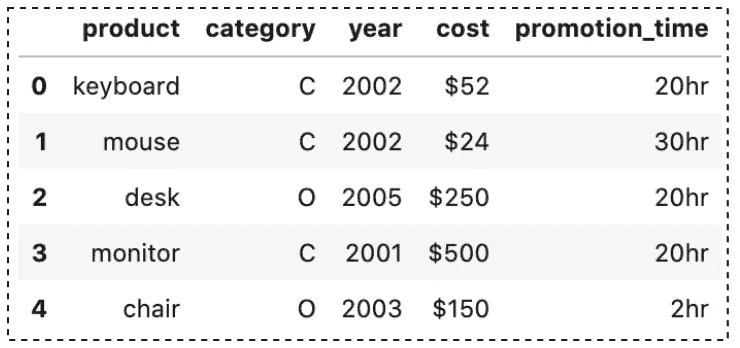

作者图片

# 1.对系列进行排序

`sort_values()`最简单的用法就是对一个数列进行排序。例如，让我们对“**年”**列的值进行排序:

```
df['**year**'].sort_values()3    2001
0    2002
1    2002
4    2003
2    2005
Name: year, dtype: int64
```

`df['year']`将“**年**”列作为一个序列返回，`sort_values()`用于对值进行排序。默认情况下，`sort_values()`返回的输出是升序的。我们可以将`ascending`参数设置为`False`来获得降序结果。

```
df['year'].sort_values(**ascending=False**)2    2005
4    2003
0    2002
1    2002
3    2001
Name: year, dtype: int64
```

# 2.按单列对数据帧进行排序

要根据单个列中的值对 DataFrame 进行排序，需要传递该列的名称。例如，让我们按“**年**”列对数据集进行排序

```
df.sort_values(**'year'**)
# same as df.sort_values(**by='year'**)
```

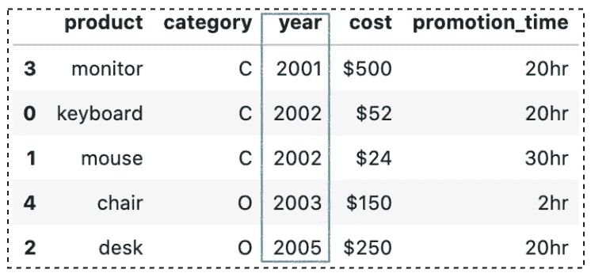

熊猫按单个列对 _values()排序(图片按作者)

默认情况下，该方法将返回**一个按升序排序的新数据帧**，并且**不会修改原始数据帧**。

我们还可以使用`ascending`参数来指定我们的偏好，例如将它设置为`False`来获得降序结果。

```
df.sort_values('year', **ascending=False**)
```

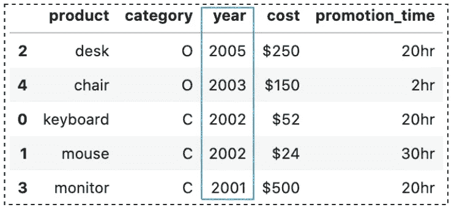

熊猫按单个列对 _values()排序(图片按作者)

# 3.按多列对数据帧进行排序

有时，我们需要按多列对数据帧进行排序。熊猫`sort_values()`非常简单，因为第一个参数`by`接受一个列表作为输入:

```
df.sort_values(**['category', 'year']**)
```

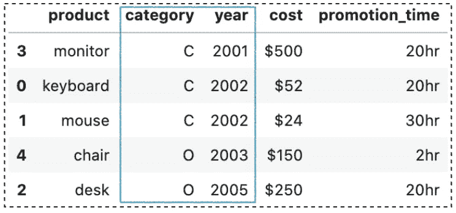

熊猫按多列对 _values()排序(图片按作者)

默认情况下，它按升序对多列进行排序。`ascending`参数接受一个布尔值列表，每个值对应一列。因此，我们也可以指定我们的偏好如下:

```
df.sort_values(**['category', 'year'], ascending=[True, False]**)
```

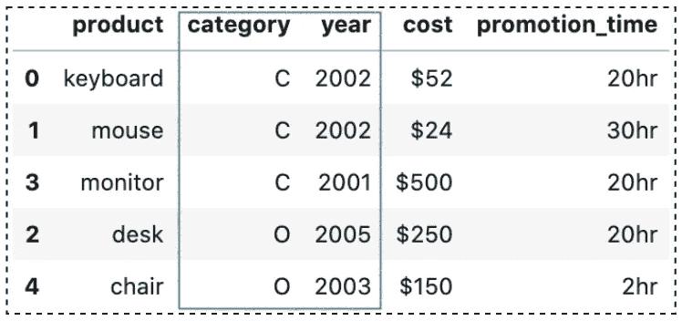

熊猫按多列对 _values()排序(图片按作者)

# 4.排序前应用转换

有时，您的数据不能像预期的那样正确排序，例如“**成本**列中的符号`$`。

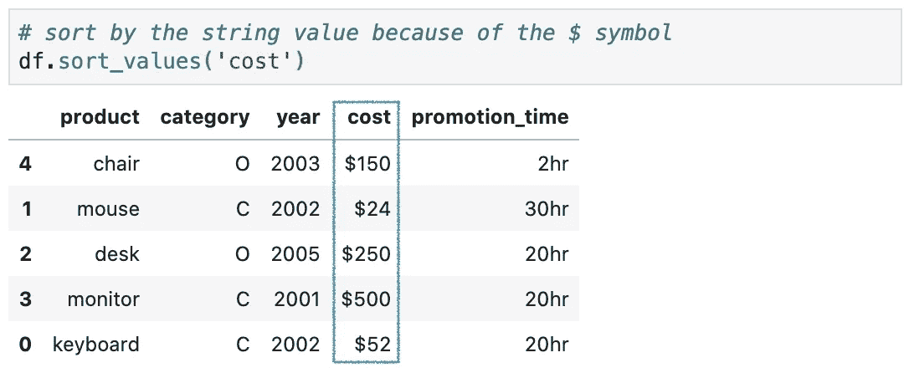

熊猫 sort_values()带变换(图片由作者提供)

问题是，如果我们调用这个方法，我们将得到按字符串而不是数字排序的结果。

Pandas `sort_values()`提供了一个`key`参数，它允许我们在排序之前传递一个自定义函数来转换值。让我们创建一个 lambda 函数来删除`$`并将剩余的字符串转换成一个数字:

```
df.sort_values(
    'cost', 
    **key=lambda val: val.str.replace('$', '').astype('float64')**
)
```

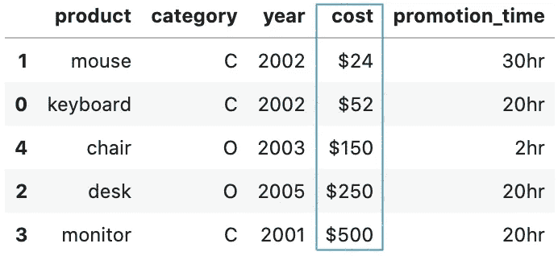

熊猫 sort_values()带变换(图片由作者提供)

# 5.对多列应用转换

在 Pandas `sort_values()`中，`key`功能适用于每个排序列。我们来看看如何按“**年**”、“**促销 _ 时间**”、“**成本【T31”)对数据帧进行排序。**

```
df = pd.DataFrame({
    'product': ['keyboard', 'mouse', 'desk', 'monitor', 'chair'],
    'category': ['C', 'C', 'O', 'C', 'O'],
    **'year': [2002, 2002, 2005, 2001, 2003],**
    **'cost': ['$52', '$24', '$250', '$500', '$150'],**
    **'promotion_time': ['20hr', '30hr', '20hr', '20hr', '2hr'],**
})
```

注意“**成本**”和“**促销 _ 时间**”都是字符串值，需要转换，**年**的值也可以。让我们继续创建一个常规函数`sort_by_cost_time()`:

```
def **sort_by_cost_time**(x):
    if x.name == 'cost':
        return x.str.replace('$', '').astype('float64')
    elif x.name == 'promotion_time':
        return x.str.replace('hr', '').astype('int')
    else:
        return x # Pass the function to the key argument
df.sort_values(
   **['year', 'promotion_time', 'cost'],** 
   **key=sort_by_cost_time** )
```

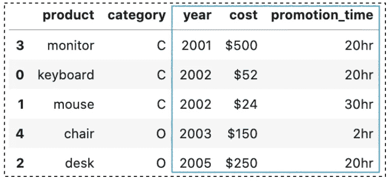

熊猫 sort_values()带变换(图片由作者提供)

`sort_by_cost_time()`函数检查列名并应用相应的转换。`else`块适用于任何其他列，并返回原始数据。

# 6.处理自定义排序

Pandas `sort_values()`使用起来相当简单，但是它不能用于自定义排序，例如，

*   t 恤尺码:`XS`、`S`、`M`、`L`和`XL`
*   月份:`Jan`、`Feb`、`Mar`、`Apr`、…。等等
*   星期几:`Mon`、`Tue`、`Wed`、`Thu`、`Fri`、`Sat`和`Sun`。

我们已经学习了使用`key`参数的转换。我们当然可以用它来解决自定义排序问题，但是在处理大型数据集时，性能会非常糟糕。我们可以通过声明一个`CategoricalDtype`来更有效地解决这个问题。让我们来看看这个例子:

```
df = pd.DataFrame({
    'cloth_id': [1001, 1002, 1003, 1004, 1005, 1006],
    **'size': ['S', 'XL', 'M', 'XS', 'L', 'S'],**
})
```

首先，让我们导入`CategoricalDtype`。

```
from pandas.api.types import **CategoricalDtype**
```

然后，创建一个自定义类别类型`cat_size_order`,用

*   第一个参数设置为`['XS', 'S', 'M', 'L', 'XL']`为布料尺寸的唯一值。
*   第二个变量`ordered=True`将被视为有序分类变量。

```
cat_size_order = CategoricalDtype(
    ['XS', 'S', 'M', 'L', 'XL'], 
    ordered=True
)
```

之后，调用`astype(cat_size_order)`将尺寸数据转换为自定义类别类型。通过运行`df['size']`，我们可以看到 ***大小*** 列已经转换为带有顺序`[XS < S < M < L < XL]`的类别类型。

```
df['size'] = df['size']**.astype(cat_size_order)**
df['size']0     S
1    XL
2     M
3    XS
4     L
5     S
Name: size, **dtype: category**
**Categories (5, object): [XS < S < M < L < XL]**
```

最后，我们可以调用`sort_values('size')`对值进行排序。

```
df.**sort_values('size')**
```

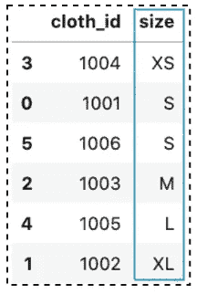

自定义排序的 Pandas sort_values()

这里有一篇文章可以了解更多关于熊猫的自定义排序:

</how-to-do-a-custom-sort-on-pandas-dataframe-ac18e7ea5320>  

# 7.处理缺失值

在 Pandas 中，缺失值被赋予值`NaN`，这是“不是一个数字”的缩写。当我们对值进行排序时，默认情况下，这些`NaN`被放在所有其他有效值的后面。

```
df = pd.DataFrame({
    'id': [4, 2, 3, **np.nan**, 6, 5],
    'name': ['A', 'B', 'C', 'D', 'E', 'F'],
})df.sort_values('id')
```

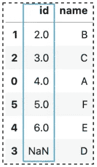

Pandas sort_values()处理缺失值(图片由作者提供)

如果我们想将它们放在开头，我们可以将`na_position`参数设置为`First`。

```
df.sort_values('id', **na_position='first'**)
```

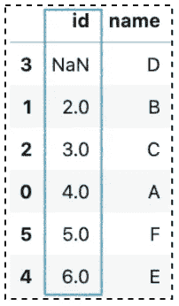

或者，我们可以考虑删除或替换丢失的值。

</working-with-missing-values-in-pandas-5da45d16e74>  

# 8.就地排序值

重要的是要记住，默认情况下，`sort_values()`将返回一个新的数据帧，而原始数据帧保持不变。为了避免创建新的数据帧，可以将参数`inplace`设置为`True`。

```
df.sort_values('id', **inplace=True**)
```

注意，使用`inplace=True`，调用将返回`None`。

# 9.用`ignore_index=True`忽略索引

您可能已经注意到，在结果中，每个排序的行的索引保持不变。如果您想忽略原始索引并用`0`到`n-1`标记结果(有序索引)，您可以将参数`ignore_index`设置为`True`:

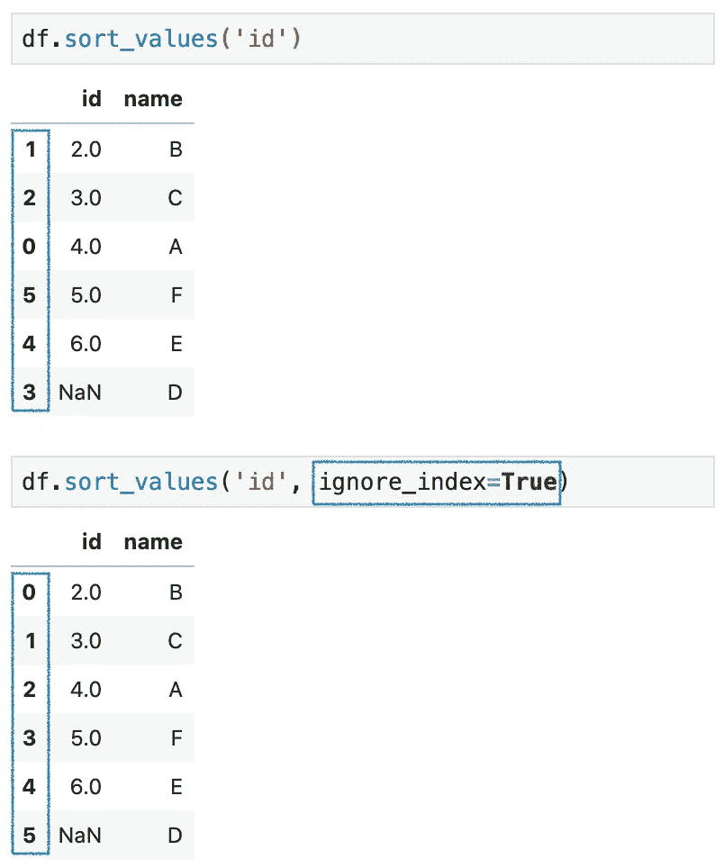

# 10.按行对数据帧进行排序

熊猫`sort_values()`支持`axis`的说法。默认为`0`，即按列对值进行排序。在某些情况下，您可能希望按行而不是按列对数据帧进行排序。为此，我们可以将`axis`参数设置为`1`:

```
df = pd.DataFrame({
    'Tom': [70, 67, 90, 50],
    'Jacky': [90, 85, 76, 70],
    'Lucy': [56, 60, 75, 77]
}, index=['Math', 'Chemistry', 'Physics', 'Art'])df.sort_values(**'Chemistry'**, **axis=1**)
```

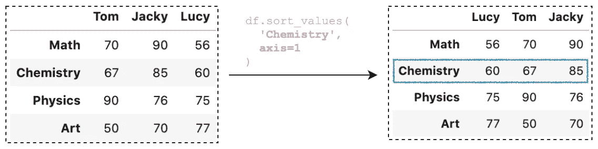

熊猫按行排序 _ 值()

# 11.选择不同的排序算法

我们应该知道 Pandas `sort_values()`允许我们选择不同的排序算法。根据[官方 API](https://pandas.pydata.org/pandas-docs/stable/reference/api/pandas.DataFrame.sort_values.html)【2】，默认算法为 ***快速排序*** 。而其他可用的算法有***【merge sort】******heap sort******stable***。要改变这一点，可以将算法名传递给参数`kind`:

```
df.sort_values('Chemistry', **kind='heapsort'**, axis=1)
```

> 注意:对于数据帧，此选项仅在对单列或单行排序时适用。[2]

# 结论

在本文中，我们已经讨论了 11 个使用熊猫`sort_values()`方法对值进行排序的用例。它非常方便，是探索性数据分析和数据预处理中最受欢迎的方法之一。数据排序是数据科学中一项重要的基本技能。我希望你喜欢这篇文章，并学到一些新的有用的东西。

感谢阅读。请查看[笔记本](https://github.com/BindiChen/machine-learning/blob/master/data-analysis/040-pandas-sort_values/pandas-sort_values.ipynb)获取源代码，如果你对机器学习的实用方面感兴趣，请继续关注。更多教程可从 [Github Repo](https://github.com/BindiChen/machine-learning) 获得。

## 参考资料:

*   [1] [什么是数据排序？](https://www.displayr.com/what-is-data-sorting/)
*   [2] [熊猫 API 文档 sort_values()](https://pandas.pydata.org/pandas-docs/stable/reference/api/pandas.DataFrame.sort_values.html)