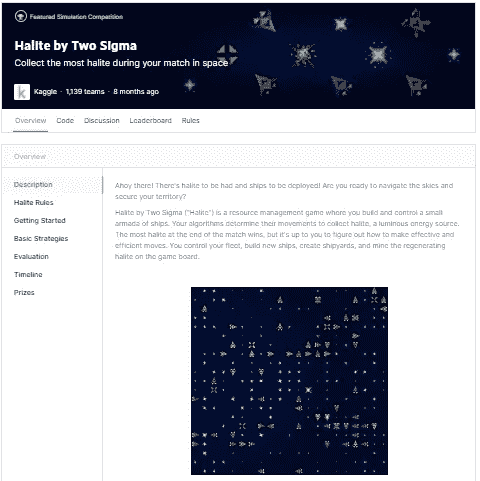
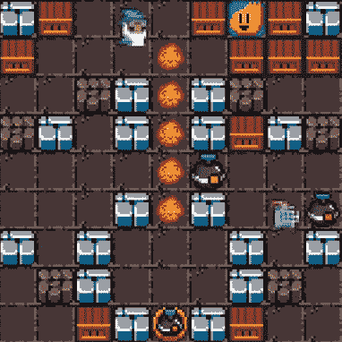
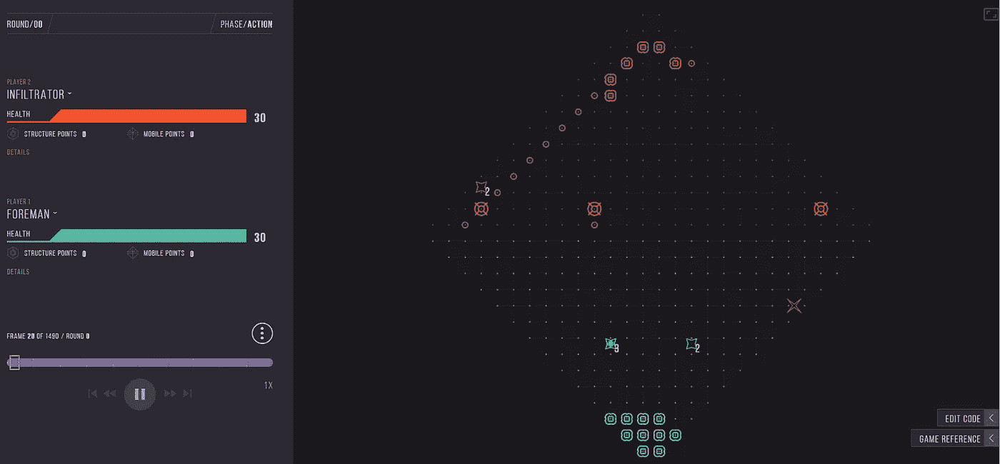
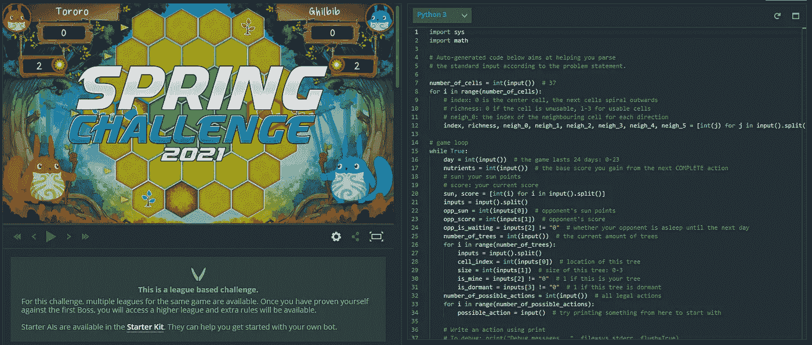
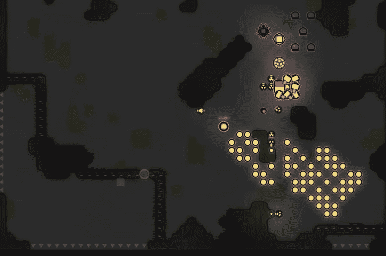
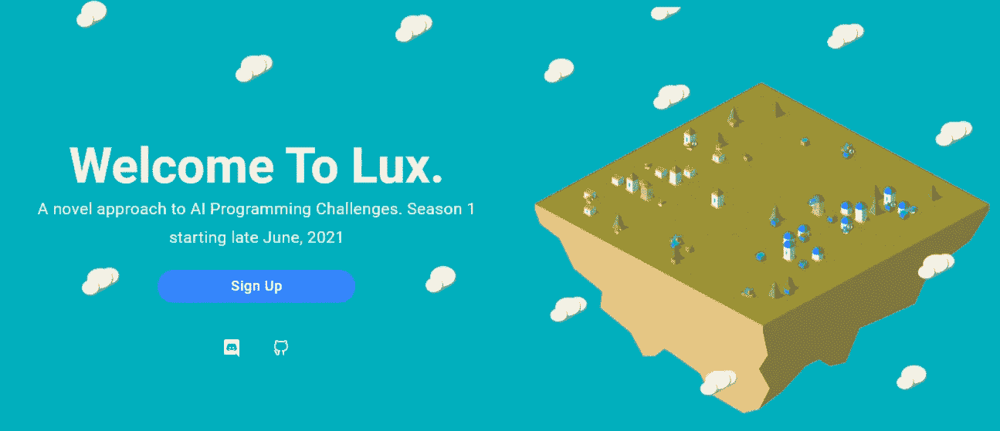
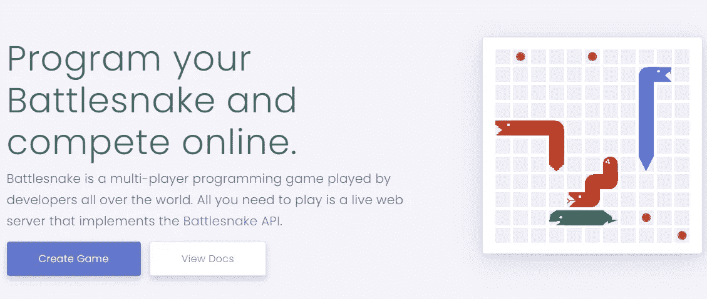

# 14 个活跃的人工智能游戏比赛将于 2022 年结束(正在进行和即将进行)

> 原文：<https://towardsdatascience.com/12-active-ai-game-competitions-ongoing-upcoming-6d97f3c3f920?source=collection_archive---------32----------------------->

## 这些不是普通的数据科学竞赛。

马尔科·布拉泽维奇在 [Unsplash](https://unsplash.com/s/photos/technology?utm_source=unsplash&utm_medium=referral&utm_content=creditCopyText) 上的照片

人工智能游戏比赛也被称为*人工智能编程比赛*或*机器人编程比赛。*它们不同于一般的数据科学竞赛。在人工智能游戏比赛中，你不会得到一个数据集。取而代之的是，你得到一个游戏或者模拟游戏，你的工作是编写一个可以在其中竞争的代理程序(有时是和其他玩家的代理进行正面交锋)。

它们可以是练习编程、算法和 AI/ML 的好地方。这些竞赛在难度、奖金、可用语言和可行策略方面有很大差异。为了帮助你找到合适的游戏，我整理了一份正在进行和即将进行的人工智能游戏比赛的列表，下面就来看看。

***注:*** *如果你对面向强化学习的竞赛感兴趣，可以查看* [*活动强化学习竞赛列表*](/active-and-upcoming-reinforcement-learning-competitions-8ed3c4fb14ab) *。*

> **2021 年 12 月更新:**2022 年改版！更新了战斗代码，俄罗斯 AI 杯，代码杯和 IEEE CoGs 的比赛细节。在名单上增加了武士。将 Yare.io 和 AICrowd 移至特别提及

## **AI 游戏比赛列表**

1.  [Kaggle 模拟](#80ef)
2.  [AWS DeepRacer](#8343)
3.  [编码器一个](#afb1)
4.  [端子](#b225)
5.  [编码名称](#dd87)
6.  [尖叫者](#9020)
7.  [力士 AI 挑战赛](#7bca)
8.  [战斗代码](#3b20)
9.  [俄罗斯艾杯](#0c4d)
10.  [战蛇](#8e20)
11.  [武士](#3c14)
12.  [艾体育馆](#09cf)
13.  [Codecup](#09e9)
14.  [IEEE 游戏会议](#6501)

## 1.**(2010—)**

****

**[由两个适马](https://www.kaggle.com/c/halite/overview/description)制作的石盐，现在在 Kaggle 上(截图由作者拍摄)**

**你可能听说过 Kaggle。他们是最受欢迎的举办数据科学竞赛的平台。但它们也是一系列模拟游乐场的所在地，如 [ConnectX](https://www.kaggle.com/c/connectx) 、[饿鹅](https://www.kaggle.com/c/hungry-geese)和资源管理游戏[两个适马](https://www.kaggle.com/c/halite/overview)的 Halite。玩家提交在实时排行榜上竞争的代理，奖品包括 Kaggle 商品和您的 Kaggle 个人资料的排名积分。**

**如果你是人工智能游戏竞赛的新手，Kaggle 是一个很好的起点，因为他们提供教程和免费的 GPU 来进行培训。目前，他们的模拟只支持 Python 中的提交。**

## **2.[AWS DeepRacer](https://aws.amazon.com/deepracer/)**(2018—)****

**AWS DeepRacer 是一款 3D 赛车模拟器，旨在帮助开发者开始强化学习。使用他们的预建模型，您将能够专注于设计奖励函数和调整超参数。**

**在 AWS 上开始 10 小时的培训是免费的。顶级赛车手每年都会获得一次付费旅行，在 re:Invent 参加 AWS DeepRacer 冠军杯比赛。如果你打算认真竞争，你需要为培训、评估和在 AWS 上存储你的模型付费。**

**除了他们的虚拟赛道，还有一个选择是花 399 美元购买他们的 deep racer Evo(1/18 比例的自动赛车),在物理赛道上尝试你的 RL 模型。**

## **3. [**编码器一个**](https://gocoder.one) (2020 —)**

****

**地下城和数据结构游戏(图片由作者提供)**

**Bomberland 是一个基于经典主机游戏 Bomberman 的多智能体 AI 竞赛。比赛目前正在进行，全年都有持续的排行榜。当前赛季的奖品包括 1000 美元的现金和定制商品。顶级球队将在 2022 年 3 月举行的决赛直播中亮相。**

**比赛的特点是具有挑战性的 1v1 基于网格的环境。每个特工控制一个由 3 个单位组成的小组，收集皮卡和放置炸药，目标是打倒对手。**

**参与者可以自由选择使用任何语言。初学者工具包有 Python、TypeScript、C++和 Go 版本。**

## **4.[终端通过关联一](https://terminal.c1games.com/) (2018 —)**

****

**[浏览器中的终端游戏](https://terminal.c1games.com/)(作者截图)**

**终端是由 [Correlation One](https://www.correlation-one.com/) 组织的双人塔防游戏。在终端，你轮流建造建筑和移动单位来打倒你的对手。**

**Terminal 提供常规赛季(目前在第 8 季)，拥有可笑的奖金池(200，000 美元以上)，并以决赛锦标赛结束。**

**玩家可以使用 Python、Java 或 Rust 来构建他们的代理。**

## **5.**(2012—)****

********

****CodinGame 的内置 IDE(作者截图)****

****CodinGame 是一个面向程序员的培训平台，具有一系列基于游戏的练习、内置的 IDE 和对多种语言的支持。****

****他们举办季节性比赛，每次持续约两周。每个比赛都有一个新的游戏，和一个排名系统来衡量你的进步。以前的奖品包括 CodinGame T 恤、显示器和键盘以及亚马逊礼品卡。****

****如果你打算参加，你会有一个很好的公司，因为每个比赛都吸引了成千上万的开发者，其中一些人积极地参与其中。****

## ****6. [Screeps](https://screeps.com/) (2014 —)****

********

****Screeps:世界(作者截图)****

****Screeps 是一个在线 RTS PvP 游戏，在这个游戏中，你控制一个殖民地来收获资源，建造单位，征服领土，并与其他殖民地进行贸易。****

****最初的 Screeps 游戏让玩家在一个持续开放的世界中竞争。最近在 2021 年末发布了“Screeps: Arena”的预发布版本，该版本将在基于比赛的竞技场环境中进行。****

****最初的 Screeps(改名为 Screeps: World)和 Screeps: Arena 都可以在 Steam 上购买(15-19.95 美元)。可以用 JavaScript 以及 WebAssembly 支持的其他语言(C/C++、Rust、TypeScript、Go 等等)编程。****

## ****7. [Lux AI 挑战赛](https://www.lux-ai.org/) (2021 —)****

********

****[Lux AI 挑战赛](https://www.lux-ai.org/)首页(作者截图)****

****Lux AI 是一个新的 AI 编程比赛，于 2021 年底在 Kaggle 上首次推出。****

****它的特点是一个 1v1 的 RTS 游戏，白天/夜晚循环，在这个游戏中你可以控制一队可以收集资源、研究和建造城市的单位。目标是有效地管理你的资源，以维持最大的城市。****

****之前的比赛有 10，000 美元的奖金池，支持 Python、C++、JavaScript/TypeScript 和 Java。****

## ****9.[战斗密码](https://battlecode.org/) (2003 —)****

****Battlecode 是麻省理工学院历史最长的编程竞赛。主题每年都在变化，但一般都围绕着一个回合制策略游戏。参与者用 Java 写一个人工智能玩家控制一个机器人军队去打倒他们的对手。****

****任何人都可以参加比赛。尽管如此，只有全日制学生团队(国际学生和麻省理工学院学生)才有资格获得锦标赛奖金(2021 年的锦标赛设有 15，000 美元的奖金池)。比赛以多阶段锦标赛的形式进行，为期一个月。****

****下一场比赛将于 2022 年 1 月 3 日开始。****

## ****10.[俄罗斯艾杯](https://russianaicup.ru/) (2012 —)****

****俄罗斯人工智能杯是由[邮报组织的年度比赛。茹](http://mail.ru/)组和[My.com](http://my.com/)。比赛之间的游戏差异很大，但前几年的特色是 RTS，动作/平台游戏等。****

****每场比赛大约有 2，000 名参与者，奖品包括商品、MacBook 和现金(最高 250，000 卢布)。****

****官方支持的语言有:C++，C#，F#，D，Go，Java，Kotlin，Scala，Python，Ruby，JavaScript，Rust。****

******更新**:他们的沙盒模式现在开放练习，但是比赛已经推迟到 2022 年 2 月。****

## ****11.[战蛇](https://play.battlesnake.com/) (2015 —)****

********

****[战蛇主页](https://play.battlesnake.com/)(作者截图)****

****《战蛇》是一款多人贪吃蛇游戏(类似于 [Kaggle 的饿鹅](https://www.kaggle.com/c/hungry-geese))。你的目标是活得最久——要么消灭别人，要么努力不挨饿。****

****《战蛇》每年都会举办为期几个月的季节性联赛。奖品包括礼品卡、定制商品和商品。****

****要参与，你需要在你自己的服务器上运行你的代理，实现 Battlesnake API。您将能够使用任何语言，官方初学者工具包可用于 Python、Go、Java、JavaScript 和 Ruby。****

## ****11. [**武士**](https://samuraicoding.info/) **(2021 — )******

****武士是一年一度的国际人工智能编程比赛，总部设在日本。基于网格的游戏包括控制一个武士和狗队挖掘比你的对手更多的宝藏。压轴活动通常是 IPSJ 国民大会的一部分。****

****2022 年比赛的时间表尚未公布，但通常在 12 月至 3 月之间举行。参与者可以从支持的编程语言中进行选择，包括 Python、Java 等。****

## ****12.[艾体育馆](https://www.coliseum.ai/) (2018—)****

********

****往届 AI 体育馆比赛(作者截图)****

****艾体育馆是爪哇的年度比赛，将于 2021 年 7 月回归。每年都有一个新的主题，通常围绕资源管理和实时策略。****

****比赛分为两个部分:短跑和决赛，并伴有溪流。整个比赛将持续约 3 周，总奖金约 1000 欧元。****

## ****13. [CodeCup](https://www.codecup.nl/) (2000 —)****

****CodeCup 每年举行一次，由荷兰国家信息学奥林匹克竞赛组织。2021 年的比赛已经结束，但 CodeCup 可能会在 2022 年初回归。****

****每年都会推出一款新游戏。前几年包括益智和棋盘游戏，如五排和井字游戏。支持的语言有 Pascal、C、C++、Java、Python 或 Haskell。****

## ****14. [IEEE 游戏大会](https://ieee-cog.org/2021/index.html#competitions_section) (2019 —)****

****IEEE 游戏会议(CoG)是为游戏中人工智能一般领域的研究人员举办的年度活动。它旨在帮助研究人员在游戏人工智能方面产生新的论文和研究，但也以向公众开放的人工智能游戏的竞赛轨道为特色。****

****在这里，你会发现一系列人工智能游戏正在研究中使用，如 Dota 2，星际争霸，愤怒的小鸟，太空入侵者等等。一些比赛还将提供 500 美元的现金奖励。****

****CoG 将于 2022 年 8 月回归。比赛曲目尚未公布。****

# ******特别提及******

****以下是一些额外的网站和平台:****

*   ****[AICrowd](https://www.aicrowd.com/) (2018 —):举办受监督的 ML 比赛和 RL 比赛。****
*   ****[yare . io](https://yare.io/)(2021—):2021 年 4 月推出的类似 Screeps 的新 RTS 游戏。以一个美学的空间主题为特色，在这个主题中，你可以控制攻击、防御和从恒星获取能量的单位来创造更多的单位。****
*   ****机器人大战(Robot Rumble)(2021—):一个简单的双人游戏，你控制多个机器人，目的是用比对手更多的机器人结束游戏。在 Alpha 中，支持 Python 和 JavaScript。****
*   ****[星际争霸 2 人工智能竞技场](https://aiarena.net/) (2016 —):一个为星际争霸 2 开发脚本化和深度学习代理的活跃社区。****
*   ****【AIGaming.com】(2017—):以战舰、象棋、围棋等众多游戏为特色的网站。****

# ******结束语******

****我试图把所有正在进行的和即将进行的人工智能游戏竞赛综合列出来。随着新的比赛的出现，我将努力保持这个列表的更新。****

****无论你最终选择哪个比赛，祝你好运！****