# 你可以用 Python 和 Plotly 免费制作 12 种常见的 JMP 图表

> 原文：<https://towardsdatascience.com/12-common-jmp-charts-you-can-make-in-python-with-plotly-for-free-354ded3ec13e?source=collection_archive---------5----------------------->

## 📊对 JMP 的图形生成器感兴趣，但是更好+免费？

## 用 Plotly 制作图标 JMP 图的代码模板

# 介绍

JMP 是由 SAS 公司开发的统计分析软件。几十年来，它一直被科学和工程界用来执行统计分析和创建可视化。

现在，你可以使用 Plotly 为**免费制作那些**相同的**可视化效果。不需要座位或者执照。**

[Plotly](https://plotly.com) 是一个免费的开源图形库，它允许你用很少的编码知识制作漂亮的数据可视化和图表。

在这篇文章中，我们将探索如何重新制作一些 JMP 最有用和最具代表性的数据可视化，甚至给你所有的模板开始。

我们将涵盖:

*   控制图
*   直方图
*   散点图矩阵
*   箱线图
*   剥离地块
*   三元图
*   热图
*   树形图
*   +更多！

每个图表部分将有三个子部分:

1.  对比图显示了 JMP 和普洛特利的情节
2.  重新创建 Plotly 可视化的代码
3.  嵌入式 Chart Studio 图像。Chart Studio 是 Plotly 基于网络的拖放平台，用于创建、发布和嵌入交互式图表。想想类似于 JMP 的图形生成器，多了一些附加功能。*提示:如果您点击嵌入的图形，您可以在 Chart Studio* 中处理数据

所以让我们开始吧！

## 1)控制图:

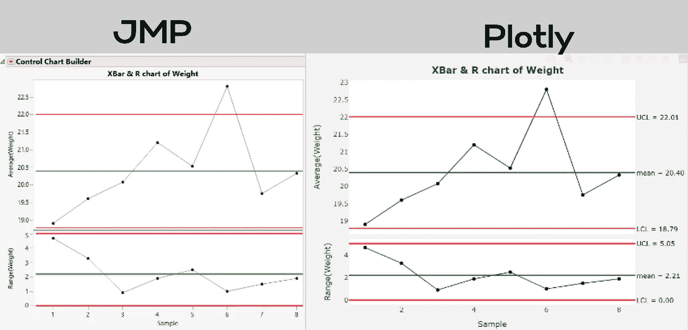

控制图比较(作者制作)

控制图用于监控过程变化。它们有助于确定过程变化是随机的、自然的，还是来自于潜在变量的变化。这些通常用于制造环境，以确保高标准的质量和效率。

代码:

chart studio 的模板:

## 2)彩色控制图:

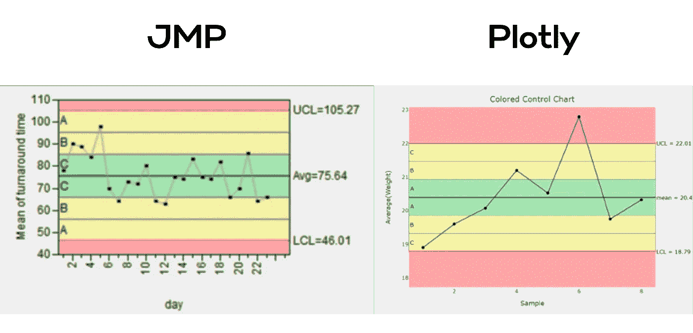

彩色控制图对比(作者制作)

代码:

chart studio 的模板:

## 3)可变性测量图:

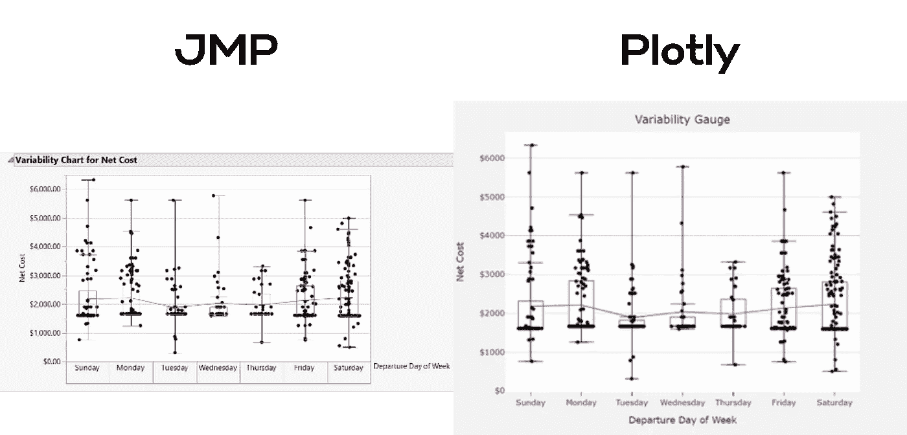

可变性测量图比较(由作者制作)

可变性测量图显示了过程的变化如何在多个类别之间变化。在对复杂问题进行故障排除以试图找到问题根源时，它们非常有用。在工程和制造领域，测量多种模式下的机器一致性非常有用。

代码:

chart studio 的模板:

## 4)散点图矩阵:

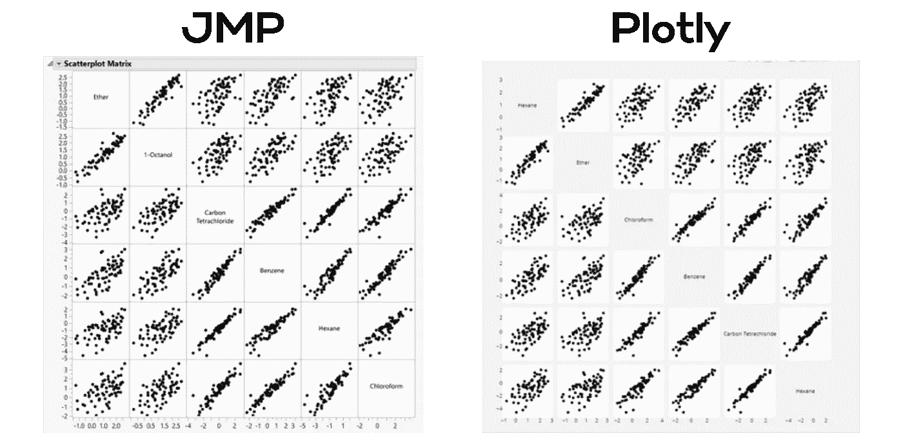

散点图矩阵比较(作者制作)

散点图矩阵是评估多个变量之间相互关系的强大工具。他们绘制了散点图的所有双变量组合，这允许快速分析在一个图像中哪些关系是强有力的。当您拥有高维多变量数据时，尤其是具有高度相关性的数据时，它们会非常有用。它们在可视化和识别异常值时也很有用。

代码:

chart studio 的模板:

## 5)直方图:

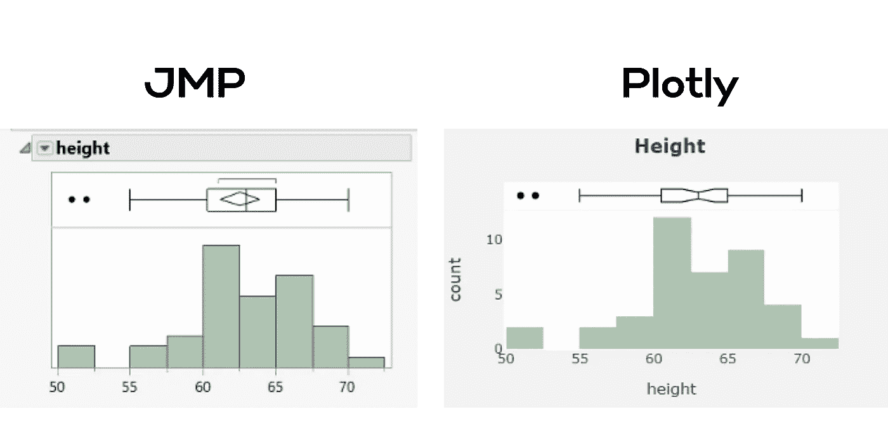

直方图比较(作者制作)

直方图是数字数据的近似表示。它们是查看数据集“形状”的简单方法。它们可用于查看过程是遵循高斯分布还是均匀分布。JMP 还在柱状图顶部放置了一个水平箱线图，以强调四分位数和潜在的异常值。

代码:

chart studio 的模板:

## 6)箱线图:

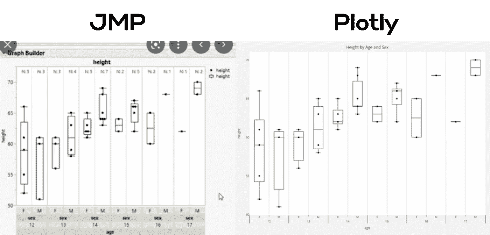

箱线图比较(作者制作)

箱线图是观察变量分布的好方法。在这种情况下，我们使用一个具有两个级别的分割分类 x 轴。数据按年龄和性别进行了划分，显示了两个分类变量的值如何变化，并允许快速了解数据中的模式。

代码:

chart studio 的模板:

## 7)三元图:

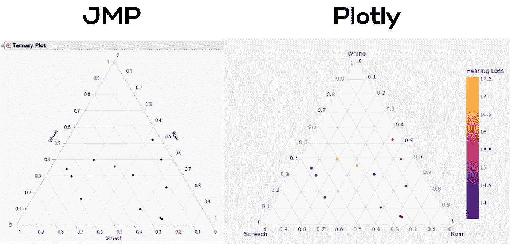

三元情节对比(作者制作)

三元图一次显示三个变量及其关系。三条边中的每一条都代表一个变量，通常从端到端具有 0 到 1 的值。它们在生物学、化学、地质学等经常使用组件的领域中应用广泛。

代码:

chart studio 的模板:

## 8)平均值的置信区间:

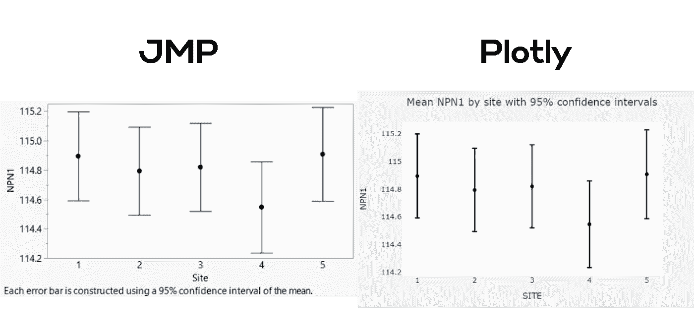

均值比较的置信区间(作者制作)

置信区间图可能看起来很基本，但它们是比较一个类别中变量平均值的非常简单的方法。如果所列各组之间存在显著差异，它们会迅速让眼睛消化。

代码:

chart studio 的模板:

## 9)热图:

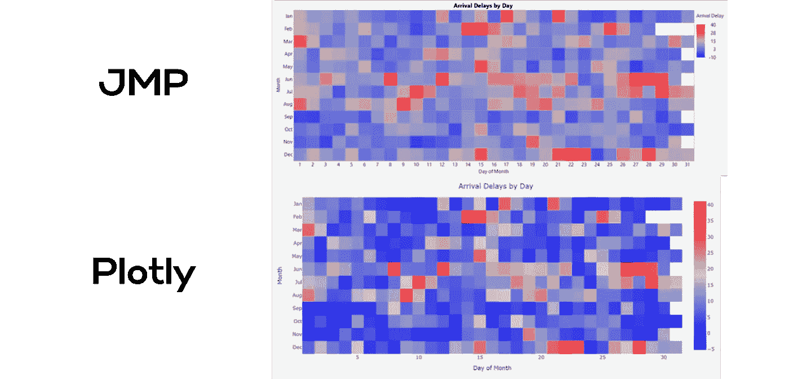

热图对比(作者制作)

热图对于可视化多个变量之间的差异以及理解它们之间的关系非常有用。它们对于查看具有趋势和模式的时间序列数据以及高维数据(如制造或传感器数据)非常有用。通常他们遵循一个连续的颜色方案，允许容易消化一个可变的组合对目标结果的影响。它们也很容易允许分组和模式理解。

代码:

chart studio 的模板:

## 10)剥离地块:

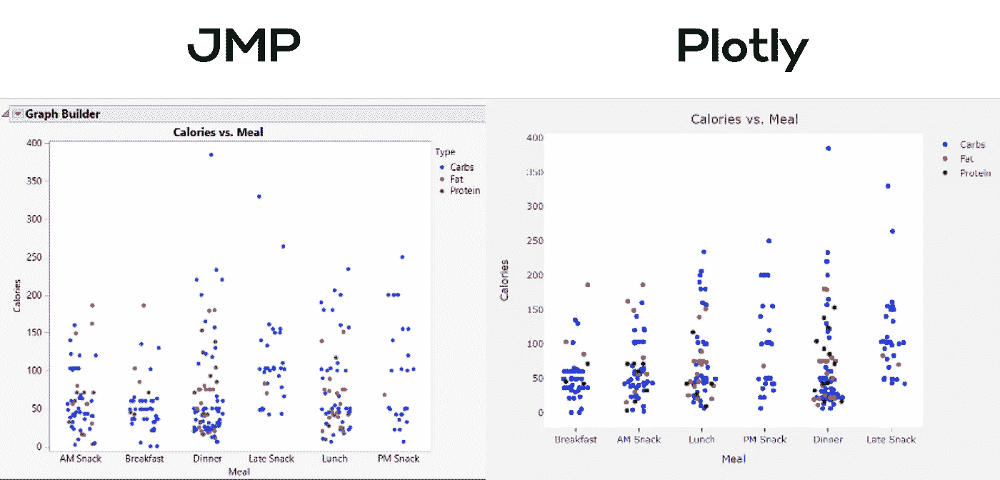

剥离图比较(由作者制作)

条状图或点状图类似于散点图，其中一个维度是绝对的。他们使用一个叫做“抖动”的术语来稍微向左或向右移动点，这样点就不会重叠。它们用于查看异常值和跨多个类别的分布，如果点是彩色的，甚至允许使用另一个分类变量。

代码:

chart studio 的模板:

## 11)树形图:

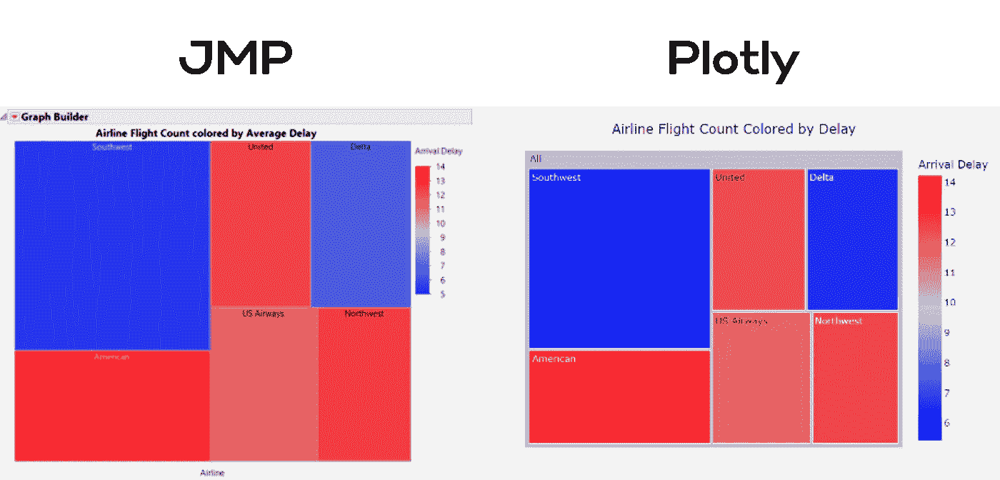

树形图比较(作者制作)

树形图是显示类别和两个定量变量之间关系的有趣方式。当显示数据集有多个层的分层数据时，它们也很有用。它们的工作原理是尺寸的格式塔原理和人类区分不同尺寸矩形的能力。最常见的情况是，矩形的大小与某种形式的数量相关。

代码:

chart studio 的模板:

## 12)多折线图:

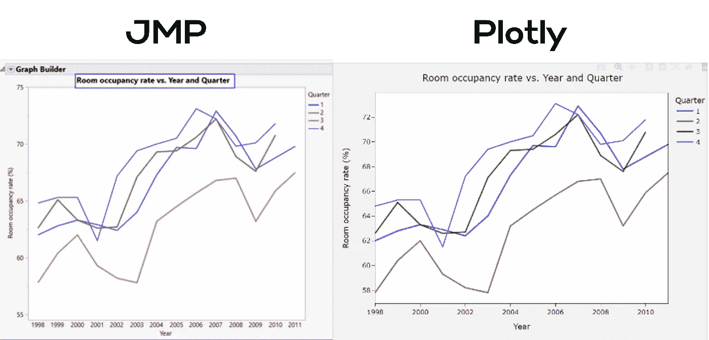

多折线图比较(图片由作者提供)

折线图经常被用来说明变量是如何随时间变化的。它们对于理解制造系统非常有用，可以说明之前发生的事情。

代码:

chart studio 的模板:

# 结论:

当使用 Plotly 时，重新制作 JMP 可视化是快速和方便的。只用了几行代码，我们就能够重新创建这些图，并几乎完全匹配格式！如果使用 Chart Studio，我们甚至不需要代码！

最棒的是。我们为你做了繁重的工作！你所需要做的就是复制 Plotly 代码，修改几行来导入你的数据，然后你就可以重新制作图表了！或者对于那些对编码不太感兴趣的人，只需点击嵌入式 Chart Studio 小部件中的“编辑图表”,就可以在 Chart Studio 中处理数据了。

你甚至可以使用 [Plotly 的 Dash](https://plotly.com/dash/) 来为优秀的分析应用程序创建一系列图表和用户界面小部件(Dash 这个术语是杜撰的，现在被业内许多人使用)。这些应用程序是在线托管的，可以通过简单的链接共享。

迫不及待想看看你做了什么。