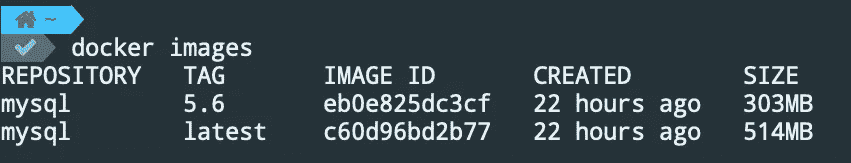
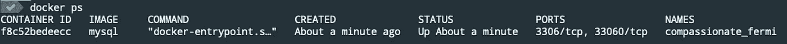
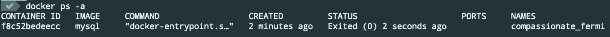

# 你应该知道的 12 个基本 Docker 命令

> 原文：<https://towardsdatascience.com/12-essential-docker-commands-you-should-know-c2d5a7751bb5?source=collection_archive---------1----------------------->

## 简化您的软件开发


照片由 [Aron Yigin](https://unsplash.com/@aronyigin?utm_source=medium&utm_medium=referral) 在 [Unsplash](https://unsplash.com?utm_source=medium&utm_medium=referral) 上拍摄

ocker 已经成为软件工程不可或缺的一部分。我们使用 Docker 进行开发、测试和部署，因为它易于管理环境。由于它的可移植性，它在软件行业变得流行起来。这意味着如果你的代码在开发中有效，它将在生产中有效。此外，开发人员可以更快地协作，而不必担心他们需要安装哪个软件依赖项。

在这篇文章中，我将介绍 12 个基本的 docker 命令，它们将帮助你在 Docker 的神奇世界中导航。你可以从 Docker 的[文档](https://docs.docker.com/engine/reference/commandline/docker/)页面找到这些命令的官方文档。

# 1.docker 搜索

我们可以使用命令`docker search`在 Docker hub 上搜索公共图像。它将返回有关图像名称，描述，明星，官方和自动化的信息。

```
docker search MySQL
```

如果你喜欢基于图形用户界面的搜索选项，使用 Docker Hub [网站](https://hub.docker.com/)。

# 2.码头工人拉动

现在我们知道了图像的名称，我们可以使用命令`docker pull`从 Docker hub 中提取它。这里，我们还设置了平台选项。

```
docker pull --platform linux/x86_64 mysql
```

标签用于识别存储库中的图像。如果我们不指定标签，Docker 引擎默认使用`:latest`标签。所以，在前面的例子中，Docker 提取了`mysql:latest`图像。

如果我们的应用程序依赖于图像的特定版本，我们可以使用标记名来指定。

```
docker pull --platform linux/arm64/v8 mysql:5.6
```

因为我们可以在一个存储库中有多个图像，所以我们可以使用`--all-tags`选项提取所有的图像。以下命令将从 mysql 存储库中提取所有图像。

```
docker pull --all-tags mysql
```

# 3.docker 图像

太棒了，现在我们的本地机器上应该有一些图像了，为了确认，让我们运行下面的命令来列出所有的本地图像。

```
docker images
```



docker 图像

在我的例子中，我有两个在上一步中下载的图像。

# 4.码头运行

好了，现在我们有了一些图像，我们可以试着创建一个容器。这里我们使用了`--env`选项来设置一个强制的环境变量，使用`--detach`选项来在后台运行容器。

```
docker run --env MYSQL_ROOT_PASSWORD=my-secret-pw --detach mysql
```

此外，我们可以使用`--name`选项为容器指定一个名称。如果我们不提供名称，Docker 会随机分配一个名称。

# 5.docker ps

我们可以使用以下命令列出所有正在运行的容器。

```
docker ps
```



把所有的集装箱都列出来，包括停止的，怎么样？我们可以通过添加`--all`选项来实现。

```
docker ps --all
```



# 6.码头停车

要停止一个容器，使用带有容器 id 或容器名称的`docker stop`命令。如果我们想改变 docker 运行命令，我们可以停止一个容器。

```
docker stop f8c52bedeecc
```

# 7.docker 重启

让我们使用下面的命令重新启动停止的容器。我们可能需要在重启机器后使用它。

```
docker restart f8c52bedeecc
```

# 8.docker 重命名

现在，让我们将集装箱名称从`compassionate_fermi`改为`test_db`。我们可能希望更改名称，以便更容易地跟踪我们的容器。

```
docker rename compassionate_fermi test_db
```

# 9.码头经理

通过运行以下命令来访问正在运行的容器`test_db`。如果我们想访问 MySQL 命令行并执行 MySQL 查询，这很有帮助。

```
docker exec -it test_db bash
mysql -uroot -pmy-secret-pw
SHOW DATABASES;
```

`-i and -t`选项用于在交互模式下访问容器。然后我们提供想要访问的容器的名称，在本例中是`test_db`。最后，`bash`命令用于获取容器内部的 bash shell。

# 10.码头日志

这个命令有助于调试我们的 Docker 容器。它将从指定的容器中获取日志。

```
docker logs test_db
```

如果我们想继续流式传输新的输出，我们可以使用选项`-follow`。

```
docker logs -follow test_db
```

# 11.码头工人室

如果我们想删除一个容器，我们可以使用下面的命令。

```
docker rm test_db
```

您可能会遇到类似这样的错误

> 来自守护程序的错误响应:您无法删除正在运行的容器……在尝试删除或强制删除之前停止该容器

正如它所建议的，我们可以先停止容器，然后移除它，或者使用选项`-f`来强制移除正在运行的容器。

```
docker stop test_db
docker rm test_db
# or
docker rm -f test_db
```

# 12.码头工人 rmi

最后，如果我们想释放一些磁盘空间，我们可以使用带有映像 id 的`docker rmi`命令来删除一个映像。

```
docker rmi eb0e825dc3cf
```

这些命令带有大量有用的选项。如果您想了解其他可用选项，运行`docker command_name --help`命令。例如:

```
docker logs --help
```

我几乎每天都用 Docker 进行开源开发。它允许其他人轻松地为项目做贡献，而不用担心如何运行项目。希望这 12 个 Docker 命令能帮助你入门 Docker。如果你想了解更多关于 Docker 的知识，那么看看下面的文章。编码快乐！

# 相关职位

</how-to-mount-a-directory-inside-a-docker-container-4cee379c298b>  </the-complete-guide-to-docker-volumes-1a06051d2cce> 