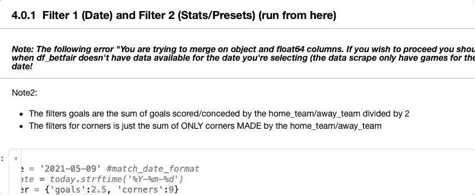

# 12 款 Jupyter 笔记本扩展，让您的生活更加轻松

> 原文：<https://towardsdatascience.com/12-jupyter-notebook-extensions-that-will-make-your-life-easier-e0aae0bd181?source=collection_archive---------1----------------------->

## Jupyter 笔记本电脑的重要扩展功能，可提高您的工作效率。


由 [Max Duzij](https://unsplash.com/@max_duz?utm_source=medium&utm_medium=referral) 在 [Unsplash](https://unsplash.com?utm_source=medium&utm_medium=referral) 上拍摄的照片

Jupyter Notebook 是数据科学家的首选计算笔记本，您可以在其中创建不仅包含实时代码，还包含公式、可视化和文本的文档。然而，默认情况下，Jupyter Notebook 缺少一些有用的功能，如自动完成、目录、代码折叠等。

这就是为什么我决定列出一个有用的 Jupyter 笔记本扩展列表，它将使您的生活更加轻松，并提高您编写代码的效率。下面您可以找到本文中列出的所有扩展。

```
**Table of Contents** 1\. [How to Install Extensions](#c42a)
2\. [Move selected cell](#bdf1)
3\. [Enable autocompletion (Hinterland)](#48e1)
4\. [Shortcuts to run multiple cells (Runtools)](#ef13)
5\. [Search files inside Jupyter Notebook (Tree filter)](#26b0)
6\. [Hide input (Hide input + Hide input all)](#7f6c)
7\. [Snippet Menu](#6f02)
8\. [Add a Table of Content (Table of Content 2)](#ed76)
9\. [Scrathpad](#435e)
10\. [Codefolding](#edca)
11\. [Variable inspector](#bcb8)
12\. [Translate text inside Jupyter Notebook (nbTranslate)](#1802)
13\. [Bonus: Change Themes](#7224)
```

# 如何安装扩展

要安装扩展，请在命令提示符或终端中运行以下代码

```
pip install jupyter_contrib_nbextensions
```

然后运行下面的代码，将 nbextensions 文件添加到 Jupyter 服务器的搜索目录中。

```
jupyter contrib nbextension install
```

现在打开 Jupyter 笔记本。应该有一个名为“Nbextensions”的新选项卡。点击它，你会看到一堆扩展，你可以用它来提高你的工作效率。


作者图片

以下是我觉得最有用的扩展。

## 移动选定的单元格

这是一个非常有用的扩展，允许你使用快捷键`Alt-up`和`Alt-down`来移动选中的单元格。只需选中 Nbextensions 中的“移动所选单元格”框。然后，刷新笔记本，您将能够通过简单的击键来移动单元格。


作者图片

## **E**enable**自动完成(腹地)**

**对于那些努力在 Jupyter 笔记本上写代码的人来说，这是一个非常有用的扩展，因为没有自动完成功能。通过选中“腹地”框，您将在 Jupyter 笔记本上启用自动完成功能，并且能够像在您最喜欢的编辑器中一样编写代码。**

****

**作者图片**

## **运行多个单元的快捷方式(运行工具)**

**Runtools 提供了许多额外的功能来处理 IPython 笔记本中的代码单元。其中一些是运行上面的单元格(⌥A)、运行下面的单元格(⌥B)和运行所有单元格(⌥X).要启用它，请选中 Nbextensions 中的“Runtools”框(在那里您也可以找到完整的快捷方式列表)。一旦它被激活，你会在工具栏中看到下面的图标。**

****

**作者图片**

**单击它打开带有这些代码执行按钮的浮动工具栏。**

****

**作者图片**

## **在 Jupyter 笔记本中搜索文件(树形过滤器)**

**此扩展允许您在 Jupyter 笔记本文件树页面中按文件名进行过滤。**

****

**作者图片**

## **隐藏输入(隐藏输入+隐藏所有输入)**

**您可以通过分别选中“隐藏所有输入”和“隐藏输入”来隐藏所有单元格的输入或特定单元格的输入。之后，工具栏中会出现以下图标。左边的一个将帮助你隐藏所有代码单元格的代码，而第二个只隐藏特定的单元格。**

****

**作者图片**

## **代码片段菜单**

**对于那些喜欢备忘单的人来说，“摘录菜单”是 Jupyter 笔记本中必须包含的扩展。启用它后，您会看到一个名为“Snippet”的新菜单项，它将允许您插入代码和 markdown 代码片段。例如，Pandas 库有许多可用的代码片段，可以帮助您记住有用的 Pandas 方法。**

****

**作者图片**

## **添加目录(目录 2)**

**写了许多行代码后，浏览你的笔记本会变得很困难。这就是为什么您应该添加一个目录，通过收集笔记本中包含的所有标题并在侧栏中显示它们，使导航更容易。**

**要在 Jupyter 笔记本中启用目录，请选中 Nbextensions 中的“目录(2)”框。之后，刷新笔记本，你会在工具栏中看到下面的图标。**

****

**作者图片**

**点击它以显示类似图片的目录(您需要至少有一个降价 h1、h2 或 h3 才能在内容部分看到它们)**

****

**作者图片**

## **便条簿**

**您是否曾经想要在不修改笔记本文档的情况下测试新的代码行？您可以使用“便签簿”扩展来完成此操作。只要启用它，您就能够在当前内核上执行代码，而无需修改笔记本文档。启用后，右下角会出现以下图标。**

****

**点击它或使用快捷键`Ctrl-B` 打开草稿栏。在那里，您可以通过使用`Shift-Enter`或任何其他应用于笔记本文档的快捷方式来执行代码。**

****

## **代码折叠**

**这个扩展允许代码单元中的代码折叠。只需启用 nbextension 选项卡中列出的“Codefolding”扩展，然后您会在代码单元格的左边看到一个三角形。**

****

**点击它或者使用快捷键`Alt+F` 来折叠代码。有三种不同的折叠模式支持:缩进折叠，括号折叠，和魔术折叠。**

## **变量检查器**

**如果你想跟踪你在笔记本中使用的所有变量，你应该启用“变量检查器”扩展。这将帮助您查看所有已定义的变量名称、类型、大小和形状**

**启用后，工具栏中应该会出现以下图标。**

****

**点击它显示一个浮动窗口，收集所有已定义的变量。窗口可拖动、可调整大小和可折叠。**

***注意:打开“变量检查器”后，我发现了一些小故障。如果你也找到它们，只需关闭“变量检查器”。***

## **翻译 Jupyter 笔记本中的文本(nbTranslate)**

**每当你必须阅读用外语写的笔记本时，这最后一个扩展将非常有用。只需启用“nbTranslate”扩展，然后你会在工具栏中看到两个新图标。**

****

**作者图片**

**右边的图标帮助您配置主要和辅助语言。设置完成后，当您想要将 markdown 单元格翻译成您的母语时，请单击左侧的图标。**

****

**作者图片**

## **奖励:改变主题**

**Jupyter 笔记本上有很多可用的主题。首先，你需要安装`jupyterthemes.`打开一个终端并写**

```
pip install jupyterthemes
```

**在此之后，要查看可用主题列表，请编写`jt -l`**

**对于这个例子，我将选择“onedork”主题。若要更改主题，请编写以下代码。**

```
jt -t onedork -T -N
```

**其中`-T`是工具栏可见的，`-N`是名称&标识可见的(您甚至可以通过在上面的代码中添加`-kl`来显示内核标识)**

***注意:你也可以在一个笔记本中完成所有这些，只需在一个命令前添加* `*!*` *符号(如* `*!*jt -l`)**

****

**作者图片**

***就是这样！希望本文中列出的扩展对您有用。***

**下面你可以找到几个你可以开始在 Jupyter 笔记本上工作的项目。**

**</a-beginners-guide-to-text-classification-with-scikit-learn-632357e16f3a>  </a-simple-guide-to-automate-your-excel-reporting-with-python-9d35f143ef7>  <https://medium.datadriveninvestor.com/i-used-to-pay-180-yr-for-a-profitable-betting-tool-this-year-i-built-one-in-python-dda1a9b9581f>  </a-complete-yet-simple-guide-to-move-from-excel-to-python-d664e5683039>  

[**与 3k 以上的人一起加入我的电子邮件列表，获取我在所有教程中使用的 Python for Data Science 备忘单(免费 PDF)**](https://frankandrade.ck.page/bd063ff2d3)**