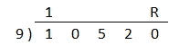
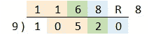
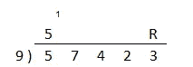
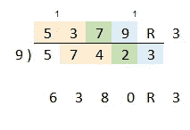

# 12 个数学窍门帮助你不用计算器就能解决问题

> 原文：<https://towardsdatascience.com/12-math-tricks-to-help-you-solve-problems-without-a-calculator-704fdd663286?source=collection_archive---------2----------------------->

## 在你的脑子里解决它


克里斯·贾维斯在 [Unsplash](https://unsplash.com?utm_source=medium&utm_medium=referral) 上的照片

# **加法+减法**

## 1.添加

第一个技巧是通过把问题分成小块来简化它。例如，我们可以重写

```
567 + 432 
= 567 + (400 + 30 + 2)
= 967 + 30 + 2 
= 997 + 2 
= **999**
```

## 转换

添加一个较小的数字通常更容易，所以不要用 131 + 858，而是交换数字

```
858 + 131 
= 858 + 100 + 30 + 1 
= **989**
```

## 2.减法

使用一个数的补数有助于使减法更容易。补数是原始数和一个整数的差，比如 100，1000。

以下是一些数字及其补数与 100 比较的例子:

```
67:33, 45:55, 89:11, 3:97
```

请注意，第二个数字加起来是 10，第一个数字加起来是 9。

这很有帮助

```
721–387  
# the complement of 87 is 13, so we can swap 387 with 400 – 13
-> 721 — (400 - 13) 
= 321 - -13 
= 321 + 13
= **334**
```

另一种方法是写出较大的数字，使其以 99 结尾。同一个例子:

```
721 -> (699 + 22)
= 699 – 387 + 22 
= 312 + 22 
= **334**
```


克里斯·利维拉尼在 [Unsplash](https://unsplash.com?utm_source=medium&utm_medium=referral) 上的照片

# **乘法运算**

## 3.上午 11 点左右的点心

对于两位数，将数字相加，并将答案放在要相乘的数字的中间:

```
35 x 11 
-> 3**_**5 
-> 3+5 = 8 
-> 3**8**5
```

如果总和大于 10，将十位数加到左边下一栏，并将一位数写在答案中。比如 4+8 = 12，写下 2，把 1 进位到下一列。

```
48 x 11 
-> 4_8 
-> 4+8 = 12 
-> 4,12,8 
-> **528**
```

对于三位数和更大的数字，这个过程稍微复杂一点，但是它以类似的方式工作。这次保留第一个和最后一个数字，并成对求和

```
725 X 11 
-> 7__5 
-> 7_,(7+2=9), (2+5=7), _5 
-> **7975**51973 x 11 
-> 5__3 
-> 5_,(5+1=6),(1+9=10), (9+7=16), (7+3=10), _3 
# where the sum is greater than ten we move the tens digit into the next column 
-> 5,(6+1),(0+1),(6+1),(0),3 
-> **571703**
```

## 4.九

乘以 9 可以简化为乘以 10 再减去原来的数

```
799 x 9 
= 799 x (10 -1) 
= 7990 – 799 
= **7191**
```

对任何以 9 结尾的内容使用相同的方法

```
72 x 89 
= 72 x (90–1) 
= (70 x 90) + (2 x 90) — 72 
= 6300 + 180–72 
= **6408**
```

## 5.如何解正方形

你可以用这个公式把一个平方方程改写成更容易处理的数字

```
n^2 = (n+d)(n-d) + d^2 
```

其中 n 是要平方的数字，d 是差值

这里有一个例子

```
57^2 
= (57+3)(57–3) + 3^2
# we add 3 to 57, as 60 is easier to multiply than 57, and subtract 3 from the second 57
-> 60 x 54 + 9 
= 3000 + 240 + 9 
= **3249**
```

最终的例子是，当你平方一个以 5 结尾的数，然后将一个数向上舍入到最接近的 10，将另一个数向下舍入到最接近的 10，再加上 25。

```
65^2 
= (60 x 70) + 5^2 
= 4200 + 25 
= **4225**
```

## 6.紧密结合法

相似的方法也适用于相近的数字相乘。该公式适用于所有数字，但除非数字相似，否则它不能很好地简化。

这是公式。n 是“基数”

```
(n+a)(n+b) = n(n + a + b) + ab
```

一个例子:

```
47 x 43 
= (40 + 7)(40 + 3) 
= 40 x (40 + 3 + 7) + (7 x 3)
= (40 x 50) + (7 x 3) 
= 2000 + 21 
= **2021**
```

在这个例子中，一位数加起来是十，所以我们的“基数”和乘数是整数(40 和 50)。

这是另一个例子。减少较小的数字以达到最接近的整数——我们的基数，在本例中是 40。将差额加到较大的数字上。基数的倍数和更大的数。最后，加上原始数和基数之差的乘积。

```
47 x 42 
= (40 + 7) x (40 + 2) 
= (40 + 7 + 2) x 40 + (7 x 2)
= (49 x 40) + (7 x 2) 
= (40 x 40) + (40 x 9) + (7 x 2)
= 1600 + 360 + 14 
= **1974**
```

也可以四舍五入到基数。由于原始数字小于基数，我们将两个负数的乘积相加。

```
47 x 42 
= (50 x 39) + (-3 x -8) 
= (50 x 30) + (50 x 9) + (-3 x -8)
= 1500 + 450 + 24 
= **1974**
```

这也适用于三位数。在这种情况下，基数在我们的数之间，所以乘积是负数。

```
497 x 504 
= (500 – 3) x (500 + 4)
= (500) x (500 + 4 - 3) + (-3 x 4)
= 500 x 501 - 12
= 250,000 + 500 – 12
= **250,488**
```


桑德罗·舒赫在 [Unsplash](https://unsplash.com?utm_source=medium&utm_medium=referral) 上的照片

# **师**

## 7.简化计算

你甚至可以在开始之前简化一些方程。例如，将除数和被除数都除以 2。

```
898 / 4 
= 449 / 2 
= 224 and ½
```

注意，用这种方法，你必须把余数写成一个分数:

```
898/4 has a remainder of 2 — divided by 4
449/2 has a remainder of 1 — divided by 2
```

分数相同，但绝对数不同。

除以 5 时，将等式乘以 2。除以 10 要容易得多。例如:

```
1753/5 
= 3506 / 10
= **350.6**
```

## 8.可分性检验

有很多方法可以快速判断一个数是否是因子。

**2** :数量为偶数。

```
Example 28790 is even, so it is divisible by 2.
```

**3** :位数之和能被 3 整除。

```
Example: 1281 -> 1+2+8+1 = 12 
-> 12 is a multiple of 3, so 1281 is divisible by 3
```

**4** :最后两位数能被 4 整除。为什么会这样？100 是 4 的倍数，所以我们只需检查后两位。

```
Example: 1472, 72 is divisible by 4, so 1472 is divisible by 4.
```

**5** :数字以 5 或 0 结尾。

```
Example: 575 ends in 5, so it is divisible by zero
```

**6** :数是偶数，位数之和能被 3 整除。6 是 3 x 2，所以 2 和 3 的规则适用。

```
Example: 774 is even and 7+7+4 = 18 
-> 18 is divisible by 3, so 774 is divisible by 6.
```

**7** :给你的数字加上或减去 7 的倍数，使其以零结尾。将最后一个数字和零一起删除，然后重复这个过程。继续，直到你能确定结果是否能被 7 整除。

```
Example: 2702 add 98 (7 x 14) -> 2800, drop the zeroes
-> 28 is a multiple of 7, so 2702 is divisible by 7.
```

**8** :后三位数能被 8 整除。

```
Example: 79256, 256 is divisible by 8, so 79256 is divisible by 8.(Alternate rule: if the hundreds digit is **even**, last **2** digits divisble by 8, if hundreds digit is **odd**, last **2** digits **+ 4** divisible by 8)
```

9 :和 3 一样的规则，但是用了 9。如果数字之和能被 9 整除，那么这个数就能被 9 整除。

```
Example: 13671 -> 1+3+6+7+1 = 18 
-> 18 is divisible by 9, so 13671 is divisible by 9
```

**10** :数字以 0 结尾。

```
Example: 280 ends in 0, 280 is divisible by 10
```

**11** :与 3、9 规则相似，从右边数字开始，其余数字交替加减。如果答案是零，或者是 11 的倍数，那么这个数可以被 11 整除。

```
Example: 12727 -> 1 - 2 + 7 - 2 + 7 = 11, so 12727 is divisible by 11.
```

你可以在这里查看一些附加的方法[。](https://en.wikipedia.org/wiki/Divisibility_rule)

## 9.用 9 除大数

```
Example:
-> 10520/9
```



在等式上方写下第一个数字，在最后一个数字上方写下“R”(表示余数)。把你刚写的数字和它右下方的数字加起来。把这个新数字写在第二点上。将该数字添加到右下方的数字中。继续这个过程，直到你到达 r。



将相同颜色的数字相加，得出下一个数字

最后，将 R 下面的数字加上最后一位数，得到余数。

```
10520/9
= **1168 R8**
or 1168.889
```

这是另一个例子:

```
-> 57423/9
```



这一次，在我们完成第一步之后，我们的第一个数字和斜下方和右边的数字之和大于 10(5+7 = 12)。我们在第一个数字上加 1，然后从中减去 9。(我们以 9 为基数除数，所以我们减去 9 而不是 10)。将得到的数字放在第二个位置(12–9 = 3)。继续同样的过程。



在这个例子中，我们的余数大于 9 (9+3 = 12)。再一次，我们在前一位数上加 1，从余数中减去 9，剩下 3。现在将结果和进位数字相加。

```
57423 / 9 
= **6380 R3** or 6380.333
```


照片由[艾莉森·庞](https://unsplash.com/@alisonpang?utm_source=medium&utm_medium=referral)在 [Unsplash](https://unsplash.com?utm_source=medium&utm_medium=referral) 上拍摄

# **百分比和分数**

## 10.反过来问

百分比是关联的，所以有时颠倒问题的顺序会更容易计算。

```
Example: 
What’s 36% of 25 
-> is the same as 25% of 36 
-> 25% is ¼ 
-> 36/4 = 9 
36% of 25 is **9**
```

## 11.分数

正如您在上一个示例中看到的，它有助于了解分数以及它们与百分比的关系。

```
1/2 = 50%1/3 = 33.33%, 2/3 = 66.67%,1/4 = 25%, 3/4= 75%1/5 = 20%, 2/5 = 40% …1/6 = 16.67%, 5/6 = 83.33% (2/6 = 1/3, 3/6 = 1/2, 4/6 = 2/3)1/7 = 14.2857%, 2/7 = 28.5714%, 3/7 = 42.8571%, 4/7 = 57.1428%  (note the recurring .142857 pattern)1/8 = 12.5%, 3/8 = 37.5%, 5/8 = 62.5%, 7/8 = 87.5%1/9 = 11.11%, 2/9 = 22.22%, 3/9 = 33.33% …1/10 = 10%, 2/10 = 20% …1/11 = 9.09%, 2/11 = 18.18%, 3/11 = 27.27% …1/12 = 8.33%, 5/12 = 41.67%, 7/12 = 58.33%, 11/12 = 91.67%
```

## 12.第七十二条规则

72 法则提供了在给定的百分比回报率下，一项投资翻一番需要多少年的估计。它的工作原理是将 72 除以百分比，得到的答案是翻倍所需的年数。

```
2% -> 72/2 = 36, approximately 36 years to double
8% -> 72/8 = 9, approximately 9 years to double
```

请注意，72 的规则是基于自然对数 2 的指导原则，自然对数 2 给出 0.693。所以 69.3 的规则会更准确，但是 72 更容易计算。

投资翻三倍也有 114 法则，投资翻四倍也有 144 法则。

# 额外资源

我发现亚瑟·本杰明的两本书在这个话题上很有帮助。这篇博客中的许多例子都是受这些书的启发。你可以在这里查阅。

[](https://www.amazon.com/Magic-Math-Solving-Figuring-Out/dp/0465096212/) [## 数学的魔力:求解 x 并找出原因

### 购买数学的魔力:在 Amazon.com 上为 x 求解并找出原因合格订单免费送货

www.amazon.com](https://www.amazon.com/Magic-Math-Solving-Figuring-Out/dp/0465096212/) 

[https://www . Amazon . com/Secrets-Mental-Math-Math magicians-Calculation/DP/0307338401/](https://www.amazon.com/Secrets-Mental-Math-Mathemagicians-Calculation/dp/0307338401/)

如果您觉得这有帮助，请留下评论，或者分享您遇到的任何其他有用的技巧。