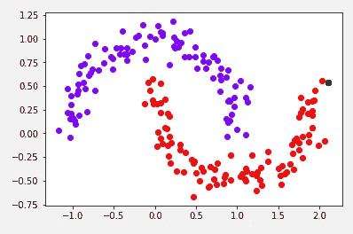
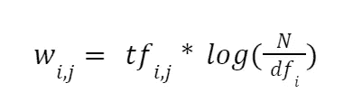
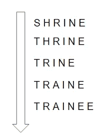
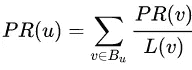
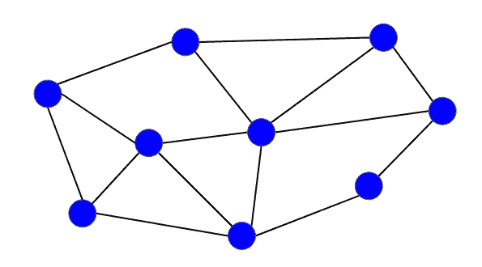
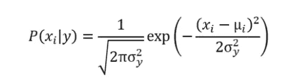
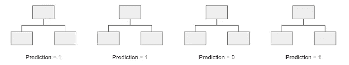
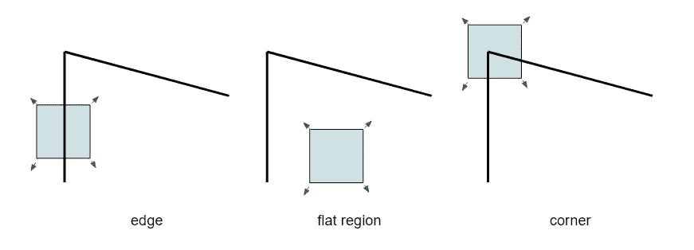

# 圣诞节 12 天的 12 个有用算法

> 原文：<https://towardsdatascience.com/12-useful-algorithms-for-12-days-of-christmas-62e4e789f3f6?source=collection_archive---------3----------------------->

## 所有数据科学家都应该知道的非常酷的算法

由 freepik 创建的背景向量—[www.freepik.com](http://www.freepik.com)

> ***务必*** [***订阅此处***](https://terenceshin.medium.com/membership) ***千万不要错过另一篇关于数据科学的指南、诀窍和技巧、生活经验等文章！***

# 介绍

又到了一年的这个时候了！这一次，不是[圣诞节 12 天的 12 个数据科学项目](/12-data-science-projects-for-12-days-of-christmas-aff693f5ed2b)，我想和你们分享 12 个非常酷、非常强大的算法，我们不只是在谈论监督算法。

我们在同一页上，一个**算法**是一系列用于解决问题的指令。从技术上来说，菜谱是一种算法，但我们将专注于与数据科学相关的算法。

我将更多地关注每个算法背后的逻辑，而不是数学，但我会提供额外的资源以防万一。:)

说到这里，让我们开始吧！

# 1.基于密度的噪声应用空间聚类

作者创建的图像

## 这是什么？

DBSCAN，也称为基于密度的带噪声应用程序空间聚类，是一种聚类算法，它通过查找密集聚集在一起的区域(换句话说，具有许多近邻的点)来识别聚类。

DBSCAN 是最好的聚类算法(优于 k-means 聚类或层次聚类),原因如下:

*   它可以自己确定最佳的集群数量
*   它可以发现异常形状的集群，而不仅仅是圆形的
*   它足够健壮，不会受到离群值的影响

## 更多资源

 [## DBSCAN -维基百科

### 基于密度的含噪声应用空间聚类(DBSCAN)是由 Martin…

en.wikipedia.org](https://en.wikipedia.org/wiki/DBSCAN)  [## 机器学习中的 DBSCAN 聚类算法

### 在 2014 年，DBSCAN 算法被授予了时间检验奖(该奖项授予获得过…

www.kdnuggets.com](https://www.kdnuggets.com/2020/04/dbscan-clustering-algorithm-machine-learning.html)  [## DBSCAN 如何工作，为什么要使用它？

### 首先，这是我在 medium 上的第一个故事，如果我做错了什么，我很抱歉。其次，我不太擅长…

towardsdatascience.com](/how-dbscan-works-and-why-should-i-use-it-443b4a191c80) 

> ***一定要*** [***订阅这里***](https://terenceshin.medium.com/membership) ***千万不要错过另一篇关于数据科学的指南、诀窍和技巧、生活经验等文章！***

# 2.TF-IDF

TF-IDF 方程

## 这是什么？

TF-IDF 代表术语频率-逆文档频率，它用于确定一个词在语料库(文档集合)中作为文档的重要性。

具体而言，给定单词的 TD-IDF 值相对于该单词在文档中出现的次数而增加，并随着语料库中也包含该特定单词的文档数量而减少。这是为了说明一般情况下更常用的单词。

TF-IDF 是自然语言处理和信息检索领域的一种流行技术。

## 更多资源

 [## tf-idf -维基百科

### 在信息检索中，tf-idf，TF*IDF，或 TFIDF，是词频-逆文献频率的缩写，是一个数字…

en.wikipedia.org](https://en.wikipedia.org/wiki/Tf%E2%80%93idf)  [## 理解 TF-ID:简单介绍

### TF-IDF(术语频率-逆文档频率)是一种统计方法，用于评估一个单词与一个文档的相关程度

monkeylearn.com](https://monkeylearn.com/blog/what-is-tf-idf/)  [## sklearn 的 tf-idf 矢量器如何计算 tf-idf 值-分析 Vidhya

### 这篇文章作为数据科学博客的一部分发表。在这篇博客中，我们将尝试打破 tf-idf 和…

www.analyticsvidhya.com](https://www.analyticsvidhya.com/blog/2021/11/how-sklearns-tfidfvectorizer-calculates-tf-idf-values/) 

# 3.Apriori 算法

## 这是什么？

Apriori 算法是一种关联规则算法，最常用于确定项目集中相互关联最紧密的项目组。

举个例子，假设我们有一个顾客在杂货店购物的数据库。Apriori 算法可用于确定哪些商品对或商品组最常一起购买。

主要有两个参数:支持度和信心。支持度指的是物品出现的频率，而置信度表示在一个或多个其他物品被购买的情况下，一个物品被购买的条件概率。

## 更多资源

 [## 先验- mlxtend

### Apriori 函数，用于从 mlxtend 中提取关联规则挖掘的频繁项集

rasbt.github.io](http://rasbt.github.io/mlxtend/user_guide/frequent_patterns/apriori/)  [## 什么是 Apriori 算法？

### Apriori 算法用于挖掘频繁项集和从事务型数据库设计关联规则。

www.educative.io](https://www.educative.io/edpresso/what-is-the-apriori-algorithm) 

# 4.霍尔特-温特斯指数平滑

## 这是什么？

霍尔特-温特斯指数平滑法，也称为三重指数平滑法，是一种流行的预测技术，用于显示趋势和季节性的时间序列数据。

它被称为三重指数平滑，因为它考虑了数据的水平、数据的趋势和数据的季节性。

这种预测方法相对于其他方法(如 ARIMA)的优势在于:

*   理解和实现起来很简单
*   它相当准确
*   而且它的计算成本很低，也不占用太多资源

## 更多资源

 [## 指数平滑-维基百科

### 指数平滑是一种使用指数窗口平滑时间序列数据的经验法则…

en.wikipedia.org](https://en.wikipedia.org/wiki/Exponential_smoothing)  [## 霍尔特-温特斯指数平滑法

### 时间序列数据的超快速预测工具

towardsdatascience.com](/holt-winters-exponential-smoothing-d703072c0572)  [## Python - Machine 中时间序列预测的指数平滑法简介

### 指数平滑法是一种用于单变量数据的时间序列预测方法，可以扩展到支持具有以下特征的数据

machinelearningmastery.com](https://machinelearningmastery.com/exponential-smoothing-for-time-series-forecasting-in-python/) 

> ***务必*** [***订阅此处***](https://terenceshin.medium.com/membership) ***千万不要错过另一篇关于数据科学指南、诀窍和技巧、生活经验等的文章！***

# 5.矩阵分解

## 这是什么？

矩阵分解算法是一种常用于构建推荐系统的[协同过滤](https://en.wikipedia.org/wiki/Collaborative_filtering)算法。

[摘自维基百科，可以免费分享](https://en.wikipedia.org/wiki/File:Collaborative_filtering.gif)

协同过滤背后的思想是基于其他相似用户的兴趣来预测给定用户的兴趣。这被称为基于记忆的方法，但另一种方法是基于模型的方法，其中使用机器学习算法来预测用户对未评级项目的评级。

## 更多资源

 [## 矩阵分解(推荐系统)-维基百科

### 矩阵分解是一类用于推荐系统的协同过滤算法。矩阵分解…

en.wikipedia.org](https://en.wikipedia.org/wiki/Matrix_factorization_%28recommender_systems%29)  [## 推荐系统—矩阵分解

### 矩阵分解的漫游推荐系统

towardsdatascience.com](/recommendation-system-matrix-factorization-d61978660b4b)  [## 矩阵分解|推荐系统|谷歌开发者

### 矩阵分解是一个简单的嵌入模型。给定反馈矩阵 a \(\在 r^{m \乘以 n}\)，其中\(m\)是…

developers.google.com](https://developers.google.com/machine-learning/recommendation/collaborative/matrix) 

# 6.莱文斯坦距离

作者创建的图像

## 这是什么？

Levenshtein 距离是一种简单的算法，用于确定两个字符串之间的相似性。

具体来说，它等于将一个单词更改为另一个单词的最小单字符编辑(替换、添加、删除)次数。

例如，“taco”和“eggs”之间的 Levenshtein 距离是 4。“十字”和“纵横字谜”之间的 Levenshtein 距离也是 4。直觉上，这些对排序相同是很奇怪的，这显示了这种算法的局限性。

所以，我推荐的两个更好的字符串相似性算法是 Trigram 和 Jaro-Winkler 算法。

## 更多资源

 [## 莱文斯坦距离-维基百科

### 在信息论、语言学和计算机科学中，Levenshtein 距离是一个字符串度量，用于测量…

en.wikipedia.org](https://en.wikipedia.org/wiki/Levenshtein_distance)  [## 在 Python | Paperspace 博客中实现 Levenshtein 距离

### Levenshtein 距离是一种文本相似性度量，它比较两个单词并返回一个表示…

blog.paperspace.com](https://blog.paperspace.com/implementing-levenshtein-distance-word-autocomplete-autocorrect/) 

# 7.页面等级

## 这是什么？

PageRank 是 Google 创建的一种算法，用于对他们的网页进行搜索结果排名。根据谷歌的说法，“ *PageRank 的工作原理是统计一个页面的链接数量和质量，以确定对该网站重要性的粗略估计。潜在的假设是，更重要的网站可能会从其他网站收到更多的链接*。

简化公式如下:

对于链接到页面 u 的所有页面，页面 u 的页面排名等于页面 v 的页面排名之和除以来自页面 v 的链接数量

## 更多资源

 [## 页面排名-维基百科

### PageRank ( PR)是 Google Search 使用的一种算法，用于在其搜索引擎结果中对网页进行排名。它被命名为…

en.wikipedia.org](https://en.wikipedia.org/wiki/PageRank)  [## 谷歌的 PageRank 算法:解释和测试

### PageRank 算法(或简称 PR)是由拉里·佩奇和谢尔盖·布林在哈佛大学开发的网页排名系统

www.link-assistant.com](https://www.link-assistant.com/news/google-pagerank-algorithm.html) 

# 8.Dijkstra 算法

作者创建的图像

## 这是什么？

Dijkstra 算法是一种用于在节点图中寻找从起始顶点(节点)到目标顶点(节点)的最短路径的算法。

Dijkstra 的算法采用贪婪的迭代方法，生成一组信息，其中包括从一个起始顶点到图形中每隔一个顶点的最短路径(见下面的视频)。

Dijkstra 的算法通常用于寻找最短的运输路线，确定最短的石油线路长度，并在一些社交媒体应用程序中使用。

## 更多资源

 [## 迪克斯特拉的算法-维基百科

### Dijkstra 的算法(DYKE-strəz)是一种寻找图中节点间最短路径的算法，它可能…

en.wikipedia.org](https://en.wikipedia.org/wiki/Dijkstra%27s_algorithm)  [## Python 中的图形:Dijkstra 算法

### Dijkstra 算法是一种寻找图中节点间最短路径的算法。它是由一个…

stackabuse.com](https://stackabuse.com/dijkstras-algorithm-in-python/) 

> ***务必*** [***订阅此处***](https://terenceshin.medium.com/membership) ***千万不要错过另一篇关于数据科学的指南、诀窍和技巧、生活经验等文章！***

# 9.ε-贪婪算法

## 这是什么？

ε-贪婪算法是解决[多臂强盗问题](https://en.wikipedia.org/wiki/Multi-armed_bandit)的一种简单方法，该问题代表了探索与开发的两难选择。

这个问题背后的想法是，有 k 个不同的选择，每个选择都有不同的回报，但是你不知道任何一个选择的回报。所以，你从*探索*不同的选择开始，随着时间的推移，在*探索*更多的选择和*开发*报酬最高的选择之间有一个权衡。

使用ε-贪婪算法，在时间的一部分ε中选择一个随机的备选项。其余时间(1-ε)，选择已知最高支出(奖励)的备选项。ε是一个必须设置的参数。

更好的解决方案包括置信上限解决方案和贝叶斯汤普森抽样。

## 更多资源

 [## 强化学习中的ε-贪婪算法

### 在强化学习中，代理人或决策者学习做什么-如何将情况映射到行动-以便…

www.geeksforgeeks.org](https://www.geeksforgeeks.org/epsilon-greedy-algorithm-in-reinforcement-learning/)  [## 多臂土匪-维基百科

### 在概率论和机器学习中，多臂土匪问题(有时称为土匪问题)是一个…

en.wikipedia.org](https://en.wikipedia.org/wiki/Multi-armed_bandit#Optimal_solutions) 

# 10.高斯朴素贝叶斯

## 这是什么？

朴素贝叶斯是一种基于贝叶斯定理的分类最大似然算法。

更具体地说，高斯朴素贝叶斯是一种朴素贝叶斯，它假设连续变量遵循正态分布，并由以下等式表示:

虽然朴素贝叶斯持有非常不切实际的假设，但它速度快，易于实现，并且适用于多类预测。这使得它在实时预测、多类预测、文本分类，甚至补充推荐系统方面很受欢迎。

## 更多资源

 [## 5 分钟内对朴素贝叶斯的数学解释

### 用一个例子彻底解释朴素贝叶斯

towardsdatascience.com](/a-mathematical-explanation-of-naive-bayes-in-5-minutes-44adebcdb5f8)  [## 1.9.朴素贝叶斯

### 朴素贝叶斯方法是一组监督学习算法，基于应用贝叶斯定理和“朴素”学习理论

scikit-learn.org](https://scikit-learn.org/stable/modules/naive_bayes.html) 

# 11.随机森林分类器

## 这是什么？

随机森林算法是一种集成学习算法，它涉及创建多个决策树，然后选择每个决策树的所有预测的模式。通过使用投票系统，或“多数获胜”模型，它减少了个别树的可能性误差。结果是一个更准确、更稳健、偏差更小的模型。

作者创建的图像

用这个图像，如果我们创建一个决策树，第三个，它会预测 0。但是通过使用所有四个决策树，预测值将是 1。

## 更多资源

 [## 了解随机森林

### 该算法如何工作以及为什么如此有效

towardsdatascience.com](/understanding-random-forest-58381e0602d2) 

# 12.哈里斯角探测器

## 这是什么？

Harris 角点检测器是一种在计算机视觉算法中用来识别图像中的角点的算子。这对于图像处理和计算机视觉是很重要的，因为已知角点是图像中的重要特征。

基本直觉如下:

作者创建的图像

*   在**平坦的**区域，任何方向都没有渐变(颜色变化)。
*   在**边缘**区域，边缘方向没有梯度变化。
*   只有在**角**区域中，在所有方向上都有梯度变化

因此，在整个图像中使用这种方法来确定图像中的角点在哪里。

## 更多资源

 [## 哈里斯角点检测器简介

### Harris 角点检测器是一种角点检测算子，常用于计算机视觉算法中提取…

medium.com](https://medium.com/data-breach/introduction-to-harris-corner-detector-32a88850b3f6)  [## 哈里斯角探测器-维基百科

### 哈里斯角点检测器是一种角点检测算子，通常用于计算机视觉算法中，以…

en.wikipedia.org](https://en.wikipedia.org/wiki/Harris_corner_detector) 

# 感谢阅读！

> 被 ***确定要*** [***订阅此处***](https://terenceshin.medium.com/membership) ***千万不要错过另一篇关于数据科学指南、诀窍和技巧、生活经验等的文章！***

不确定接下来要读什么？我为你选了另一篇文章:

 [## 2022 年你应该知道的所有机器学习算法

### 最流行的机器学习模型的直观解释

towardsdatascience.com](/all-machine-learning-algorithms-you-should-know-in-2022-db5b4ccdf32f) 

**还有一个:**

 [## 2021 年 10 大最佳数据可视化

### 关于财富分配、环境、新冠肺炎等等的令人敬畏的可视化！

towardsdatascience.com](/the-10-best-data-visualizations-of-2021-fec4c5cf6cdb) 

# 特伦斯·申

*   ***如果你喜欢这个，*** [***订阅我的媒介***](https://terenceshin.medium.com/membership) ***获取独家内容！***
*   ***同样，你也可以*** [***关注我上媒***](https://medium.com/@terenceshin)
*   [***报名我的个人简讯***](https://terenceshin.substack.com/embed)
*   ***跟我上***[***LinkedIn***](https://www.linkedin.com/in/terenceshin/)***其他内容***