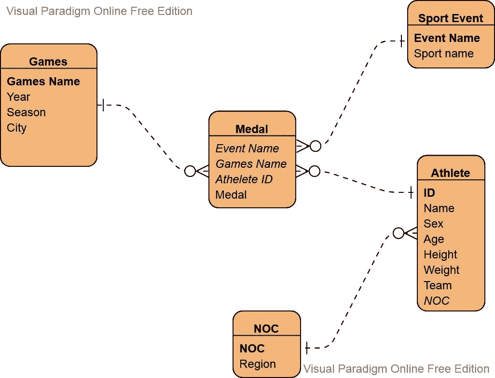
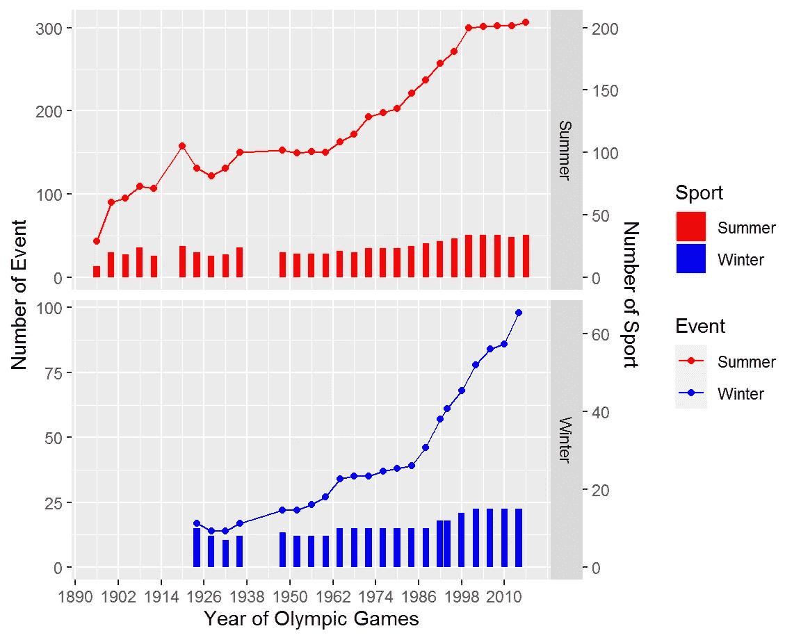
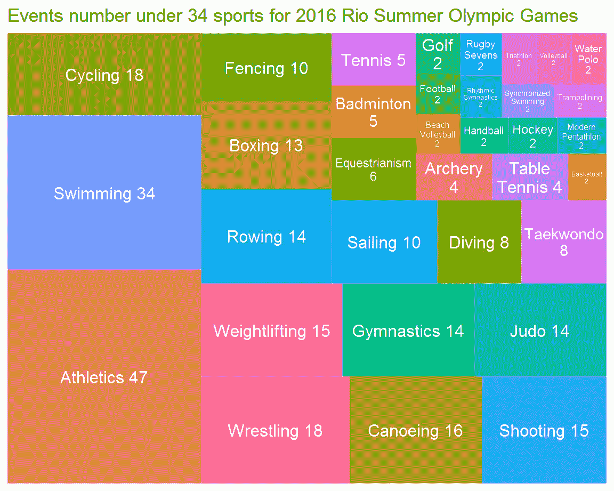
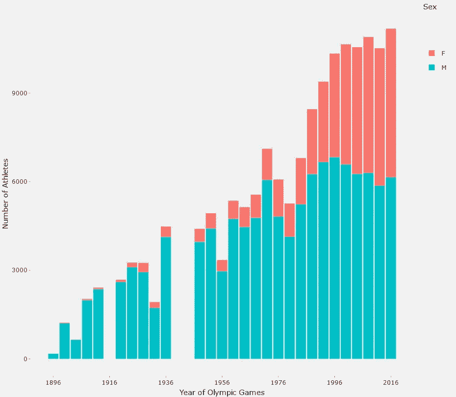
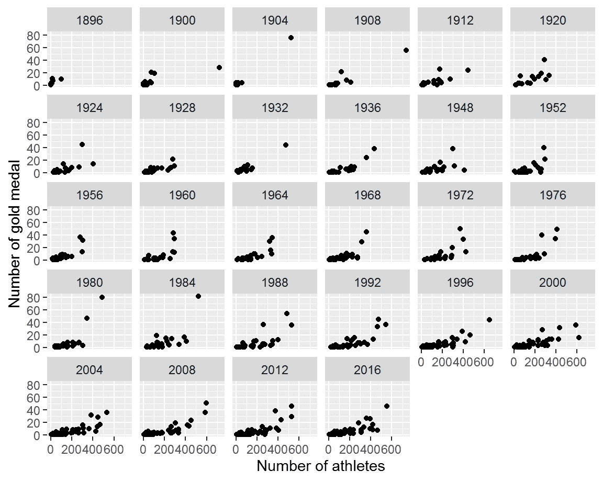
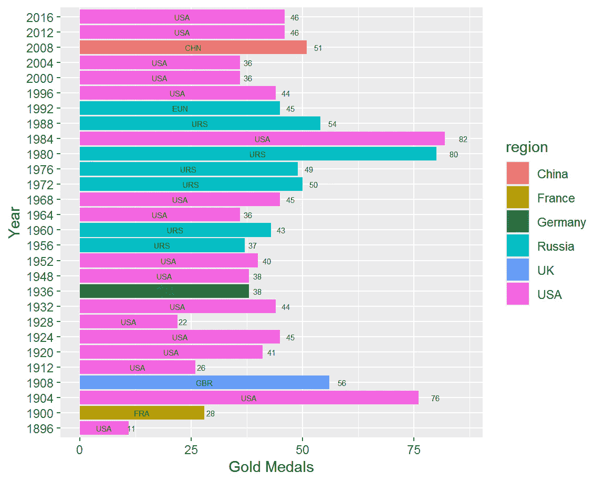
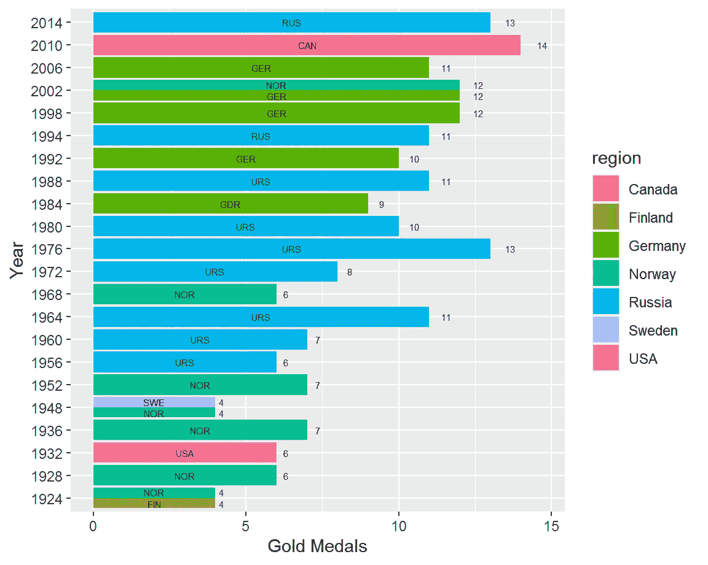
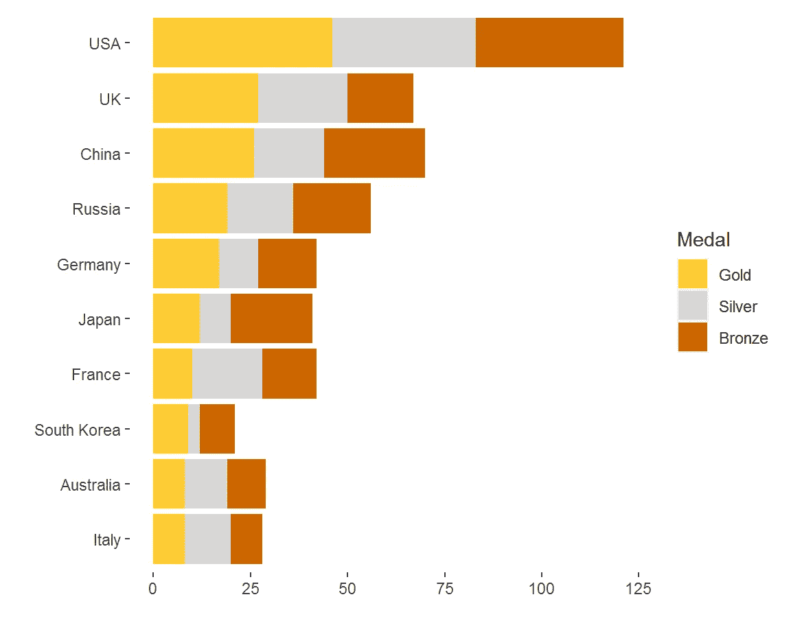
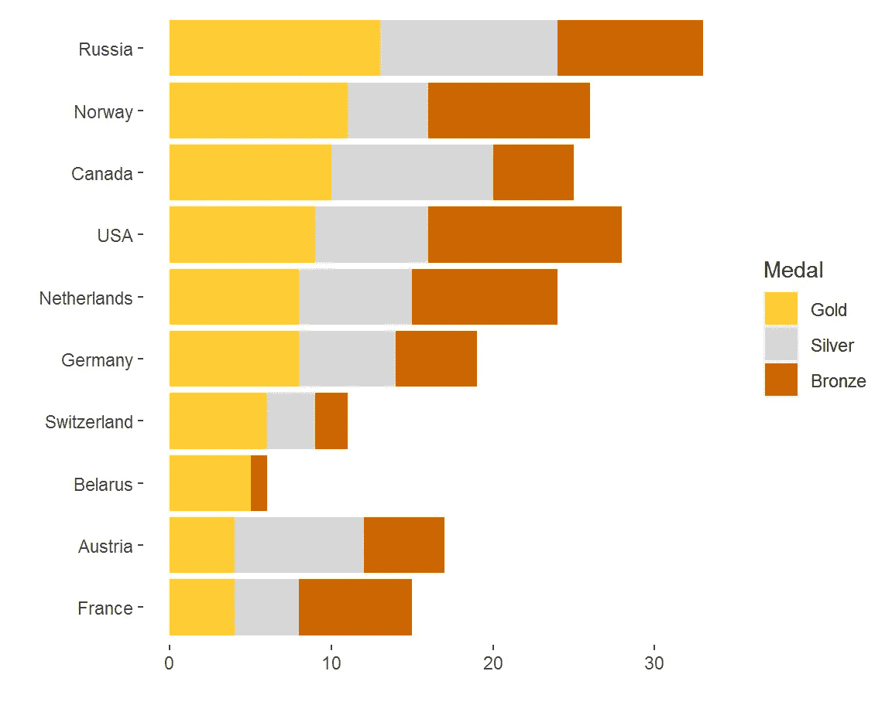

# 奥运会 120 年

> 原文：<https://towardsdatascience.com/120-years-of-olympic-games-56411bc4bd53?source=collection_archive---------21----------------------->

## 使用 R flexdashboard、ggplot2 和 plotly 实现数据可视化

布莱恩·特纳在 [Unsplash](https://unsplash.com/) 上的照片

# 介绍

东京奥运会刚刚结束，我想回顾一下现代奥运会 120 年的历史。现代奥运会是主要的国际体育赛事，包括夏季和冬季体育比赛。创作灵感来自公元前 8 世纪至公元 4 世纪在希腊奥林匹亚举行的古代奥运会。第一届现代奥运会于 1896 年在雅典举行。

# 数据准备

## 数据源

数据从这个 kaggle 链接下载:[https://www . ka ggle . com/hee soo 37/120-years-of-Olympic-history-sports-and-results](https://www.kaggle.com/heesoo37/120-years-of-olympic-history-athletes-and-results)。这个数据集是 rgriffin 在 2018 年 5 月创建的。

## 数据探索

该数据集下有两个 csv 文件。AthleteEvents 包含参加每项赛事的运动员的详细信息。它有运动员的身高、体重、年龄和名字，运动和事件以及结果(赢得的奖牌)。nocRegion 包含三个字母的 NOC 名称和各自的区域。基于以上信息，我得到了如下的实体关系图。

作者图片

# 数据分析

我决定使用 R flexdashboard 来可视化这个数据集。需要安装和加载几个 R 包。

在 flexdashboard 中，我们可以设计多个页面，每个页面用“=”表示。在每一页下面，我们可以用“-”来标记图表的区域。我决定用三页来显示结果。这三页将是:体育和事件，运动员和国家与奖牌。最终产品可以在这个[环节](https://rstudio-pubs-static.s3.amazonaws.com/802613_307cca443aec4e6791aacfe6fb381418.html)中找到。

## 1.运动和事件

我想看看夏季和冬季奥运会的运动项目数量的增长。我先准备好数据，命名为 fig_dat1。1906 年被排除在外，因为它通常不被认为是正式的奥运会。我计算每届夏季和冬季奥运会的不同运动和项目。

作者图片

我们可以看到运动项目的数量有了显著的增长。我们还可以确定在 1920 年、1940 年和 1944 年，由于第一次和第二次世界大战，有三届夏季奥运会和两届冬季奥运会缺席。

我还用树状图显示了 2016 年夏季奥运会和 2014 年冬季奥运会每个项目下的赛事数量。我用 tabset 两个在这个区域显示两个图表。

作者图片

## 2.运动员

我想知道每届奥运会的运动员人数和性别比例。我们可以看到越来越多的运动员，尤其是女运动员参加了奥运会。

作者图片

接下来我想看看每届奥运会上每个国家的运动员人数和金牌数之间的关系。我使用散点图，每个点代表一个 NOC。

作者图片

## 3.奖章

在这一部分，我想看看哪个国家在每届奥运会上获得最多的金牌。

作者图片

很明显，美国正在主宰夏季奥运会。在 28 届夏季奥运会中，它 17 次蝉联冠军！冬季运动会，俄罗斯相当强。

我希望看到 2016 年夏季奥运会和 2014 年冬季奥运会的奖牌排行榜。

作者图片

作者图片

# 结论

数据可视化是识别模式和从数据中获取洞察力的非常有效的方式。r 有很多用于数据准备和分析的软件包。GGplot2 是一个非常强大的图表绘制包，在 flexdashboard 模板的帮助下，可以非常方便地构建仪表板并部署到 web。