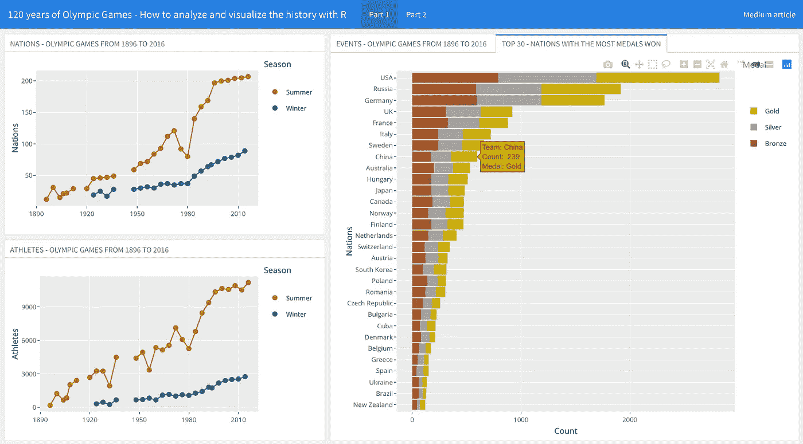
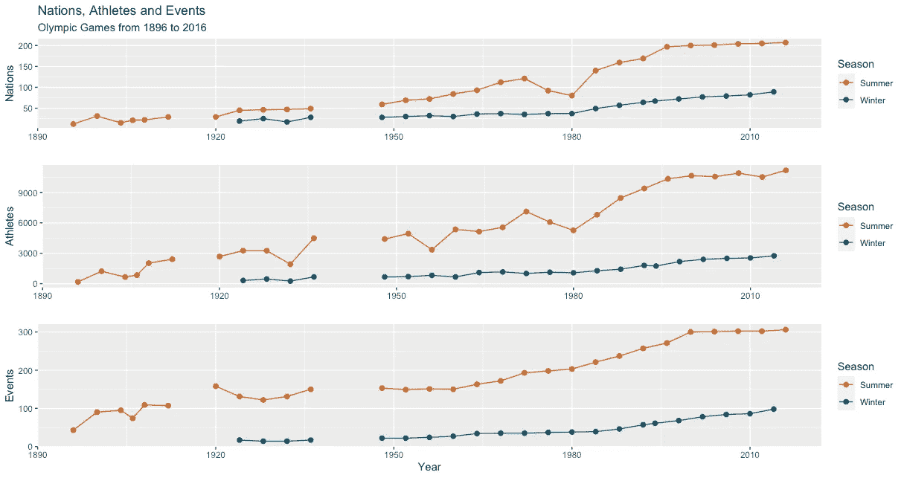
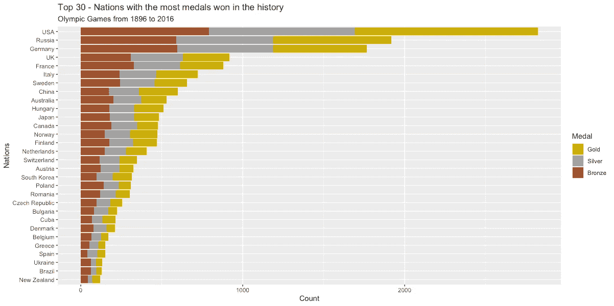
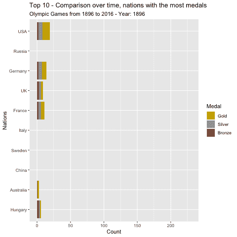
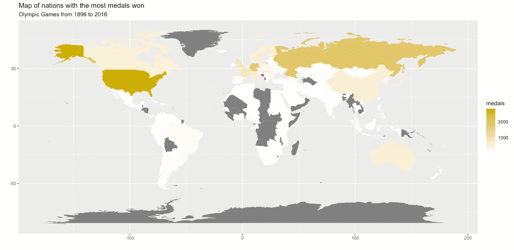
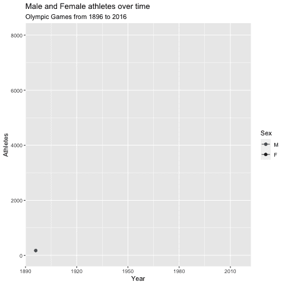

# 奥运会 120 年——如何用 R 分析和形象化历史

> 原文：<https://towardsdatascience.com/120-years-of-olympic-games-how-to-analyze-and-visualize-the-history-with-r-3c2a5f3bf875?source=collection_archive---------14----------------------->

## [实践教程](https://towardsdatascience.com/tagged/hands-on-tutorials)

## 找出哪些国家赢得了最多的奖牌，以及这些国家的参与程度是如何随着时间的推移而变化的



仪表板看到生成的关于奥运会的情节。文末的链接

我最喜欢的季节之一是奥运会到来的季节。许多运动员成为整整一代人的英雄，高举他们国家的名义，更重要的是，为儿童和青年提供了一个伟大的榜样和灵感。

从公元前 776 年到公元 393 年，古代奥运会在希腊的奥林匹亚举行。1503 年后，再次出现。1896 年，第一届现代奥运会在希腊雅典举行。从 1896 年雅典奥运会到 2016 年里约奥运会，所有的奥运会都被称为“现代奥运会”。1894 年，皮埃尔·德·顾拜旦男爵提出了这个想法。

在 1912 年到 1920 年之间，以及 1936 年到 1948 年之间，有两个很长的时期没有任何游戏，分别对应于一战和二战。


[阿莱士·史密斯](https://unsplash.com/@mcghavan?utm_source=medium&utm_medium=referral)在 [Unsplash](https://unsplash.com?utm_source=medium&utm_medium=referral) 上拍照

也许视觉分析最重要的好处是，它使复杂的数据更容易解释，同时以清晰、简洁和合适的方式呈现出来。这篇文章对 1896 年至 2016 年的奥运会进行了有益的可视化分析。本文旨在通过具体的分析实例，为您提供一个高效、实用、方便的模型。

主要目的是演示如何从构建的系统的可视化表示中获益。在向人们介绍奥运会的同时，用户界面非常重要，而且简单，很容易用 RStudio 制作。

这篇文章的主要问题是:哪些国家最占优势？参与是如何演变的？哪些国家的各个学科奖牌最多？参加奥运会的男女比例是多少？

# 数据准备

数据特征:事件(夏季和冬季)，体育层面的数据，艺术比赛不包括在运动员数据中(侧重于田径)

在对各种数据集进行广泛研究后，120 年的奥运会正在接受代表性检查。它的数据集有几个优势，包括作为一个跨越 1896 年至 2016 年的大规模数据集。最后但并非最不重要的一点是，奥运会数据集被认为值得从视觉表现的角度进行研究，并提供最佳的用户体验。

此外，这篇文章旨在吸引对奥运会感兴趣的人，并直接回答他们的问题。为了回答这个主要问题，从 [**Kaggle**](https://www.kaggle.com/) 中选择了一个数据集，它由两个不同的表组成，运动员事件和事件区域。

要创建可视化效果，您将使用两种不同的数据框。在审查数据集后，决定不删除任何数据，而是使用 **dplyr** 软件包来操作和修改数据，使其更加适用和真实。

一些特征，比如运动员的年龄、体重和身高，在这些例子中没有实现，但是你可以用这些数据进行你自己的更广泛的分析。

也就是说，您可以开始了，首先，您需要加载将要使用的库，加载数据并进行第一次查看。

```
# REQUIRED LIBRARIESlibrary("gganimate")
library("data.table")
library("knitr")
library("gridExtra")
library("tidyverse")
library("plotly")# LOAD ATHLETES EVENTS DATAdataOlympics <- read_csv("datasets/athleteEvents.csv", col_types = cols(
                   ID = col_character(),
                   Name = col_character(),
                   Sex = col_factor(levels = c("M","F")),
                   Age =  col_integer(),
                   Height = col_double(),
                   Weight = col_double(),
                   Team = col_character(),
                   NOC = col_character(),
                   Games = col_character(),
                   Year = col_integer(),
                   Season = col_factor(levels = c("Summer","Winter")),
                   City = col_character(),
                   Sport = col_character(),
                   Event = col_character(),
                   Medal = col_factor(levels = c("Gold","Silver","Bronze"))
                 )
)glimpse(dataOlympics)
head(dataOlympics)
```

您将找到 271116 个观察值，在第一个数据集中有 15 个变量。现在，您将加载第二个数据集，其中包含 NOC(国家奥委会)信息。

```
# LOAD DATA MATCHING NOCs (NATIONAL OLYMPIC COMMITTEE) WITH COUNTRIESNOCs <- read_csv("datasets/nocRegions.csv", col_types = cols(
                  NOC = col_character(),
                  region = col_character()
                ))
glimpse(NOCs)
head(NOCs)
```

# 随着时间的推移，运动员、国家和项目的数量是增加了还是减少了？

这是你可以用第一个数据集中的数据回答的第一个问题。您可以创建一个可视化图形来识别国家和运动员以及事件的参与情况是如何变化的。

```
# NUMBER OF NATIONS, ATHLETES AND AND EVENTS, WITHOUT ART COMPETITIONSnumbers <- dataOlympics %>%
  group_by(Year, Season) %>%
  summarize(Nations = length(unique(NOC)), Athletes = length(unique(ID)), Events = length(unique(Event))
  )numbers <- numbers %>%
  mutate(gap= if(Year<1920) 1 else if(Year>=1920 & Year<=1936) 2 else 3)plotNations <- ggplot(numbers, aes(x=Year, y=Nations, group=interaction(Season,gap), color=Season)) +
  geom_point(size=2) +
  geom_line() +
  scale_color_manual(values=c("chocolate","deepskyblue4")) +
  labs(x = " ", y = "Nations", 
       title="Nations, Athletes and Events", 
       subtitle = "Olympic Games from 1896 to 2016")

plotAthletes <- ggplot(numbers, aes(x=Year, y=Athletes, group=interaction(Season,gap), color=Season)) +
  geom_point(size=2) +
  geom_line() +
  scale_color_manual(values=c("chocolate","deepskyblue4")) +
  xlab("")plotEvents <- ggplot(numbers, aes(x=Year, y=Events, group=interaction(Season,gap), color=Season)) +
  geom_point(size=2) +
  geom_line() +
  scale_color_manual(values=c("chocolate","deepskyblue4")) 

grid.arrange( plotNations, plotAthletes, plotEvents, ncol=1)
```

您将得到如下结果，您可以看到它是如何随着时间的推移而增加的。



120 年的奥运会——如何用 R 分析和可视化历史:绘制国家、运动员和事件随时间的变化

# 哪个国家获得的奖牌最多？

这是你可以回答的第二个问题，如果能够直观地显示每个国家获得的金牌、银牌和铜牌的比例，那将会很有趣。假设你想进入前 30 名。

```
# THE TOTAL NUMBER OF MEDALS GIVEN TO EACH TEAMmedalCounts <- dataOlympics %>% filter(!is.na(Medal))%>% 
  group_by(NOC, Medal, Event, Games) %>%
  summarize(isMedal=1)medalCounts <-  medalCounts %>% 
  group_by(NOC, Medal) %>%
  summarize(Count= sum(isMedal))medalCounts <- left_join(medalCounts, NOCs, by= "NOC" )medalCounts <- medalCounts %>% 
  mutate (Team = region)medalCounts <- medalCounts %>% select( Medal, Team, Count)# ORDERING TEAM BY TOTAL MEDAL COUNTlevelsTeam <- medalCounts %>%
  group_by(Team) %>%
  summarize(Total=sum(Count)) %>%
  arrange(desc(Total)) %>%
  select(Team) %>%
  slice(30:1)medalCounts$Team <- factor(medalCounts$Team, levels=levelsTeam$Team)medalCounts <- medalCounts %>% filter(Team != "NA")# PLOT MEDAL COUNTSggplot(medalCounts, aes(x=Team, y=Count, fill=Medal)) +
  geom_col() +
  coord_flip() +
  scale_fill_manual(values=c("gold3","gray64","sienna")) +
  labs(x = "Nations", y = "Count", 
       title="Top 30 - Nations with the most medals won in history", 
       subtitle = "Olympic Games from 1896 to 2016")
```

你会得到如下图。你可以看到美国、俄罗斯和德国是领先的国家。你的国家在顶端吗？可悲的是，我来自的国家不是。



奥运会 120 年——如何用 R 分析和可视化历史:描绘历史上获得奖牌最多的国家

# 哪个国家获得的奖牌最多？—动画剧情

另一个有趣和有吸引力的方法是用动画情节来显示以前获得的奖牌，它可以详细显示每个国家多年来获得的奖牌，假设为此你只需要前 10 名。

```
# NUMBER OF MEDALS GIVEN TO EACH TEAMmedalCounts <- dataOlympics %>% filter(!is.na(Medal))%>% 
  group_by(NOC, Medal, Event, Games, Year) %>%
  summarize(isMedal=1)medalCounts <-  medalCounts %>% 
  group_by(NOC, Medal, Year) %>%
  summarize(Count= sum(isMedal))medalCounts <- left_join(medalCounts, NOCs, by= "NOC" )medalCounts <- medalCounts %>% 
  mutate (Team = region)medalCounts <- medalCounts %>% select( Medal, Team, Count, Year)# ORDERING TEAM BY TOTAL MEDAL COUNTlevelsTeam <- medalCounts %>%
  group_by(Team) %>%
  summarize(Total=sum(Count)) %>%
  arrange(desc(Total)) %>%
  select(Team) %>%
  slice(10:1)medalCounts$Team <- factor(medalCounts$Team, levels=levelsTeam$Team)medalCounts <- medalCounts %>% filter(Team != "NA")# ANIMATED PLOT MEDAL COUNT

plotMedalsAnim<- ggplot(medalCounts, aes(x=Team, y=Count, fill=Medal)) +
  labs(x = "Nations", y = "Count", 
       title='Top 10 - Comparison over time, nations with the most medals', 
       subtitle = 'Olympic Games from 1896 to 2016 - Year: {frame_time}')  +
  transition_time(Year)+
  geom_col() +
  coord_flip() +
  scale_fill_manual(values=c("gold3","gray64","sienna"))

animate(plotMedalsAnim,fps=2)
```

你将得到一个吸引人的动画情节，如下图所示，如果你想知道你加载 **gganimate** 库的目的，这里是原因。



奥运会 120 年——如何用 R 分析和可视化历史:历史上获得奖牌最多的国家

# 查看地图，看看哪些国家赢得了最多的奖牌

另一种直观显示每个国家累积奖牌数量的方法是通过地图。这也将从总体上提供整个地球的视觉概观。

```
# MAP NATIONS WITH MOST MEDALS WONmedalCounts <- dataOlympics %>% filter(!is.na(Medal))%>% 
  group_by(NOC, Medal, Event, Games) %>%
  summarize(isMedal=1)medalCounts <-  medalCounts %>% 
  group_by(NOC, Medal) %>%
  summarize(Count= sum(isMedal))medalCounts <- left_join(medalCounts, NOCs, by= "NOC" ) %>% 
  select(region, NOC, Medal, Count)medalCounts <- medalCounts %>%
  group_by(region) %>%
  summarize(Total=sum(Count))data_regions <- medalCounts %>% 
  left_join(NOCs,by="region") %>%
  filter(!is.na(region))earth <- map_data("world")earth <- left_join(earth, data_regions, by="region")# PLOT MAPplotMapMedals <- ggplot(earth, aes(x = long, y = lat, group = group)) +
  geom_polygon(aes(fill = Total, label= region)) +
  labs(x = "", y = "", 
       title="Map of nations with the most medals won", 
       subtitle = "Olympic Games from 1896 to 2016") +
  guides(fill=guide_colourbar(title="medals")) +
  scale_fill_gradient(low="white",high="gold3")
plotMapMedalsggplotly(plotMapMedals)
```

然后你会看到一张类似下图的地图，在那里你可以看到那些直到 2016 年里约奥运会还没有获得一枚奖牌的国家，比如洪都拉斯、玻利维亚和阿尔巴尼亚。希望 2020 年东京奥运会对这些国家来说是一个很好的机会。



奥运会 120 年——如何用 R 分析和可视化历史:历史上获得奖牌最多的国家地图

# 一段时间内男女运动员的参与情况

我们知道，很长一段时间以来，不幸的是纵观历史，人类在许多方面大多是性别歧视的，奥运会运动员中包括女性也不例外。你可以看看在这次全球活动中包容性是如何增加或减少的。为了更吸引人，你可以创造另一个动画情节。

```
# PARTICIPATION OF MALE AND FEMALE ATHLETES OVER TIME, WITHOUT ART COPETITIONSdataOlympics <- dataOlympics %>% 
  filter(Sport != "Art Competitions")# AFTER 1992, CHANGE THE YEAR OF THE WINTER GAMES TO COINCIDE WITH THE NEXT SUMMER GAMES. THE TERM "YEAR" CURRENTLY REFERS TO THE OLYMPICS TOOK PLACEoriginal <- c(1994,1998,2002,2006,2010,2014)new <- c(1996,2000,2004,2008,2012,2016)for (i in 1:length(original)) {
  dataOlympics$Year <- gsub(original[i], new[i], dataOlympics$Year)
}dataOlympics$Year <- as.integer(dataOlympics$Year)# COUNT NUMBER OF ATHLETES BY SEX AND YEARcountsSex <- dataOlympics %>% 
  group_by(Year, Sex) %>%
  summarize(Athletes = length(unique(ID)))countsSex$Year <- as.integer(countsSex$Year)# PLOT MALE AND FEMALE ATHLETES OVER TIMEggplot(countsSex, aes(x=Year, y=Athletes, group=Sex, color=Sex)) +
  geom_point(size=2) +
  geom_line()  +
  transition_reveal(Year)+
  scale_color_manual(values=c("deepskyblue4","red4")) +
  labs(x = "Year", y = "Athletes", 
       title="Male and Female athletes over time", 
       subtitle = "Olympic Games from 1896 to 2016")
```

正如你所看到的，女性参加比赛的人数明显增加，然而，男性仍然占主导地位，尽管今天这种差异没有以前那么大。



奥运会 120 年——如何用 R 分析和可视化历史:男女运动员随时间的情节参与

现在你知道了如何处理数据，我邀请你继续用获得的信息进行你自己的分析，并回答许多其他有趣的问题。

非常感谢您的善意阅读。和我的大部分文章一样，我在一个 **flexdashboard** 中分享了用**plotely**生成的情节，我把它放在一起更美观一点:【https://rpubs.com/cosmoduende/olympic-games】T4

在这里你可以找到完整的代码:[https://github.com/cosmoduende/r-olympic-games](https://github.com/cosmoduende/r-olympic-games)

感谢你坚持到最后，祝你分析非常愉快，可以把一切都付诸实践，对结果感到惊讶，和我一样开心！