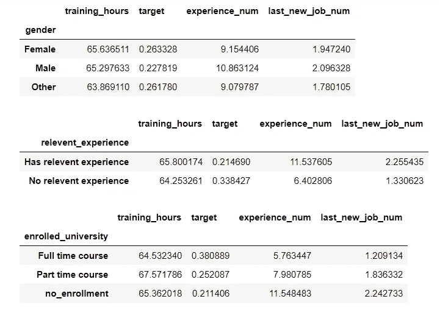

# EDA 分类任务的 13 个关键代码块

> 原文：<https://towardsdatascience.com/13-key-code-blocks-for-eda-classification-task-94890622be57?source=collection_archive---------2----------------------->

## 使用本快速指南探索机器学习分类任务的任何数据集


照片由[乔丹·惠特](https://unsplash.com/@jwwhitt?utm_source=medium&utm_medium=referral)在 [Unsplash](https://unsplash.com?utm_source=medium&utm_medium=referral) 拍摄

继我上一篇关于涵盖了**回归任务**(预测连续变量)的 EDA[11 个代码块的文章之后，下面是在**分类任务**(预测分类或二元特征)上执行 EDA 的 13 个代码块。](/11-simple-code-blocks-for-complete-exploratory-data-analysis-eda-67c2817f56cd)

EDA 或探索性数据分析是一个重要的机器学习步骤，它涉及到在不花费太多时间或迷失其中的情况下学习数据。在这里，您将熟悉数据集的结构和一般特征、独立和从属特征及其相互作用。您还将了解要使用的数据清理过程，以及可能的建模技术。

在本文中，我们将探索来自 Kaggle 的一个[数据集，该数据集是为一家为未来员工开设培训课程的公司提供的。任务是预测参加课程的学员是否打算换工作，是否会离开目前的职位加入公司，或者即使在完成课程后，是否会留在目前的工作岗位。因此，该任务是二元任务，并且目标是 0-停留(不寻找工作变化)，以及 1-离开(寻找工作变化)](https://www.kaggle.com/arashnic/hr-analytics-job-change-of-data-scientists)

数据可从 Kaggle 页面[下载，在同一页面上还有](https://www.kaggle.com/arashnic/hr-analytics-job-change-of-data-scientists)和特性定义。完整的工作流程代码在我的 GitHub 页面上的[这里](https://github.com/suemnjeri/medium-articles/blob/main/13%20EDA%20code%20blocks%20classification/HR%20EDA%20Full%20for%20medium.ipynb)，所以你可以跟随。

第一步是导入我们将在整个 EDA 项目中使用的库。然后，我们读入我下载并保存在 Jupyter 笔记本相同文件夹中的`train.csv`。我将在训练集上执行 EDA，因为它包含目标变量，我们有兴趣了解各个特征以及它们与目标特征的关系。

1.  **形状(数据帧的尺寸)**

DataFrame 有行和列，Pandas `.shape`属性返回一个长度为 2 的元组，每个值显示每个维度的长度，即(rows，columns)。

```
(19158, 14)
```

我们可以看到数据集有 19，158 行和 14 列。目标要素中的其中一列。

**2。各列的数据类型**

我们现在将显示所有列的数据类型。这有助于我们理解我们正在处理的数据类型，即数值分布和分类分布。这也将揭示一些探索性的情节和图表使用。

需要注意什么；

*   应该是数字的分类特征，反之亦然。


我们看到几个分类(对象)特征。我们还看到目标是浮动的，对于那些离职的人来说表示为 1.0，对于那些培训后留下来的人来说表示为 0.0。这使得`target`成为一个二元特征。

**3。显示几行**

我们现在将显示一小部分数据。我们使用`df.head()`显示前 5 行，`df.tail()`显示后 5 行，或者`df.sample()`从数据集中随机选取 1 行。`df.sample(5)`显示 5 个随机选择的行。

需要注意的事项:

*   列名有意义吗？您可以再次检查[列定义](https://www.kaggle.com/arashnic/hr-analytics-job-change-of-data-scientists)。
*   列中有哪些值？它们有意义吗？
*   您能看到大量缺失值(nan)吗
*   分类特征有哪些独特的类别？


该表让我们了解了不同特性中的值，列名是不言自明的。我们可以在`gender`和`company_size`等列中看到一些重要的缺失值。

## 数字分布

特性的分布是指该特性中的值出现的频率。对于数值(连续)要素，值按范围分组，也称为条柱。我们将使用**图**来绘制分布图，并直观地了解每一列中的值。我们还将显示包含实际分布数量的实际汇总统计数据**。使用图表和统计数据很重要，因为它们是相辅相成的。**

**4。绘制数字特征的直方图网格**

[直方图](https://www.mathsisfun.com/data/histograms.html)是一种条形图的形式，它将数字按范围分组，条形的高度显示有多少个值落在该范围内。我们将使用 [Panda 的](https://pandas.pydata.org/pandas-docs/stable/reference/api/pandas.DataFrame.hist.html) `df.hist()`函数来绘制数据集中每个数字特征的直方图。我们还将传递给函数`figsize=(8,8)`和 `xrot=45`来增加网格大小并旋转 x 轴以提高可读性。

需要注意什么；

*   潜在异常值
*   应该是分类(指示)特征的数字特征。例如，如果只有两个可能的值，如 0 和 1。
*   没有意义的边界，例如大于 100 的百分比值。


作者直方图

正如所料，我们看到`target`，我们的依赖特性，实际上是一个只有两个可能值的指示变量；0 和 1。`enrollee_id`是一个 ID 列，意味着每个值只出现一次，因此在所有箱中平均分布。

**5。显示数字特征的汇总统计数据**

我们将使用 Panda 的`df.describe()`函数返回每个数字特征的分析。

需要注意什么；

*   `count`，或者列中非 NaN 值的数量。如果计数小于数据框中的所有行，则该列包含缺失(NaN)值。
*   平均值，或`mean`。
*   `std`，或列中值的标准偏差
*   `minimum`值
*   `25th`百分位值
*   中位数，即`50th`百分位数
*   `75th`百分位数
*   `maximum`值。这也可能表示极端(异常)值。


作者描述性统计

我们看到任何列中都没有缺失值或显著的异常值。

## 分类特征的分布

分类特征是只包含少数唯一值的列，因此每个值属于一个特定的类或组。与数字特性一样，我们将使用图表和汇总统计数据来查看每一列中不同类的分布。

6。分类特征的汇总统计

我们将使用 Panda 的`df.describe(include=’object’)`，它只显示数据类型为`‘object’`的特性的分析。

需要注意什么；

*   `count`，即非 NaN 值的个数。如果计数小于数据帧的总行数，则存在缺失值。
*   `unique`类的数量。
*   `top` 最普通的价值或阶级。如果多个值出现次数最多，将显示任意的`top` (和`freq`)值。
*   频率(`freq`)，或者顶级类出现的次数。


按作者分类的汇总统计

我们可以看到许多特性都缺少值。

**7。绘制分类分布图**

现在，我们将绘制分类特征，以了解每个特征的类分布情况。我们将使用 Seaborn 的[计数图](https://seaborn.pydata.org/generated/seaborn.countplot.html)，它就像一个条形图，其中每个条代表一个类，高度是该类中值的数量。使用上面的汇总统计数据，我们看到一些特征，如`city`有许多独特的类，在绘制时可能不可读。我决定用 22 个或更少的独特类来绘制它们。

需要注意什么；

*   稀疏类—值很少的类。这些会影响模型的性能。
*   不一致的名称或错别字，如标记不同的两个类似的类。


作者的分类特征

我们现在可以看到在各种分类特征中类的分布。

## 按目标特征进行分段和分组

我们可以将数据分组，并观察分类特征和数字特征之间的关系，尤其是关于目标的关系。

**8。根据数字特征分割目标**

这里，我们将按目标特征分离数据，并观察数字特征如何在离开的人(目标= 1)和留下的人(目标= 0)之间分布。

我们将使用 Seaborn 的[箱线图](https://seaborn.pydata.org/generated/seaborn.boxplot.html)，它显示了一个数字特征的[五个数字的摘要](https://www.statisticshowto.com/statistics-basics/how-to-find-a-five-number-summary-in-statistics/)。这五个数字是最小值、第一个四分位数(Q1 或 25%标志)、中值(Q2)、第三个四分位数(第三季度或 75%标志)和最大值。查看[这篇](https://www.geeksforgeeks.org/how-to-show-mean-on-boxplot-using-seaborn-in-python/)文章，了解更多关于方框图的信息。


作者的箱线图

需要注意的事项:

*   哪个目标类受数字特征的影响最大

首先，让我们做一些清理工作，将两个分类列转换成数字列。

**动态数据清理/特征工程**

我们将把`experience` 和`last_new_job` 转换成数字特征，因为它们都代表学员的经验年限。这将使我们能够看到`experience`是如何影响受训者决定离开还是留在当前工作岗位的。下面的代码替换一列中的一些值，然后将整个列转换为浮点数据类型(`int`不起作用，因为这些列有`NaNs`

现在我们开始创建箱线图。我们首先将感兴趣的四个数字列保存在一个名为`num_cols`的列表中。然后，我们将遍历这些列，根据`target`创建每个特征的方框图。


按作者分类的方框图

我们可以看到`training_hours`平均分布在留下的人(`target` 0)和离开的人(`target` 1)之间。这意味着`training_hours`可能*而不是*是一个很好的目标预测器。然而，我们看到，当涉及到`experience` 和`last_new_job`时，更大比例的留下来的人倾向于更多年的经验，这些可能是很好的预测因素。

## 按目标类别划分类别特征

既然我们已经看到了目标如何随着数字特征而变化，我们将对分类特征做同样的事情。

9。使用 [**十字标签**](https://pandas.pydata.org/pandas-docs/stable/reference/api/pandas.crosstab.html) 将各种分类特征的目标制成表格

Panda 的`.crosstab(col1, col2)`函数构建了一个交叉制表表，显示两个分类特征之间的关系。该表显示了来自这两个特征的数据组出现的频率。您可以包含参数`normalize=’index’`来显示各行之间的百分比，而不是实际数字。关于交叉标签[的更多信息，请点击](https://pbpython.com/pandas-crosstab.html)。让我们来看看这是怎么回事。

我将遍历 3 个分类列(具有少于 4 个唯一类的列)，并显示它们与目标关系的交叉选项卡。使用`display()`函数是因为在运行循环时，它显示的表格比`print()`更清晰。


按作者交叉标签

这些表显示了分类要素的类在目标的类中是如何分割的。让我们将这些结果形象化如下。

**10。跨各种分类特征的目标计数图**

我们可以画出上面的分类关系，以便更好地了解相互作用。我们将使用 [Seaborn 的](https://seaborn.pydata.org/generated/seaborn.catplot.html) `[catplot()](https://seaborn.pydata.org/generated/seaborn.catplot.html)`函数创建数据的**计数图**，并提供`kind=’count’`作为参数，该参数选择一个计数图作为要使用的底层轴级别函数。可以使用 catplot 创建的其他图包括盒图、条形图和小提琴图。

需要注意什么；

*   随着目标类别显著变化的分类特征。

在代码中，我们使用循环只绘制目标的 3 个分类特征。记住*目标 0 离开*而*目标 1 留在*他们的工作岗位上。请注意 catplot 中的参数`sharey=False`,它将每个目标类的 y 轴刻度分开，以便我们可以更好地查看和比较关系。


按作者分类的 Catplots

我们可以看到，性别类别不会因目标而发生很大变化，但目标特征在`relevant_experience`和`enrolled_university .` 之间的分布存在显著差异，我们看到没有相关经验的人离职的比例更大。我们也看到更多参加全日制课程的学生离开。这表明这两个特征是目标的良好预测器。

**11。按分类特征对数字特征进行分组。**

既然我们已经观察到了我们的目标是如何分布在其他输入特征中的，那么让我们检查一下类别是如何与数字特征相关联的。

我们将使用 DataFrame 的`.groupby()`函数将我们的数据分组，并通过计算一个度量来观察数字特征是如何分布的，例如*均值*、*中值、*和*标准差*跨类分布。我们将使用的度量标准是`mean`。我们还将提供计算平均值的列。



在这里，我们将各种特性的类与数字特性进行比较。

## 数字特征和其他数字特征之间的相互作用

**12。各种数字特征的相关矩阵**

[相关性](https://corporatefinanceinstitute.com/resources/knowledge/finance/correlation/)矩阵是用于总结数字特征之间关联的表格。在行和列中显示相同的特征，每个单元保存两个特征的相关系数**。相关系数是对两个变量之间关系的*强度的度量，可以取-1 到 1 之间的任何值。特征与其自身的相关性是 1。参考下图。***

****

**图片由 [www.edugyan.in](http://www.edugyan.in/2017/02/correlation-coefficient.html)**

**在 python 中，计算相关性就像调用数据框的`.corr()`函数返回数据框中所有数值变量的成对相关系数一样简单。**

****

**花点时间浏览这些数字，然后继续往下看，看它们在热图中的可视化。**

****13。相关性热图****

**[热图](https://en.wikipedia.org/wiki/Heat_map)指的是数据的颜色编码表示，其中的值用颜色表示。我们将使用 [Seaborn 热图](https://seaborn.pydata.org/generated/seaborn.heatmap.html)来可视化上面的网格。**

**代码是`sns.heatmap(corr, cmap=’RdBu_r’, annot=True, vmax=1, vmin=-1)`,我们传递相关矩阵`corr`,以及其他四个可选参数。`cmap=’RdBu_r’`指定热图应该使用的调色板，其中*暗红色*单元格显示的是*强正相关*，而*暗蓝色*显示的是*强负相关*。更多关于 Seaborn 的调色板[这里](https://medium.com/@morganjonesartist/color-guide-to-seaborn-palettes-da849406d44f)。`annot=True`包括每个单元格中的系数值，而`vmax=1`和`vmin=-1`设置颜色条的边界，因为我们的相关值也落在相同的范围内。**

**需要注意什么；**

*   **高度相关的特征。这些颜色要么是深红色(强阳性)，要么是深蓝色(强阴性)。**
*   **目标特征的强相关性。如果任何特征与目标有很强的正相关或负相关。**

****

**作者热图**

**我们看到`experience`和`last_new_job`有某种程度上很强的正相关性。我们也看到了`target`和`city_development_index`之间略微微弱的负相关关系。**

## **包裹**

**这就结束了我们对分类任务的探索性数据分析。我们查看了 Kaggle 上[人力资源分类数据集的 EDA 项目的 13 个代码块。这些代码块对于让您从顶层理解数据集及其功能非常重要。在这里找到完整的代码](https://www.kaggle.com/arashnic/hr-analytics-job-change-of-data-scientists)。您也可以查看文章 [11 回归任务](/11-simple-code-blocks-for-complete-exploratory-data-analysis-eda-67c2817f56cd)的 EDA 代码块。**

**</11-simple-code-blocks-for-complete-exploratory-data-analysis-eda-67c2817f56cd> **