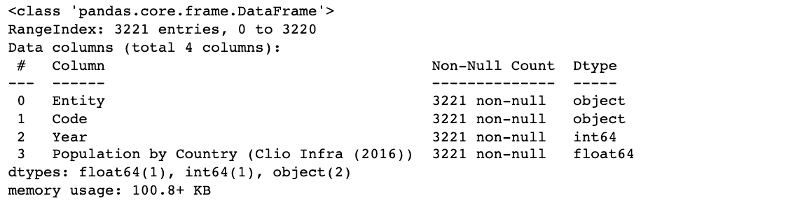
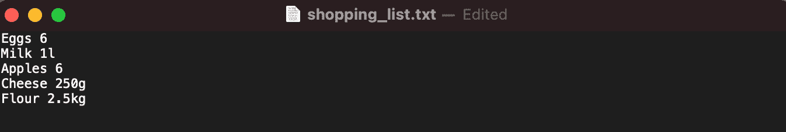
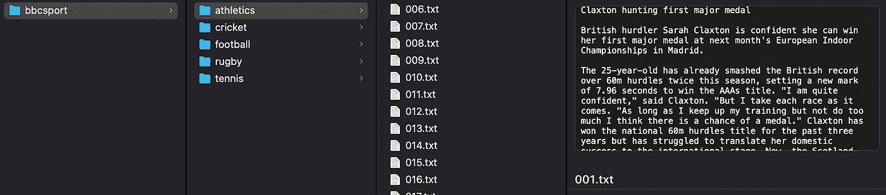
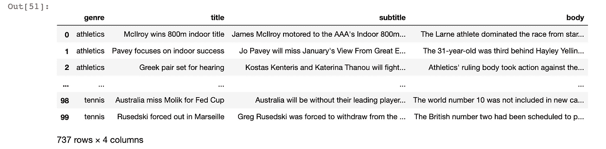
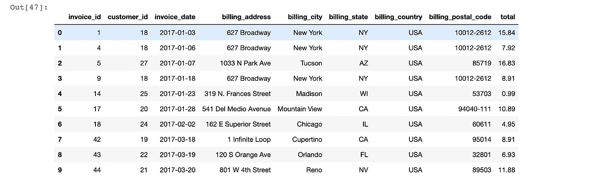
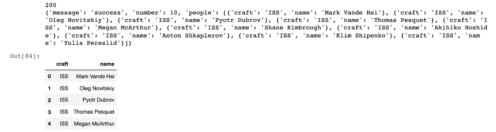
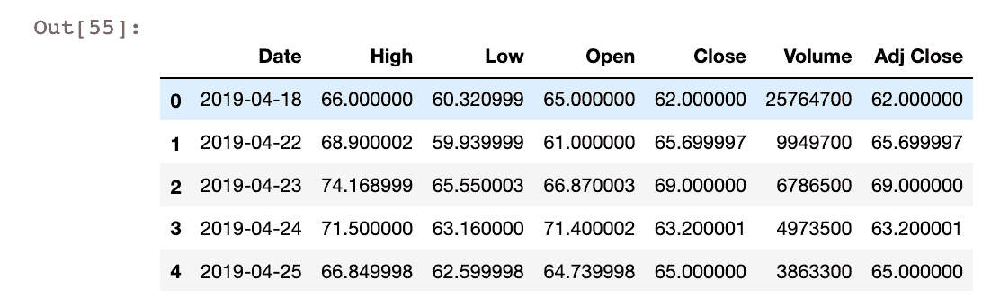
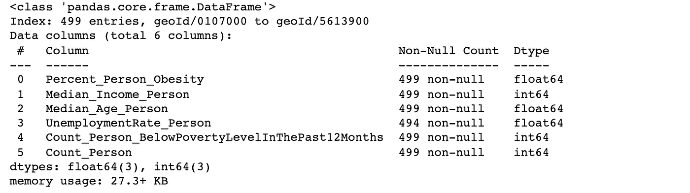
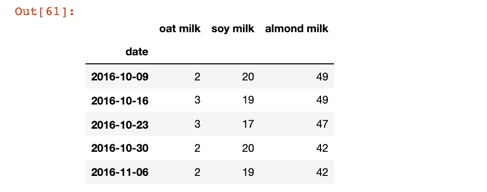

# 用 Python 访问数据的 13 种方法

> 原文：<https://towardsdatascience.com/13-ways-to-access-data-in-python-bac5683e0063?source=collection_archive---------0----------------------->

## 如何从本地文件、数据库、API 和数据访问库中获取数据到您的 Python 环境中


兰斯·格兰达尔在 [Unsplash](https://unsplash.com/photos/nShLC-WruxQ) 拍摄的图片

# 介绍

大多数 Python 分析都是从将数据导入环境开始的。但是，如果这些数据滞留在数据库中，该怎么办呢？还是背后一个 API？还是在一堆小文件里？

幸运的是，Python 非常灵活，有很多用于访问和处理数据的开源库。在本教程中，我们将学习 13 种将数据放入熊猫数据框的方法，之后可以对数据进行清理、分析和可视化。我们可以将这些方法分为四大类:

1.  本地文件
2.  数据库
3.  蜜蜂
4.  数据集访问库

唯一的主要需求是安装`pandas`库:

```
$ pip install pandas
```

好了，让我们开始吧！

# 📁本地文件

通常，您需要的数据存储在计算机的本地文件中。根据您运行 Python 环境的位置，您可以将文件名指定为相对路径[或绝对路径](https://www.earthdatascience.org/courses/intro-to-earth-data-science/python-code-fundamentals/work-with-files-directories-paths-in-python/):

```
# Absolute path
file1 = "~/Users/johnreid/Documents/my_project/data/example.csv"# Relative path, assuming current working directory is my_project
file2 = "./data/example.csv"
```

## 1.CSV 文件

CSV 是存储表格数据的流行选择，也是最简单的入门方式。让我们假设您已经从数据中的[我们的世界下载了这个人口数据集:](https://ourworldindata.org/grapher/population-by-country)

```
import pandas as pdcsv_file = "/Users/johnreid/Downloads/population-by-country.csv"
df_from_csv = pd.read_csv(csv_file)
df_from_csv.info()
```

导入数据后，运行`df.info()`有助于了解数据的结构，例如有多少行、列和非空值。运行该代码会产生以下输出:



这种方法也适用于通过 URL 访问的文件，比如公共 Github repo 中的公共 Google Sheet 或 CSV 文件。另外，如果你一直得到一个`FileNotFoundError`，那么尝试重命名你的文件名，用下划线代替空格，例如“Financial Sample.xlsx”变成“Financial_Sample.xlsx”。

## 2.Excel 文件

您需要对 Excel 文件更加小心，因为它们可能包含不止一张数据和复杂的视觉格式，例如额外的标题行。除此之外，语法非常相似——下面是一个[财务数据](https://go.microsoft.com/fwlink/?LinkID=521962)的例子:

```
import pandas as pdexcel_file = "/Users/johnreid/Downloads/Financial_Sample.xlsx"
df_from_excel = pd.read_excel(excel_file, sheet_name = "Sheet1")
df_from_excel.info()
```

## 3.文本文件

文本文件通常需要更多的数据处理——首先看看数据是如何存储的，以及您希望如何在 Python 中表示它。从那里，您可以编写代码将文本输入转换成数据帧。让我们用一个购物清单的例子，每一行包含一个项目和数量:



要将其转换为数据帧，可以运行以下命令:

```
shopping_list = "/Users/johnreid/Downloads/shopping_list.txt"results = []with open(shopping_list) as f:
    line = f.readline() while line:
        results.append(line.strip().split(" "))
        line = f.readline()f.close()df_from_textfile = pd.DataFrame(results, columns = ["Item", "Quantity"])
```

我们一行一行地读，去掉多余的空格，把这一行分成两部分。当我们创建一个数据帧时，我们还需要指定列名。

## 4.多个文件/文件夹

如果需要从多个存储的文件中提取数据会怎么样？让我们结合我们学到的一些东西，从 [BBC 体育文本数据集](http://mlg.ucd.ie/datasets/bbc.html)中提取数据。



我们有 5 个子文件夹，每个大约有 100 个文件。每个文件都以标题开始，然后是文章的正文。我们的目标是将所有这些文件合并成一个具有“标题”、“副标题”、“正文”和“流派”列的单一数据框架。这里的`glob`库列出了所有可能的文件名，非常方便:

```
import glob
import pandas as pdbase_path = "/Users/johnreid/Downloads/bbcsport/"
genres = ["athletics", "cricket", "football", "rugby", "tennis"]def read_and_split_file(filename):
    with open(filename, 'r', encoding="latin-1") as f:
        lines = f.readlines() # Get lines as a list of strings
        lines = list(map(str.strip, lines)) # Remove /n characters
        lines = list(filter(None, lines)) # Remove empty strings return linesdef get_df_from_genre(path, genre):
    files = glob.glob(path + genre + "/*.txt")
    titles = []
    subtitles = []
    bodies = [] for f in files:
        lines = read_and_split_file(f)
        titles.append(lines[0]) # First line is the title
        subtitles.append(lines[1]) # Second line is the subtitle
        bodies.append(' '.join(lines[2:])) # Combine all the rest return(pd.DataFrame({
        'genre': genre,
        'title': titles,
        'subtitle': subtitles,
        'body': bodies
        })
    )final_df = pd.concat([get_df_from_genre(base_path, g) for g in genres])final_df
```

我们在 glob 中使用`*`操作符来获取所有可能以`.txt`结尾的文件名。注意，您可以使用`pd.concat`将多个数据帧连接在一起。运行该代码会产生以下输出:



# 🗄数据库

大多数组织将他们的业务关键数据存储在类似 Postgres 或 MySQL 的关系数据库中，你需要知道结构化语言来访问或更新存储在那里的数据。数据库有很多优点，比如数据标准化

## 5.SQLite

SQLite 是一个存储为单个文件的嵌入式数据库，所以它是开始测试查询的好地方。这里我们将展示一个连接到 [Chinook](https://github.com/lerocha/chinook-database) 数据库的 SQLite 文件的例子:

```
import pandas as pd
import sqlite3 as sqlconn = sql.connect('/Users/johnreid/Downloads/chinook.db')# First pattern - turn query directly into dataframe:
df1 = pd.read_sql_query("SELECT * FROM invoice", conn)# Second pattern - get row-level data, but no column names
cur = conn.cursor()
results = cur.execute("SELECT * FROM invoice LIMIT 5").fetchall()
df2 = pd.DataFrame(results)
```

如果你有兴趣，可以在这里阅读我关于使用 SQL 构建交互式仪表板的完整教程:

[](/building-an-interactive-python-dashboard-using-sql-and-datapane-46bd92294fd3) [## 使用 SQL 和 Datapane 构建交互式 Python 仪表板

towardsdatascience.com](/building-an-interactive-python-dashboard-using-sql-and-datapane-46bd92294fd3) 

## 6.远程数据库

连接到远程数据库(如 Postgres、Redshift 或 SQLServer)使用几乎相同的语法，但需要访问凭证。出于安全原因，最好将这些凭证存储在一个配置文件中，并将其加载到 Python 脚本中。您可以使用以下信息创建一个单独的`.py`文件:

```
host = "localhost"
database= "suppliers"
user = "postgres"
password = "SecurePas$1"
```

然后将其导入 Python 脚本，如下所示(您还需要`psychopg2`库):

```
import psycopg2
import configconn = psycopg2.connect(
    host=config.host,
    database=config.database,
    user=config.user,
    password=config.password)df1 = pd.read_sql_query("SELECT * FROM invoice", conn)
```

确保保存好你的`config.py`文件，不要把它上传到其他地方——你可以把它添加到你的`.gitignore`中，以确保它不会包含在 git 提交中。

## 7.SQLAlchemy

如果您想要一种更“pythonic 化”的方式来查询数据库，可以尝试一下 [SQLAlchemy](https://www.sqlalchemy.org/) 库，它是一个对象关系映射器。它通常用于应用程序，这样开发人员就不必编写纯 SQL 来更新他们的数据库，但是您也可以使用它来查询数据！

下面是一个使用相同 Chinook 音乐商店数据库的示例:

```
import sqlalchemy as dbengine = db.create_engine('sqlite:///chinook.db')
connection = engine.connect()
metadata = db.MetaData()invoice = db.Table('invoice', metadata, autoload=True, autoload_with=engine)# Get the first 10 invoices from the USA
query = (db.select([invoice])
    .filter_by(billing_country = 'USA')
    .limit(10)
        )df = pd.read_sql(query, engine)
```

在这段代码中，我们连接到数据库，然后在 SQLAlchemy 中设置一些表和元数据。一旦定义好了，我们就可以用一种更“pythonic 化”的方式编写一个查询，并将结果直接读取到 Pandas 数据帧中。运行该代码会产生以下输出:



# 📶蜜蜂

有时候，你需要从你公司使用的特定平台获取数据，比如 Hubspot、Twitter 或 Trello。这些平台通常有一个公共 API，您可以直接在 Python 环境中从中提取数据。

基本思想是向端点发送一个请求(可能包括查询参数和访问凭证)。该端点将返回一个响应代码和您请求的数据(希望如此)。您需要查看 API 文档来了解哪些数据字段是可用的。数据通常以 JSON 格式返回，这允许深度嵌套的数据。

## **8。没有证件**

让我们使用 [OpenNotify](http://open-notify.org/Open-Notify-API/People-In-Space/) API 来做一个最小的例子，它跟踪当前在空间中的所有人:

```
import requestsresponse = requests.get("http://api.open-notify.org/astros.json")print(response.status_code)
print(response.json())res = pd.DataFrame(response.json()["people"])res.head()
```

运行该代码会产生以下输出:



响应代码告诉您 API 调用的结果——根据 [Dataquest](https://www.dataquest.io/blog/python-api-tutorial/) 最常见的是:

*   一切顺利，结果已经返回(如果有的话)。
*   `301`:服务器正在将您重定向到不同的端点。当公司切换域名或端点名称更改时，可能会发生这种情况。
*   `400`:服务器认为你提出了一个错误的请求。当你没有发送正确的数据时，就会发生这种情况。
*   `403`:你试图访问的资源被禁止:你没有查看它的权限。
*   `404`:在服务器上找不到您试图访问的资源。
*   `503`:服务器未准备好处理请求。

## 9.使用凭据和查询参数

有时您可能需要来自 API 的更具体的信息，或者必须进行身份验证。有几种方法可以做到这一点，但是最常用的一种方法是在请求中添加 URL 参数。

假设我们有一个包含 API 密钥的`config.py`文件:

```
personal_api_key = "wouldntyouliketoknow"
```

然后我们为所有的参数创建一个字典(这是一个虚构的例子)并传递它:

```
import config
import pandas as pd
import requestsparameters = {
    "personal_api_key": config.personal_api_key, 
    "date": "2021-09-22"
}response = requests.get(url, params = parameters)

print(response.status_code)
print(response.json())

res = pd.DataFrame(response.json()["people"])
res.head()
```

如果你不想处理 JSON，你可以尝试搜索该 API 的 Python 库——这些库通常是开源的，由公司或第三方维护。

# 📚数据集访问库

如果您需要一些参考数据来进行比较或添加上下文，该怎么办？有许多库可以将公共数据集直接下载到您的环境中——可以把它想象成从 API 中提取，而不必管理所有额外的复杂性。

## 10.熊猫 _datareader

[Pandas_datareader](https://pandas-datareader.readthedocs.io/en/latest/index.html) 是一种将数据从互联网提取到 Python 环境中的好方法。它特别适合金融数据，但也有一些世界银行的数据源。要了解 Zoom 过去几年的每日股价，请尝试以下方法:

```
from pandas_datareader import data
import datetime as dtzm = data.DataReader(
    "ZM",
    start='2019-1-1',
    end=dt.datetime.today(),
    data_source='yahoo'
).reset_index()zm.head()
```

运行该代码会产生以下输出:



## 11.数据共享

[Datacommons](https://datacommons.org/) 是谷歌的一个项目，提供对标准化和清洁的公共数据集的访问。底层数据以图表的形式呈现，这使得查询和连接来自许多不同数据源的数据变得非常容易，例如美国人口普查局、世界银行、维基百科、疾病控制中心等等。这里有一个基本的例子:

```
!pip install datacommons datacommons_pandas --upgrade --quietimport datacommons_pandas as dc
import pandas as pdcity_dcids = dc.get_property_values(["CDC500_City"], "member", limit=500)["CDC500_City"]cdc500_df = dc.build_multivariate_dataframe(
    city_dcids,
    ["Percent_Person_Obesity",  # Prevalence of obesity from CDC
    "Median_Income_Person",
    "Median_Age_Person",
    "UnemploymentRate_Person",  # Unemployment rate from BLS
    "Count_Person_BelowPovertyLevelInThePast12Months",  # Persons living below the poverty line from Census
    "Count_Person",  # Total population from Census
    ],
)cdc500_df.info()
```

运行该代码会得到以下结果:



如果你想学习如何使用 DataCommons，请在这里阅读我的完整教程:

[](/exploring-datacommons-the-api-powering-google-search-afc366ec242b) [## 探索数据共享——支持谷歌搜索的 API

### 访问公开可用数据集的新范式

towardsdatascience.com](/exploring-datacommons-the-api-powering-google-search-afc366ec242b) 

## 12.PyTrends(谷歌趋势)

PyTrends 是一个非官方但很有用的库，用于查询 [Google Trends](https://trends.google.com/trends/explore?date=today%205-y&q=oat%20milk,soy%20milk,almond%20milk) 数据——这里有一个简单的例子:

```
import pandas as pdfrom pytrends.request import TrendReqpytrends = TrendReq()
keywords = ["oat milk", "soy milk", "almond milk"]pytrends.build_payload(keywords, cat=0, geo='', gprop='') # Get data from the last 5 yearstop_queries = pytrends.interest_over_time()[keywords]top_queries.head()
```

运行该代码会产生以下输出:



## 13.卡格尔

Kaggle 是一个数据科学社区，它拥有大量学习 Python 的数据集和竞赛。您可以通过命令行界面下载其中的一些数据集进行实验(注意:您需要注册一个 Kaggle 帐户)。例如，假设我们想要下载一些 [Zillow economics 数据](https://www.kaggle.com/zillow/zecon)，我们可以在我们的终端中运行以下命令(Jupyter 用户:用 Python 代码中的`!`替换`$`:

```
$ pip install kaggle
$ export KAGGLE_USERNAME=datadinosaur
$ export KAGGLE_KEY=xxxxxxxxxxxxxx
$ kaggle datasets download zillow/zecon
$ unzip zecon.zip
```

这将下载数据集的压缩文件，然后解压缩它们。从那里，您可以将它们作为熊猫的本地文件打开:

```
import pandas as pdcsv_file = "/Users/johnreid/Downloads/Zip_time_series.csv"
df_from_csv = pd.read_csv(csv_file)
df_from_csv.info()
```

要了解更多信息，请查看 [Kaggle API 文档](https://github.com/Kaggle/kaggle-api)。

# **结论**

图片来自 [Giphy](https://giphy.com/gifs/angry-spongebob-squarepants-strong-D7z8JfNANqahW)

你成功了！现在，您可以使用新获得的能力来访问多个数据源，并使用`pd.merge`或`pd.concat`将它们连接在一起，然后使用 Altair、Pandas 或 leav 等交互式库来可视化它们。

有没有我漏掉的方法？请在评论中告诉我。