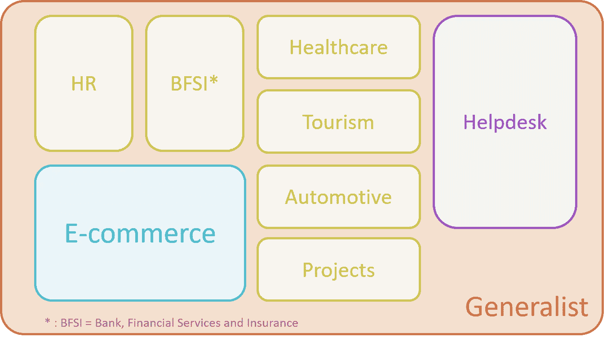
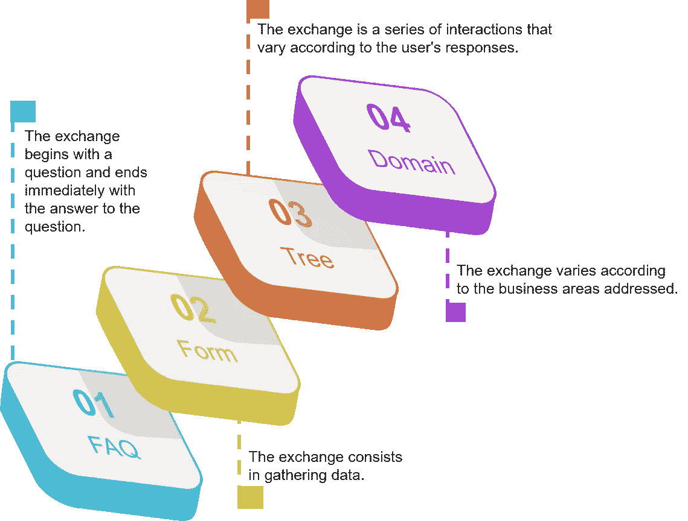
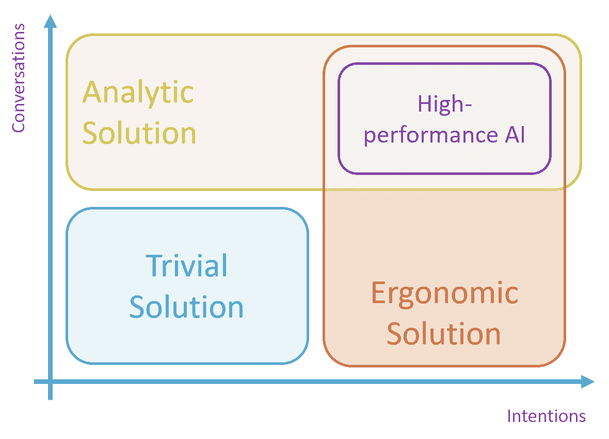

# 选择聊天机器人解决方案的 14 个标准

> 原文：<https://towardsdatascience.com/14-criteria-for-well-choosing-a-chatbots-solution-2e788aace3b8?source=collection_archive---------25----------------------->

## 选择自然语言会话辅助解决方案时，首先要考虑的标准是什么？

威廉·沃比在 [Unsplash](https://unsplash.com?utm_source=medium&utm_medium=referral) 上的照片

# 介绍

对话协助解决方案的实现是一个业务决策，而不是技术决策。当以自然语言执行的辅助活动是重复的和/或简单的并且因此容易自动化时，做出该决定。例如回答 IT 支持问题、在个人档案中归档支持文档、了解订单状态或了解产品信息。

自动化这些请求的主要目的是释放代理的时间来响应更复杂的需求，或者只是允许他们处理来自用户的大量问题。

其他几个好处可以补充这一目标:

*   标准答案可根据对话者使用信息系统中的数据进行定制(如订单状态、银行余额、支持文件的存款…)，
*   全天候可用性，允许在呼叫中心工作时间之外提供支持，
*   几乎即时的响应能力，无需等待代理的可用性，
*   公司的现代形象受到最新技术的启发，并适应新的信息消费行为。

一旦正确确定了要涵盖的业务领域，就有必要选择一个解决方案来完成这一辅助工作。当您想做到面面俱到，并且知道目前市场上有数百种不同的解决方案时，这个决定并不简单。

构建决策矩阵是帮助选择软件程序的最佳方法。它包括一个由相关性加权的标准列表(一个通常在 0 到 5 之间的数字)和一个要研究的解决方案列表。对每个解决方案的每个标准进行评分。加权标准的所有分数的总和给出了解决方案相对于其他解决方案的评估。由于辅助解决方案的功能丰富，一个完整的决策矩阵可以包括数百个标准，如果必须对当今市场上的所有解决方案进行分析，这将是一个天文数字的分析时间。

我的列表的目的是为您提供快速区分待详细研究的 5-10 种解决方案的方法。

# 标准 1:专业领域

这第一个标准既是最重要的标准之一，也是最难评估的标准。在过去的几年中，会话辅助解决方案市场发生了变化，出现了专门针对特定业务领域的解决方案:例如，银行、保险、人力资源、电子商务(电子商务和零售)…这些解决方案预先配置了一系列意图、实体和对话/响应，能够减少创建工作，从而降低成本并加快聊天机器人的部署。然而，至少要确保答案符合公司的实践。此外，将特定意图添加到公司中总是必要的。

在高度管制和立法的领域，这些解决方案带来的优势是不可否认的，将节省大量的时间。在更开放和变化的领域，这种优势要弱得多，不应该对最终的选择非常具有决定性。

市场解决方案的主要专业领域

通用解决方案可适用于所有配置，但需要更多配置工作。

# 标准 2:用户语言

用户语言是用户说的语言，聊天机器人必须理解这些语言才能触发正确的响应场景。用户的良好知识在这里很重要，因为有必要能够将每种语言的使用百分比联系起来。

事实上，维护一种语言是相对昂贵的，因为每种语言都有一整套数据要适应:要检测的话语(通过意图)、对话树中的不同问题以及所有答案的翻译。在低容量的情况下，必须询问维护“稀有”语言的相关性:要么像其他语言一样管理它，并支付相关费用，要么用替代语言替换它，要么必须保持当前的支持。

# 标准 3:对话的复杂性

当设计响应场景时，定义如何响应是很重要的。答案可以是提供一个简单的答案，也可以是提供一个复杂的对话，其中包括提出一系列问题以及在第三方应用程序中搜索信息。在第一种情况下，静态或动态 FAQ 解决方案可能就足够了。在第二种情况下，要选择的解决方案应该提供创建具有多个分支的复杂对话、管理上下文、与第三方应用程序集成的能力……这个标准必须与不同级别的场景比例相权衡。

对话复杂性等级的 4 个级别

一个有很多对话树的聊天机器人需要一个解决方案来管理这些树的复杂性。一些解决方案允许通过编程或使用技巧来规避功能的缺乏。因此，重要的是要估计创建和维护的工作量，如果必要的话，必须实现这些工作量来弥补这些功能的缺失。

# 标准 4:容量法

必须考虑两种容量法:

*   对话量，即潜在用户的数量和他们每月提出的请求的数量，
*   管理意图的数量，即聊天机器人必须管理的问题的数量。

对于交换的数量(以及超出平台处理负载的能力)，这是企业分析必须评估的数千甚至数百万次对话的能力，因此也是解决方案提供这种帮助的能力。

对于意向量，这是解决方案在参数设置方面促进该量的管理的能力，即管理数百个不同场景的能力。许多解决方案易于在几十种场景中使用，但无法扩展。

当这两种类型与高容量相结合时，即每月数百个意图和数万个对话，管理界面的质量和 AI 的性能在解决方案的选择中变得占优势。

解决方案的复杂程度取决于数量

# 标准 5:业务可访问性

这个标准背后的问题是:哪些团队将配置解决方案？哪些团队将维护解决方案？团队的技术技能是什么(开发、逻辑……)？

如果选择创建和维护聊天机器人的团队不是技术人员，则需要一个用户友好的图形用户界面。如果大部分配置是以图形方式完成的，则对话框的配置会更容易。允许管理多个管理角色也是该标准的一部分。

# 标准 6:人工智能调整

目前市场上存在三种主要技术:按钮导航、基于关键字的需求检测和由人工智能(AI)算法完成的自然语言处理(NLP)。第一种和第二种技术对小实例有效，但 AI 每天都在展示它对大量数据(大量意图、大量对话)的性能。在前两种情况下，AI 调整不是判别标准。

通过调整 AI，我们指的是微调 NLP 单元的能力:意图分类、实体提取、语法树的分解……当项目需要精确理解请求时，可能有必要拥有直接干预这个 AI 的能力。

当项目的一部分由数据科学家技术人员和机器学习(ML)工程师团队管理时，他们将需要能够完成这一细化工作的能力。然后，解决方案必须能够管理经过专门训练的模型的参数化和部署步骤。当解决方案完全由企业管理时，这些改进必须自动处理，或者至少通过简单的解释和指导来处理。

# 标准 7:基础设施

解决方案本地化的不同方法有:

*   托管基础架构模式下的云中。基础设施维护完全由解决方案提供商或获得此任务授权的第三方执行。该解决方案可以是多租户(允许通过同一个数据库管理多个 Bot)或单租户(一个 Bot = 1 个数据库)。该解决方案可以在专用/私有云上以 SaaS ( *【软件即服务】*模式提供；
*   在公司现场(*现场*)。维护由公司的内部团队在自己的基础设施上进行。这种方法保证了处理和数据的严格保密性；
*   一部分在公司的网站上，一部分在 SaaS 模式的云中。这种混合方法将处理的一部分与解决方案的其余部分分开。例如:Livechat 的管理(让用户与可用代理联系的模块)、NLP 部分等等。

此标准应与本地团队运营解决方案的能力和技能(包括相关的基础架构成本)结合起来考虑。并非市场上的所有解决方案都支持按需本地化。

# 标准 8:用户界面

用户界面是请求者与聊天机器人交互的通道。该接口可以是:

*   一个模拟代理的脸(有时是身体)的虚拟角色(或多或少真实)。可以表达与对话相关的情绪(或多或少)。交流是通过语言和视觉进行的。这里寻求的是移情的一面。很快就有可能出现能够代表品牌与顾客互动的*avastar*(明星的化身)？
*   电话线(呼叫机器人或电话机器人)。通信通过语音通道进行，可以通过电子邮件或 SMS 发送元素来完成；
*   语音信箱(例如 Google Home、亚马逊 Alexa……)。该盒子通常与连接到该盒子的特定解决方案相关联，并且当用户有需求时，他必须明确地选择该公司的服务；
*   通过短信打电话；
*   一个社交网络。用户使用社交网络的能力来与聊天机器人通信；
*   对话窗口(或弹出窗口，也称为 webchat)。交流是通过公司网站上的一个小窗口进行的；
*   在不久的将来，直接思考。

该解决方案应促进所考虑的通道的集成。通常，解决方案附带预配置的连接器，只需点击几下鼠标即可安装。对于电话线，解决方案可能会建议一个电话号码或与公司的电话交换机(PBX)集成。每个社交网络都有自己的特性，这些特性必须反映在管理界面中。

默认情况下，解决方案通常有一个适用于任何接口的标准连接器。然而，连接器和相关配置元素的存在是一个好的实践(例如，Twitter 不接受图像)。

这里没有提到电子邮件作为一个接口，因为它通常是一个复杂而长的文本(礼貌用语、演示、上下文、请求、附件……)，因此与其他解决方案以不同的方式处理。

# 标准 9:一体化

富对话是一种考虑到“活”数据和用户数据(如果可能)的对话。然后，解决方案必须能够与第三方应用程序连接:

*   识别和认证系统；
*   支持相关系统，如实时聊天、信息系统、ITSM (IT 服务管理)；
*   与所涵盖的业务环境相关的系统，如:CRM(客户关系管理)、ERP(企业资源规划*)、* HR(人力资源)软件、银行软件、DMS(文件管理系统*)、* CMS(内容管理系统)…
*   RPA(机器人过程自动化)系统对应用程序执行手动操作。

一些解决方案提供了方便集成工作的现成连接器。否则，系统必须*至少*有调用外部服务的方法(以 *Webhook* 或 REST API 设置的形式)。

# 标准 10:可逆性

一个解决方案的可逆性是它能够提供数据提取以用于另一个解决方案。迄今为止，还没有国际标准为解决方案之间的互操作性定义标准格式。因此，至少，解决方案必须能够授权以“可读”的格式(JSON、XML、CSV……)导出数据。必须能够输出最大量的配置数据:意图、实体、知识、对话树…

# 标准 11:定价模式/许可

向导解决方案的定价模式因编辑器而异:

*   每次对话的价格，
*   转换价格(电子商务)，
*   指定用户的数量，
*   当月活跃用户数(MAU 代表每月活跃用户数)，
*   每月或每年的使用套餐，
*   固定价格许可和维护(通常与现场安装相关联)，
*   全部或部分免费(有条件)。

每种价格模式都有其优点和缺点。要确定价格是否“可接受”，预计的每月成本应该与解决方案的收益相匹配。

# 标准 12:可持续性

这个标准指的是发行商和/或开源解决方案的长期持久性。

会话协助解决方案提供商的持久性取决于其在这个竞争异常激烈的世界中的生存能力。选择大型编辑器(大量参考资料、云的主要参与者、庞大的解决方案组合、包含在更大的软件中……)是可持续性的保证，但也是成为 lambda 客户的风险。选择一个小的出版商，或者一个初创企业，通常是保证一个*定制的*服务。缺点是有可能成为其最大的客户，甚至是其第一个客户。

在这个市场中，公司的规模很重要，因为迄今为止，85%已经死亡的出版商只有 1 到 10 名员工。对于初创公司来说，与管理层会面是验证财务可行性、感受真正的决策者以及检查长期解决方案愿景(路线图)的重要环节。

即使开源不一定意味着免费(查看许可证)，它的优势也是多方面的:代码的可审计性，通常是一个爱好者社区，免费使用，创新的前沿……另一方面，可持续性没有保证，因为当前的热情很可能会转向更有趣、更创新和更有前途的新解决方案。尽管如此，您仍然可以继续使用该解决方案，但缺点是必须单独维护它。

# 标准 13:行政人员的语言

这是解决方案用户通过管理界面使用的语言。他们需要了解要配置的各种参数，并能够阅读解决方案的文档。大多数国际解决方案通常都有英文文档。

就语言而言，您还必须包括发布者的本地化以及负责支持解决方案的人员所使用的语言。在重要的情况下，拥有会说你的语言的人是至关重要的。

# 标准 14:保密性和安全性

最后一个标准与交换的数据有关，特别是用户和聊天机器人之间的对话。对于高度机密的关键情况，可能有必要通过代码审核或认证来确保没有信息泄漏。

对于在欧盟使用聊天机器人，遵守 GDPR 标准(通用数据保护条例)是*的必要条件*。

# 结论

这篇文章提出了几个判别标准，可以让你相对快速和低成本地预先选择会话协助解决方案。当然，这是第一级方法，这些标准中的每一个都需要在以后详细说明。您也可以自由添加您认为重要的其他标准，记住不要在第一种方法中涉及太多细节。

然后，您可以自由选择单个解决方案或 2-3 个解决方案，然后在要涵盖的业务领域中进行测试。测试将包括实现代表要执行的不同场景的请求。

# 了解更多信息

对于会话助理市场的概述:

 [## 2020 年全球聊天机器人解决方案市场概述

### 根据我对会话助手市场的积极观察，我给你一些关于……的统计数据和信息

towardsdatascience.com](/an-overview-of-the-global-market-for-chatbot-solutions-in-2020-820aa9366efc) 

关于对话的复杂性:

 [## 建造者的对话式人工智能:4 个复杂等级

### 当你想建立一个对话式人工智能解决方案时，重要的是要记住对话通常遵循…

medium.com](https://medium.com/ai-in-plain-english/conversational-ai-for-builders-the-4-levels-of-complexity-scale-4eb482a862d9)