# 每个数据科学家都必须知道的 14 个熊猫操作！

> 原文：<https://towardsdatascience.com/14-pandas-operations-that-every-data-scientist-must-know-cc326dc4e6ee?source=collection_archive---------9----------------------->

## 关于 14 个最基本的熊猫操作的完整指南，将帮助开发人员轻松完成大多数数据科学项目


锡德·巴拉钱德朗在 [Unsplash](https://unsplash.com?utm_source=medium&utm_medium=referral) 上拍摄的照片

理解数据科学家可用的数据是数据科学最重要的方面。只有具备正确的数据知识和完成所需任务的适当数据，您才能获得最成功的结果。在数据科学中，数据的分析、可视化和操作非常重要。

在 Python 的帮助下，关于机器学习和数据科学的一切都变得极其简单。我们可以利用 Python 中一些最好的库来轻松完成任何想要的操作。一个这样的库允许我们分析和处理数据，以降低复杂性并加快计算问题的过程，这就是 ***熊猫*** 。

Pandas 库是 Python 中用于数据分析过程的最佳特性之一。您可以轻松执行各种任务。在本文中，我们将探讨每个数据科学家必须利用的不同类型的操作，以完成特定的项目，同时利用最少的资源，实现最高的效率。

建议阅读本指南的用户使用 Jupyter 笔记本来阅读本文中提到的大部分代码，以获得最佳体验。如果您不确定 Jupyter 笔记本的概念，请查看下面提供的链接，了解您需要了解的关于 Jupyter 笔记本以及如何有效利用它们的几乎所有信息。

[](/everything-you-need-to-know-about-jupyter-notebooks-10770719952b) [## 关于 Jupyter 笔记本你需要知道的一切！

### 分解 Jupyter 笔记本的所有内容，从菜单到运行电池，以及各种…

towardsdatascience.com](/everything-you-need-to-know-about-jupyter-notebooks-10770719952b) 

在接下来的章节中，让我们开始探索数据科学家可以在 Pandas 库中使用的每一个功能和操作。

# 1.创建熊猫数据框:

```
### Creating a dataframe
import pandas as pddataset = {'Fruits': ["Apple", "Mango", "Grapes", "Strawberry", "Oranges"], 'Supply': [30, 15, 10, 25, 20]}# Create DataFrame
df = pd.DataFrame(dataset)

# Print the output.
df
```

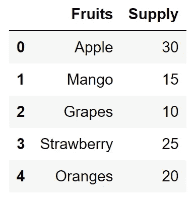

作者图片

在 Pandas 库的帮助下，用户可以轻松创建新的数据框。熊猫图书馆允许用户以最美观的方式为数据分析和可视化创建新的材料。它允许开发人员清楚地了解他们正在工作或处理的数据的类型和格式。

尽管创建数据框的过程可以通过多种方式完成，但创建数据框的最佳方式之一是上面显示的以下代码中提到的方式。这里，我们正在导入 Pandas 框架并定义我们的数据集。dataset 变量包含一个所有元素的字典，关键字为 fruits 和 supply。

最后，您可以使用 Pandas 模块中可用的 DataFrame 函数来构建数据集，并以理想的格式存储它。在 just 列表的帮助下，下面的过程也是可能的。要了解更多关于词典的知识以及如何掌握它们，我推荐你从下面提到的链接中查阅我以前的一篇文章。

[](/mastering-dictionaries-and-sets-in-python-6e30b0e2011f) [## 掌握 Python 中的字典和集合！

### 通过代码和示例理解 Python 中的字典和集合的概念

towardsdatascience.com](/mastering-dictionaries-and-sets-in-python-6e30b0e2011f) 

# 2.读取 CSV 文件:

```
# Importing the framework
import pandas as pd# Reading a random csv file and displaying first five elements
data = pd.read_csv("name.csv")
data.head()
```

在熊猫图书馆的帮助下，轻松阅读以不同格式存储的数据成为可能。存储与数据科学相关的大多数信息的最常见格式之一是。CSV 格式。在 Pandas 框架中的 read csv 命令的帮助下，人们可以很容易地阅读以特定格式存储的所有复杂和基本的细节。

除了逗号分隔值(CSV)格式之外，Pandas 库还支持 XLSX 文件、. zip 文件、JSON 文件、文本文件、HTML 文件、PDF 和 DOCx 文件以及分层数据格式。你可以通过 Pandas 库访问所有这些格式，并相应地操作它们。

# 3.阅读顶部元素图表:

```
# print the first couple of elements
df.head(2)
```

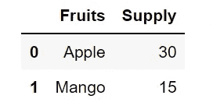

作者图片

在接下来的几节中，我们将了解两个基本的熊猫操作的细节。其中一个函数是 head()操作，它将默认显示前五个元素。您可以指定想要在函数中查看的元素数量，您将收到您请求的前“n”个条目。这个函数对于理解数据的基本架构很重要，但不需要深入了解数据的复杂细节。

# 4.阅读底部元素图表:

```
# print the last couple of elements
df.tail(2)
```

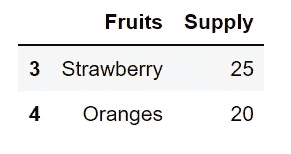

作者图片

与 head 函数类似，我们可以利用 tail()操作来读取给定数据集的最后几个数据元素。尾巴功能可以让我们快速掌握一些事情的想法。首先，我们可以用一个快捷的命令获得元素的总数。我们还可以使用这个命令来确定和验证任何其他前面的排序或附加操作，以确保正确遵循前面的过程。

# 5.了解数据的统计信息:

```
# Understand all the essential features
df.describe()
```

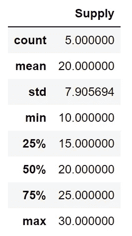

作者图片

在 Pandas 库框架的帮助下，可以可视化最基本的统计信息。Pandas 中的 describe 函数()将允许我们从数据帧中接收所有重要的统计数据。这些参数包括数据集中存在的元素总数、整个数据的平均值、最小值和最大值、各自的四分位数以及计算的标准偏差。

借助于通过一个命令收集的所有这些关键信息，我们可以利用这些统计数据来简化我们的整体数据分析过程。有了这些数据，我们还可以了解哪些是可以探索的最佳可视化技术。要了解构建数据科学项目时必须考虑的八种最佳可视化方法的更多信息，请查看下面的文章。

[](/8-best-visualizations-to-consider-for-your-data-science-projects-b9ace21564a) [## 为您的数据科学项目考虑的 8 个最佳可视化！

### 分析数据科学项目探索性数据分析中的 8 种最佳可视化技术。

towardsdatascience.com](/8-best-visualizations-to-consider-for-your-data-science-projects-b9ace21564a) 

# 6.编写 CSV 文件:

```
# Create DataFrame
dataset = {'Fruits': ["Apple", "Mango", "Grapes", "Strawberry", "Oranges"], 'Supply': [30, 15, 10, 25, 20]}
df = pd.DataFrame(dataset)# Writing the CSV File
df.to_csv('Fruits.csv')
```

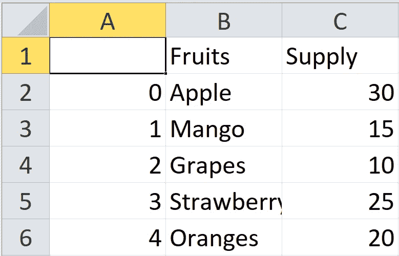

作者图片

在 Pandas 库的帮助下，用户还可以创建和编写新的数据框，并将其保存为所需的文件格式。Pandas 库允许类似于前面讨论的读取 CSV 文件部分的保存格式。上面提到的以下代码块会将创建的数据框保存到一个. CSV 文件中。一旦您从保存该文件的相应目录中打开该文件，您应该会找到包含以下信息的 CSV 文件，如上图所示。

# 7.合并值:

```
### Creating a dataframe
import pandas as pddataset1 = {'Fruits': ["Apple", "Mango", "Grapes", "Strawberry", "Oranges"], 'Supply': [30, 15, 10, 25, 20]}
dataset2 = {'Fruits': ["Melons", "Pear"], 'Supply': [10, 20]}# Create DataFrame
df1 = pd.DataFrame(dataset1)
df2 = pd.DataFrame(dataset2)

# Print the output.
df1.merge(df2, how = "outer")
```

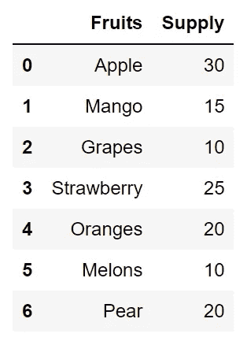

作者图片

假设我们有两个或更多的数据集，并且您想要将它们组合在一起作为一个单独的实体。在 Pandas 框架的帮助下，我们可以利用该库中可用的 merge 命令操作将所有数据帧和单个元素组合成一个实体或数据帧。上面显示的代码块很好地展示了如何执行下面的操作。

在上面的代码块中，我们声明了两个不同的数据帧，它们本身是两个不同的实体。在 Pandas 函数 merge()和它们应该如何组合的规范的帮助下，我们已经创建了特定的组合数据框。可以改变和试验 how 参数。一些选项是左，右，交叉，以及我们在上面的代码中使用的外部函数。

# 8.对值进行分组:

```
import pandas as pddataset = {'Fruits': ["Apple", "Mango", "Grapes", "Strawberry", "Oranges"], 'Supply': [30, 15, 10, 25, 20]}df = pd.DataFrame(dataset)a = df.groupby('Fruits')
a.first()
```

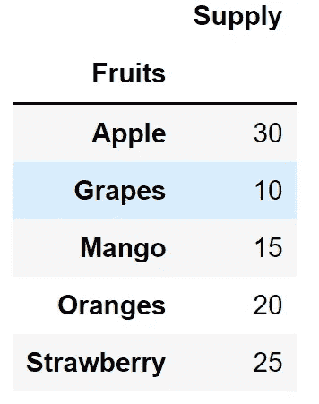

作者图片

Pandas 库的另一个令人惊奇的功能是以一种更可展示的方式将元素组合在一起。在前面几节中我们多次使用的创建的数据框中，我们可以注意到我们有一个索引列，后面跟着其他列。

然而，我们可以在 Pandas 中使用 groupby()函数，以更简洁的方式分离和可视化这些元素，以显示更重要的功能。上面的代码块和图像表示向我们展示了如何相应地完成这个过程以获得以下结果。

# 9.访问特定的行和列:

```
# Access specific rows and columns by specific positions
df.iloc[1:4, [0]]
```

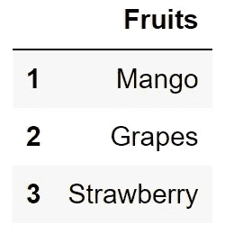

作者图片

在 Pandas 库的帮助下，用户可以在 iloc 操作的帮助下轻松访问他们想要的任何特定元素。iloc 命令用于按指定位置选择行和列的单个值。在上面的代码块中，我们可以指定必须在第一列旁边显示的行数(在本例中为三行)。

# 10.通过标签访问:

```
# Access specific rows and columns by specific labels
df.loc[1:3,  ['Supply']]
```

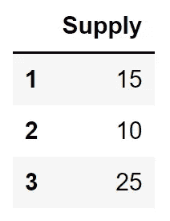

作者图片

类似于您如何在位置的帮助下访问特定的元素需求，您也可以利用特定的标签来访问您想要的任何列。在 Pandas 库中，我们可以利用 loc 命令来选择某一行和某一列的单个值，通过指定的标签。上面指定的代码块用于访问标记为 0 的行到列名指定为 supply 的第三行。

# 11.对数据框中的值进行排序:

```
import pandas as pddataset = {'Fruits': ["Apple", "Mango", "Grapes", "Strawberry", "Oranges"], 'Supply': [30, 15, 10, 25, 20]}
df = pd.DataFrame(dataset)df.sort_values(by = ["Supply"])
```

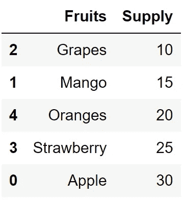

作者图片

Pandas 库还允许用户对他们的数据进行相应的排序，类似于列表这样的数据结构。我们可以向您推荐 Pandas 中可用的排序值功能，并提及您希望对整个数据集进行排序并按其各自的升序排列的特定列。如果你想了解更多关于掌握列表和与列表相关的大多数操作，请查看下面提到的文章。

[](/mastering-python-lists-for-programming-5423b011d937) [## 掌握 Python 列表进行编程！

### 对编程所需的所有列表概念的详细理解。为什么使用列表进行数据科学和…

towardsdatascience.com](/mastering-python-lists-for-programming-5423b011d937) 

# 12.应用特定计算:

```
import pandas as pd
import numpy as npdf = pd.DataFrame([[4, 9]] * 3, columns=['A', 'B'])
df.apply(np.mean, axis=1)
```

Pandas 库中的 apply 函数将允许开发人员在特定的轴上应用任何类型的特定计算，例如一个等于零的轴或一个等于一的轴。我们可以应用许多 numpy 运算，例如计算平均值的 mean、计算总和的 sum、数字的平方根以及许多其他类似的运算。最终的返回类型是从应用函数的返回类型中推断出来的。否则，它取决于结果类型参数。有关此操作的更多信息，请查看以下[参考](https://pandas.pydata.org/pandas-docs/stable/reference/api/pandas.DataFrame.apply.html)。

# 13.时间表达式:

```
import pandas as pdpd.Timedelta('6 days 3 hours 20 minutes 15 seconds')
```

## 输出:时间增量(' 6 天 03:20:15 ')

Pandas 库框架允许用户使用多种与时间相关的表达式。时间增量运算将专门计算可以用不同单位表示的时间差。时间可以用天、小时、分钟和秒来显示，如上面的代码块所示。您可以使用 Pandas 中的时间模块执行多种其他操作，例如添加时间。关于文章这一部分的更多信息，请查看下面的[网站](https://www.tutorialspoint.com/python_pandas/python_pandas_timedelta.htm)。

# 14.用熊猫绘制图表:

```
import pandas as pd
import numpy as npdf = pd.DataFrame(np.random.randn(10,4),index=pd.date_range('1/1/2000',
   periods=10), columns=list('ABCD'))df.plot()
```

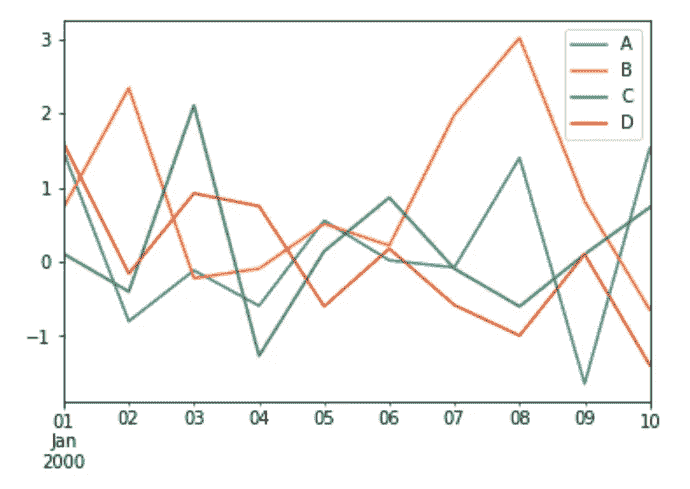

作者图片

熊猫图书馆可以执行的一个重要操作是数据可视化任务。虽然它不能直接替代其他数据绘图库，如 matplotlib 和 seaborn，但 Pandas 中的绘图功能仍然是一个有用的选项，可以与 numpy 库一起使用，以实现一些快速而有用的绘图，用于执行快速数据分析和可视化。

在上面的代码块中，我们可以创建一个由特定行和列组成的随机 numpy 数组。然后，我们用日期范围声明索引，并继续指定行和列的所有值和方法的具体含义。上面下面代码块的代码参考取自下面的[网站](https://www.tutorialspoint.com/python_pandas/python_pandas_visualization.htm)。如果您有兴趣了解更多，请查看它以获得关于该主题的更多信息。

# 结论:


由 [Lukas W.](https://unsplash.com/@muffinwiz?utm_source=medium&utm_medium=referral) 在 [Unsplash](https://unsplash.com?utm_source=medium&utm_medium=referral) 上拍摄

*“如果你只是用科学的方法来处理数据密集型项目，我认为你更容易取得成功。”* — [**鲍勃·海斯**](https://www.linkedin.com/in/bobehayes/)

Pandas 库框架是 Python 编程中最好的工具之一。在该模块的帮助下，数据科学家的生活变得更加简单，因为通过正确使用该特定框架提供的所有操作和功能，数据的处理、加工、分析和操纵变得更加容易。

本文中讨论的 14 个熊猫函数是所有级别的数据科学家的必备知识，也是他们庞大的知识宝库中必须拥有的东西，用于解决他们遇到的任何类型的问题。通过正确使用这些操作和功能，大多数常见问题都可以轻松解决。

如果你对这篇文章中提到的各点有任何疑问，请在下面的评论中告诉我。我会尽快给你回复。

看看我的其他一些文章，你可能会喜欢读！

[](/7-best-ui-graphics-tools-for-python-developers-with-starter-codes-2e46c248b47c) [## 7 款面向 Python 开发人员的最佳 UI 图形工具，带入门代码

### Python 中用于开发酷用户界面技术的七个最佳 UI 图形工具

towardsdatascience.com](/7-best-ui-graphics-tools-for-python-developers-with-starter-codes-2e46c248b47c) [](/15-numpy-functionalities-that-every-data-scientist-must-know-f6d69072df68) [## 每个数据科学家都必须知道的 15 个数字功能

### 讨论开发人员必须学习的十五个最基本的数字函数

towardsdatascience.com](/15-numpy-functionalities-that-every-data-scientist-must-know-f6d69072df68) [](/best-pc-builds-for-deep-learning-in-every-budget-ranges-3e83d1351a8) [## 在各种预算范围内，最适合深度学习的电脑

towardsdatascience.com](/best-pc-builds-for-deep-learning-in-every-budget-ranges-3e83d1351a8) [](/17-must-know-code-blocks-for-every-data-scientist-c39a607a844d) [## 17 每个数据科学家都必须知道代码块

### 讨论将帮助您作为数据科学家有效处理大多数任务和项目的 17 个代码块

towardsdatascience.com](/17-must-know-code-blocks-for-every-data-scientist-c39a607a844d) [](/6-best-projects-for-image-processing-with-useful-resources-f860f3dfe977) [## 6 个最佳图像处理项目和有用的资源

towardsdatascience.com](/6-best-projects-for-image-processing-with-useful-resources-f860f3dfe977) 

谢谢你们坚持到最后。我希望你们都喜欢这篇文章。祝大家有美好的一天！