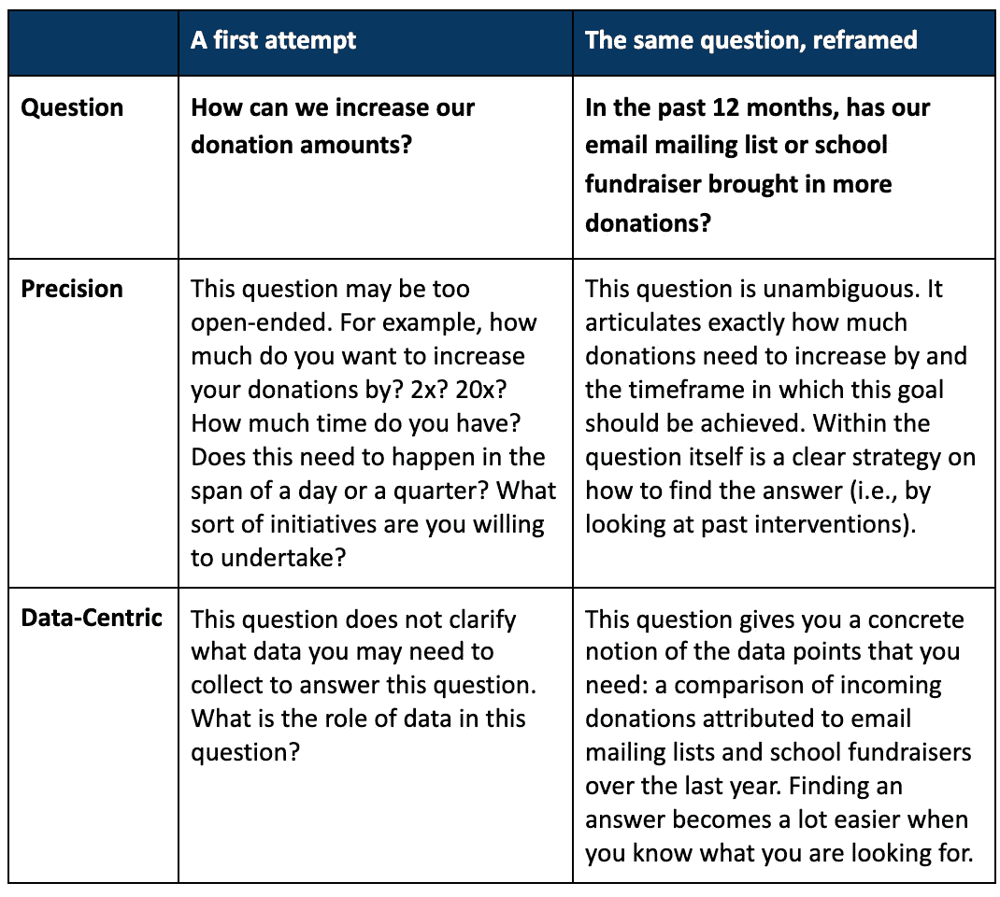
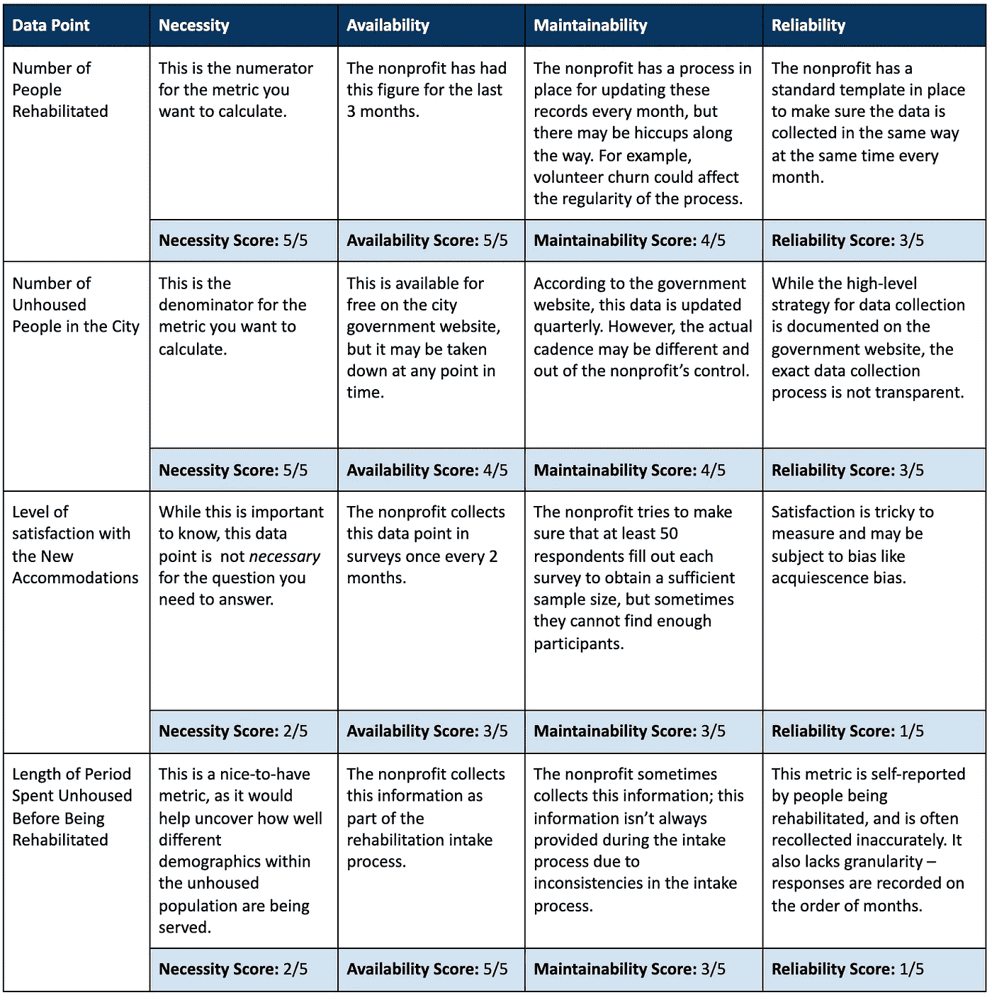

# 非营利组织处理数据的 14 条建议

> 原文：<https://towardsdatascience.com/14-tips-for-nonprofits-working-with-data-8fe1bfeb5502?source=collection_archive---------18----------------------->

## [行业笔记](https://towardsdatascience.com/tagged/notes-from-industry)

## 第 1 部分:数据入门

Delta Analytics 是一家全球性非营利组织— *由 Delta Analytics 拍摄的照片*

在这篇博文中，我们想为刚刚开始使用数据的非营利组织分享一些技巧和最佳实践。我们的目标是帮助您开始实现您的数据目标，并分解为简单易行的小步骤和最佳实践，以充分利用您的数据。

我们是 [Delta Analytics](http://www.deltanalytics.org/) 的数据和教学研究员，这是一家旧金山湾区的非营利组织，迄今为止已经与 50 多家非营利组织合作。达美的目标很简单-我们将湾区的专业数据科学家、分析师和软件工程师与全球的非营利组织配对。我们的数据研究员与非营利赠款获得者配对 6 个月，以利用数据推动影响。我们还通过提供免费培训来帮助普及机器学习和数据工具，从而在世界各地的社区建设技术能力。

我们的目标之一是记录一些我们与非营利赠款接受者分享的最佳做法。多年来，Delta 已经看到了非营利组织在开始使用数据时面临的许多不同的障碍，从有限的技术资源到过度关注现有数据有限的人口和社区。

这是一个由三部分组成的博客系列: **(1)数据入门，(2)数据质量和预处理，**和 **(3)数据分析。**在第一部分中，我们重点帮助您:

1.  构建数据问题
2.  弄清楚你需要什么数据
3.  获得组织认同
4.  计算需要收集多少数据

# 1.构建数据问题

*Delta Analytics 拍摄的照片*

开始任何数据项目的第一步，也是最重要的一步，是确定要回答的问题。

这可能需要**关注你想更好理解的非营利组织使命或目标的特定领域**,或者你认为数据将提供可操作见解的问题。这可能包括诸如*“你的课外教育计划如何影响学生的成绩？”*到*‘你的小额贷款策略在多大程度上有效地为接受者分配了他们开办小企业所需的资金？’*

在您开始任何数据收集之前，准确证明为什么值得收集数据是至关重要的。非营利组织的资源通常是有限的，有一个清晰准确的问题可以避免数据收集和重复工作中代价高昂的错误。

*Delta Analytics 拍摄的照片*

将数据资源分配给任何认为没有必要或没有影响的项目都是低效的。

设计数据问题时，请谨记以下几条指导原则:

1.  精确:尽可能详细地描述你的问题。避免使用“提高”或“成功”这样的普通词汇。如果你想改善某件事，具体说明改善多少。如果你想完成某件事，指定时间。
2.  **以数据为中心**:考虑数据在组织中的作用。数据能帮你回答这个问题吗？你是否清楚需要收集哪些数据来回答这个问题？任务的进展可以被编码成一个可以衡量的标准吗？如果这些问题的答案是模糊的或否定的，那么投资额外的数据资源可能是一种低效的资源分配。

**举例:**

考虑一个以提高儿童识字率为使命的非营利组织。

这个非营利组织每周在幼儿园分发儿童书籍，努力提高早期读写能力。非营利组织希望扩大其业务，并需要增加从捐赠中获得的资金。你可能马上想到的问题是‘*我们如何才能增加捐款金额？从表面上看，这似乎是一个合理的问题。但这与类似于“*在过去 12 个月中，我们的哪些干预措施导致了最多的捐赠，我们如何才能效仿他们的成功，在本季度将我们的捐赠增加一倍？”*让我们通过我们的指南来评估这些问题，找出答案。*

# 2.弄清楚你需要什么数据

*图像通过* [去飞溅](https://unsplash.com/s/photos/non-profit)

为了提升任何项目，我们提出了收集所需数据的 4 条准则。

既然您有了问题，那么您可以开始确定您需要哪些数据来做出可行的决策。在决定回答问题时需要哪些数据时，请记住以下几条准则:

1.  **必要性:**你正在收集的数据有必要吗？避免数据膨胀，这是为了“以防万一”而过度收集数据点。这使得维持这些领域的长期数据收集变得更加繁重。
2.  **可用性:**是否有外部的、公开可用的数据源，比如您可以利用的政府数据？如果需要收集数据，收集起来有多容易？如果很难收集，您是否有计划和资源来确保定期收集？一次性数据收集很少有帮助，因为没有参考点来衡量干预措施的长期影响。
3.  **可维护性:**随着时间的推移，您能否维护并轻松更新这些数据？这样做的成本是否可持续？这一点至关重要，因为标准字段的纵向数据收集是非营利组织最有价值的资源之一。避免经常改变字段名、数据收集目标的移动目标和昂贵的数据收集程序(如购买第三方数据),这些在您的总体预算中是不可持续的。
4.  **可靠性:**如果您使用第三方数据源，您信任数据的质量吗？这些数据在哪些方面可能有偏差、不完整或不准确？

**举例:**

*   考虑一个以给无家可归者寻找长期住房为使命的非营利组织。这个组织可能想回答这个问题:*‘在我们服务的地区，我们成功地使多少无家可归的人恢复了正常生活？*’。让我们来确定对回答这个问题有用的数据点:

# 3.组织买入

作者拍摄的照片

组织中任何项目的认同对于项目的成功都是至关重要的。

数据项目需要时间，并且需要组织级别的支持。确保团队中的每个人都同意您要收集和测量什么数据，以及谁拥有数据收集过程。

**例子:**假设一所学校的教师对跟踪学生成绩的定量调查感兴趣，但教师没有动力在日常工作之外收集这些数据。因此，学校里只有一名教师自愿为他们的班级设计和管理调查。然而，调查结果现在将仅限于一门课的学生经历和结果。测量的结果会有偏差，因为它们不会捕捉到学校不同班级学生之间的任何差异。

由于收集数据可能是一个耗时且资源密集型的过程，因此值得付出额外的努力，让所有教师参与到每个班级的调查中，并定期进行检查，以确保项目的成功。

# 4.计算你需要收集多少数据

*图像通过* [去飞溅](https://unsplash.com/s/photos/non-profit)

资源有限的非营利组织可能会受益于提前考虑收集多少数据以节约资源。

收集数据来辅助决策往往是一种奢侈，而不是一种核心能力。对于不容易获得并且需要收集、获取或购买的数据，重要的是要评估完成手头的任务需要多少数据。

**示例:**设计和实施调查可能会耗费大量时间和资源。根据我们之前的示例，教师可以有策略地决定需要收集多少调查反馈来对调查结果进行定量分析。在这种情况下，可以计算所需的样本量。SurveyMonkey 在这里提供了一个有用的计算器[。](https://www.surveymonkey.com/mp/sample-size-calculator/)

*图像通过* [去飞溅](https://unsplash.com/s/photos/non-profit)

# **总结**

在这篇博文中，我们介绍了第一次开始收集数据时需要考虑的关键原则。

这是我们三部分博客系列的第一部分。请继续关注第 2 部分——数据质量和预处理！

如果您对有关该主题的其他博客文章感兴趣，请参考我们的两部分博客系列，了解正在开始或重新评估其数据工作的社会部门组织如何更有效地将数据与其组织和使命集成:

*   [非营利组织的数据策略](https://blog.deltanalytics.org/data-strategy-for-non-profits-why-4f93d7abacf2)
*   [问正确的问题](https://blog.deltanalytics.org/asking-the-right-data-questions-a14cb37dc177)

**作者&审稿人:**哈尼·阿扎姆、卡伦·辛格、艾丽·王、劳尔·马尔多纳多、萨拉·胡克、阿曼达·苏、梅丽莎·法布鲁斯&肖恩·麦克弗森