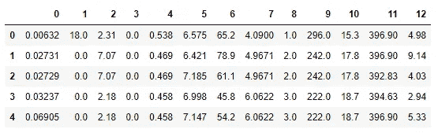
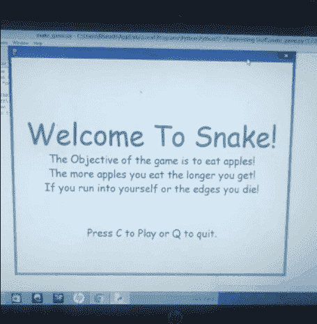

# 2021 年及以后的 15 个令人敬畏的 Python 和数据科学项目

> 原文：<https://towardsdatascience.com/15-awesome-python-and-data-science-projects-for-2021-and-beyond-64acf7930c20?source=collection_archive---------17----------------------->

## 15 个很酷的 Python 和数据科学项目，提供有用的链接和资源，为 2021 年及以后构建您的投资组合


在 [Unsplash](https://unsplash.com/s/photos/studio?utm_source=unsplash&utm_medium=referral&utm_content=creditCopyText) 上[陷入欢乐](https://unsplash.com/@caught_in_joy?utm_source=unsplash&utm_medium=referral&utm_content=creditCopyText)的照片

> **Python 和数据科学最棒的部分是实施令人敬畏和酷的项目来彻底改变当代人。**

关于 Python 编程和数据科学领域，我最喜欢的部分是您可以用它们构建大量精彩的项目。你可以建设开创性、创新性和革命性的项目，这些项目可以造福整个社会，也可以改变整个世界的面貌，实现伟大的壮举。

科技巨头和大公司正在大量投资数据科学资源，因为这一主题的创新具有巨大的潜力。创造性的数据科学家和程序员每天都在构建各种各样的壮观项目，看看我们作为个人能取得什么样的成就会很棒。

在本文中，我们将讨论 15 个令人惊叹的 Python 和数据科学项目，您可以享受实施这些项目的乐趣。这些项目保证为您提供最好的体验，让您更详细地理解大多数基本的 Python 和数据科学概念。除了从这些项目中获得的大量知识和经验，你还可以在简历中展示它们，以获得更好的工作机会或仅仅作为一种自我骄傲的标志！

> 这篇文章分为三个主要部分，面向所有层次的读者。类别包括初级、中级和高级。在每个类别中，我们都提到了五个项目。这加起来总共有 15 个精彩的项目，你可以从头开始构建。你可以选择你想选择的类别或项目。但是，强烈建议您浏览一下本文中提供的所有项目想法，以获得更多创新的想法。

所以，事不宜迟，让我们开始查看这些项目想法中的每一个，并相应地分析它们。

# 新手

## 1.使用 Python 的提醒应用程序:

让我们从一个简单的项目开始，我最近在一篇文章中提到了这个项目，它是一个提醒应用程序，它会不断地通知你一天中必须完成的各种任务。通知将根据您已编程脚本执行的时间计划程序进行提醒。

该项目仅使用两个模块来完成任务。它利用了 Python 预装的时间模块和 plyer 库，后者将用于提醒我们手头特定任务完成后的及时通知。

以下项目对于理解 Python 和与该主题相关的基本概念的初级入门来说极其简单。尽管它很简单，但它对提高你的整体生产力非常有用。提供的链接将引导您从头开始构建这个项目的整个过程。

[](/python-project-to-improve-your-productivity-for-the-new-year-1956824eddb1) [## Python 项目，提高您新一年的工作效率！

### 这是一个简单、有趣且有用的 Python 项目，旨在为即将到来的新年提高您的工作效率！

towardsdatascience.com](/python-project-to-improve-your-productivity-for-the-new-year-1956824eddb1) 

第一个项目相当简单，完成这个项目的估计时间应该在 30 分钟到 2 小时之间，这取决于程序员的兴趣和技能。但是，从后面提到的项目难度范围会逐渐增加。

## 2.没有任何 ML 库的 Python 中的矩阵乘法:


作者截图和图片

python 和机器学习的一个重要方面是理解这些概念背后的数学，并了解机器学习库中的一些代码。为了更好地掌握这些概念，有必要实践在 numpy 和 scikit 等科学模块中实现的思想——自学。一个这样的编程应用是在不使用任何 ML 库的情况下执行矩阵乘法运算。

要完成这项任务，主要要求是了解矩阵的工作原理。完整的解释和指导可以从我下面的文章中获得。但是，如果您只是对这个编码问题的基本要点感兴趣，并想尝试自己解决这个问题，那么使用下面的参考段落来帮助您开始。

[](/python-coding-from-scratch-matrix-multiplication-without-any-machine-learning-libraries-463624fe8726) [## Python 从头编码:没有任何机器学习库的矩阵乘法！

### 从零开始了解如何在没有任何机器学习库的情况下实现矩阵乘法！

towardsdatascience.com](/python-coding-from-scratch-matrix-multiplication-without-any-machine-learning-libraries-463624fe8726) 

我解决这个问题的方法是从用户那里获取所有的输入。这些是第一和第二矩阵的行数和列数。同样，根据每个矩阵的行数和列数，我们将相应地分别填充备选位置。

在做任何矩阵乘法之前，第一步是检查两个矩阵之间的运算是否实际可行。这可以通过检查第一矩阵的列是否匹配第二矩阵的行的形状来完成。这可以表述为:

> **→矩阵 1 的列数=矩阵 2 的行数**

这应该是你入门的一个很好的起点。从这里开始，你可以利用你自己的技术，以各种方式计算问题陈述。

## 3.使用各种 ML 算法的房价预测:

对于初学者来说，房价预测是开始使用各种机器学习算法的最佳方式之一。尝试这个项目最棒的部分是，您可以获得对 scikit-learn(也称为 sklearn)库的高级理解，这是机器学习任务的一个极其重要的模块。

scikit-learn 模块是机器学习和预测数据分析的最佳工具之一。它提供了广泛的预建算法，如逻辑回归，支持向量机(SVM)，分类算法，如 K 均值聚类，以及更多的操作。这是初学者开始学习机器学习算法的最佳方式，因为该模块提供了简单高效的工具。

使用此模块，您可以访问波士顿住房数据集。波士顿住房数据集来自美国人口普查局收集的马萨诸塞州波士顿地区的住房信息。数据集很小，只有 506 个案例。下面描述了数据集列:

*   CRIM——城镇人均犯罪率
*   ZN——面积超过 25，000 平方英尺的住宅用地比例
*   印度河——每个城镇非零售商业用地的比例。
*   CHAS——查尔斯河虚拟变量(1 如果区域边界为河流；否则为 0)
*   NOX——氮氧化物浓度(百万分之一)
*   RM——每个住宅的平均房间数
*   年龄——1940 年之前建造的业主自用单元的比例
*   到五个波士顿就业中心的 DIS 加权距离
*   RAD——放射状公路可达性指数
*   税收—每 10，000 美元的全价值财产税税率
*   pt ratio——按城镇分列的学生-教师比率
*   B — 1000(Bk — 0.63)，其中 Bk 是按城镇划分的黑人比例
*   LSTAT —人口中地位较低的百分比
*   MEDV——以千美元为单位的自有住房的中值

在接下来的几个代码块中，我们将讨论如何利用这个模块来访问数据集，以及分析和解决这个简单的机器学习任务所需的一些附加库。这将是一个如何开始的快速指南，并将涵盖基本要求。理解这些概念后，你应该能够在下面的数据集上实现一些机器学习算法。

第一步是导入解决这个任务的所有基本需求。建议您在尝试实现各种机器学习算法时使用以下模块。代码块是解决任务可能需要的一些代码行的简单表示。(这是为了尝试决策树或随机森林方法。)

在导入执行此任务所需的所有基本库之后，您可以加载波士顿数据集，并继续为数据和目标变量分配单独的变量。要预测的价格是目标变量，而其他重要特征是数据集的信息。这将问题转化为机器学习预测任务。您可以从下面提供的代码中做到这一点。

最后，我们可以使用 pandas 数据框结构快速可视化这些数据。这可以通过下面提到的简单代码块来构建。



上图是数据集的代表。如果愿意，您可以为各个列添加功能名称。不过，这应该是大部分初学者入门的好起点。Kaggle 和 GitHub 是你解决这些机器学习任务的最好的朋友。点击此处的链接[，查看 Kaggle 网站了解更多信息。](https://www.kaggle.com/prasadperera/the-boston-housing-dataset)

## 4.垃圾邮件检测:

垃圾电子邮件，也称为垃圾电子邮件，是通过电子邮件批量发送的未经请求的消息(垃圾邮件)。电子邮件过滤是根据特定标准对电子邮件进行组织的过程。该术语可以应用于人类智能的干预，但最常见的是指使用反垃圾邮件技术自动处理传入的消息，包括发出的电子邮件和收到的电子邮件。

各种**分类**算法可用于完成垃圾邮件检测任务。各种机器学习算法，如朴素贝叶斯、支持向量机、K-最近邻和随机森林以及许多其他算法，可用于过滤垃圾邮件消息并分类所接收的电子邮件是否是垃圾邮件。

可以使用神经网络或光学字符识别(OCR)等技术来执行高级垃圾邮件检测，Gmail 等公司也将 OCR 用于垃圾邮件过滤。

假设我们有一个 30，000 封电子邮件的数据集，其中一些被分类为垃圾邮件，一些被分类为非垃圾邮件。机器学习模型将在数据集上训练。一旦训练过程完成，我们可以用一封没有包含在我们的训练数据集中的邮件来测试它。机器学习模型可以对以下输入进行预测，并正确分类输入的电子邮件是否是垃圾邮件。

各种反垃圾邮件技术被用来防止电子邮件垃圾(未经请求的批量电子邮件)。没有一种技术可以完全解决垃圾邮件问题，每种技术都需要在不正确地拒绝合法电子邮件(误报)和不拒绝所有垃圾邮件(误报)之间进行权衡，以及相关的时间、精力和错误阻止好邮件的成本。

例如，朴素贝叶斯分类器是一种流行的电子邮件过滤统计技术。他们通常使用单词袋功能来识别垃圾邮件，这是一种常用于文本分类的方法。朴素贝叶斯分类器的工作原理是将令牌(通常是单词，有时是其他东西)的使用与垃圾邮件和非垃圾邮件相关联，然后使用贝叶斯定理来计算电子邮件是或不是垃圾邮件的概率。

朴素贝叶斯垃圾邮件过滤是一种处理垃圾邮件的基本技术，它可以根据单个用户的电子邮件需求进行调整，并提供用户通常可以接受的低误报垃圾邮件检测率。这是最古老的垃圾邮件过滤方式之一，起源于 20 世纪 90 年代。

以下内容的快速指南可从链接[此处](https://www.kdnuggets.com/2017/03/email-spam-filtering-an-implementation-with-python-and-scikit-learn.html)获得。

## 5.情感分析:

情感分析(也称为意见挖掘或情感 AI)是指使用自然语言处理、文本分析、计算语言学和生物统计学来系统地识别、提取、量化和研究情感状态和主观信息。

情感分析广泛应用于客户意见材料，如评论和调查回复、在线和社交媒体以及医疗保健材料，应用范围从营销到客户服务再到临床医学。

情感分析中的一个基本任务是在文档、句子或特征/方面级别对给定文本的*极性*进行分类——无论在文档、句子或实体特征/方面中表达的观点是积极的、消极的还是中性的。例如，高级的“超越极性”情感分类着眼于诸如“愤怒”、“悲伤”和“快乐”等情感状态。

然而，你可以选择否定其他评论，只将它们分为好或坏。例如，对于一个电影评论，任何评分为 1-2 星的都被标记为负面，评分为 4-5 的被标记为正面，而中性评分为 3 的可以相应忽略。

解决情感分析问题是你开始的最好的初级项目之一，因为你有广泛的选择来解决下面的任务。你可以选择任何你喜欢的方法来解决这个问题。

像逻辑和朴素贝叶斯这样的机器学习算法可以很容易地用来解决这类任务。可以使用许多方法来获得这个问题的解决方案，包括深度学习的方法。然而，即使是最简单的方法也可以用来解决这个任务，这取决于你决定将问题变得多复杂。

对于自然语言处理和情感分析概念的详细理解，我的建议是这里的链接。如果你愿意，你可以旁听课程。我还建议查看下面的文章，了解关于这个主题的更多信息。

[](/natural-language-processing-made-simpler-with-4-basic-regular-expression-operators-5002342cbac1) [## 4 个基本正则表达式操作符使自然语言处理变得更简单！

### 了解四种基本的常规操作，以清理几乎任何类型的可用数据。

towardsdatascience.com](/natural-language-processing-made-simpler-with-4-basic-regular-expression-operators-5002342cbac1) 

# 中间的

## 6.用 Python 构建一个游戏:



我的第一个项目的作者过时的 GIF

你们在上面看到的过时的 GIF 是我三年前在 pygame 的帮助下完成的第一个项目。如果你想要一个更简洁的关于如何用 python 从头开始构建的指南，请告诉我。但是这里的主要思想是用 python 自己从头开始构建一个游戏。从一些简单的游戏开始，比如蛇游戏，或者井字游戏，然后通过强化学习进行更高级的游戏，比如 flappy birds。

完成这项任务背后的想法更多的是个人观点和偏好。我相信掌握任何编程语言的最好方法之一就是从一个有趣和令人愉快的项目开始。我也有点沉迷游戏。为了开始与 python 相关的游戏项目，我强烈推荐使用 Pygame 库模块来执行这类程序。

使用 pygame 模块，您可以用 python 构建一些简单有趣的游戏。然而，不要期望任何过于花哨的东西，因为它有其局限性。不管怎样，这是一个很好的开始方式，下面是开始代码。只需用一个简单的 pip 命令安装 pygame，然后使用下面的 import pygame 命令。成功导入模块后，将出现以下消息。

```
pygame 1.9.6
Hello from the pygame community. [https://www.pygame.org/contribute.html](https://www.pygame.org/contribute.html)
```

根据安装时间的不同，版本可能会有所不同，所以不要太担心。在任何情况下都使用更新的版本。我将介绍一些你应该知道的基本命令以及它们是如何工作的。下面是 pygame 入门所需了解的所有重要方面的完整代码块。

```
#imports the pygame library module
import pygame# initilize the pygame module
pygame.init()# Setting your screen size with a tuple of the screen width and screen height
display_screen = pygame.display.set_mode((800,600)) 

# Setting a random caption title for your pygame graphical window.
pygame.display.set_caption("pygame test")# Update your screen when required
pygame.display.update()# quit the pygame initialization and module
pygame.quit()# End the program
quit()
```

我强烈建议你看看 YouTube 上的一些视频，以便更好地理解和学习制作一些游戏。pygame 模块的[文档](https://python101.readthedocs.io/pl/latest/_downloads/pygame192.pdf)虽然有点冗长，但可能是了解这个模块更多信息的最佳资源之一。

## 7.使用 OpenCV 处理图像:


图片来自[维基](https://en.wikipedia.org/wiki/File:Lenna_(test_image).png)

计算机视觉是一个跨学科的科学领域，研究计算机如何从数字图像或视频中获得高层次的理解。从工程的角度来看，它寻求理解和自动化人类视觉系统可以完成的任务。

RGB 是计算机视觉任务中最重要的三层颜色。这三种颜色，即红色、绿色和蓝色的组合可以用来组合几乎任何其他颜色。将它们以正确的比例混合，我们就可以设计出任何其他想要的颜色。这个概念从几十年前的阴极射线电视就存在了。

每种颜色都有一个 8 位的整数值。这意味着这些矩阵的范围可以从 0 到 255。这是因为⁸是 256，0–255 由 256 个值组成。这些颜色中的每一种都有一个这个范围的值，因为我们有一个三维图像，我们可以将这些颜色相互叠加。

OpenCV 模块是迄今为止执行复杂机器学习、深度学习和计算机视觉任务的最佳库。它为正在构建的模型的分析和性能提供了简单性和高标准。它是一个开源库，可以与 NumPy 等其他 python 模块集成，以完成复杂的实时应用程序。它被广泛的编程语言所支持，并且可以在大多数平台上运行，比如 Windows、Linux 和 MacOS。

工作和处理图像是人工智能和数据科学的计算机视觉项目的一个重要方面。图像的读取、显示和写入是计算机视觉的重要组成部分，因为你必须始终如一地处理图像。除了前面提到的优点之外，opencv 最大的优点是它还允许您访问各种图像格式。因此，我们可以处理所有这些图像格式，而不会面临任何重大问题。

下面提到的文章链接是从零开始掌握计算机视觉基础的简明指南。我已经涵盖了初学者入门的所有基本方面，并对 OpenCV 模块以及如何操作各种图像有了全面详细的理解。

[](/opencv-complete-beginners-guide-to-master-the-basics-of-computer-vision-with-code-4a1cd0c687f9) [## OpenCV:用代码掌握计算机视觉基础的完全初学者指南！

### 包含代码的教程，用于掌握计算机视觉的所有重要概念，以及如何使用 OpenCV 实现它们

towardsdatascience.com](/opencv-complete-beginners-guide-to-master-the-basics-of-computer-vision-with-code-4a1cd0c687f9) 

## 8.GTTS 和 OCR:

我们将关注的下一个中级水平是拥有 python 编程知识的最酷的方面之一。复杂的任务，如文本到语音的转换和 python 的光学字符识别，只需要理解为此目的创建的 python 库模块就可以完成。

文本到语音(TTS)是将单词转换成有声音频形式的过程。程序、工具或软件从用户处获取输入文本，并使用自然语言处理方法，理解所使用语言的语言学，并对文本执行逻辑推理。该处理后的文本被传递到下一个块，在那里对处理后的文本执行数字信号处理。随着许多算法和转换的使用，这个处理过的文本最终被转换成语音格式。这整个过程包括语音合成。

光学字符识别是通过使用电子或机械设备将二维文本数据转换成机器编码的文本形式。二维文本数据可以从各种来源获得，例如 PDF 文件之类的扫描文档、具有以下格式的文本数据的图像。png 或者。jpeg、路标(如交通标志)或任何其他带有任何形式文本数据的图像。光学字符识别有广泛的有趣应用。

下面是两篇文章的列表，对于您熟悉用于语音翻译的 Google 文本到语音模块和用于光学字符识别的 pytesseract 模块非常有用。请参考下面的文章，获得全面的入门指南，并一起使用它们执行项目。

[](/how-to-get-started-with-google-text-to-speech-using-python-485e43d1d544) [## 如何使用 Python 开始使用 Google 文本到语音转换

### 从零开始的文本到语音转换简介

towardsdatascience.com](/how-to-get-started-with-google-text-to-speech-using-python-485e43d1d544) [](/getting-started-with-optical-character-recognition-using-python-e4a9851ddfab) [## 使用 Python 开始光学字符识别

### 对光学字符识别从无到有的直观理解和简要介绍

towardsdatascience.com](/getting-started-with-optical-character-recognition-using-python-e4a9851ddfab) 

## 9.面部识别:

人脸识别是对人脸以及用户授权姓名的程序性识别。人脸检测是一个更简单的任务，可以被认为是一个初级水平的项目。人脸检测是人脸识别的必要步骤之一。人脸检测是一种将人脸与身体的其他部分和背景区分开的方法。

haar 级联分类器可以用于面部检测的目的，并且准确地检测帧中的多个面部。正面人脸的 haar 级联分类器通常是一个 XML 文件，可以与 open-cv 模块一起使用，用于读取人脸，然后检测人脸。一种机器学习模型，如定向梯度直方图(H.O.G ),可与标记数据和支持向量机(SVM)一起使用，以执行此任务。

人脸识别的最佳方法是利用 DNN(深度神经网络)。在检测到人脸之后，我们可以使用深度学习的方法来解决人脸识别任务。有各种各样的迁移学习模型，如 VGG-16 架构、RESNET-50 架构、face net 架构等。这可以简化构建深度学习模型的过程，并允许用户构建高质量的人脸识别系统。

你也可以建立一个定制的深度学习模型来解决人脸识别任务。为人脸识别建立的现代模型非常准确，对标记数据集的准确率几乎超过 99%。人脸识别模型的应用可以用于安全系统、监控、考勤系统等等。

下面是我使用 VGG-16 迁移学习的方法建立的人脸识别模型的例子，用于在通过 haar 级联分类器执行人脸检测之后进行人脸识别。请查看它，了解关于如何构建自己的人脸识别模型的更详细的解释。

[](/smart-face-lock-system-6c5a77aa5d30) [## 智能面部锁定系统

### 建立高精度人脸识别模型

towardsdatascience.com](/smart-face-lock-system-6c5a77aa5d30) 

上面的链接是一个高精度人脸识别系统的示例，该系统使用深度学习和迁移学习方法来授予授权用户访问权限，并拒绝未经授权的人员的权限。使用图像数据增加和转移学习模型的方法，授权用户面部的面部识别模型以高准确度水平进行预测。

## 10.下一个单词的预测:

从事数据科学项目的一个独特方面是创建令人惊叹的预测类型模型的能力。谷歌搜索栏、WhatsApp 消息等。在许多其他应用程序中，使用下一个单词预测方法在键入每个新单词后预测适当的建议。

这类似于自动完成或单词完成，这是一种应用程序预测用户正在键入的单词的剩余部分的功能。在 Android 智能手机中，这被称为预测文本。在图形用户界面中，用户通常可以按 tab 键接受一个建议，或者按向下箭头键接受几个建议中的一个。

对于从中级项目过渡到相当高级的项目，这个项目想法是一个极好的选择。这个项目想法使用了自然语言处理的主要概念，并且需要相当多的技巧来解决。你可以使用各种机器学习算法和技术来解决这个任务。然而，我建议并鼓励你们所有人尝试一些创新的深度学习方法来解决这个项目，同时旨在实现一流的结果。

对特定用户发短信或打字的下一个单词的预测可能非常棒。通过了解用户的短信模式，可以节省大量时间。这也可以用来创建一个更大的虚拟助手项目来完成某些句子。总的来说，预测搜索系统和下一个单词预测是一个非常有趣的概念。你可以看看我下面的文章，它涵盖了预测接下来单词的深度学习方法论。

[](/next-word-prediction-with-nlp-and-deep-learning-48b9fe0a17bf) [## 基于自然语言处理和深度学习的下一个单词预测

### 使用 LSTM 设计单词预测系统

towardsdatascience.com](/next-word-prediction-with-nlp-and-deep-learning-48b9fe0a17bf) 

上面提到的资源使用基于 LSTM 的深度学习模型，该模型采用输入单词或句子，并预测下一个合适的单词。该深度学习模型使用具有自然语言处理的长短期记忆的概念，用于语料库和文本数据的预处理。使用自定义顺序模型来预测适当的下一个单词。它在社交媒体中有广泛的应用，用于下一个单词的预测。

# 先进的

## 11.物体检测/物体跟踪—

这个计算机视觉项目很容易被认为是一个相当先进的项目，但是有这么多免费的工具和资源可供使用，你可以毫不费力地完成这项任务。对象检测任务是在识别的对象周围绘制边界框，并根据确定的标签识别识别的对象，并以特定的精度预测这些标签的方法。与对象检测相比，对象跟踪略有不同，因为您不仅要检测特定的对象，还要跟随周围有边界框的对象。

对象检测是一种计算机视觉技术，它允许我们在图像或视频中识别和定位对象。通过这种识别和定位，可以使用对象检测来计数场景中的对象，并确定和跟踪它们的精确位置，同时准确标记它们。这种情况的一个例子可以是在道路上跟随特定的车辆，或者在任何体育比赛中跟踪球，如高尔夫、板球、棒球等。

执行这些任务的各种算法有 R-CNN(基于区域的卷积神经网络)、SSD(单次检测器)和 YOLO(你只看一次)等等。我将提到两位天才程序员的两个最佳资源。

一种方法更适合像 raspberry pi 这样的嵌入式系统，另一种方法用于 PC 相关的实时网络摄像头对象检测。下面这两个资源是开始使用对象检测/对象跟踪的一些最佳方法，它们也有详细解释它们的 YouTube 视频。请务必查看这些资源，以便更好地理解对象检测。

[](https://github.com/EdjeElectronics/TensorFlow-Lite-Object-Detection-on-Android-and-Raspberry-Pi) [## edjee electronics/tensor flow-Lite-Android-and-Raspberry-Pi 上的对象检测

### 本指南展示了如何训练 TensorFlow Lite 对象检测模型，并在 Android、Raspberry Pi 和

github.com](https://github.com/EdjeElectronics/TensorFlow-Lite-Object-Detection-on-Android-and-Raspberry-Pi) [](https://github.com/theAIGuysCode/Object-Detection-API) [## 代码/对象检测 API

### Yolov3 是一种使用深度卷积神经网络来执行对象检测的算法。此存储库…

github.com](https://github.com/theAIGuysCode/Object-Detection-API) 

## 12.高级创新聊天机器人:

对高质量聊天机器人的需求每天都在增加。聊天机器人现在如此受欢迎的主要原因是因为它们可以提供关于网站或特定主题的自动回复。他们可以回答常见问题，并通过欢迎新用户和向他们介绍特定网站来帮助新用户。

一个训练有素的聊天机器人甚至可以像人类助手一样与用户交谈。聊天机器人还能够参与对话，并在推广网站或社交媒体网页时帮助用户了解网站的内容。他们还可以做广告，从用户那里获得更好的互动。所有这些因素使得聊天机器人对于任何小型初创公司或任何大型网站都非常重要，因为它节省了大量的人力和资源。

具有神经网络和自然语言处理(NLP)的深度学习算法是当今使用的最流行的聊天机器人方法。还有很多其他的机器学习算法可以使用。在深度学习中，使用更普遍的 LSTMs，并且优先考虑顺序到顺序的模型。下面是一个由我从头开始构建的创新聊天机器人的例子。

[](/innovative-chatbot-using-1-dimensional-convolutional-layers-2cab4090b0fc) [## 使用一维卷积层的创新聊天机器人

### 从头开始使用深度学习和 Conv-1D 层构建聊天机器人

towardsdatascience.com](/innovative-chatbot-using-1-dimensional-convolutional-layers-2cab4090b0fc) 

> 上面提到的资源是一个具有一维卷积层的创新聊天机器人。

一个基于一维文本分类的聊天机器人，以讽刺的方式回答常见问题。这种聊天机器人模型是虚拟助理项目的一个组成部分，它将以机智的回答来回应用户，并让用户参与有趣的对话。聊天机器人模式也非常适合随意聊天，吸引外国观众。它还拥有高质量的预测系统。

## 13.机器翻译:

机器翻译，有时简称为 MT，是计算语言学的一个子领域，研究使用软件将文本或语音从一种语言翻译成另一种语言。

在基本层面上，机器翻译执行一种语言中的单词对另一种语言中的单词的机械替换，但仅此一项很少产生好的翻译，因为需要识别整个短语及其在目标语言中最接近的对应物。并非一种语言中的所有单词在另一种语言中都有对应的单词，许多单词都有不止一种含义。

这些类型的问题可以用人工智能和数据科学技术来解决。这些通常致力于自然语言处理、机器学习和深度学习等概念。具有关注的序列对序列(Seq2seq) 机制可用于实现这些预测的更高准确性和更低损失。Seq2seq 是一系列机器学习方法，用于包括语言翻译的应用程序的语言处理。

Seq2seq 把一个序列变成另一个序列。它通过使用递归神经网络(RNN)或更常见的 LSTM 或 GRU 来避免消失梯度的问题。每一项的上下文都是上一步的输出。主要组件是一个编码器和一个解码器网络。编码器将每个项目转换为包含项目及其上下文的相应隐藏向量。解码器反转该过程，将向量转换为输出项，使用之前的输出作为输入上下文。

对于自然语言处理，甚至存在零拍和一拍的学习方法。可以使用相同的方法来更好地训练模型，以提高整体性能，并避免重复的训练过程，这在一些现实生活的应用程序和场景中可能是一个真正的大障碍。因此，一次性学习是在其他培训能力较低的嵌入式系统中部署和工作的一个很好的选择。

机器翻译是一个很棒的高级项目，可以尝试并从中获得乐趣。完成这项任务的一个很好的资源是 TensorFlow 的官方网站，它专注地处理神经机器翻译。他们在一个玩具数据集上工作，并就如何执行下面的复杂问题提供了很好的内幕。你可以点击查看[的链接。](https://www.tensorflow.org/tutorials/text/nmt_with_attention)

## 14.人类情感和手势检测:

这个项目使用计算机视觉和深度学习来检测各种面孔，并对特定面孔的情绪进行分类。这些模型不仅对情绪进行分类，而且还相应地对所识别的手指的不同手势进行检测和分类。

在区分人的情绪或姿势之后，由训练的模型分别提供对人的情绪或姿势的准确预测的声音响应。这个项目最好的部分是你可以选择的广泛的数据集。

该项目是一个相当先进的计算机视觉任务，这将是真棒适合你的简历广泛完成的项目。从事这个神话般的项目也将为你提供一些必须需要的经验，以完成与深度学习和计算机视觉相关的复杂和复杂的问题。

下面的链接是我通过使用计算机视觉、数据增强和库(如 TensorFlow 和 Keras)的方法来建立深度学习模型而完成的一个深度学习项目的参考。我强烈建议观众查看下面的两部分系列，了解如何计算以下高级计算机视觉任务的完整分解、分析和理解。此外，请务必参考上一节中提供的 Google 文本到语音链接，以了解文本到语音的有声文本转换是如何工作的。

[](/human-emotion-and-gesture-detector-using-deep-learning-part-1-d0023008d0eb) [## 使用深度学习的人类情感和手势检测器:第 1 部分

### 了解如何从零开始构建具有深度学习的人类情感和手势检测器。

towardsdatascience.com](/human-emotion-and-gesture-detector-using-deep-learning-part-1-d0023008d0eb) [](/human-emotion-and-gesture-detector-using-deep-learning-part-2-471724f7a023) [## 使用深度学习的人类情感和手势检测器:第 2 部分

### 深入探究人类情感和手势识别

towardsdatascience.com](/human-emotion-and-gesture-detector-using-deep-learning-part-2-471724f7a023) 

上面提供的链接代表了一种识别人类情绪和手势的计算机视觉和深度学习模型。该模型还提供声音响应，并相应地对相应的情绪或手势进行分类。使用深度学习技术和定制的顺序模型来实现对人类情绪的高准确性，并基于 VGG-16 架构进行手势识别的转移学习。

## 15.与甘斯合作的项目:

GANs 是由 Ian Goodfellow 在 2014 年开发和发明的，他的同事最近获得了巨大的人气。GANs 被认为是深度学习的未来，因为它们拥有创造前所未有的视觉和图像的惊人能力。生成对抗网络是当前深度学习的高峰，具有非常好的改善曲线。

GANs 是一个不可否认的未来趋势，它将永远革新人工智能。GANs 是一个稍微复杂的主题，我将在接下来的文章中一部分一部分地广泛讨论它。然而，出于本帖的目的，有必要注意两个网络、一个生成器和一个鉴别器相互开战，并发生了小纠纷。

生成器试图创建逼真的假图像来绕过鉴别器的基本检查，而鉴别器的作用是捕捉假拷贝。这种猫捉老鼠的追逐导致了从未有过的独特样本的发展，而且是现实的，远远超出了人类的想象。

我不打算提及 GANs 的任何具体项目，因为有各种各样独特和令人敬畏的应用程序以及其他创新项目可以用它们来创建。GANs 的受欢迎程度正在上升，它可以从绝对无中创造出新的艺术和现实的形象。人们甚至在探索从各种子领域和流派中产生音乐。因此，它们不仅限于图像。

从名为“[thispersondoesexist.com](https://thispersondoesnotexist.com/)”的网站可以观察到一个著名的生成性对抗网络(GANs)的例子刷新或重新访问这个网站时，你会遇到实际上并不存在的新面孔。这个项目是由 Karras 等人和 Nvidia 开发的一种称为 style gan 2(2019 年 12 月)的 GANs(生成对抗网络)类型构建和想象的。

# 结论:


照片由[摩根塞申斯](https://unsplash.com/@morgansessions?utm_source=medium&utm_medium=referral)在 [Unsplash](https://unsplash.com?utm_source=medium&utm_medium=referral) 拍摄

用 Python 和数据科学构建各种新项目，会让你更好的理解和掌握你学过的概念。用 Python 和数据科学构建新应用的热情是在这一领域取得成功的重要品质。

对于数据科学的各种主题，从理论上理解机器学习概念和数学背后的直觉至关重要。要欣赏数据科学的真正魅力，你需要尝试许多项目。大量的任务和你能解决的问题绝对是奇妙的，当你找到它们各自的解决方案时会有一种成就感。

但是，您还需要知道如何在现实生活的实际场景中实现以下项目。不要害怕接触一些代码，自己实现这些项目。尝试不同的参数，并通过尝试各种算法和方法来获得更好的解决方案。

在本文中，我们讨论了 15 个非常棒的 Python 和数据科学项目，您可以尝试一下。这些想法非常适合任何人的简历，因为它包括了你已经完成的一系列独特而又酷的项目。这将有助于你提高你的整体形象，并帮助你更有效地清除最初的选择过程。

随着这些项目的实施，你也将获得更多的实用知识和对你所研究的概念的深刻理解。如果您对本文讨论的主题有任何疑问，请在下面的评论区告诉我，我会尽快给您回复。

看看我的其他一些文章，你可能会喜欢读！

[](/do-you-need-to-pay-to-learn-data-science-e71f75493e5a) [## 学数据科学需要付费吗？

### 钱是学习数据科学的必备条件吗？分析最好的免费资源和有用的链接，以获得…

towardsdatascience.com](/do-you-need-to-pay-to-learn-data-science-e71f75493e5a) [](/12-steps-for-beginner-to-pro-in-data-science-in-12-months-c6f6ba01f96e) [## 12 个月内数据科学从初学者到专业人士的 12 个步骤！

### 每月遵循一步，到第二年年底掌握数据科学！

towardsdatascience.com](/12-steps-for-beginner-to-pro-in-data-science-in-12-months-c6f6ba01f96e) [](/everything-you-need-to-know-about-jupyter-notebooks-10770719952b) [## 关于 Jupyter 笔记本你需要知道的一切！

### 分解 Jupyter 笔记本的所有内容，从菜单到运行电池，以及各种…

towardsdatascience.com](/everything-you-need-to-know-about-jupyter-notebooks-10770719952b) [](/7-tips-to-increase-your-productivity-in-python-bc1835622aa5) [## 提高 Python 生产率的 7 个技巧

### 7 个技巧将帮助您改善编程效果，并提高 Python 的工作效率。

towardsdatascience.com](/7-tips-to-increase-your-productivity-in-python-bc1835622aa5) [](/understanding-the-binary-search-algorithm-in-python-5f41b5e6dbb7) [## 理解 Python 中的二分搜索法算法

### 详细了解二分搜索法算法的工作原理及其在 python 中的实现。

towardsdatascience.com](/understanding-the-binary-search-algorithm-in-python-5f41b5e6dbb7) 

谢谢你们坚持到最后。我希望你们喜欢阅读这篇文章。我希望你们都有美好的一天！