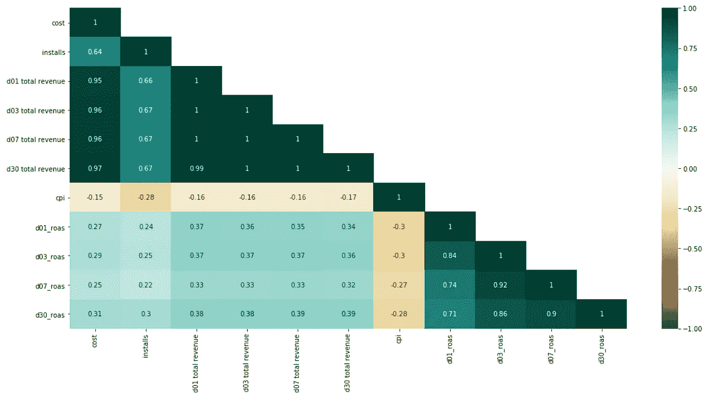

# 移动营销活动:ROAS(广告支出回报)

> 原文：<https://towardsdatascience.com/15-business-questions-about-mobile-marketing-campaigns-roas-return-on-ad-spend-ff636a8095b6?source=collection_archive---------15----------------------->

## 探索性营销数据分析，用于监控和评估移动营销活动(EDA)的绩效


在 [Unsplash](https://unsplash.com?utm_source=medium&utm_medium=referral) 上由 [Rodion Kutsaev](https://unsplash.com/@frostroomhead?utm_source=medium&utm_medium=referral) 拍照

作为一名营销数据分析师，他的工作是共同努力，正确地进行数字营销数据分析，以准确地监控和评估公司所有正在进行的数字行动和活动的绩效。

我具体指的是创建一个有效的分析系统，能够监控**指标**和**关键绩效指标**，从中可以衡量和优化我们营销部门团队正在开展的数字化运营工作的结果。

## 该项目

该数据集包含一些营销活动(Vungle 和脸书合作伙伴)在每次激活后 1 个月内收集的信息，这些营销活动旨在让用户安装和试用移动应用程序，特别是一款适用于 Android 和 iOS 智能手机的在线游戏。

## 目标

目标是确定整体绩效，并在分析期间监控广告支出回报(ROAS ),从而为营销部门提供更新见解。

## 数据集

*   **媒体来源**(广告合作伙伴的名称)
*   **活动名称**(广告活动的名称)
*   **成本**(营销上的花费)
*   **安装数**(生成的安装数)
*   **D01**总收入
*   **D03**总收入
*   **D07**总收入
*   **D30**总收入

**D *x*** **总收入**是在安装后的第一个 ***x*** 天内从作为特定营销活动的直接响应而安装的用户那里产生的总收入。

## 要计算的 KPI:

*   **CPI(每次安装的成本)**
    CPI =活动/应用安装的成本
*   **Dx ROAS(广告支出回报率)其中 *x* = [1，3，7，30]** ROAS 是一种衡量数字广告活动效果的指标，可以理解为:
    ROAS =总活动收入/广告活动成本

## 商业问题

以下是我们将回答的一些业务问题:

*   Q1。是否有更多的冯格或脸书运动？
*   Q2。哪个合作伙伴的活动产生了更多的用户安装？
*   Q3。脸书的整体消费物价指数是多少？
*   Q4。有多少脸书活动提供了高于平均水平的安装量？
*   Q5。Vungle 的整体 CPI 是多少？
*   Q6。有多少 Vungle 活动提供了高于平均水平的安装量？
*   Q7。两个平台的性能相似吗(成本与安装)？
*   Q8。脸书整个 D30 的房价是多少？
*   Q9。整个 D30 的房价是多少？
*   Q10。两种平台的总成本与 D30 ROAS 比较
*   Q11。竞选期间的各个阶段之间有什么关联吗？
*   Q12。roa 最高的活动总收入也最高？
*   Q13。第一个月之后，第一天的 roa 低于 10%的营销活动是否达到收支平衡？
*   Q14。假设第 7 天 roa 高于 70%的营销活动将在 30 天后达到收支平衡，这是否安全？
*   Q15。监控两个平台的整体 ROAS 发展

我们将在 Python 3 中进行这种探索性的数据分析。你可以在这里找到完整的代码[。
可在](https://bit.ly/3gx0m03)[这里](https://bit.ly/2Pg9meF)下载“mkt_ua_campaigns.csv”数据集。

我们将从导入所需的 Python 库(pandas、numpy、matplotlib.pyplot、seaborn 和 regex)开始，从 CSV 文件加载数据集，检查行数(89 个观察值)和特征数(8 列)，没有缺失值，并显示几行。


作者图片

请注意,“Installs”变量的值有一个异常模式:当是脸书活动时，有一个逗号分隔千位，而在 Vungle 活动中没有逗号。

第二，特性“成本”和 D *(01 到 30)* 总收入将美元表示为一个类别类型，其中包括“$”符号。

要将变量的数据类型转换为数值，必须解决这些问题，并按如下方式清理数据集。

```
# Lowering columns' capital letters for easy typing
df.columns = map(str.lower, df.columns)# Selecting columns 
cols= ["cost","installs","d01 total revenue","d03 total revenue","d07 total. revenue","d30 total revenue"]# Cleaning unvalid characters
df[cols] = (df[cols].replace({‘,’:’’}, regex=True))df["cost"] = (df["cost"].str.replace('$','')).str.strip()df["d01 total revenue"] = (df["d01 total revenue"].str.replace('$','')).str.strip()df["d03 total revenue"] = (df["d03 total revenue"].str.replace('$','')).str.strip()df["d07 total revenue"] = (df["d07 total revenue"].str.replace('$','')).str.strip()df["d30 total revenue"] = (df["d30 total revenue"].str.replace('$','')).str.strip()# Transforming columns as float (numeric type)
df[cols] = df[cols].astype(float).copy() 
```


作者图片

既然我们已经设置好并准备好继续前进，那么是时候**计算我们的 KPI**了，我们将能够从 KPI 中分析整体发展的绩效，并通过逐活动放大来分析绩效。

首先，我将从确定每个活动的 **CPI** (每次安装的成本)开始。为了进行计算，我们简单地将每个活动的成本除以每个活动产生的安装数量。

```
# Determine "Cost Per Install" in a new columndf["cpi"] = df.apply(lambda x: x["cost"] / x["installs"],axis=1) 
```

让我们也计算一下从用户安装应用的第一天算起的第一天、第三天、第七天和第三十天的 **ROAS** (广告支出回报)。为此，我们将每一天的活动总成本除以总收入。

```
# Calculations to determine "dx_roas" in new columnsdf["d01_roas"] = df.apply(lambda x: x["d01 total revenue"] / x["cost"], axis=1)df["d03_roas"] = df.apply(lambda x: x["d03 total revenue"] / x["cost"], axis=1)df["d07_roas"] = df.apply(lambda x: x["d07 total revenue"] / x["cost"], axis=1)df["d30_roas"] = df.apply(lambda x: x["d30 total revenue"] / x["cost"], axis=1) 
```

让我们展示我们的最终数据集，并仔细看看我们的指标和 KPI。从这一点出发，我们准备从数据中提取一些重要和相关的见解。


作者图片

# 探索性数据分析

## Q1。是否有更多的冯格或脸书运动？

在总共 89 场活动中，77 场在脸书进行，只有 12 场通过 Vungle 平台进行，分别占 87%和 13%。

```
# Side table
absolut = df["media source"].value_counts().to_frame()percent = (df["media source"].value_counts(normalize=True)*100).to_frame().rename(columns={"media source":"percent"})out_bal = pd.concat([absolut,percent],axis=1).round(decimals=2)
display(out_bal)# Pie graphabsolut.plot(kind='pie', subplots=True, autopct='%1.2f%%', explode= (0.05, 0.05), startangle=80, legend=False, fontsize=12, figsize=(16,7))# Paramsplt.xticks(rotation=0, horizontalalignment="center")
plt.title("Total marketing campaigns", fontsize=10, loc="right"); 
```


图片作者。

## Q2。哪个合作伙伴的活动产生了更多的用户安装？

Vungle 总共产生了 242112 个安装(55%)，而脸书负责 197357 个安装(45%)。

```
# Bar plotax = df.groupby(["media source"])["installs"].sum().plot(kind="bar", figsize=(9,6), fontsize=12, color=sns.color_palette("rocket"), table=False)for p in ax.patches: ax.annotate("%.2f" % p.get_height(), (p.get_x() + p.get_width() / 2., p.get_height()), ha='center', va='center', xytext=(0, 7), textcoords='offset points')# Paramsplt.xlabel("media source", fontsize=10)
plt.xticks(rotation=0, horizontalalignment="center")
plt.ylabel("Absolute frequency", fontsize=10)
plt.title("Overall installs proportion", fontsize=10, loc="right")# side tableinstalls = df.groupby(["media source"])["installs"].sum().sort_values(ascending=False).to_frame()installs["percent"] = (installs.apply(lambda x: x/x.sum())*100).round(2)display(installs) 
```


作者图片

## Q3。脸书的整体消费物价指数是多少？

为了计算总体 CPI，我们将所有脸书营销活动的成本相加，然后除以脸书的总安装成本。**结果是 1.97 美元。**为了便于计算，我们可以只选择脸书活动。

```
# Filtering records from Facebook onlyfb = df[["media source","cost","installs"]].copy()
fb = fb[fb["media source"] == "Facebook"].copy() 
```


作者图片

```
# Calculating Costs Per Installing (Facebook)
fb.cost.sum() / fb.installs.sum()>> 1.9671306312925307# Visualizing Costs vs. Installs sorted by highest cost
fb = fb.reset_index().copy()
fb.drop(["index"], axis=1, inplace=True)fb.plot.line()plt.xlabel('Number of campaigns')
plt.ylabel('Absolute Frequency')
plt.title('Costs vs. Installs [Facebook]', fontsize=10, loc="right")
plt.show() 
```


作者图片

## Q4。有多少脸书活动提供了高于平均水平的安装量？

2563 是每个活动的平均安装次数。 **14 个脸书活动**产生的安装量高于脸书平均水平，只有 6 个脸书活动产生的安装量高于总平均水平(4937)。

```
# Filtering records from Facebook only
fb_mean = df[df["media source"] == "Facebook"].copy()# Visualizing comparisons between Facebook campaings and between Facebook average campaings and total average campaignsax = fb_mean.groupby("campaign name")["installs"].mean().sort_values(ascending=False).head(15).plot(kind="bar", figsize=(16,9), fontsize=12, color=sns.color_palette("rocket"), table=False)# Params
plt.xticks(rotation=30, horizontalalignment="right")
plt.ylabel("Absolute values", fontsize=10)
plt.xlabel("Facebook campaigns", fontsize=10)
plt.title("Facebook campaigns vs. Facebook average installs", fontsize=10, loc="right")plt.axhline(fb_mean.groupby("campaign name")["installs"].mean().mean(), linewidth=2, color ="r")
plt.axhline(df.groupby("campaign name")["installs"].mean().mean(), linewidth=2, color ="b")plt.legend(('Facebook average installs', 'Total average installs'))
plt.tight_layout() 
```


作者图片

## Q5。Vungle 的整体 CPI 是多少？

要确定 Vungle 的总体 CPI，步骤与上一步类似，我们将所有 Vungle 活动的成本相加，然后除以 Vungle 安装总数。**结果是 0.74 美元。**同样，我们只能选择 Vungle 活动。

```
# Filtering records from Vungle onlyvun = df[["media source","cost","installs"]].copy()
vun = vun[vun["media source"] == "Vungle"].copy() 
```


作者图片

```
# Calculating Costs Per Installing (Vungle)
vun.cost.sum() / vun.installs.sum()>> 0.7351143272535026# Visualizing Costs vs. Installs sorted by highest cost
vun.reset_index(drop=True, inplace=True)vun.plot.line()plt.xlabel('Number of campaigns')
plt.ylabel('Absolute Frequency')
plt.title('Costs vs. Installs [Vungle]', fontsize=10, loc="right")
plt.show() 
```


作者图片

## Q6。有多少 Vungle 活动提供了高于平均水平的安装量？

20176 是每个活动的平均安装次数。只有 **3 个 Vungle 活动**产生了高于 Vungle 平均值的安装量，11 个 Vungle 活动产生了高于总平均值的安装量(4937)。

```
# Filtering records from Facebook only
vn_mean = df[df["media source"] == "Vungle"].copy()# Visualizing comparisons between Vungle campaings and between Vungle average campaings and total average campaignsax = vn_mean.groupby("campaign name")["installs"].mean().sort_values(ascending=False).plot(kind="bar", figsize=(16,9), fontsize=12, color=sns.color_palette("rocket"), table=False)# Paramsplt.xticks(rotation=30, horizontalalignment="right")
plt.ylabel("Absolute values", fontsize=10)
plt.xlabel("Vungle campaigns", fontsize=10)
plt.title("Vungle campaigns vs. average installs", fontsize=10, loc="right")plt.axhline(vn_mean.groupby("campaign name")["installs"].mean().mean(), linewidth=2, color ="r")
plt.axhline(df.groupby("campaign name")["installs"].mean().mean(), linewidth=2, color ="b")plt.legend(('Vungle average installs', 'Total average installs'))
plt.tight_layout() 
```


作者图片

## Q7。两个平台的性能相似吗(成本与安装)？

实际上，当比较两个平台产生的成本和安装量时，它们之间有着巨大的差异。

在广告总投资 177980 美元的情况下，Vungle 能够产生 242112 次安装，而脸书产生 197357 次安装，但投资金额为 388227 美元。

```
# Concatenating both Facebook + Vungle datasets
cpi2brand = pd.concat([fb, vun])# Bar plotax = cpi2brand.groupby(["media source"])[["cost","installs"]].sum().plot(kind="bar", figsize=(9,6), fontsize=12, color=sns.color_palette("rocket"), table=False)for p in ax.patches: ax.annotate("%.2f" % p.get_height(), (p.get_x() + p.get_width() / 2., p.get_height()), ha='center', va='center', xytext=(0, 7), textcoords='offset points')# Params
plt.xlabel("media source", fontsize=10)
plt.xticks(rotation=0, horizontalalignment="center")
plt.ylabel("Absolute frequency", fontsize=10)
plt.title("Overall Cost vs Installs comparison [Facebook + Vungle]", fontsize=10, loc="right")# side table
installs = cpi2brand.groupby(["media source"])[["cost","installs"]].sum().sort_values(by="cost", ascending=False)display(installs) 
```


作者图片

## Q8。脸书整个 D30 的房价是多少？

为了确定 30 天后广告支出的回报，我们需要合计第 30 天的总收入，然后除以在脸书上的总投资。

结果是在第 30 天，**脸书捕获了 72.65%的 ROAS** 。

```
# Selecting Facebook segment datasetfb_d30 = df[["media source","cost","d30 total revenue"]].copy()
fb_d30 = fb_d30[fb_d30["media source"] == "Facebook"].copy()
```


作者图片

```
# Calculating Return On Advert Spend (Facebook) over 30 daysfb_d30["d30 total revenue"].sum() / fb_d30.cost.sum()>> 0.7265414306578368# Visualizing Costs vs. installs over 30 days sorted by highest cost (Facebook)fb_d30.plot.line()plt.xlabel('Number of campaigns')
plt.ylabel('Absolute Frequency')
plt.title('Costs vs. d30 total revenue [Facebook]', fontsize=10, loc="right")
plt.show() 
```


作者图片

## Q9。整个 D30 的房价是多少？

要确定 Vungle 的 D30 回报率，将第 30 天的总收入相加，然后除以在平台上的总投资。

结果是在第 30 天，**92.88%的 ROAS** 被捕获用于 Vungle。

```
# Selecting Vungle segment datasetvun_d30 = df[["media source","cost","d30 total revenue"]].copy()
vun_d30 = vun_d30[vun_d30["media source"] == "Vungle"].copy()
```


作者图片

```
# Calculating Return On Ads Spend (Vungle) after 30 days
fb_d30["d30 total revenue"].sum() / fb_d30.cost.sum()>> 0.9287728958309922# Visualizing Costs vs. installs over 30 days sorted by highest cost (Vungle)vun_d30.plot.line()plt.xlabel('Number of campaigns')
plt.ylabel('Absolute Frequency')
plt.title('Costs vs. d30 total revenue [Vungle]', fontsize=10, loc="right")
plt.show()
```


作者图片

## Q10。两种平台的总成本与 D30 ROAS 比较

为了确定这一结果，我们必须垂直连接(轴= 0)D30 _ 罗埃斯·脸书和冯格的上述子数据集，然后根据它们的成本和第 30 天的总收入对它们进行分组。

结果显示在下面的条形图中，告诉我们 30 天后， **Vungle 活动产生了 165303 美元**，这几乎是达到该平台盈亏平衡点所需的收入，换算成总成本为 177980 美元。相反方向是**脸书，总投资 388277 美元**，收入 282063 美元。

```
# Concatenating both Facebook + Vungle datasets
roas2brand = pd.concat([fb_d30, vun_d30])# Bar plotax = roas2brand.groupby(["media source"])[["cost","d30 total revenue"]].sum().plot(kind="bar", figsize=(9,6), fontsize=12, color=sns.color_palette("rocket"), table=False)for p in ax.patches:
    ax.annotate("%.2f" % p.get_height(), (p.get_x() + p.get_width() / 2., p.get_height()), ha='center', va='center', xytext=(0, 7), textcoords='offset points')# Paramsplt.xlabel("media source", fontsize=10)
plt.xticks(rotation=0, horizontalalignment="center")
plt.ylabel("Absolute frequency", fontsize=10)
plt.title("Overall Cost vs Roas _d30 comparison [Facebook + Vungle]", fontsize=10, loc="right")# side tableroas = roas2brand.groupby(["media source"])[["cost","d30 total revenue"]].sum().sort_values(by="cost", ascending=False)display(roas)
```


## Q11。竞选期间的各个阶段之间有什么关联吗？

让我们展示一个关联热图(皮尔逊方法)。

```
mask = np.triu(df.corr(), 1)
plt.figure(figsize=(19, 9))sns.heatmap(df.corr(), annot=True, vmax=1, vmin=-1, square=False, cmap="BrBG", mask=mask); 
```



作者图片

从相关性图的分析中，我们可以很容易地发现许多强相关性，正如人们可能预期的那样。但我真正感兴趣的是验证第 1、3 和 7 天的 ROAS 与第 30 天的 ROAS 之间的相关性。

d30_ROAS 与 d01_ROAS 有 71%的正相关，与 d03_ROAS 有更强的正相关，为 86%，但最强的相关性在 **d07_ROAS 和 d30_ROAS 之间，为 90.37%** 。

```
# Calculating corr. coef. between ROAS 7 days and 30 days
df['d07_roas'].corr(df['d30_roas'])>> 0.9037410337635488 # Display scatter plot: d07_ROAS and d30_ROASdf.plot(x="d07_roas", y="d30_roas", kind="scatter", figsize=(9,6), fontsize=12)
plt.title("Correlation d07_ROAS and d30_ROAS", fontsize=10, loc="right")
plt.xticks(rotation=0, horizontalalignment="center");
```


作者图片

## Q12。roa 最高的活动总收入也最高？

我们需要检查 d01、d03、d07 和 d30 具有最大收入的活动，以及在相同时期具有最大 roa 的活动，并比较两对活动以验证它们是否匹配。

## d01_ROAS

分配第一天的最大 roa 和第一天的最大总收入。

```
# Selecting columns to work withhigh_d01 = df[["campaign name","cost","d01 total revenue","d01_roas"]].copy() 
```


作者图片

```
# Highest d01_roasd01_roas_max = high_d01['d01_roas'].max()
high_d01.loc[high_d01['d01_roas'] == d01_roas_max, 'campaign name']>> 59    IMT-FB-Android-RoW2-AE-Playables-Feed# Highest d01 total revenued01_total_max = high_d01['d01 total revenue'].max()
high_d01.loc[high_d01['d01 total revenue'] == d01_total_max, 'campaign name']>> 0    IMT-FB-iOS-EN-US-AE-Playables 
```

d01_roas 和 d01 总收入最高的活动**不匹配**。

## d03_ROAS

在第 3 天分配最大 roa，在第 3 天分配最大总收入。

```
# Selecting columns to work withhigh_d03 = df[["campaign name","cost","d03 total revenue","d03_roas"]].copy() 
```


作者图片

```
# Highest d03_roasd03_roas_max = high_d03['d03_roas'].max()
high_d03.loc[high_d03['d03_roas'] == d03_roas_max, 'campaign name']>> 86    IMT-FB-Android-RoW2-AE-Value-Video-FANIS# Highest d03 total revenued03_total_max = high_d03['d03 total revenue'].max()
high_d03.loc[high_d03['d03 total revenue'] == d03_total_max, 'campaign name']>> 0    IMT-FB-iOS-EN-US-AE-Playables 
```

d03_roas 和 d03 总收入最高的活动**与**不匹配。

## d07_ROAS

在第 7 天分配最大 roa，在第 7 天分配最大总收入。

```
# Selecting columns to work withhigh_d07 = df[["campaign name","cost","d07 total revenue","d07_roas"]].copy() 
```


作者图片

```
# Highest d07_roasd07_roas_max = high_d07['d07_roas'].max()
high_d07.loc[high_d07['d07_roas'] == d07_roas_max, 'campaign name']>> 86    IMT-FB-Android-RoW2-AE-Value-Video-FANIS# Highest d07 total revenud07_total_max = high_d07['d07 total revenue'].max()
high_d07.loc[high_d07['d07 total revenue'] == d07_total_max, 'campaign name']>> 0    IMT-FB-iOS-EN-US-AE-Playables 
```

d07_roas 和 d07 总收入最高的活动**与**不匹配。

## d30_ROAS

在第 30 天分配最大 roa，在第 30 天分配最大总收入。

```
# Selecting columns to work withhigh_d30 = df[["campaign name","cost","d30 total revenue","d30_roas"]].copy() 
```


作者图片

```
# Highest d30_roasd30_roas_max = high_d30['d30_roas'].max()
high_d30.loc[high_d30['d30_roas'] == d30_roas_max, 'campaign name']>> 2    IMT-Vungle-iOS-CN# Highest d30 total revenued30_total_max = high_d30['d30 total revenue'].max()
high_d30.loc[high_d30['d30 total revenue'] == d30_total_max, 'campaign name']>> 0    IMT-FB-iOS-EN-US-AE-Playables 
```

d30_roas 和 d30 总收入最高的活动**与**不匹配。

## Q13。第一个月之后，第一天的 roa 低于 10%的营销活动是否达到收支平衡？

收入达到并等于其成本的阈值决定了活动的盈亏平衡点。

为了检查在第一天低于 10%的所有营销活动是否在 30 天后达到收支平衡，我们需要选择 d01_ROAS 低于 10%的营销活动，并从 d30 总收入高于或至少等于其成本的细分市场中选择营销活动。

```
# Selecting campaigns segment of ROAS d01 under 10%d01_roas_under10 = d01_roas_under10[d01_roas_under10["d01_roas"] < 0.10].copy()# Filtering campaigns segment in wihch "d30 total revenue" is higher than its costd01_roas_under10[d01_roas_under10["d30 total revenue"] > d01_roas_under10["cost"]] 
```


作者图片

> > 30 天后，上述 3 个营销活动**实现了收支平衡**。

## Q14。假设第 7 天 roa 高于 70%的营销活动将在 30 天后达到收支平衡是否安全？

让我们选择 d07_ROAS 高于 70%的所有活动，并从 d30 总收入低于其成本的细分市场中选择所有活动。

```
# Selecting campaigns segment of ROAS 7 days above 70%
d07_roas_up70 = df[df["d07_roas"] > 0.70].copy() 
```


作者图片

```
# Filtering campaigns segment in which "d30 total revenue" is lower than its cost(d07_roas_up70[d07_roas_up70["d30 total revenue"] < d07_roas_up70["cost"]]).values.any()>> False 
```

D07 ROAS 高于 70% **的所有活动在 30 天后实现了收支平衡**。

## Q15。监控两个平台的整体 ROAS 发展

在下一个直方图中，我们可以观察到第一天 roa 的大多数活动高度集中在 10%左右，少数活动几乎达到 20%。

另一方面，在 3 天后，大多数活动集中在 15%和 35%之间，一些活动达到 40%和 55%之间的 ROAS，在少数情况下甚至接近 80%。

```
# Display histogram: d01_roas vs d03_roas evolution comparisond01_roas = df.d01_roas
d03_roas = df.d03_roasd01 = np.array(d01_roas)
d03 = np.array(d03_roas)plt.figure(figsize=(14,8))plt.hist(d01, bins=89, density=True, color="g", alpha = 0.7, label="d01_roas")
plt.hist(d03, bins=89, density=True, color="r", alpha = 0.5, label="d03_roas")plt.legend(loc='upper right')
plt.xlabel("Relative observations", fontsize=10)
plt.xticks(rotation=0, horizontalalignment="center")
plt.ylabel("Density scale", fontsize=10)
plt.title("d01_roas vs. d03_roas", fontsize=10, loc="right")
plt.show() 
```


作者图片

虽然第三天有一大群低于 20%的活动，但超过一半的活动集中在 30%到 45%的 roa 之间。我们可以看到，有少数运动超过 60%，甚至 100%超过盈亏平衡。


作者图片

正如所料，30 天后我们可以从 d30_ROAS 的角度看到活动的公平分布。有一个集群甚至没有超过 20%,有了这些有价值的信息，营销团队可以调查广告支出回报不高的活动出了什么问题，并重新定义这些运营。


作者图片

# 结论

为了确定整体绩效并估计活动的广告支出回报(ROAS ),我们分析了一些重要的指标，并计算了一些关于营销运营和广告投入金额、用户成功安装应用的数量的 KPI，并监控了每个时间段内部分回报的变化，为营销团队提供了重要的见解。

在营销环境中，**指标**是可以衡量战术操作结果的指标，如在电子商务网站上的购买量、移动应用的安装量、用户对广告的接触行为，并且与任何转化目标(即特定目标)无关。

另一方面，**关键绩效指标(KPI)**是管理工具，允许监控、评估和控制公司、产品或服务在特定或一般运营目标方面的绩效水平，有助于全面了解与既定营销战略相关的结果的演变、绩效、影响、强度和方向。

营销报告已经完成，但从现在开始，还有更多的内容可以进行更深入的调查和分析。

*   你可以在这里找到完整的代码。
*   “mkt_ua_campaigns.csv”数据集可在此处下载[。](https://bit.ly/2Pg9meF)

查看您可能也会喜欢的其他文章:

[](/machine-learning-costs-prediction-of-a-marketing-campaign-exploratory-data-analysis-part-i-758b8f0ff5d4) [## 机器学习:营销活动的成本预测(探索性数据分析——第一部分)

### 预测营销活动最佳目标候选人的数据科学方法

towardsdatascience.com](/machine-learning-costs-prediction-of-a-marketing-campaign-exploratory-data-analysis-part-i-758b8f0ff5d4) [](/pandas-made-easy-the-guide-i-81834f075893) [## 熊猫变得容易(指南— I)

### 有许多最常用的函数和方法的例子

towardsdatascience.com](/pandas-made-easy-the-guide-i-81834f075893) [](/descriptive-statistics-expectations-vs-reality-exploratory-data-analysis-eda-8336b1d0c60b) [## 描述性统计:期望与现实(探索性数据分析——EDA)

### 一种简单的描述性统计方法来总结集中趋势的措施和传播的措施

towardsdatascience.com](/descriptive-statistics-expectations-vs-reality-exploratory-data-analysis-eda-8336b1d0c60b) 

# 联系人

*   [领英](http://bit.ly/2ybRqYT)
*   [推特](https://bit.ly/3gAwMTP)
*   [中等](https://bit.ly/3gDC5Sp)
*   [GitHub](https://bit.ly/3hHvuHR)
*   [卡格尔](https://bit.ly/31Co038)
*   [电子邮件](mailto:goncaloggomes@gmail.com)

好的阅读，伟大的编码！