# 为您的下一个数据科学项目提供 15 种免费开源数据资源

> 原文：<https://towardsdatascience.com/15-free-open-source-data-resources-for-your-next-data-science-project-6480edee9bc1?source=collection_archive---------7----------------------->

## 为初学者和专业人士按不同类别组织的免费数据集的合并列表

[Firmbee.com](https://unsplash.com/@firmbee?utm_source=medium&utm_medium=referral)在 [Unsplash](https://unsplash.com?utm_source=medium&utm_medium=referral) 上拍照

自从疫情对数据科学家的需求增加以来，数据科学领域出现了许多初学者。大多数时候，他们会问我在哪里可以找到机器学习/深度学习项目的数据集？我在哪里可以获得数据科学的免费数据集？

所以在这里，我为每一个初学者写一篇非常基础的有用的信息。我希望这篇文章对初学者以及之前不熟悉这些资源的高级数据科学专业人员有所帮助。

数据！数据！数据！

它不是无处不在，但却是现成的吗？当然不是。在我带你们浏览提供几乎所有领域数据集的资源列表之前，当然是免费的。首先要明白的是，要应用数据科学技能，你首先需要有一个现成的数据集。

如何为特定的机器学习项目找到最佳数据集？去哪里看？卡住..！！花了很多时间去寻找它，却以失败告终，那么这篇简短的指南只是让你浏览一些有用的资源。

如果您曾经从零开始从事过自己的项目，您可能对在数据收集过程中遇到的障碍很熟悉。数据收集是开始数据科学项目的第一步，也是最重要的一步。

获取数据集有三种方法:

*   [用 python 刮](/scraping-1000s-of-news-articles-using-10-simple-steps-d57636a49755)
*   [使用软件刮削](/dataset-creation-for-beginners-using-software-4795ee119f6d)
*   提供一组不同数据集的平台(本帖)

因此，下面我将为您提供 15 个最有用的平台，您可以从中获取数据集，开始您的数据科学之旅。

## **数据集资源的完整列表:-**

1.  [**Kaggle**](https://www.kaggle.com/) →我敢肯定，你们中的许多人一定熟悉这个平台，因为它在数据科学领域非常有名，原因有很多。我把它放在最上面，因为我大部分时间都在用它。这对数据科学社区确实很有帮助，因为他们有有趣的数据集，几乎涵盖了每个不同的方面，如健康、金融、银行、教育等等！
    如果你想要结构化的现成数据，那就把它作为你的第一选择。Kaggle 数据集不仅是开放的、可访问的数据格式，在平台上得到更好的支持，而且对于更多人来说，无论他们使用什么工具，都更容易使用它们。您还可以找到各种文件类型，比如 CSV、JSON、SQLite、BigQuery

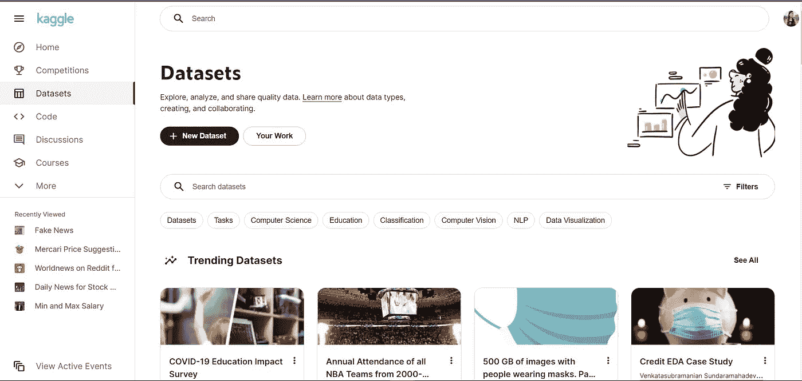

**2。**[**UCI ML repo**](https://archive.ics.uci.edu/ml/index.php)→UCI 机器学习知识库是机器学习社区用于机器学习算法实证分析的数据库、领域理论和数据生成器的集合。他们目前有 588 个数据科学开源数据集，作为对机器学习社区的服务，并有对机器学习项目有帮助的数据集。您可以通过可搜索的界面查看所有 UCI 数据集。
在攻读硕士学位期间，我无法为我的一个项目找到任何免费数据集。然后，我的一个教员建议我使用这个平台，它做得很好。我找到了一个非常好的大型 UCI 数据集来启动我的项目。我把它放在列表的第二位，因为 UCI 的数据集组织得相当好。你甚至可以使用你正在尝试的任务类型进行搜索，比如回归、分类或 NLP。

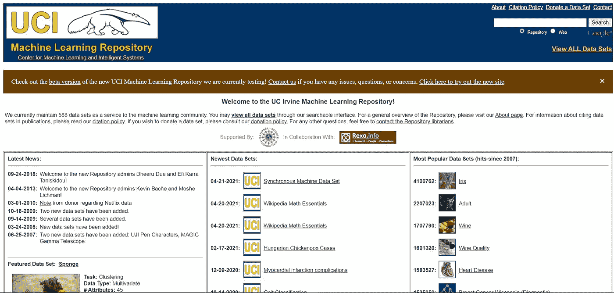

**3。**[**Quandl**](https://www.quandl.com/)**→一个资源为数据科学社区提供免费数据集，该社区专为专业人士设计，向世界各地的人们提供金融、经济和替代数据。它们涵盖了几乎两种类型的数据，时间序列和表格。你可以在这里找到有趣的金融、经济数据集。在这些领域，你可以找到非常好的机器学习项目数据集。你所需要做的就是在搜索栏中插入你感兴趣的关键词，然后从列出的数据集的结果中进行选择。**

**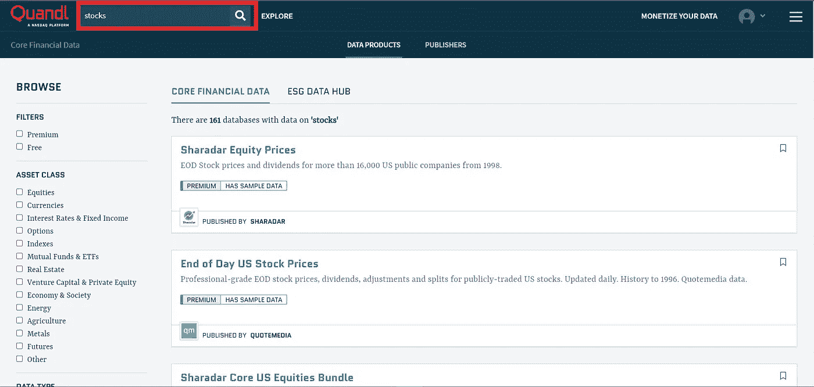**

**要使用特定的数据集，您必须访问其使用选项卡。由于我无法在这里涵盖所有内容，请访问此[文档](https://help.quandl.com/article/352-how-do-i-download-data-using-the-api)以充分理解如何使用这个平台来完成使用 API 的数据需求。除了 API，你还可以使用 python 库直接调用你需要的任何财务数据到你的 python IDE 中，要了解如何做，请参考这个[文档](https://help.quandl.com/article/205-how-do-i-download-data-using-python)。**

**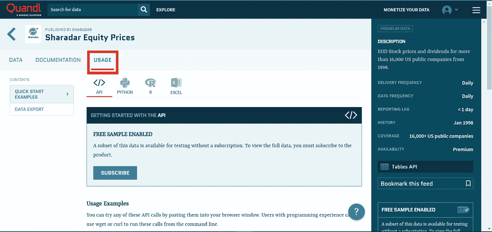**

****4。**[**Data.gov**](https://www.data.gov/)→这个特殊的网站是由美国政府维护的，只有他们才能决定在那里发布什么样的公共免费数据集，供像你我这样的研究人员和数据科学人士使用。在这里，你可以找到按不同类别排列的免费数据集，如农业、气候、能源、海洋、地方政府、海事、老年人健康。
因此，如果你对列出的任何类别感兴趣，你可以访问这个平台，获得机器学习项目的免费数据集。只需访问网站的网址，并转到顶部的数据选项卡。这将列出所有数据集。你也可以搜索感兴趣的关键词。在浏览这个网站时，我也发现了非常好的资源。所以别忘了浏览一遍。**

**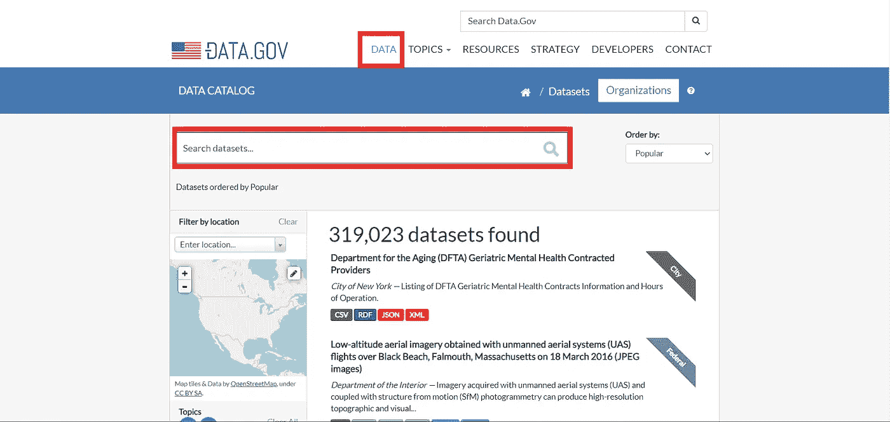**

****5。**[**Data.gov.in**](https://data.gov.in/)→这个特殊的遗址由印度政府维护。他们发布几乎每个领域的各种数据，如教育、金融、医疗保健等，以便像我们这样的研究人员可以使用这些数据并开发一些有用的项目。当然，您可以将这些免费数据集用于数据科学项目。你也可以在这里找到机器学习/深度学习项目的图像数据集。该网站上共享的有趣数据集包含为 ISRO DRDO 等组织构建的项目。因此，就正确使用而言，这种免费数据集的敏感度很高。**

****访问这个细节非常简单:****

*   **只需输入关键字并搜索，例如教育**

**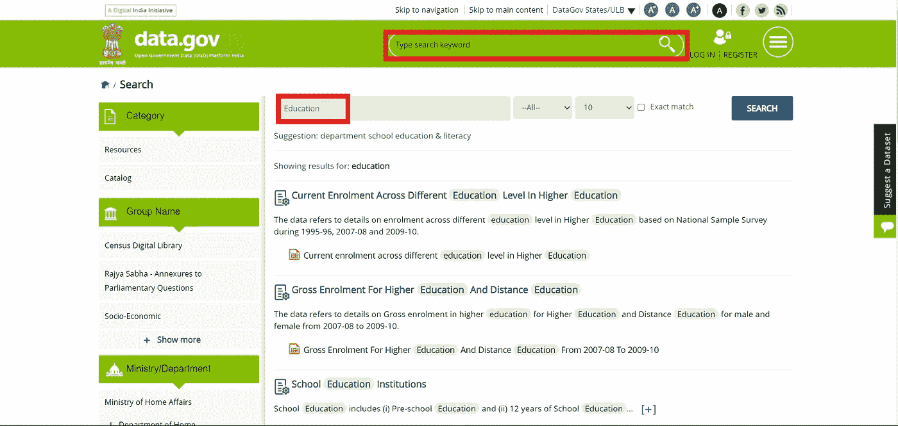**

*   **点击相关的搜索结果。**
*   **上述步骤将带您进入包含该数据集的目录。**

**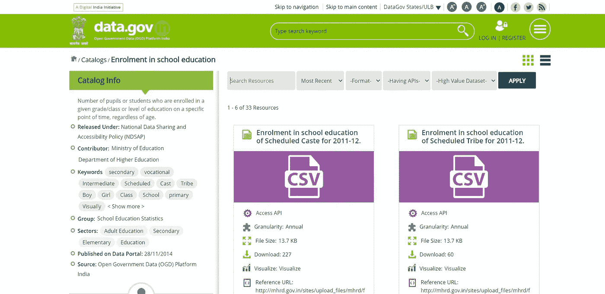**

*   **浏览目录中的页面，以找到正确的数据集。**
*   **以所需的格式提取数据集。**
*   **该网站将问一些基本的问题为使用目的，回答他们，并保存数据。**

****6。** [**世界银行数据**](https://data.worldbank.org/) →唯一一个与银行地区和全球业务密切合作以获得高水平良好统计数据的网站，他们维护着多个宏观、金融和行业数据库。他们在任何方面都不会在数据的质量和数量上妥协，因为一个没有贫困的世界的目标对他们来说是至关重要的。
因此，如果这个选项也让你兴奋，请参考这个足够的[文档](https://data.worldbank.org/about/get-started)，了解如何从这个特定的网站下载数据集。该文档将帮助您更好地理解该网站，因为数据集分布在不同的部分，如数据库、微数据、数据目录。**

**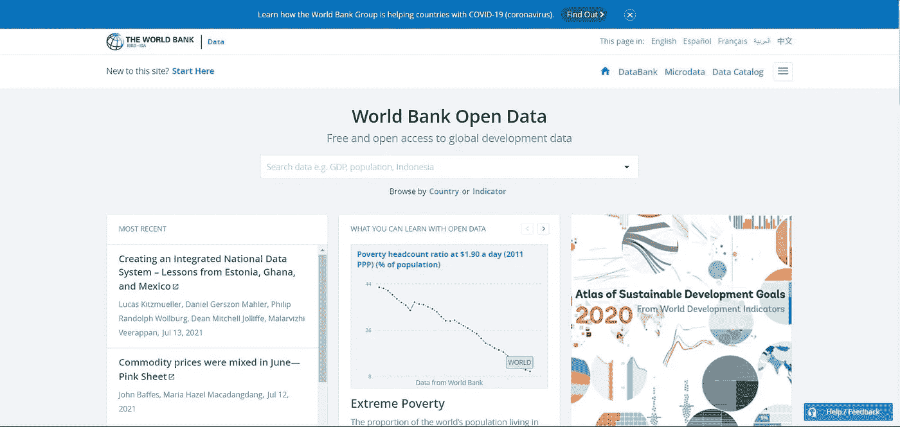**

****7。grouplens 是明尼苏达大学计算机科学系的一个研究实验室。他们开发了一些端到端的数据科学项目，如 movielens、本地地理信息系统、数字图书馆、cyclopath、booklens。他们还提供一些从研究和调查中获得的免费数据集。如果您对列出的任何项目感兴趣，请访问网站顶部的数据集选项卡，查看哪些项目可用，哪些项目不可用。****

**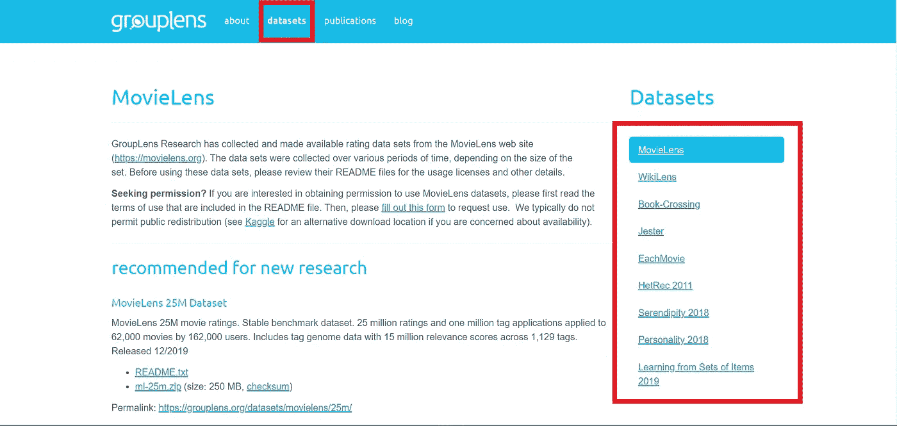**

****8。印度储备银行发布了一些免费数据。如果你还想分析货币市场运作、支付流程、银行业务的使用，那么这个网站是为你的下一个数据科学项目寻找正确数据集的必去之地。数据集按收集方式组织，无论是每天、每周、每月等。这个网站对执行一些时间序列项目非常有帮助。****

**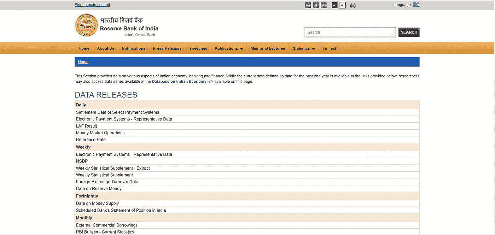**

**9。 [**公开数据集的 Github repo**](https://github.com/awesomedata/awesome-public-datasets)**→安**牛逼的公开数据集 repo** 是我在 Github 上发现有用的库。这个知识库非常棒，包含了一些高质量的免费数据集，更不用说针对不同领域的良好组织了。一定要访问这个回购，不要忘记与我分享，无论你觉得有用与否？****

****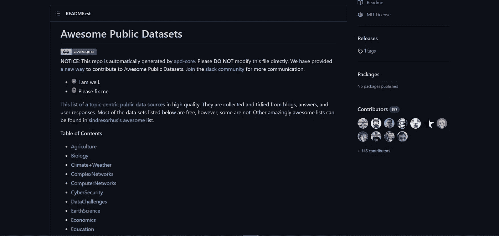****

****10。[**Fivethirtyeight**](https://data.fivethirtyeight.com/)→是一个写互动文章和制作图形的网站，主题从政治到体育、经济、文化和科学&健康。它们提供了一些从各种开源数据集中检索到的分析故事。你可以从这个 [**链接**](https://data.fivethirtyeight.com/) 获得免费数据集，你所要做的就是下载你感兴趣的数据。****

****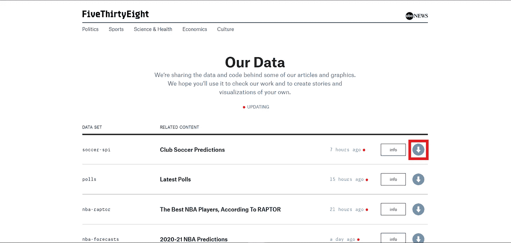****

****另一个可用的选项是他们的 [**GitHub repo**](https://github.com/fivethirtyeight/data) ，用于访问他们感兴趣的数据集以及创建可视化和交互式故事背后的代码。****

****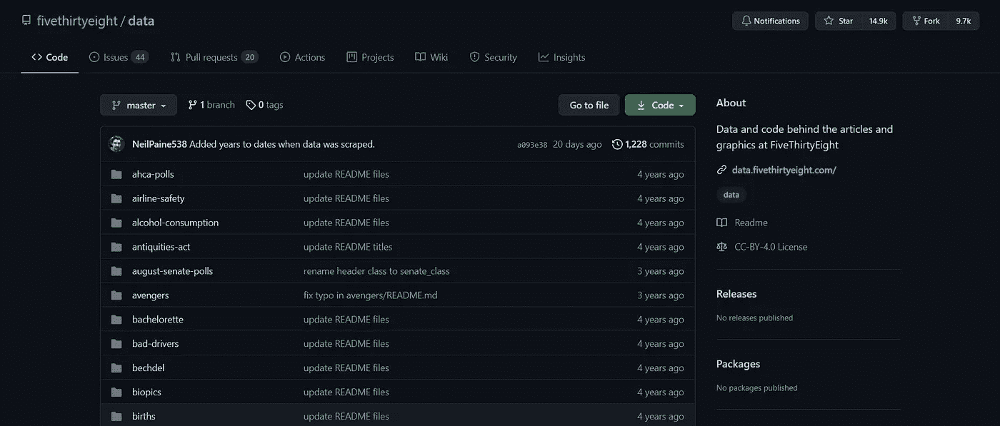****

****11. [**Data.world**](https://data.world/) →这个网站不仅对数据科学人员非常方便，对只想获得见解的非技术人员也非常方便。人们喜欢记者、商务人士获得清晰、准确、快速的商业问题答案。他们对数据目录中的免费数据集进行了很好的组织，以便于发现、管理和访问。这是 [**链接**](https://data.world/datasets/finance) 到 data.world 上的开放数据集的财务目录。您可以选择其他类别。****

****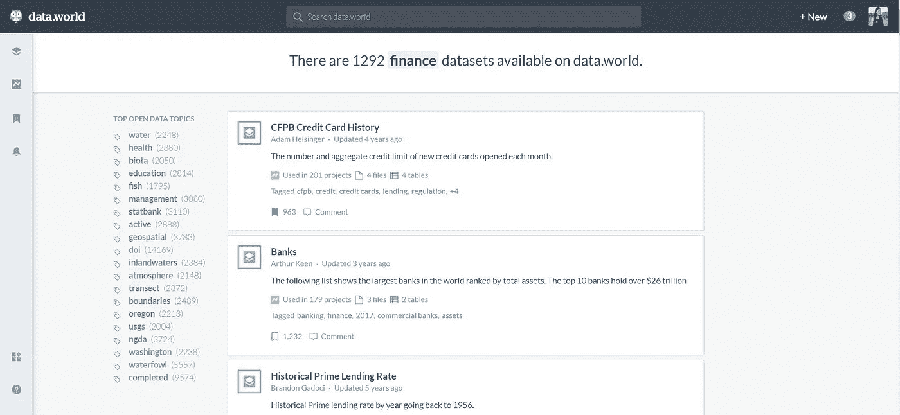****

****12. [**谷歌数据集搜索**](https://datasetsearch.research.google.com/) →与其他网站不同，它是一个为寻找免费数据集而发明的搜索引擎。谷歌数据集搜索就像常规的谷歌搜索一样，基于提供的关键词。它将关键字与数据集的描述而不是内容进行匹配。在输入特定的关键字时，如果数据集是公开可用的，那么找到它的机会很大。在推出的时候，谷歌数据集搜索拥有来自全球近 2500 万个不同的免费数据集。****

****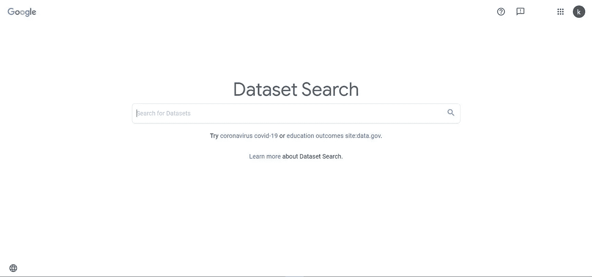****

****13.[**Open ML**](https://www.openml.org/search?type=data)**→**OpenML 是一个开放的数据科学平台，实际上是为了机器学习研究。平台非常整洁干净，所有部分都组织有序。你可以找到各种领域的免费数据集，比如医疗保健、教育、气候变化、政治、体育等等。每个感兴趣的数据集都可以以多种格式下载，如 CSV、JSON、XML 等，在这个网站上每个数据集都有一个单独的页面。****

****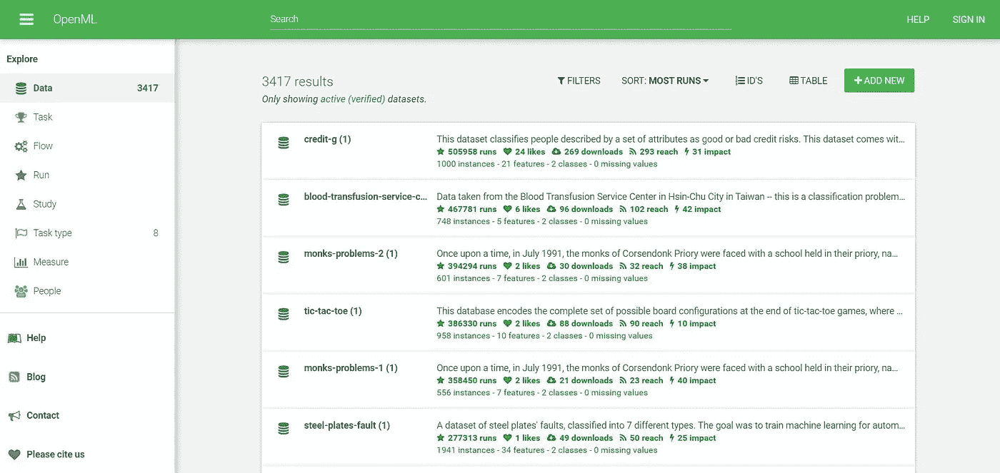****

****只需访问您选择的数据集，并通过选择右上角的来下载所需的格式。****

********

****你可以使用这个平台来执行你的机器学习任务，也可以从网站上其他人的任务中获得帮助，你建立的那些模型可以与他人共享，以便他们也可以使用它。****

****14.[**BuzzFeed News**](https://www.buzzfeednews.com/)**→**是一家以分析性报道为特色的美国新闻网站。它开源了他们使用的数据集、库和工具，数据和分析，以及一些关于 Github repo 的指南。****

****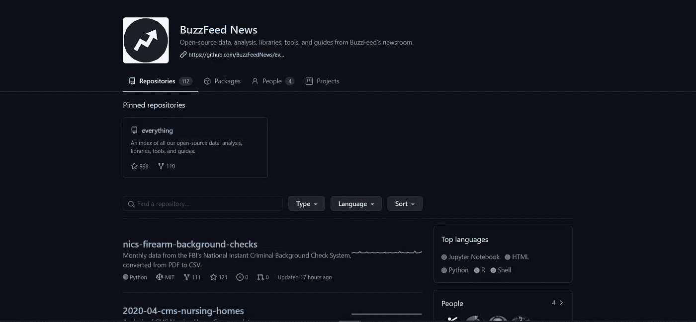****

****15.**国家环境信息中心→** 如果您正在寻找一些与天气和环境条件相关的数据，这是最佳选择。NCEI 是世界上最大的环境数据库。它拥有与美国各地的气候相关的数据集、海洋数据、气象数据、气候条件、地球物理数据、大气信息等。****

****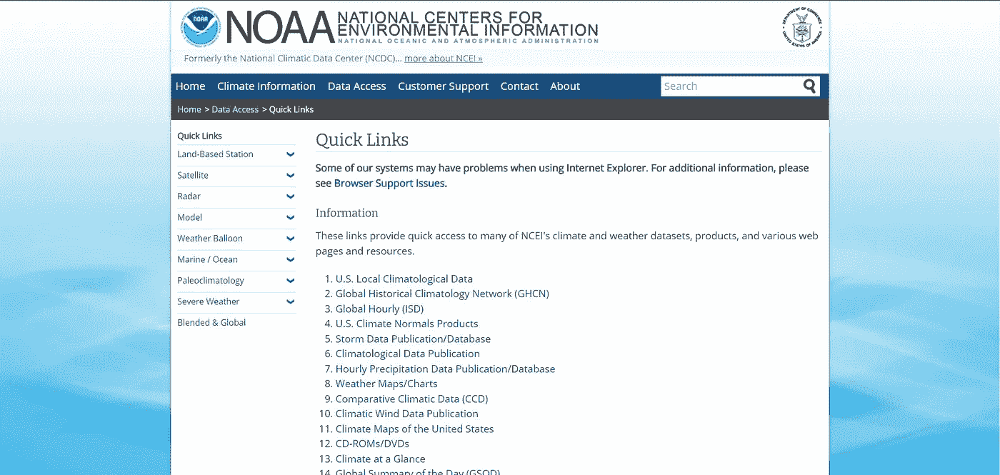****

## ******结论******

****上面合并的免费数据集资源列表是从非常著名的资源到一些被低估的资源开始的，这些资源在数据科学社区中不是非常受欢迎。****

****我尽我最大的努力尽可能包括最好的，因为我知道得不到正确数据的痛苦。而且，如果每次都去刮的话，也是很费时间和繁琐的工作。几乎所有列出的数据聚合站点都托管开放数据集。****

****如果你打算从事任何数据科学项目，我希望这个列表能帮助你迈出获得正确数据的第一步。如果它在任何方面对你有帮助，别忘了评论并让我和其他人知道。如果你喜欢这个列表，并且认为它也能帮助其他人，请为这篇文章鼓掌，这样它就能帮助到那些需要帮助的人。****

****为你们所有人干杯并致以最美好的祝愿！！！****

****您可以通过以下方式联系我:****

1.  ****订阅我的 [**YouTube 频道**](https://www.youtube.com/channel/UCdwAaZMWiRmvIBIT96ApVjw) 视频内容即将上线 [**这里**](https://www.youtube.com/channel/UCdwAaZMWiRmvIBIT96ApVjw)****
2.  ****跟我上 [**中**](https://medium.com/@TechyKajal)****
3.  ****通过 [**LinkedIn**](http://www.linkedin.com/in/techykajal) 联系我****
4.  ****成为会员:-[https://techykajal.medium.com/membership](https://techykajal.medium.com/membership)****

****也可以看看我的其他博客:****

**** [## 8 ML/AI 项目，让您的投资组合脱颖而出

### 有趣的项目想法与源代码和参考文章，也附上一些研究论文。

towardsdatascience.com](/8-ml-ai-projects-to-make-your-portfolio-stand-out-bfc5be94e063)  [## 用 10 个简单的步骤搜集 1000 篇新闻文章

### 如果你遵循这 10 个简单的步骤，使用 python 进行网络抓取是非常简单的。

towardsdatascience.com](/scraping-1000s-of-news-articles-using-10-simple-steps-d57636a49755)****