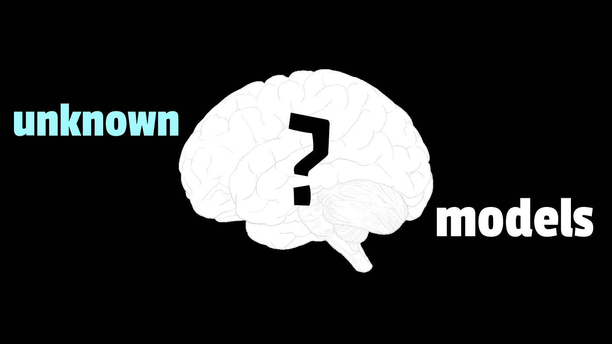
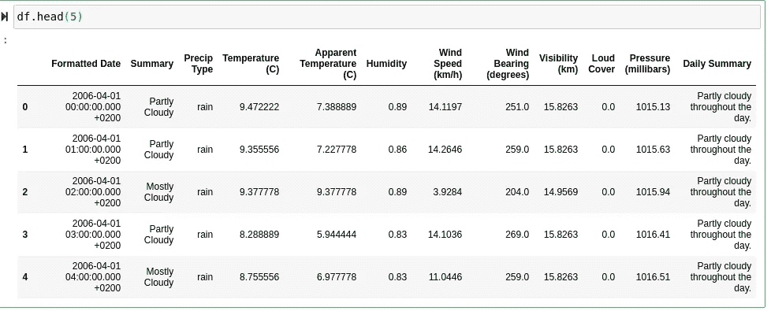
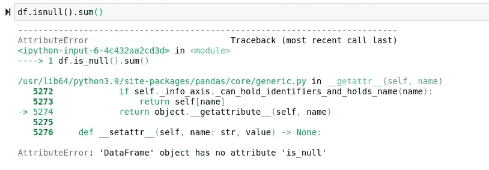

# 你现在应该使用的 15 个鲜为人知的有用 SkLearn 模型

> 原文：<https://towardsdatascience.com/15-lesser-known-useful-sklearn-models-you-should-use-now-a1a566e680a6?source=collection_archive---------20----------------------->

## 可以从 SkLearn 库中使用的一些更有趣的模型。



(图片由作者提供)

Sk Learn 可能是 Python 最流行的机器学习模块之一。这是有充分理由的，因为 SkLearn 有一个非常棒的可用模型、缩放器、工具甚至编码器的目录！虽然有一些非常流行的模型非常有名，但是 SkLearn 是一个非常大的库，很容易忘记它附带的所有函数和类。虽然文档是一个很好的起点，但是扩展您的建模能力的另一个很好的方法是更熟悉使用不同的模型。

考虑到这一点，我开始喜欢 SkLearn 的许多不同型号。有很多很好的模型被严重的利用不足。今天，我想把我最喜欢的 SkLearn 中的一些模型带给你，也许下次你面临一个独特的问题时，你会知道这个模型及其相应的应用！

# 数据

今天，我们将安装模型，以展示上述模型的用法。当然，要做到这一点，我们需要传递一些一维数组来预测特征。简单来说，

> 我们需要数据来训练。

鉴于我们在笔记本上工作，我认为它应该是开源的，所以如果你想看到这些模型适合笔记本，你可以在这里看到源代码:

> [笔记本](https://github.com/emmettgb/Emmetts-DS-NoteBooks/blob/master/Python3/15%20sklearn%20models.ipynb)

由于我们将审查分类模型以及连续模型，我们将需要分别促进这些特征类型的目标。我要用一个旧的。我手边的 CSV 文件叫做 weatherHistory.csv:

```
import pandas as pd
import numpy as np
df = pd.read_csv("weatherHistory.csv")
```

现在让我们来看看！：

```
df.head(5)
```



(图片由作者提供)

由于我们将同时使用分类和连续模型，我需要分类和连续 y。对于连续目标，我决定使用温度。为了分类，我使用了降水类型特征。对于我的预测功能，我将使用湿度功能:

```
caty = "Precip Type"
cony = "Temperature (C)"
x = "Humidity"
```

现在，我们将训练测试相应地将数据分成两个数据帧:

```
from sklearn.model_selection import train_test_split
train, test = train_test_split(df)
```

当然，我不会对这些数据做太多的处理，只是为了举例说明一些模型。考虑到这一点，这些模型不能适用于带有缺失值的数据，所以让我们得到数据框架中缺失值计数的总和。

```
df.isnull().sum()
```



> 想听些有趣的事吗？我可以发誓是 is_null()而不是 isnull()。

查看摘要，

```
Formatted Date                0
Summary                       0
Precip Type                 517
Temperature (C)               0
Apparent Temperature (C)      0
Humidity                      0
Wind Speed (km/h)             0
Wind Bearing (degrees)        0
Visibility (km)               0
Loud Cover                    0
Pressure (millibars)          0
Daily Summary                 0
dtype: int64
```

很明显，我可能有点超前了，让我们放弃一些不好的观察:

```
df = df.dropna()from sklearn.model_selection import train_test_split
train, test = train_test_split(df)
```

现在让我们把它放入一维数组:

```
trainX = train[x]
cattrainy = train[caty]
contrainy = train[cony]
testX = test[x]
cattesty = test[caty]
contesty = test[cony]
```

SkLearn 经常要求将这些阵列重新调整为垂直的，因为它更喜欢矩阵列中的特征，而不是矩阵行。让我们重塑这些小狗，然后我们将准备适合一些模型。为了做到这一点，我们将需要把这些一维数组变成 NumPy 数组。这是因为 SkLearn 与 NumPy 的集成程度更高，尽管它确实喜欢 Pandas 系列，但在许多情况下，NumPy 数组更加动态，也更常用:

```
trainX = np.array(trainX)
cattrainy = np.array(cattrainy)
contrainy = np.array(contrainy)
testX = np.array(testX)
cattesty = np.array(cattesty)
contesty = np.array(contesty)trainX = trainX.reshape(-1, 1)
cattrainy = cattrainy.reshape(-1, 1)
contrainy = contrainy.reshape(-1, 1)
testX = testX.reshape(-1, 1)
cattesty = cattesty.reshape(-1, 1)
contesty = contesty.reshape(-1, 1)
```

# 对于连续的问题

典型地用于监督模型的两种不同类型的模型是连续模型。这些模型预测的是定量值，而不是定性值。也就是说，这些模型中的许多将利用回归来估计连续值。

## №1:保序/单调回归

保序或单调回归是一种令人敬畏的回归形式，许多机器学习工程师甚至从未听说过。保序回归可以是预测连续目标的非常准确的模型，但在这方面也有其自身的局限性。这方面的一个很好的例子是，这种模型往往容易过度拟合，通常要让模型工作良好，就要平衡偏差，并试图提高准确性。

这个模型的另一个重要问题是数据必须是非递减的。这意味着该模型的典型应用通常会涉及经济和商业场景。因此，考虑到这一点，虽然这个模型对于处理经济数据的人来说可能非常有用，但对于许多科学工作来说，它不一定是最好的模型。

然而，在适当的应用和平衡偏差中，保序回归可以是一个非常强大的预测模型！如果你想了解更多关于保序回归的知识，你可以看看我写的这两篇文章，一篇是我用 C++从头开始编写保序回归器，另一篇是我详细阐述模型的工作原理:

</building-and-using-an-isotonic-regression-model-in-c-f6789d46ab07>  </isotonic-regression-is-the-coolest-machine-learning-model-you-might-not-have-heard-of-3ce14afc6d1e>  

为了适应这个模型，我们首先需要使用 make_regressor 函数，它将为我们提供一个基本的回归模型，我们可以在这个模型上构建保序回归。让我们这样做:

```
from sklearn.isotonic import IsotonicRegression
from sklearn.datasets import make_regression
isox, isoy = make_regression(n_samples=10, n_features=1, random_state=41)m.fit(isox, isoy)
m = IsotonicRegression(trainX, contrainy)
m = IsotonicRegression()
m.fit(isox, isoy)
m.predict(testX)
```

## №2:正交匹配追踪

另一个只适用于某些数据特征的非常有用的工具是正交匹配追踪。该模型用于获取稀疏编码信号，并去除所述数据中的噪声和异常。这意味着这些机器学习算法被用来根据数据修复某些输入信号，我认为这是机器学习的一个非常好的应用。

虽然正交匹配追踪的主要用途可能相对简单，但该模型的用途可能会更广泛。鉴于这是一个非常独特的模型，它是如何工作的呢？

正交匹配追踪形成了其名称所描述的精确运算。为了剖析这个定义，让我们来单独看一下这些词:

*   直角的——在直角内或者包含直角。
*   匹配—将观察值与值联系起来。
*   追求——寻找。

因此，基本上，我们正在寻找与我们的数据完美匹配的地方，它依赖于多维跨度的数据 D，这可能是编程世界中的一种字典类型。用维基百科的话说，

。想法是从希尔伯特空间(H)创建一个近似信号(f ),作为统计函数的加权和，即 pdf/CDFs/Gamma。

虽然我们现有的数据肯定不适用于这种特定模型，但在本例中，我将创建一些稀疏信号作为数据传递:

```
**from** **sklearn.linear_model** **import** [OrthogonalMatchingPursuit](https://scikit-learn.org/stable/modules/generated/sklearn.linear_model.OrthogonalMatchingPursuit.html#sklearn.linear_model.OrthogonalMatchingPursuit)from sklearn.datasets import make_sparse_coded_signal
n_components, n_features = 550, 100
n_nonzero_coefs = 10

*# y = Xw*
*# |x|_0 = n_nonzero_coefs*

y, X, w = [make_sparse_coded_signal](https://scikit-learn.org/stable/modules/generated/sklearn.datasets.make_sparse_coded_signal.html#sklearn.datasets.make_sparse_coded_signal)(n_samples=1,
                                   n_components=n_components,
                                   n_features=n_features,
                                   n_nonzero_coefs=n_nonzero_coefs,
                                   random_state=0)

idx, = w.nonzero()
```

现在我们将扭曲我们的目标数据:

```
y_noisy = y + 0.05 * [np.random.randn](https://numpy.org/doc/stable/reference/random/generated/numpy.random.randn.html#numpy.random.randn)(len(y))
```

符合我们的模型:

```
omp = [OrthogonalMatchingPursuit](https://scikit-learn.org/stable/modules/generated/sklearn.linear_model.OrthogonalMatchingPursuit.html#sklearn.linear_model.OrthogonalMatchingPursuit)(n_nonzero_coefs=n_nonzero_coefs)
omp.fit(X, y)
coef = omp.coef_
idx_r, = coef.nonzero()
```

## 第三名:拉斯·拉索

如果你已经使用机器学习很长时间了，你可能听说过套索回归。套索回归是一个奇妙且相当标准化的工具，已经在机器学习中被频繁使用了很长一段时间。在预测连续目标的大多数时候，这肯定是我的首选模型。

然而，拉斯拉索模型不是你正常的拉索回归。“LARS lasso 模型”中的 LARS 是最小角度回归的简称。最小角度回归是一种预测连续特征的机器学习算法。它对于处理维数非常高的数据非常有用。该模型通过协变量的线性子集来工作。

这种模型的一个伟大之处在于，虽然在尺寸方面的天花板比传统模型显著提高，但与通常以这种方式使用的模型相比，它真的没有那么慢。话虽如此，但重要的是要记住，虽然该模型是从最小角度回归得到的，但这并不使其成为线性的-这就是模型的套索部分的由来。当然，如果线性模型是您正在寻找的，您可以在使用最小角度回归的传统线性回归模型上利用相同的概念，这也在 SkLearn 中。

```
from sklearn import linear_model
reg = linear_model.LassoLars(alpha=0.01)
reg.fit(trainX, contrainy)
reg.predict(testX)
```

## №4:最小角度回归

正如最小角度回归在套索模型中的类似应用中所述，最小角度回归是一种用于预测连续要素的模型，通常使用协变量的线性子集。这是最小角度回归和 LARS Lasso 回归最显著的区别。最小角度回归是指该模型的线性版本。

在计算上，最小角度回归的优点是与正向选择一样快。虽然这是一个巨大的好处，但它最大的优势是在 p >> n 的情况下。如果两个变量同等相关，那么它们的系数应该以相同的速度增加。

```
from sklearn import linear_model
reg = linear_model.Lars()
reg.fit(trainX, contrainy)
reg.predict(testX)
```

## №6: SGDRegressor

SkLearn 中一个概念的另一个伟大实现是随机梯度下降。随机梯度下降是一种迭代使用的方法，用于优化数学函数和构建成本。很可能你听说过梯度下降，这是类似的-但是，这个模型名称中的随机意味着我们只对 epoch 使用单个训练示例。这是两个极端中的高端，从批次梯度下降开始，每个时期使用整个批次，中间是两者的组合。

随机梯度下降中的损失梯度是每次对每个样本进行估计的，并且模型沿着强度递减的时间表进行更新，在典型的机器学习术语中也称为学习速率。

```
from sklearn.linear_model import SGDRegressor
m = SGDRegressor()
m.fit(trainX, contrainy)
m.predict(testX)
```

## №7:胡伯回归

使用回归学习方法，通常会有难以克服的模型缺点。对于线性模型来说肯定是这样的，线性模型可能很难完全适合稀疏数据或多维数据。幸运的是，SkLearn 有一个很好的 Huber 回归实现。

这种形式的回归可用于处理异常值并避免建模错误，使用 SkLearn 包中可用的典型模型可能很容易犯这种错误。这可能很有用，因为尽管该模型很有用且拟合良好，但它也相对简单，这意味着过拟合和过采样不是使用该模型时通常会遇到的问题。

Huber 回归优化了平方损失(均方误差),与简单线性回归等模型相比，它对异常值相当稳健。实际上，斯坦福大学的 Art B. Owen 发表了一篇非常有趣的论文，对于那些不熟悉这种建模方法的人来说，这篇论文可能值得一读。有兴趣可以去看看:

下面是我发现的最有效的一句话，用来从数学上分析这个模型将如何处理这些数据:

> “最小二乘准则非常适合于具有高斯分布的 yi，但是当 yi 具有较重的尾部分布或几乎相同的尾部分布时，当存在异常值时，会给出较差的性能。Huber (1981)描述了一个稳健的估计量，它采用了一个受非常大的残值影响较小的损失函数

不用说，这个模型是难以置信的酷！我认为它在剔除异常值方面肯定有它的用处，异常值是造成预测连续问题的困难的一个因素——这经常被低估，但在初级统计领域似乎很明显。

既然我们在数学上对这个模型有些熟悉，我们实际上可以考虑在 Sklearn 中拟合它(那是一个笑话。)

```
from sklearn.linear_model import HuberRegressor
m = HuberRegressor()
m.fit(trainX, contrainy)
m.predict(testX)
```

## №8:多项式回归

虽然这个“模型”可能更多的是与其他模型一起使用的概念，但它肯定会非常有用！机器学习的一个非常常见的模式是使用非线性函数来创建线性预测。这将保持模型的速度，同时不会浪费任何预测能力。一个很好的例子是简单线性回归上的多项式回归。

在使用多项式回归的示例中，它适合用函数构建的更高维度的数据。由于使用了多项式特征，该模型可以很容易地拟合和用于解决广泛的连续问题。

为了在 sklearn 中实际使用多项式回归，我们实际上要使用多项式特性:

```
**from** **sklearn.preprocessing** **import** PolynomialFeatures
poly = PolynomialFeatures(2)
poly.fit_transform(trainX)from sklearn.linear_model import LinearRegression
reg = LinearRegression()
reg.fit(trainX, contrainy)
reg.predict(testX)
```

## №9:普通最小二乘法

普通最小二乘法是另一种预测连续特征的非常酷的数学机器学习模型。普通最小二乘法也是一种线性模型，适合用来最小化数据中点之间平方和的系数。

普通最小二乘法的权重严重依赖于用于预测目标的特征的独立性。也就是说，这个模型对于具有单一特性的实现非常有用。此外，它可以与多个特征一起使用，但肯定需要将特征向目标加权。查看这个描述，很容易看到像普通最小二乘法这样的模型在我们的机器学习武器库中的确切位置。

不幸的是，OLS 的 SkLearn 实现并不像大多数实现那样简单。OLS 系数实际上包含在线性回归类下面。系数 _:

```
linear_model.LinearRegression().fit(trainX, contrainy).coef_
```

## **№10:**[**NuSVR**](https://scikit-learn.org/stable/modules/generated/sklearn.svm.NuSVR.html#sklearn.svm.NuSVR)

回到支持向量机的魔力，请允许我向您介绍 NuSVR。NuSVR 当然是和 NuSVC 一样的模型和机器实现。这两个模型都利用 libsvm，并使用参数 nu 来控制机器中支持向量的数量。但是，与 nu 代替 C 的 NuSVC 不同，这里 nu 代替了 epsilon-SVR 的参数 epsilon。

使用该模型的优点是提供了用于调整向量机的参数，该向量机用于帮助估计该回归问题。也就是说，该模型非常适合预测连续特征，这些特征对于我们的目标可能非常重要，也可能不太重要。

```
**from** **sklearn.svm** **import** NuSVR
from sklearn.svm import NuSVR
m = NuSVR()
m.fit(trainX, contrainy)
m.predict(testX)
```

## №11:多任务套索

就像拉斯·拉索一样，你可能听说过拉索回归。作为复习，这是一个非常常用的预测连续特征的非线性模型。多任务套索的不同之处在于，多任务套索将使用 L1/L2 规范作为正则化。

为了证明这一点，让我们看看套索回归的优化目标:

```
(1 / (2 * n_samples)) * ||Y - XW||^2_Fro + alpha * ||W||_21
```

在本例中，`||W||_21`将被修改以适应多任务套索的公式:

```
||W||_21 = \sum_i \sqrt{\sum_j w_{ij}^2}
```

本质上这意味着我们得到了每一行的总和。

```
from sklearn.linear_model import MultiTaskLasso
m = MultiTaskLasso()
m.fit(trainX, contrainy)
m.predict(testX)
```

# 对于分类问题

在机器学习中，可能会有很多连续的问题，但是

## №12:线性 SVC

LinearSVC 是一种支持向量机类型的模型。该模型的 SkLearn 实现是使用 libsvm 创建的。虽然核可以是非线性的，但是它的 SMO 通常不能很好地适用于大量样本。这就是线性支持向量分类器派上用场的地方。

也就是说，虽然 Sklearn 中还有其他一些很棒的 SVC 实现可能更有名，但是 LinearSVC 无疑是一个非常值得注意的模型！SVC 通常以多类模式工作，用一个类来衡量另一个类。在 LinearSVC 的情况下，所有这些类都是相互权衡的——这使得该模型比许多 SVC 竞争对手更全面。

至于 SkLearn 类，它是一个令人敬畏的、近乎完美的实现。它非常好地支持密集和稀疏数据，并且可能是一个令人难以置信的模型——在我看来，很容易成为 Python 中最好的线性分类模型之一！

```
from sklearn.svm import LinearSVC
m = LinearSVC()
m.fit(trainX, cattrainy)
m.predict(testX)
```

## №12:SGD 分类器

正如我们在简要讨论 SGDRegressor 时所讨论的，随机梯度下降是指在每次迭代中使用每一批来加权特性的成本。当然，SGDClassifier 与现在应用于分类问题的概念完全相同。

像 SGDRegressor 一样，这个模型是一个很好的实现，尤其是在处理大量特性时，它非常有价值。虽然这可能会导致性能大幅下降，但可能需要权衡由此产生的预测是否值得这些特别的努力。

安装 SGDRegressor 非常简单，并且和这个列表中的许多人一样，将遵循

*   进口
*   合适的
*   预测

```
from sklearn.linear_model import SGDClassifier
m = SGDClassifier()
m.fit(trainX, cattrainy)
m.predict(testX)
```

## 13 号:伯努利朴素贝叶斯

伯努利朴素贝叶斯分类模型可以像任何贝叶斯分类模型一样使用，但是它有一个锦囊妙计:

> 伯努利分布。

您可能熟悉这个分布，因为它的 CDF 经常出现在逻辑分类模型附近。我想说这个模型的用法和多项式非常相似。然而，尽管 MultinomialNB 在计数和发生方面表现得更好，BernoulliNB 却使用伯努利分布，并且是为布尔型特征而设计的。这当然让我回想起我最初的陈述，伯努利用于逻辑回归，也就是说，这个模型本质上有相同的用途，所以它使用相同的分布是有意义的。

尽管该模型通常用于预测二元特征，但今天我们只传递一些可能更适用于多项式的典型分类数据。也就是说，记住这两个模型的用例是很重要的，因为它们非常强大，但是应该用于它们适当的特性类型。如果您不了解您试图预测的目标，那么使用模型是没有意义的，我认为这些模型之间的差异突出了数据科学家需要了解不同的模型需要不同类型的功能才能很好地工作。这是一个很好的经验，但不管怎样，它遵循了我们对 SkLearn 的典型期望:

```
from sklearn.naive_bayes import BernoulliNB
m = BernoulliNB()
m.fit(trainX, cattrainy)
m.predict(testX)
```

## №14:山脊分类

如果你一直在研究机器学习模型，尤其是连续模型，你可能听说过岭回归。岭回归是一种用于预测连续特征的流行模型。当然，RidgeClassification 是这种分类问题的精确模型的分类等价物。

模型的分类版本将目标转换为`{-1, 1}` ，然后用典型的岭回归将其建模为回归问题。我认为这是一个非常酷的概念，因为在我看来，将回归和其他解决问题的连续方法应用于一个完全不同的问题，如分类，是非常酷的。

幸运的是，尽管这个模型真的很棒，看起来像一个先进的概念，但奇妙的 SkLearn 使它非常容易使用，符合图书馆的典型惯例:

```
from sklearn.linear_model import RidgeClassifier
m = RidgeClassifier()
m.fit(trainX, cattrainy)
m.predict(testX)
```

## **№15:校准分类器**

这份名单上最酷的车型之一可能是 CalibratedClassifierCV。该模型使用交叉验证来估计分类器的参数。该模型可以与作为基础的逻辑回归器一起使用，这将使它成为用于对布尔类型进行分类的伟大模型。

然而，由于这个模型实际上可以采用不同的基本估计量，所以一个常用的模型实际上是保序回归。保序回归是一个非常酷的模型，但在我看来，当与分类问题结合起来时，它会变得更酷。这意味着阈值现在被附加到类，而不是连续数据中的任意分位数。

不同于这个列表中预测目标的许多其他解决方案，这是另一个将成为其他模型的补充的解决方案。换句话说，我们可以通过简单地构建一个分类器来校准任何分类器。在这个例子中，我将使用高斯朴素贝叶斯建立一个模型，这是 SkLearn 中的另一个分类模型，类似于多项式朴素贝叶斯。

```
from sklearn.naive_bayes import GaussianNB
from sklearn.calibration import CalibratedClassifierCV
base_clf = GaussianNB()
calibrated_clf = CalibratedClassifierCV(base_estimator=base_clf, cv=3)
calibrated_clf.fit(trainX, cattrainy)
calibrated_clf.predict(testX)
```

> “顺便说一下，在我看来这是一个非常酷的方法，我真的认为 SkLearn 在对象的使用方式和它们作为类使用的约定上击中了要害。”

# 结论

SkLearn 是一个如此令人敬畏的库，以至于现在的机器学习工程师可能会认为这是理所当然的。图书馆里有很多模型是绝对不可思议的，可能会被忽视，因为冠军已经出现了。这些型号你用过几个？我希望这些对这些令人敬畏的模型的描述和介绍是有趣的，甚至对你下一个项目的模型选择有所帮助。

非常感谢你的阅读，新年快乐！我认为这些模型在未来将是非常宝贵的资产。也许如果你遇到一个好的二进制分类问题，或者线性建模问题，你会回想起我第一年写的这篇文章。希望这篇文章能激发更深入的挖掘和研究，以了解更多关于建模的知识，因为学习建模真的很有趣。