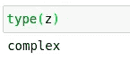
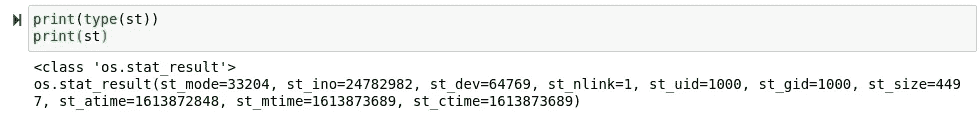
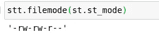
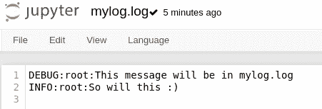
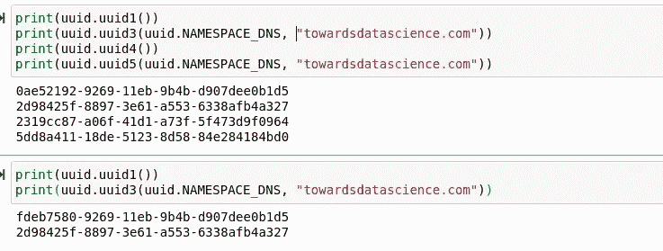
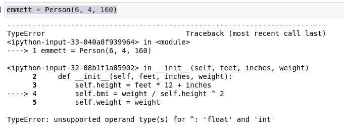

# 15 个非常有用的 Python 基础模块

> 原文：<https://towardsdatascience.com/15-more-surprisingly-useful-python-base-modules-6ff1ee89b018?source=collection_archive---------3----------------------->

## 忘记依赖性，使用标准库！


(图片由作者提供)

# I 简介

本月早些时候，我深入研究了 Python 编程语言基础上的一些非常强大且非常有用的函数。这些标准库模块和 Python 函数非常棒，但幸运的是，当谈到 Python 编程语言所能提供的东西时，它们都只是昙花一现。如果您没有时间阅读我的上一篇文章，在这篇文章中，我概述了一些其他的标准库工具，我认为它们可能比这些工具更有用，您可以在这里查看:

[](/10-surprisingly-useful-base-python-functions-822d86972a23) [## 10 个非常有用的基本 Python 函数

### 用这个令人兴奋的列表来复习你的标准模块库吧！

towardsdatascience.com](/10-surprisingly-useful-base-python-functions-822d86972a23) 

尽管我在上一次迭代中概述了许多精彩的特性，但是 Python 标准库还可以为那些有足够决心成为它的专家的程序员提供更多的特性。Python 的真正优势在于其基础的简单性和开箱即用的能力，特别是操纵数据和使用其他语言和脚本。这当然在它提供的包中有很大反映，这些包通常提供处理外部代码、文本和数据的功能。数据操作只是 Python 编程语言标准库实际能力的一小部分。也就是说，只需要一点点知识，就可以用几个包的例子将标准的 Python 体验提升到一个新的水平。这里有 15 个我最喜欢的，我想大多数 Python 程序员可能想看一看！

> [笔记本](https://github.com/emmettgb/Emmetts-DS-NoteBooks/blob/master/Python3/15%20Useful%20python%20standard%20library%20tools.ipynb)

# №1: cmath

复杂类型无疑证明了 Python 在某种程度上的科学和数字意图。这种类型在 Python 中出现已经有一段时间了，它允许虚数和实数作为一个完整的值存储。这一点最常见的是在浮点数上加上虚数，例如:

> 5.5+8.2 米

> 其中:

*   5.5 是真正的浮动。
*   8.2 是一个假想的浮点数。

然而，除了保存数字之外，如果没有适当的操作来支持，复杂的浮点数本质上是没有用的。这就是 cmath 模块的用武之地。cmath 不仅支持平方根和对数函数等基本运算，还提供了更高级的函数，如相位、极坐标或 x。

对于任何可能与复数进行交互的 Python 用户来说，这个模块几乎肯定是必不可少的。它不仅提供了一个足够的主干，可以处理任何至少部分是虚数的数字，还可以提供更多关于这些数字的极坐标信息。对于我的例子，我选择利用这个模块中的 exp()、log()和 phase()方法。然而，不言而喻的是，这个神奇的工具中有更多的选项值得一试！

为了使用 cmath，我们首先需要导入它。我个人通常会将它别名为 cm，但我必须承认我不确定这是否是一种约定:

```
import cmath as cm
```

接下来，我们将创建一个可以用来计算的复数:

```
z = 5.5 + 8.2j
```



最后，我们将获取新的复数值，并在新变量上使用 cmath 包中的一些精彩方法！

```
cm.phase(z)
cm.log(z)
cm.exp(z)
```

# №2:迭代工具

Python 标准库中下一个非常有价值的工具是一个叫做 itertools 的小模块。我怎么推荐使用这个模块都不为过，因为它似乎真的比我想象的要方便得多。itertools 模块可用于非常有效和容易地创建更好的、有时是独特的迭代，如果不使用该模块，将会花费更多的时间。

这个模块基本上是一些业界领先的迭代工具的组合，包含在一个纯粹的 Pythonic 包中。在很多场景中，通过结合使用 Python 的其他特性，这些工具被简单地包含在 Python 中。文档中也提到了一个很好的例子。SML 编程语言提供了一种制表工具——制表()方法，可以使用标准库中已有的 map 和 count 函数在 Python 编程语言中重新创建该方法。

不用说，这个模块肯定是值得拥有的！当使用迭代时，这个模块的真正价值就体现出来了，因为它可以使许多低效或乏味的迭代任务变得轻而易举，并且在内存和计算方面效率更高。这个模块包含了一些很棒的函数，比如 count()、chain()、accumulate()等等！

在大多数情况下，我看到 itertools 别名为 it 和 its，我个人更喜欢 its。

```
import itertools as its
```

我假设我们都熟悉 Fizz Buzz 编码测试。使用这个简单的编码测试，我们可以看到利用 itertools 中更高性能的迭代解决方案相对于使用原始 Python 来处理我们的问题的价值。大多数程序员可能会采取类似的方法来解决问题:

```
for num in range(1, 21):
    if num % 3 == 0 and num % 5 == 0:
        print('FizzBuzz')
    elif num % 3 == 0:
        print('Fizz')
    elif num % 5 == 0:
        print('Buzz')
    else:
        print(num)
```

哪个当然是正确的！然而，使用 itertools，我们可以大大缩短这个函数的长度，以及计算它所需的时间:

```
def fizz_buzz(n):
    fizzes = its.cycle([""] * 2 + ["Fizz"])
    buzzes = its.cycle([""] * 4 + ["Buzz"])
    fizzes_buzzes = (fizz + buzz for fizz, buzz in zip(fizzes, buzzes))
    result = (word or n for word, n in zip(fizzes_buzzes, its.count(1)))
    for i in its.islice(result, 100):
        print(i)
```

# №3:平分

与列表中的许多工具不同，等分模块有一个直接的目的。这个模块的目的是将 Python 中的数组或列表一分为二。这对于各种不同的操作都很方便，但是这个包经常被同名的 Scipy 实现扔到一边。如果我不得不猜测为什么会这样，我会说也许 Scipy 实现支持 Numpy 矩阵？

不管其文化接受程度如何，那些只使用普通 Pythonic 列表的人肯定会发现这个模块非常有价值。该模块配有工具，可以正常对分，也可以左右对分。此外，该模块还附带了一些更有趣的功能，比如 insort()，它将插入和排序所提供的值。让我们导入这个模块，看看它是如何处理列表的:

```
import bisect as bs
```

现在，我们可以使用此模块制作一个列表并将其一分为二:

```
ls = [5, 10, 15, 20, 25, 30, 35, 40, 45, 50, 55, 60, 65, 70, 75, 80, 85, 90]
bs.bisect(ls, 9)
```

# 第四名:统计

os 模块是一个非常流行的 Python 模块，当然在标准库中。os 模块附带了用于操作文件系统、系统硬件甚至操作系统内核的工具。os 模块也有三个功能:

*   斯达
*   fstat
*   lstat

这些都是用来获取一个文件的状态，或者获取所述文件的描述符。os 模块中的 stat 函数将返回一个 stat_result 类型，这正是我们使用 stat 模块所需要的。因此，使用该模块的第一步是从操作系统模块获得一个 stat。让我们从导入模块开始，并将 stat 类型设置为一个新变量:

```
import os
st = os.stat("logreg.ipynb")
```

现在让我们看看这个新类的类型。如果一切按计划进行，st 的类型应该是 stat_result。



每当我们查看 stat 模块的文档时，我们很快就会了解到，这种类型并不是我们实际要放入新函数中的类型。我们可以观察到这一点，因为函数 stat.filemode()接受一个整数，而不是 os.stat_result。我们真正需要的实际上包含在我们刚刚创建的类中，名为 st_mode。我们可以这样称呼它:

```
st.st_mode
```

现在让我们导入 stat。

```
import stat as stt
```

现在，我们可以将新的 stat 模式从 os.stat_result 类传递到 stat.filemode()函数中:

```
stt.filemode(st.st_mode)
```



(图片由作者提供)

# №5:记录

脚本任务可能非常困难！如果有许多并发服务和子流程可能在 systemctl 或类似的东西下一起在后台运行，这一点尤其正确。可能会有大量的应用程序，不可避免地，一些应用程序几乎肯定会遇到一些问题。缓解此类问题的一个很好的方法是直接从开发-运营手册中获得的，

> 伐木。

日志记录是一种简单的方法，可以同时跟踪几个进程，并在遇到某些问题和异常时，进一步了解幕后发生的事情。日志记录为简单的日志记录提供了一组易于使用的函数。这些是`[debug()](https://docs.python.org/3/library/logging.html#logging.debug)`、`[info()](https://docs.python.org/3/library/logging.html#logging.info)`、`[warning()](https://docs.python.org/3/library/logging.html#logging.warning)`、`[error()](https://docs.python.org/3/library/logging.html#logging.error)`和`[critical()](https://docs.python.org/3/library/logging.html#logging.critical)`。

不用说，日志是一个非常有用的工具，所有 Python 程序员都想熟悉它。对于某些领域，如开发运营或系统管理来说尤其如此，但这也适用于软件工程和数据科学的奇妙世界。在部署和日常计算机操作的许多情况下，日志记录都会派上用场，尤其是当您想要开发和调试自己的应用程序时。现在让我们用一些 Python 来弄脏我们的手，并开始创建我们自己的日志！我们要做的第一件事当然是导入日志模块:

```
import logging as lgg
```

现在，我将使用 basicConfig 函数来创建一个新文件，我们的日志可以放入其中:

```
lgg.basicConfig(filename='mylog.log', level=lgg.DEBUG)
```

现在我将在其中记录一些消息！

```
lgg.debug('This message will be in mylog.log')
lgg.info('So will this :)')
```

看看我们的文件系统，我们可以打开一个新的日志文件，其中包含我们的文本:



(图片由作者提供)

这个日志实现的一个很酷的特性是，我们可以忽略不想在日志中看到的信息。例如，如果我们不希望看到任何调试消息，可以将级别设置为 20。

# №6: html

html 模块主要以包含在其中的名为“解析器”的子模块而闻名给定名称，实际上很容易想象这个模块的确切用途。该模块可用于轻松地逐个标签地解析 HTML。这使得处理你正在阅读的文本中的 HTML 更加容易，甚至可以用 Python API 将 HTML 翻译成基于 C 的框架。

很多时候，程序员可能会遇到他们不想浏览的大型 HTML 页面，或者从请求中接收到的字符串很难用字符串片段来解析。如果需要，您甚至可以使用解析器和一些代码来实际编写 HTML！这个工具有很多用途，但是我决定不把所有的胡萝卜放在一个篮子里，而是演示可以从 html.parser 导入的解析器。

```
from html.parser import HTMLParser
```

既然我们的解析器已经导入，我们将创建一个新变量并初始化一个 HTMLParser 类:

```
parser = HTMLParser()
```

最后但同样重要的是，我们将使用 HTMLParser 类中包含的 feed()函数，并向其中输入一些 HTML:

```
parser.feed('<html><head><title>parsedhtml</title></head>'
            '<body><h1>this was parsed</h1></body></html>')
```

在大多数情况下，这个解析器不太像 HTML 解析器，而更像 HTML 分离器。也就是说，大多数使用这个模块的程序员很可能会在这个模块上构建一个定制的解析器。

# №7:网络浏览器

虽然这个模块肯定不是列表中最有用的，但我确实认为它是一个很酷的模块，可能会派上用场。也就是说，webbrowser 模块正是如此；网络浏览器的快捷方式。考虑到这一点，你可以认为它最常用于自动获取某种类型的网页链接。

可能有几个不同的原因可以让你这么做。我能想到的应用大多是在软件工程中，但几乎可以肯定，这个模块有更有用的应用。不考虑它对普通程序员的实际用处，我认为它是一个非常简洁的小模块，所以让我们来试试吧:

首先，我们可以通过 Bash 直接执行来打开我们的链接:

```
!python3 -m webbrowser -t "towardsdatascience.com"
```

或者我们当然可以使用 Python 代码导航:

```
import webbrowser
webbrowser.open_new("lathe.ai")
```

# №8: ftplib

当顶级中央处理器只有四个内核时，文件传输协议(FTP)是我们用来传输文件的方式。不管它的年龄和各自的替代品(有这么多更好的解决方案)，FTP 已经设法在一定程度上坚持了多年。也就是说，在某些情况下，你可能真的不得不使用 FTP。

仅仅因为您拥有对服务器的文件访问权限并不意味着您拥有对服务器的 SSH 访问权限。记住，如果不使用 SCP 或 SSH，很难连接到一个开放的端口并移动文件。幸运的是，当情况像这样结束时，FTP 总是可以介入。

虽然我很想演示 ftplib 包，但我并不喜欢这个协议；却没有很好的方法来处理它。当然，我可能会着手在我的服务器上设置 FTP，然后在我的笔记本中返回并从 Python 连接到它，但是该模块及其文档相对来说比较基础，因此很可能只需查看那里的代码就可以理解代码:

```
**>>> from** **ftplib** **import** FTP
**>>>** ftp = FTP('ftp.us.debian.org')  *# connect to host, default port*
**>>>** ftp.login()                     *# user anonymous, passwd anonymous@*
'230 Login successful.'
**>>>** ftp.cwd('debian')               *# change into "debian" directory*
**>>>** ftp.retrlines('LIST')           *# list directory contents*
-rw-rw-r--    1 1176     1176         1063 Jun 15 10:18 README
**...**
drwxr-sr-x    5 1176     1176         4096 Dec 19  2000 pool
drwxr-sr-x    4 1176     1176         4096 Nov 17  2008 project
drwxr-xr-x    3 1176     1176         4096 Oct 10  2012 tools
'226 Directory send OK.'
**>>> with** open('README', 'wb') **as** fp:
**>>> **    ftp.retrbinary('RETR README', fp.write)
'226 Transfer complete.'
**>>>** ftp.quit()
```

> [https://docs.python.org/3/library/ftplib.html](https://docs.python.org/3/library/ftplib.html)

# №9: uuid

通用唯一标识符(UUIDs)在计算领域是一个非常重要的概念。对于现代企业计算来说尤其如此，有时可能每天都要识别和处理成百上千个不同的东西。UUIDs 允许计算机很容易地区分数据到底是什么。UUIDs 在现代计算世界的各种应用程序中广泛使用，例如

*   web 开发
*   数据库管理
*   进程管理
*   包装开发

> 还有更多。

uuid 模块的伟大之处在于它非常容易使用。您可以通过简单地使用四个 uuid 1–5()来检索几乎任何内容的标识符，但不包括该模块提供的两个方法。第一个也是最常用的 uuid()方法肯定是 uuid1()，但是，许多人也使用 uuid4()，因为 uuid1()还会用创建该标识符的计算机的详细信息来标记该标识符。为了启动这些函数，我们需要导入它们。

```
import uuid
```

现在我们将调用 uuid1()函数:

```
uuid1()
```

我们会看到这将返回一个 UUID。接下来我们可以做的是打印出所有不同的 UUID 函数，看看它们的输出是什么样的。为了使用另外两个函数 UUID3()和 UUID4()，我们需要提供一个名称空间标识符。这通常是通过两种不同的协议完成的，要么是域名服务器(DNS ),要么是统一资源定位器(URL ),并且允许基于名称空间创建标识符。这将基于标识符的 SHA-1 散列创建我们的新 UUID。例如，我们可以将名称空间设置为 towardsdatascience.com。对于名称空间参数，我们将提供一个名称空间对象，它打包在 uuid 模块中。至于名字，我们将提供 towardsdatascience.com。从提供的示例中可以看出，uuid 1 和 uuid 3 的中心通常保持一致:

```
print(uuid.uuid1())
print(uuid.uuid3(uuid.NAMESPACE_DNS, "towardsdatascience.com"))
print(uuid.uuid4())
print(uuid.uuid5(uuid.NAMESPACE_DNS, "towardsdatascience.com"))print(uuid.uuid1())
print(uuid.uuid3(uuid.NAMESPACE_DNS, "towardsdatascience.com"))
```



(图片由作者提供)

# №10:IP 地址

无论何时，当你使用帐户，或者试图使这些帐户安全时，跟踪互联网协议地址或 IP 地址是很有意义的。该协议有两个版本，它是整个互联网上计算机和服务器之间所有通信的基础。任何时候你的电脑与其他地方的电脑连接，你都有可能被你的 IP 地址所识别。这些地址为互联网提供了更多的安全性，因为它使网站和您的互联网服务提供商更容易跟踪什么用户在做什么。

这是好是坏，在数据伦理领域是一个完全不同的话题，但事实是，IP 地址是大多数服务器管理员和程序员通常应该熟悉的工具。在 Python 中，我们有一个标准的库模块，叫做 ipaddress。在很大程度上，该模块通常用于处理 IP 网络和服务器上的本地 IP 配置。使用该模块的流行应用程序的一个很好的例子是 Gunicorn3，这是一个 Pythonic 式的高性能 web 服务器。如果你想了解更多关于 Gunicorn3 的知识，或者想用它部署 Flask，我在一年前(实际上是将近两年前)写了一篇文章，我认为这篇文章很好地利用了它:

[](/deploying-flask-with-gunicorn-3-9eaacd0f6eea) [## 用 Gunicorn 3 展开烧瓶

### 应用程序部署通常会带来意想不到的后果和错误。部署可以是制定或…

towardsdatascience.com](/deploying-flask-with-gunicorn-3-9eaacd0f6eea) 

在很大程度上，这个包只是用来创建 IP 的类，并把它们从字符串世界带到 Python 世界，在那里它们是自己独特的类型。也就是说，唯一要演示的是如何创建这样一个类:

```
import ipaddress
ipaddress.IPv4Address('192.168.0.1')
```

# №11:获取文本

Get text 是另一个非常酷的工具，我可以肯定地看到它在标准库中得到了一些应用。Gettext 是一个非常酷的转换到 Python 基础上的实现，我认为这非常棒！到目前为止，在这方面最常用的方法是 gettext()方法。该方法接受一个参数，该参数将是一个字符串，并且将是我们希望翻译的文本。

```
import gettext as gxt
```

为了实际使用这个包，我们需要将语言数据加载到其中。这很常见，因为如果没有这种能力，模块很可能会非常庞大。这个过程实际上是漫长的，我计划在以后的文章中讨论它，因为在这里解释它太费时间了。然而，在讨论这个工具可能存在的一个严重问题之前，我可以解释使用 gettext 的基本过程和优点。

Gettext 通过生成一个. pot 文件来使用。的。pot 文件包含单个环境或整个应用程序的翻译信息。然后加载该文件，并在与 gettext()方法一起使用时将加载到设置的区域设置中。这是一种处理翻译的好方法，因为它将编程和翻译完全分开。

```
gtxt.gettext("Hello world!")
```

这个工具唯一的重大缺陷可能是它的许可。Gettext 是在 GPL 和其他自由软件许可下发布的。这是有问题的，因为这可能意味着该工具不可用于商业用途。这意味着基本上任何私人使用或工作中的使用都侵犯了与它一起分发的许可证。在软件世界中，许可是一件需要注意的重要事情，因为以错误的方式使用带有错误许可的软件会给你带来很多麻烦。也就是说，许可讨论的一个有趣部分是，gettext 在这种情况下是用 Python 打包的，它是在 PSF 语言下打包的——这是一个比 MIT 许可更自由的许可。这两个许可证可能暗示这可以在专业设置中使用，但是我不是律师，不能真正说这个软件的许可是否会阻止它在现实世界中使用。

# №12:泡菜

可能这个列表中最有价值的数据科学标准库模块是 pickle 模块。pickle 模块用于将类型序列化为压缩数据，以后可以在不同的环境中再次加载和使用这些数据。这对于机器学习模块之类的东西非常有用，这些模块通常包含充满字典和数字的类，以确定模型在特定情况下可能需要做什么。

为了使用这个模块，我们需要准备一个我们想要序列化的类。对于这个例子，我决定做一个关于人的课程:

```
class Person:
    def __init__(self, feet, inches, weight):
        self.height = feet * 12 + inches
        self.bmi = weight / self.height ^ 2
        self.weight = weight
```

现在我将创造我自己:

```
emmett = Person(6, 4, 160)
```



(图片由作者提供)

> 太奇怪了…

我觉得很奇怪，Python 不考虑操作的顺序。我也觉得^(float 不工作很奇怪。我想我已经被朱利安的数学宠坏了。我们可以用一组括号来修正这个错误:

```
class Person:
    def __init__(self, feet, inches, weight):
        self.height = feet * 12 + inches
        self.bmi = weight / (self.height ^ 2)
        self.weight = weight
```

现在让我们创建我们的 emmett 对象并序列化它！

```
import pickle as pkl
emmett = Person(6, 4, 160)
```

为了将新类序列化到文件中，我们将使用 pickle.dump()函数。使用此函数的最佳方式是使用 with 语法。with 块将允许我们定义一个新变量作为一个打开的可写文件，然后将文件流插入到我们的函数中，并调用它:

```
with open("emmett.pkl", "wb") as output:
    pkl.dump(emmett, output)
```

现在我们将做同样的事情，但是我们将使用 pickle.load()函数进行加载。我们还将通过用 r 替换 w 来将写权限更改为读权限。

```
with open("emmett.pkl", "rb") as inp:
    emmett2 = pkl.load(inp)
```

现在，emmett2 与 emmett 类完全相同，可以移动、共享和重用！

# №13:回复

正则表达式是一个编程概念，它可能会改变您第一次使用字符串的方式。正则表达式是很酷的小命令，可以放在一个字符串中，以告诉计算机如何处理该字符串。re 包提供了类似于 Perl 编程语言的正则表达式匹配。

也就是说，Python 中的 re 模块用于检测和解析这些正则表达式。这对于可能需要解释来自其他应用程序的大量输入字符串的应用程序非常有用。当用正则表达式编码时，这些字符串可能需要以特定的方式运行或执行特定的任务。大多数程序员可能都熟悉的一个很好的例子是 markdown。Markdown 使用表达式来告诉何时使用某些标题高度、项目符号、图像和其他文本功能，如超链接。

这个包中最常用的函数肯定是 compile()函数。这个函数可以用来将任何字符串转换成正则表达式对象，然后可以在整个包中使用。我不认为有人会觉得有必要给这个取别名:

```
import re
```

让我们在一个字符串上尝试 compile()函数:

```
st = "hello world, it has been a good day. \n hello world, it has been a bad day. \n"re.compile(st)
```

# №14:复制

当处理类型时，总会有关于可变性的讨论。易变性有它的缺点和优点。Python 是一种动态类型的语言，这意味着类型可以频繁地改变。不仅如此，这种语言还具有很多迭代特性，这意味着这种语言通常不太关心数据的保存。正是由于这个原因，为了避免你的类的数据发生灾难性的、不可逆转的变化，一致地创建你的类型的副本将变得极其重要。

幸运的是，在 Python 中确保安全和复制工作相对容易。Python 安装附带了一个标准的库工具，名为 copy。

```
import copy as cp
```

复制模块将提供两个功能，copy 和 deepcopy。两者的区别在于 copy 创建对子对象的引用，而 deepcopy 递归地复制这些对象。考虑到这一点，深度复制用其下的类构建的类可能是明智的，但在处理类内部的简单数据类型时只使用 copy 可能更有意义。

```
emmett2 = cp.copy(emmett)
emmett2 = cp.deepcopy(emmett)
```

# №15:功能工具

函数工具是一个广泛的工具工具箱，通常与 Python 编译器交互，可用于函数，以控制它们的特定行为方式。文档中有一个关于这种用法的很好的例子，我认为它突出了为什么它肯定是一个非常有用的软件包:

```
import functools as fut
from functools import lru_cache
```

现在让我们看一个基本的例子，functools 非常有用，非常棒！对于计算机来说，阶乘计算是一个非常困难的计算。通常这些是使用查找表计算的，因为它们的计算实际上很难做到。这是有原因的，因为阶乘本身就是解释递归的好方法。我们可以用 Python 写一个递归阶乘函数，如下所示:

```
**def** factorial(n):
    **return** n * factorial(n-1) **if** n **else** 1
```

这个函数唯一的缺点是，为了计算阶乘，它会不断地调用自己。这将破坏每次使用该函数时的性能。然而，也就是说，我们可以通过在内存中存储先前计算的结果来改进后续调用。functools 模块允许我们通过缓存调用来这样做:

```
[@lru_cache](http://twitter.com/lru_cache)
def factorial(n):
    return n * factorial(n-1) if n else 1
```

现在每次阶乘调用一个已经缓存的计算时，它只是从内存中加载数字！这将极大地节省我们的性能。

# 结论

Python 编程语言有超过 200，000 个包，其中许多包都非常成熟和古老。然而，依赖关系最终可能很难处理，通常有办法通过查看标准库来避开环境空间。此外，标准库中有大量的工具，肯定可以完成工作，并为您提供大量关于下一步编程的想法。在未来，希望这些神奇的工具能够派上用场，这里提供的关于这些模块的信息将会派上用场！感谢您的阅读！