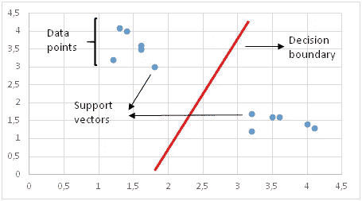

# 15 个必须知道的机器学习算法

> 原文：<https://towardsdatascience.com/15-must-know-machine-learning-algorithms-44faf6bc758e?source=collection_archive---------8----------------------->

## 机器学习综合指南


solébikes 在 [Unsplash](https://unsplash.com/s/photos/machine-learning?utm_source=unsplash&utm_medium=referral&utm_content=creditCopyText) 上拍摄的照片

近年来，机器学习经历了巨大的增长。我们比以往任何时候都更清楚机器学习可以实现什么。越来越多的高质量数据和计算的进步进一步加速了机器学习的普及。

有各种各样的机器学习算法，可以分为三个主要类别:

*   **监督学习**算法在给定一组观察值的情况下，对特征(独立变量)和标签(目标)之间的关系进行建模。然后，该模型被用于使用这些特征来预测新观察的标签。根据目标变量的特性，可以是**分类**(离散目标变量)或**回归**(连续目标变量)任务。
*   **无监督学习**算法试图在无标签数据中找到结构。
*   **强化学习**基于行动奖励原则工作。一个**代理**通过迭代计算其行动的**回报**来学习达到一个目标。

在这篇文章中，我将简要解释监督和非监督类别中的 15 种流行的机器学习算法。

我们将讨论的算法有:

1.  线性回归
2.  逻辑回归
3.  支持向量机
4.  朴素贝叶斯
5.  k-最近邻
6.  决策图表
7.  随机森林
8.  梯度推进决策树
9.  LightGBM
10.  CatBoost
11.  XGBoost
12.  k 均值聚类
13.  分层聚类
14.  DBSCAN 聚类
15.  主成分分析

## 1.线性回归

线性回归是一种监督学习算法，通过对数据拟合线性方程来模拟连续目标变量和一个或多个独立变量之间的关系。

线性回归是一个好的选择，自变量和目标变量之间需要有线性关系。我们可以使用散点图或残差图来检查线性。

线性回归模型试图将回归线拟合到最能代表关系或相关性的数据点。最常用的技术是普通最小二乘法(OLE ),它通过最小化数据点和回归线之间距离的平方和来找到最佳回归线。

下图显示了一条线性回归线，它试图根据给定的数据点对速度和距离变量之间的关系进行建模。


(图片由作者提供)

## 2.逻辑回归

逻辑回归是一种受监督的学习算法，最适用于二进制分类任务，如流失预测、垃圾邮件检测和广告点击预测。

逻辑回归的核心部分是逻辑(即 sigmoid)函数。它接受任何实数值，并将其映射到 0 到 1 之间的值。


(图片由作者提供)

逻辑回归模型将线性方程作为 sigmoid 函数的输入，并使用对数概率来执行二元分类任务。

逻辑回归返回概率值。下面是一个典型的逻辑回归曲线。


逻辑回归曲线(图片由作者提供)

我们可以使用概率值或将它们转换成标签(例如 1 和 0)。例如，如果概率大于 50%，则预测为正类(1)。否则，预测为负类(0)。

作为正类和负类之间的阈值的值取决于问题。我们可以调整区分正面类别和负面类别的阈值。如果设置为 70%，只有预测概率大于 70%的观测值才会被归为正类。

## 3.支持向量机(SVM)

SVM 是一种监督学习算法，主要用于分类任务。

SVM 生成一个决策边界来分隔类别。在创建决策边界之前，在 n 维空间中绘制每个观察值(或行)(n 是特征的数量)。例如，如果我们使用“长度”和“宽度”来对不同的“细胞”进行分类，则观察值被绘制在二维空间中，而决策边界是一条线。

支持向量是最接近决策边界的数据点。以到支持向量的距离最大化的方式绘制决策边界。



决策边界和支持向量(图片由作者提供)

如果决策边界太靠近支持向量，它将对噪声高度敏感，并且不能很好地推广。即使特征上非常小的变化也可能改变预测。


决策边界的错误选择(图片由作者提供)

如果数据点不是线性可分的，SVM 使用核技巧来测量高维空间中数据点的相似性(或接近性)。具有核的 SVM 实际上并没有将数据点转换到更高维度的空间，这是没有效率的。它只度量高维空间中的相似性。

标准 SVM 会尝试将所有数据点分为不同的类，并且不允许任何点被错误分类。这导致过度拟合模型，或者在某些情况下，无法使用标准 SVM 找到决策边界。

一个更好的选择是软边际 SVM，它试图解决一个优化问题，目标如下:

*   增加决策边界到类别(或支持向量)的距离
*   最大化训练集中正确分类的点数

该算法允许一些数据点的错误分类，以便确定更鲁棒和更一般化的决策边界。

在上面列出的两个目标之间有一个权衡。这种折衷由 C 参数控制，该参数为每个错误分类的数据点增加一个惩罚。如果 c 很小，则对误分类点的惩罚也很低，因此以更大数量的误分类为代价选择了具有大余量的决策边界。如果 c 很大，SVM 试图最小化由于高惩罚导致的错误分类的例子的数量，这导致了具有较小裕度的决策边界。对于所有错误分类的例子，惩罚是不同的。它与到决策边界的距离成正比。

## 4.朴素贝叶斯

朴素贝叶斯是一种用于分类任务的监督学习算法。

朴素贝叶斯假设特征是相互独立的，特征之间没有相关性。然而，现实生活中并非如此。这种特征不相关的天真假设是这种算法被称为“天真”的原因。

顾名思义，这个算法的核心元素是贝叶斯定理。


(图片由作者提供)

p(A|B):给定事件 B 已经发生的概率

p(B|A):给定事件 A 已经发生，事件 B 发生的概率

p(A):事件 A 的概率

p(B):事件 B 的概率

朴素贝叶斯计算给定一组特征值的类的概率(即 p(yi | x1，x2，…，xn))。在特征独立的假设下，我们可以使用这个概率和贝叶斯定理来实现:


(图片由作者提供)

该算法将复杂的条件概率转换为简单得多的条件概率的乘积。

所有特征都是独立的假设使得朴素贝叶斯算法比复杂算法更快。在某些情况下，速度优先于更高的精度。另一方面，相同的假设使得朴素贝叶斯算法不如复杂算法准确。速度是有代价的！

## 5.k-最近邻

k-最近邻(kNN)是一种受监督的学习算法，可用于解决分类和回归任务。主要思想是一个数据点的值或类是由其周围的数据点决定的。

kNN 分类器通过多数表决原则确定数据点的类别。例如，如果 k 设置为 5，则检查 5 个最近点的类。根据多数类进行预测。类似地，kNN 回归取 5 个最近点的平均值。

kNN 的最大挑战是确定 k 的最佳值。非常小的 k 值往往会导致过度拟合，因为模型对于训练集来说过于具体，并且不能很好地概括。另一方面，k 值非常大的模型在训练集和测试集上都不是很好的预测器。他们往往吃不饱。

kNN 简单且易于解释。它不做任何假设，因此可以在非线性任务中实现。随着数据点数量的增加，kNN 变得非常慢，因为模型需要存储所有的数据点。因此，它也不是内存高效的。kNN 的另一个缺点是它对异常值很敏感。

## 6.决策图表

决策树是一种监督学习算法。它通过反复提问来划分数据点(即行)。


(图片由作者提供)

分割不是随机确定的。选择导致最高信息增益的那些。增加节点纯度的分割更能提供信息。

节点的纯度与该节点中不同类的分布成反比。要问的问题是以增加纯度或减少杂质的方式选择的。

算法不断提问，直到所有节点都是纯的。纯节点仅包含一个特定类别的观测值。然而，这将是一个过于具体的模型，不能很好地概括。如果不对深度设置限制，决策树算法很容易溢出。树的深度由 max_depth 参数控制。

决策树算法通常不需要归一化或缩放特征。它也适用于处理混合的要素数据类型(连续、分类、二进制)。

## 7.随机森林

随机森林是一种监督学习算法。随机森林是结合了一种叫做装袋技术的决策树的集合。

在 bagging 中，决策树被用作并行估计器。并行组合多个决策树大大降低了过度拟合的风险，并产生更加精确的模型。

随机森林的成功高度依赖于使用不相关的决策树。如果我们使用相同或非常相似的树，总体结果将不会比单个决策树的结果有太大的不同。随机森林通过自举和特征随机性来实现不相关的决策树。

Bootsrapping 是从带有替换的训练数据中随机选择样本。它们被称为 bootstrap 样本。

通过为随机森林中的每个决策树随机选择特征来实现特征随机性。可以使用 max_features 参数控制随机森林中每棵树使用的要素数量。


随机森林算法的工作原理(图片作者提供)

随机森林是许多不同问题的高度精确的模型，不需要标准化或缩放。

## 8.梯度推进决策树(GBDT)

GBDT 是一种监督学习算法，它是通过将决策树与一种称为 boosting 的技术相结合而构建的。因此，GBDT 也是一种系综方法。

Boosting 是指将一个学习算法串联起来，从许多顺序连接的弱学习器中实现一个强学习器。

每棵树都试图最小化前一棵树的错误。boosting 中的树是弱学习器，但是连续添加许多树，并且每个树集中于前一个树的错误，使得 boosting 成为高效且准确的模型。与装袋不同，增压不涉及自举取样。每次添加新树时，它都适合初始数据集的修改版本。


GBDT 算法的工作原理(图片作者提供)

由于树是按顺序添加的，boosting 算法学习起来很慢。在统计学习中，学习速度慢的模型表现更好。

学习率和 n 估计量是 GBDT 的两个关键超参数。学习率，表示为α，简单地表示模型学习的速度。每个新的树修改整个模型。修改的幅度由学习速率控制。N_estimator 是模型中使用的树的数量。如果学习率低，我们需要更多的树来训练模型。然而，我们需要非常小心地选择树的数量。使用太多的树会产生过度适应的高风险。

与随机森林相比，GBDT 在分类和回归任务上都非常高效，并且提供了更准确的预测。它可以处理混合类型的特征，并且不需要预处理。GBDT 要求仔细调整超参数，以防止模型过度拟合。

GBDT 算法非常强大，已经实现了许多升级版本，如 XGBOOST、LightGBM、CatBoost。

## 9.LightGBM

由微软研究人员创建的 LightGBM 是梯度推进决策树的一种实现。

决策树是通过基于特征值拆分观察值(即数据实例)来构建的。决策树就是这样“学习”的。该算法寻找导致最高信息增益的最佳分割。

寻找最佳分割是决策树学习过程中最耗时的部分。随着数据量的增加，这成为一个瓶颈。LightGBM 旨在解决这个效率问题，尤其是对于大型数据集。

为了解决这个问题，LightGBM 使用了两种技术:

*   梯度单侧采样
*   EFB(独家功能捆绑)

我不会详细介绍，但我写了一篇更详细的文章来解释 LightGBM 是如何工作的。

</understanding-the-lightgbm-772ca08aabfa>  

## 10.CatBoost

Yandex 的研究人员创建的 LightGBM 是梯度增强决策树的另一种实现。

由于我们已经介绍了 GBDT，我将只提及 CatBoost 的特征。

CatBoost 实现了一个特定版本的增强，称为有序增强。它为处理过拟合提供了一种更好的方法。CatBoost 在处理分类特征方面也有很好的性能。另一个与众不同的特点是使用对称树。

官方[文档](https://catboost.ai/)和本[教程](https://github.com/catboost/tutorials/blob/master/python_tutorial.ipynb)为理解和使用 CatBoost 算法提供了全面的指导。

## 11.XGBoost

XGBoost 是 GBDT 的另一个实现。它如此强大，以至于统治了一些主要的 kaggle 比赛。XGboost 的目标，正如它在[文档](https://xgboost.readthedocs.io/en/latest/index.html)中所说，“是将机器的计算极限推向极致，以提供一个可伸缩的、可移植的和精确的库”。

XGBoost、LightGBM 和 CatBoost 的一个共同特征是它们需要仔细调整超参数。模型的性能很大程度上取决于选择最佳的超参数值。

例如，下面是 XGBoost 模型解决多类分类任务的典型超参数列表。

```
params_xgb = {
'boosting_type': 'dart',
'objective':'multi:softmax',
'num_class':9,
'max_depth':7,
'min_child_weight':20,
'gamma':1,
'subsample':0.8,
'colsample_bytree':0.7,
'tree_method':'hist',
'eval_metric':'mlogloss',
'eta':0.04,
'alpha': 1,
'verbose': 2
}
```

*   Max_depth:一棵树的最大深度。
*   Min_child_weight:一个孩子所需的实例权重的最小总和。将它保持在较高的位置可以防止孩子过于具体，从而有助于避免过度适应。
*   Gamma:在树的叶节点上进行进一步划分所需的最小损失减少。同样，游戏越大，模型越不可能过度拟合。
*   子样本:在生长树之前随机选择的行的比率。子样也可以用来避免过度拟合。
*   Eta:学习率。保持较高的值会使模型快速学习，但同时也会增加过度拟合的机会。
*   α:L1 正则化项。

XGBoost 的整个超参数列表可以在[这里](https://xgboost.readthedocs.io/en/latest/parameter.html)找到。

## 12.k 均值聚类

K-means 聚类是一种无监督学习算法。它旨在将数据划分为 k 个簇，使得同一簇中的数据点相似，而不同簇中的数据点相距较远。因此，它是一种基于分区的聚类技术。两点的相似性由它们之间的距离决定。

值得注意的是，这不同于我们为训练集中的数据点附加标签的分类。在聚类分析中，数据点没有标签。该算法被期望找到数据内的结构，以将数据点分组到聚类中。

K-means 聚类试图最小化一个类内的距离，最大化不同类之间的距离。

k-means 聚类的最大挑战是确定聚类数目的最优值。该算法无法确定聚类的数量，因此我们需要指定它。


初始数据点(图片由作者提供)


数据点被分组为簇(图片由作者提供)

K-Means 聚类相对较快且易于解释。它还能够以一种智能的方式选择初始质心(聚类中心)的位置，从而加快收敛速度。

## 13.分层聚类

分层聚类是一种无监督的学习算法。它通过迭代分组或分离数据点来创建聚类树。有两种类型的分层聚类:

*   凝聚聚类
*   分裂聚类


两种类型的层次聚类(图片由作者提供)

凝聚法是最常用的方法。每个数据点首先被假定为一个单独的聚类。然后迭代地组合相似的聚类。

层次聚类的优点之一是我们不必预先指定聚类的数量。但是，将所有数据点合并到一个聚类中是不明智的。我们应该在某个时候停止组合集群。

分层聚类总是生成相同的聚类。k-均值聚类可能会产生不同的聚类，这取决于质心(聚类的中心)是如何开始的。然而，与 k-means 相比，它是一种较慢的算法。运行分层聚类需要很长时间，尤其是对于大型数据集。

## 14.DBSCAN 聚类

基于分区和层次聚类技术对于正常形状的聚类非常有效。然而，当涉及到任意形状的聚类或检测异常值时，基于密度的技术更有效。

DBSCAN 代表**d**en sity-**b**as**s**s**c**lustering of**a**应用与 **n** oise。它能够找到任意形状的聚类和带有噪声的聚类(即异常值)。


任意形状的集群(图片由作者提供)

DBSCAN 背后的主要思想是，如果一个点靠近来自该簇的许多点，则该点属于该簇。

DBSCAN 有两个关键参数:

*   **eps** :指定邻域的距离。如果两点之间的距离小于或等于 eps，则认为这两点是相邻的。
*   **minPts:** 定义一个聚类的最小数据点数。

基于这两个参数，点被分类为核心点、边界点或异常点:

*   **核心点:**如果一个点在其半径为 eps 的周围区域内至少有 minPts 个数的点(包括该点本身)，则该点为核心点。
*   **边界点:**如果一个点可以从一个核心点到达，并且其周围区域内的点数少于 minPts，那么这个点就是边界点。
*   **离群点:**如果一个点不是核心点并且从任何核心点都不可达，那么这个点就是离群点。

DBSCAN 不需要预先指定簇的数量。它对异常值是鲁棒的，并且能够检测异常值。

在某些情况下，确定适当的邻域距离(eps)并不容易，这需要领域知识。

## 15.主成分分析

PCA 是一种降维算法，它基本上从现有的特征中获得新的特征，同时尽可能多地保留信息。PCA 是一种非监督学习算法，但它也广泛用作监督学习算法的预处理步骤。

PCA 通过查找数据集中要素之间的关系来获取新要素。

> PCA 是一种线性降维算法。也有非线性方法可用。

PCA 的目的是通过使用较少的特征(或列)尽可能多地解释原始数据集中的差异。新的派生特征称为主成分。主成分的顺序根据它们所解释的原始数据集的方差分数来确定。

> 主成分是原始数据集特征的线性组合。

PCA 的优点是使用比原始数据集少得多的特征保留了原始数据集的大量差异。主成分是根据它们解释的方差大小排序的。

## 结论

我们已经介绍了数据科学领域中最常用的机器学习算法。我试图为每个模型提供一个体面的介绍。为了掌握每种算法，你需要更深入一点，也需要练习。

感谢您的阅读。如果您有任何反馈，请告诉我。