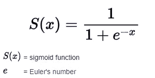

# 每个数据科学家都必须知道的 15 个数字功能

> 原文：<https://towardsdatascience.com/15-numpy-functionalities-that-every-data-scientist-must-know-f6d69072df68?source=collection_archive---------20----------------------->

## 讨论开发人员必须学习的十五个最基本的数字函数


[JESHOOTS.COM](https://unsplash.com/@jeshoots?utm_source=medium&utm_medium=referral)在 [Unsplash](https://unsplash.com?utm_source=medium&utm_medium=referral) 上拍照

机器学习的很大一部分是处理数学运算。由于数学是大多数数据科学项目中不可或缺的一部分，对于初学数据的科学家来说，更深入地研究以下主题变得至关重要。Python 是数据科学的最佳编程语言之一，它提供了一个非常有用的工具，那就是 numpy 库。

数值 Python (NumPy)是大多数机器学习和数据科学项目的精华部分。这些 numpy 阵列在计算机视觉的应用中找到了它们的效用，用于处理图像并根据阵列来计算它们。他们还发现，在数组的向量化过程中，自然语言处理任务得到了大量使用，从而使它们与训练 ML 或 DL 模型兼容。

借助 NumPy 数组，您可以相对轻松地完成大多数数学计算。它是大多数与线性代数和计算其他类似操作相关的任务的最佳库。但是，为了简化与 Python 库的集成和区别，您还必须查看另一个库。从下面提供的链接中查看如何使用 sympy 来简化积分和微分。

</best-library-to-simplify-math-for-machine-learning-ed64cbe536ac>  

这篇文章是一个初学者指南，介绍了 15 个必须知道的 numpy 功能，这些功能对各种操作都非常有益。我们将尝试涵盖大部分重要的内容，但还有很多内容需要探索。因此，让我们从作为数据科学爱好者需要学习的所有基本功能开始。

# 1.创建数组:

```
x = [1, 2, 3, 4, 5]
y = np.array(x)
y
```

## 输出:数组([1，2，3，4，5])

每个计划掌握 numpy 的数据科学家必须知道的第一个基本步骤是如何创建一个。当您可以创建一个数组时，您可以操纵它们来执行许多操作。要创建数组，可以用多种方法执行以下计算。一种方法是使用 Python 中的 list 数据结构存储数值，然后用 numpy 以数组的形式解释它们。

也可以通过使用 np.array()或 np.asarray()函数声明 numpy 数组，后跟方括号来创建一维或多维数组，从而定义数组。一旦创建了这些数组，就可以对它们执行各种操作。在接下来的几节中，让我们看看通常对数组执行什么操作。

# 2.阵列的形状:

```
a = np.array([[1, 2, 3], [2, 3, 4]])
print(a.shape)
```

## 输出:(2，3)

数组的一个基本概念是它们存在的各种形状。numpy 数组的形状决定了可以对其执行的不同类型的计算和操作。一旦创建了特定的数组，就可以解释 numpy 数组的形状。的。数组的 shape 属性将返回其特定形状的元组。

在 numpy 数组中必须理解的重要主题是 N 维(或 nd 数组)的概念。这些数组具有多个维度(不是行或列维度),包含相同大小和类型的项。n 维数组最常用于执行各种数学运算。

# 3.数组索引:

```
a = np.array([[1, 2, 3], [2, 3, 4]])
print("The middle elements are:", a[0][1], "and", a[1][1])
```

## 输出:中间的元素是:2 和 3

类似于列表的索引，我们也有一个索引数组的方法来执行和操作 numpy 数组中特定位置的特定元素。使用数组索引，我们可以访问任何知道其位置的所需元素。

在上面的示例中，我们试图从 shape (2，3)的特定数组中接收中间元素的值。数组中的第一个元素从初始索引零开始。特定的行号和列号在方括号中指定，这将允许用户计算数组的索引并接收元素的特定位置。

# 4.数组切片:

```
a = np.array([[1, 2, 3], [2, 3, 4]])
print(a[1:2])
```

## 输出:[[2 3 4]]

我们可以在类似于列表的 numpy 数组上执行的另一个很酷的操作是切片的概念。在这种技术中，我们试图从特定的 numpy 数组中只获取所需的元素。对于上面显示的示例代码块，我们试图通过相应地切掉第一行来只获取第二行的所有元素。

我建议您自己探索更多这种对 numpy 数组进行切片的操作。尝试许多切片操作，观察不同的结果。还建议您从下面的链接中查阅我以前的一篇关于掌握 Python 中的列表的文章，因为它将帮助您更好地理解索引和切片。

</mastering-python-lists-for-programming-5423b011d937>  

# 5.数组乘法:


由[克里斯·贾维斯](https://unsplash.com/@crissyjarvis?utm_source=medium&utm_medium=referral)在 [Unsplash](https://unsplash.com?utm_source=medium&utm_medium=referral) 上拍摄的照片

```
a = np.array([1, 2, 3])
b = np.array([[2],[1], [0]])print(np.matmul(a, b))
```

## 输出:[4]

使用 numpy 数组，可以非常简单地计算矩阵的乘法。在上面的例子中，我们注意到形状为 1 X 3 和 3 X 1 的特定数组相乘得到 1 X 1 矩阵的输出结果。使用 numpy 数组可以进行多次这样的计算。

# 6.点积:

```
a = np.array([1, 2, 3])
b = np.array([[2],[1], [0]])print(np.dot(a, b))
```

## 输出:[4]

numpy 数组可能实现的另一个重要计算是寻找两个变量的点积。点积本质上是两个特定数组的所有倍数之和。点积的概念在机器学习中无处不在。一个例子是权重计算或计算成本函数的用例。

根据下面的[参考](https://stackoverflow.com/questions/34142485/difference-between-numpy-dot-and-python-3-5-matrix-multiplication) , `matmul`在两个重要方面不同于`dot`。

*   不允许标量乘法。
*   矩阵堆叠一起广播，就好像矩阵是元素一样。

# 7.数组中元素的总和:

```
a = np.array([1, 2, 3])print(np.sum(a))
```

## 产出:6

计算 numpy 数组中众多元素的总和是一项非常有用的任务，可以借助本库提供的 sum 函数来完成。如果您要在列表的帮助下执行类似的操作，您可能会使用 for 循环来遍历列表中的所有元素，并相应地添加它们。这种方法会增加整体的复杂性，因此，最好使用 numpy 数组来进行这种数学计算。

作为奖励，我想提到另一种方法，它在列表的帮助下执行这种计算，同时保持时间和空间的复杂性。这个操作是在 Python 中的匿名函数的帮助下执行的。您可以利用 functools 库来导入 reduce 函数。导入后，您可以利用这个高级函数在一行中计算整个计算。

```
from functools import reducea = [1, 2, 3]
sum = reduce(lambda x, y: x+y, a)
print(sum)
```

如果您想了解更多关于使用多个代码和示例理解高级函数的主题，请随意查看下面的文章。它更详细地介绍了具体的概念。

</understanding-advanced-functions-in-python-with-codes-and-examples-2e68bbb04094>  

# 8.平均:

```
a = np.array([1, 2, 3])print(np.mean(a))
```

## 输出:2.0

Numpy 还允许开发人员相对容易地计算特定数组的平均值。通过将所有元素相加并将总和除以指定数组中存在的元素总数来对平均值进行置换。平均值的计算在若干机器学习算法中是重要的，例如用于计算均方误差的线性回归。

# 9.幂运算:

```
x = 5
print(np.exp(x))
```

## 输出:14860 . 486868686866

机器学习中执行的一个重要操作是取幂操作。欧拉数“e”的值约为 2.718，在基数对数计算中具有重要意义。因此，该函数有时用于执行数学运算。另一个要考虑的类似函数是 numpy 中可用的 pi 操作。



一个非常流行的使用求幂运算的场景是定义一个 sigmoid 函数。上图是以下内容的代表。要了解更多关于这种激活功能的信息，我推荐从下面的链接中查看我以前的一篇关于一种叫做校正线性单元的流行激活的文章。

</understanding-relu-the-most-popular-activation-function-in-5-minutes-459e3a2124f>  

# 10.展平数组:

```
a = np.array([[1, 2, 3], [2, 3, 4]])
a = np.ndarray.flatten(a)
print(a.shape)
```

## 输出:(6，)

每当我们处理多维数据时，我们可能需要为特定的任务展平它们。numpy 中的 flatten 函数将帮助您将 n 维数组缩减为单个实体。数据科学家必须探索的其他类似函数是 numpy 中可用的扩展维度或压缩维度函数。

# 11.阿兰格:

```
a = np.arange(5, 15, 2)
a
```

## 输出:数组([ 5，7，9，11，13])

arange 函数用于创建通常以指定间隔均匀分布的数组。您可以分别描述起点、终点和步数，以生成所需形状的任何 numpy 数组。要使用 numpy.arange()函数创建所需形状的多维数组，请确保使用 reshape 函数。

# 12.对数组排序:

```
a = np.array([3, 1, 2, 5, 4])
np.sort(a)
```

## 输出:数组([1，2，3，4，5])

当我们有一个混排值的数组，并且我们想把它们全部按升序排列，也就是说，按数字的升序排列时，sort 函数就相当有用了。虽然也可以对列表执行类似的操作，但值得注意的是，这种操作在 numpy 数组中也是可能的。

在执行各种操作时，您可能会遇到向特定的 numpy 数组追加更多元素的情况，但是一旦您获得了一个值列表，您可能会希望将它们全部排序在一起，以便相应地标识值。在这种用例中，sort()函数非常方便。

# 13.随机排列:

```
np.random.rand(2, 2)
```

## 输出:数组([[0.21886868，0.09692608]，
，[0.60732111，0.85815271]])

numpy 库还允许用户随机生成和创建带有随机值的数组。这个功能类似于 Python 中的随机库。但是，numpy 版本的 random.rand()函数，可以生成 n 维数组来执行大量的计算和运算。

在机器学习和深度学习中，随机数字运算通常用于的一个关键操作是，当我们想要用随机值初始化一堆权重或偏差时。通常，最好的方法是用一个随机值而不是零来初始化某些值。为了通过比例抽样的例子理解随机性的概念，建议您阅读下面的文章。

</step-by-step-guide-proportional-sampling-for-data-science-with-python-8b2871159ae6>  

# 14.最小值、最大值和绝对值:

```
a = np.array([1, 2, -3, 4, 5])
print(np.min(a))
print(np.max(a))
print(np.abs(a))
```

## 输出:-3
5
[1 2 3 4 5]

看看我们可以用 numpy 数组执行的其他一些基本操作，找出特定 numpy 数组的最小值、最大值和绝对值。np.min()和 np.max()函数是不言自明的，因为这些操作分别用于计算给定 numpy 数组中的最小值和最大值。

其他两个函数返回一个值，或者是一个最小值或者是一个最大值，而 absolute 函数将返回一个数组。但是，返回的所有基值都不考虑负号。我建议用户尝试的其他类似功能是对天花板、地板和其他类似操作的操作。

# 15.三角函数:

```
print(np.sin(np.pi/3.))
print(np.cos(np.pi/3.))
```

## 产量:0.8660254037844386
0.50000000001

除了使用 numpy 数组完成的所有特殊任务之外，您还可以使用这个库执行三角运算。在上面的例子中，我们对正弦和余弦进行了 60 度的简单三角运算，以获得它们各自的结果。随意探索其他类似的三角函数。

# 结论:


[达维德·扎维亚](https://unsplash.com/@davealmine?utm_source=medium&utm_medium=referral)在 [Unsplash](https://unsplash.com?utm_source=medium&utm_medium=referral) 拍摄的照片

> 没有数学，你什么也做不了。你周围的一切都是数学。你周围的一切都是数字。 **—夏琨塔拉·戴维**

Numpy 是 Python 中可用于各种任务的最好的库之一。虽然机器在文本或视觉信息方面不是最好的，但当这些信息在 numpy 的帮助下被转换成数学阵列时，许多关键任务的计算就成为可能。除了提高兼容性之外，完成某些任务也变得更加容易。因此，numpy 是数据科学家必须努力掌握的最好的库之一。

在本文中，我们了解了每个数据科学家都必须了解的十五个最基本的 numpy 功能。虽然我们讨论的一些函数是可以在 numpy 数组上执行的许多活动，如整形、索引和切片，但其他函数是我们可以在 numpy 数组上执行的各种计算。其中包括 sum()、mean()、arange()和其他类似的运算。

使用这些 numpy 数组，您可以尝试更多的东西。确保探索和深入挖掘以下主题。如果你对这篇文章中提到的各点有任何疑问，请在下面的评论中告诉我。我会尽快给你回复。

看看我的其他一些文章，你可能会喜欢读！

</17-must-know-code-blocks-for-every-data-scientist-c39a607a844d>  </6-best-projects-for-image-processing-with-useful-resources-f860f3dfe977>  </7-best-free-tools-for-data-science-and-machine-learning-3e630125f87e> [## 数据科学和机器学习的 7 个最佳免费工具

towardsdatascience.com](/7-best-free-tools-for-data-science-and-machine-learning-3e630125f87e) </6-best-programming-practices-f2605c5b469c>  

谢谢你们坚持到最后。我希望你们都喜欢这篇文章。祝大家有美好的一天！