# 我在数据科学候选人中寻找的 15 样东西

> 原文：<https://towardsdatascience.com/15-things-i-look-for-in-data-science-candidates-e72d3d671b3?source=collection_archive---------4----------------------->

## 给任何寻找或招聘数据科学工作的人的建议

宏向量创建的办公向量—[www.freepik.com](http://www.freepik.com)

数据科学一如既往地受欢迎，但矛盾的是，它似乎比以往任何时候都更加支离破碎，定义也更加模糊。对于新人来说，想知道如何进入这个领域可能是相当困难的，也许更困难的是，经理们想知道如何招聘职位，除非你确切地知道你在寻找什么。

在这篇文章中，我总结了我对数据科学候选人的看法。免责声明:这些是我在生物技术和制药公司工作时的想法，在这些公司，数据科学是支持功能的*，而不是业务的核心部分；也就是说，不是那种专门从事销售预测人工智能架构的职位*，而是你必须端到端地工作，在*多个*业务领域创造价值的职位。**

## *1.激情与好奇*

*当然，激情和好奇心是任何从事技术工作的人都需要的品质。数据科学是一头巨兽，我认为它是这个特定领域中更普遍的先决条件。在许多其他技术领域，你可以专注于一套技能，并利用这些技能连续多年推动商业价值——也许需要每隔 X 年学习一种新的编程语言或工具。然而，数据科学本质上是一门每天都在发展的科学学科。*

> *热情的候选人不断研究新的数据科学发展并与团队分享，这具有巨大的价值。*

*此外，候选人需要一定程度的热情和坚韧，才能继续希望在数据科学领域工作，而不是一直在沮丧中跳槽；调试为什么一个算法不工作可能比调试为什么一个软件或基础设施不工作更复杂和令人沮丧。你需要成为一个特殊的疯子，才能多次经历这些挫折。🤷‍♂正如我之前所说的:*

> *如果选择站在一个普通的资深数据科学家和一个眼中充满激情的候选人之间，在其他条件相同的情况下，选择后者。*

*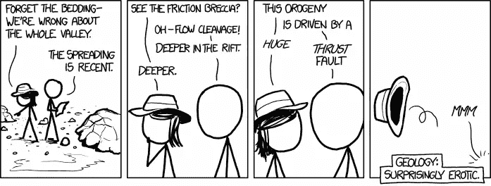*

*如果你对数据科学没有热情，就不要进入它；不值得。来自 xkcd.com 的漫画*

## *2.心智能力*

*数据科学作为一种职业并不适合所有人。我们应该停止假装它是。最近，Alberto Romero 就这个话题写了一篇有趣的[帖子](/the-hard-truth-data-science-isnt-for-everyone-1689b7c05e62)，描述了许多人的谬论；如果你付出足够的努力，你可以成为一名数据科学家。这不是真的。这是一项艰巨的工作:*

> *你需要理解数学和算法，你需要做编码和软件开发，你需要理解商业问题，*和*你需要有良好的讲故事和人际交往能力。不是每个人都能做好所有这些事情，甚至做得更好。*

*我不是说你需要 130+的智商才能成为数据科学家。我也不想吓唬任何人不要转向数据科学。相反，如果你现在处于另一个学术水平的位置，你可能会在数据科学领域做得很好。但是如果你处在智商钟形曲线的低端，努力理解新概念和新过程，这确实是一场艰苦的战斗；不断学习新事物和挑战现状是数据科学工作的基本内容。注意，我在这里不是在谈论使用低代码/无代码工具的公民数据科学家。*

*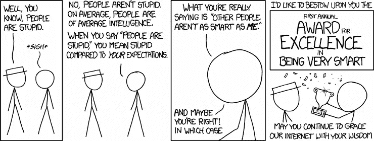*

*你不必是天才，但一定程度的智力是必需的。来自[xkcd.com](https://xkcd.com/1082/)的漫画*

## *3.转化为 ML 问题的能力*

*擅长工程机器学习(ML)算法是一回事。善于理解商业问题是另一回事。但是合并这两者并找出如何用 ML 解决商业问题是完全不同的事情。*

> *你需要能够将现实世界的问题转化为你能够解决的机器学习问题。*

*最近 [Brian Kent](https://medium.com/u/fea25fff8539?source=post_page-----e72d3d671b3--------------------------------) 写了一篇很棒的[帖子](/data-before-models-but-problem-formulation-first-b4c2a9a3e978)更详细地描述了数据科学的这个方面。本质上，当你作为一名数据科学家工作时(至少在我做过的职位上)，你将*很少*得到“这是你的数据集，适合这个目标的回归模型”类型的任务更常见的是，您会面临如下业务问题:*

*   *“我们希望利用一些新的人工智能技术来改善我们的现金流，”*
*   *"我们想用毫升把这种化学品的产量提高 10% . "*
*   *"我们想提高这个或那个过程/机器的效率."*

*将这些现实世界的目标转化为可解决的 ML 问题是一项被极度低估的技能——你需要对相关的业务流程和可用的数据有一个透彻的理解，你需要一个坚实的基础，知道 ML 实际上能做什么，最后，你需要一个良好的直觉，知道如何应用不同的技术来有效地解决手头的业务目标。*

*这种技能很少，但是你可以练习，例如，通过熟悉大量的 ML 应用程序，并花时间思考这类问题。*

**

*什么数据？什么型号？弄清楚*要解决什么并不容易。*来自 xkcd.com[的漫画](https://xkcd.com/1838/)*

## *4.诚实和谦逊*

*想象一下:企业想要使用 AI/ML 来优化一些流程。他们很兴奋，你也很兴奋，每个人都期待看到结果。你做了一个模型，最初，它看起来很棒，每个人都举起了手。你随后意识到你在评估模型的方式上犯了一个错误，这实际上是可怕的——数据中根本没有*信号*。*

> *如果你犯了错误，不管后果如何，你都需要成为完全负责并承认错误的人*

*会犯错误。我们都会犯错误。但是没有人会因为被掩盖的错误而受益，或者更糟糕的是，归咎于他人。在展示结果时，始终保持一定程度的谦逊，可以避免上述情况；如果它们是尚未经过同行验证的初步结果，那么*在展示它们时要清楚地*说明这一点。不要夸大其词。此外，一个优秀的候选人永远是自己最糟糕的批评家:*

> *用你得出结论的时间来证明你自己的结论是错误的。这会建立信心。*

*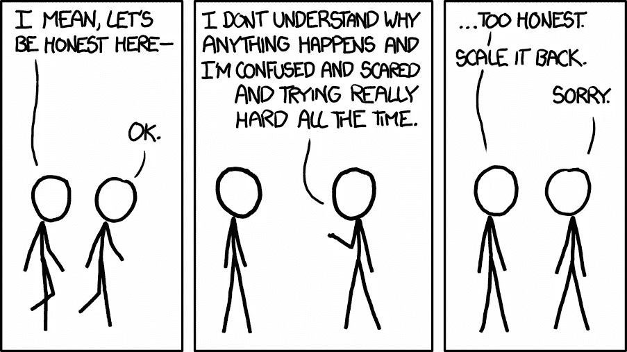*

*诚实是数据科学的基石。漫画作者[xkcd.com](https://xkcd.com/1146/)*

## *5.自动化和优化*

*每个人都讨厌重复的任务。有些人非常讨厌它，以至于他们想尽一切办法让它自动化。我们一直在谈论诸如 autoML 和 GitHub copilot 之类的时髦东西，到自动化代码环境的设置和一般的一切代码，甚至自动化每日时间注册，等等。对我来说，自动化和优化是伟大的开发人员/数据科学家的一些标志性思维模式。*

*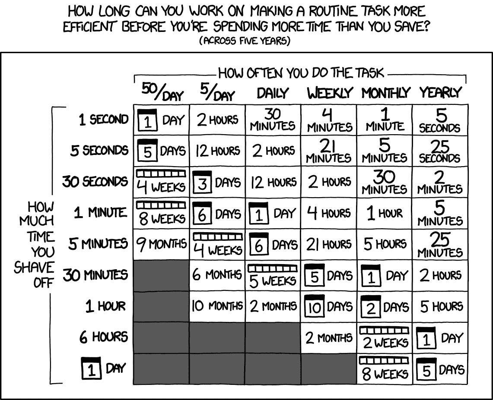*

*自动化一切。当有意义的时候。漫画作者[xkcd.com](https://xkcd.com/1319/)*

## *6.实用主义与价值追求*

*数据科学是一门科学学科。然而，当你被聘为数据科学家时，这份工作通常是关于应用数据科学工具来创造商业价值。很少是关于做研究，提出新算法，开拓新领域等等。有时候是，但很少。我们通常被雇佣来创造商业价值。*

> *我们工作的目标是创造商业价值。*

*在从事工业数据科学工作时，你必须对这个总体目标持务实态度。我在之前的一篇文章中写了几个要避免的陷阱，这是我在这个行业中所学到的经验；您可以在此阅读更多信息:*

* [## 从初级数据科学家到首席数据科学家的 20 个经验教训

### 花了 3 年时间研究饮食、睡眠和呼吸数据科学

towardsdatascience.com](/20-lessons-learned-going-from-junior-data-scientist-to-chief-data-scientist-6fe09ff89d78) 

总而言之，我认为务实的方法包括:

*   始终以客户为中心——如果业务不在船上，扼杀项目，它将永远不会创造价值。
*   创造和选择正确的想法——拒绝仅仅因为上级认为这是个好主意就去解决问题/想法。如果技术上不可行，你需要继续前进。
*   避免过度设计——如果一个更简单的方法可以用一半的时间解决问题，那就这样做。
*   专注于执行——不要陷入太多的陈述、讨论、如果这样会怎样、如果那样会怎样。开始做点什么。

我认为在 Medium 上有大量的读物可以帮助你成为一名更加务实的数据科学家。我最近很喜欢[的这篇文章](/10-strategies-to-boost-your-impact-as-a-data-scientist-590f1398ed37)，作者是[丹尼斯·艾勒斯](https://medium.com/u/7383a58c0e3e?source=post_page-----e72d3d671b3--------------------------------)，描述了如何在工作中变得更有效率和影响力，还有[的这篇文章](/dodging-pitfalls-when-transitioning-from-academia-to-industry-9f9367e7b563)，作者是[阿奇·德·伯克](https://medium.com/u/f651916e4a3f?source=post_page-----e72d3d671b3--------------------------------)关于从学术界到工业界的转变。

务实，创造商业价值。不要专注于不创造价值的事情。漫画作者[xkcd.com](https://xkcd.com/378/)

## 7.个性与团队契合度

很明显，候选人的个性及其与团队其他成员的契合度非常重要。所有职位的所有候选人都是如此。这也是为什么许多公司都有人力资源部门，并在雇佣前做性格测试的部分原因。心理学家经常研究“五大”人格特质，我发现这对于评估你刚认识的人来说特别有见地。就这些性格特征而言，我认为有些是非常必要的，例如，一定程度的*责任心*(高效/有条理)*、不友善*(说出你的观点，不要做个傻瓜)*外向*(与企业交谈，举行演示等)。)*、*以及*开放*(研究新技术，干掉你的心肝宝贝)。然而，总的来说，我不认为数据科学家有一个“理想”的性格特征，所以这主要是一个避免有害性格的问题。

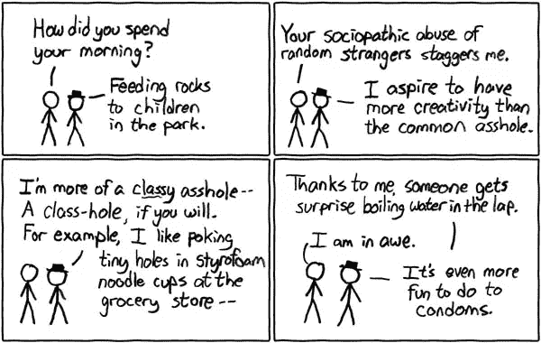

冷静点，友好点。漫画作者[xkcd.com](https://xkcd.com/72/)

## 8.编码经验

编码是数据科学的重要组成部分。通常，您编写的代码必须与同事共享才能投入生产，以便您和未来的同事可以在未来许多年内维护它。因此，一般软件开发和良好实践的经验是数据科学家最重要的素质之一。

> 如果另一个开发人员不得不花两倍的时间来审查和修复你写的代码，然后才能投入生产，那么你对团队是一种损害，而不是一种资产

请注意，我并不太关心不同的编码范例，也不关心您是喜欢笔记本还是纯脚本等等。这些是单个团队可以设定的标准。我说的是我如何看到初级开发人员编写完全可以理解并且可以在几分钟内审查的代码，我也看到有 30 多年经验的高级开发人员将 2 周的工作浓缩成 4 行难以理解的 R 代码。

> 如果你有一个公开的 Github 帐户，证明你可以用好的文档编写可理解的代码，这将是一个巨大的加分。

写别人能理解的代码。来自 xkcd.com 的漫画

## 9.调试技巧

我们经常开玩笑说，工作的一部分就是把所有的时间花在 StackOverflow 寻找代码片段上。虽然你可以用这种方式找到许多解决难题的优秀方案，但是调试的技巧远不止这些。

> 不要成为唯一的调试技能是堆栈溢出的人

在纯代码方面，您需要阅读文档来了解事情实际上是如何工作的，有时您甚至需要浏览您正在使用的任何开源库的源代码。在数据科学方面，事情会变得更加棘手；你可能需要通读论文，以了解事情应该如何工作，并从那里找出为什么它不工作——这可能真的是一种残酷的经历，尤其是因为人们如何实现算法的所有数字细节并不总是记录在代码或论文中。

> 我会发现更有趣的是看候选人如何调试一段破损的代码，而不是他们通过查看在线资源解决给定问题的能力。

调试是一种技能，也是一门艺术。漫画来自[xkcd.com](https://xkcd.com/1722/)

## 10.适应性

*适应性*大概已经被务实和个性这两点涵盖了。即便如此，适应性是如此重要，以至于我想把它作为一个单独的点。这个领域发展很快，我们必须能够杀死我们的宝贝。在一个项目上花了几百个小时，结果却没有创造商业价值？杀了它。花了几百个小时用 Tensorflow，现在整个团队都想用 PyTorch？放下它，学习 PyTorch。花了几千个小时在 Python 上，但现在对你正在做的事情来说还不够？放下它，学习一门足够的新语言。不要纠结于你做某事花了多少时间；那只会让你慢下来。

> 你停止适应的那一天，就是你开始输掉数据科学游戏的那一天

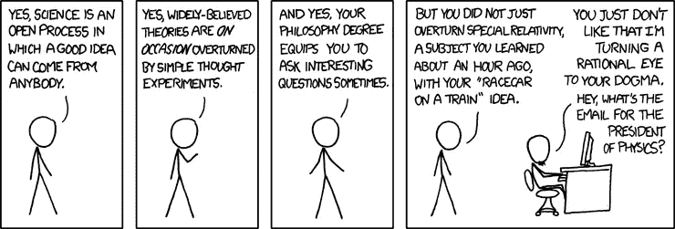

保持开放的心态，保持适应性。xkcd.com[漫画](https://xkcd.com/675/)

## 11.全堆叠势

我已经在前面的[中描述了](/20-lessons-learned-going-from-junior-data-scientist-to-chief-data-scientist-6fe09ff89d78)我认为典型的数据科学建议是非常糟糕的建议，这种建议是为了避免成为“万事通，无所不能”。相反，一个人应该努力成为“万事通，几个大师”

> 不要回避“数据科学独角兽”的想法，而是努力成为其中一员。

也就是说，我永远不会寻找*数据科学独角兽*；人才库太匮乏，定义太不清晰。然而，我要做的是筛选那些抱怨“不可能成为数据科学独角兽”的人。在我的书中，这种在行业中相当普遍的说法是有毒的，表明了对弄脏自己的手和完成事情的厌恶。

> 自然，你不需要成为一名成熟的前端/后端开发人员和云/数据工程师。但我发现，对涉足其他领域持开放态度的人在交付成果方面要有效得多。

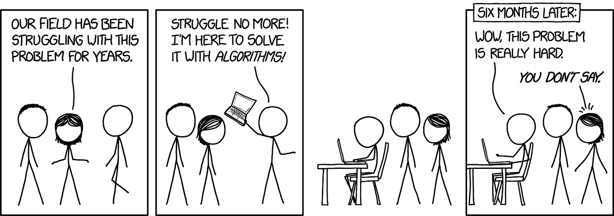

即使你可能不会成为大师，也要对扩展你的视野保持开放。来自 xkcd.com 的漫画

## 12.背景

当涉足数据科学时，拥有生物信息学、量子物理学或其他科学领域的背景显然是有利的；这意味着你习惯于阅读研究论文，以前做过统计分析，可能会一点编程，等等。然而，接受良好的教育绝不是必要条件。只不过是几年的结构化学习。但是很自然的，你以前做过的事情和取得的成就在申请新工作时会被考虑。

> 在其他条件都相同的情况下，我会雇用一个从一无所有到接受过任何高级教育的人。

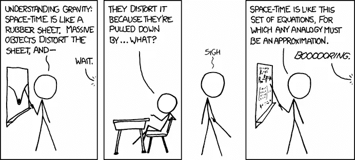

你的背景自然会影响你目前的技能。xkcd.com[漫画](https://xkcd.com/895/)

## 13.讲故事

这一点之前已经说过无数次了，所以我不会在这上面花太多时间，尽管它很重要:数据科学家需要讲一个好故事。*是什么意思*？学会创造吸引人的视觉效果，做漂亮的演示，进行引人入胜的谈话，写博客等。

> 你做得越多，并试图比上一次做得更好，你就会做得更好

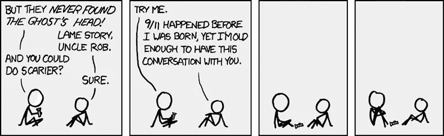

学会讲有影响力的故事。来自[xkcd.com](https://xkcd.com/647/)的漫画

## 14.合作

我的一个弱点是我不太擅长合作——我想这是我在得到一份“真正的”工作之前已经一个人呆了 10 多年的结果。然而，这个事实让我更加欣赏那些善于合作的人；用数据科学创造商业价值是一个团队纪律，因此你必须善于与包括以下内容的一切合作；结对编程、适当的文档、明智的 git 提交、冲刺计划、回顾等等。这种体验绝对是优势！如果你是协作的新手，找一个有趣的开源项目并参与进来。

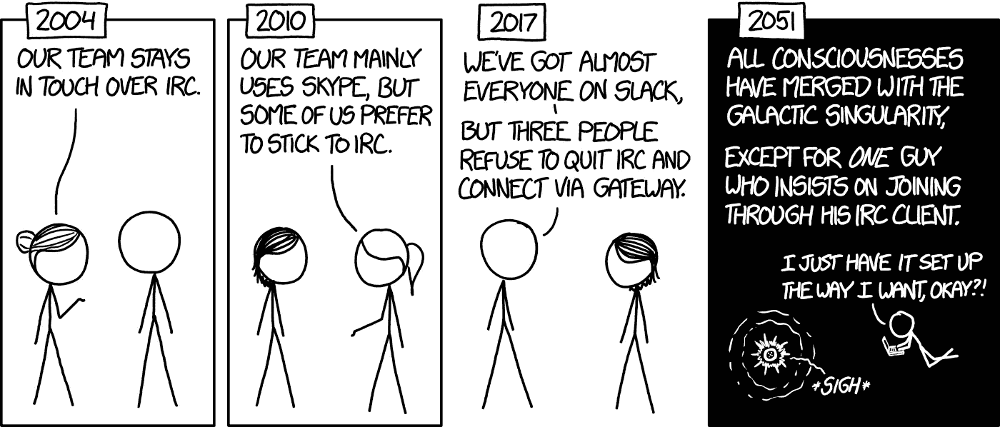

你需要能够在团队中工作！数据科学不能做一个人的军队。漫画作者[xkcd.com](https://xkcd.com/1782/)

## 15.数据科学经验

我清单上的最后一点是实际的*数据科学*经验。自然，如果候选人接触过该领域内的各种学科，这是有利的；与计算机视觉、自然语言处理、预测、经典的监督/非监督技术、通用深度学习等相关。

根据我的经验，你很少会多次得到“同一个”任务。因此，拥有尽可能广泛的知识库是一个优势——有一天，你可能在做销售预测，另一天，你可能在预测分子的化学性质或优化生产过程。如果我是为了销售预测而招聘，如果候选人以前从未做过销售预测，如果这个人有做其他类型的机器学习的长期历史，我不会太担心。学习如何解决新问题只是工作中的一天。

获得广泛经验的门槛相对较低；积极参与一些不同领域的 Kaggle 竞赛，然后你应该开始有一个基本的了解。此外，通过这样做，你将建立一个你能做什么的投资组合。我不是说这个*容易*做*，*只是说入门容易。在这个过程中，每当你遇到一个新的概念时，一定要确保你能完全理解它。

> 不要仅仅将算法作为黑盒来应用，而是让你明白它们实际上在做什么。

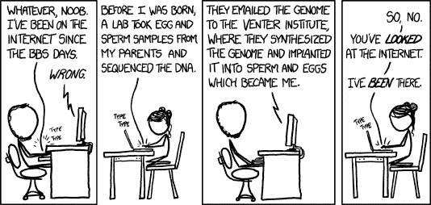

你在游戏中的时间越长，你获得的经验越多；我们都在不断学习。来自 xkcd.com[的漫画](https://xkcd.com/2300/)

## 结束语

最后我写了一篇相当长的帖子。如果你已经通读了全部，我感谢你🍾我意识到许多提出的观点将适用于许多职业，特别是当涉及到类似的工作时，如数据工程、云工程等。以上是我从数据科学角度的思考。请注意，我从来不会期望一个初级开发人员完全符合所有提到的要点——相反，我会寻找一个能够成长为所有提到的要点的人。最后，我希望获得关于其他人在数据科学候选人中寻找什么的反馈，所以请随时发表评论或通过任何其他渠道联系。*