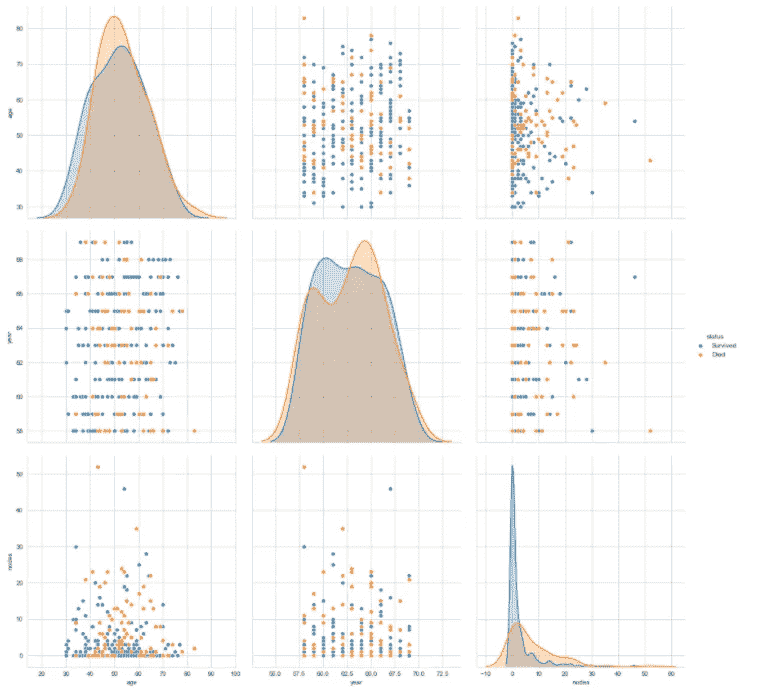

# 在数据科学领域取得更大成功的 15 个技巧

> 原文：<https://towardsdatascience.com/15-tips-to-be-more-successful-in-data-science-c58aa1eb4cae?source=collection_archive---------7----------------------->

## 意见

## 作为数据科学家，每个数据科学爱好者都必须努力提高的 15 个因素

吉尔·Á·阿尔瓦雷斯在 [Unsplash](https://unsplash.com?utm_source=medium&utm_medium=referral) 上的照片

> *“成功的人做不成功的人不愿做的事。不要希望它更容易；希望你更好。”*
> 
> — [吉米·罗恩](https://www.inc.com/jayson-demers/51-quotes-to-inspire-success-in-your-life-and-business.html)

数据科学已经成为过去十年中最受欢迎和最具突破性的学科之一。这一新兴趋势将在未来几年持续下去。数据科学正处于发展的巅峰，随着技术的快速发展和进步，数据科学将会在当今时代占据主导地位。

除了被视为向许多数据科学爱好者提供工作的主要前景之一，无论是数据科学还是它的任何其他子领域，数据科学也被称为 21 世纪最性感的工作机会之一。

为了用简单的术语为观众定义数据科学，我们可以将数据科学视为一个包含各种子领域的广阔领域。这些概念的知识，当结合在一起时，可以有效地用于开发一些美好的和神话般的项目，为人类的整体利益。

数据科学包括使用可用的数据元素或数据集，并创建独特的发展模型。当这些模型完成时，我们可以有效地使用它们来解决它被编程来实现的特定任务。根据模型的质量和开发人员的技能，这些项目往往以极高的效率和准确性做出预测。

然而，来自[维基百科](https://en.wikipedia.org/wiki/Data_science)的更正式的定义方法可以定义如下:

> **数据科学是一个跨学科领域，它使用科学的方法、流程、算法和系统来从许多结构化和非结构化数据中提取知识和见解。数据科学与数据挖掘、机器学习和大数据相关。数据科学是将统计学、数据分析及其相关方法统一起来，以便用数据来理解和分析实际现象的一个概念。**

基本的正式定义和描述已经完成，现在是时候让我们关注 15 个技巧了，这些技巧将使该主题的每个爱好者更成功地成为未来的数据科学家。每个有抱负的数据科学学生都必须遵循本文中提到的步骤，以取得一流的成果，并提高自己，成为未来更好的数据科学家。在我们更深入地阅读本文之前，您需要确保您确实喜欢并享受数据科学。

当每个人都忙着跳上数据科学的宣传列车时，弄清楚数据科学是否是你喜欢学习的东西是极其重要的。如果您对数据科学的众多特性、功能和其他方面不感兴趣或着迷，那么您最好考虑掌握一个不同的领域。数据科学需要坚持不懈的努力和奉献精神，才能坚持不懈地开发出造福当代人和社会的令人惊叹的项目。

</10-wrong-reasons-to-become-a-data-scientist-319531bb874e>  

在本文中，我们将尝试涵盖每个数据科学爱好者必须关注并发展其技能以实现最佳结果和成果的技术和心理方面。提到的 15 个要点中的大部分将使浏览者能够衡量一个方面，这是掌握数据科学的基本要求。对数据科学有了基本的了解，并对本文的目标有了现实的期望，让我们深入了解这些概念，并逐一理解这些技巧。

# 1.做好心理准备

> “不做准备，就是在为失败做准备。” **——本杰明·富兰克林**

数据科学或任何人工智能话题有时可能会很费力。特定问题的复杂性可能不会吸引你的大脑。你花在分析编程、数学、理论概念等几个方面的时间。，会让你的大脑紧张，产生一种糊里糊涂的感觉。

当你计划直觉地研究一个有趣的话题时，有几次你可能会对同一个话题失去兴趣。出现这些情况的一个主要原因可能是因为缺乏集中和专注，或者仅仅是因为你的思想还没有做好充分的心理准备来面对你计划实现的复杂程度。

因此，理清你的思路，专注于你计划完成的目标是非常重要的。作为一名数据科学爱好者，您的主要目标必须是生成高质量的模型和结果。确保提前计划好你的所有任务，以完美的方式接近你的目标。

在实施项目的过程中，我强烈建议制定一个待办事项清单，不断提醒你需要完成的各种任务，以便准确地完成你想要的结果。下面提供的链接是一个项目构想，它将帮助您实现一个提醒应用程序，该应用程序将不断提醒您执行任务。

</python-project-to-improve-your-productivity-for-the-new-year-1956824eddb1>  

基本上，努力保持动力，高度关注数据科学的积极方面。当你开始准备学习新的目标时，要更加乐观。无论您期望的最终结果是什么，都要做好接受失败的心理准备，并以绝对的信心和绝对的意志继续您掌握数据科学的旅程！

# 2.专门研究重要的课题

数据科学最重要的一个方面是研究该领域中众多重要的主题。试着花一些专门的时间来解码一个你可能喜欢研究、阅读或学习的特别有趣的话题。

例如，让我们考虑一个机器学习主题的例子，如逻辑回归。逻辑回归的概念在机器学习领域具有重要意义。因此，更好地掌握一个基本主题是很重要的。为了以最好的方式掌握这个概念，我强烈建议你深入研究逻辑回归的每个方面的复杂细节。

首先，尝试计算和分析大量可能的数学理论、假设和推导。了解更多关于几何，概率和其他方法的定义和推导。一旦你完成了所有必要的数学方面的分析，是时候继续进行编码和编程了。

下一步是尝试从零开始实现整个逻辑回归函数，而不使用像 scikit-learn 这样的外部库。在我以前的一篇文章中，可以看到一个不使用任何外部库(如 numpy)来实现数学问题(如矩阵乘法)的例子。下面提供了链接。

</python-coding-from-scratch-matrix-multiplication-without-any-machine-learning-libraries-463624fe8726>  

另一个重要的提示是，当你试图研究和学习某个特定的主题时，试着抓住你力所能及的所有可能的资源。要特别注意深入研究这些资源，以获得尽可能多的知识。

# 3.发展自信解决问题的任务

布鲁斯·马斯在 [Unsplash](https://unsplash.com?utm_source=medium&utm_medium=referral) 上的照片

在一个类似于数据科学的领域获得自信的最好方法是解决大量简单和复杂的问题。你的目标必须是付出 100%的努力来成功完成它们。无论你有多少学习数据科学的动机，在特定任务的计算中反复失败和失败的尝试都会导致动力下降，最终缺乏信心。

为了避免这种情况，一次考虑一个任务并在这段时间内解决特定的任务变得至关重要。总是从简单的编程任务或简单的数据科学项目开始，你有信心可以解决。

如果你在一个特定的问题上反复失败，不要浪费你的宝贵时间去做一些不必要的重复。这可能是一个更好的想法，向前看，在相同的时间框架内，不需要任何外部指导，你就可以潜在地解决其他问题。

此外，如果你能够对一个特定的主题进行广泛的学习、分析和研究，你最终会在解决问题时更加自信。这样做的原因是因为你对概念有一个直观的理解，以及对解决手头的任务有一个清晰和深入的理解。

# 4.花时间分析复杂的问题陈述

照片由 [NeONBRAND](https://unsplash.com/@neonbrand?utm_source=medium&utm_medium=referral) 在 [Unsplash](https://unsplash.com?utm_source=medium&utm_medium=referral) 上拍摄

每个数据科学爱好者和追求者应该关注的第一个主要步骤是他们花在分析给定问题陈述或项目想法上的时间。利用你的时间去看问题的方向的最终目的是得到一个想法，并为解决这个问题建立一个框架。

在开始你的问题陈述或项目想法之前，通常最好的事情是确保你已经在你的头脑或一本书(一张纸也可以)或你的电脑上的目录中建立了一个完美的计划。规划是从事数据科学项目的重要阶段。因此，提前计划好所有的步骤来有效地开始你的工作。

我建议您花时间分析相应的问题，通常必须按照这些特定的步骤顺序如下:

*   试着获得对你计划处理的问题陈述的视觉感知和直觉理解。花几分钟到几小时的时间，直到你确信自己对如何完成任务有了基本的了解。
*   在开始着手一个项目或一个复杂的问题之前，看看一些解决方案或研究论文以及它们提供的有用信息。Kaggle 解决方案和笔记本是获取更多相关知识的绝佳来源。
*   在收集了大量的信息资源后，制定一个完美的计划和时间表来决定你处理问题陈述的计划。做一份完整的待办事项清单，它会指引你走上正确的道路，直到你的目标成功达成。

这些基本步骤将帮助你更好地分析你的项目。对于在 12 个月内掌握数据科学的学习计划，我强烈建议从下面提供的链接中查看下面的文章。是初学者入门的简明指南。

</12-steps-for-beginner-to-pro-in-data-science-in-12-months-c6f6ba01f96e>  

# 5.致力于提高特定的数学和编程技能

编程和数学技能在掌握数据科学方面发挥着重要作用。虽然数学对于从直觉上和理论上理解与数据科学相关的各种概念是必不可少的，但编程对于这些主题各自的实际实现是至关重要的。

为了更深入地理解这两个领域(即编程和数学)的必要性，让我们分别看一下这两个方面并对它们进行分析。首先，我将查看与数学相关的提示，供所有级别的数据科学爱好者沉迷和学习。

数学是数据科学的重要组成部分。为了完美地利用掌握数据科学和机器学习所需的技能，数学是一个突出的优势。你需要主要关注数学的子领域，如线性代数、概率和统计以及降维技术。

线性代数对于理解数据科学的许多概念是必不可少的，尤其是像 numpy 这样重要的 python 库模块。为了更直观地理解 numpy，您还需要理解一些理论概念，比如点积、可以通过 numpy 数组计算的矩阵相关运算等等。

概率和统计对于数据科学也是至关重要的，因为这些领域的理论实现几乎被用于数据科学的每个方面。其中包括像朴素贝叶斯这样的机器学习算法，其中使用了条件概率的概念，或者在深度学习主题中，如生成式对抗网络(GANs)。

像主成分分析(PCA)和 t-分布随机邻居嵌入(TSNE)这样的降维技术也是有用的数学概念。它们用于将复杂的维度从大的视图框架减少到较小的维度范围。例如，这些技术可以用来将 MNIST 从 784 维转换到 100 维。

编程是数据科学最好的部分，它将为您的项目注入活力。因此，专注于编码将永远是你必须掌握的数据科学的一个组成部分。为了提高编程水平，作为初学者，您对数据科学领域的主要关注点应该仍然是 Python，其次是 SQL。

你可以在对数据科学这门学科建立了更简洁的理解之后，再去学习其他编程语言，慢慢完善你的简历。SQL 在数据科学中的重要性以及为什么应该给予它高度的优先权是因为它允许您存储大型数据库和数据信息集，这对于数据科学项目是至关重要的。

为了获得掌握数据科学 Python 的能力，我强烈推荐阅读下面的文章，其中包括从头开始掌握数据科学 Python 的十个步骤。这是一个循序渐进的指导过程，下面提供了链接。

</10-steps-to-master-python-for-data-science-f54199bb328d>  

# 6.尝试多种可视化技术

作者图片

数据可视化在数据科学项目建设中发挥着重要作用。通过查看大量图像，我们可以确定我们所拥有的数据或数据集的一些基本特征和特性。

探索性数据分析是数据科学的一个重要方面，在处理任何类型的任务时都应该考虑。当你将数据可视化时，你获得了直观的理解，你的大脑可以感知到他们工作标准的各种概念。您还可以获得关于如何处理这些数据集的一些想法和反馈。

可视化的主要优势是，它们让您能够为您的数据科学项目探索最佳的直观想法。除了为开发中的项目提供基本的背景和工作空间之外，它们对于项目的长期集成和改进也很有用。

这些形象化对于你的理论工作的其他观众理解你的精确想法和为你解决特定任务的方法确定一个清晰的概念是有用的。这有助于你轻松地向他人解释你对当时正在从事的特定项目的观点。

任何数据科学项目的可视化都绝对可以改变游戏规则。我将确保在我的下一篇文章中更详细地讨论这个主题，因为数据可视化是一个庞大的主题，不能在这篇文章中讨论。请继续关注我即将发表的文章，在这篇文章中，我将讨论八种最佳可视化技术，以及如何在您的数据科学项目中利用它们。

# 7.奉献和坚持

处理数据并成功完成数据科学项目并不总是那么容易。在许多情况下，您可能会遇到复杂的任务，您将努力找出精确的模式或解决方案。

此外，对于数据科学爱好者来说，知道一个特定的概念却不能准确找到答案有时会变得非常沮丧。尽管你对题目有所了解，但有时你无法解决问题，这种情况发生在我们当中最优秀的人身上。

在这些令人沮丧的时期，似乎最好的选择是放弃数据科学，继续生活中更好的事情。然而，这里是奉献和坚持的地方。虽然数据科学可能令人沮丧，某些任务可能看起来很难处理和解决，但这并不是世界末日。

数据科学中最令人满意的时刻是当你能够用你的纯技能和努力解决这些复杂的问题的时候。当你能保持高昂的情绪并完成目标时，它还会给你肾上腺素激增和自信心的提升。

成功的数据科学家最重要的特征之一是他们能够坚持不懈地努力工作，直到达到目标。虽然很容易失去希望，但他们会继续努力，达到最优解。虽然，这个过程可能要花一些时间。

数据科学需要一些耐心和时间来完成特定的任务。特别是在深度学习领域，当你在构建一个特定的模型架构时，有太多不同的参数需要你考虑。

为您的特定任务定义具有许多层的模型体系结构，以及选择适当的激活函数和优化器，需要花费一些时间。老实说，要获得最好的结果和最优的解决方案，需要大量的尝试和方法。

因此，重要的是保持你的镇定，保持专注，直到你的目标达成。我强烈推荐通过下面的链接查看下面这篇关于成功数据科学家的五大品质的文章。

</top-5-qualities-of-successful-data-scientists-c3cfa0f8f0ca>  

# 8.需要时寻求帮助

[Icons8 团队](https://unsplash.com/@icons8?utm_source=medium&utm_medium=referral)在 [Unsplash](https://unsplash.com?utm_source=medium&utm_medium=referral) 上的照片

虽然我强调在数据科学项目上花费时间并继续工作，直到您获得最佳解决方案，但这并不表明您总能获得预期的结果。你猜怎么着？—那完全没问题。

在研究数据科学时，你并不意味着是一个完美主义者，老实说，没有人在这方面是完美的。作为数据科学家，进化是必修课。在某些时候，每个人都可能陷入困境，需要帮助以及如何处理问题陈述或任何其他疑问的指导。

当这样的时刻到来时，不要犹豫向更有经验的有志之士、爱好者、业余爱好者和专业人士寻求帮助。数据科学社区和 Python 社区充满了令人敬畏和惊奇的人，他们总是愿意提供帮助。

除了像 Stack Overflow 和 GitHub 这样非常有用并为数据科学家或数据科学爱好者遇到的大多数问题提供一些最佳解决方案的网站之外，像 discord chats 和 slack chats 这样的服务器。

互联网上有大量免费内容可供探索和检查关于数据科学和机器学习的大量细节和功能。查看我以前关于这个主题的一篇文章，了解更多关于一些潜在资源的信息，您可以从中利用信息并获得更多知识。

</10-best-free-websites-to-learn-more-about-data-science-and-machine-learning-f2c6d7387b8d>  

你也可以根据你的舒适程度来选择一些免费或付费的课程。如果你对从事数据科学有百分之百的信心，并且你觉得你需要一些外部帮助或资源，确保你在这个主题上做了明显的研究。完成这些步骤后，您可以继续选择您认为对您的长期需求和要求有益的最佳选择。

无论哪种方式，只要你能从朋友、专家或老师那里获得帮助，确保你能获得同等的知识，这些知识是你在获得帮助时至少能完成特定的任务、问题或项目所需要的。以小组或两人一组的方式工作也是一个好主意，因为你们可以互相分享和传递有用的信息，每个人都可以从中受益匪浅。

# 9.阅读研究论文

威廉·艾文在 [Unsplash](https://unsplash.com?utm_source=medium&utm_medium=referral) 上的照片

> **阅读大量的研究论文！**

在数据科学领域，随着不断进步和不断发展，有才华的人和数据科学家提出了创新的作品，并将它们作为研究论文发表。这些研究论文必须仔细查阅，并相应地练习。如果你是一个成功的数据科学家，我强烈建议你查看每周发布的研究论文。

虽然查阅和阅读研究论文应该是获得进一步知识的第一步，但这远远不够。如果你看到一篇关于建模体系结构的研究论文，并且对一个特定的结构是如何构建的有一个完整的解释，你应该自己探索这些概念。

如果您在研究论文中遇到的特定项目或工作是可行的，并且与您的设备兼容，那么开始探索架构构建并开始自己构建它总是一个好主意。如果你能够实现这些结构和模型，这将提高你的整体信心，并帮助你更有效地学习和掌握研究论文中涉及的主题。

除了获得研究论文中发表的特定主题的深入知识外，它还允许读者和从业者探索新技术，并与所有现代新兴趋势保持同步。在数据科学中，变化是永恒的。如果您能够适应数据科学领域的这些不断变化，您就可以完成几乎任何您试图执行的复杂任务或复杂项目。

# 10.休息一下

> 不要让你的头脑紧张，也不要让你的身体疲惫！

数据科学有时会很艰难，压力很大。你可能在一个问题上花了几个小时，按照前面提到的所有步骤，尽你所能努力工作，但仍然没有达到你希望达到的预期结果。在处理项目想法或数据科学中的任何一般问题时，很容易陷入困境，无论您遇到的特定问题有多简单或多困难。

对于每个数据科学家或数据科学爱好者来说，定期休息是一个好主意。总的来说，生活中要记住的一个重要方面是不要努力工作，而是要聪明地工作。虽然努力工作会在适当的时候得到回报，但前面的说法对数据科学来说比其他任何东西都更适用。这一评论的理由是因为数据科学是一个庞大的主题，在这个领域中有太多的主题需要学习。

然而，人们必须注意到，学习这个领域的每一个方面并不是一个强制性的要求。通过关注数据科学的基本主题和实现项目目标所需的特定概念就足够了。学习更多或对获得各种概念的进一步知识感兴趣没有坏处，但不要浪费时间在探索问题时陷入不必要的问题中。

我强烈推荐您阅读我以前的一篇文章，这篇文章略微深入地介绍了您必须关注的主题，以便尽快掌握数据科学。您可以通过下面提供的链接访问下面的文章。

</best-topics-to-focus-on-to-master-data-science-as-fast-as-possible-609ce5cb05e3>  

有时候，当你在数据科学中处理一个特定的问题、任务或项目时，你可以多次短暂休息，除非你没有偏离你的主要目标。如果你在解决问题的过程中多次失败，那么暂停一项特定的任务也是完全可以的。

即使经过多次尝试，在获得一些额外的外部帮助后，如果你无法解决特定的任务，那么就专注于一些娱乐活动或爱好。不要因为失败的尝试而压力太大或伤透了脑筋。你已经发现了许多解决不了问题的方法，也通过不成功的尝试学到了很多。因此，保持乐观，当你的身体和大脑认为有必要的时候休息一下。

# 11.保持更新

> 修改和重温你的作品！

数据科学最棒的地方在于它每天都面临着学科的不断发展。数据科学每天都有新的发现。目前在数据科学领域流行的一种技术在未来几天、几周或几个月内可能不会那么有效。方法的进步和发展日新月异。

技术快速发展的一个例子可以通过生成对抗网络(GANs)中最精彩的神经网络技术之一的曲线急剧增长来理解。从 Ian Goodfellow 和他的同事在 2014 年设计的初始框架开始，这些网络已经走过了漫长的道路，并在过去几年中不断发展。从创建和复制简单的设计，他们现在可以创建完全更新的图形结构。这些技术非常出色，在数据科学和深度学习领域掀起了一场新的革命。

随着数据科学的不断进步，每个爱好者都必须不断学习更多知识，跟上最新趋势。如果不跟上新趋势，数据科学家就很难开发出客户或用户想要的最佳质量的产品。如前所述，研究论文是跟上技术和数据科学最新发展趋势的好方法。

除了研究论文之外，阅读关于数据科学发展和其他新兴技术的文章和新闻也是开始更新知识的绝佳方式。敏锐地研究这些进步将有助于你在数据科学发展的潮流和趋势中保持完整。因此，继续练习和阅读，让自己保持更新，以保持相关性，并成为数据科学爱好者的主导地位。

# 12.理解你的代码的目的

拉多万·纳基夫·雷汉在 [Unsplash](https://unsplash.com?utm_source=medium&utm_medium=referral) 上的照片

在从事数据科学项目或任何其他编程项目时，开发人员了解他们代码的用途是非常重要的。如果没有代码背后推理的基本知识，您就不可能理解概念，更重要的是，操作您最近遇到的代码或代码块。在不了解代码块重要性的情况下盲目编码可能会对您的整个数据科学之旅不利。

我们生活在一个互联网能够为我们提供任何我们正在寻找的解决方案的世界和地方。虽然信息和数据的可用性自然对我们所有人都有好处，并且需要加以利用，但对于数据科学爱好者来说，深入了解他们遇到的代码块背后的基础知识和推理是至关重要的。特定的编程项目需要对代码进行小的修改，以完美地完成特定的任务。

花一些时间了解你正在学习的库模块的必要性，并自己分析这些概念和代码块。例如，scikit-learn 库有如此多的功能和操作。确保查看每个单独的组件，并尝试理解这些代码块的用途。此外，了解每个单独参数的更多信息是一个好主意，因为它们对您的开发项目可能是必要的。

# 13.尝试各种架构、模型、优化器等。

如果您完成了特定数据科学项目的模型结构的构建，就没有时间放松了！有了这些模型，您可以实现更多的目标。既然你已经解决了如何解决特定任务或项目的问题，那么这是你开始探索构建模型的众多选项的最佳时机。

说起来，在深度学习方面，我们有三种主要架构的可用性，即顺序、功能 API 和模型子类(或定制模型)结构。一旦你完成了你的整个建筑结构，如果你打算参加像 Kaggle 这样的比赛，并希望产生最佳质量的模型，建议你尝试这些建筑结构，以达到最佳效果。

无论您是在构建机器学习模型还是深度学习模型，在构建代码块时开始探索众多可用的选项总是一个好主意。例如，像 VGG-16 体系结构这样的特定迁移学习模型可能比像 Inception 体系结构这样的其他迁移学习模型表现得更好。对于更好的任务，使用 LSTMs 可能比 CNN 更好。对数据科学家来说，分析这些因素极其重要。

最后一点是用于解决特定问题的激活函数和优化器。虽然 ReLU 通常被认为是最好的激活函数，Adam 是执行大多数任务的首选优化器，但探索其他激活函数和优化器，看看哪一个为特定任务产生最好的结果，总是一个好主意。下面是一篇在五分钟左右解释 ReLU 激活功能的文章。如果你想了解更多关于这个话题的信息，请查看。

</understanding-relu-the-most-popular-activation-function-in-5-minutes-459e3a2124f>  

# 14.只是探索和享受乐趣

Artem Kniaz 在 [Unsplash](https://unsplash.com?utm_source=medium&utm_medium=referral) 上拍摄的照片

在一天结束时，学习数据科学和从事众多项目的主要目的是为了获得乐趣。在探索这些概念、主题和项目时，确保你喜欢你正在努力完成的工作。当你对数据科学的众多惊人元素着迷时，你喜欢这个学科的可能性会更高。因此，完成你的任务的结果和成功率也会增加。

动机是成为一名成功的数据科学家的主要因素。随着数据科学领域的挑战和困难越来越多，您需要保持动力和信心来解决这些问题，并找到这些问题的持续解决方案。只有当你对各自的工作领域真正充满热情和兴趣时，动力的驱动力才会保持不变，在这种情况下，就是数据科学。

动机和兴趣是两个因素，只有当你每天都从探索众多概念和学习新事物中获得乐趣时，它们才会留在一个主题中。虽然陷入困境和遇到困难是很常见的，但只要你玩得开心，你就会继续表达自己，并更加努力地推动自己，直到实现所有各自的目标和主要目的。所以，尽情享受数据科学，随意尝试任何能给你带来满足感和幸福感的项目、算法或模型架构。

# 15.坚持练习！

照片由[斯堪的纳维亚反弹](https://unsplash.com/@oldschoolwillie?utm_source=medium&utm_medium=referral)在 [Unsplash](https://unsplash.com?utm_source=medium&utm_medium=referral) 上拍摄

实践是取得成功的一个重要方面。特别是作为一名数据科学家或数据科学爱好者，你的主要目标必须是获得尽可能好的结果，同时保持努力和聪明。定期练习可以让开发人员习惯不同的数据科学模式，并帮助他们成长为更独特、更完美的数据科学家。

我认为对于数据科学开发人员来说，不断回顾和修改他们的概念以及数据科学领域的众多主题是非常重要的。虽然跟上数据科学主题的发展同样重要，但数据科学家跟上实践的步伐也同样重要。当需求认为有必要的时候，你不想忘记或不记得一个重要的主题。

数学概念和数据科学的其他主题可以每月或每周查找一次，但我强烈建议将编码和编程实践融入到您的日常生活中。请查看下面的文章，其中我涵盖了每个数据科学家必须考虑的五个原因，包括在日常生活中编码的各个方面，以实现最佳结果并变得更加成功。

</5-reasons-why-you-should-code-daily-as-a-data-scientist-fa7fc6dc92c4>  

在练习期间，你不需要像人们通常建议的那样非常努力。只要聪明地练习，继续尽可能有效地完成你的其他任务。你不需要从头开始一遍又一遍地重写和重新分析每一个概念或主题。快速浏览一下你想再次回顾的主题就足够了。最后，我想说，坚持练习，尽你最大的努力来结束我的演讲。你会实现你想要的一切！

# 结论:

由 [Unsplash](https://unsplash.com?utm_source=medium&utm_medium=referral) 上的 [krakenimages](https://unsplash.com/@krakenimages?utm_source=medium&utm_medium=referral) 拍摄的照片

> *“有两种人会告诉你，你在这个世界上无法有所作为:一种是害怕尝试的人，另一种是害怕你会成功的人。”*
> 
> — [雷·戈福斯](https://www.inc.com/jayson-demers/51-quotes-to-inspire-success-in-your-life-and-business.html)

数据科学是一门奇妙的学科。如果您对学习数据科学的众多方面非常感兴趣，并希望继续探索这一领域的美妙之处，请尽可能享受其中的乐趣。如果一个概念让你着迷，那么欣赏这个特殊主题的壮观性质，并享受学习它的乐趣。随着您在数据科学领域的不断进步，您一定会取得尽可能好的结果，最终，您将成为一名成功的数据科学家。

在本文中，我们详细讨论了十五个技巧，这些技巧将使每个数据科学爱好者在开发新技能和实现心理和理论上的赢家心态方面更加成功。继续努力培养你的习惯和技能。本文中讨论的所有要点的主要目标是能够提供一个坚实的基础，并且在尝试实现您的数据科学梦想时不会引起混乱。

我相信这些提示将能够帮助大多数偶然发现这篇文章的观众。如果你觉得这篇文章有用，请告诉我，如果你认为我可能跳过或忘记了任何其他要点，也请随意评论。每一个人都可以克服生活中的障碍，为自己的目标和成功之路指明方向。

如果你对这篇文章中提到的各点有任何疑问，请在下面的评论中告诉我。我会尽快给你回复。

看看我的其他一些文章，你可能会喜欢读！

</machine-learning-101-master-ml-66b20003404e>  </5-unique-use-cases-of-ai-that-might-surprise-you-22478aaaabaf>  </10-best-free-websites-to-learn-programming-939ec029009b>  </5-reasons-why-you-should-develop-a-game-with-python-and-ai-9f5f276e7637>  </working-with-object-storage-and-jupyter-notebooks-96915cba815a>  

谢谢你们坚持到最后。我希望你们喜欢阅读这篇文章。我希望你们都有美好的一天！