# 数据科学和挖掘中使用的 17 种聚类算法

> 原文：<https://towardsdatascience.com/17-clustering-algorithms-used-in-data-science-mining-49dbfa5bf69a?source=collection_archive---------1----------------------->

## 聚类算法的概述、它们的用例以及它们的优缺点

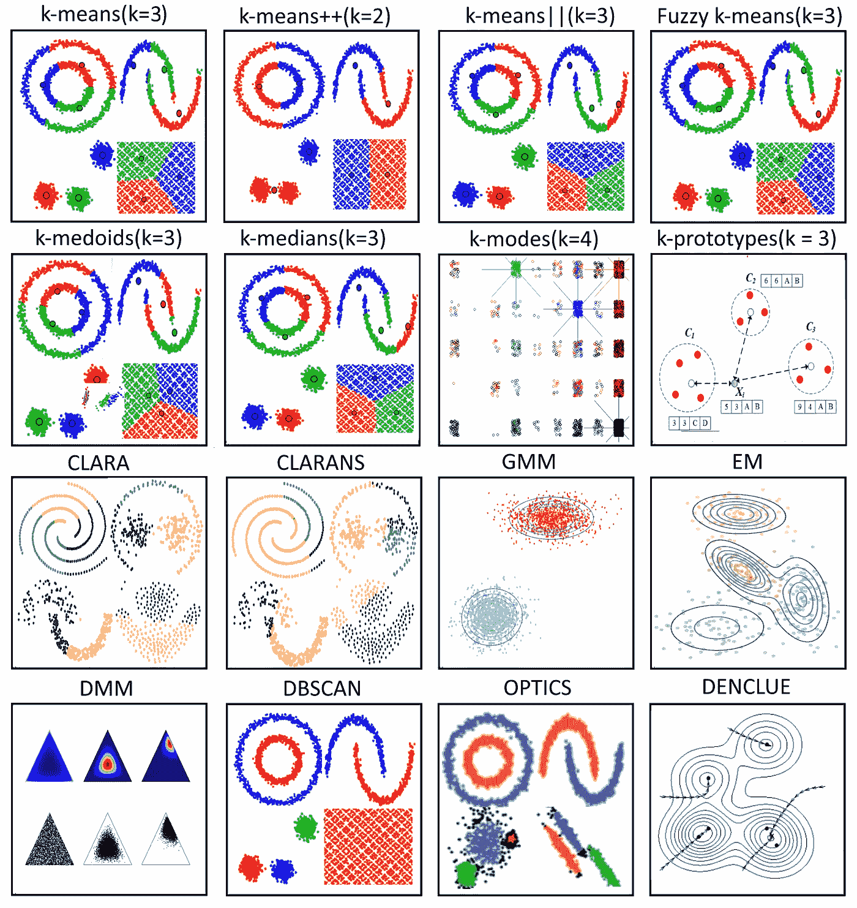

各种聚类算法。

> “要走得快，就一个人走；想走远，就一起走。”——非洲谚语。

> **快速提示:**如果您通过基于 chromium 的浏览器(例如，Google Chrome、Chromium、Brave)阅读本文，下面的目录就可以了。然而，像 Firefox 这样的其他浏览器就不一样了，在 Firefox 中，你需要点击每个链接两次才能到达指定的部分。尽情享受吧！
> 
> 一如既往，除非特别说明，所有文字和图像都是作者创作的。

```
**Table of Contents(TOC)**
**🄰.**[**Introduction**](#36be)
   ► [Machine learning](#94e3)
   ► [Cluster analysis](#c789)
   ► [Types of Clustering](#4cd4)
**🄱.**[**Clustering Algorithms**](#a176)
   ► [**Centroid-based clustering**](#7b7b)
    ** ➤** [k-means](#9136)
     ➤ [k-means++](#51f6)
     ➤ [k-means||](#9062)
     ➤ [Fuzzy C-means](#7e1d)
     ➤ [k-medoids, PAM](#a536)
     ➤ [k-Medians](#0133)
     ➤ [k-Modes](#eb7d)
     ➤ [k-prototypes](#87c6)
     ➤ [CLARA](#5190)
     ➤ [CLARANS](#a329)
   ► [**Distribution-based clustering**](#5c4a)
    ** ➤** [GMM](#8925)
     **➤** [EM](#ffbb)
     ➤ [DMM](#14a7)
   ►[**Density-based clustering**](#6178)
    ** ➤** [DBSCAN](#5588)
     ➤ [ADBSCAN](#b750)
     ➤ [DENCLUE](#eeb3)
     ➤ [OPTICS](#d22d)
**🄲.**[**Conclusion**](#9b71) **🄳.**[**Useful Resources**](#61ab)
```

## 🄰.介绍

随着信息变得越来越重要，全球各地的人们都可以获取信息，越来越多的数据科学和机器学习方法被开发出来。聚类分析模型乍看起来可能很简单，但理解如何处理大量数据是至关重要的。然而，在大量的聚类算法中做出合理的选择有时会令人望而生畏，并且需要对各种算法有相当多的了解。因此，本文汇编了 17 种聚类算法，以向读者提供关于其中大多数算法的大量信息。

**⇨机器学习**

机器学习是人工智能的一个子领域，其最简单而直接的定义是如何通过发现统计模式从数据(例如，从传感器、实验收集的数据……)中教会机器做出决策并自行完成任务(自动化数据驱动模型)。就这么简单。然而，困难来自于缩小的细节和应用。一切都是为了分析数据并从中学习。此外，机器学习在其核心部分为数据科学提供了基础，正如 Drew Conway ven 图所示。

从历史上来说，机器学习源于人工智能中的[连接主义者](https://plato.stanford.edu/entries/connectionism/)，其中一组个体想要复制具有相似特征的人脑机制。此外，它主要受益于心理学和其他领域(如统计学)的思想。).此外，统计学和机器学习是根本不同的领域，前者旨在为人类提供正确的工具来分析和理解数据。后者专注于自动化人类对数据分析的干预(AI [奇点](https://en.wikipedia.org/wiki/Technological_singularity))。

**⇨聚类分析**

聚类分析、聚类或数据分割可以定义为一种无监督(无标签数据)的机器学习技术，旨在发现模式(例如，许多子组、每个组的大小、共同特征、数据内聚性……)，同时收集数据样本，并使用预定义的距离度量(如欧几里德距离等)将它们分组到相似的记录中。共享相似特征的数据对象或观察结果被分组到一个由保存这些数据样本的距离(例如，椭圆的长轴)描述的聚类中。).

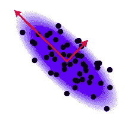

椭圆的轴。

聚类分析被各种应用广泛采用，例如图像处理、神经科学、经济学、网络通信、医学、推荐系统、客户细分等。此外，在处理新数据集以提取见解和了解数据分布时，可以将聚类视为第一步。聚类分析也可以用于执行维数减少(例如，PCA)。它还可以作为其他算法(如分类、预测和其他数据挖掘应用程序)的预处理或中间步骤。

**⇨聚类的类型**

有许多方法可以将聚类方法分成不同的类别。例如，基于重叠区域，存在两种类型的聚类:

**🄀** 硬聚类:聚类不重叠:k-means，k-means++。一个数据点只属于一个集群。它要么属于某个集群，要么不属于。

**⒈** 软聚类:聚类可以重叠:模糊 c 均值，EM。一个数据对象可以以一定的概率或隶属度存在于多个集群中。

此外，聚类算法可以根据它们试图达到的目的进行分类。因此，存在两种基于该标准的聚类技术:

**🄀** 单一:在聚类成员之间存在一些共同的属性(例如，25%的患者表现出疫苗 a 的副作用):数据根据单个特征生成的值进行划分。

**⒈** 多面体:聚类成员之间存在某种程度的相似性，但没有共同的属性(例如，相异度):数据根据所有特征生成的值进行划分。

基于所使用的聚类分析技术，每个聚类表示一个质心、代表数据样本中心的单个观察值和一个边界界限。下图显示了一些常见的聚类分析算法类别。

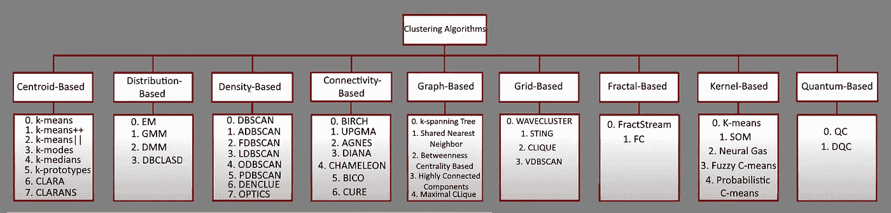

[聚类算法综述](https://link.springer.com/article/10.1007/s40745-015-0040-1)。

## **🄱.聚类算法。**

```
► [**Go To TOC**](#04f2)◀
```

## **⓪.基于质心的聚类。**

该方法的主要步骤之一是初始化聚类 k 的数量，这是一个在模型训练阶段保持不变的[超参数](https://en.wikipedia.org/wiki/Hyperparameter_(machine_learning))。

## **ⓐ.k-means** 或**劳埃德算法**

最流行的划分算法之一(在[谷歌学者](https://scholar.google.com/scholar?hl=en&as_sdt=0%2C5&q=k-means&btnG=)上有超过 100 万的引用)用于对数字数据属性进行聚类。使用这种多面体硬聚类技术，n 个数据对象被分成 k 个分区(k < < n)，其中每个分区代表一个聚类。每个群集必须至少包含一个数据点。此外，每个数据对象必须只属于一个组。此外，同一聚类的观察结果应该相似或相近。相反，不同组的对象必须相距很远或彼此不同。换句话说，k-means 算法的目标是最大化每对聚类中心之间的距离，最小化每个聚类内观测值之间的距离(例如，最小化一个聚类内的平方误差之和，SSE)。).

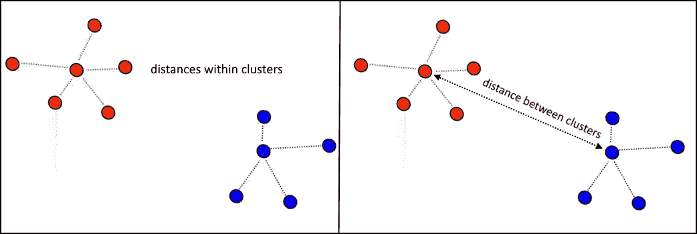

如果满足以下条件，k- means 聚类可以很好地工作:

**🄀** 各属性的分布方差呈球形。

**⒈** 集群是线性可分的。

**⒉** 星团具有相似数量的观测值(更接近大小。).

**⒊** 变量呈现相同的方差。

然而，如果其中一个假设被打破，并不一定意味着 k- means 将无法聚类观察结果，因为算法的唯一目的是最小化平方误差之和(SSE)。这里有一个很好的[讨论](https://stats.stackexchange.com/questions/133656/how-to-understand-the-drawbacks-of-k-means)说明，如果前面的假设之一不满足，k-means 会很好地工作。

为了更好地理解数据(例如，提取信息和查找聚类)，经验法则是在二维空间中绘制数据。例如，要找到虹膜数据集中有多少聚类，一个基本的相关矩阵就可以说明很多。

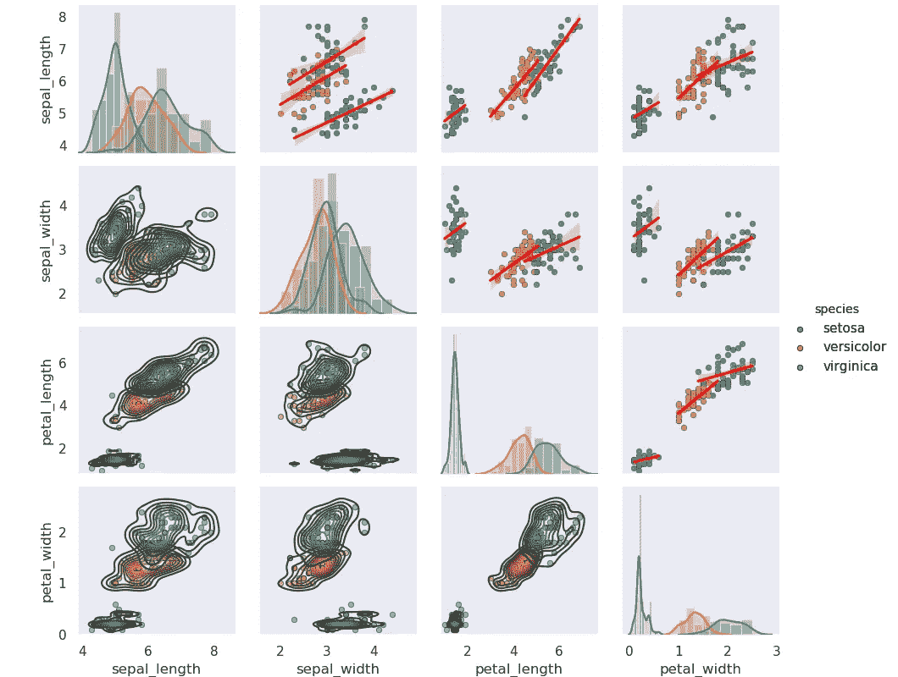

如图所示，该数据集中有三个主要的集群。因此，为了进一步的培训，k 应该等于 3。然而，这不是选择 k 值的最佳方法。

在实践中，标准方法是从肘方法开始，该算法针对不同的 k 值(例如，k= 1、2、3、4……)运行，并使用一种称为 WCSS(类内平方和)的稳健方法，该方法计算每个类成员与其质心之间的距离之和，以使其最小化，从而达到 k 的最佳值

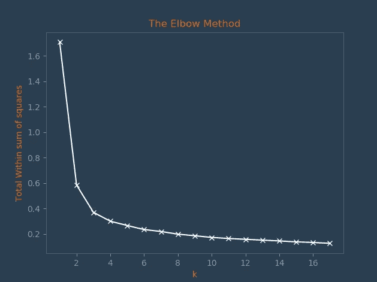

k 的最佳值是 3。

还有另一种通过计算每个聚类的轮廓系数来选择正确的 k 值的方法:相同聚类的点之间的平均距离。它根据数据对象的分类给出了数据对象相似程度的指标。为了说明这一点，在 iris 数据集上执行了侧影绘图，其中每个聚类都有一个侧影系数。

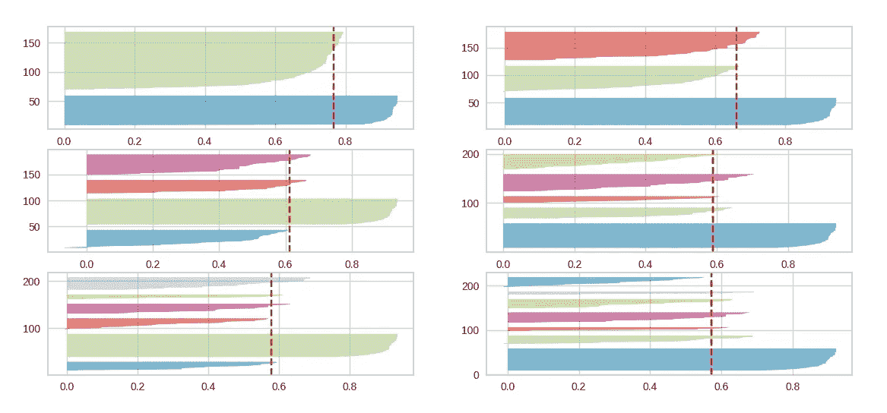

k = [2，3，…，7]的轮廓分数

使用这种方法，系数越接近 1，k 值就越适合模型。因此，k 的最佳值是 2 和 3，因为它们为每个聚类提供了比其他值更高的轮廓系数。

k 也可以使用 shoulder 方法初始化，该方法显示平方和百分比(BSS/TSS)与聚类数的关系图。

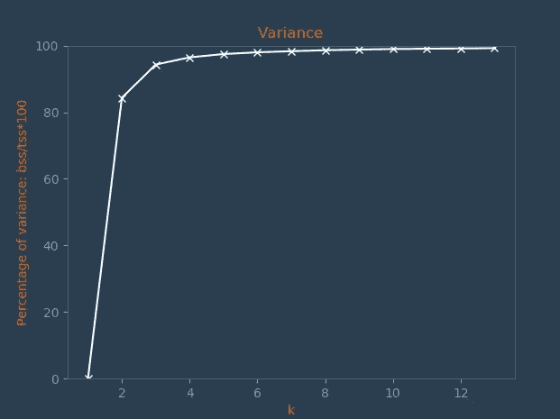

k 的最佳值是 3。

如图所示，最佳聚类数是一个肩(跃)开始形成的地方。因此，k 等于 3。

此外，还有很多其他方法可以用来估计 k 的最佳值，例如 [R 平方](https://www.investopedia.com/terms/r/r-squared.asp)度量。然而，剪影评分[已经被证明](https://www.sciencedirect.com/science/article/abs/pii/S003132031200338X)是找到 k 的最好方法

**⇨的解释。**

这一切都是从在特征空间中随机放置 k 个点开始的，其中每个点代表一个唯一聚类的质心。使用某个相异度度量，迭代计算数据集的每个观察值与每个聚类中心之间的距离。此外，将每个观察值分配给最近质心的聚类。之后，对于每个聚类，计算每个聚类的点的平均值(数字属性),并将质心重新分配给结果平均值。该过程将一直重复，直到满足预定的收敛条件(例如，达到最大迭代次数，意味着差异变得不变，BSS 变得低于给定的最小值，SSE 的最小值，最小化目标函数，失真…)

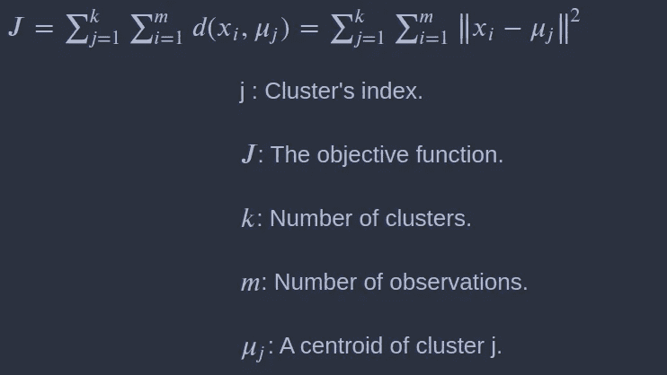

k 均值的目标函数。

**⇨算法。**

🄀从数据集中挑选 k 个随机质心。


**⒈** 使用适当的相异度度量(例如欧几里德距离)计算每个数据点 w.r.t 聚类的质心之间的距离。


**⒉** 根据计算的距离将每个数据点分配到最近的聚类。


**⒊** 通过计算数据点的平均值来重新定位质心。因此 k-means 只对数值数据有效！


**⒋** 重复⒈，直到聚类变得稳定或者目标函数 j 达到其最小值。

**⇨的优势。**

🄀的学习曲线相对陡峭。

**⒈** 被各种包广泛实现(r 中的 [Stats](https://stat.ethz.ch/R-manual/R-devel/library/stats/html/00Index.html) package，python 中的[scikit-learn](https://scikit-learn.org/)…)

**⒉** 聚类小数据集的快速收敛。

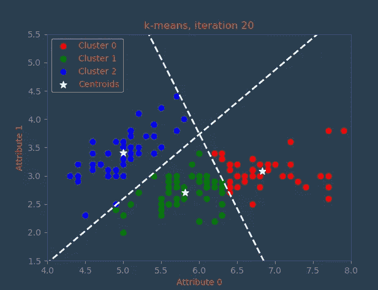

20 次迭代来聚类虹膜数据集。

**⒊** 容易实现。

**⇨无往不利。**

**🄀** 对于大型数据集，计算开销很大(k 变大。).

⒈:有时，很难为聚类数(k)选择一个初始值。

⒉不能保证收敛到全局最小值。它对质心的初始化很敏感。不同的设置可能导致不同的结果。

**⒊** 对异常值的强烈敏感性。


**⒋** 只对数值数据有效。

**⒌** 未能为一组具有非凸形状的点提供良好的聚类质量。

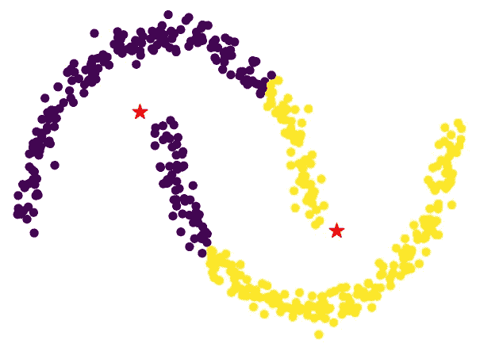

k-means 无法分离月亮形状的数据点。

然而，一些缺点可以通过使用肘方法来初始化聚类数，使用 k-means++来克服参数初始化中的敏感性，以及使用类似于[遗传算法](https://en.wikipedia.org/wiki/Genetic_algorithm)的技术来寻找全局最优解来解决。

⇨应用程序。

k-means 聚类被各种现实世界的企业所采用，例如搜索引擎(例如，文档聚类、相似文章聚类)、客户细分、垃圾邮件/ham 检测系统、学术表现、故障诊断系统、无线通信等等。

**⇨目标函数最小化。**

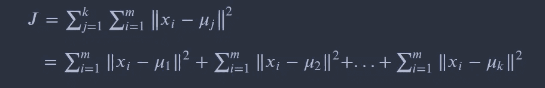

k 均值的代价函数。

为了找到 k 个集群的最优解，成本函数 **J** w.r.t **μ** 的导数必须等于零**。**


对于每个集群 J，前面的等式将导致:

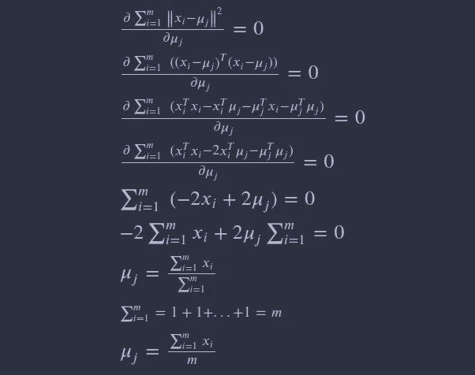

每个聚类质心的梯度 w.r.t 欧几里德距离。

每次迭代后，每个聚类的质心被更新为该聚类内所有数据点的经验平均值。

注意，最小化每个聚类内的欧几里德距离的问题被称为[韦伯问题](https://en.wikipedia.org/wiki/Weber_problem)。而且，从几何学上讲，*均值*并不是最优解。因此，需要复杂的几何中心，如中位数，medoid，以尽量减少欧几里德距离。

## **ⓑ k-means++**

```
► [**Go To TOC**](#04f2)◀
```

k-means++背后的思想是，它试图在每次迭代分配一个新中心的同时分散中心。因此，该算法从随机(统一)从数据集中选取一个初始中心开始，这意味着所有点被选中的概率相等。然后计算从每个数据点到先前选择的中心的距离平方。之后，它通过简单地将距离除以总距离来计算每个数据点的概率。此外，将新的聚类中心分配给具有最高概率或最高距离的点。换句话说，数据对象成为新聚类中心的可能性与距离的平方成正比。

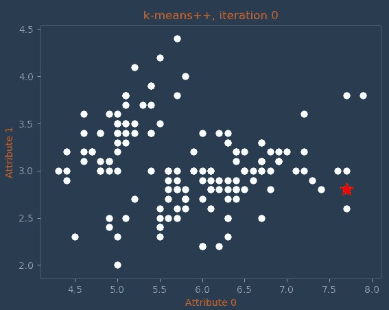

k_means++采样 k 个质心。

一旦分配了中心，k-means 算法将与这些聚类的中心一起运行，并且它将收敛得更快，因为质心已经被仔细选择并且彼此远离。

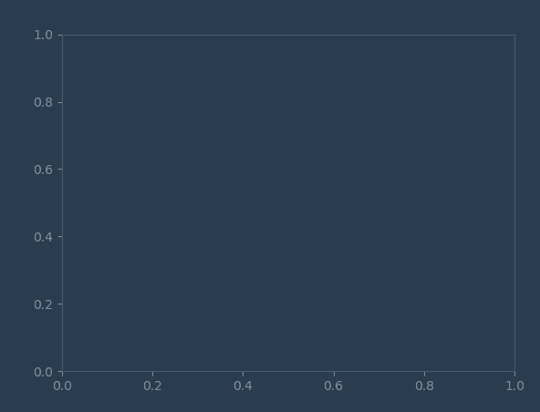

采样质心上的 k_means。大约 12 次迭代

**⇨算法**

**初始化步骤**

以均匀的方式独立地对每个质心进行采样，其概率与每个数据点到每个质心的距离的平方成比例。


**聚类步骤**

一旦 K 个质心被均匀采样，K-means 算法将使用这些质心运行。

**⇨的优势**

**🄀** 与 K-means 具有相同的优势。

**⒈** 比 K-means 收敛更快，迭代次数更少。

**⇨无往不利。**

与 K-means 有相同的缺点。

初始化步骤(为 K 选择一个初始值)可以被认为是 kmeans++的主要缺点之一，就像 K-means 算法的其他风格一样。但是，它比单独运行 K-means 更容易收敛，速度更快。此外，该算法仍然对异常值敏感，这些异常值可以使用 [LOF](https://en.wikipedia.org/wiki/Local_outlier_factor) 、[兰萨克](https://en.wikipedia.org/wiki/Random_sample_consensus#:~:text=Random%20sample%20consensus%20(RANSAC)%20is,the%20values%20of%20the%20estimates.)和其他方法来解决。

## **ⓒ K-means||，可伸缩** K **-means++**

```
► [**Go To TOC**](#04f2)◀
```

K-means 并行是另一种充分的技术，它在每次迭代后更新样本分布的频率较低。它在 k-means 算法中引入了一个过采样因子(L ~ k 阶，例如 k，k/2，…)。利用这个因素，对于更大的数据集，它将使算法收敛得更快。

**⇨** **算法。**

**初始化步骤**

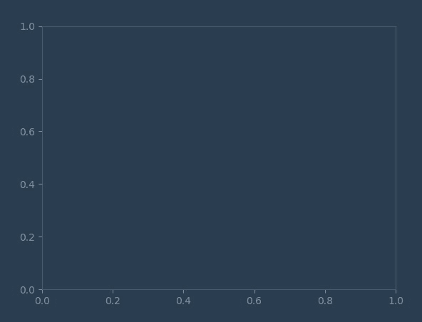

k-means||初始化步骤。

**🄀** 初始化过采样因子 l 的值

**⒈** 对于一定数量的迭代(0 ≤ nb_iter ≤ k)，以与每个数据点到每个质心的距离的平方成比例的概率(比 kmeans++算法中的概率大 l 倍)均匀随机采样 l 个质心。


> nb_iter = 0 **⇨** k 均值聚类。
> 
> nb_iter = k，而 L = 1 **⇨** k-means++聚类。

**聚类步骤**

一旦 K 个质心被均匀采样，K-means 算法将使用这些质心运行。

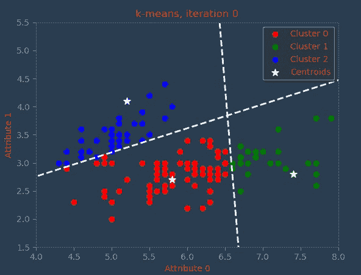

k _ means 次迭代收敛！

**⇨** **优点。**

🄀很适合大型数据集。运行时间~日志(k)

**⒈** 比 kmeans++快，因为它每次迭代采样 l 个质心。

**⇨**t30】无往不利。

**🄀** 它会导致基于 l 值的过采样或欠采样

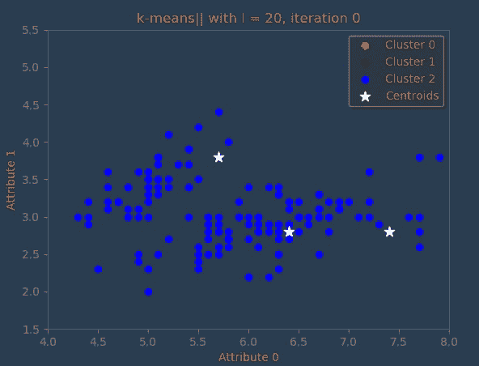

使用 k 均值进行过采样(L = 20) ~ 13 次迭代！

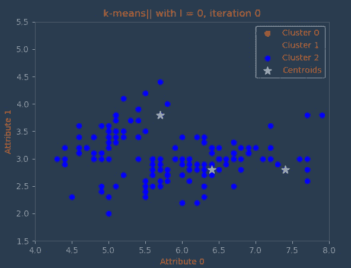

欠采样(L = 0) ~ 14 次 k 均值迭代！

## **ⓓ.模糊 C 均值:FCM**

```
► [**Go To TOC**](#04f2)◀
```

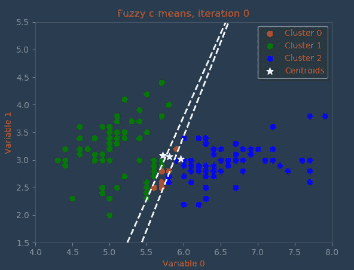

FCM。

术语[模糊](https://en.wikipedia.org/wiki/Fuzzy_logic)用于强调这样一个事实，即一个数据点可以存在于一个或多个聚类中，允许形成各种不同的聚类阴影(例如，不相交、非分离……)。例如，橙色是红色和黄色的混合，这意味着它在某种程度上属于每个颜色组。

隶属度函数用于测量数据点属于每个聚类的程度。它描述了一个数据点属于某个聚类的概率。

该算法旨在最小化以下成本函数:

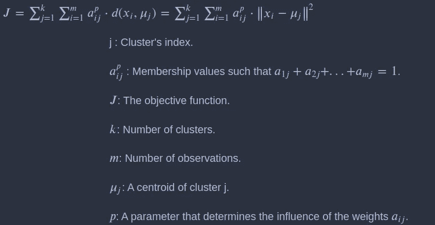

FCM 的目标函数。

**⇨算法**

**🄀** 基于预定义的权重 aij^p 和 p 的初始值选择 k 个初始模糊伪质心

**⒈** 使用模糊划分更新聚类中心。


**⒉** 使用以下公式更新权重。


⒊计算目标函数 j


**⒋** 重复 **⒈** 直到质心稳定或者满足以下标准:新计算的代价函数和旧的代价函数之差小于某个值。


FCM 的收敛条件。

模糊 k-means 提供了大量真实世界的用例，如图像分割、异常检测。与边缘和对象检测等其他图像处理技术相比，它的计算量较小。

**⇨的优势。**

**🄀** 与 k-means 相比，重叠数据的结果更好。

**⒈** 时间复杂度低。

**⒉** 收敛有保证。

**⇨无往不利。**

**🄀** 对 k 和 p 的初始值敏感

**⒈** 对异常值敏感。

**⇨目标函数最小化。**

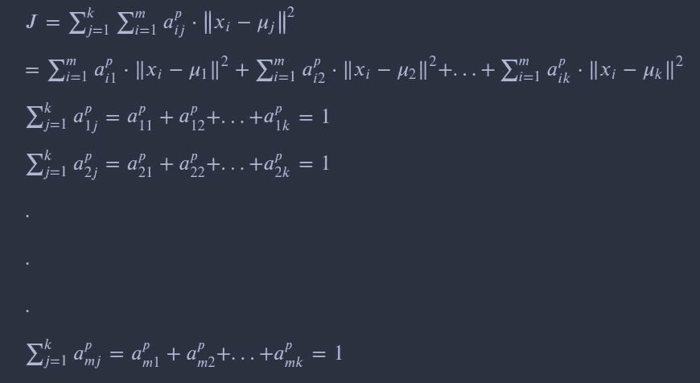

FCM 的成本函数。

为了找到 k 个集群的最优解，成本函数 **J** w.r.t **μ** 的导数必须等于零**。**


对于每个集群 J，前面的等式将导致:

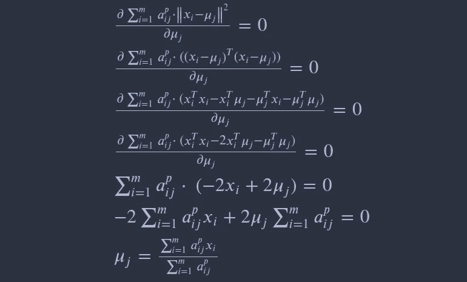

成本函数 w.r.t 形心 j 的梯度

已知对于数据集中的每个观察值，所有聚类的成员总数等于 1；因此，在每次迭代之后，每个聚类的质心被更新为其经验平均值。


每次迭代后，每个聚类的质心被更新为该聚类内所有数据点的平均值。

## **ⓔ.k-水母，PAM(水母周围的分区)**

```
► [**Go To TOC**](#04f2)◀
```

k-means 算法的修改版本，其中 medoid 表示一个数据点，该数据点在一个聚类内的所有点中具有最低的平均相异度。目的是最小化每个集群的总成本。与 k-means 不同，它使用一个 [medoid](https://en.wikipedia.org/wiki/Medoid) 作为度量来重新分配每个聚类的质心。水母对异常值不太敏感。这些中值线是来自数据集的实际观测值，而不是像 k-means 那样的计算点(平均值)。最好使用曼哈顿距离作为度量，因为它对异常值不太敏感。

**⇨**t32】算法。

**🄀** 随机选取 k 个观测值作为初始均值。

⒈计算观测值和流星体之间的距离。

**⒉** 将每个点分配到最近的中点。

**⒊** 在每个集群中选择一个新的观测值(非 medoid)并与相应的 medoid 交换。

**⒋** 计算每个簇内每个 medoid 和新数据点的交换成本。

**⒌** 选择具有最低成本(例如，最小相异度之和)的观察值作为新的 medoid。

**⒍** 重复步骤 **⒈** 直到满足收敛条件(例如，最小化成本函数、误差平方和(PAM 中的 SSE))。


k-medoids 代价函数。

**⇨的优势。**

**🄀** 在存在异常值的情况下比 k-means 更稳健(受异常值影响较小。)

⒈:这很容易实现。

**⒉** 它以固定的迭代次数收敛。

**⒊** 它可以有效地处理小数据集。

**⇨无往不利。**

**🄀** 它不适合大型数据集。

⒈的计算复杂度相当昂贵。

**⒉** 参数 k 需要初始化为某个值。

⒊不能保证收敛到全局最小值。它对质心的初始化很敏感。不同的设置导致不同的结果。

⒋只对数字数据有效。

为了提高 PAM 的效率，使用了 CLARA 算法。

## **ⓕ.k 线中位数**

```
► [**Go To TOC**](#04f2)◀
```

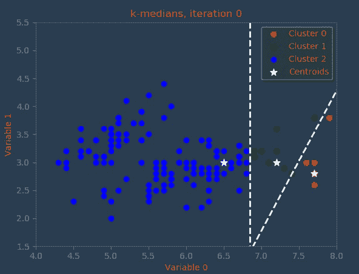

k 线中线。

k-means 算法的一个修改版本使用[中值](https://en.wikipedia.org/wiki/Median)，它代表其他观察值均匀分布在其周围的中间点。中位数对异常值的敏感度低于平均值。

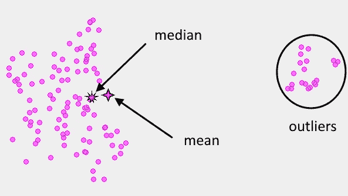

中位数对异常值的敏感度低于平均值。

此外，它使用曼哈顿距离作为计算观测值之间距离的度量。此外，该算法旨在最小化以下成本函数:


k-中位数代价函数。

**⇨算法。**

**🄀** 随机选取 k 个观测值作为初始中位数。

⒈计算观察值和中间值之间的距离。

**⒉** 将每个点分配到最近的中间值。

**⒊** 计算每个聚类的中值，并将其指定为该聚类的新质心

**⒋** 重复步骤 **⒈** 直到满足收敛条件(例如最小化类似 SSE 的成本函数)。

## **ⓕ.k 模式**

```
► [**Go To TOC**](#04f2)◀
```

由于 k-means 只处理数字数据属性，因此开发了一种改进的 K-means 算法来对分类数据进行聚类。[模式](https://en.wikipedia.org/wiki/Mode_(statistics))替换每个集群中的平均值。然而，有人可能会想到在分类属性和数字属性之间进行映射，然后使用 k-means 进行聚类。这有时可以在小维度数据集上工作。但是，两种不同类型的属性之间的映射不能保证高维数据的高质量聚类。因此，建议在对分类数据属性进行聚类时使用 k-modes。

k-modes 中使用的相异度度量之一是余弦相异度度量，这是一种基于频率的方法，用于计算两个观察值之间的距离(例如，两个句子或两个文档之间的距离)。

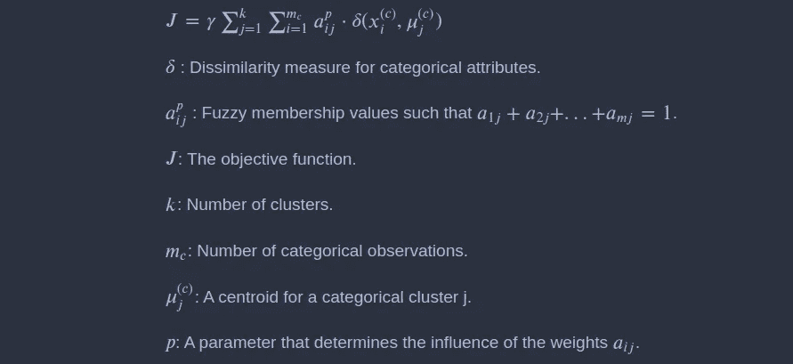

k 模式的成本函数。

**⇨算法。**

K-Modes 聚类过程由以下步骤组成:

**🄀** 随机选取 k 个观测值作为初始中心(模态)。

**⒈** 计算每个数据点和聚类中心(模式)之间的相异度


分类数据的相异度(如余弦…)

**⒉** 根据相异度(如余弦相异度函数)将每个观察值分配到最近的聚类中心。

**⒊** 根据每个集群中计算的模式值重新定位每个质心。

**⒋** 重复步骤 2，直到满足收敛条件(例如，最小化像 SSE 这样的成本函数)。

**⇨的优势。**

**🄀** 能够对分类数据属性进行聚类。

**⒈**it**t23】比 K-prototypes 收敛的更快。**

**⇨无往不利。**

**🄀** 对于大型数据集，计算开销很大(k 变大。).

**⒈** 有时，很难为聚类数(k)选择正确的初始值。

⒉不能保证收敛到全局最小值。它对质心的初始化很敏感。不同的设置可能导致不同的结果。

**⒊** 效率取决于算法使用的相异度(例如，斯皮尔曼相关、余弦距离……)。

**⒋** 额外的变量被添加到 algorithm(𝛾中，该变量控制从每个观测值到它们的聚类中心的距离的权重。

局部最优问题可以使用全局优化算法来解决，例如[布谷鸟搜索算法](https://en.wikipedia.org/wiki/Cuckoo_search)。

**⇨应用。**

k-modes 通常用于文本挖掘，如文档聚类、主题建模(其中每个聚类组代表一个给定的主题(相似的词…))、欺诈检测系统、营销(如客户细分。)、网页聚类等等。

## **ⓖ.k-原型**

```
► [**Go To TOC**](#04f2)◀
```

这种方法适用于数值和分类数据属性的混合。该算法可以被认为是 k-means 和 k-modes 算法之间的组合。

使用该算法，每个数据点都有一个权重，该权重是数字和分类聚类的一部分。此外，每种类型的观察可以以单独的方式处理，其中质心在每种类型的聚类中扮演吸引子的角色。可以使用模糊隶属函数 **aij** 来控制给定数据点的隶属度，就像在 FCM 中一样。

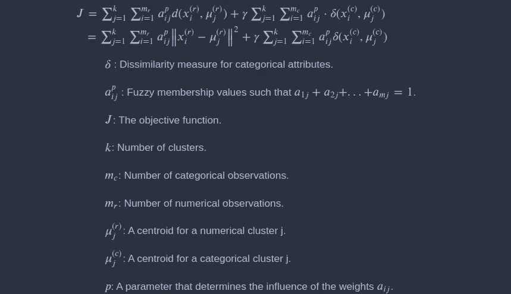

K 原型的成本函数

**𝛾** 用于平衡分类数据属性和数字数据属性之间的影响。

**⇨算法。**

K 原型聚类过程包括以下步骤:

**🄀** 随机选取 k 个代表作为 k 个聚类的初始原型。

**⒈** 计算距离(如欧几里德)和相异度(如余弦)。)在每个数据点和相应的聚类中心(原型)之间。


欧几里德距离和相异度。

**⒉** 根据距离公式将每个观察值分配给最近的集群原型。

**⒊** 根据以下公式重新定位每个聚类中心。

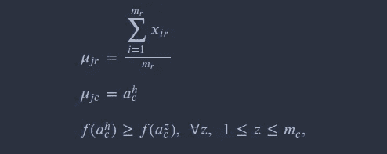

每种属性的聚类中心。

**⒋** 重复步骤 **⒈** 直到满足收敛条件(例如，成本函数的最小值)。

**⇨的优势**

**🄀** 能够聚类混合类型的属性。

⒈在合理的迭代次数内收敛。

**⇨无往不利。**

🄀不同的相异措施会导致不同的结果。

**⒈** 对 k 和𝛾.的初始值敏感

⒉不能保证收敛到全局最小值。它对水母的初始化很敏感。不同的设置可能导致不同的结果。

**⒊** 效率取决于算法使用的相异度(例如，斯皮尔曼相关、余弦距离……)。

**在聚类分类数据的情况下，⒋** 比 k-modes 慢。

## **ⓗ.CLARA(集群大型应用。)**

```
► [**Go To TOC**](#04f2)◀
```

它是一种基于样本的方法，随机选择数据点的一个小子集，而不是考虑整个观察值，这意味着它在大型数据集上工作得很好。此外，从先前选择的样本中选择 k 个 medoids。这将有助于提高 PAM 的可伸缩性(减少计算时间和内存分配问题)。它按顺序处理不同批次的数据集，以找到最佳结果。

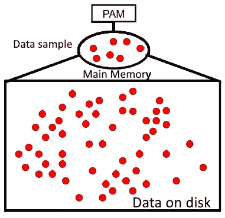

克拉拉

该算法的结果是具有最小成本的一组 medoids。

**⇨算法**

**🄀** 从固定大小(大小 s)的数据中随机选择多个子集。

**⒈** 在一个数据块上计算 k-medoid 算法，并选择相应的 k 个 medoid。

**⒉** 将原始数据集的每个观测值分配给最近的 medoid。

**⒊** 计算观测值与其最近的中值的差异的平均值。

**⒋** 保留均值最小的数据子集。

**⒌** 重复，直到找到最优的 medoids。

**⇨的优势。**

**🄀** 能够处理大型数据集。

**⒈** 在处理大型数据集时减少计算时间。

⒉处理异常值的能力。

**⇨无往不利。**

**🄀** 效率受到 k 值和样本大小的影响。

⒈聚类的质量取决于所使用的抽样方法的质量。

**⒉** 难以实现。

## ⓘ.基于随机搜索的大型应用集群。)

```
► [**Go To TOC**](#04f2)◀
```

它是 k-medoid 的扩展，用于数据挖掘中对大型数据集进行聚类。

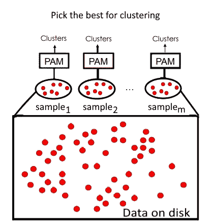

克拉伦斯

该算法的结果是具有最小成本的一组 medoids。

**⇨算法。**

**🄀** 从数据集中随机选择 k-medoids。

⒈ 从先前选择的观察和医疗器械中挑选一个。

**⒉** 计算两点和数据集中所有其他数据点之间的距离。

**⒊** 计算交换两个数据点的成本，选择成本最低的一个作为 medoid。

**⒋** 重复步骤 **⒈** 直到收敛(找到 k-medoids 的最优选择)。

**⇨的优势。**

在大型数据集上，🄀比帕姆和克拉拉更有效。

**⒈** 处理异常值的能力。

**⇨无往不利。**

**🄀** 难以实现。

**⒈** 聚类的质量取决于所用抽样方法的质量。

## ➀.基于模型/分布的聚类。

```
► [**Go To TOC**](#04f2)◀
```

**⇨概率建模。**

概率模型是由数据变量上的联合分布参数化的生成数据模型:P(x1，x2，…，xn，y1，y2，…，yn|θ)其中 X 是观察数据，y:潜在变量，θ是参数。

> P(y1，…，yn|x1，…，xn，θ) = P(x1，…，xn，y1，…，yn|θ)(联合)/ P(x1，…，xn|θ)(边际概率)

**学习。**

使用最大似然法执行学习阶段:

> θML = argmax θ P(x1，…，xn|θ)

目的是找到一个参数θ，使观测数据的概率最大化。

**预测。**

> P(xn+1，yn+1|x1，…，xn，θ)

目标是在给定观察数据集的情况下计算潜在属性的条件分布。

**分类:**

目标是找到一个类，在给定学习参数θ的情况下，使未来数据的概率最大化:

> argmax c P(xn+1|θc)

概率建模中使用的一些标准算法是 EM 算法、MCMC 采样、连接树等。

## **ⓐ.GMM:高斯混合模型**

在 2-d 变量空间中，高斯分布是使用具有正态分布的两个随机变量构建的二元正态分布，每个正态分布由其平均值和标准偏差参数化。

> 在我看来，高斯分布如此重要是因为它使计算(如线性代数计算。)毫不费力地做。然而，它并不是现实世界应用程序的完美模型。

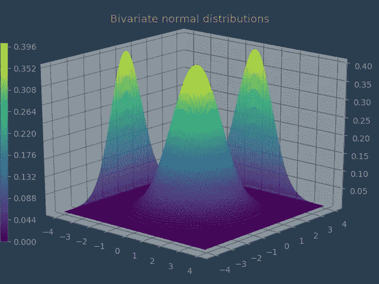

三维空间中的高斯及其投影。

高斯混合模型是半参数模型(随着数据增加的有限数量的参数。)用作软聚类算法，其中每个聚类对应于一个生成模型，该生成模型旨在发现给定聚类的概率分布参数(例如，均值、协方差、密度函数……)(它自己的概率分布控制每个聚类)。学习的过程是用高斯模型来拟合数据点。高斯混合模型假设聚类在 n 维空间中以正态分布分布。

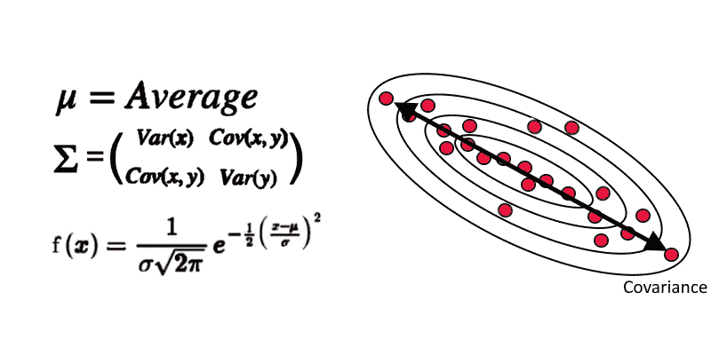

协方差矩阵和一维空间中的高斯公式。

为了说明一维空间中的混合模型，假设有两个正态分布的信息源，其中从每个信息源收集了 n 个样本。要估计每个高斯分布的平均值，取观察值的总和，并除以收集的样本数(经验平均值。)，同样用于估计其他参数。

当有 k 个高斯模型，并且没有给出关于观测值来自哪里的信息时，问题就出现了；不容易搞清楚怎么把点分成 k 簇。因此，估计每个高斯参数几乎是不可能的。然而，如果高斯参数(均值、方差)是预定义的，这个问题就可以解决。

这就是 EM 方法试图解决的问题。

## **ⓑ.EM:集群环境下的期望最大化。**

```
► [**Go To TOC**](#04f2)◀
```

这是一种众所周知的用于拟合混合分布的算法，旨在当一些数据点不可用时(例如，未知参数、潜在值等)，使用最大似然原理(寻找最优值)来估计给定分布的参数。在 GMM 的背景下，直觉是在空间中随机放置 k 个高斯模型，并计算每个数据点对某个高斯模型的隶属度。与硬聚类(例如，k-means)不同，该方法计算每个点成为某个聚类的成员的概率。此外，这些值用于重新估计聚类参数(例如，平均值、协方差)以拟合为每个聚类分配的点。

EM 广泛用于解决诸如“隐藏数据”问题、隐藏马尔可夫模型之类的问题，其中存在依赖于先前隐藏变量的状态的潜在变量序列。此外，每个观察值取决于相应隐藏变量的状态。

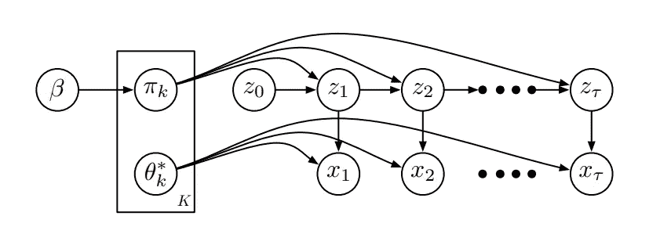

隐马尔可夫模型。

**πₖ** 是给定前一状态 k 的转移概率。箭头描述变量之间的相关性。

**算法。**

EM 算法包括两个步骤，期望步骤和最大化步骤。

**步骤-0:** 参数θs 的初始化。

**E 步骤:**在该步骤中，通过计算每个潜在数据点的归一化期望值 **Wij** (数据点在每个分布中的权重)来估计观察值来自哪个分布，假设给定聚类 J 的质心 **μj** 和协方差矩阵**σJ**当前假设成立:

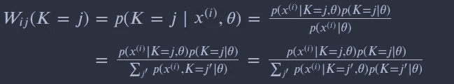

**P(xi|K=j，θ)** 是多元正态分布 **Xi~N(μi，σI)的条件概率。**

每个聚类具有可以基于训练数据集估计的概率 **𝜋(** 先于 **)** 。


**M 步:**使用前一步获得的信息，m 步将使用新的最大似然假设(假设每个隐藏变量的值为期望值)更新均值 **μj** 和协方差**σj**(或方差 **𝜎** )的估计值。


重复 E 和 M 步骤，直到对数似然函数收敛。


对数似然函数

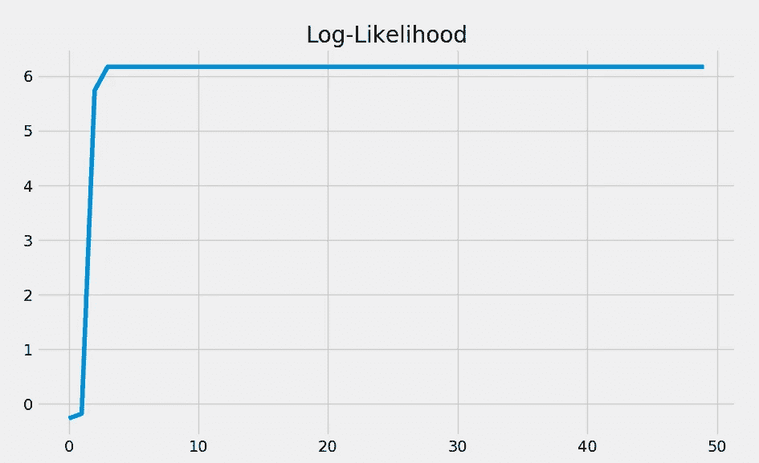

对数似然图。

利用每次迭代后似然性单调增加的事实，该算法更有可能收敛到最优。

为了演示 EM 算法，让我们考虑从三个高斯模型(a、b、c)生成的观察值。由于每个样本都是未标记的，所以目标是估计这三个高斯模型的参数，以将每个点标记为某个高斯分布。为了估计这些参数，将三个高斯模型随机放置在 1-d 数据集空间中。

**🄀** 计算从具有以下密度函数的三个高斯模型生成的每个数据点的可能性。


**⒈ E 步:**对于每个数据点，计算其权重 wi(ai，bi，ci)。

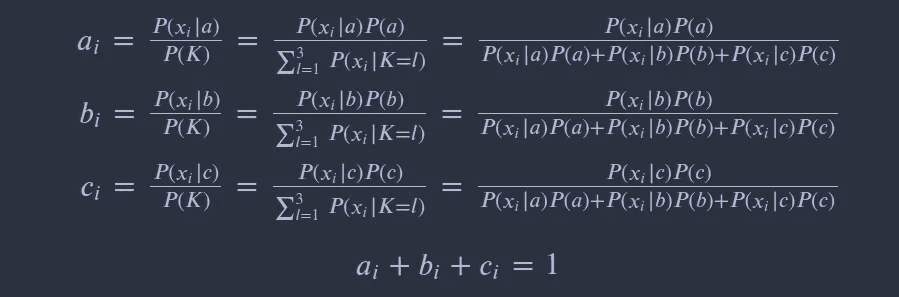

**⒉** **M 步:**此时，可以估计每个模型的均值和方差。

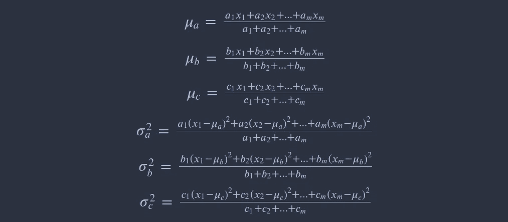

⒊估计概率。


**⒋** 重复 e 和 m 步骤，直到对数似然函数收敛。

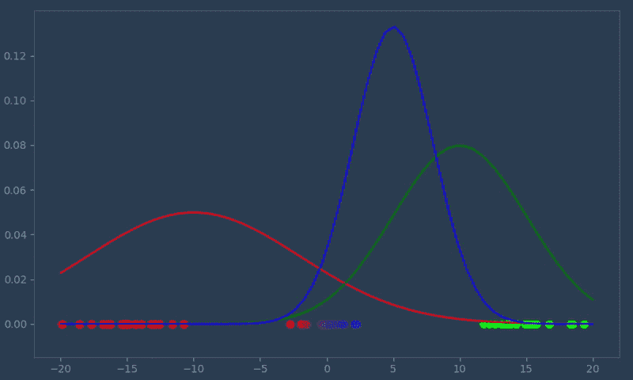

具有 3 个集群的 1d GMM。

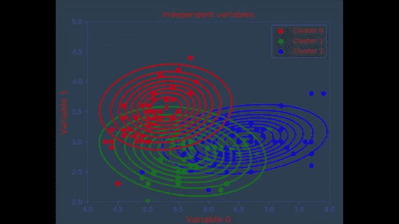

具有 3 个集群的 2d GMM。

**⇨优势。**

**🄀** 它产生混合分布参数的有效估计。

⒈实现起来非常简单。

**⇨无往不利。**

**🄀** 为 k(混合模型的数量)选择一个初始值，就像在 k-means 中一样。

**⒈** 对初始值敏感，从而导致不同的结果。

⒉:它可能会收敛到一个局部最优解。

⒊的收敛速度可能会很慢。

## ⓒ.狄利克雷混合模型。

```
► [**Go To TOC**](#04f2)◀
```

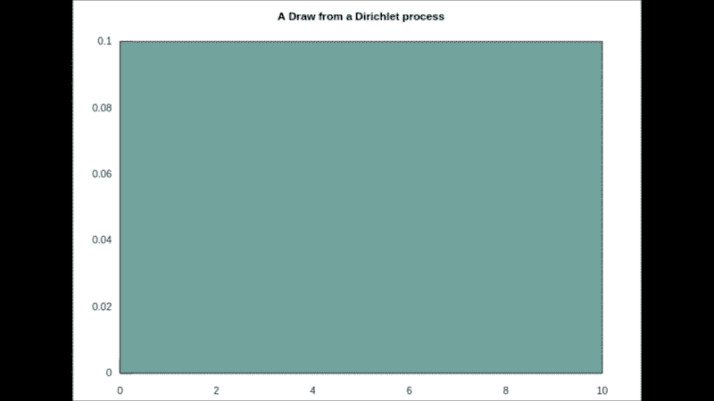

狄利克雷过程。

狄利克雷过程是一种随机过程，它在用于定义贝叶斯非参数(非固定参数集)的离散分布(概率度量)上产生分布。例如~无限数量的参数。)模特。狄利克雷分布是由浓度/精度参数/向量(α₁，…，αₖ)参数化的连续多元密度函数，具有正分量和基本分布 H: DP(α，h)。它类似于两个以上结果的 Beta 分布(如 Coinflip)。

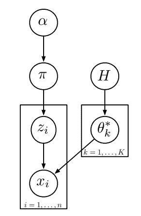

联合分布的图形模型。

k 维狄利克雷: **(π₁，π₂，…，πₖ) ~Dirichlet(α₁，α₂,…，αₖ)**

θ是独立的参数，并且在 H 上同分布，目标是在给定观测值 xi 的情况下推断参数θ和潜在变量。


**α > 1 的不同值的狄利克雷分布和样本。**

*   **α = (1，1，1)** ，该图代表均匀分布。
*   **α > (1，1，1)** ，该图代表单峰分布。
*   **0 < α < (1，1，1)** ，该图代表多峰分布。

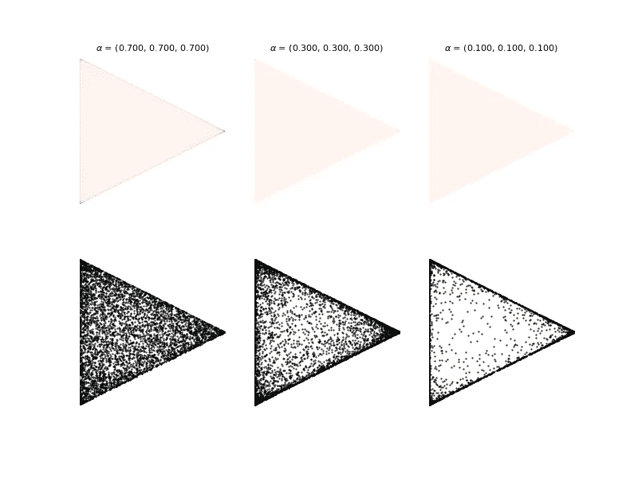

**α < 1 不同值的狄利克雷分布和样本。**

狄利克雷分布的一个很大的性质是，当合并两个不同的分量(πi，πj)时，会产生一个边际分布，这个边际分布是由参数(αi，αj)相加而参数化的狄利克雷分布。它类似于降维的思想。这种特性被称为塌陷。另一个性质是，可以证明具有伽马分布的随机变量遵循狄利克雷分布。

**π** 是经常用著名的断棒例子描述的概率。为了解释这些值，一根长度为一个单位的棍子被用来随机产生一个介于 0 和 1(棍子的最大长度)之间的数，在该数处棍子将被折断。一旦生成，木棒可以在长度 **π** 处断裂，该长度代表来自以 1 和α为参数的β分布的随机值:**π∾β(1，α)** 。通过折断这根棍子，它将生成一个概率质量函数(PMF)，其中两个结果的概率分别为 **π** 和**1π**。两根木棒可以类似地进一步折断，这样所有木棒的长度之和必须等于 1。并且该过程可以无限重复。

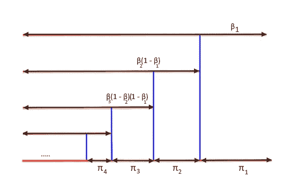

棍子折断的例子。

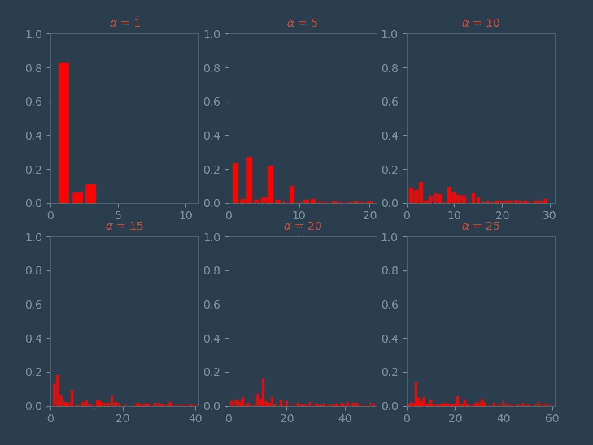

y 轴代表后验的期望混合权重( **πi** )。x 轴代表组件的数量。

狄利克雷分布经常在主题建模和 LDA(潜在{隐藏主题}狄利克雷{狄利克雷分布}分配)的上下文中解释。LDA 的工作原理是将许多文档聚类成包含相似单词的主题，而无需事先了解这些主题。LDA 通过从两个分布中采样来构建文档(按文档的主题分布，按主题的单词分布)。


联合分布的图形模型。

在 LDA 中，每个主题在单词上具有多项式分布(H)，每个文档从由 **α** 参数化的狄利克雷分布( **π** 中采样，并且每个单词(xi)从具有由 **π参数化的多项式分布的隐藏主题(Zi)中采样。**

通过对每个文档进行分类，LDA 倾向于通过最大化其概率来使每个文档有意义，如下所示:

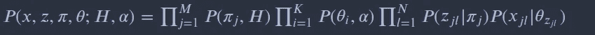

然而，最大化这个公式是相当昂贵的。因此[吉布斯采样](https://en.wikipedia.org/wiki/Gibbs_sampling#:~:text=In%20statistics%2C%20Gibbs%20sampling%20or,when%20direct%20sampling%20is%20difficult.)用于最大化方程的每个参数(单词:x，题目:z…)。

**⇨ LDA 算法。**

**🄀** 初始化话题数量 k

**⒈** 将每个文档中的每个单词随机分类到一个主题中。

**⒉** 对每个文档进行迭代，并计算以下概率:


⒊把每个单词重新归类到给定的主题中。

**⒋** 重复直到前一个公式达到最大值。


**⇨的优势。**

**🄀** 对于大型数据集非常高效和灵活。

**⒈** 算法的工作流程独立于其他任务。

**⇨无往不利。**

**🄀** 题目的数量 k 必须事先定义。

**⒈** 不相关的话题。

## ➁.基于密度的聚类。

```
► [**Go To TOC**](#04f2)◀
```

在基于密度的聚类中，数据空间中的密集区域与密度较低的区域是分开的。如果某个位置的密度大于预定义的阈值，则将观测值分配给给定的聚类。

对于一个集群中的给定观测，该点周围的局部密度必须超过某个阈值。局部密度由两个参数定义:包含围绕给定点的一定数量的邻居的圆的半径 **ε** 和围绕该半径的最小数量的点: **minPts** 。

**⇨定义。**

**🄀**t34】Eps-邻域:半径为 EPS 的圆对于给定点的面积。

**⒈Density 可达:**点 p 被描述为从点 q 相对于 Eps 和 MinPoints 可达的密度当且仅当存在一组点(p1，p2，…，pi，…，pn)使得 pi+1 从 pi 直接可达。

**⒉**

**⒊密度连通:**一个点 p 被描述为关于 Eps 和 MinPoints 连通到点 q 的密度当且仅当存在一个点 w 是从 p 和 q 可达的密度

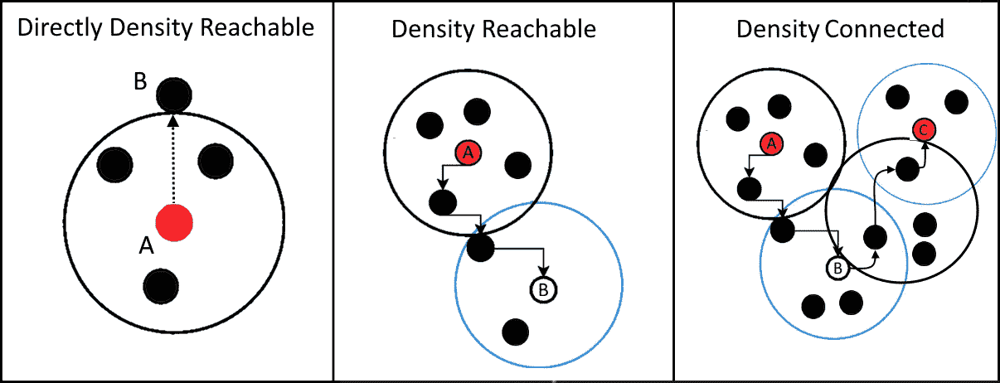

可达性类型。

**⇨的优势。**

**🄀** 不需要簇数 k

**⒈** 发现更复杂形状的星团(例如月亮形状的星团。).

**⒉** 离群点检测。

**⇨无往不利。**

**🄀** 对拓扑连接的对象进行分类在计算上是不可行的。

**⒈** 不像 K-means 那样保持可扩展性。

**⒉** 对 Eps、MinPts 敏感

**⒊** 密度测量受采样数据点的影响。

## **ⓐ.DBS can :D**en sity-**B**S**S**S**C**说明**A**A**N**oise 应用

```
► [**Go To TOC**](#04f2)◀
```

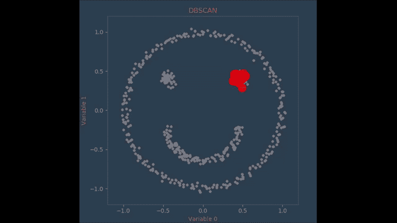

DBSCAN 发现 4 个集群。

这是迄今为止最流行的基于密度的聚类算法，在[谷歌学术](https://scholar.google.com/scholar?hl=en&as_sdt=0%2C5&q=DBSCAN&btnG=)上被引用超过 41k 次。中心思想是将观测结果分成 3 种类型的点组:

**🄀核心**点:在ε-邻域中有超过**个 minPts** 点。

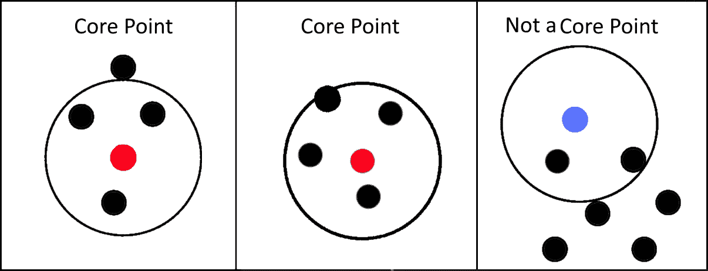

**minPts = 5**

**⒈边界**点:少于 **minPts** 在 **ε** 内但在一个核心点附近。

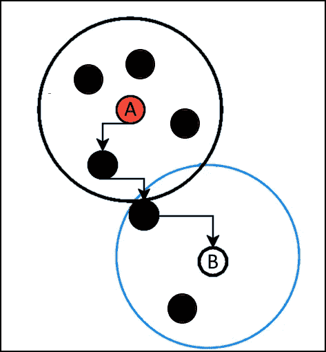

从核心点 a 可以到达点 B。

**⒉** **噪声**或**异常值**点:所有剩余的点:不是核心点，并且没有接近到足以从核心点到达。

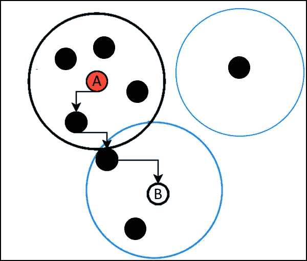

**⇨的解释。**

它从随机选择一个还没有被分配给一个簇的点开始。然后，该算法确定它是核心点还是离群点。一旦找到一个核心点，它的所有密度可达观测值将被添加到一个聚类中。之后，该算法将对每个可直接到达的点执行邻居跳转，并将它们添加到集群中。如果添加了异常值，它将被标记为边界点。然后，该算法选取另一个核心点，并重复前面的步骤，直到所有点都被分配到聚类或被标记为异常值。

**⇨算法。**

**🄀** 随机挑选一个点 p

**⒈** 找出由 p 给定 **eps** 和 **minPts** 密度可达的所有点。

**⒉** 检验 p 是否为核心点。一个集群将由至少一个核心点、可到达的核心点以及它们的所有边界构成。

**⒊** 重复前面的步骤，直到遍历完所有的点。

**⇨的优势。**

**🄀** 能够确定任意形状的星团。

**⒈** 对异常值不太敏感。

**⒉** 可以作为离群点检测。

⒊可以有效地处理任何规模的数据集。

**⇨无往不利。**

**🄀** 不适用于高维数据集。

**⒈** 取决于几个超参数。

**⒉** 发现密度变化的星团的问题。

**⒊** 只对数字数据有效。

⇨应用程序。

它广泛用于异常检测、科学文献和其他应用。

## **ⓑ.ADBSCAN: A** 自适应 **DBSCAN**

```
► [**Go To TOC**](#04f2)◀
```

顾名思义，该算法与之前的算法不同，它采用代表每个聚类密度分布的 **Eps** 和 **MinPts** 的值。它会自动找到合适的 Eps 和 MinPts 值。

它首先为 **Eps** 随机选择一个值。然后，它对数据集运行 DBSCAN，如果它未能找到一个集群，它会将 **Eps** 的值增加 0.5。当算法找到一个聚类(10%的相似数据)时，它会将该聚类从数据集中排除。并且，该算法不断增加 eps 的值以找到下一个聚类。一旦算法成功地扫描完大约 95%的数据，剩余的数据点将被声明为异常值。

但是，ADBSCAN 需要数据集中聚类数的初始值。有关更多信息，请考虑阅读[这篇文章](https://arxiv.org/pdf/1809.06189v3.pdf)。

## ⓒ.登线索:登基 CLU 圣 **E** 环

```
► [**Go To TOC**](#04f2)◀
```

DENCLUE 应用[核密度估计](https://en.wikipedia.org/wiki/Kernel_density_estimation)方法来估计产生数据样本的随机变量的未定义概率密度函数。该估计基于核密度函数(例如，高斯密度函数。)表示每个数据点的分布。然后，通过求和(或积分)来计算所有先前函数的核密度估计。

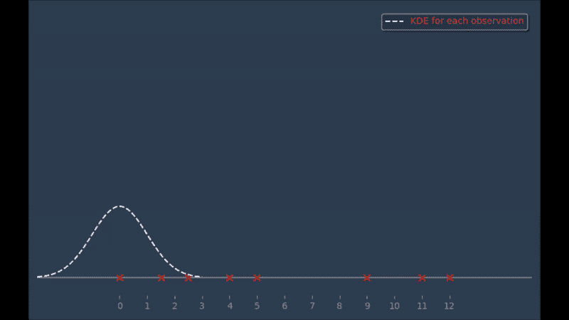

基于样本分布的核密度估计(KDE)。

核是一种数学函数，用于模拟数据点及其邻居之间的影响。此外，核密度函数具有以下特性:

**🄀** 非负性:K(x) ≥ 0

**⒈** 对称:K(x) = K(-x)

⒉内核下的面积必须等于一个单位。

**⒊** 递减:K'(x) ≤ 0

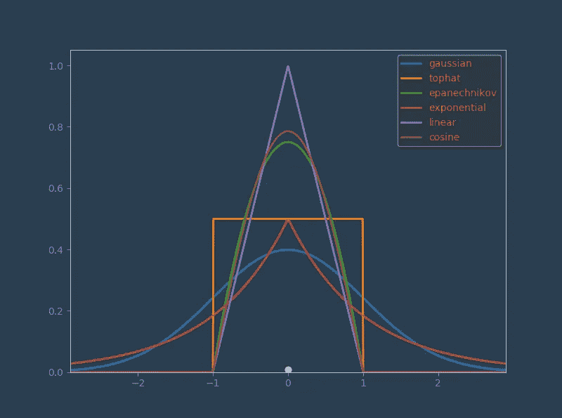

不同类型的一维核。

DENCLUE 使用了密度吸引子的概念，这些吸引子代表了周围形成集群的观察结果。

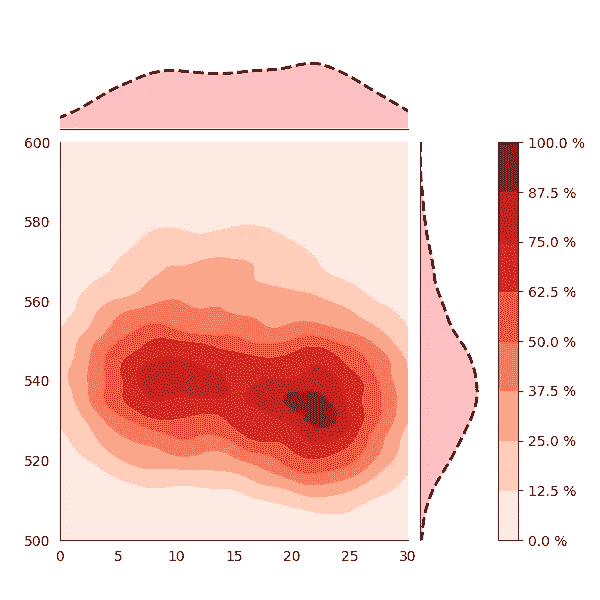

带有两个密度吸引子的二维内核示例。

有两种类型的集群:

**🄀** 中心定义簇:它是通过分配被吸引到给定密度吸引子的点的密度而形成的。

**⒈** 任意形状的簇:它由具有高密度的密度吸引子(>给定阈值)合并而成

**⇨算法。**

**🄀** 通过将所有数据点的密度函数相加来估计数据空间的整体核密度函数。

**⒈** 聚类通过识别构成估计密度函数的局部最大值的密度吸引子来形成。

**⒉** 使用带有估计密度函数梯度的[爬山](https://en.wikipedia.org/wiki/Hill_climbing)算法计算局部最大值。

**⇨的优势。**

**🄀** 明显比 DBSCAN 快。

**⒈** 灵活适用于任何任意形状的集群。

⒉可以有效地处理任何规模的数据集。

**⇨无往不利。**

**🄀** 不适合高维数据集。

**⒈** 取决于几个超参数。

**⒉** 只对数值数据有效。

## **ⓓ.光学:**排序点识别聚类结构。

```
► [**Go To TOC**](#04f2)◀
```

由于 DBSCAN 的性能取决于其参数设置，Optics 扩展了 DBSCAN，使其对参数设置不太敏感，并在簇之间查找结构。直觉上，基于两个参数，较高密度的区域将在较低密度的区域之前首先被处理:

**🄀核心距离:**包含至少 MinPts 个观测值的最小半径 eps。

**⒈可达距离:**使两个观测值密度可达的最小距离。

也就是说，光学根据观测值的密度结构形成有序的集群。此外，它使用所有点的可达性距离的计算值作为阈值，以分离数据和异常值(位于红线以上的点)。

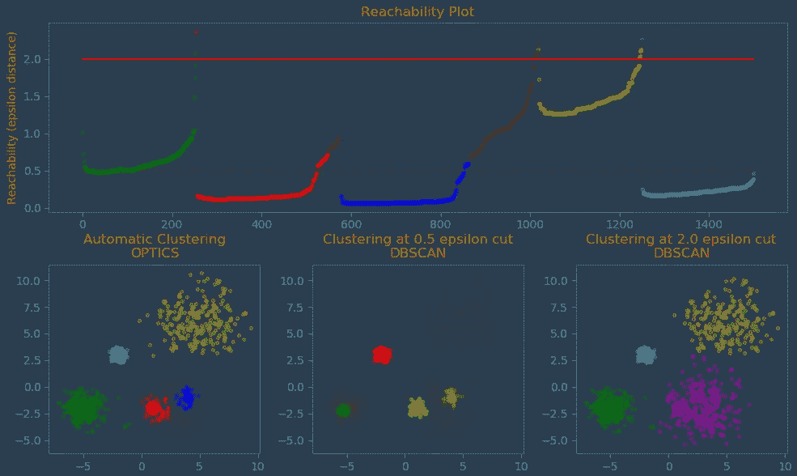

**⇨算法。**

**🄀** 从数据集中随机选取一个数据点。

**⒈** 通过计算 eps 邻域内的核心距离来确定所选点是否为核心点。

**⒉** 如果所选择的点是核心点，那么对于每一个其他的观察值，更新从先前选择的点的可达性距离。此外，将新的观察结果插入到 OrderSeeds 中，该 order seeds 包含按可达性距离排序的点。

**⒊** 如果所选点不是核心点，则移动到 OrderSeeds 中的下一个观察点，或者如果 OrderSeeds 为空，则移动到初始数据点中的下一个观察点。

**⒋** 重复，直到遍历完所有观测值。

**⇨的优势。**

**🄀** 能够发现内在的、分层嵌套的聚类结构。

**⒈** 需要与 DBSCAN 相同数量的参数(eps 和 **minPts** ),但不需要 eps，这降低了算法的运行时复杂性。

**⒉** 能够发现具有不同密度的星团。

**⇨无往不利。**

**🄀** 没有密度下降的集群的问题。

**⒈** 仍然对参数 **minPts** 敏感。

**⇨应用。**

光学可用于异常检测(发现异常值)。

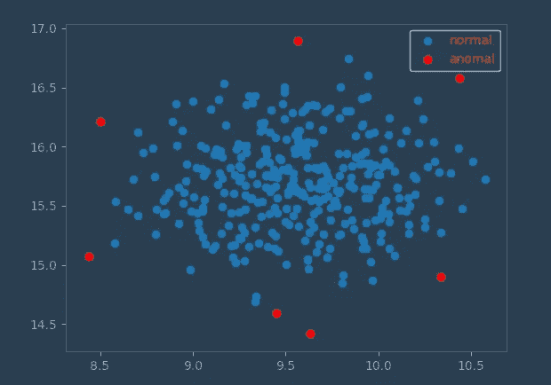

异常检测。

## 🄲.**结论**

```
► [**Go To TOC**](#04f2)◀
```

通过本文，您已经了解了如何使用聚类分析作为一种强大的技术来发现模式并从数据中提取洞察力。然而，决定是否选择给定的聚类算法取决于几个标准，例如聚类应用的目标(例如，主题建模、推荐系统……)、数据类型等。此外，数据挖掘团队有责任决定选择最适合他们需要的方法。

哇呜！你已经到了今天博客的结尾，这有点让人不知所措，不骗你。然而，你可以通过粉碎👏按钮，直到你感到宽慰😌。

我希望你喜欢这篇花了我很长时间(大约一个月)让它尽可能简洁明了的文章。我将感谢您的支持，请关注我，关注即将到来的工作和/或分享这篇文章，以便其他人可以找到它。

正如你可以从插图中看出的，我已经设法实现并可视化了大多数算法。当它完成后，我将在 GitHub 上发布第一个版本。

和往常一样，你可以引用这篇文章中的任何插图和其他信息:

> Mahmoud Harmouch，17 数据科学和挖掘中使用的聚类算法，走向数据科学，2021 年 4 月 23 日。

如果你有任何需要传授的智慧之言，我很高兴在评论区看到你的想法。

如果您在这篇文章中遇到了任何误传或错误，为了改进内容，请不要忘记提及它们。

下一篇文章再见。

Peace✌️

## 🄳.有用的资源

```
► [**Go To TOC**](#04f2)◀
```

**ⓐ.k-means**

**【0】**笔记本: [05.11-K-Means.ipynb](https://colab.research.google.com/github/jakevdp/PythonDataScienceHandbook/blob/master/notebooks/05.11-K-Means.ipynb#scrollTo=hIA9Xj4ds_KV)

**【1】**钱丹·k·雷迪，巴努基兰·温扎莫里；[分区和层次聚类算法综述](https://dmkd.cs.vt.edu/papers/kmeans13.pdf)

**【2】**jeffp； [L10: k 均值聚类](https://www.cs.utah.edu/~jeffp/teaching/cs5955/L10-kmeans.pdf)

**【3】**克里斯皮赫；[K 表示](https://stanford.edu/~cpiech/cs221/handouts/kmeans.html)

**ⓑ.k-means++**

**【0】**大卫·亚瑟，谢尔盖·瓦西里耶维奇； [k-means++:小心播种的好处。](http://ilpubs.stanford.edu:8090/778/1/2006-13.pdf)

**ⓒ.k-means||**

**【0】**巴赫曼·巴赫马尼、本杰明·莫塞利、安德烈·瓦塔尼、拉维·库马尔、谢尔盖·瓦西里维茨基；[可扩展 K-Means++](https://theory.stanford.edu/~sergei/papers/vldb12-kmpar.pdf)

**ⓓ.FCM**

马杜库马尔，桑提亚库马里，N..(2015).[脑部 MR 图像 k 均值和模糊 C 均值分割的评价。埃及放射学和核医学杂志。1.2015 年 2 月 10 日](https://www.researchgate.net/publication/274096080_Evaluation_of_k-Means_and_fuzzy_C-Means_segmentation_of_MR_images_of_brain)

**ⓔ.k-medoids**

**【0】**维基百科关于 K-medoids 的文章:【https://en.wikipedia.org/wiki/K-medoids】T42

**【1】**Tri Nguyen 的 K-medoids 实现:[https://towardsdatascience . com/K-me doids-clustering-on-iris-data-set-1931 BF 781 e 05](https://laptrinhx.com/link/?l=https%3A%2F%2Ftowardsdatascience.com%2Fk-medoids-clustering-on-iris-data-set-1931bf781e05)

**【2】**Github 库的 scikit learn _ extra:[https://Github . com/scikit-learn-contrib/scikit-learn-extra/tree/master/sk learn _ extra/cluster](https://laptrinhx.com/link/?l=https%3A%2F%2Fgithub.com%2Fscikit-learn-contrib%2Fscikit-learn-extra%2Ftree%2Fmaster%2Fsklearn_extra%2Fcluster)

**ⓕ.k 线中线**

**【0】**桑乔伊·达斯古普塔、纳韦·弗罗斯特、米哈尔·莫什科维茨、赛勒斯·拉什奇安；[可解释的 k-均值和 k-中位数聚类](https://arxiv.org/abs/2002.12538)

**【1】**大卫·多汉、斯特凡尼·卡普、布莱恩·马泰杰克；k-中值算法:[理论实践](https://www.cs.princeton.edu/courses/archive/fall14/cos521/projects/kmedian.pdf)

**【2】**李，金华&宋，史记&张，郁莉&周，甄。(2016).[针对不完整数据的鲁棒 K-中值和 K-均值聚类算法。](https://www.researchgate.net/publication/311423522_Robust_K-Median_and_K-Means_Clustering_Algorithms_for_Incomplete_Data)工程中的数学问题。2016.1–8.10.1155/2016/4321928.

**ⓖ.k 模式**

**【0】**曾永贺。[K-模式聚类的近似算法](https://arxiv.org/pdf/cs/0603120.pdf)

米盖尔·Á。魏冉·王·卡雷拉-佩皮尼昂。[聚类的 K-modes 算法](https://arxiv.org/abs/1304.6478)

**【2】**黄哲雪。[k-Means 算法的扩展，用于聚类具有分类值的大型数据集](https://citeseerx.ist.psu.edu/viewdoc/download?doi=10.1.1.15.4028&rep=rep1&type=pdf)

**【3】**夏尔马，n .和 n .高德。[分类数据的 K-modes 聚类算法。](https://www.semanticscholar.org/paper/K-modes-Clustering-Algorithm-for-Categorical-Data-Sharma-Gaud/289a15c11b28347665baea1261bd530a804bca4d)*国际计算机应用杂志*127(2015):1–6。

**ⓗ.****k-原型**

【0】【贾】、。(2020).[基于混合相异系数的加权 k 原型聚类算法](https://doi.org/10.1155/2020/5143797)。工程中的数学问题。欣达维。

**【1】**黄哲雪。(1998).[对 k-Means 算法的扩展，用于聚类具有分类值的大型数据集](https://citeseerx.ist.psu.edu/viewdoc/download?doi=10.1.1.15.4028&rep=rep1&type=pdf)。数学和信息科学，邮政信箱 664 号，堪培拉，法案 2601，澳大利亚。

**【2】**黄，哲人。"[对具有混合数值和分类值的大型数据集进行聚类。](https://www.semanticscholar.org/paper/CLUSTERING-LARGE-DATA-SETS-WITH-MIXED-NUMERIC-AND-Huang/d42bb5ad2d03be6d8fefa63d25d02c0711d19728)(1997)。

**【3】**Byoungwook Kim。(2017).使用部分距离计算的快速 K 原型算法。

**ⓘ.克拉拉和克拉拉恩斯**

**【0】**Erich Schubert，Peter J. Rousseeuw:更快的 k-Medoids 聚类:改进 PAM、CLARA 和 CLARANS 算法。相似性搜索及其应用。SISAP 2019:171–187[https://doi.org/](https://doi.org/)10.1007/978–3–030–32047–8 _ 16

**【1】**Ng、Raymond &韩、佳伟。(2002). [CLARANS:一种用于空间数据挖掘的对象聚类方法](https://www.researchgate.net/publication/3297085_CLARANS_A_method_for_clustering_objects_for_spatial_data_mining)。知识与数据工程。14.1003- 1016.10.1109/TKDE.2002

**【2】**维贾亚·萨格维卡尔，维迪亚·萨格维卡尔，卡尔帕娜·德鲁克卡尔。(2013).[CLARANS 的性能评估:一种用于
空间数据挖掘](https://www.longdom.org/articles/performance-assessment-of-clarans-a-method-for-clustering-objects-for-spatial-data-mining.pdf)的对象聚类方法。《普通高等教育发展条约》，第 2 卷第 6 期:第 1-8 页

ⓙ GMM。

**【0】**雷诺德(2009)高斯混合模型。载于:李世泽，贾恩(编)《生物识别百科全书》。马萨诸塞州波士顿斯普林格。[https://doi.org/10.1007/978-0-387-73003-5_196](https://doi.org/10.1007/978-0-387-73003-5_196)

**【1】**笔记本: [1 高斯混合模型](http://ethen8181.github.io/machine-learning/clustering/GMM/GMM.html#Gaussian-Mixture-Model)

**【2】**笔记本:[习题——1D 高斯混合模型与期望最大化](https://gitlab.com/deep.TEACHING/educational-materials/blob/master/notebooks/graphical-models/directed/exercise-1d-gmm-em.ipynb)

**ⓚ.数字万用表**

**【0】**博客:[狄利克雷过程高斯混合模型在各种 ppl 中的破棒构造](https://luiarthur.github.io/TuringBnpBenchmarks/dpsbgmm)

**【1】**幻灯片:[狄利克雷过程混合模型的记忆化在线变分推断](https://www.slideserve.com/prescott-ellison/memoized-online-variational-inference-for-dirichlet-process-mixture-models)

**【2】**博客:[用 Matplotlib 可视化狄利克雷分布](http://blog.bogatron.net/blog/2014/02/02/visualizing-dirichlet-distributions/)

**【3】**博客:Ritchie Vink，[用 Edward 和 Pymc3 中的 Dirichlet 混合对数据进行聚类](https://www.ritchievink.com/blog/2018/06/05/clustering-data-with-dirichlet-mixtures-in-edward-and-pymc3/)。

**ⓛ.数据库扫描**

迈克尔·哈斯勒，马修·皮肯布洛克，德里克·多兰。 [dbscan:基于密度的快速 R 聚类](https://cran.r-project.org/web/packages/dbscan/vignettes/dbscan.pdf)

埃里希·舒伯特、约格·桑德、马丁·伊斯特、汉斯-彼得·克里格尔和徐小薇。2017.DBSCAN 重温，重温:为什么和如何你应该(仍然)使用 DBSCAN。ACM Trans 数据库系统。42、3、第十九条(2017 年 7 月)，21 页。[https://doi.org/10.1145/3068335](https://doi.org/10.1145/3068335)

**ⓜ.** **DENCLUE**

欣内堡，a .和 h .加布里埃尔。"基于核密度估计的快速聚类."国际开发协会(IDA)(2007)。

ⓝ.光学

**【0】**安克斯特，米哈尔&布留尼格，马库斯&克里格尔，汉斯-彼得&桑德，约尔格。(1999).[光学:对点进行排序，以识别聚类结构。](https://www.researchgate.net/publication/221214752_OPTICS_Ordering_Points_to_Identify_the_Clustering_Structure)西格蒙德记录。28.49–60.10.1145/304182.304187.

**幻灯片:[光学排序点识别聚类结构](https://www.slideshare.net/rpiryani/optics-ordering-points-to-identify-the-clustering-structure)**