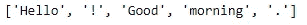

# 17 每个数据科学家都必须知道代码块

> 原文：<https://towardsdatascience.com/17-must-know-code-blocks-for-every-data-scientist-c39a607a844d?source=collection_archive---------7----------------------->

## 讨论将帮助您作为数据科学家有效处理大多数任务和项目的 17 个代码块


由 [Pakata Goh](https://unsplash.com/@pakata?utm_source=medium&utm_medium=referral) 在 [Unsplash](https://unsplash.com?utm_source=medium&utm_medium=referral) 上拍摄的照片

Python 提供了一些简单而通用的代码，可以在最少的代码块中实现复杂的问题。虽然其他编程语言有更复杂的注释来解决特定的任务，但 Python 在大多数时候提供了更简单的解决方案。每个数据科学家都必须知道某些代码块，才能开始他们的数据科学和机器学习之旅。

重要的是要记住，一些代码行或特定的代码块总是可重用的，它们可以在多个程序中使用。因此，每个级别的程序员，包括初学者、中级程序员、高级或专家，都必须养成记住有用代码的习惯，以获得更快的解决方案。

在本文中，我们的主要目标是涵盖数据科学家经常使用的一些代码块，无论他们目前正在从事什么类型的项目、问题或任务。本文中展示的 17 个代码块在大多数任务中提供了很好的可重用性，只需很少或不需要修改。

虽然本文最初的重点和目标读者是初学数据的科学家，但其他从以前的编程语言转向 Python 的中级和高级数据科学爱好者会发现本文很有用。所以，事不宜迟，让我们开始探索这些代码块。

# 1.条件语句和迭代语句

```
def even(a):
    new_list = []
    for i in a:
        if i%2 == 0:
            new_list.append(i)
    return(new_list)

a = [1,2,3,4,5]
even(a)
```

条件语句和迭代语句是欢迎大多数用户使用他们的编程语言的代码。尽管这些元素是编码的最基本方面，但它们在机器学习和深度学习的数据科学相关任务中有着广泛的用途。没有这些代码块，几乎不可能执行最复杂的任务。

上面的代码块是一个简单的函数示例，它同时使用了条件 if 语句和 for 循环。for 循环遍历所有元素，if 语句检查偶数。虽然这个代码块只是一个简单的例子，但是用户必须记住其他几个实用程序选项。

# 2.列表

```
lst = ['one', 'two', 'three', 'four']
lst.append('five')
lst
```

列表是数据结构最重要的方面。大多数数据结构是以某种方式组织的不同数据元素的集合。列表有一些属性，使得它们可以用于开发人员处理的几乎每个项目或复杂任务中。列表的可变性允许它们根据特定的用例进行更改或修改。

对于任何程序，您都需要一个列表来存储一些与您正在执行的特定任务相关的信息或数据。为了在列表中存储额外的元素，您通常会在 for 循环旁边使用 append 语句来迭代特定的命令并相应地存储元素。要了解所有的概念和主列表，请查看下面提供的文章。

</mastering-python-lists-for-programming-5423b011d937>  

# 3.字典

```
# Dictionary with integer keys
my_dict = {1: 'A', 2: 'B'}
print(my_dict)

# Dictionary with string keys
my_dict = {'name': 'X', 'age': 10}
print(my_dict)

# Dictionary with mixed keys
my_dict = {'name': 'X', 1: ['A', 'B']}
print(my_dict)
```

我们要看的另一个重要的数据结构是字典。这种数据结构在大多数程序中也很有用。字典包含无序元素的集合。在这些字典的帮助下，您可以存储一个可以保存许多值的关键变量。当调用特定的键时，我们也可以访问它们各自的值。

字典很容易在任何程序中创建和存储。对于需要存储一对元素的各种任务，开发人员更喜欢这些数据结构。它们存储一对元素，即一个键和值。要了解更多关于字典的知识，请阅读下面这篇文章，它详细介绍了大部分方面。

</mastering-dictionaries-and-sets-in-python-6e30b0e2011f>  

# 4.中断并继续

```
a = [1,2,3,4,5]for i in a:
    if i%2 == 0:
        breakfor j in a:
    if j%2 == 0:
        continue
```

中断和继续操作是开发人员和程序员在计算任何与数据科学相关的复杂任务时必须牢记的两个最有用的组件。这些语句有助于终止循环或条件语句，或者通过跳过不必要的元素来继续操作。

上面显示的代码块是可以用这两条语句执行的大量任务的简单表示。如果遇到特定的变量或条件，并且想要结束循环，break 语句是该任务的正确选择。尽管输入了特定的条件或变量，但是如果您只想跳过特定的元素而继续整个操作，那么 continue 语句是您的最佳选择。

# 5.希腊字母的第 11 个

```
f = lambda x:x**2
f(5)
```

虽然普通函数使用 def 关键字，但它们更适合较大的代码块。然而，如果你想以最有效的时间和空间复杂度得到快速有效的结果，开发者必须考虑使用 lambda 函数。

lambda 函数计算一个值，并立即在一行代码中返回结果或输出解决方案。因此，每个开发人员都必须考虑使用 lambda 函数操作来简化代码，并相对容易和高效地执行适当的任务。

# 6.过滤器

```
a = [1, 2, 3, 4, 5]
even = list(filter(lambda x: (x%2 == 0), a))
print(even)
```

过滤条件用于简化大多数操作，在这些操作中，我们将删除所有不必要的元素，只保留最基本的、适合任务的必需元素。这个函数的有效性是因为任何复杂的任务都可以在一行或几行代码中解决。

在每个人都必须记住的第一个代码块中，我们讨论了一个打印所有偶数的例子。我们注意到我们使用了条件语句和迭代循环来处理下面的任务。然而，在上面的代码块中，我们可以执行同样的任务，在一行代码中只打印元素列表的偶数。

# 7.地图

```
a = [1, 2, 3, 4, 5]
squares = list(map(lambda x: x ** 2, a))
print(squares)
```

map 是另一个独特的函数，它考虑给定数据结构中的所有基本元素，并相应地遍历它们。当为此操作提供参数时，它为提到的每个元素执行特定的操作。

map 函数可以总结为 Python 中的一个内置函数，它允许您处理和转换 iterable 中的所有项，而无需使用显式的 for 循环。上述代码块执行遍历所提供的列表并相应地生成所提供的每个元素的正方形的操作。

# 8.减少

```
from functools import reduce

a = [1, 2, 3, 4, 5]
product = reduce(lambda x, y: x*y, a)
print(product)
```

与前两个函数(即 filter()和 map())不同，reduce 函数的工作方式略有不同。它遍历可迭代数字列表，并继续返回一个值。为了使用这个函数，您将导入一个名为 functools 的附加模块，之后您可以继续使用 reduce 操作。

reduce 函数是我们将在本文中讨论的最后一个匿名函数。要探索更多关于高级函数的主题，并获得对这些概念的代码和示例的更直观的理解，请通过下面提供的链接查看我以前的一篇文章。

</understanding-advanced-functions-in-python-with-codes-and-examples-2e68bbb04094>  

# 9.Numpy

```
import numpy as npX = np.array(X)
y = np.array(y)

y = to_categorical(y, num_classes=vocab_size)
```

Numerical Python 是计算数学问题的最佳库之一。开发人员和程序员可以在这个神奇的库的帮助下解决大量的问题和任务。您可以将带有整数元素的存储列表转换到 numpy 框架中，并开始对它们执行各种操作。

numpy 在各个领域都有大量的应用。在诸如计算机视觉这样的主题中，我们可以利用 numpy 数组来以 numpy 数组的形式可视化 RGB 或灰度图像，并相应地转换每个元素。在大多数开发的自然语言处理项目中，我们通常倾向于将文本数据转换成向量和数字的形式，以增加优化的计算。要执行下面的任务，您可以将 numpy 库作为 np 导入，然后将文本数据转换为分类数据，如上面的代码块所示。

# 10.熊猫


帕斯卡·米勒在 [Unsplash](https://unsplash.com?utm_source=medium&utm_medium=referral) 上的照片

```
import pandas as pddata = pd.read_csv("fer2013.csv")
data.head()
```

另一个你会不断利用来解释数据的机器学习库是熊猫的库。Pandas 是查看几乎任何格式数据的最佳库之一，尤其是 CSV 或 excel 文件。它在与机器学习项目中数据操作和数据分析相关的任务中具有特别的效用。

它处理与数据对齐、索引、切片和极大数据集的子集设置相关的大多数任务。该库以结构化格式提供了解决最复杂任务的高效工具。您可以简单地在一行代码中读取可用的数据，然后以方便的方式向用户解释这些数据。

# 11.Matplotlib

```
import matplotlib.pyplot as pltplt.bar(classes, train_counts, width=0.5)
plt.title("Bar Graph of Train Data")
plt.xlabel("Classes")
plt.ylabel("Counts")
```


条形图

最后一个几乎总是与 Numpy 和 Pandas 配对的机器学习算法是 matplotlib。这个库对于可视化非常有用。虽然其他两个库有助于以结构或数字的方式查看数据元素的各个方面，但 matplotlib 库有助于我们以可视化的表示形式涵盖这些方面。

拥有数据的可视化表示有助于我们在机器学习任务中执行探索性数据分析。有了这些分析方法，我们就能为解决某一特定问题找到合适的方向。代码块是以条形图的形式查看数据的表示。这种可视化是查看数据的常用技术。要了解更多考虑用于数据科学项目的可视化技术，请查看下面的文章，获取关于这方面的简明指南。

</8-best-visualizations-to-consider-for-your-data-science-projects-b9ace21564a>  

# 12.正则表达式

```
import recapital = re.findall("[A-Z]\w+", sentence)
re.split("\.", sentence)
re.sub("[.?]", '!', sentence)
x = re.search("fun.", sentence)
```

正则表达式模块是 Python 中的一个预建库，它为开发人员提供了一些处理任何自然语言处理任务的最佳方法。它为用户提供了多种命令来简化用户可用的文本数据。在 re 库的帮助下，可以导入它对字母、单词、句子进行多种操作。

上面代码块中提到的四行代码是用户必须了解的一些最重要的正则表达式操作。要了解关于这个概念的更多信息，以及如何使用上述四种正则表达式操作来简化自然语言处理任务，请查看下面的文章。

</natural-language-processing-made-simpler-with-4-basic-regular-expression-operators-5002342cbac1>  

# 13.自然语言处理工具包

```
import nltk

sentence = "Hello! Good morning."
tokens = nltk.word_tokenize(sentence)
```



虽然正则表达式操作非常适合处理自然语言处理项目的初级开发阶段，但使用另一个出色的库来有效地执行大多数任务(如词干化、标记化、词条化和其他类似操作)变得非常重要。由于有了自然语言处理工具包(NLTK)库，用户可以轻松地开发 NLP 项目。

NLTK 库是开发人员可以利用的最有用的工具之一，因为这个模块能够用几行代码简化最复杂的任务。这个库提供的大多数函数允许您在一行或几行代码中对文本数据执行复杂的调整。具有所提供输出的代码块中的上述示例就是一个这样的示例。

# **14。带枕头的图像**

```
# Importing the required libraries
import numpy as np
from PIL import Image
import PIL# Opening and analyzing an image
image1 = Image.open('Red.png')
print(image1.format)
print(image1.size)
print(image1.mode)
```

对于有兴趣深入研究计算机视觉和图像处理领域的数据科学家来说，处理图像是一个重要的方面。Pillow 就是 Python 中的一个这样的库，它为用户处理图像和图片管理提供了巨大的灵活性。

在枕头库的帮助下，用户可以执行大量的任务。上面代码块中显示的例子将帮助用户打开指定路径的图像。当您在已知路径中打开特定图像时，您可以了解许多参数，如高度、宽度和通道数。您可以相应地管理和操作图像，并最终保存图像。

# 15.带有 Open-CV 的图像

```
import cv2 # Importing the opencv module

image = cv2.imread("lena.png") # Read The Image
cv2.imshow("Picture", image) # Frame Title with the image to be displayed 
cv2.waitKey(0)
```

Open-CV 是最好的库之一，开发人员在所有阶段都使用它来成功计算与图像、图片、视觉或视频相关的任务。该库用于大多数任务的计算，包括与实时网络摄像机操作相关的活动。该模块的整体可访问性和受欢迎程度使其成为大多数数据科学家的必备知识。

上面的代码块是一个简单的例子，用于将图像可视化到指定的目录路径。要了解更多信息，开始学习计算机视觉并掌握这个库的所有基本元素，我强烈建议查看我以前的一篇文章，其中包含了与计算机视觉相关的所有基础知识，以及几个代码和示例。

</opencv-complete-beginners-guide-to-master-the-basics-of-computer-vision-with-code-4a1cd0c687f9>  

# 16.班级

```
class Derivative_Calculator:
    def power_rule(*args):
        deriv = sympy.diff(*args)
        return deriv
    def sum_rule(*args):
        derive = sympy.diff(*args)
        return derivdifferentiatie = Derivative_Calculator
differentiatie.power_rule(Derivative)
```

类是面向对象编程语言不可或缺的一部分。Python 利用类将数据和功能捆绑在一起。与其他编程语言相比，Python 中的类机制有点不同。它混合了 C++和 Modula-3 中的类机制。

类被广泛使用，甚至用于深度学习模型的开发。在编写张量流代码时，您可能希望创建一个自定义类来相应地定义您的模型。这种模型子类化方法被开发人员在最高阶段使用。如果您想了解以上代码块示例的更多信息，请查看下面这篇文章，它涵盖了简化机器学习数学的最佳库这一主题。

</best-library-to-simplify-math-for-machine-learning-ed64cbe536ac>  

# 17.随意

```
import randomr = random.uniform(0.0,1.0)
```

Python 预先构建并提供的随机库是最重要的模块之一，它将帮助您完成大多数需要不确定性或一定程度随机性的任务。它们在大多数与机器学习问题中的预测相关的编程任务中有广泛的用途。

虽然人类在试图执行的大多数任务中更喜欢精确，但大多数计算机都有一个预测精确值的值范围。因此，随机变量和库是 Python 中最重要的元素，因为机器学习和深度学习项目需要用户指定最准确值所在的随机性范围。

# 结论:


迪安·普在 [Unsplash](https://unsplash.com?utm_source=medium&utm_medium=referral) 上的照片

*“任何傻瓜都能写出计算机能理解的代码。优秀的程序员会写出人类能理解的代码。”——****马丁·福勒***

在任何编程语言中，与其他主题相比，有些方面你会更频繁地重新访问和重用。Python 编程语言也是类似的，因为我们有一些用户会比其他人更多使用的代码块，这正是我们在本文中试图涵盖的内容。虽然我们只讨论了一些元素，但是在 Python 编码的世界中还有许多其他的概念需要探索。

在本文中，我们讨论了每个数据科学开发人员和程序员在开始编码过程时必须牢记的 17 个代码块。只要记住这些简单的代码块或者知道它们的存在，就可以帮助你查找这些代码块，并为你当前正在计算的任何类型的任务找到最合适的解决方案。

如果你对这篇文章中提到的各点有任何疑问，请在下面的评论中告诉我。我会尽快给你回复。

看看我的其他一些文章，你可能会喜欢读！

</6-best-projects-for-image-processing-with-useful-resources-f860f3dfe977>  </7-best-free-tools-for-data-science-and-machine-learning-3e630125f87e> [## 数据科学和机器学习的 7 个最佳免费工具

towardsdatascience.com](/7-best-free-tools-for-data-science-and-machine-learning-3e630125f87e) </best-library-to-simplify-math-for-machine-learning-ed64cbe536ac>  </6-best-programming-practices-f2605c5b469c>  

谢谢你们坚持到最后。我希望你们都喜欢这篇文章。祝大家有美好的一天！