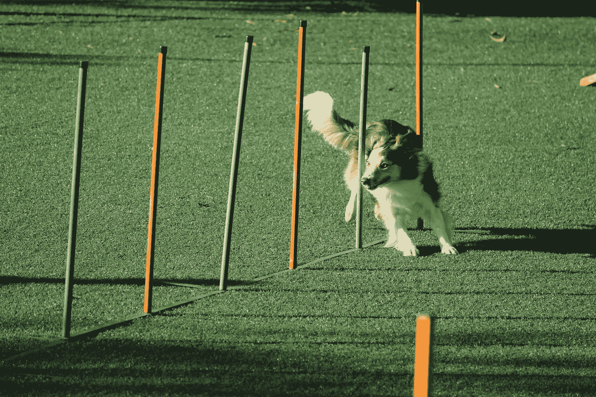

# 学习 Python 列表的 17 个快速示例

> 原文：<https://towardsdatascience.com/17-quick-examples-to-learn-python-lists-196070a055c3?source=collection_archive---------9----------------------->

## 最常用的 Python 数据结构之一



穆里洛·维维亚尼在 [Unsplash](https://unsplash.com/s/photos/quick?utm_source=unsplash&utm_medium=referral&utm_content=creditCopyText) 上拍摄的照片

数据结构是程序的关键组成部分。它们以特定的方式保存或包含数据，以使程序更有效地工作。如何访问存储在数据结构中的数据也至关重要。

列表是 Python 中最常用的内置数据结构之一。列表能够存储不同数据类型的值，这使得它们非常有用。

有多种方法和函数可以应用于列表。我们应该掌握它们，以便在我们的节目中充分利用列表。处理数据的方式是创建高效程序的关键。

在本文中，我们将通过 17 个简单的例子来演示如何与 Python 列表进行交互和操作。让我们首先创建一个包含一些整数和字符串的简单列表。

```
mylist = [1, 2, 3, 4, 4, 4, 5, 5, 'a', 'b']
```

## 示例 1

count 方法返回列表中某项出现的次数。

```
mylist.count(4)
3mylist.count('a')
1
```

## 示例 2

pop 方法从列表中移除一项。默认情况下，它删除最后一项，但是我们可以指定要删除的项的索引。

```
mylist = [1, 2, 3, 4, 4, 4, 5, 5, 'a', 'b']mylist.pop()
'b'print(mylist)
[1, 2, 3, 4, 4, 4, 5, 5, 'a']
```

让我们用它来删除第二个项目。

```
mylist.pop(1)
2print(mylist)
[1, 3, 4, 4, 4, 5, 5, 'a']
```

## 示例 3

从列表中移除项目的另一个选项是 remove 方法。它要求指定要删除的项目，而不是其索引。

```
mylist = ['a', 'b', 'a', 'c', 'd', 'a']mylist.remove('a')print(mylist)
['b', 'a', 'c', 'd', 'a']
```

如果有多个项目具有相同的值，remove 方法将删除第一个匹配项。

## 实例 4

pop 和 remove 方法之间有一个重要的区别。pop 返回被移除的项，这样就可以将它赋给一个新的变量。另一方面，remove 方法不返回任何内容。

```
mylist = ['a', 'b', 'c', 'd']var_pop = mylist.pop()
var_remove = mylist.remove('a')print(var_pop)
dprint(var_remove)
None
```

## 实例 5

clear 方法删除了列表中的所有条目，所以我们最终得到了一个空列表。

```
mylist = ['a', 'b', 'c', 'd']mylist.clear()print(mylist)
[]
```

## 实例 6

我们可以使用 append 方法向列表中添加一个新项。

```
mylist = ['a', 'b', 'c', 'd']mylist.append(1)print(mylist)
['a', 'b', 'c', 'd', 1]
```

## 例 7

如果您试图将一个列表追加到另一个列表，追加的列表将是原始列表中的一个项目。

```
mylist = ['a', 'b', 'c', 'd']
myotherlist = [1, 2, 4]mylist.append(myotherlist)print(mylist)
['a', 'b', 'c', 'd', [1, 2, 4]]
```

如果要分别追加每一项，请使用 extend 方法。

```
mylist = ['a', 'b', 'c', 'd']
myotherlist = [1, 2, 4]mylist.extend(myotherlist)print(mylist)
['a', 'b', 'c', 'd', 1, 2, 4]
```

## 实施例 8

我们可以使用 list 构造函数根据字符串中的字符创建一个列表。

```
mylist = list("python")print(mylist)
['p', 'y', 't', 'h', 'o', 'n']
```

## 示例 9

reverse 方法可用于颠倒列表中项目的顺序。它就地执行反向操作，因此不返回任何内容。

```
mylist.reverse()print(mylist)
['n', 'o', 'h', 't', 'y', 'p']
```

## 实例 10

我们可以使用 sort 方法对列表中的项目进行排序。

```
mylist = ['g','a', 'c', 'd']
myotherlist = [4, 2, 11, 7]mylist.sort()
myotherlist.sort()print(mylist)
['a', 'c', 'd', 'g']print(myotherlist)
[2, 4, 7, 11]
```

## 实施例 11

默认情况下，sort 方法按升序排序。可以使用 reverse 参数进行更改。

```
mylist = ['g','a', 'c', 'd']
myotherlist = [4, 2, 11, 7]mylist.sort(reverse=True)
myotherlist.sort(reverse=True)print(mylist)
['g', 'd', 'c', 'a']print(myotherlist)
[11, 7, 4, 2]
```

## 实例 12

排序方法可以正常工作。因此，它修改原始列表，但不返回任何内容。如果你想更新原来的，但需要一个排序的版本，可以使用内置的排序函数。

```
mylist = ['g','a', 'c', 'd']
mysortedlist = sorted(mylist)print(mylist)
['g', 'a', 'c', 'd']print(mysortedlist)
['a', 'c', 'd', 'g']
```

原物不变。我们有一个新的列表，它是原始列表的排序版本。

## 实施例 13

我们已经看到了 append 方法，它用于向列表中添加一个新项。它会在末尾添加新项目。

插入方法提供了更多的灵活性。它允许为新项目指定索引。

```
mylist = [1, 2, 3, 4, 5]mylist.insert(2, 'AAA')print(mylist)
[1, 2, 'AAA', 3, 4, 5]
```

第一个参数是索引，第二个参数是要添加的项目。

## 实施例 14

内置的 len 函数返回列表中的项目数。

```
mylist = [1, 2, 3, 4, 5]len(mylist)
5
```

## 实施例 15

我们可以使用“+”操作符来组合多个列表。

```
first = [1, 2, 3, 4, 5]
second = [10, 11, 12]
third = [1, 'A']first + second + third
[1, 2, 3, 4, 5, 10, 11, 12, 1, 'A']
```

## 实施例 16

我们可以通过拆分一个字符串来获得一个列表。split 函数创建一个列表，其中包含拆分后的每个部分。

```
text = "Python is awesome"mylist = text.split(" ")print(mylist)
['Python', 'is', 'awesome']
```

我们指定用作分割点的字符，在我们的例子中是空格。

## 实例 17

列表理解是一种基于其他可重复项创建列表的技术。例如，我们可以基于另一个列表创建一个列表。

```
mylist = ["This", "is", "a", "great", "example"]newlist = [len(x) for x in mylist]print(newlist)
[4, 2, 1, 5, 7]
```

新列表包含原始列表中项目的长度。

列表理解是一个非常重要的话题。如果你想了解更多，这里有一篇关于列表理解的文章。

[](/11-examples-to-master-python-list-comprehensions-33c681b56212) [## 掌握 Python 列表理解的 11 个例子

### 如何有效地使用列表理解？

towardsdatascience.com](/11-examples-to-master-python-list-comprehensions-33c681b56212) 

## 结论

列表是 Python 的核心数据结构之一。它们通常被用作程序的构建模块。因此，熟悉列表非常重要。

我们所做的例子几乎涵盖了 Python 列表的所有需求。剩下的只是练习。

感谢您的阅读。如果您有任何反馈，请告诉我。