# 数据科学中使用的 17 种相似和相异度量。

> 原文：<https://towardsdatascience.com/17-types-of-similarity-and-dissimilarity-measures-used-in-data-science-3eb914d2681?source=collection_archive---------0----------------------->

## 下面的文章解释了计算距离的各种方法，并展示了它们在我们日常生活中的实例。此外，它将向您介绍 pydist2 包。

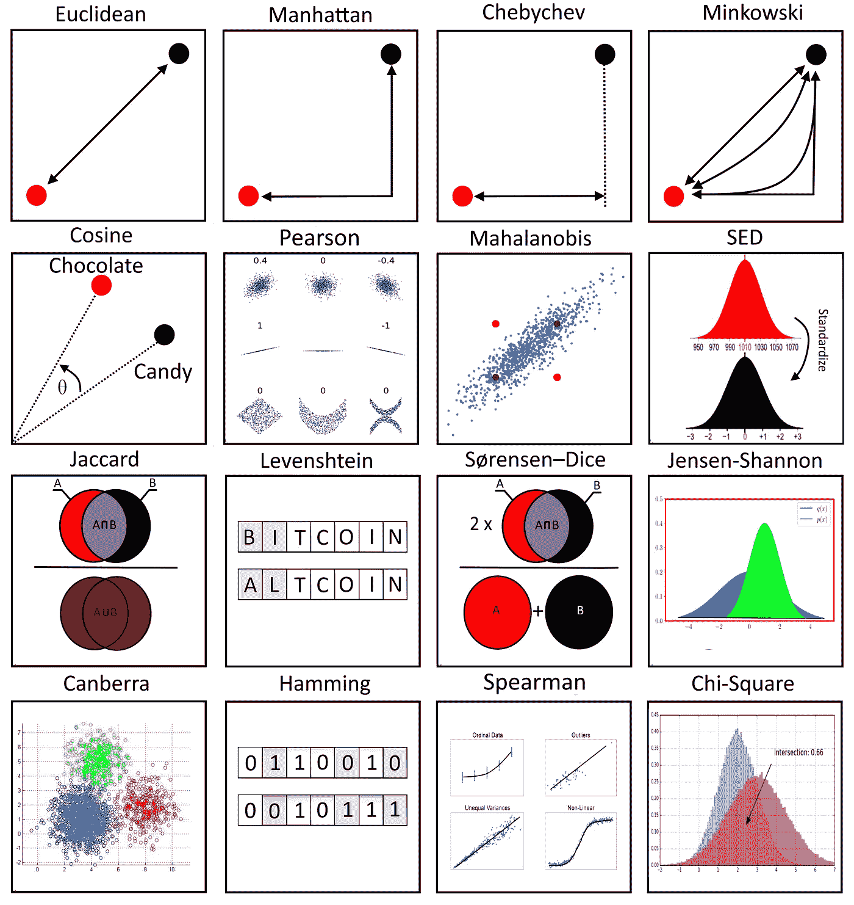

各种 ML 指标。灵感来自[马腾 Grootendorst](/9-distance-measures-in-data-science-918109d069fa) 。

> "几何学没有捷径可走。"— **欧几里得**

> **快速注释**:所有文字和图像均由作者创作，除非另有说明。使用 Matplotlib、Tex、Scipy、Numpy 等工具生成插图和方程，并使用 GIMP 进行编辑。

## 🄰 .**简介**:

**相似性和不相似性:**

在数据科学中，相似性度量是一种衡量数据样本如何相互关联或接近的方法。另一方面，相异度度量是为了告诉数据对象有多少不同。此外，当相似的数据样本被分组到一个聚类中时，这些术语经常在聚类中使用。所有其他数据样本被分组为不同的样本。它还用于分类(例如 KNN)，其中数据对象基于特征的相似性进行标记。另一个例子是当我们谈论与其他数据样本相比的不同异常值时(例如，异常检测)。

相似性度量通常表示为一个数值:当数据样本更相似时，它变得更高。它通常通过转换表示为 0 和 1 之间的数字:0 表示低相似性(数据对象不相似)。一个意味着高度相似(数据对象非常相似)。

举个例子，每个数据点只包含一个输入要素。这可以被认为是显示三个数据点 A、B 和 c 之间不相似性的最简单示例。每个数据样本在一个轴上可以有一个值(因为我们只有一个输入要素)；让我们把它记为 x 轴。我们来取两点，A(0.5)，B(1)，C(30)。可以看出，与 C 相比，A 和 B 彼此足够接近。因此，A 和 B 之间的相似性高于 A 和 C 或 B 和 C。换句话说，A 和 B 具有很强的相关性。因此，距离越小，相似度就越大。

**指标:**

当且仅当满足以下四个条件时，给定的距离(例如，相异度)才意味着是度量:

**1-非负:** d(p，q) ≥ 0，对于任意两个不同的观测值 p 和 q

**2-对称:** d(p，q) = d(q，p)对于所有的 p 和 q。

**3-三角形不等式:** d(p，q) ≤ d(p，r) + d(r，q)对于所有 p，q，r。

仅当 p = q 时，d(p，q) = 0

距离度量是分类的基本原则，就像 k 近邻分类算法一样，它度量给定数据样本之间的不相似性。此外，选择距离度量将对分类器的性能有很大影响。因此，计算对象之间距离的方式将在分类器算法的性能中起着至关重要的作用。

## 🄱 .距离函数:

用于测量距离的技术取决于您正在处理的特定情况。例如，在某些领域，欧几里得距离对于计算距离可能是最佳的和有用的。其他应用程序需要更复杂的方法来计算点之间的距离或观察值，如余弦距离。以下列举的列表代表了计算每一对数据点之间距离的各种方法。

## ⓪. **L2 范数，欧几里得距离。**

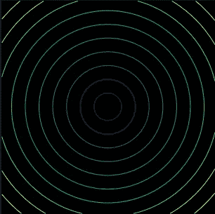

欧几里德轮廓。

用于数值属性或要素的最常见的距离函数是欧几里德距离，它在以下公式中定义:

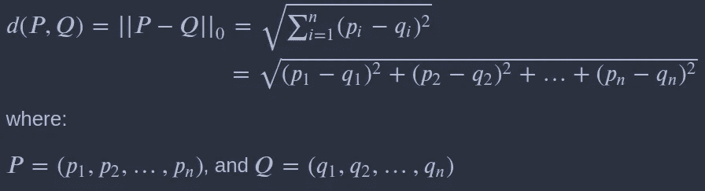

n 维空间中两点之间的欧氏距离。

如你所知，这种距离度量表示众所周知的性质，如对称、可微、凸、球形…

在二维空间中，前面的公式可以表示为:

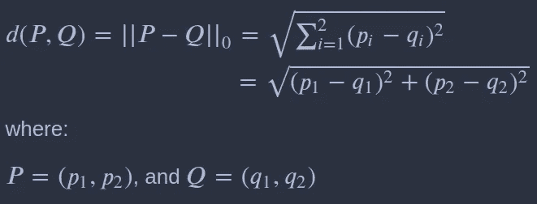

二维空间中两点之间的欧几里得距离。

它等于直角三角形斜边的长度。

此外，欧几里得距离是一种度量，因为它满足其标准，如下图所示。

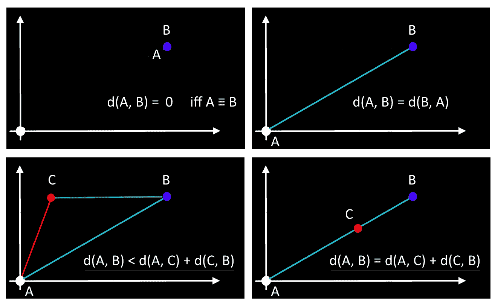

欧几里得距离满足成为度量的所有条件。

此外，使用该公式计算的距离代表每对点之间的最小距离。换句话说，这是从 A 点到 B 点(二维笛卡尔坐标系)的最短路径，如下图所示:

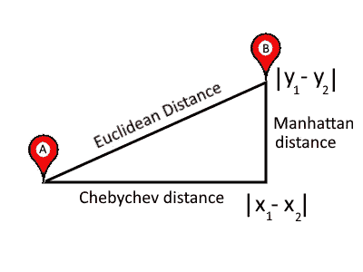

欧几里德距离是最短的路径(不包括量子世界中虫洞的情况)。

因此，当您想要在路径上没有障碍物的情况下计算两点之间的距离时，使用此公式非常有用。这可以被认为是你不想计算欧几里德距离的情况之一；相反，您希望使用其他度量，如曼哈顿距离，这将在本文的后面解释。

欧几里德距离不能给我们有用信息的另一种情况是，飞机的飞行路径遵循地球的曲率，而不是一条直线(除非地球是平的，但事实并非如此！).

然而，在进一步深入之前，让我们解释一下如何在机器学习的环境中使用欧几里德距离。

最著名的分类算法之一，KNN 算法，可以从使用欧氏距离对数据进行分类中获益。为了演示 KNN 如何使用欧几里德度量，选择了来自 Scipy 包的流行虹膜数据集。

正如你可能知道的，这个数据集包含三种花:鸢尾-刚毛鸢尾、鸢尾-杂色鸢尾和鸢尾-海滨鸢尾，具有以下四个特征:萼片长度、萼片宽度、花瓣长度、花瓣宽度。因此，我们有一个 4 维空间，每个数据点都可以用。

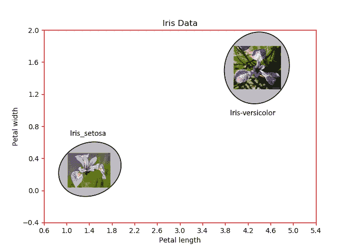

两种花在两个特征空间的虹膜数据集。

出于简单和演示的目的，让我们只选择两个特征:花瓣长度、花瓣宽度和排除 Iris-virginica 数据。这样，我们可以在二维空间中绘制数据点，其中 x 轴和 y 轴分别代表花瓣长度和花瓣宽度。

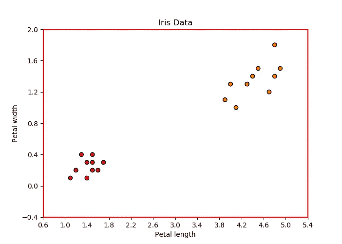

训练数据集。

每个数据点都有自己的标签:Iris-Setosa 或 Iris-versicolor(数据集中的 0 和 1)。因此，该数据集可用于 KNN 分类，因为其本质上是一种受监督的最大似然算法。假设我们的最大似然模型(KNN，k = 4)已经在这个数据集上进行了训练，我们已经选择了两个输入要素和仅仅二十个数据点，如前面的图表所示。

到目前为止，一切看起来都很好，我们的 KNN 分类器已经准备好分类一个新的数据点。因此，我们需要一种方法来让模型决定新数据点可以分类到哪里。

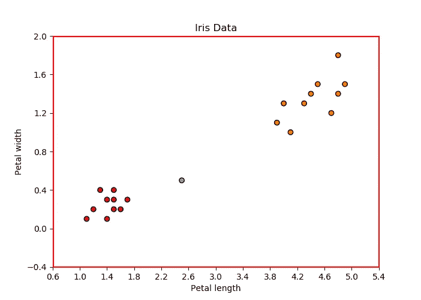

预测新数据点的标签。

你可能会想，欧几里德距离已经被选择来让每个训练的数据点投票决定新数据样本适合的位置:Iris-Setosa 或 Iris-versicolor。因此，已经计算了从新数据点到我们的训练数据的每个点的欧几里德距离，如下图所示:

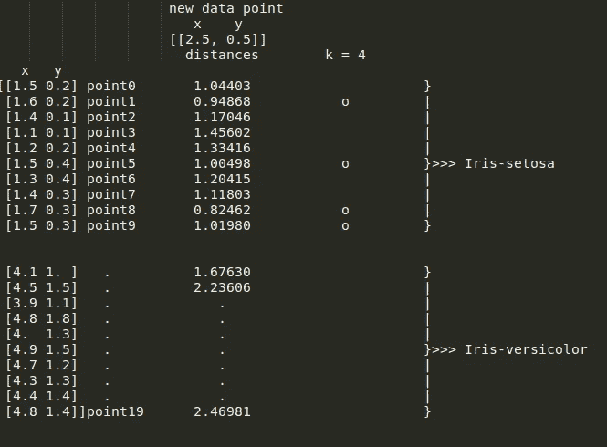

当 k = 4 时，KNN 分类器要求选择最小的四个距离，这四个距离表示从新点到以下点的距离:点 1、点 5、点 8 和点 9，如图所示:

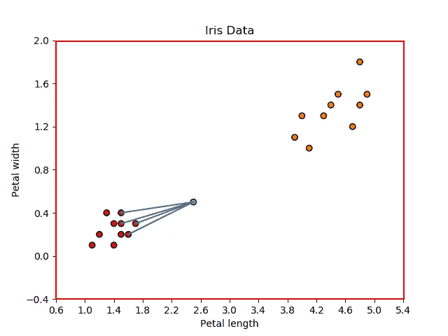

四个邻居投票给 Iris-Setosa。

因此，新的数据样本被归类为鸢尾属。用这个类比，可以想象更高维度和其他分类器。希望你明白了！

如前所述，每个域都需要一种特定的距离计算方法。随着本文的深入，您将会发现这样表述的含义。

## ➀.**平方欧几里德**距离。

使用这种方法计算距离避免了使用平方根函数的需要。顾名思义，SED 等于欧几里德距离的平方。因此，在计算观测值之间的距离时，SED 可以减少计算工作。例如，它可以用于聚类、分类、图像处理和其他领域。

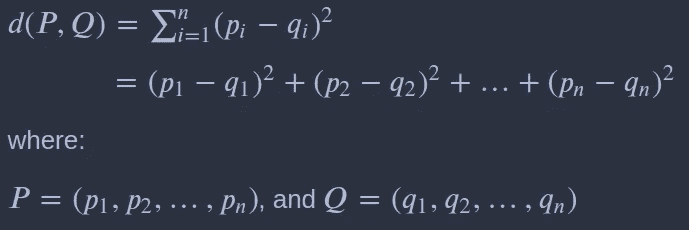

n-D 空间中两点之间的平方欧几里得距离。

## ②. **L1 标准、城市街区、曼哈顿或出租车距离。**

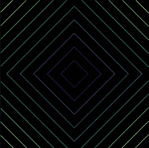

曼哈顿轮廓。

这一指标在测量给定城市中两条街道之间的距离时非常有用，距离可以通过分隔两个不同地点的街区数量来测量。例如，根据下图，A 点和 B 点之间的距离大约等于 4 个街区。

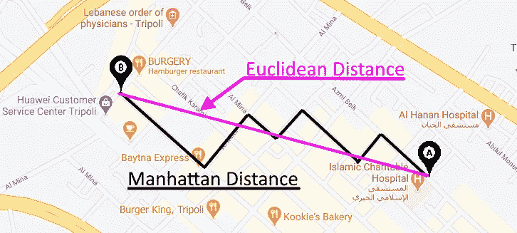

现实世界中的曼哈顿距离

创建此方法是为了解决在给定的城市中计算源和目的地之间的距离，在该城市中，几乎不可能沿直线移动，因为建筑物分组到网格中，阻挡了直线路径。因此得名城市街区。

你可以说 A 和 B 之间的距离是欧几里得距离。但是，正如你可能注意到的，这个距离是没有用的。例如，您需要有一个有用的距离来估计旅行时间或您需要驾驶多长时间。相反，如果您有使用街道的最短路径，它会有所帮助。所以这取决于你如何定义和使用距离的情况。

在 n 维空间中，曼哈顿距离表示为:

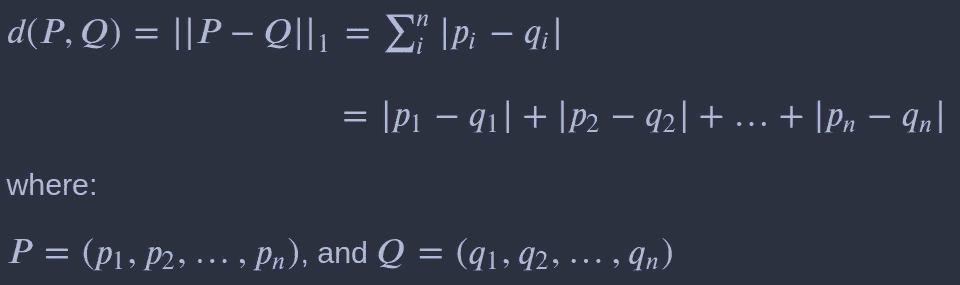

n-D 空间中两点之间的曼哈顿距离。

对于二维网格，前面的公式可以写成:

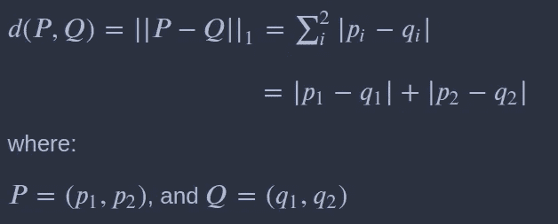

二维空间中两点之间的曼哈顿距离。

回想一下前面的 KNN 示例，计算从新数据点到训练数据的曼哈顿距离将产生以下值:

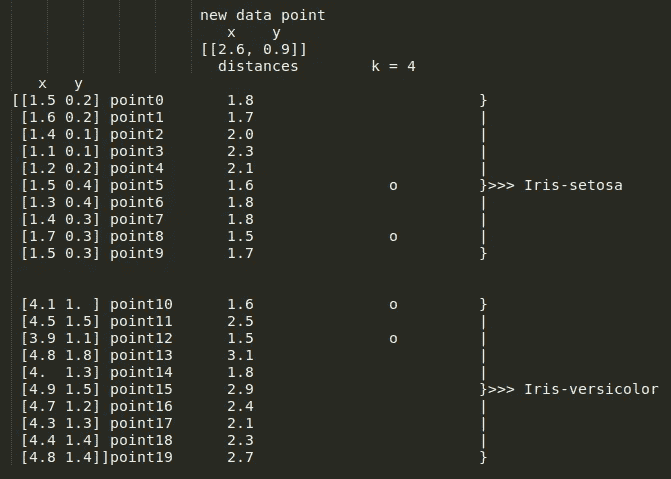

KNN 使用曼哈顿距离分类(平局！)

正如你所看到的，两个数据点投票给 Iris-Setosa，另外两个数据点投票给 Iris-versicolor，这意味着平局。

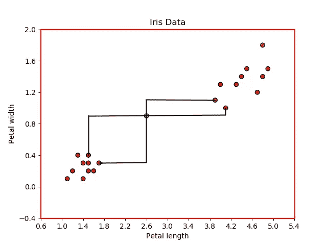

曼哈顿距离:平手！

我想你可能在什么地方遇到过这个问题。直观的解决方案是改变 k 的值，如果 k 大于 1，则减少 1，否则增加 1。

但是，对于前面的每个解决方案，您将获得不同的 KNN 分类器行为。例如，在我们的例子中，k=4。将其更改为 k=3 将导致以下值:

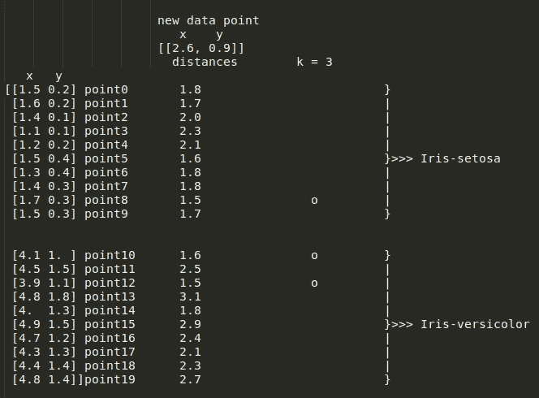

将 k 减一。

这种花被归类为鸢尾花。同样，将其更改为 k=5 会产生以下值:

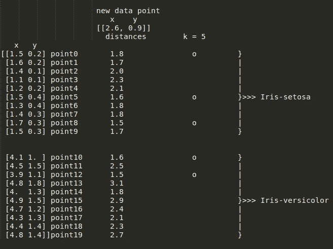

将 k 增加 1。

这种花被归类为鸢尾。所以，由你来决定是否需要增加或减少 k 的值。

然而，有人会说，如果度量标准不是问题的约束，你可以改变它。例如，计算欧几里德距离可以解决这个问题:

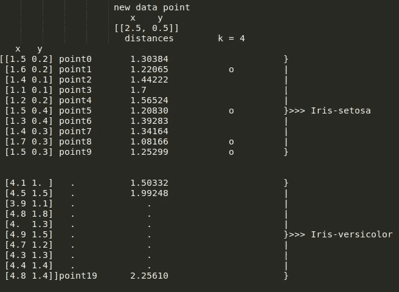

改变距离度量也会打破平局。

这种花被归为鸢尾属。

在我看来，如果您不必改变曼哈顿距离并对 k 使用相同的值，添加新的维度或特征(如果可用)也会打破这种束缚。例如，添加萼片宽度作为新的维度将导致以下结果:

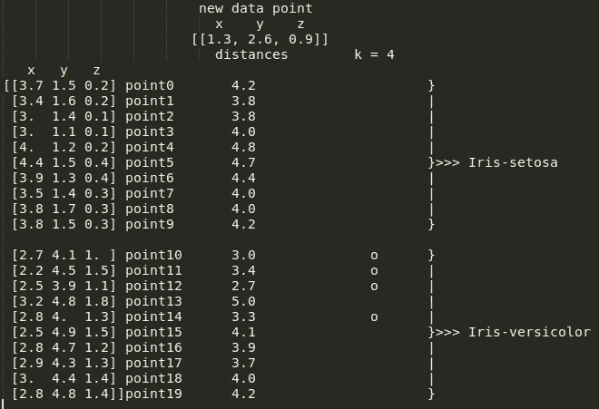

向模型添加新特征。

这种花被归类为鸢尾花。

这是三维空间的图，其中 x 轴、y 轴和 z 轴分别代表萼片宽度、花瓣长度和花瓣宽度:

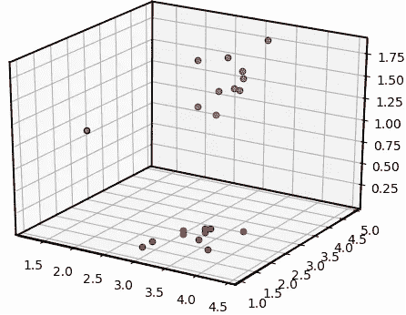

虹膜数据集的三维图。

计算曼哈顿距离在计算上比前两种方法更快。如公式所示，它只需要加法和减法，这比计算平方根和 2 的幂要快得多。

如果你曾经下过国际象棋，曼哈顿距离被象用来在两个相同颜色的水平或垂直方块之间移动:

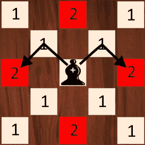

毕晓普用的是曼哈顿距离(如果没看到，就把棋盘旋转 45°想象一下)。

换句话说，让主教越过红色方块所需的移动次数(距离)等于曼哈顿距离，也就是两次。

除此之外，如果数据存在许多异常值，曼哈顿距离将优于欧几里德距离。

此外，L1 范数给出了比 l2 范数更稀疏的估计。

除此之外，L1 范数和 L2 范数通常用于神经网络的正则化，以最小化权重或清除某些值，就像 lasso 回归中使用的一样。

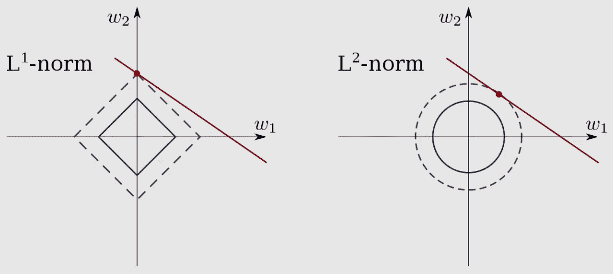

套索和岭回归的约束区域的形式(来源:[维基百科](https://en.wikipedia.org/wiki/Lasso_(statistics)#/media/File:L1_and_L2_balls.svg))。

如上图所示，L1-诺姆试图将 W1 的权重归零，并将另一个权重最小化。然而，L2 范数试图最小化 W1 和 W2 权重(如 W1 = W2)。

与此同时，我不希望这篇文章深入正则化，因为它的主要目标是解释常见的距离函数，同时在这里和那里说明一些用法，并使它尽可能容易理解。因此，让我们继续前进。

## ③.堪培拉距离。

它是曼哈顿距离的加权版本，用于聚类，如模糊聚类、分类、[、计算机安全](https://citeseerx.ist.psu.edu/viewdoc/download?doi=10.1.1.97.2974&rep=rep1&type=pdf)和垃圾邮件检测系统。与之前的度量相比，它对异常值更鲁棒。

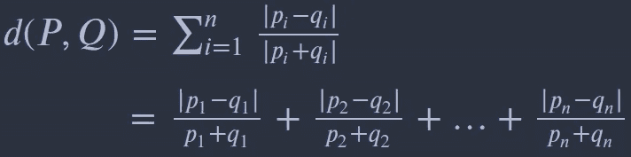

堪培拉距离。

## ④. **L∞范数，切比雪夫距离，最大距离。**

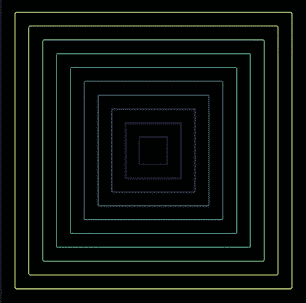

切比雪夫等高线。

两个 n-D 观测值或向量之间的切比雪夫距离等于数据样本坐标之间变化的最大绝对值。在二维世界中，数据点之间的切比雪夫距离可以被确定为它们的二维坐标的绝对差之和。

两点 P 和 Q 之间的切比雪夫距离定义为:

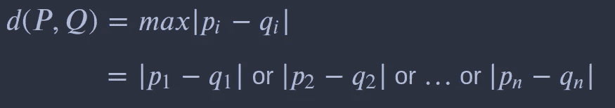

切比雪夫距离

切比雪夫距离是一个度量，因为它满足成为度量的四个条件。

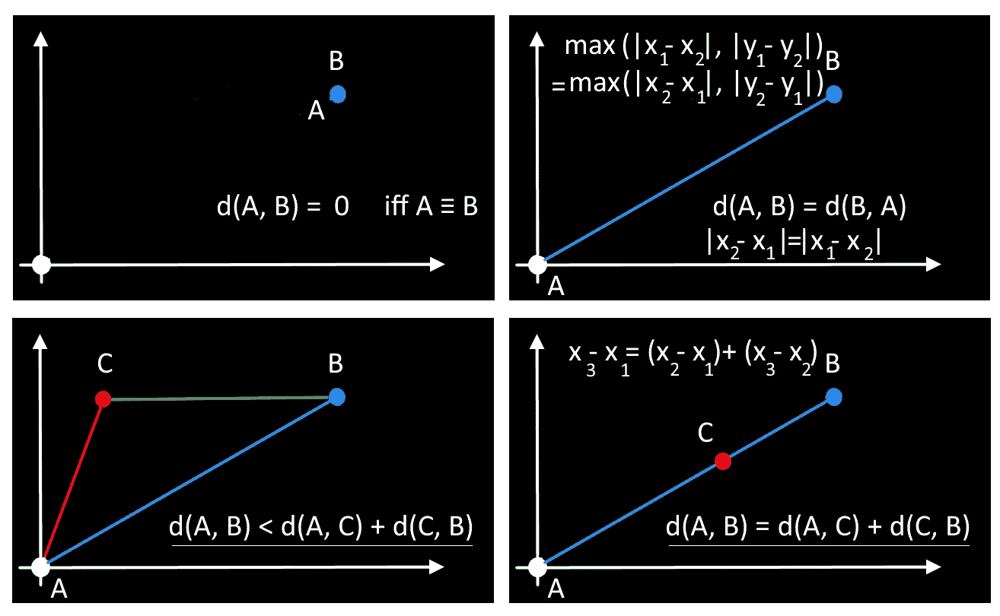

切比雪夫距离满足作为度量的所有条件。

但是，您可能想知道 min 函数是否也可以是一个度量！

min 函数不是度量，因为有一个反例(如水平线或垂直线)其中 d(A，B) = 0 和 A！= B .但是，只有当 A = B 时，它才应该等于零！！！！

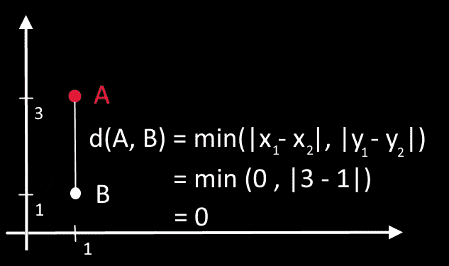

你能想到的使用切比雪夫指标的一个用例是交易股票，加密货币的特征是交易量、出价、要价……例如，你需要找到一种方法来判断最大的加密货币，它的回报和损失之间有很大的差距。事实证明，切比雪夫距离非常适合这种特殊情况。

棋盘中使用切比雪夫距离的另一种常见情况是，国王或王后的移动次数等于到达相邻方格的距离，如下图所示:

国王利用切比雪夫距离四处走动。

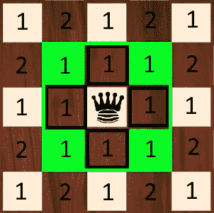

女王使用切比雪夫距离的一些广场。

## ⑤. **Lp 范数，Minkowski** 距离。

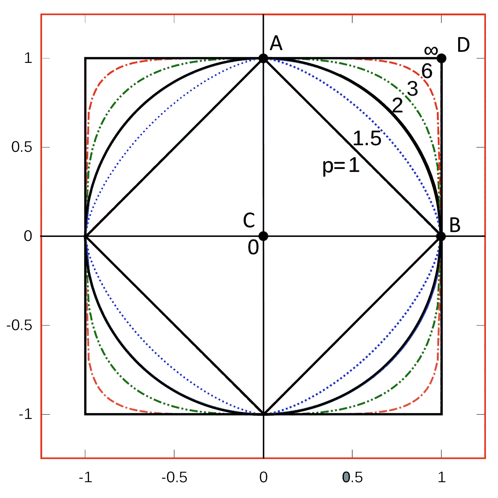

不同 p 值的闵可夫斯基等高线。

闵可夫斯基距离只是以前的距离度量的概括:欧几里德、曼哈顿和切比雪夫。它被定义为 n-D 空间中两次观测之间的距离，如下式所示:

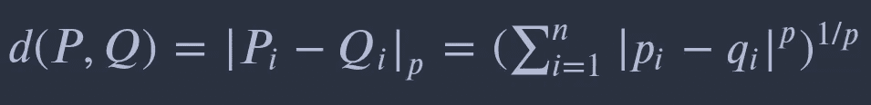

闵可夫斯基距离。

其中 P，Q 是两个给定的 n-D 点，P 代表闵可夫斯基度量。对于特定的 p 值，您可以得出以下指标:

*   **p = 1:** 曼哈顿距离。
*   **p = 2:** 欧氏距离。
*   **p → +∞ :** 切比雪夫距离，逻辑 OR(点 D = **A** 或 **B** = **1** 或 **1** = 1)。
*   **p → 0:** 逻辑与(点 C = **A** 和 **B** =零)。
*   **p → -∞ :** 最小距离(D 点的对称)。

## ⑥.**余弦**距离。

这种度量广泛用于文本挖掘、自然语言处理和信息检索系统。例如，它可以用来测量两个给定文档之间的相似性。它还可以用于根据邮件的长度来识别垃圾邮件。

余弦距离可以按如下方式测量:

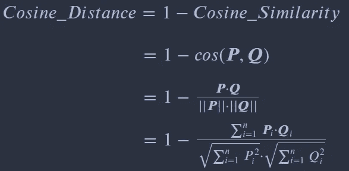

余弦距离。

其中 P 和 Q 代表两个给定点。这两个点可以表示文档中单词的频率，这将在下面的示例中解释。

让我们以包含以下短语的三个文档为例:

*   **文档 A:** “我喜欢早上喝咖啡。”
*   文档 B:“我喜欢喝咖啡。”
*   **文档 C:** “我和我的朋友在家乡的一家咖啡店工作。他早上会讲一些有趣的笑话。我们喜欢以每人喝杯茶开始新的一天。”

计算每个单词的出现频率将得到以下结果:

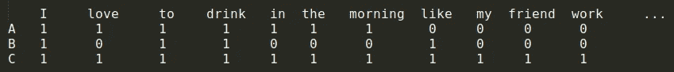

单词的频率。

在计算出现次数之前，您已经先验地知道文档 A 和 B 在含义上非常相似:“我喜欢喝咖啡。”然而，文档 C 包含文档 A 的所有单词，但是从频率表来看，它们的意思非常不同。为了解决这个问题，你需要计算余弦相似度来确定它们是否相似。

另一方面，这可以说明信息检索或搜索引擎是如何工作的。将文档 A 想象成对给定源(图像、文本、视频……)的查询(短消息)，文档 C 想象成需要获取并返回作为查询响应的网页。

另一方面，欧几里德距离不能给出短文档和大文档之间的正确距离，因为在这种情况下它会很大。使用余弦相似性公式将计算两个文档在方向上的差异，而不是在大小上的差异。

为了说明这一点，让我们看下面两个文档:

*   **文件 A:** “比特币比特币比特币钱”
*   **文档 B:** “货币货币比特币比特币”

让我们用“比特币”这个词作为 x 轴，用“货币”这个词作为 y 轴。这意味着文档 A 可以表示为向量 A(3，1)，文档 B 可以表示为 B(2，2)。

计算余弦相似度将得到以下值:

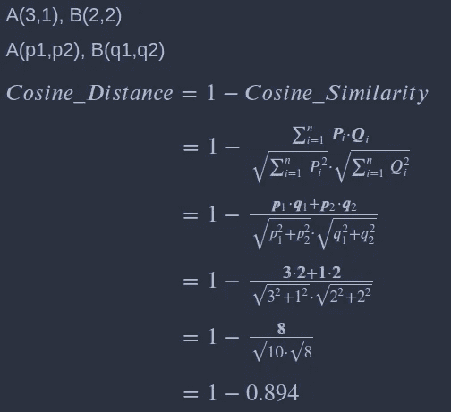

计算余弦相似度

余弦相似度= 0.894 意味着文档 A 和 B 非常相似。cos(角度)大(接近 1)意味着角度小(26.6)，两个文档 A 和 B 彼此接近。

但是，您不能将余弦相似度的值解释为百分比。例如，值 0.894 并不意味着文档 A 是 89.4%，与 B 相似。它意味着文档 A 和 B 非常相似，但我们不知道百分比是多少！该值没有阈值。换句话说，您可以将余弦相似度的值解释如下:

> 它越大，文档 A 和 B 越有可能相似，反之亦然。

让我们再举一个关于 A(1，11)和 B(22，3)的例子

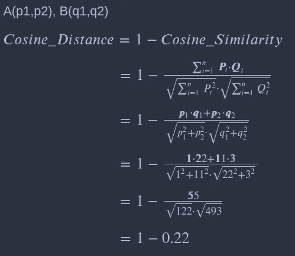

计算余弦相似度

然而，欧几里德距离会给出一个像 22.4 这样的大数字，它不能说明向量之间的相对相似性。

另一方面，余弦相似性也适用于更高的维度。

余弦相似性的另一个有趣的应用是 [OpenPose](https://github.com/CMU-Perceptual-Computing-Lab/openpose) 项目。

祝贺🎆！你已经成功了一半🏁。继续下去🏃！

## ⑦.皮尔森**相关距离**。

相关距离量化了两个属性之间的线性单调关系的强度。此外，它使用协方差值作为初始计算步骤。然而，协方差本身很难解释，并且不能显示数据与代表测量值之间趋势的线有多近或多远。

为了说明相关性的含义，让我们回到 Iris 数据集，绘制 Iris-Setosa 样本，以显示两个特征之间的关系:花瓣长度和花瓣宽度。

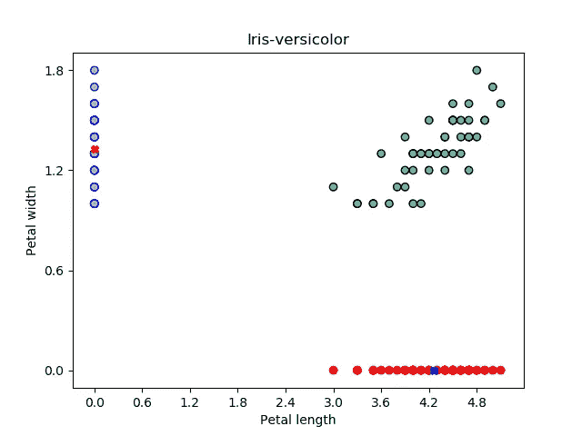

Iris-Setosa 样本的两个特征的测量。

如下图所示，对同一花卉样本的两个特征的样本均值和方差进行了估计。

一般来说，我们可以说花瓣长度值相对较低的花，其花瓣宽度值也相对较低。花瓣长度值相对较高的花也具有相对较高的花瓣宽度值。此外，我们可以用一行来总结这种关系。

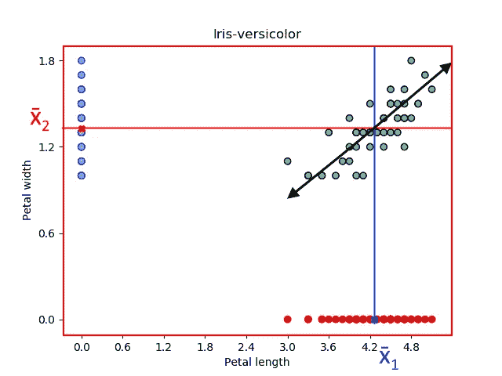

样本均值和方差估计。

这条线代表花瓣长度和花瓣宽度同时增加的积极趋势。

协方差值可以对三种类型的关系进行分类:

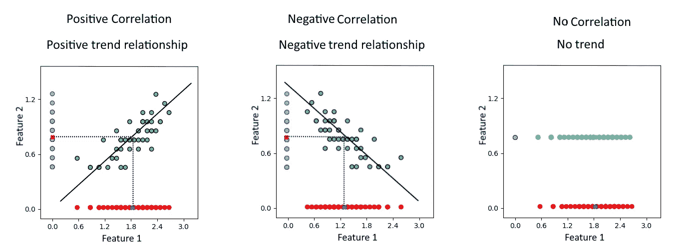

三种类型的相关性。

可以使用以下公式计算相关距离:

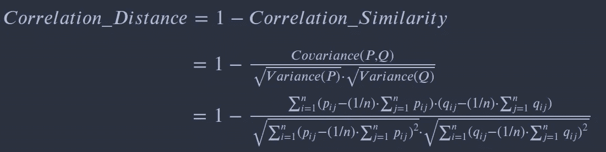

相关距离

其中，分子表示观测值的协方差值，分母表示每个要素的方差的平方根。

让我们举一个简单的例子来说明如何计算这个公式。

红色和蓝色点分别具有以下坐标:

A(1.2，0.6)和 B (3.0，1.2)。

两次测量的估计样本均值等于:

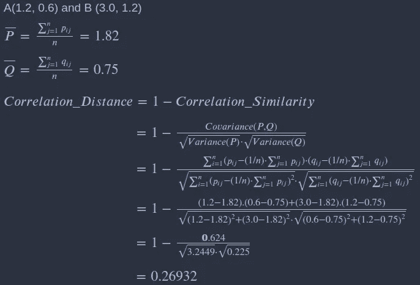

关于这个指标的最后一点是，相关性并不意味着因果关系。例如，花瓣长度值相对较小的 iris-Setosa 并不意味着花瓣宽度值也应该较小。这是充分条件，但不是必要条件！有人可能会说，小花瓣长度可能有助于小花瓣宽度，但不是唯一的原因！

## ⑧.**斯皮尔曼**对射。

像皮尔逊相关一样，斯皮尔曼相关也用于双变量分析。然而，与皮尔逊相关不同，斯皮尔曼相关用于两个变量都是排序的情况。它可用于分类属性和数字属性。

虹膜数据集的相关矩阵。

Spearman 相关指数可使用以下公式计算:

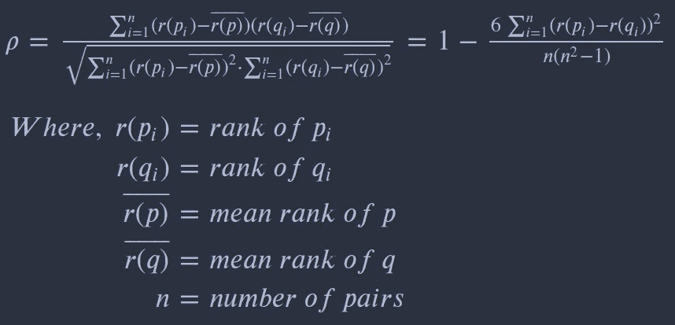

斯皮尔曼相关系数。

Spearman 相关常用于假设检验。

## ⑨ **。Mahalanobis** 距离。

它是一种度量标准，主要用于多元统计测试，在这种测试中，欧几里得距离不能给出观察值之间的真实距离。它衡量一个数据点离分布有多远。

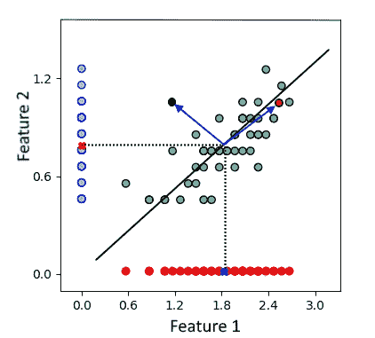

两个点具有相同的平均值。

如上图所示，红色和蓝色点与平均值的欧氏距离相同。然而，它们不属于同一区域或集群:红点更有可能与数据集相似。但是蓝色的被认为是异常值，因为它远离代表数据集中最大可变性方向的线(主轴回归)。因此，引入了 Mahalanobis 度量来解决这个问题。

Mahalanobis 度量试图减小两个要素或属性之间的协方差，也就是说，您可以将先前的图重新缩放到新的轴中。并且这些新的轴表示像前面所示的第一特征向量一样的特征向量。

特征向量的第一方向极大地影响了数据分类，因为它具有最大的特征值。此外，数据集沿着这个方向比沿着另一个垂直方向扩展得更多。

使用这种技术，我们可以沿着这个方向缩小数据集，并围绕平均值(PCA)旋转它。然后，我们可以使用欧几里德距离，它根据前面两个数据点之间的平均值给出不同的距离。这就是马哈拉诺比斯度规的作用。

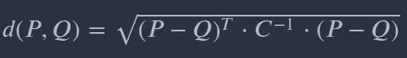

两个物体 P 和 q 之间的距离。

其中 **C** 表示属性或特征之间的协方差矩阵。

为了演示该公式的用法，让我们根据上一个相关距离部分的示例来计算 A(1.2，0.6)和 B (3.0，1.2)之间的距离。

现在让我们评估协方差矩阵，其定义如下:

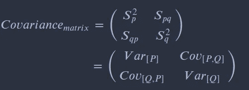

二维空间中的协方差矩阵

其中，Cov[P，P] = Var[P]，Cov[Q，Q]= Var[Q]，以及

两个特征之间的协方差公式。

因此，两个物体 A 和 B 之间的马氏距离可以计算如下:

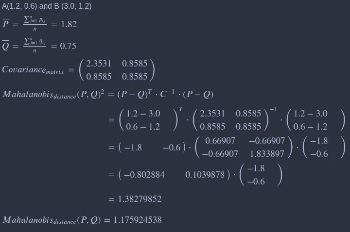

马哈拉诺比斯距离示例。

除了其使用案例，Mahalanobis 距离还用于[霍特林 t-square 测试](https://en.wikipedia.org/wiki/Hotelling%27s_T-squared_distribution)。

## ⑩.标准化欧几里德距离。

标准化或规范化是在构建机器学习模型时的预处理阶段使用的技术。数据集显示了最小和最大要素范围之间的巨大差异。当聚类数据时，这种比例距离会影响 ML 模型，导致错误的解释。

例如，让我们考虑这样一种情况，我们有两个不同的特征，它们在范围变化上有很大的差异。例如，假设我们有一个从 0.1 到 2 变化的特征和另一个从 50 到 200 变化的特征。使用这些值计算距离会使第二个要素更占优势，从而导致不正确的结果。换句话说，欧氏距离将受到具有最大值的属性的极大影响。

这就是为什么标准化是必要的，以便让特性以平等的方式做出贡献。这是通过将变量转换为所有变量都具有相同的方差(等于 1)并集中平均值周围的特征来实现的，如下式所示:

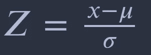

z 分数标准化。

标准化欧几里德距离可以表示如下:

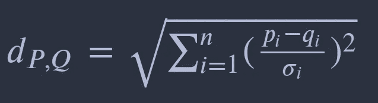

标准化欧几里德距离。

我们可以用这个公式来计算 A 和 b 之间的距离。

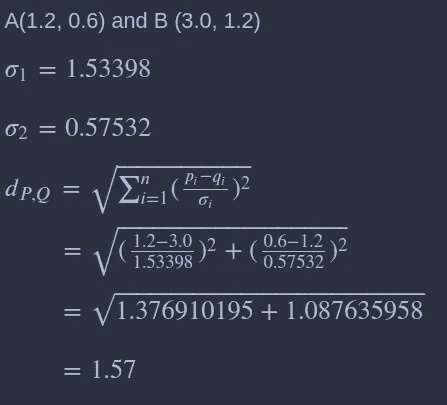

## ⑪.**驰** - **方距离**:

卡方距离通常在计算机视觉中使用，同时进行纹理分析，以便找到归一化直方图之间的相似性(不相似)，这被称为“直方图匹配”。

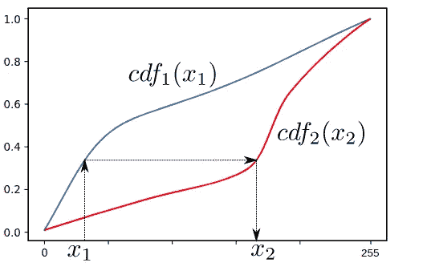

直方图匹配。来源:[维基百科](https://en.wikipedia.org/wiki/Histogram_matching)

人脸识别算法就是一个很好的例子，它使用这个度量来比较两个直方图。例如，在新面孔的预测步骤中，该模型根据新捕获的图像计算直方图，将其与保存的直方图(通常存储在. yaml 文件中)进行比较，然后尝试找到与之最匹配的直方图。这种比较是通过计算 n 个箱的每对直方图之间的卡方距离来进行的。

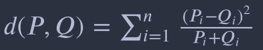

卡方距离

如您所知，此公式不同于标准正态分布的卡方统计检验，在卡方统计检验中，使用以下公式来决定是保留还是拒绝零假设:

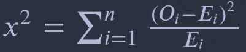

卡方检验公式。

其中 O 和 E 分别代表观察到的和预期的数据值。

为了说明如何使用，我们假设对 1000 人进行了一项调查，以测试特定疫苗的副作用，并查看是否存在基于性别的显著差异。因此，每个人可以是四个类别之一:

**1-** 男性无副作用。

**2-** 有副作用的男性。

**3-** 女性无副作用。

**4-** 有副作用的女性。

无效假设是:两种性别的副作用没有显著差异。

为了保留或拒绝此假设，您需要计算以下数据的卡方检验值:

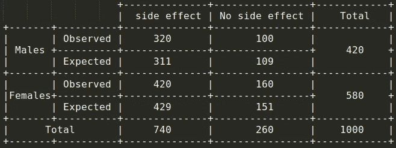

收集的数据。

将这些值代入卡方检验公式，将得到 1.7288。

使用自由度等于 1 的[卡方表](https://www.statology.org/wp-content/uploads/2020/01/chi_square_table_small.jpg)，您将得到 0.2 和 0.1 之间的概率> 0.05 →您保留原假设。

注意自由度=(列数-1) x(行数-1)

此外，我只是想让你们快速回顾一下假设检验。希望对你有帮助。无论如何，让我们继续前进。🏃🏃🏃

## ⑫.詹森-香农距离。

Jensen-Shannon 距离计算两个概率分布之间的距离。它使用 Kullback Leibler 散度(相对熵)公式来计算距离。

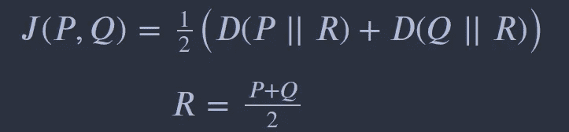

詹森-香农距离。

其中 R 是 P 和 q 的中点。

此外，关于如何解释熵的值，简单提一下:

> 事件 A 的低熵意味着对该事件将发生的高知晓度；换句话说，如果事件 A 将要发生，我不那么惊讶，我非常有信心它会发生。同样的类比适用于高熵。

另一方面，Kullback Leibler 散度本身不是距离度量，因为它不是对称的: ***D(P || Q)！*= D(Q | | P)***。*

## ⑬.莱文斯坦距离

衡量两个字符串之间相似性的度量。它等于将一个给定的字符串转换成另一个字符串所需的最小操作数。有三种类型的操作:

1.  替换。
2.  插入
3.  删除

对于 Levenshtein 距离，替代成本是两个单位，另两个操作是一个单位。

例如，让我们取两个字符串 s= "Bitcoin "和 t = "Altcoin "。要从 s 到 t，你需要用字母“A”和“l”两次替换字母“B”和“I”。因此，d(t，s) = 2 * 2 = 4。

Levenshtein 距离有许多用例，如垃圾邮件过滤、计算生物学、弹性搜索等等。

## ⑭.汉明距离。

汉明距离等于相同长度的两个码字不同时的位数。在二进制世界中，它等于两个二进制消息之间的不同位数。

例如，两条消息之间的汉明距离可以通过下式计算:

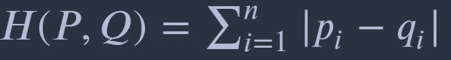

汉明距离。

你可能注意到了，它看起来像分类数据上下文中的曼哈顿距离。

对于长度为 2 位的消息，此公式表示分隔两个给定二进制消息的边数。它最多可以等于 2。

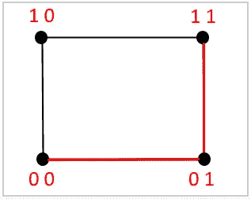

2 位代码字。

同样，对于长度为 3 位的消息，该公式表示分隔两个给定二进制消息的边数。最多可以等于三。

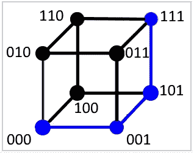

3 位代码字。

让我们举一些例子来说明如何计算汉明距离:

H(100001，010001) = 2

H(110，111) = 1

如果其中一个消息包含全零，则汉明距离称为汉明重量，等于给定消息中非零数字的数量。在我们的例子中，它等于 1 的总数。

H(110111，000000) = W (110111) = 5

如果可能的话，汉明距离用于检测和纠正在不可靠的噪声信道上传输的接收消息中的错误。

## ⑮.Jaccard/Tanimoto 距离。

用于测量两组数据之间相似性的度量。有人可能会说，为了度量相似性，要计算大小(基数，元素的数量。)两个给定集合的交集。

然而，仅仅是公共元素的数量并不能告诉我们它与集合的大小相比有多相关。因此 Jaccard 系数背后的直觉。

所以 Jaccard 建议，为了测量相似性，你需要用交集的大小除以两组数据的并集的大小。

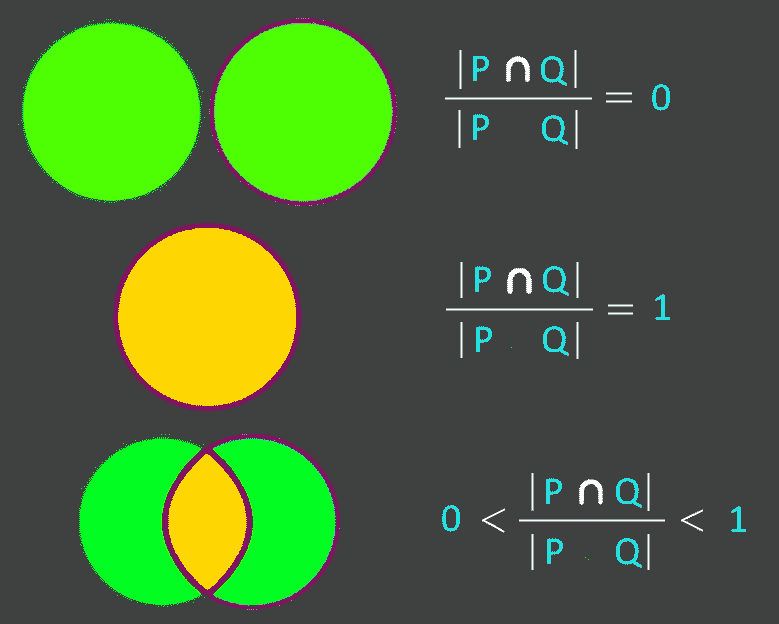

雅克卡距离。

Jaccard 距离是 Jaccard 系数的补充，用于测量数据集之间的差异，计算公式如下:

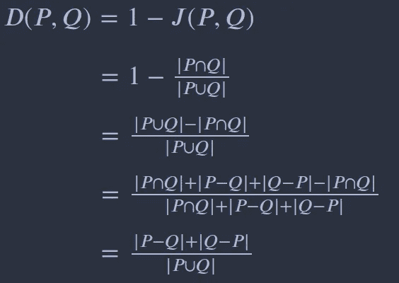

Jaccard **距离 T3。**

下图解释了如何将该公式用于非二进制数据。

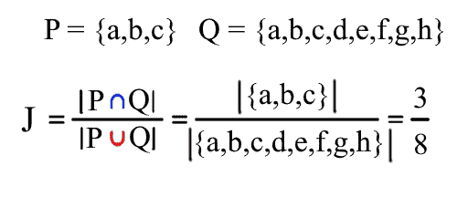

Jaccard 索引示例。

对于二进制属性，使用以下公式计算 Jaccard 相似性:

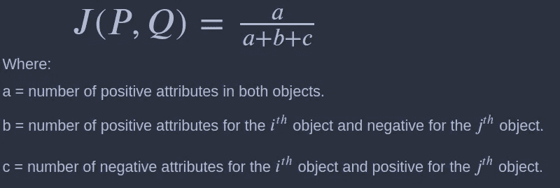

二进制数据索引。

Jaccard 索引在语义分割、文本挖掘、电子商务和推荐系统等领域非常有用。

现在你可能在想:“好吧，但是你刚才提到余弦距离也可以用在文本挖掘中。对于给定的聚类算法，您更喜欢使用什么作为度量？这两个指标的区别是什么？”

很高兴你问了这个问题。为了回答这个问题，我们需要比较两个公式的每一项。

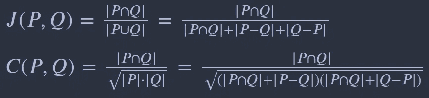

雅克卡和余弦公式。

这两个公式的唯一区别是分母项。不是用 Jaccard 计算两个集合之间的并集的大小，而是计算 P 和 q 之间的点积的大小。你在计算余弦公式中两者的乘积。我不知道对此的解释是什么。据我所知，点积给出了一个向量向另一个向量的方向移动了多少。除此之外，如果你有什么要补充的，我非常感激能在下面的评论中读到你的想法。

## ⑯.索伦森-骰子。

索伦森-骰子距离是一种统计指标，用于衡量数据集之间的相似性。它被定义为 P 和 Q 的交集大小的两倍，除以每个数据集 P 和 Q 中的元素之和。

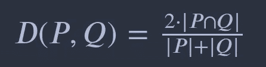

索伦森-骰子系数。

像 Jaccard 一样，相似性值的范围是从零到一。然而，与 Jaccard 不同，这种相异度不是度量，因为它不满足三角形不等式条件。

sorensen–Dice 用于[词典编纂](https://en.wikipedia.org/wiki/Lexicography)、[图像分割](https://en.wikipedia.org/wiki/Image_segmentation)和其他应用。

## 🄲.Pydist2。

在过去的几周里，当我在研究相似性和非相似性度量时，我认为用 python 重新实现这些类型的度量作为编码实践是一个有趣/伟大的想法。我从 Matlab 编写的 [Piotr Dollar 的工具箱](https://github.com/pdollar/toolbox) repo 中获得灵感，也可以在 [MathWorks](https://www.mathworks.com/matlabcentral/mlc-downloads/downloads/submissions/29004/versions/2/previews/FPS_in_image/FPS%20in%20image/Help%20Functions/SearchingMatches/pdist2.m/index.html) 网站上找到。因此，pydist2 是一个 python 包，1:1 代码采用了 [pdist](https://www.mathworks.com/help/stats/pdist.html) 和 [pdist2](https://www.mathworks.com/help/stats/pdist2.html) Matlab 函数，用于计算观测值之间的距离。pydist2 当前支持的距离测量方法列表可在[阅读文档](https://pydist2.readthedocs.io/en/latest/guide.html)获得。

## 🄳.结论。

万岁！！！您刚刚到达这篇文章的结尾。希望您在这一点上没有被它的内容弄得不知所措，我尽量使它简洁明了。

在本文中，您了解了数据科学中使用的不同类型的指标，以及它们在许多领域中的应用。

对我来说，写这篇文章是我数据科学之旅中的一次愉快经历。它可以强调这样一个事实，即在编写我的第一个 python 包: [pydist2](https://pypi.org/project/pydist2/) 时，我花费了无数的时间来研究和探索数据科学和机器学习的数学分支，并练习我的编码技能。

如果你想为这个项目做贡献，我非常欢迎在 [pydist2 repo](https://github.com/Harmouch101/pydist2) 上看到你的拉动请求。如果你想有所贡献，你可以看看这个教程。

如果你在阅读这篇文章时发现了错误，请在下面的评论中提出来，以便改进内容。

如果您有任何建议，请在 [LinkedIn](https://www.linkedin.com/in/mahmoud-harmouch/) 上给我留言或给我发[电子邮件](http://mahmoudddharmouchhh@gmail.com)。

如果您想使用本文中的任何内容，请将其引用为:

> Mahmoud Harmouch,《数据科学中使用的 17 种相似和相异度量》, medium.com。2021 年 3 月 14 日

如果我的分析技能说服了您，并且您想了解更多，那么关注我和/或分享这篇文章将有助于我在数据科学社区中获得曝光率，并传播有用的信息。

今天的博客就到这里。祝您在自己的数据科学之旅中好运！感谢阅读，下期再见！