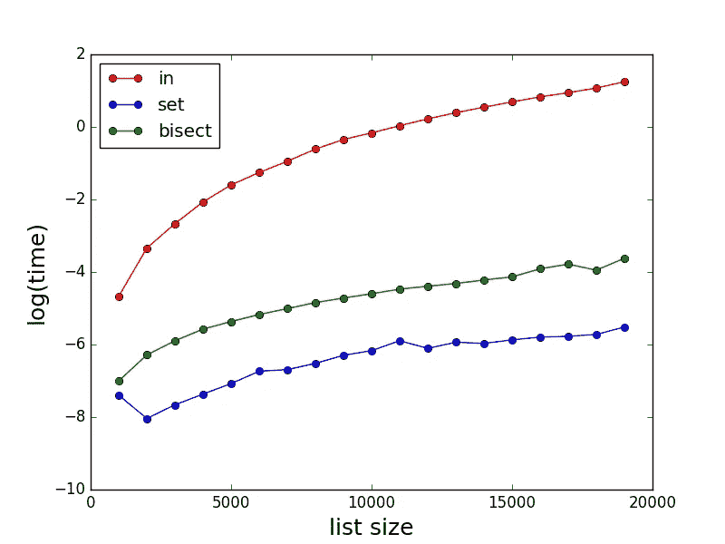

# 18 种常见的 Python 反模式，我希望我以前就知道

> 原文：<https://towardsdatascience.com/18-common-python-anti-patterns-i-wish-i-had-known-before-44d983805f0f?source=collection_archive---------0----------------------->

## 你可以从阅读糟糕的代码中学到和阅读好的代码一样多的东西

在 [Unsplash](https://unsplash.com?utm_source=medium&utm_medium=referral) 上[的照片](https://unsplash.com/@ffstop?utm_source=medium&utm_medium=referral)

我已经用 python 编码六年多了，直到现在，我还在学习新的概念和良好的实践来提高我的代码质量。

刚开始时，弄清楚如何做事并不容易:我不得不艰难地学习。

> 在这篇文章中，我决定列出 18 个反模式和最糟糕的 python 实践，我希望我以前就知道:**这可能会节省你一些时间，让你在调试项目时加快速度。**

这个列表是基于与 python 开发人员、编程专家的讨论以及对 Reddit [线程](https://www.reddit.com/r/Python/comments/p0buwf/what_are_the_worst_python_antipatterns_you/)的深入研究。
但这不是一个详尽的列表:如果你想更深入地挖掘这个话题(一个有趣的话题，我发誓),我在最后提供了一些链接。

现在让我们看一看🚀

# 在开始之前，什么是反模式？

[反模式](http://en.wikipedia.org/wiki/Anti-pattern)是软件开发中某些被认为是糟糕的编程实践的模式。

与[设计模式](http://en.wikipedia.org/wiki/Design_pattern_(computer_science))相反，设计模式是解决常见问题的常见方法，已经被形式化，并被普遍认为是一种良好的开发实践，反模式则相反，不受欢迎。

反模式使得代码难以阅读，难以维护，速度慢，过度设计，不稳定，容易出错，并有潜在的安全问题。

引入反模式有很多原因:

*   缺少代码审查
*   当简单的事情可能达到目的时，愿意尝试“酷”的东西
*   没有使用正确的工具(遵循 PEP8 约定的代码链接器和格式化器、文档字符串生成器、支持自动完成的 ide 等等)
*   或者只是不知道更好的选择，只要你学习和成长，这是好的

反模式可以分为一个或多个类别:

1.  **正确性**:反模式会破坏你的代码或者让它做错误的事情。
2.  **可维护性**:使你的代码难以维护或扩展的反模式。
3.  可读性:反模式会使你的代码难以阅读或理解。
4.  **性能**:会不必要地降低代码速度的反模式。
5.  **安全**:会给你的程序带来安全风险的反模式

现在让我们看看这 18 个反模式的列表。他们中的一些人将属于一个或多个类别。

# **1 —使用非显式变量名**

你的变量名应该总是描述性的，以提供一个最小的上下文:变量名应该用文字告诉你变量代表什么。

这使得代码对于其他开发人员来说更容易理解，对于您来说也更容易调试。

小费👉:不要害怕使用长变量名来进行描述:现代的 ide 如 [VSCode](https://code.visualstudio.com/) 和 [Pycharm](https://www.jetbrains.com/fr-fr/pycharm/) 提供了快速的自动完成功能。

# 2-忽略注释

未记录的代码是一场噩梦。这些人可能会抱怨:

*   6 个月后你会忘记为什么要写那行代码
*   你的任何同事谁将接管这个项目

代码应该总是清楚它在做什么，注释应该阐明你为什么这样做。同时，注释代码时要简洁。当您的代码不言自明时，就不需要注释。

小费👉:如果您正在使用 VSCode，那么您可以使用这个[扩展](https://marketplace.visualstudio.com/items?itemName=njpwerner.autodocstring)来加速生成 docstrings，它会自动为您的类和函数生成一个注释模板。

作者图片

# **3 —忘记更新评论**

与代码相矛盾的注释比没有注释更糟糕。

这种情况发生的比你想象的更频繁:当你很匆忙，不得不修复一个损坏的产品代码时，你会没有时间去更新旧的注释。

一个过时的注释会误导每个从事代码工作的人。

总有时间更新评论。

# 4-在函数名中使用 CamelCase

这更多的是一种约定:PEP 8 风格指南建议函数名应该总是小写，单词之间用下划线隔开。

# 5-不直接迭代迭代器的元素

这是一种非常常见的反模式。如果不需要的话，不一定需要在迭代器中迭代元素的索引。您可以直接迭代元素。

这使得你的代码更有 pythonic 风格。

# 6-当您同时需要元素及其索引时，不使用枚举

当在迭代器上迭代时需要同时访问一个元素及其索引时，使用`enumerate`。

# 7-不使用 zip 迭代列表对

`zip`是一个有用的内置函数，它允许你从两个迭代器中创建一个元组列表。每个元组的第一个元素来自第一个迭代器，而第二个元素来自第二个迭代器。

如果您想同时迭代两个或更多迭代器，那么`zip`会很有帮助。

# 8-读取或写入文件时不使用上下文管理器

当你在没有上下文管理器的情况下使用`open`时，在你关闭文件之前发生了一些异常(当你以这种方式打开一个文件时，关闭文件是你必须记住的)，内存问题可能会发生，文件可能会在这个过程中被破坏。

当您使用`with`打开一个文件并且发生异常时，Python 保证该文件是关闭的。

# 9-使用 in 检查元素是否包含在(大)列表中

对于大型列表，使用 in 语句检查列表中是否包含元素可能会很慢。请考虑改用 set 或等分。

以下是三种方法的比较:

图片由作者修改

→来源: [StackOverflow](https://stackoverflow.com/questions/7571635/fastest-way-to-check-if-a-value-exists-in-a-list)

# 10-将可变默认参数传递给函数(即空列表)

python 中有一件有趣的事情，可能会导致无声的错误和模糊的错误:默认参数在函数定义时计算一次，而不是每次调用函数时都计算。

这意味着，如果您使用一个可变的默认参数(比如一个 list)并对其进行变异，那么您将会并且已经变异了该对象，以便将来调用该函数。

为了避免这个问题，您可以将默认参数`to`设置为 None:

*   如果`to`设置为“无”的函数被调用多次，则创建一个新的空列表，每次都将元素追加到该列表中
*   当您将一个列表传递给`to`时，您向它追加了一个元素。因为它不是默认的函数参数，所以运行良好。

# 11-在单个函数中返回不同类型

当试图处理可能产生错误的特殊用户输入时，有时可以引入 None 作为输出。这使得您的代码不一致，因为您的函数现在至少返回两种类型:您想要的初始类型和非类型类型。

这使得以后很难测试和调试。

您可以引发一个错误并在以后捕获它，而不是返回 None。

# 12-当简单的 for 循环可以达到目的时，使用 while 循环

如果事先已经知道迭代次数，就不需要使用 while 循环。

# 13-使用堆栈和嵌套 if 语句

堆叠和嵌套的 if 语句很难理解代码逻辑。

除了嵌套条件，您还可以用布尔运算符将它们组合起来。

# 14-使用全局变量

避免像瘟疫一样的全局变量。它们是许多错误的来源。可以从程序的多个部分同时访问它们，这可能会导致错误。

使用全局变量时出现的典型错误是，当一个函数在另一个函数需要正确更新之前访问它的值。

# 15-不使用 get()从字典中返回默认值

当您使用`get`时，python 会检查字典中是否存在指定的键。如果是，那么`get()`返回那个键的值。如果键不存在，`get()`返回第二个参数中指定的值。

# 16-使用没有意义地处理异常的 try/except 块

应该避免使用 try/except 块并通过传递它来忽略异常(例如)。

# 17 —自豪地键入:从模块导入*

导入应该总是特定的。从模块中导入*是一个非常糟糕的做法，会污染名称空间。

# 18—过度设计一切

你并不总是需要上课。简单的函数可能非常有用。

类通常有方法，这些方法是与特定类相关联的函数，并且做与类相关联的事情——但是如果你想要做的只是做一些事情，那么函数就是你所需要的。

本质上，类是一种将函数(作为方法)和数据(作为属性)组合成一个围绕某种事物的逻辑单元的方式。如果不需要那种分组，那就没必要编课。

# 感谢阅读🙏

我希望这对你有用。如果你知道其他流行的 python 反模式，欢迎在评论中给我指出来。

祝你黑客愉快，下次再见👋

照片由[卡斯滕·温吉尔特](https://unsplash.com/@karsten116?utm_source=medium&utm_medium=referral)在 [Unsplash](https://unsplash.com?utm_source=medium&utm_medium=referral) 上拍摄

# 资源:

*   [https://docs . quantified code . com/python-anti-patterns/index . html](https://docs.quantifiedcode.com/python-anti-patterns/index.html)
*   [https://deepsource.io/blog/8-new-python-antipatterns/](https://deepsource.io/blog/8-new-python-antipatterns/)
*   [https://github.com/quantifiedcode/python-anti-patterns](https://github.com/quantifiedcode/python-anti-patterns)
*   [https://docs . python-guide . org/writing/gotchas/# mutable-default-arguments](https://docs.python-guide.org/writing/gotchas/#mutable-default-arguments)
*   [https://docs . python-guide . org/writing/gotchas/# mutable-default-arguments](https://docs.python-guide.org/writing/gotchas/#mutable-default-arguments)
*   [https://towards data science . com/data-scientists-your-variable-names-are-worthy-heres-how-to-fix-them-89053d 2855 b](/data-scientists-your-variable-names-are-awful-heres-how-to-fix-them-89053d2855be)

# 新到中？你可以订阅每月 5 美元，并解锁无限的文章——[点击这里。](https://ahmedbesbes.medium.com/membership)