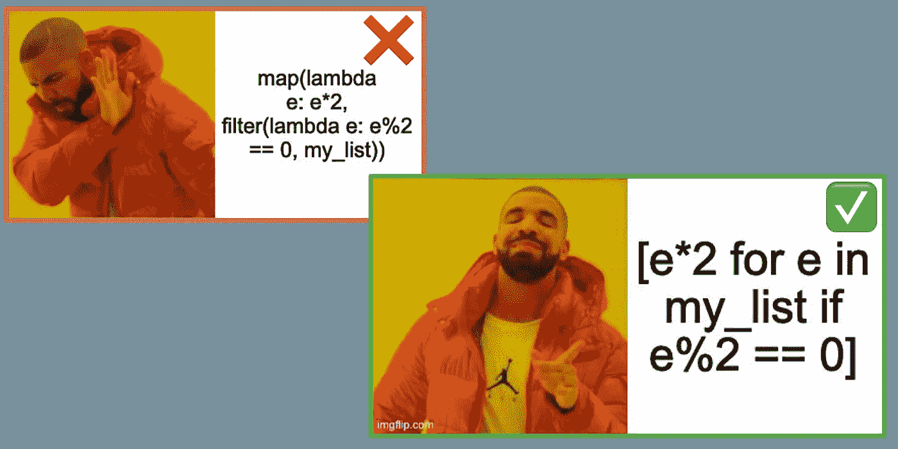
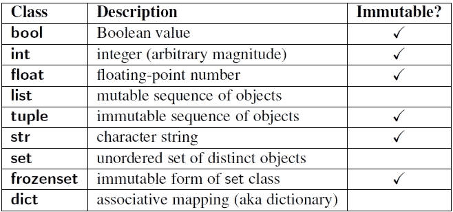

# 20 多个有用的 Python 语法模式，用于编写访谈

> 原文：<https://towardsdatascience.com/19-helpful-python-syntax-patterns-for-coding-interviews-3704c15b758f?source=collection_archive---------3----------------------->

## 通过学习 Python 中这些常见的编码面试模式，在面试中获得更多自信并节省时间



第一课:使用列表理解！

在现实生活中编码时，我有时会忘记语法，需要求助于 Google。遗憾的是，这种奢侈在编码面试中是没有的。为了解决这个问题，我一直在回顾 Python 中用于编码面试的常见语法模式。语法并没有理解核心算法和数据结构概念那么重要，但是对我来说，回顾语法可以给我的代码注入信心，并为我节省宝贵的时间。我希望它对你也一样。

# 第 1 部分:列表

## 1.整理

*   `sorted(numbers)`将按升序返回排序后的数字，并保持原始数字不变。你也可以使用`numbers.sort()`,它对数字进行就地排序，并对`numbers`进行就地变异
*   `sorted`有两个可选参数，`key`和`reverse`。`key`允许您修改用于比较的值。所以`sorted(..., key=str.lower)`排序不区分大小写。`reverse`让你按降序排序，所以`sorted(..., reverse=True)`是降序。
*   `sorted`使用具有`O(nlogn)`平均和最坏情况时间复杂度的 Timsort，使用`O(n)`空间(类似于合并排序)，具有最好情况`O(n)`时间复杂度(类似于插入排序)。

## **2。列表切片语法**

*   一般语法是`iterable[start:stop:step]`
*   `list[i:j]`从索引`i`返回，直到**但不包括** `j`
*   `list[i:]`从索引`i`开始返回，直到结束
*   `list[:j]`从起点返回，直到指数`j`
*   `list[::2]`返回列表中的所有其他元素(索引`0, 2, ..`
*   `list[::-1]`反转列表— [虽然 list.reversed()更快](https://www.geeksforgeeks.org/python-reversed-vs-1-which-one-is-faster/)


列表切片的真实演示

## 3.列表理解(即 Pythonic 地图和过滤器)

*   通用语法是`expression for member in iterable [if conditon]`
*   例如，`[element * 2 for element in list if element % 2 == 0]`将返回一个新列表，其中每个偶数元素都是原始列表的两倍
*   用这个代替`map`和`filter`以获得更好的可读性

## **4。使用范围**

*   一般语法是`range(start, stop, step)`
*   `range(n)`用于从`0`到`n — 1`的迭代
*   `range(i, j)`适用于从`i`到`j`的迭代，但不包括`j`
*   `range(i, j, n)`同上，但每第 n 个元素。请注意，如果您想使用`step` — `range(10, step=2)`会导致错误，那么请改为使用`range(0, 10, 2)`—阅读[此](https://stackoverflow.com/questions/15875188/the-strange-arguments-of-range)以了解关于为什么`range`不支持关键字参数的更多信息

## **5。创建大小为 N 的列表**

*   你可以使用 range 并转换成一个列表(例如，如果你喜欢的话，可以使用`list(range(N))`或`[*range(N)]`)
*   对于所有相同的元素使用`[element] * N`
*   例如，`[0] * 10`是 10 个零的列表，`[None] * 5`是 5 个零的列表`Nones`
*   对于 2 维或更多维，**不要**做`[[0] * 5] * 10`。这 10 行只是对具有 5 个值的一行的引用，因此编辑一行将会改变其他 9 行。反而做，`[[0 for i in range(5)] for j in range(10)]`。

# **第 2 部分:迭代**

## **6。使用枚举**

```
# Use enumerate to get index and element
# from an iterable
for index, element in enumerate(list):
  print(element + ' is at index ' + str(index))
```

## [7**。**](https://www.educative.io/edpresso/how-to-emulate-a-do-while-loop-in-python) 如何写一篇‘边做边看’

像其他语言一样的陈述—

```
do {
  # Write code here
} while (condition)
```

这是用 Python 写的吗(不是我最喜欢的语法，但有时需要这样做)—

```
while True:
  # Write code here
  if condition:
    break
```

## 8.如何使用发电机

我发现生成器在查找任何图类型结构的 DFS 或 BFS 问题的邻居时最有用。以 [Leetcode 200 —岛屿数量](https://leetcode.com/problems/number-of-islands/)为例。我们可以创建一个返回生成器的`getNeighbors`辅助函数。这看起来像

```
def numIslands(grid) -> int:        
 **def getNeighbors(i, j):
    for di, dj in [(1, 0), (-1, 0), (0, 1), (0, -1)]:
      ni, nj = i + di, j + dj
      if 0 <= ni < len(grid) and 0 <= nj < len(grid[i]):
        yield ni, nj**

  def dfs(i, j):            
    grid[i][j] = "-1"
    **for new_i, new_j in getNeighbors(i, j):**
      if grid[new_i][new_j] == "1":
        dfs(new_i, new_j)

  islands = 0
  for i in range(len(grid)):
    for j in range(len(grid[0])):
       if grid[i][j] == "1":
         islands += 1
         dfs(i, j)

  return islands
```

# 第三部分。高阶函数

## 9.使用列表理解，而不是“映射”或“过滤”

```
list = list(range(10)) # [0, 1, ..., 9]**# Not very Pythonic 👎** evens = filter(lambda x : x % 2 == 0, list) # [0, 2, ..., 8]
evens_doubled = map(lambda x : x*2, events) # [0, 4, ..., 16]**# Using list comprehension is Pythonic 👍** evens_doubled = [x*2 for x in list if x % 2 == 0]
```

## 10.谨慎使用 reduce

谨慎使用 reduce—`sum`、`math.prod`、`all`和`any`可读性更好，值得为比这更复杂的东西编写一个可读性更好的`for`循环。[连 Guido(Python 的创造者)自己都这么想](https://www.artima.com/weblogs/viewpost.jsp?thread=98196)，这也是 reduce 被从内置库降格为`functools`库的原因。


倒一个出来做内置还原

尽管如此，还是很高兴知道。语法是`functools.reduce(function, iterable[, initializer])`。下面是一些例子

```
from functools import reduce
nums = [1, 2, 3, 4, 5]
bools = [True, False, True, False, True]# sum
reduce(lambda a, b: a + b, nums, 0) # 15# math.prod
reduce(lambda a, b: a * b, nums, 1) # 120# min
reduce(lambda a, b: a if a < b else b, nums) # 1# max
reduce(lambda a, b: a if a > b else b, nums) # 5# any
reduce(lambda a, b: a or b, bools) # true# all
reduce(lambda a, b: a and b, bools) # false
```

## 11.使用 zip、zip_longest 和 zip_shortest

`zip`让你同时遍历列表

```
list_a = [1, 2, 3, 4]
list_b = [10, 20, 30, 40]list_sum = [a + b for a, b in **zip(list_a, list_b)**]
# OR
list_sum = []
for a, b in zip(list_a, list_b):
  list_sum.append(a + b)print(list_sum) # [11, 22, 33, 44]
```

对于长度不等的列表，`zip`将输出截断为最短的列表。`itertools`库中的`zip_longest`让你用一个`fill_value`填充较小的列表，这样你就可以`zip`好像它们是等长的。

```
from itertools import zip_longest, zip_shortestshort = [1, 2]
long = [10, 20, 30, 40]zip_short = [a + b for a, b in **zip(short, long)**]
print(zip_short) # [11, 22]
zip_long = [a + b for a, b in **zip_longest(short, long, fillvalue=0)**]
print(zip_long) # [11, 22, 30, 40]
```

# 第四部分。数据结构

## 12.Python 字典方法

*   要检查一个关键字是否在字典中，使用`key in my_dict`
*   `my_dict[key]`访问字典中的一个条目，如果字典中没有这个键，则返回一个`KeyError`。为了避免错误，使用`my_dict.get(key, default_value=None)`,如果键不在字典中，它将返回`default_value`而不是错误
*   如果您知道`key`在`my_dict`中，那么使用`del my_dict[key]`从字典中删除一个键。否则，使用`my_dict.pop(key, None)`，如果`key`不在`my_dict`中，它将返回`None`
*   `my_dict.setdefault(key, default_value)`如果在`my_dict`中则返回`key`的当前值，如果不在，则设置为`default_value`并返回
*   `setdefault`对于计算元素来说**特别有用**，你可以做类似`counts[element] = counts.setdefault(element, 0) + 1`的事情
*   `my_dict.keys()`、`my_dict.values()`和`my_dict.items()`将分别从字典中返回`(key, value)`的键、值和元组的列表(这些有助于迭代)
*   您可以使用字典理解来创建新的字典，就像列表理解一样

```
my_basket = {'apple': 2, 'banana': 3, 'starfruit': 1}
double_my_basket = {k:v*2 for (k, v) in my_basket.items()}
print(double_my_basket) # {'apple': 4, 'banana': 6, 'starfruit': 2}
```

*   对于集合和字典，您可以分别使用合并和更新操作符`|`和`|=`来添加键和值(仅适用于 Python 3.9 版的字典)

```
a = {1, 2, 3} # New set
a += {4} # ❌ Returns a `TypeError`
a |= {4} # ✅ {1, 2, 3, 4}
```

## 13.使用 OrderedDict

*   `OrderedDict`不经常使用，但是它可以使一些问题变得微不足道，例如[实现 LRU 缓存](https://leetcode.com/problems/lru-cache/)。一个`OrderedDict`实际上是一个结合了双向链表的字典，用于排序
*   `OrderedDict`有一个`.popitem()`方法，可以让你以后进先出的顺序移除物品(`popitem(last=False)`会以先进先出的顺序移除物品)。
*   另外`.move_to_end(item_key)`让我们将一个条目移动到字典的末尾(这样它可以在下一个弹出)。`.move_to_end(item_key, last=False)`让您将项目移到开头。

## 14。使用集合。计数器

*   通常，面试问题涉及到向散列图添加计数。为此，您可以像下面这样使用`collections.Counter`。一个`Counter`是一个`dict`的子类，你可以像它是一个子类一样与之交互。

```
things = ['a', 'a', 'b', 'c', 'b', 'b']
counts = collections.Counter(things)
print(counts) # Counter({'b': 3, 'a': 2, 'c': 1})
```

## 15。使用 heapq

*   不要用`queue.PriorityQueue`，`heapq`更灵活
*   通读[官方 heapq 文档](https://docs.python.org/3/library/heapq.html)——下面的一些标注
*   `heapify`就位，那么`heapify(list)`就会把`list`变成一堆
*   `heapq`仅支持最小堆，对于最大堆，在堆之前将所有值乘以`-1`，在弹出后乘以`-1`(我知道这很烦人)
*   如果你想为对象创建一个堆，你应该用`(priority, counter, object)`把它们作为一个元组添加。`counter`是一个唯一的数字，用于打破优先级的界限(否则会出现错误)。我从 0 开始`counter`,每当我压入堆时就递增。

## 16.实现树

*   在 [Python 的标准库](https://docs.python.org/3.9/library/index.html)中没有任何有助于面试的树形数据结构，所以你需要实现你自己的
*   对于二叉树，可以创建一个具有左右节点属性的节点类。确保跟踪代码中的“头”节点。
*   对于非二叉树，可以为子树使用数组或字典。如果您不希望孩子有重复的值，并且想要`O(1)`查找，字典可能会更好。

```
# Binary Tree Node
class Node:
  def __init__(value):
    self.value = value
    self.left = None
    self.right = None# Non-Binary Tree Node
class Node:
  def __init__(value):
    self.value = value
    self.children = [] # or self.children = {} for dict
```

## **17。实施 Trie**

*   Python 的标准库中没有 Trie，但是您可以很容易地实现一个。这里有一个只有`insert`和`search`功能的，你可以在此基础上构建额外的功能。

```
class TrieNode:
    def __init__(self):
        self.is_complete_word = False
        self.children = {}class Trie:
    def __init__(self):
        # Blank Trie
        self.root = TrieNode()

    def insert(self, word: str) -> None:
        """
        Insert a word:
        — Iterate through all characters in the word
        - If we we encounter a char we don't have a
          node for, create a new node
        - Mark the last node as a complete word
        """
        curr = self.root
        for char in word:
            curr = curr.children.setdefault(char, TrieNode())    
        curr.is_complete_word = True

    def search(self, word: str) -> bool:
        """
        Search for a word:
        — Iterate through all characters in the word
        - If we we encounter a char we don't have a
          node for, return False
        - At the last node, return whether the word
          is a complete word in our Trie
        """
        curr = self.root
        for char in word:
            if char not in curr.children:
                return False
            curr = curr.children[char] 
        return curr.is_complete_word
```

# 第 4 部分:递归和动态编程

## 18.使用装饰器来记忆

只需添加`@cache`装饰器

```
# No memoization O(2**N) time complexity
def fib(n):
  return fib(n - 1) + fib(n - 2) if n > 1 else n# Memoized, now O(N) time complexity
**from functools import cache
@cache**
def fib(n):
  return fib(n - 1) + fib(n - 2) if n > 1 else n# Similar to doing this
memo = {}
def fib(n):
  return memo.setdefault(n, fib(n - 1) + fib(n - 2) if n > 1 else n)# You can limit the memo size to N
# using lru_cache (here N = 64)
**from functools import lru_cache
@lru_cache(64)**
def fib(n):
  return fib(n - 1) + fib(n - 2) if n > 1 else n
```


谁知道记忆这么容易！

## 19.使递归程序迭代

这里有一个使用制表(`O(n)`空间复杂度)制作迭代斐波那契函数的例子。

```
def fib(n):
  fibs = [None] * n
  fibs[0], fibs[1] = 0, 1
  for i in range(2, n):
    fib[i] = fib[i - 1] + fib[i - 2]
  return fib[i]
```

这里有一个`O(1)`空间复杂度版本。

```
def fib(n):
  if n <= 1:
    return n
  first, second = 0, 1
  for i in range(2, n + 1):
    first, second = second, first + second
  return second
```

另一个让程序迭代的方法是创建你自己的栈。【StackOverflow 的这个回答很好地解释了为什么。

# **第四部分:杂项**

## 20.三元 if 运算符

*   其他语言中的`condition ? a : b`是 Python 中的`a if condition else b`

## 21。操作二进制字符串

*   通过切片去掉使用`bin`后烦人的`0b`前缀——比如`bin(7) = "0b111` so `bin(7)[2:] = "111"`
*   要将前导零添加到 N 位数，添加`2**N`，然后切片——例如，用零填充`111`，直到它的长度为 5 位数，执行`bin(2**5 + 7)[3:] = “00111”`(注意`2**N > num`可以工作)

## 22.可变对象与不可变对象

可变对象可以被改变，而不可变对象不能。这里列出了内置类型以及它们是否是不可变的。自定义类通常是可变的。



来源:[Python 的可变和不可变的一面](https://medium.com/@meghamohan/mutable-and-immutable-side-of-python-c2145cf72747)

这只是意味着您需要小心地从可变对象的现有变量中创建变量。您可能会无意中更改现有对象！

```
ones = [1] * 3
twos = ones
for i, _ in enumerate(twos):
  twos[i] = 2
print(twos) # [2, 2, 2]
print(ones) # Also [2, 2, 2]!
```

为了避免这种情况，您需要从变量创建一个副本。

```
ones = [1] * 3
**twos = list(ones) # Creates a copy instead**
for i, _ in enumerate(twos):
  twos[i] = 2
print(twos) # [2, 2, 2]
print(ones) # [1, 1, 1]**# or using list comprehension** twos = [2 for i in ones]
print(twos) # [2, 2, 2]
print(ones) # [1, 1, 1]
```

如果你有任何问题或额外的建议，请评论，祝你面试的人好运！