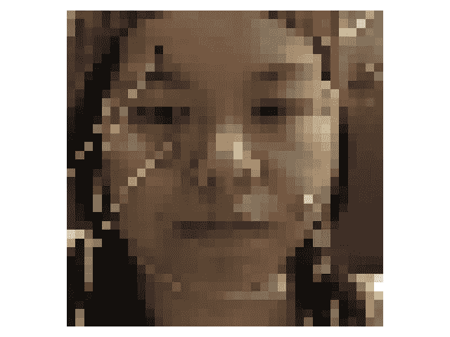

# 1x1 卷积:去神秘化

> 原文：<https://towardsdatascience.com/1x1-convolution-5219bbc09027?source=collection_archive---------9----------------------->

## 阐明了 1x1 卷积运算的概念，它出现在林等人的论文《网络中的网络》和 Google Inception 中

利亚姆·查默尔在 [Unsplash](https://unsplash.com?utm_source=medium&utm_medium=referral) 上的照片

不久前，我阅读了林等人的网络中的网络(NiN)论文，发现了一种特殊的卷积运算，它允许跨通道参数级联，通过汇集跨通道信息来学习复杂的交互作用。他们称之为“跨通道参数池层”(如果我没记错的话)，将它比作一种涉及与 1x1 卷积内核进行卷积的操作。

当时略读细节(就像我经常使用这种深奥的术语一样)，我从未想过我会写这个操作，更不用说提供我自己对其工作方式的想法了。但正如它所言，通常是术语看起来令人生畏，而不是概念本身；这点挺有用的！在完成了背景故事和效果暂停之后，让我们揭开这个奇特但多用途的 **1x1 卷积层的神秘面纱。**

# 1x1 卷积:

顾名思义，1x1 卷积运算涉及使用大小为 1x1 的滤波器对输入进行卷积，通常使用零填充，步长为 1。

举个例子，假设我们有一个(通用)卷积层，它输出一个形状为 ***(B，K，H，W)*** 的张量，其中 ***，***

*   ***B*** 代表批量。
*   ***K*** 是卷积滤波器或内核的数量
*   ***H，W*** 为空间尺寸，即高度和宽度。

> *此外，我们指定一个我们想要使用的过滤器大小，这是一个正方形过滤器的单一数字，即* ***size=3 意味着一个 3x3 过滤器*** *。*

用 ***F*** 滤镜将这个张量馈入我们的 1x1 卷积层(补零和步长 1)，我们将得到形状 ***(B，F，H，W)*** 的输出，将我们的滤镜维度从 ***K*** 改为 ***F.*** Sweet！

现在，根据 ***F*** 比 ***K*** 小还是大*，我们已经*减少或增加了*我们在过滤空间中输入的维度，而没有应用任何空间变换(您将看到)。所有这些都使用 1x1 卷积运算！*

但是等等，这和常规的卷积运算有什么不同呢？在常规卷积运算中，我们通常有一个较大的滤波器大小，比如一个 3x3 或 5x5(甚至 7x7)的内核，然后通常需要对输入进行某种填充，这又会将其空间维度 **H x W** 转换为某个**H’x W’；** capisce？如果没有，这里是我的文章链接，任何关于卷积网及其操作的澄清。

 [## 用于视觉识别的 CS231n 卷积神经网络

### 目录:卷积神经网络非常类似于以前的普通神经网络…

cs231n.github.io](https://cs231n.github.io/convolutional-networks/) 

# 好处？

在 CNN 中，我们经常使用某种池操作来对卷积输出的激活图进行空间下采样，以防止事情变得难以处理。难以处理的危险是由于生成的激活图的数量与 CNN 的深度成比例地急剧增加或放大。也就是说，网络越深，它生成的激活图数量就越大。如果卷积运算使用大尺寸的滤波器，如 5×5 或 7×7 滤波器，导致大量的参数，问题会进一步恶化。

> **理解:****滤波器**指的是作为卷积运算的一部分，以滑动窗口方式应用于输入的**内核**。另一方面,**激活图**是在输入图像上应用单个滤波器的输出结果。具有多个过滤器的卷积运算通常生成多个(堆叠的)激活图。

空间缩减采样(通过池化)是通过在每一步减少输入的高度和宽度，沿空间维度聚合信息来实现的。虽然它在某种程度上保持了重要的空间特征，但是在下采样和信息损失之间确实存在一种折衷。底线:我们只能在一定程度上应用池化。

1x1 卷积可用于解决这一问题，它提供基于过滤器的池化，充当投影层，跨通道池化(或投影)信息，并通过减少过滤器数量实现降维，同时保留重要的特征相关信息。

这在 Google 的 inception 架构中被大量使用(参考文献中的链接),他们陈述如下:

> 上述模块的一个大问题是，至少在这种幼稚的形式中，在具有大量滤波器的卷积层上，即使是适度数量的 5×5 卷积也可能非常昂贵。
> 
> 这导致了所提出的架构的第二个想法:在计算需求增加太多的地方明智地应用维度缩减和投影。这是基于**嵌入** : **的成功，即使低维嵌入也可能包含大量关于相对大的图像块的信息。**除了用作还原，它们还包括使用整流线性激活，这使它们具有双重用途。

在昂贵的 3x3 和 5x5 卷积之前，他们引入了使用 1x1 卷积来计算缩减。代替使用汇集的空间维度减少，可以使用 1x1 卷积在过滤器维度中应用减少。

**Yann LeCun** 提供了一个有趣的思路，他将 CNN 中的全连接层比作简单的卷积层，具有 1x1 卷积核和一个全连接表。参见 2015 年的这篇文章:

 [## 登录脸书

### 登录脸书，开始与你的朋友、家人和你认识的人分享和联系。

www.facebook.com](https://www.facebook.com/yann.lecun/posts/10152820758292143) 

# 履行

讨论了概念之后，是时候看看一些实现了，这对于一些基本的 PyTorch 经验来说是很容易理解的。

我复制 DeepPhys 项目的代码。作者代码

这里，我用 ***softconv*** 来表示 1x1 卷积。这是最近一个项目的代码片段，其中 1x1 卷积用于将信息投射到过滤器维度(本例中为 32 个维度)上，并将其汇集到一个维度中。这给我的用例带来了三个好处:

1.  将来自 32 个二维激活图(通过在输入上卷积前一卷积层的滤波器生成)的信息投影到单个激活图中(记住， ***softconv*** 层的输出具有滤波器 dim = 1)。为什么我需要这样一个投影，下面的图片解释了这一点。
2.  使用 1x1 卷积降低维度，允许控制计算需求。这是基于直觉和低维嵌入的成功，低维嵌入在自然语言处理领域中工作得相当好。
3.  在可视化将要学习的过滤器权重方面提供了更好的易处理性，即能够回答该层实际上对给定输入做了什么，以及理解什么模型正在学习。

> 此外， *tanh* 和 *sigmoid* 激活是实施细节，在本文中可以忽略。

为了让大家理解可能使用 1x1 卷积的想法，我提供了一个在 DEAP 情感数据集上训练的模型的示例用例，而没有深入研究许多细节。该模型被训练为从面部视频(图像)中预测心率信号。这里，使用 1×1 卷积层将来自 32 个滤波器(从先前的卷积中获得)的信息汇集到单个通道中，允许模型创建掩模，从而能够区分皮肤和非皮肤像素。这是一项正在进行的工作，但希望人们可以看到这里使用 1x1 卷积的意义。

面部图像被用作输入。来自 DEAP 数据集的影像

应用常规卷积层后 32 个滤波器的状态。图片作者。

从 softconv 层获得的输出，其中 32 个滤波器汇集成一个通道。作者图片

## 关键要点:

1.  ***1×1 卷积*** 可以被视为一种操作，其中在输入上应用***1×1×K***大小的滤波器，然后加权以生成 F 个激活图。
2.  ***F > K*** 导致滤波器尺寸增加，而 ***F < K*** 将导致滤波器尺寸减小的输出。F 值很大程度上取决于项目要求。减少维度可能有助于使事情更容易处理，并且可能有类似的用例使用 **1x1 卷积增加过滤器的数量**。
3.  理论上，使用这种操作，神经网络可以使用 **1x1 卷积**来“选择”要查看的输入“过滤器”，而不是强制乘以一切。

## ***参考文献:***

*【1】Stats stack exchange:*[*https://Stats . stack exchange . com/questions/194142/what-does-1x1-convolution-mean-in-a-neural-network*](https://stats.stackexchange.com/questions/194142/what-does-1x1-convolution-mean-in-a-neural-network)

*[2]林等著《谷歌盗梦空间架构:用回旋深化》*

*【3】文章:*[*https://iamaaditya . github . io/2016/03/one-by-one-convolution/*](https://iamaaditya.github.io/2016/03/one-by-one-convolution/)

*【4】*[*https://machinelingmastery . com/introduction-to-1x1-convolutions-to-reduce-the-complexity-of-convolutionary-neural-networks/*](https://machinelearningmastery.com/introduction-to-1x1-convolutions-to-reduce-the-complexity-of-convolutional-neural-networks/)

*[5]“DEAP:使用生理信号进行情感分析的数据库”，S. Koelstra，C. Muehl，M. Soleymani，J.-S. Lee，A. Yazdani，t .易卜拉希米，T. Pun，A. Nijholt，I .帕特雷，IEEE 情感计算汇刊，第 3 卷，第 1 期，第 18–31 页，2012 年*