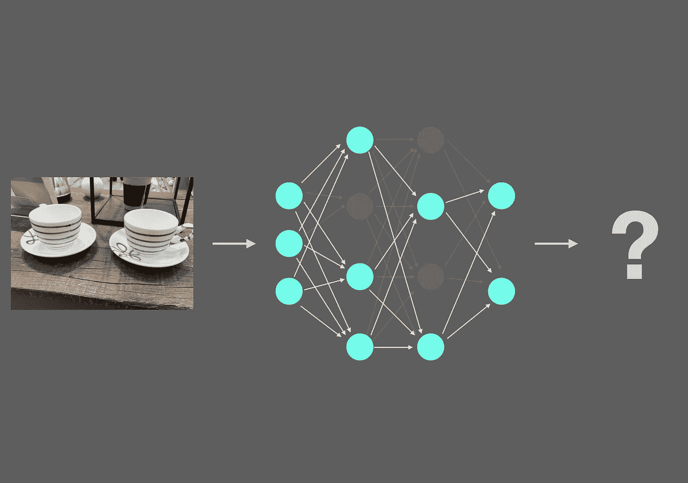
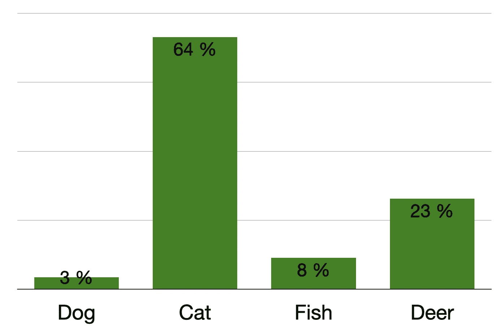
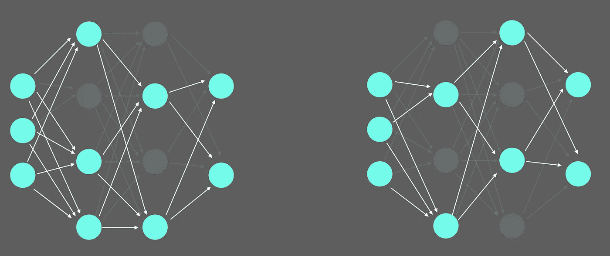
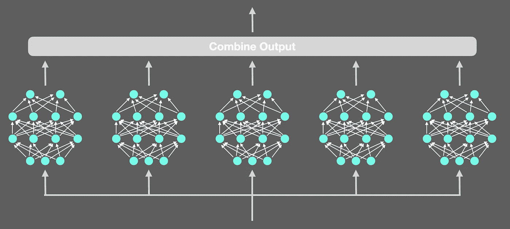
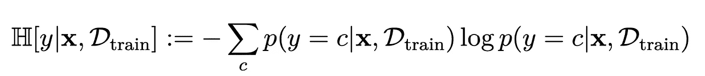

# 测量模型不确定性的两种简单方法

> 原文：<https://towardsdatascience.com/2-easy-ways-to-measure-your-image-classification-models-uncertainty-1c489fefaec8?source=collection_archive---------7----------------------->

## 更好地理解模型预测的关键

在这篇文章中，我们将介绍两种方法，让您获得模型的不确定性:**蒙特卡洛漏失和深度集成**。它们适用于各种各样的任务，但是在本文中，我们将展示一个关于**图像分类**的例子。它们都相对容易理解和实现，都可以容易地应用于任何现有的卷积神经网络架构(例如，ResNet、VGG、 [RegNet](https://medium.com/towards-data-science/regnet-the-most-flexible-network-architecture-for-computer-vision-2fd757f9c5cd) 等)。).为了帮助您快速轻松地应用这些技术，我将提供用 PyTorch 编写的这些技术的补充**代码。**



给定一个两个杯子的图像，你的预测模型有多大把握？图片作者。

在我们开始之前，让我们回顾一下测量模型不确定性的含义，以及它如何对您的机器学习项目有用。

# 什么是模型不确定性？

就像人类一样，机器学习模型可以在其预测中显示一定程度的信心。一般来说，当谈到模型不确定性时，要区分**认知不确定性和**随机不确定性。

**认知不确定性**是模型参数中表示的**不确定性，并捕捉关于最适合解释我们数据的模型的无知。这种类型的不确定性可以通过额外的训练数据**来减少，因此具有另一个名称**“可减少的不确定性”**。对于远离训练数据的输入，模型将传播高认知不确定性，而对于训练数据附近的数据点，模型将传播低认知不确定性。

**随机不确定性**捕捉环境固有的**噪声，即观测值。与认知不确定性相比，这种不确定性不能通过更多的数据来减少，但可以通过更精确的传感器输出来减少。**

第三种类型称为**预测不确定性**，它是模型输出中传递的不确定性。**预测不确定性可以结合认知不确定性和随机不确定性**。



4 类分类器的 softmax 输出示例。该值不适用于不确定性估计。图片作者。

如果你自己已经训练了简单的神经网络，那么最直观的要考虑的是你的模型的 **softmax 输出**，即你经常看到的作为模型预测结果显示的百分比值。

但是使用 **softmax 输出**作为模型不确定性的度量可能会产生误导，并且不是很有用。这是因为 softmax 函数所做的只是计算模型的不同激活值之间的某种“关系”。因此，您的模型可以在其输出层的所有神经元中具有**低激活值**和**仍然达到高 softmax 值**。这不是我们的目标。但值得庆幸的是，有多种更有效的技术来估计模型的不确定性，如蒙特卡洛剔除和深度集成。

# 为什么模型不确定性有用？

评估模型的不确定性有两个主要方面很有用:

首先是**透明度**。假设您正在构建一个应用于医学图像分析的机器学习模型。因此，使用您的工具的医生很大程度上依赖于它的能力来做出正确的诊断。如果你的模型现在做出一个预测，它实际上是高度不确定的，但确实将这一信息传达给了医生，那么对患者治疗的后果可能是致命的。因此，在判断模型的预测时，对模型的不确定性进行估计可以极大地帮助医生。

第二是显示出**改进的空间**。没有一个机器学习模型是完美的。因此，了解您的模型的不确定性和弱点实际上可以通知您对您的模型进行哪些改进。实际上有一门专门的学科叫做主动学习。假设您已经用 1000 幅图像和 10 个类训练了您的 ConvNet。但是你还有 9000 多张图片没有被标记。如果您现在使用训练好的模型来预测哪些图像最不确定，您只能标记这些图像并重新训练模型。已经表明，与这些图像的随机采样相比，这种类型的不确定性采样对于模型改进更加有效。

好了，足够的先决条件，让我们来看两个技术。

# 技巧 1:蒙特卡洛辍学

Monte Carlo Dropout，或简称为 MC Dropout，是一种在模型中使用 Dropout 层来创建模型输出变化的技术。



一种应用于神经网络的简化的漏失可视化。图片作者。

**脱层**通常在训练中用作 r **均衡技术。在网络向前传递的过程中，一些神经元以一定的概率**被**随机丢弃。已经证明这使得模型对于过拟合更加鲁棒。通常，这些脱落层在训练后被禁用，以便不干扰新图像的向前传递。因此，要使用这种技术，请确保在您的模型中至少实现了一个 dropout 层。这可能看起来像这样。**

```
import torch
import torch.nn as nn
import torch.nn.functional as F

class Model(nn.Module):
    def __init__(self):
        super().__init__()
        self.conv1 = nn.Conv2d(3, 6, 5)
        self.pool = nn.MaxPool2d(2, 2)
        self.conv2 = nn.Conv2d(6, 16, 5)
        self.fc1 = nn.Linear(16 * 5 * 5, 120)
        self.fc2 = nn.Linear(120, 84)
        self.fc3 = nn.Linear(84, 10)

        # Dropout layer defined with 0.25 dropout probability
        self.dropout = nn.Dropout(0.25)

    def forward(self, x):
        x = self.pool(F.relu(self.conv1(x)))
        x = self.pool(F.relu(self.conv2(x)))
        x = torch.flatten(x, 1)
        x = F.relu(self.fc1(x))
        x = F.relu(self.fc2(x))

        # Dropout applied
        x = self.dropout(x)

        x = self.fc3(x)

        return x

model = Model()
```

但是对于 MC 脱落，脱落层仍然被激活，这意味着神经元仍然可以随机脱落。这导致了模型的 softmax 结果的变化。要在推理或测试期间放弃，请使用以下代码:

```
for module in model.modules():
    if module.__class__.__name__.startswith('Dropout'):
        module.train()
```

现在辍学仍然适用，因为我们已经把所有辍学层进入训练模式！

假设我们现在想要获得一个图像上的**模型的不确定性。为此，**我们将不仅在图像上预测一次，而且多次**和**分析由多次向前传递**产生的不同输出。我建议**让模型在一张图像上预测 3 或 5 次**。我将在本文末尾讨论如何组合 3 或 5 个输出。**

# 技巧 2:深度合奏

估计模型不确定性的第二种技术利用了创建模型集合的优势。**不是使用一个模型并使用它预测 5 次，而是使用多个相同类型的模型，随机初始化它们的权重并根据相同的数据训练它们。**



多个神经网络集成的可视化，类似于深度集成方法。图片作者。

这也将产生模型参数的变化。如果模型被稳健地训练并且对图像是确定的，那么它将为每次向前传递输出相似的值。要初始化模型，最好将它们保存为模型列表:

```
# How many models do we want to have in our ensemble
n_ensemble = 5

# Initialize the ensemble
ensemble = [Model() for e_model in range(n_ensemble)]
```

初始化之后，所有模型都用相同的训练数据进行训练。**就像对于 MC 辍学生一样，3 或 5 个型号是一个不错的选择。**为了获得给定图像上的模型的不确定性，它通过集合中的每个模型，并且其预测被组合用于分析。

# 组合来自多个正向传递的模型输出

假设我们已经为 MC 丢失定义了 5 次前向传递，并且为深度集合定义了 5 个集合大小。**我们现在预计这些输出之间会有一些变化，显示出模型的不确定性。**为了得出不确定性的最终值，必须首先对这些输出进行叠加。该代码是一个示例，说明如何为 MC 辍学者实现这一目标:

```
import numpy as np

fwd_passes = 5
predictions = []

for fwd_pass in range(fwd_passes):
    output = model(image)

    np_output = output.detach().cpu().numpy()

    if fwd_pass == 0:
        predictions = np_output
    else:
        predictions = np.vstack((predictions, np_output))
```

首先，我们定义要执行的向前传递的次数，以及要保存所有预测的空列表。然后我们执行 5 次向前传球。第一个输出作为 numpy 结果数组的初始化，所有其他输出都堆叠在顶部。

这是具有相同基本原则的深度合奏的代码:

```
import numpy as np

predictions = []

for i_model, model in enumerate(ensemble):
    output = model(image)

    np_output = output.detach().cpu().numpy()

    if i_model == 0:
        predictions = np_output
    else:
        predictions = np.vstack((predictions, np_output))
```

现在我们已经合并了所有的输出，让我们看看如何从这些输出中计算模型的不确定性。

# 获得模型不确定性

为了简单起见，我们将使用预测熵来估计模型在给定图像上的不确定性。



给定 y(标签)、x(输入图像)、Dtrain(训练数据)、c(类别)、p(概率)的预测熵的数学公式。来源:[【1】](http://mlg.eng.cam.ac.uk/yarin/thesis/thesis.pdf)

一般来说，预测的不确定性告诉你你的模型看到这个图像有多“惊讶”。如果该值较低，则模型对其预测有把握。如果结果是高的，模型不知道它在图像中。

计算预测不确定性可以通过这段代码来实现，这段代码从前面接收了*预测*数组作为输入。

```
import sys
import numpy as np

def predictive_entropy(predictions):
    epsilon = sys.float_info.min
    predictive_entropy = -np.sum( np.mean(predictions, axis=0) * np.log(np.mean(predictions, axis=0) + epsilon),
            axis=-1)

    return predictive_entropy
```

等式中的ε防止除以 0，这在数学上没有定义。

好吧！现在，你有了一个图像的不确定度值。**如前所述，值越高，您的模型越不确定。**

# 包装它

在本文中，您已经学会了估计模型的不确定性。这种技术也可以应用到物体检测上，并且非常强大。虽然我希望这个故事让你对这个主题有了一个很好的初步了解，但还有很多东西需要发现。

**最后但同样重要的是，如果你想在高级计算机视觉领域更深入地探索，考虑成为我的追随者**。我试着每周发一篇文章，让你和其他人了解计算机视觉研究的最新进展。

参考资料:

[1]深度学习中的不确定性，Yarin Gal。[http://mlg.eng.cam.ac.uk/yarin/thesis/thesis.pdf](http://mlg.eng.cam.ac.uk/yarin/thesis/thesis.pdf)