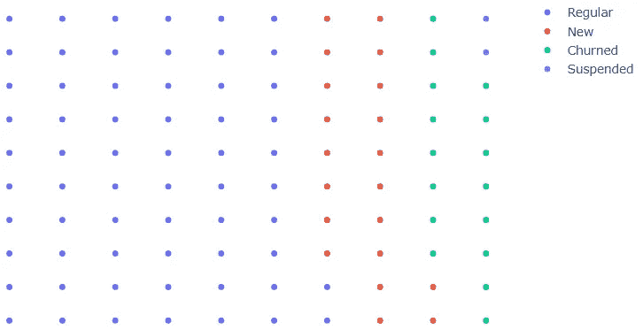
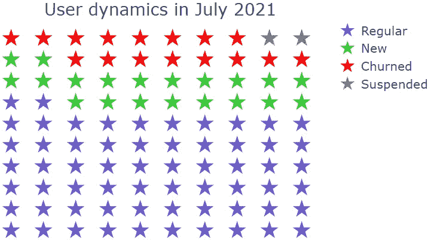
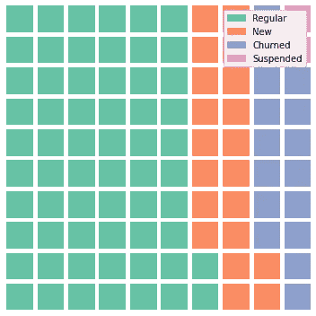
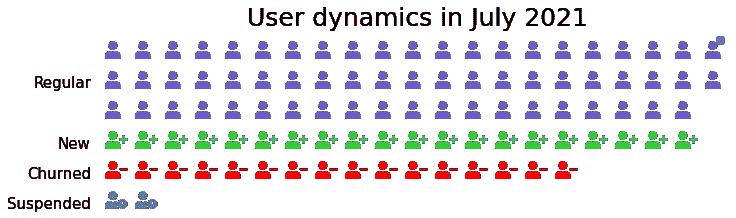

# 用 Python 创建精美象形图的两种有效方法

> 原文：<https://towardsdatascience.com/2-efficient-ways-of-creating-fancy-pictogram-charts-in-python-8b77d361d500?source=collection_archive---------27----------------------->

## 什么是象形图，何时使用，以及如何在 Plotly 和 PyWaffle 库中创建它们


作者图片

象形图使用排列在网格中的图标子集来说明相对较小的离散数据集的各个组成部分。每个图标代表整个数据集的一个单元(有时是 10 个、100 个等)。单位)，图标的每个子集—数据的相应类别。最佳实践是使用简单但有意义且直观易懂的图标，最好是对称形式，并避免部分图标。

当涉及到以一种更有影响力、更有说服力、更吸引人和更容易解释的方式向观众展示数据时，象形图是“无聊”条形图的一个很好的替代品。它们对于显示统计信息、医疗数据、比例或百分比、评级、进度状态、技能水平特别有效。

如何用 Python 创建象形图图表？在这篇文章中，我们将看看在一段时间内使用学习平台用户虚拟数据集的几种方法。比方说，我们有以下类型的用户:普通用户、新用户、变动用户和暂停用户:

```
import pandas as pd
dict_users = {'Regular': 62, 'New': 20, 'Churned': 16, 'Suspended': 2}
df = pd.Series(dict_users)
```

# [阴谋地](https://plotly.com/python-api-reference/)

*安装:* `pip install plotly`

其中一个方法是使用 Plotly 库，在[这个博客](https://blog.matteoferla.com/2019/10/pictograms-with-plotly-and-fontawesome.html)上，我找到了一个有趣的解决方案。下面是该代码的简化版本:

```
import plotly.graph_objs as go
num_rows = 10
row = 0
column = 0
data = []
for category, count in df.iteritems():
    rows = []
    columns = []    
    for _ in range(count):
        if row == num_rows:
            row = 0
            column += 1
        rows.append(row)
        columns.append(column)        
        row += 1
    data.append(go.Scatter(x=columns, y=rows, mode='markers', name=category))
fig = go.Figure(dict(data=data, layout=go.Layout(plot_bgcolor='white',
                                                 xaxis=dict(visible=False), 
                                                 yaxis=dict(visible=False))))
fig.show()
```



作者图片

标记的默认形式是一个圆形，Plotly 的默认颜色非常令人愉快。我们可以进一步定制这个图表，使它看起来更“象形”:更改标记的大小、颜色和形状，添加一个图标题并对齐它。可选地，可以改变类别的排列方向，使其水平(在我们的例子中，我们只需将`rows`分配给`x`，将`columns`分配给`y`)。让我们应用这些修改:

```
num_rows = 10
row = 0
column = 0
data = []
colors_list = ['slateblue', 'limegreen', 'red', 'grey']
colors = {df.index[i]:colors_list[i] for i in range(len(df))}
for category, count in df.iteritems():
    rows = []
    columns = []
    for _ in range(count):
        if row == num_rows:
            row = 0
            column += 1
        rows.append(row)
        columns.append(column)        
        row += 1
    data.append(go.Scatter(x=rows, y=columns, mode='markers', 
                           marker={'color': colors[category], 'symbol': 'star', 'size': 20},                        
                           name=category))
fig = go.Figure(dict(data=data, layout=go.Layout(plot_bgcolor='white',
                                                 xaxis=dict(visible=False), 
                                                 yaxis=dict(visible=False))))
fig.update_layout(title='User dynamics in July 2021', title_x=0.45, title_y=0.85, font=dict(size=18))
fig.show()
```



作者图片

现在，我们的图像一个真正的象形图。但是，仍有两个问题需要考虑:

*   标记形状(又名图标)的选择非常有限(你可以在[这个文档页面](https://plotly.com/python/marker-style/)上找到选项的完整列表)。正如我们在介绍中提到的，我们更喜欢以一种相关的、普遍可理解的形式来显示它们，比如当一个下雨的云图标代表下雨时。有一个变通办法是使用[字体牛逼图标](https://fontawesome.com/)代替标准符号，的确，在有原始代码的[博客](https://blog.matteoferla.com/2019/10/pictograms-with-plotly-and-fontawesome.html)中，我们可以找到它的解决方案。然而，这种解决方案虽然高效，却意味着要添加 JavaScript 代码，而且总的来说，看起来有点令人不知所措。
*   图表的交互性，通常反映了 Plotly 的一个奇特的方面，在这种情况下，似乎是多余的。仍然有可能禁用该功能(例如，[这篇文章](https://github.com/plotly/plotly.js/issues/15)可能有用)。与前一种情况一样，这意味着使代码更加复杂。

现在让我们考虑用 Python 创建象形图的第二种方法，看看这次代码是否会更简洁。

# [PyWaffle](https://pywaffle.readthedocs.io/en/latest/index.html)

*安装:* `pip install pywaffle`

这个库基于 matplotlib，也需要导入它。PyWaffle 的基本图是用正方形作为图标的华夫饼图:

```
from pywaffle import Waffle
import matplotlib.pyplot as plt
fig = plt.figure(FigureClass=Waffle, figsize=(5,5), values=dict_users, rows=10)
```



作者图片

虽然生成的图表(概念上)类似于我们在开始时用 Plotly 生成的图表，但创建它的代码似乎要简洁得多。为了使它看起来像一个真正的象形图，有一些调整适用，虽然:

*   显示有意义的图标，而不仅仅是方块。幸运的是，在这种情况下，我们有更多的自由:

a)使用`characters`参数，该参数接受长度与类别数量相同的一系列 [Unicode 字符](http://www.unicode.org/emoji/charts/full-emoji-list.html)。相反，如果我们想对所有类别使用相同的符号，使它们仅在颜色上有所不同，我们可以传入一个包含该字符的字符串。例如，`characters = '❤️'`会产生一个充满心形的象形图。

b)使用`icons`参数，该参数接受代表[字体牛逼图标](https://fontawesome.com/)的字符串列表。同样，这个列表的长度应该与类别的数量相同；或者，我们可以只分配一个字符串，让所有类别都有相同的图标。需要注意的是，在字体很棒的图标中，有不同的样式包含不同的图标集。默认情况下，样式是纯色的，但是我们也可以从常规、双色调、品牌和浅色中选择，为参数`icon_style`分配一个相应的字符串(全部是小写字母)，或者一个字符串列表，以防我们希望不同的类别有不同样式的图标。

*   更改类别颜色，使其更加直观。要调整颜色，一个选项是将颜色列表传递给参数`colors`，另一个选项是将离散的 matplotlib 颜色图分配给参数`cmap_name`。我们将使用第一种方法，并传递与上面第二个图表相同的颜色选择。
*   添加地块标题。创建华夫饼图形时，可以使用接受参数`matplotlib.pyplot.title`的参数`title`作为字典，或者直接使用`matplotlib.pyplot.title`。
*   将图例移向图表的侧面或下方。可以使用接受`matplotlib.pyplot.legend`参数的参数`legend`作为字典，或者直接使用`matplotlib.pyplot.legend`。

```
fig = plt.figure(FigureClass=Waffle,
                 figsize=(10,5),
                 values=dict_users,
                 rows=10,
                 colors=list(colors.values()),
                 icons=['user','user-plus', 'user-minus', 'user-clock'],
                 font_size=22,
                 icon_legend=True,
                 legend={'bbox_to_anchor': (1.55, 1), 'fontsize': 15, 'frameon': False})
plt.title('User dynamics in July 2021', fontsize=25)
plt.show()
```


作者图片

对于象形图，还有一些其他参数需要调整:

*   `starting_location` —设置开始第一个块的拐角。可能的值:`'SW'`(默认)、`'NW'`、`'NE'`和`'SE'`。
*   `vertical` —是否逐列绘制块，即水平放置类别(`vertical=False`，默认)，还是逐行垂直绘制(`True`)。
*   `block_arranging_style` —指定用图标填充象形图的方式。可以是`normal`(默认)、`snake`(从对面开始每一行，像个之字形)，也可以是`new-line`(每个类别从新一行开始)。要使最后一个选项起作用，需要分配或仅分配`columns`(而不是`rows`)与`vertical=True`组合，或者默认情况下仅分配`rows`离开`vertical`。

最后，如果 PyWaffle 的功能不足以满足我们的目的，我们可以考虑添加任何我们需要的 matplotlib 方法。

让我们修改之前的象形图，将每个类别从左上角开始放在新的一行上，并添加相应的文本注释，而不是图例:

```
fig = plt.figure(FigureClass=Waffle,
                 figsize=(9,7),
                 values=dict_users,
                 columns=21,
                 vertical=True,
                 starting_location='NW',
                 block_arranging_style='new-line',
                 colors=list(colors.values()),
                 icons=['user','user-plus', 'user-minus', 'user-clock'],
                 font_size=18)
plt.title('User dynamics in July 2021', fontsize=25)
fig.text(x=-0.095, y=0.562, s='Regular', fontsize=15)
fig.text(x=-0.057, y=0.441, s='New', fontsize=15)
fig.text(x=-0.105, y=0.382, s='Churned', fontsize=15)
fig.text(x=-0.135, y=0.323, s='Suspended', fontsize=15)
plt.legend([])
plt.show()
```



作者图片

# 结论

在本文中，我们探讨了什么是象形图，它们何时特别有用，以及如何使用 Plotly 和 PyWaffle 库在 Python 中创建它们。

感谢阅读！

你会发现这些文章也很有趣:

</how-to-fill-plots-with-patterns-in-matplotlib-58ad41ea8cf8>  <https://medium.com/geekculture/creating-toyplots-in-python-49de0bb27ec1>  </5-pandas-methods-youve-never-used-and-you-didn-t-lose-anything-37277fae7c55> 