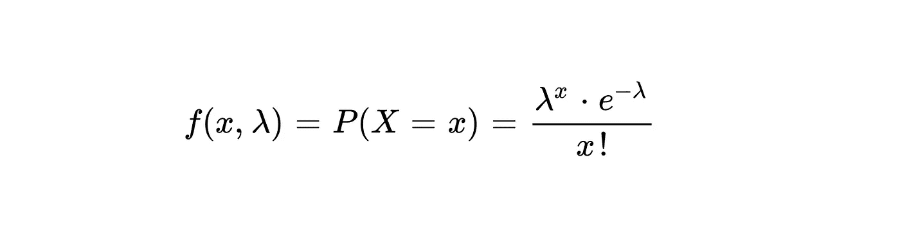
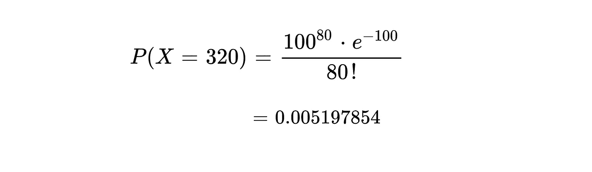
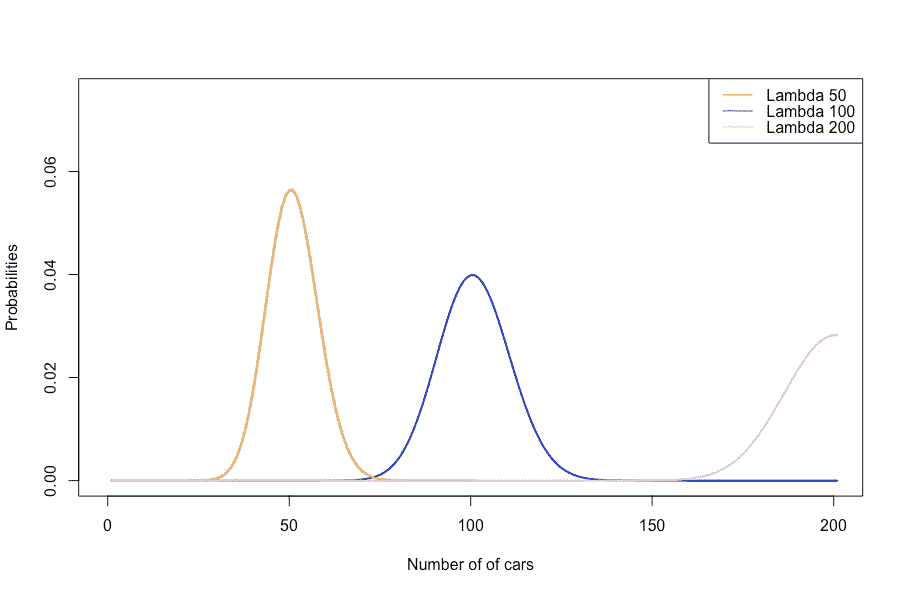
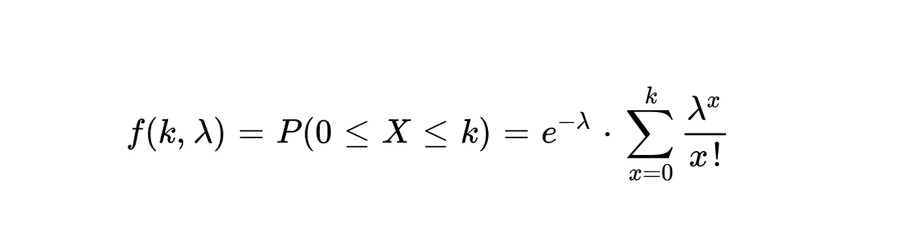
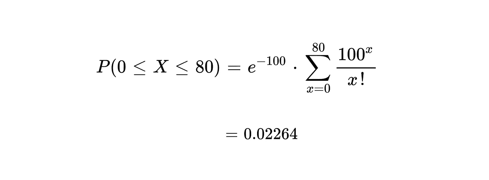

# 使用泊松分布之前你应该知道的 2 个函数

> 原文：<https://towardsdatascience.com/2-functions-you-should-know-before-using-poisson-distribution-d470db790bfc?source=collection_archive---------17----------------------->

## 概率分布

## 我们在哪里使用泊松分布？

[Marcin Jozwiak](https://unsplash.com/@marcinjozwiak?utm_source=unsplash&utm_medium=referral&utm_content=creditCopyText) 在 [Unsplash](https://unsplash.com/s/photos/distribution?utm_source=unsplash&utm_medium=referral&utm_content=creditCopyText) 上拍摄的照片

泊松分布依赖于在特定区域或区间发生的独立随机事件的数量。我们可以用它来计算某一特定事件在某一时间间隔内发生给定次数的概率。术语间隔通常是时间。比如 x 辆车在 13:00 到 14:00 之间穿越高速公路的数量的概率。在指定时间间隔内，停放在某个停车位的 x 辆车的数量的概率。这些是我们使用泊松分布得到概率值的例子。

根据泊松分布的这些使用案例，它看起来类似于[指数分布](/questions-that-you-can-answer-using-exponential-distribution-2af9da54dfd8)，但是有一个重要的点将它们彼此分开。与泊松分布不同，指数分布关注事件在一个间隔内发生的秒的概率。这是指数分布和泊松分布的区别。

## 泊松是如何计算的？

从分布中获取概率值有两种类型的函数:质量函数和密度函数。密度函数用于连续概率分布。质量函数用于离散概率分布。由于泊松分布是一个离散的概率分布，我们使用概率质量函数这一术语。那么，我们怎么知道泊松分布是离散的。如前所述，泊松发现特定事件发生的次数的概率。所以，次数不可能是 3.435 或者 1.123，可以是 5，1，12 这样的整数。这意味着服从泊松分布的变量的值应该是离散的。

公式 1 显示了泊松概率质量函数的公式。如你所见，有两个参数“x”和“lambda”。λ代表给定时间间隔内发生的平均事件数。一些资料来源也可以将该平均值表示为“mu ”,因为它是一个平均值。“X”值表示当平均事件数等于λ值时，该事件将发生的次数。

公式 1 —泊松分布的 PMF

让我们尝试解决一个示例概率问题，以了解如何使用泊松概率质量函数计算概率值。假设我们连续十天在下午 3 点到 4 点之间观测了博斯普鲁斯海峡大桥。我们记录了穿越的车辆数量。λ值应该是每天从桥上通过的车辆数量的平均值，为 10。假设，发现平均值是 100。我们想获得第二天下午 3 点到 4 点之间 80 辆车通过的概率。那么,“x”的值应该是 80。让我们把数字放在它们应该在的地方。

公式 2——泊松分布 PMF 的计算

如你所见，80 辆汽车通过的概率为 0.0051。这是一个非常低的概率，接近于零。这是因为我们发现正好有 80 辆车通过这座桥。所以获得这么低的概率很正常。那么,“x”的哪个值给出的可能性最大？为了理解“x”和“λ”之间的关系，可以参见图 1。

图 1-基于不同λ值的车辆通过概率的泊松分布。(图片由作者提供)

图 1 显示了基于三个不同 lambda 值的穿越车辆数量概率之间的差异(穿越车辆的平均数量)。当车辆数量等于λ值时，总是获得最高的概率。因此，随着车辆数量开始在两个方向上远离λ值，概率开始降低。然而，随着λ值的增加，平均概率值减小。这是因为在此期间可能会发生更多的事件。

> 注意:查看图 1 中的分布形状，泊松分布和正态分布可能看起来是相同的。然而，与正态分布不同，泊松分布的方差等于其均值。此外，正态分布是一个连续的概率分布。

## 累积分布函数

在前面的例子中，我们已经找到了正好 80 辆汽车从桥上通过的概率。也有可能从该桥找到多于或少于 80 个交叉点的可能性。这就是毒物分布的累积分布函数(CDF)所代表的。CDF 将每个事件的概率总和取值为“k”。可以看公式 3，了解泊松分布的 CDF 是做什么的。

公式 3 —泊松分布的 CDF

让我们找出当平均通行次数为 100 时，少于 80 辆车通过这座桥的概率。

公式 4——少于 80 辆汽车过桥的概率

概率值是 0.02264。意味着 15:00-16:00 之间过桥的车辆不可能少于 80 辆。如果我们从 1 中减去 0.02264，值 0.97736 给出了在 15:00 到 16:00 之间超过 80 辆车过桥的概率。

## 结论

泊松分布的例子通常取决于时间间隔。但是，也可以定义您的自定义范围。该范围也可以按地区划分。例如，落在 100 米田地上的雨滴数量或停在街道前 100 米的车辆数量。您可以使用泊松分布来寻找事件数量的概率，只要您设置一个覆盖事件发生的边界。

我也强烈推荐你去了解指数分布，了解 ED 和 PD 的区别。但是，您可能对特定事件在特定时刻发生的概率感兴趣。如果有，请看我另一篇关于指数分布的文章。

</questions-that-you-can-answer-using-exponential-distribution-2af9da54dfd8> 