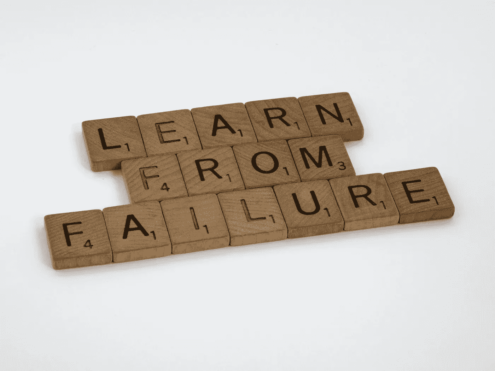

# 我在第一份数据科学家工作中犯的两个错误

> 原文：<https://towardsdatascience.com/2-mistakes-i-did-at-my-first-job-as-a-data-scientist-df02b03f833e?source=collection_archive---------17----------------------->

## 我们都从错误中学习

布雷特·乔丹在 [Unsplash](https://unsplash.com/s/photos/mistake?utm_source=unsplash&utm_medium=referral&utm_content=creditCopyText) 上的照片

我对数据科学的热情始于大约 3 年前。经过漫长而激动人心的学习之旅，我终于找到了第一份工作，成为一名数据科学家。我已经写了几篇文章来分享我的学习经历和让我得到理想工作的过程。

在这篇文章中，我将写下我作为数据科学家开始第一份工作后的经历。到目前为止，这是令人兴奋和有趣的，我很高兴我的职业生涯转向了数据科学。

然而，我也面临过一些挑战，犯过一些错误。犯一个错误是可以的，但是如果你犯了几次同样的错误，这可能会变成一个问题。因此，我们应该从错误中吸取教训。这就是我们如何能做得更好的方法。

正如我刚才提到的，我犯了一些错误，我已经从中吸取了教训。我想和你分享其中的两个，这样你可以在你的第一份工作中为这样的错误做好准备，或者你可以避免它们，这样更好。

## 没有花足够的时间准备数据

我们做零售分析。我被分配了一项任务，创建一个模型来查看某些功能和销售额之间的关系。关于模型的细节在这里并不重要。重点是我如何处理问题以及我遵循的步骤。

在我获得原始数据后，我做了一些数据清理和预处理。我还创建了一个我认为对模型很重要的附加特性。然后，我想我已经准备好做模型了。

我在模型创建上花了相当长的时间。我做了几次迭代，创建一个模型，评估它，并试图通过修改来改进。然而，最终结果是不可接受的。我无法创建一个如预期那样工作的模型。

然后，我又回到了探索性数据分析阶段。我在数据上花了更多的时间去理解它。我增加了几个新功能。通过回到数据探索阶段，我认识到我构建了一个具有错误特征的模型。

我的错误是没有在数据上花足够的时间。实际上，我知道模型构建中最重要的部分是很好地理解数据。然而，我却反其道而行之。这可能是由于我异常兴奋。

这是一个很好的经验教训。我永远不会忘记它。下次我被分配到类似的文本时，我一定会相应地组织我的计划和努力。

## 重复行

这是一个比前一个更具体的错误，并且有一个更简单的解决方案:只需检查重复项。

当我学习数据科学时，我通常使用一个数据集进行练习。因此，我不必经常使用连接、合并或串联操作。然而，在实际任务中，数据分散在许多表或数据框中，您需要执行许多操作来将所需的数据组合在一起。

我们的技术非常丰富。我在日常工作中经常使用 Python、SQL、R 和 PySpark。使用这些工具组合数据的功能和方法是相似的，但都有自己的语法。

我认为合并数据时最大的风险是创建重复的数据点(或行)。如果正确应用该函数，生成的数据框或表将不会有任何重复。但是，这个过程容易出错。因此，您需要格外小心，在脚本中放置重复的检查。

我的任务包括从许多不同的资源中收集数据。我忘了做重复检查。当我对生成的数据帧进行分析时，我意识到了这个问题。数量相差甚远。

即使你对你的代码有把握，额外的谨慎也没有坏处。添加一个副本可能会使您免于重复工作。

重复的数据点可能会导致严重的问题，尤其是当累积数量对您的案例很重要时。我建议多次检查数据框或表中的重复条目。与其从头开始做整个操作，不如做一个额外的控制。

## 结论

我们都会犯错。我在这篇文章中提到的是一些新手的错误。但是，这并不意味着只有新手或初级犯错误。这可能发生在你职业生涯的任何时候。结果可能会有所不同:)

重要的是花足够的时间去理解错误的根源，以便我们从中吸取教训。这样，你会比从教程或通过阅读来学习更好。

感谢您的阅读。如果您有任何反馈，请告诉我。