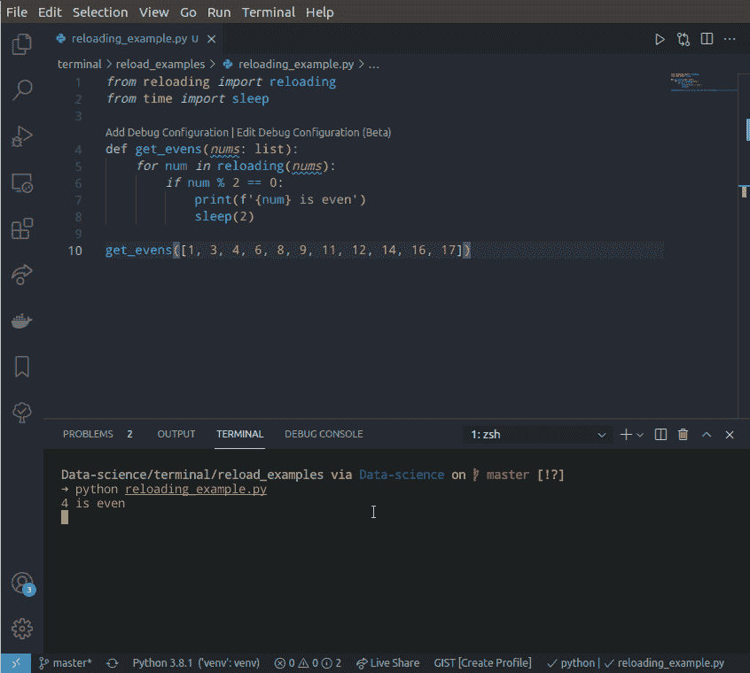
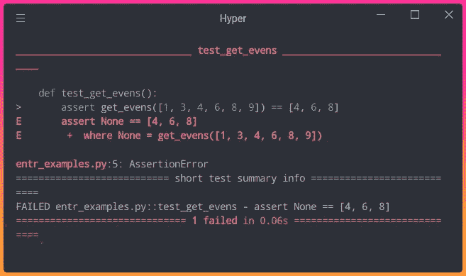
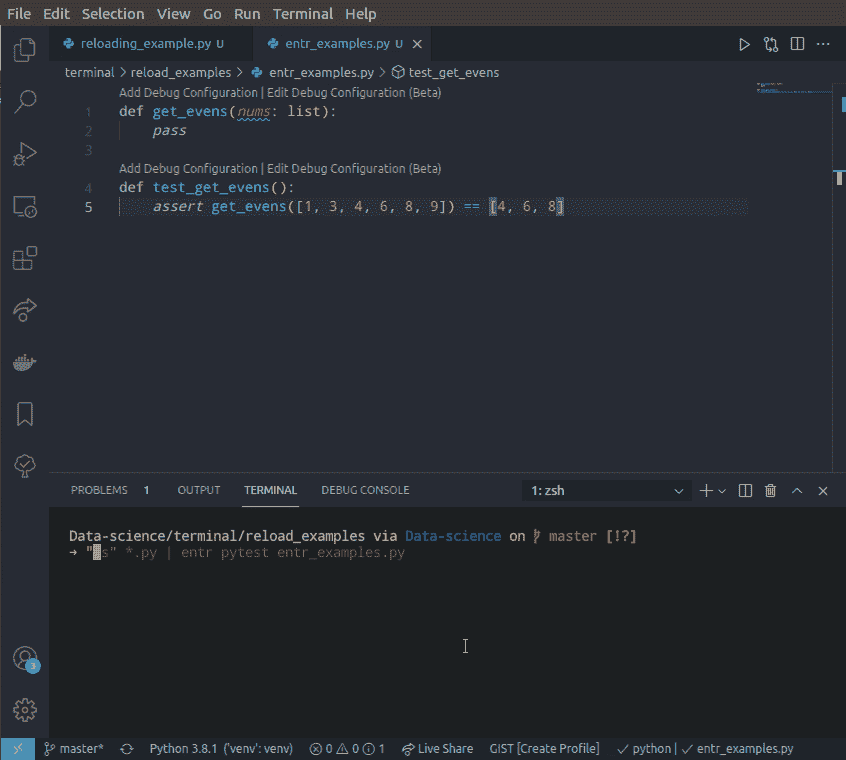
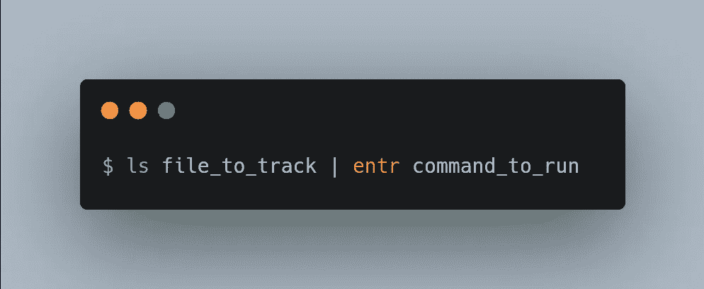
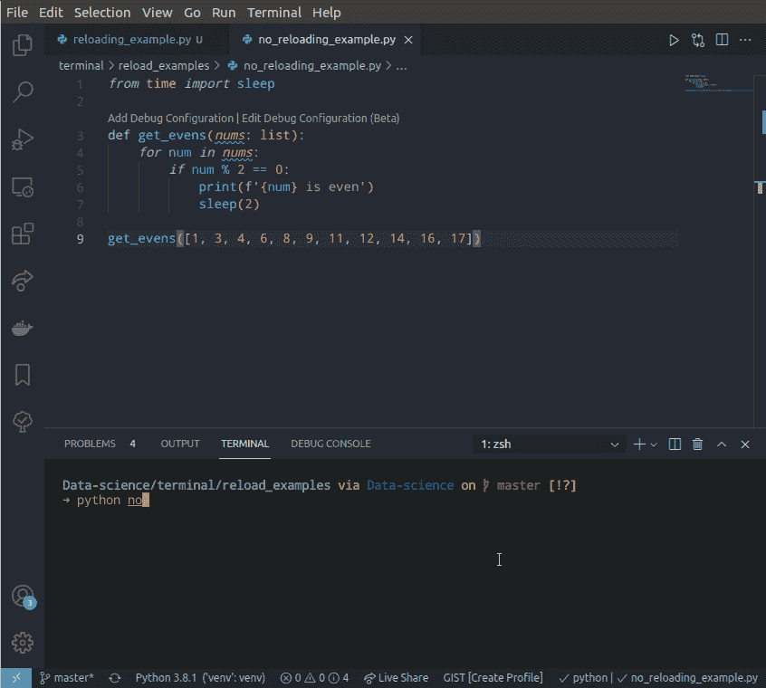
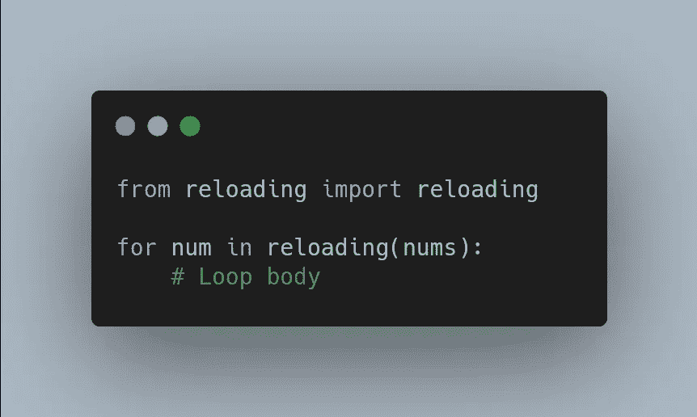

# 当 Python 文件改变时自动重新加载的 2 个工具

> 原文：<https://towardsdatascience.com/2-tools-to-automatically-reload-when-python-files-change-90bb28139087?source=collection_archive---------6----------------------->

## 现在，您可以重新加载循环体，而不会丢失其状态


作者图片

# 动机

您是否运行过 for 循环，并希望在 for 循环中添加更多细节？您可能决定不这样做，因为添加更多的细节意味着您需要停止您的进度并再次重新运行所有内容。

如果代码已经运行了几个小时，停止您的进度尤其不理想。如果你能在每次迭代中重新加载一个循环体而不会像下面这样丢失状态，那不是很好吗？



作者 GIF

在本文中，我将向您展示两个工具，当您的 Python 文件发生变化时，它们可以重新加载代码或运行任意命令。

# Entr 当 Python 文件发生变化时运行任意命令

## 它是如何工作的

entr 允许你在文件改变时运行任意命令。为了理解 entr 是如何有用的，让我们假设我们想要创建一个函数，它接受一组数字并返回偶数。

我们将上面的文件命名为`entr_examples.py`。然后使用 [pytest](/pytest-for-data-scientists-2990319e55e6) 检查`get_evens`函数是否返回偶数。

```
$ pytest entr_examples.py
```



作者图片

测试失败是因为我们还没有给`get_evens`函数添加任何代码。为了尝试不同的方法来获得偶数，让我们使用 entr 在代码改变时重新运行命令`pytest entr_examples.py`。

```
$ ls entr_examples.py | entr python entr_examples.py
```



作者 GIF

酷！通过使用 entr，我们不需要在开发我们的功能时重新运行相同的命令。

由于[测试驱动开发](http://guru99.com/test-driven-development.html#:~:text=Test-driven%20development%20is%20a%20process%20of%20modifying%20the%20code,the%20behavior%20of%20the%20code.)的第一条法则是*“在你写完一个失败的单元测试之前，你不能写产品代码”*，entr 鼓励开发者**测试不同的方法来写代码，直到它起作用。**

## 句法

下面是 entr 的一般语法:



作者图片

注意，如果你想一次跟踪多个 Python 文件，使用`ls *.py | entr command_to_run`代替。这意味着如果任何被跟踪的文件被更改，`command_to_run`将被执行。

## 装置

要在 MacOS 上安装 entr，请键入:

```
brew install entr
```

要在 Ubuntu 上安装 entr，请键入:

```
sudo apt-get update
sudo apt-get install entr
```

另一种选择是克隆 [entr repo](https://github.com/eradman/entr) 并遵循[安装说明](https://github.com/eradman/entr#source-installation---bsd-mac-os-and-linux)。

# 重新加载(reloading )-重新加载循环体而不丢失其状态

## 它是如何工作的

[重载](https://github.com/julvo/reloading)是一个 Python 库，允许你在每次迭代中重载一个循环体而不丢失其状态。

为了理解重载是如何有用的，假设您编写了一个输出偶数的 Python 循环。然而，当循环运行时，您还希望它在不停止循环的情况下打印奇数**。**

通常，这在 Python 中是做不到的。在下面的代码中，即使我们在执行过程中将`print(f'{num} is odd')`添加到循环体中，输出中也没有奇数。



作者 GIF

然而，这可以很容易地通过重新加载来完成。下面的 GIF 展示了在循环中添加重载是如何产生影响的。


作者 GIF

我们可以看到，在执行的过程中，在循环体**中添加一个`else`语句后，奇数被打印出来！**

重载在这里似乎没有什么帮助，因为执行一个 for 循环并不需要很长时间。但是如果你已经训练了几个小时的深度学习模型，并且你想在不停止循环的情况下在每个时期打印更多的统计数据，这将变得非常方便。

在这里找到如何使用你最喜欢的库[重新加载。](https://github.com/julvo/reloading#examples)

## 句法

要使用`reloading`，只需将它添加到 Python 循环中，如下所示:



作者图片

## 装置

```
pip install reloading
```

# 结论

恭喜你！您刚刚学习了如何在 Python 文件发生变化时运行任意命令，以及重新加载 Python 循环体而不丢失其状态。现在，您可以避免浪费时间运行相同的命令或重新运行一个循环来显示更多的输出。

随意发挥，并在这里叉这篇文章的源代码:

<https://github.com/khuyentran1401/Data-science/tree/master/terminal/reload_examples>  

我喜欢写一些基本的数据科学概念，并尝试不同的算法和数据科学工具。你可以在 LinkedIn 和 Twitter 上与我联系。

如果你想查看我写的所有文章的代码，请点击这里。在 Medium 上关注我，了解我的最新数据科学文章，例如:

</3-tools-to-track-and-visualize-the-execution-of-your-python-code-666a153e435e> [## 3 个跟踪和可视化 Python 代码执行的工具

towardsdatascience.com](/3-tools-to-track-and-visualize-the-execution-of-your-python-code-666a153e435e) </3-python-tricks-to-read-create-and-run-multiple-files-automatically-5221ebaad2ba>  </3-tools-to-monitor-and-optimize-your-linux-system-c8a46c18d692>  </pywebio-write-interactive-web-app-in-script-way-using-python-14f50155af4e> 