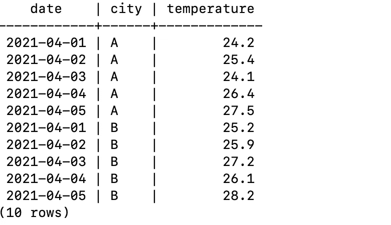
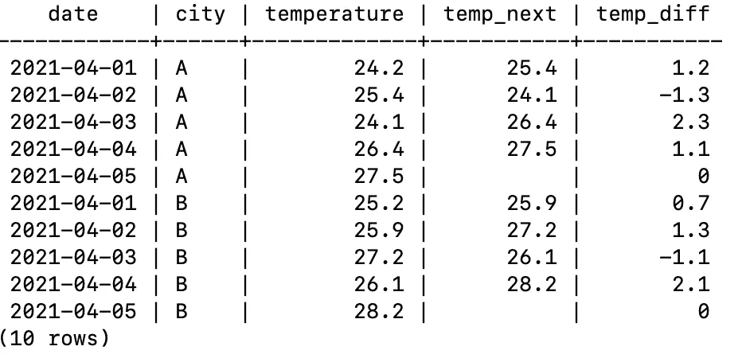
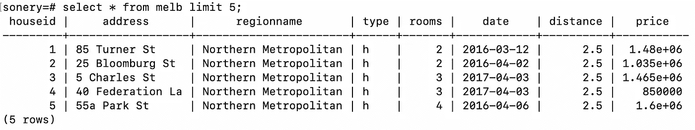

# 在数据科学家面试中，你可能会被问到的两个棘手的 SQL 问题

> 原文：<https://towardsdatascience.com/2-tricky-sql-questions-you-might-be-asked-at-data-scientist-interviews-168f5226c023?source=collection_archive---------6----------------------->

## SQL 是一个强大的数据分析和操作工具。


戴安娜·波莱希娜在 [Unsplash](https://unsplash.com/s/photos/two?utm_source=unsplash&utm_medium=referral&utm_content=creditCopyText) 上拍摄的照片

SQL 是数据科学家的必备技能，这是不争的事实。大多数公司使用关系数据库来存储他们的数据，而 SQL 是我们与他们交互所需要的。

SQL 代表结构化查询语言，但是它能够执行的不仅仅是查询数据库。我们可以使用 SQL 来完成典型的探索性数据分析过程中的任务。在这个意义上，它类似于其他数据分析工具，如 Python 中的 Pandas 和 r 中的 data table。

在本文中，我们将讨论在数据科学家面试中可能会被问到的两个棘手的 SQL 问题。我知道第一个问题实际上是在面试时被问到的。我认为另外两个也很有可能被问到。如果没有，它遵循的程序肯定会有帮助。

我假设您对编写 SQL 查询有基本的了解。如果没有，你仍然可以继续，因为我会试着解释每一步的作用。

**注**:关系数据库管理系统有 MySQL、SQL Server、PostgreSQL 等几种。尽管它们大多采用相同的 SQL 语法，但可能会有一些细微的差别。在本文中，我们将使用 PostgreSQL。

## 问题 1

假设您有一个包含不同城市每日气温值的天气表。



天气表(图片由作者提供)

如何创建一个包含当天和第二天温差的表？对于第一行，差异列应包含值 1.2。

我们可以分两步完成这项任务:

1.  创建一个公共表表达式(cte ),将第二天的温度作为新列
2.  使用步骤 1 中创建的公共表表达式，计算温差

第一步中定义的表可以通过将 temperature 列移动一行，然后将其连接到原始表来创建。我们还需要考虑城市名称。我们不能使用城市 B 的温度作为城市 a 的第二天温度。

移位可以通过滞后或超前功能来完成。由于我们对第二天感兴趣，所以我们将使用 lead 函数。我们还需要按城市进行分区，并按日期对行进行排序。因此，我们确保为每一行输入适当的第二天温度。

在第二步中，我们将从第一步中创建的表中选择所有列，并计算温度和第二天温度列之间的差异。

以下是执行此操作的 SQL 查询:

```
WITH cte AS(
   SELECT
      W1.*, 
      LEAD(W2.temperature, 1) OVER(PARTITION BY W2.city ORDER BY 
      W2.date) AS temp_next                                                   
   FROM weather W1                                                                                                                                                   
   LEFT JOIN weather W2                                                                                                                                              
   ON W1.date = W2.date and W1.city = W2.city
)                                                                                                                       SELECT 
   *, 
   COALESCE((temp_next - temperature), 0) AS temp_diff 
FROM cte;
```



(图片由作者提供)

coalesce 函数可用于替换因连接而导致的缺失值。由于最后几天没有第二天的值，我们可以将差值设为 0。

## 问题 2

假设我们有下表，其中包含了墨尔本房屋的一些特征及其价格。



melb 表格的前 5 行(图片由作者提供)

数据集包含一个日期列，我认为它代表了房子被张贴出售的日期。我们想看看一周中的某一天是否会对房价产生影响。例如，周末发布的房屋价格可能比一周发布的价格高。

此任务涉及基于派生列的分组操作。我们将创建一个分类变量，包含从日期列中提取的星期几信息。

然后，该列将用于对观察值(即行)进行分组。

```
SELECT 
   EXTRACT(dow from date) AS day_of_week,   
   ROUND(CAST(AVG(price/1000000) AS numeric),3) AS avg_price_mio FROM melb 
GROUP BY day_of_week 
ORDER BY avg_price_mio DESC;day_of_week | avg_price_mio
------------+---------------
          5 |         1.123
          0 |         1.120
          4 |         1.093
          6 |         1.077
          3 |         1.073
          2 |         1.048
          1 |         1.023
```

聚合将应用于 price 列。我想用两个小数点显示平均值，所以我也使用了 cast 和 round 方法。

最后，结果按平均价格降序排列。

顺便说一下，本例中使用的[数据集](https://www.kaggle.com/dansbecker/melbourne-housing-snapshot)可以从 Kaggle 下载。

## 结论

我们已经做了两个例子来演示一些复杂的 SQL 查询。这种操作证明 SQL 能够执行数据分析和操作，就像 Pandas 对于 Python 和 data table 对于 r 一样。

SQL 是数据科学生态系统中的一个重要工具。事实上，使用 SQL 执行数据分析和操作任务比使用外部工具从数据库中检索所有数据更可取。

感谢您的阅读。如果您有任何反馈，请告诉我。