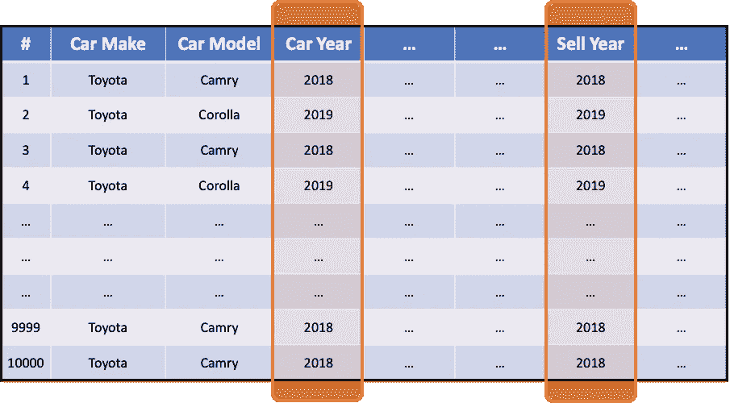
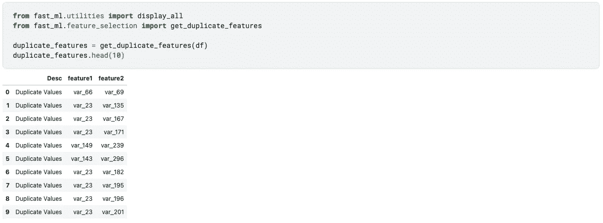
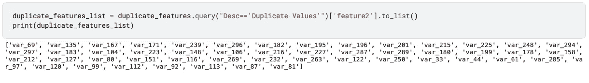
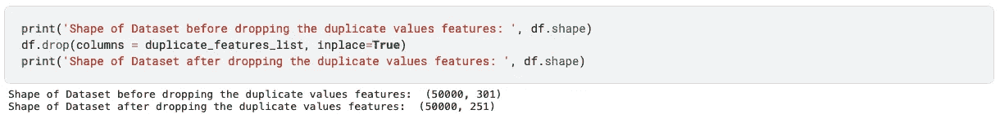
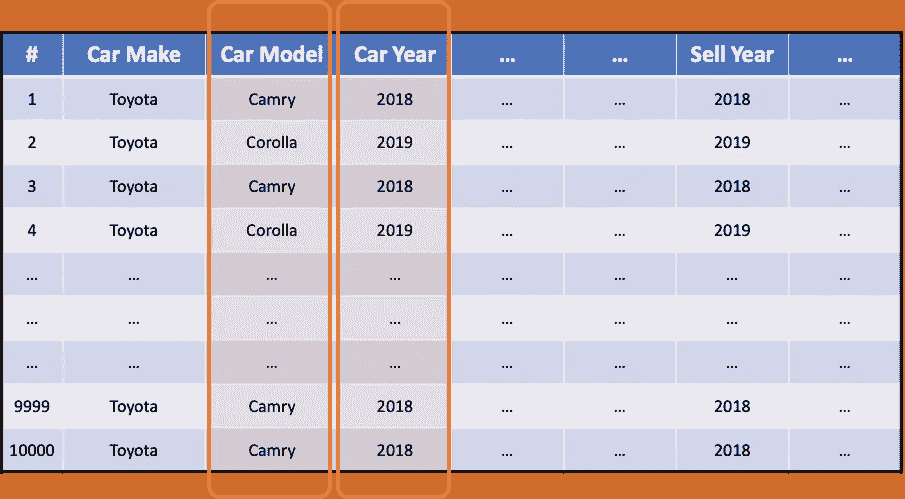
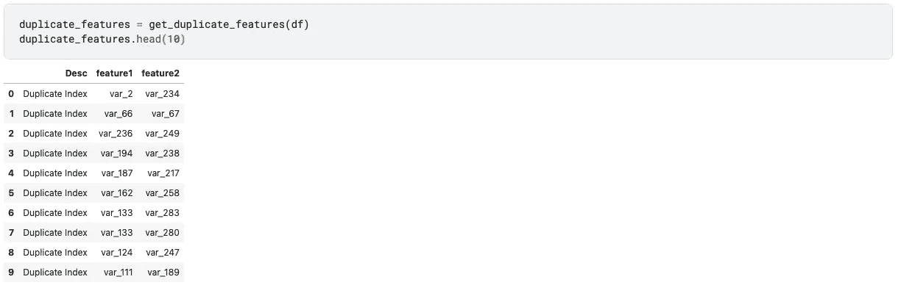
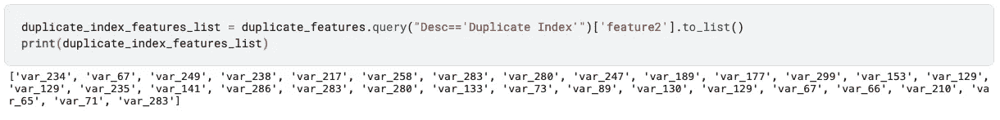
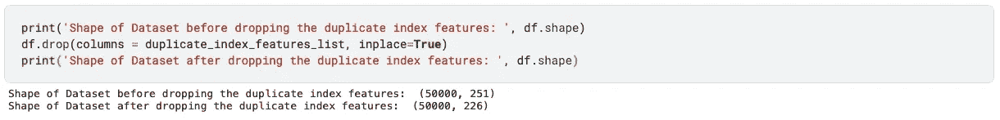

# 机器学习中的两种重复特征

> 原文：<https://towardsdatascience.com/2-types-of-duplicate-features-in-machine-learning-2931de6c949b?source=collection_archive---------13----------------------->

## 使用 fast_ml 进行特征选择


由[托尔加·乌尔坎](https://unsplash.com/@tolga__?utm_source=medium&utm_medium=referral)在 [Unsplash](https://unsplash.com?utm_source=medium&utm_medium=referral) 拍摄的照片

# 介绍

在大多数情况下，顶尖数据科学家与其他人有两个区别:**特征创建**和**特征选择**。即，创建捕捉关于业务或客户的更深/隐藏的洞察力的特征，然后做出关于为您的模型选择哪些特征的正确选择。

# 特征选择在机器学习中的重要性

特征选择是在开发预测模型时减少输入变量数量的过程。

在一个广泛的特性工程步骤之后，你会得到大量的特性。您可能无法使用模型中的所有功能。您可能会对只给模型添加那些重要的特性感兴趣，或者删除那些没有任何预测能力的特性。它降低了模型训练的计算成本，也提高了模型的性能。

在之前的帖子中，我们已经看到了[如何检测常量和准常量特征。](/how-to-detect-constant-quasi-constant-features-in-your-dataset-a1ab7aea34b4)

这篇文章是为了识别所有重复的功能。这些可能有两种类型:

1.  重复值:当两个要素具有相同的一组值时
2.  重复索引:当两个特征的值不同时，但是它们出现在相同的索引处

# 我们来详细了解一下这个

# 1.重复值(每条记录的值相同)



图片作者。对于每条记录，两个要素具有相同的值

如示例图像所示，汽车的销售年份与制造年份相同；那么，这两个特征本质上说的是同一个东西。你的机器学习模型不会通过训练这两个功能来学习任何有见地的东西。您最好删除其中一个功能。同样，还可能有更多这样的特性，您需要一种编程方式来识别这些特性。

1)使用`get_duplicate_features`函数获取所有常量特征。



图片作者。在一行代码中，您可以检测到所有具有重复值的特性

2)将所有重复要素存储为列表，以便从数据集中移除。



图片作者。所有重复的特征作为一个列表

3)从数据集中删除所有此类要素。我们可以看到功能的数量从 301 下降到了 251。



图片作者。从数据集中移除所有重复要素

# 2.重复索引(两个特征的值不同，但它们出现在相同的索引处)



图片作者。两个特征的值不同，但它们出现在相同的行中。

如示例图所示，所有“凯美瑞”汽车都是 2018 年的，所有“卡罗拉”汽车都是 2019 年的。从训练中的这些功能中，你的机器学习模型没有什么深刻的见解。我还可以对`Car Model`做整数编码，把凯美瑞换成 2018，卡罗拉换成 2019。那么它与上述重复值的情况 1 相同。你最好放弃这两个特性中的一个。同样，还可能有更多这样的特性，您需要一种编程方式来识别这些特性。

1)使用`get_duplicate_features`函数获取所有常量特征。



图片作者。在一行代码中，您可以检测到所有具有重复索引的特性

2)将所有重复的索引要素存储为列表，以便从数据集中移除。



图片作者。所有重复的索引特征作为一个列表

3)从数据集中删除所有此类要素。我们可以看到，功能的数量从 251 个下降到了 226 个。



图片作者。从数据集中移除所有重复的索引要素

# 摘要

在数据集中保留重复要素会带来多重共线性问题。
—在线性模型的情况下，两个特征之间的权重分配会有问题。
—如果你使用的是基于树的模式，这无关紧要，除非你着眼于特性的重要性。
—在基于距离的模型中，它将使该特征在距离中更重要。

**用于检测具有重复值或重复索引的特征的代码片段:**

```
**# Import required functions**
from fast_ml.utilities import display_all
from fast_ml.feature_selection import get_duplicate_features**# Use the function to get the results in dataframe**
duplicate_features = get_duplicate_features(df)
display_all(duplicate_features)**# All the constant features stored in a list**
duplicate_features_list = duplicate_features['feature2'].to_list()**# Drop all the constant features from the dataset**
df.drop(columns = duplicate_features_list, inplace=True)
```

# 关于 Fast_ml

*   [由数据科学家为数据科学家打包；带 Scikit-learn type fit() transform()功能](https://pypi.org/project/fast-ml/)
*   有许多内置功能可以让数据科学家的生活变得更加轻松
*   —探索性数据分析
*   —缺失值处理
*   —异常值处理
*   —特征工程
*   —特征选择
*   —模型开发
*   —模型评估

# 感谢阅读！！

*   如果你喜欢这个，[关注我的 medium](https://samarthagrawal86.medium.com/) 了解更多。
*   有兴趣合作吗？我们上 [Linkedin](https://www.linkedin.com/in/samarth-agrawal-2501/) 连线吧。
*   请随意写下您的想法/建议/反馈。
*   [卡格尔链接](https://www.kaggle.com/nextbigwhat/detect-duplicate-features-in-dataset)

笔记本可在以下位置获得，并附有完整的功能代码:

<https://www.kaggle.com/nextbigwhat/detect-duplicate-features-in-dataset> 