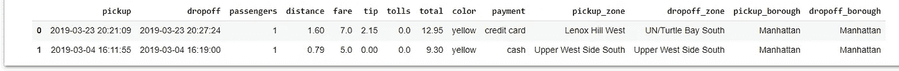
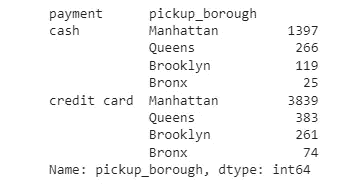
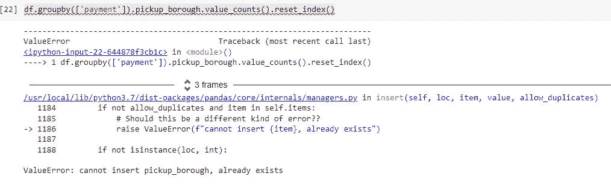
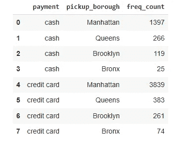
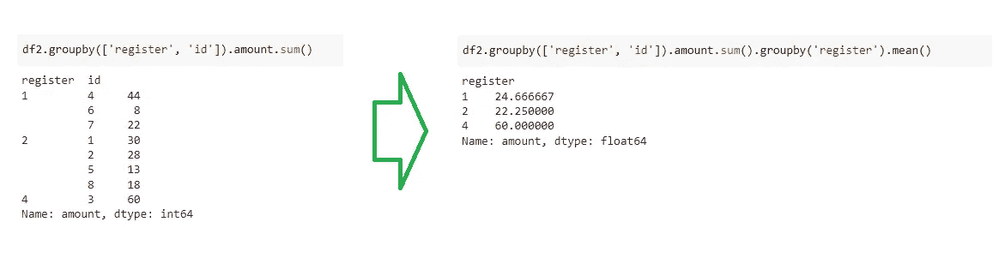

# 2 个对聚合数据有用的代码片段

> 原文：<https://towardsdatascience.com/2-useful-code-snippets-for-aggregated-data-880d5d263a3b?source=collection_archive---------16----------------------->

## 当你在熊猫中“分组”后，你会想把这些代码放在身边


由[彼得·伯顿](https://unsplash.com/@peterburdon?utm_source=unsplash&utm_medium=referral&utm_content=creditCopyText)在 [Unsplash](https://unsplash.com/s/photos/pandas?utm_source=unsplash&utm_medium=referral&utm_content=creditCopyText) 上拍摄的照片

我将写一篇非常实用的文章，并附上一些代码片段。

今天早上，在处理一些 EDA 和数据争论时，我发现自己测试了许多函数，以使数据按照我想要的方式进行绘制。这就是我想和你分享的。

对于这些例子，我使用来自`seaborn`库的数据集*taxies*。

```
df = sns.load_dataset('taxis')
df.head(2)
```



数据集“出租车”。图片由作者提供。

## 分组、计数和重命名

让我们按*付款类型*对数据进行分组，并按 *pickup_borough 查看首选类型。*

```
# Preferred payment method by pickup borough
df.groupby(['payment']).pickup_borough.value_counts()
```



图 1 —按提货地点列出的付款类型。图片由作者提供。

或者我们可以使用`normalize=True`参数将其转换成百分比。

```
# Preferred payment method by pickup borough
df.groupby(['payment']).pickup_borough.value_counts(normalize=True)
```

然而，从图 1 得到的对象是一个熊猫系列。如果我想操纵那张桌子，我会有麻烦。注意，我没有计数的列名。因此，我需要重置索引，使其成为具有正确列名的数据框。但是看看当我尝试的时候会发生什么。



图 2 —试图重置 _index 时出错。图片由作者提供。

发生这种情况是因为 Pandas 将尝试转换 Dataframe 中的结果序列，并对 counts 列使用相同的名称( *pickup_borough* )。因为不可能有两个同名的列，所以我们得到了错误。要解决这个问题，需要转换到框架，在重置索引之前重命名列。**参见下面第一个有用的代码。**

```
# Remove the comments before running the code**# Group the data**
df.groupby(['payment']).pickup_borough.value_counts()\
**# transform to dataframe**
.to_frame()\
**# rename the column**
.rename(columns={'pickup_borough': 'freq_count'})\
**# Reset index**
.reset_index()
```



图 3 —结果数据帧。图片由作者提供。

## 对分组的数据进行分组

您知道可以对已经分组的数据进行分组吗？

让我们一步一步来看。首先，让我们专门为这个例子创建一个数据集。

```
# Create a dataset
df2 = pd.DataFrame({'id': [1,1,2,2,3,3,3,3,3,3,4,4,4,6,7,7,8,8,5,5],
              'register': [2,2,2,2,4,4,4,4,4,4,1,1,1,1,1,1,2,2,2,2],
             'amount': np.random.randint(2,20,20)})# Sort
df2= df2.sort_values(by='id').reset_index(drop=True)**[OUT]:** 
   id | register | amount
0   1      2         17
1   1      2         13
2   2      2         10
3   2      2         18
4   3      4         17
```

好的。假设你想知道登记的平均费用是多少。你可能会想:

```
# Mean by register
df2.groupby('register').amount.mean()**[OUT]:**
register 
1    12.333333 
2    11.125000 
4    10.000000
```

但这是错误的，原因只有一个。每个交易 ID 不是唯一的。这意味着在每笔交易中，不止有一个项目。因此，在按登记簿提取平均金额之前，必须使每个 ID 条目都是唯一的。

看看下面我们只对寄存器 1 切片的结果。

```
# Slice on register 1
df2.query('register == 1')**[OUT]:** id  register  amount
10  4     1       17
11  4     1       19
12  4     1       8
15  6     1       8
16  7     1       10
17  7     1       12
```

如果我只是从中提取平均值，我将合计金额(74 美元)并除以 6，这是行数，结果是 12.33 美元。

相反，我应该做的是——使每笔交易都是独一无二的，以便了解每笔交易的真实费用，而不是每件商品的费用。

```
# Slice register 1 then group by ID
df2.query('register == 1').groupby('id').amount.sum()id 
4    44 
6     8 
7    22
```

很好。现在我知道了每笔交易的实际成本，我可以计算 3 笔不同交易的平均值，即(44 + 8 + 22) / 3 = $24.66。

要在单行代码上实现这一点，可以使用两个级别的分组。下面是第二个有用的代码片段。

```
# Step 1: Group by register and ID and sum the amount.
# Step 2: group the result by register and calculate the mean.df2.groupby(['register','id']).amount.sum()\
                              .groupby('register').mean()
```



嵌套 groupby 的结果。图片由作者提供。

## 在你走之前

使用 groupby，您可以做更多的事情…

我的建议是你写代码，看看输出是什么，然后玩玩输出，看看你能否用点符号嵌套函数，如果你感兴趣的话。

如果你要向别人展示你的作品，不要写太长的代码行。它们可能很难读懂。

如果这些内容对你有用，欢迎关注我的博客。

<https://medium.com/gustavorsantos> 