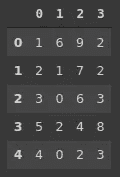

# 掌握熊猫系列 20 例

> 原文：<https://towardsdatascience.com/20-examples-to-master-pandas-series-bc4c68200324?source=collection_archive---------26----------------------->

## 熊猫的核心数据结构


雅尼斯·萨乌格在 [Unsplash](https://unsplash.com/s/photos/series?utm_source=unsplash&utm_medium=referral&utm_content=creditCopyText) 上的照片

Pandas 是一个非常流行的 Python 数据分析和操作库。它提供了多种功能强大的函数来处理表格形式的数据。

熊猫的两个核心数据结构是 DataFrame 和 Series。DataFrame 是一个带有标记行和列的二维结构。它类似于 SQL 表。Series 是一维标签数组。系列中的值的标签被称为索引。DataFrame 和 Series 都能够存储任何数据类型。

在本文中，我们将通过 20 个示例来演示我们可以对一个系列执行的各种操作。

让我们首先导入库，然后从示例开始。

```
import numpy as np
import pandas as pd
```

## 1.数据帧由系列组成

数据帧的单个行或列是一个系列。



考虑左边的数据帧。如果我们选择一个特定的行或列，返回的数据结构是一个序列。

```
a = df.iloc[0, :]
print(type(a))
pandas.core.series.Seriesb = df[0]
type(b)
pandas.core.series.Series
```

## 2.系列由数值和索引组成

Series 是带标签的数组。我们可以访问被称为索引的值和标签。

```
ser = pd.Series(['a','b','c','d','e'])print(ser.index)
RangeIndex(start=0, stop=5, step=1)print(ser.values)
['a' 'b' 'c' 'd' 'e']
```

## 3.索引可以定制

正如我们在前面的例子中看到的，默认情况下从零开始的整数索引被分配给一个系列。但是，我们可以使用 index 参数来更改它。

```
ser = pd.Series(['a','b','c','d','e'], index=[10,20,30,40,50])print(ser.index)
Int64Index([10, 20, 30, 40, 50], dtype='int64')
```

## 4.列表中的系列

我们在前面的例子中已经看到了这一点。可以将一个列表传递给 Series 函数来创建一个序列。

```
list_a = ['data', 'science', 'machine', 'learning']ser = pd.Series(list_a)type(ser)
pandas.core.series.Series
```

## 5.NumPy 数组中的系列

创建系列的另一种常用方法是使用 NumPy 数组。这就像从列表中创建一样。我们只改变传递给 Series 函数的数据。

```
arr = np.random.randint(0, 10, size=50)ser = pd.Series(arr)
```

## 6.访问单个值

由于系列包含带标签的项目，我们可以使用标签(即索引)访问特定项目。

```
ser = pd.Series(['a','b','c','d','e'])print(ser[0])
aprint(ser[2])
c
```

## 7.切片系列

我们还可以使用索引来分割一个系列。

```
ser = pd.Series(['a','b','c','d','e'])print(ser[:3])
0    a
1    b
2    c
dtype: object print(ser[2:])
2    c
3    d
4    e
dtype: object
```

## 8.数据类型

Pandas 在创建系列时会分配一个适当的数据类型。我们可以使用 dtype 参数来更改它。当然，需要选择合适的数据类型。

```
ser1 = pd.Series([1,2,3,4,5])
print(ser1)
0    1
1    2
2    3
3    4
4    5
dtype: int64 ser2 = pd.Series([1,2,3,4,5], dtype='float')
0    1.0
1    2.0
2    3.0
3    4.0
4    5.0
dtype: float64
```

## 9.系列中的项目数

有多种方法可以计算一个系列中值的个数。既然是集合，我们可以使用 Python 内置的 len 函数。

```
ser = pd.Series([1,2,3,4,5])len(ser)
5
```

我们还可以利用熊猫的大小和形状功能。

```
ser.size
5ser.shape
(5,)
```

shape 函数返回每个维度的大小。因为数列是一维的，我们从形状函数中得到长度。Size 返回系列或数据帧的总大小。如果在数据帧上使用，size 返回行数和列数的乘积。

## 10.独一无二的

unique 和 nunique 函数分别返回唯一值和唯一值的数量。

```
ser = pd.Series(['a','a','a','b','b','c'])ser.unique()
array(['a', 'b', 'c'], dtype=object)ser.nunique()
3
```

## 11.最大值和最小值

nlargest 和 nsmallest 函数返回序列中的最大值和最小值。默认情况下，我们得到 5 个最大或最小的值，但是可以使用 n 参数进行更改。

```
ser = pd.Series(np.random.random(size=500))ser.nlargest(n=3)
292    0.997681
236    0.997140
490    0.996117
dtype: float64ser.nsmallest(n=2)
157    0.001499
140    0.002313
dtype: float64
```

## 12.字典中的系列

如果我们向 series 函数传递一个字典，返回的 series 包含字典的值。索引是字典的关键词。

```
dict_a = {'a':1, 'b':2, 'c':8, 'd':5}pd.Series(dict_a)
a    1
b    2
c    8
d    5
dtype: int64
```

## 13.转换数据类型

创建系列时，我们可以选择数据类型。Pandas 还允许以后更改数据类型。

例如，下面的系列包含整数，但使用 object dtype 存储。我们可以使用 astype 函数将它们转换成整数。

```
ser = pd.Series(['1','2','3','4'])ser
0    1
1    2
2    3
3    4
dtype: objectser.astype('int')
0    1
1    2
2    3
3    4
dtype: int64
```

## 14.值出现的次数

value_counts 函数返回一个序列中每个唯一值的出现次数。了解数值分布的概况是很有用的。

```
ser = pd.Series(['a','a','a','b','b','c'])ser.value_counts()
a    3
b    2
c    1
dtype: int64
```

## 15.从系列到列表

就像我们可以从列表中创建一个系列一样，也可以将一个系列转换成一个列表。

```
ser = pd.Series(np.random.randint(10, size=10))ser.to_list()
[8, 9, 0, 0, 7, 1, 8, 6, 0, 8]
```

## 16.空值

它可能在一个序列中有缺失值。Pandas 使得检测和处理缺失值变得非常简单。

例如，count 函数返回序列中非缺失值的个数。

```
ser = pd.Series([1, 2, 3, np.nan, np.nan])ser.count()
3
```

## 17.空值— 2

检测缺失值的另一种方法是 isna 函数。它返回带有布尔值的序列，用 True 表示缺少值。

```
ser = pd.Series([1, 2, 3, np.nan, np.nan])ser.isna()
0    False
1    False
2    False
3     True
4     True
dtype: bool
```

我们可以通过将 sum 函数与 isna 函数链接来计算缺失值的数量。

```
ser.isna().sum()
2
```

## 18.向上舍入浮点数

在数据分析中，我们最有可能拥有的是数值。熊猫非常擅长处理数字数据。例如，round 函数允许将浮点数舍入到特定的小数点。

考虑以下系列。

```
ser
0    0.349425
1    0.552831
2    0.104823
3    0.899308
4    0.825984
dtype: float64
```

以下是 round 函数的使用方法:

```
ser.round(2)
0    0.35
1    0.55
2    0.10
3    0.90
4    0.83
dtype: float64
```

## 19.逻辑运算符

我们可以将逻辑运算符应用于一个系列，如等于、小于或大于。它们返回带有布尔值的序列，这些布尔值指示符合指定条件的值为 True。

```
ser = pd.Series([1, 2, 3, 4])ser.eq(3)
0    False
1    False
2     True
3    False
dtype: boolser.gt(2)
0    False
1    False
2     True
3     True
dtype: bool
```

逻辑运算符的完整列表:

*   lt:小于
*   乐:小于或等于
*   gt:大于
*   ge:大于或等于
*   eq:相等
*   ne:不相等

## 20.数据聚合

我们可以对一系列数据应用聚合函数，如平均值、总和、中位数等。将它们分别应用于一个系列的一种方法。

```
ser = pd.Series([1, 2, 3, 4, 10])ser.mean()
4
```

如果我们需要应用多个聚合函数，有一个更好的方法。我们可以将它们以列表的形式传递给 agg 函数。

```
ser.agg(['mean','median','sum', 'count'])mean       4.0
median     3.0
sum       20.0
count      5.0
dtype: float64
```

## 结论

我们已经做了 20 个例子，演示了级数的性质和与之交互的函数。它和数据帧一样重要，因为数据帧是由系列组成的。

本文中的示例涵盖了大量常用的序列数据操作。当然，还有更多函数和方法可以和 Series 一起使用。您可以根据需要学习更高级或更详细的操作。

感谢您的阅读。如果您有任何反馈，请告诉我。