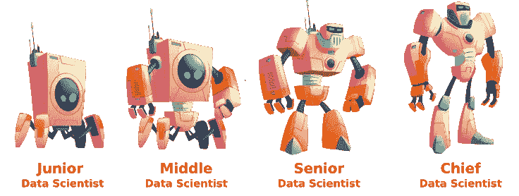
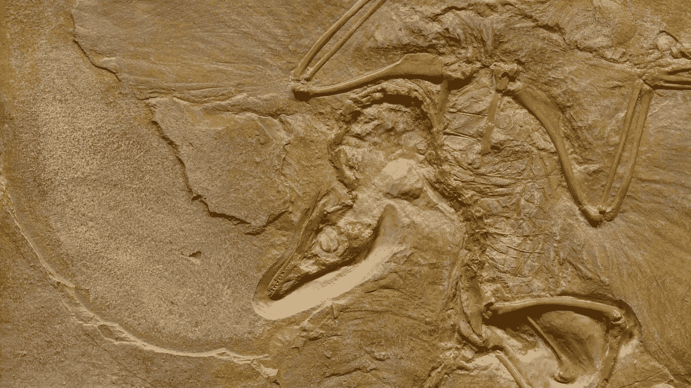
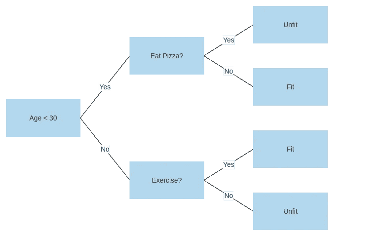

# 从初级数据科学家到首席数据科学家的 20 个经验教训

> 原文：<https://towardsdatascience.com/20-lessons-learned-going-from-junior-data-scientist-to-chief-data-scientist-6fe09ff89d78?source=collection_archive---------2----------------------->

## [办公时间](https://towardsdatascience.com/tagged/office-hours)

## 花了 3 年时间研究饮食、睡眠和呼吸数据科学

【www.freepik.com vector pocket 制作的 T2 横幅矢量

几年前，当我得到我的第一份企业“数据科学家”工作时，我几乎不知道决策树是什么，我不知道人们为什么一直在谈论随机森林，我也不知道人们在谈论“人工智能”时实际上是什么意思，对我来说，这主要与反乌托邦电影有关。说得委婉一点，我相当不知所措。

这些天来，我感觉轻松多了，轻松地阅读人工智能和人工智能领域广泛主题的研究论文，做主题演讲，成为一家制药公司的首席数据科学家，等等。一路走来，我们学到了很多经验教训。在这篇文章中，我将概述一些我认为最重要的见解，没有特定的顺序，以及一些在企业数据科学职位上取得成功的一般经验。

注意:“数据科学”在不同的行业有很大的不同，所以这是在生物技术/制药公司工作的人的观点。

## 1.激情、好奇心和能力

激情和好奇心是数据科学家最重要的品质。如果在一个普通的经验丰富的高级数据科学家和一个肚子里有一团火的候选人之间进行选择，选择后者，即使这意味着更少的经验、更短的教育或其他什么。

我见过许多数据科学家，他们有着长长的、令人印象深刻的简历和昂贵的薪水，却完全不了解正在解决的问题的技术或商业细节。与此同时，我也看到过一些没有任何工作经验的激情四射的候选人迅速取得成功。

> 激情和好奇心是数据科学家最重要的品质

数据科学家应该“充满激情”的想法并不新鲜。不过，对此还有一个更有争议的附录:你还需要有“心理”能力。这意味着什么的细节可能是未来帖子的主题。然而，最重要的是，它需要坚持不懈地推动自己变得更好，以及至少一定水平的大脑马力(即“智力”)。

你必须对技术充满热情和好奇。由[凯文·杰瑞特](https://unsplash.com/@kjarrett?utm_source=medium&utm_medium=referral)在 [Unsplash](https://unsplash.com?utm_source=medium&utm_medium=referral) 上拍摄的照片

## 2.获得或创造合适的工作

一份“数据科学家”的工作并不能保证你会整天做很酷的人工智能工作。相反，我见过的大多数企业数据科学家从来没有或很少拟合线性回归模型，因为他们所有的时间都被分配给了会议、数据清理或争论、仪表板等。

> 一份“数据科学家”的工作并不能保证你会整天做很酷的人工智能工作

事情是这样的，如果你不太熟悉例如最新的 NLP 算法是如何工作的，一旦你花了几周时间消化和清理公司的所有内部文件，公司就会有很大的动机雇佣一些顾问几周时间来做实际的数据科学工作；这样做比你“赶上”学习更有效率。

如果你的目标是掌握这门手艺，你就得锻炼这门手艺。数据科学就像力量训练；你可以想读多少书就读多少书，但是除非你钻到吧台下面，举起重物，否则你不会变得强壮。在上面的例子中，这可能意味着在进行数据提取和清理的同时学习和应用 NLP 算法。如有必要，无需经理同意。或者，开始做爱好项目，Kaggle 比赛，等等来磨练你的技能。同样，在公司(和个人)时间这样做，如果有必要，不要征得你经理的同意。这可能是有争议的，但看到下一个教训，为什么我相信它是好的。

> 数据科学就像力量训练；你可以想读多少书就读多少书，但是除非你钻到吧台下面，举起重物，否则你不会变得强壮。

不要只是读书；到“吧”下“做”数据科学。乔治·帕甘三世在 [Unsplash](https://unsplash.com?utm_source=medium&utm_medium=referral) 上的照片

## 3.无限 X 数据科学家

“10 倍开发人员”的概念是几十年前引入的，用来表示比一般开发人员多 10 倍的开发人员。虽然围绕这种开发人员存在的说法有很多争议，但我个人的经验是，当涉及到数据科学家时，倍数可能会比 10 倍高得多——你*可以*争辩说，如果给足够的时间，一个普通的开发人员可能能够解决几乎任何任务，但我不相信一个普通的*数据科学家能够在“足够的时间”下解决任何任务*

> 你花大量的时间磨练自己的技能，拓展自己的视野，这符合你自己的利益，也符合你的雇主的利益。

例如，假设您面临一个无法用传统 ML 解决的业务问题，需要在多个错位的时间序列上定制一个基于 transformer 的架构，同时还可以解释。如果你甚至从来没有玩过简单的神经网络，你*也不会*能够在任何合理的时间内破解那个问题。是的，我的经验是这些问题*会*出现，如果你没有一个可以解决这些问题的方法论的坚实概述，要么*你*不会解决问题，要么问题根本不会解决。

没有足够的技能，某些问题就无法解决。马修·汉密尔顿在 [Unsplash](https://unsplash.com?utm_source=medium&utm_medium=referral) 上的照片

## 4.不要陷入概念验证(POC)陷阱

这是一个大的。你可能会反复看到它；你得到数据，拟合一些模型，得到一些看起来很有希望的不错的初步结果。然后，什么都没有。没人捡起来。没人把它投入生产。它从不产生价值。关键是要创造价值。

> 你的主要目标是创造商业价值。概念证明不产生价值。

发生这种情况的原因是多方面的，这本身就是一个话题。首先，将机器学习模型投入生产是困难的，正如我在[上一篇关于 MLOps](/get-started-with-mlops-fd7062cab018) 入门的文章中所展示的。通常，另一个原因是糟糕的变更管理和业务锚定。确保有人专门负责这个过程，这样你所做的工作最终会产生价值。

概念验证陷阱意味着数据科学从未创造价值。照片由[缺口缺口](https://unsplash.com/@jannerboy62?utm_source=medium&utm_medium=referral)在[缺口](https://unsplash.com?utm_source=medium&utm_medium=referral)处拍摄

## 5.你的背景很重要

当我找到第一份数据科学工作时，我没有数据或计算机科学背景。然而，我*已经*几乎每天编码 15 年，并获得了计算生物技术的博士学位。这意味着我可以直接理解各种算法并测试它们，而不需要学习编码。我也可以一出门就开始阅读研究论文，尽管一开始会很慢，因为你必须熟悉术语。

重点是？你不可能在 1 个月、3 个月甚至 6 个月内掌握数据科学。你应该提防任何人试图告诉你不是这样。你*可以*在短时间内学会变得有用和可雇佣，但数据科学是一个庞大和多面的学科，需要几年或几十年才能掌握。

数据科学是一个无限的旅程。享受它，继续前进。照片由[弗拉德·巴加西安](https://unsplash.com/@vladbagacian?utm_source=medium&utm_medium=referral)在 [Unsplash](https://unsplash.com?utm_source=medium&utm_medium=referral) 拍摄

## 6.学习所有的科目

一个典型的数据科学建议是专注于给定的主题，以避免成为“万事通，无所不能”这是废话，如果你遵循这个建议，你就有很快过时的风险。相反，一个人应该努力成为“万事通，几个大师”

> 不要回避“数据科学独角兽”的想法，而是努力成为其中一员。

为什么？不同领域之间有无数的协同作用。你拥有的视角越多，你就会越经常地发现自己在一个领域中使用另一个领域中的怪异“技巧”，使你能够解决你原本无法解决的问题。如果没有其他事情，当你的特定数据科学专业最终被新技术打乱时，拥有其他优势是很好的。

> 你可以随时丢掉工作，但你获得的知识是你自己的。

我不仅相信你会从学习尽可能多的数据科学学科中受益，我还相信你应该追求一般编程技能、数据工程系统和工作流、设置云基础设施、前端开发等方面的知识。数据科学家可以整天坐在 RStudio 中装配模型，然后将它们交给运营团队的日子已经一去不复返了。

尽可能多的熟悉工具。塞萨尔·卡里瓦里诺·阿拉贡在 [Unsplash](https://unsplash.com?utm_source=medium&utm_medium=referral) 上的照片

## 7.这可能不是你的工作，但这是你的问题

一位朋友最近提出了一种观点([见此处](https://www.linkedin.com/posts/ogencoglu_honestly-best-data-scientists-i-have-worked-activity-6701051997237321729-3Yue))，即所有最成功的数据科学家通常都有一种“可能不是我的工作，仍然是我的问题”的心态。如果没有人做数据接收或建立基础设施，有人搞砸了数据清理，没有人做利益相关者管理，或者其他什么，你必须找到一种方法来处理这些。处理这些事情可以塑造性格。

> 取得所有权，并尽一切努力创造商业价值。

成长为数据科学家的最佳方法之一是将一个困难的数据科学问题一直带到它*创造商业价值*的地方，而不仅仅是创建一个概念验证。这也是许多项目即使在概念验证成功后仍然失败的另一个原因；没有人站出来接受将东西投入生产的各种挑战。

这是你的问题；想办法解决。照片由[菲利普·姆罗兹](https://unsplash.com/@mroz?utm_source=medium&utm_medium=referral)在 [Unsplash](https://unsplash.com?utm_source=medium&utm_medium=referral) 上拍摄

## 8.定义正确的问题

数据科学项目无法产生商业价值的原因有很多。我认为经常被忽视的一个原因是未能解决正确的问题。有些人花了几个月的时间接收或清理数据，却不知道或不打算如何处理这些数据。有些人过于坚持使用特定的建模方法。更典型的是，有时候，你花了很长时间去创造一些企业实际上从来不想要或不需要的东西。

> 有时无法创建您想要的模型。或者更糟的是，一开始就没有人想要这个模型。

在花几个月的时间清理数据之前，明确你想用这些数据做什么，并建立一个基线 ML 模型来指导你的清理之旅。与利益相关者交谈，建立良好的关系，确保他们比你自己更渴望看到这个模型投入生产。这本身就是一项重大任务——你需要将一个*现实世界的*问题转化为一个可以解决的机器学习问题。

当致力于一个给定的解决方案时，如果经过大量的努力，你似乎不能创建一个足够好的模型，试着重新思考你是否能解决一个不同的“正确”的问题；例如，也许有可能解决分类问题而不是预测问题？或者将该方法重新表述为排序问题而不是回归问题，等等。

有很多解决方法；找到能产生价值的正确选择。Akhilesh Sharma 在 [Unsplash](https://unsplash.com?utm_source=medium&utm_medium=referral) 上拍摄的照片

## 9.养成良好的习惯

意志力和热情不足以掌握数据科学，除非你痴迷于数据科学，每天每时每刻都在吃饭、睡觉和呼吸数据科学。[我在更长的时间里做了后者](/bitten-by-the-data-science-bug-8249153c9f12)，虽然肯定有所收获，但最终会导致精疲力尽。相反:

> 良好的习惯必须建立和坚持，以确保你的技能逐步和不断提高。

建立成功的习惯本身就是一个话题，但是像《原子习惯》这样的书是一个极好的起点。习惯的例子可以是每天早餐前阅读一篇研究论文，总是编写关于函数和方法的文档字符串，总是在任何模型开发之前建立一个简单的基线，每个月从头开始重新实现一篇研究论文，等等。

掌握数据科学是一个漫长的旅程。及早建立良好的习惯。照片由 [Unsplash](https://unsplash.com?utm_source=medium&utm_medium=referral) 上的 [FitNish 媒体](https://unsplash.com/@fitnish?utm_source=medium&utm_medium=referral)拍摄

## 10.数据科学不会灭绝

在开始数据科学的第一周内，有人告诉我，几年后我们会让自己过时。是的，我相信我们的目标是让我们现在所做的一切自动化并“过时”不，数据科学不会灭绝。你的技能可能会。或者“数据科学”的名称可能会随着时间的推移而被分成子学科。但是，利用数据产生洞察力和价值的核心理念将在未来很长一段时间内保持不变。auto ml 和无/低代码数据科学工具唯一能做的就是让你专注于更有趣和更困难的问题，而不是构建模型的重复部分。

保持你的好奇心和激情，你就永远不会过时。马库斯·兰格在[像素上拍摄的照片](https://www.pexels.com/da-dk/foto/natur-monster-tekstur-dyr-3839557/)

## 11.学会讲故事

比方说，我们可以将你讲故事的技能映射到一个连续的尺度上，其中 0 表示完全没有能力传达你的结果，1 表示非常有效和引人入胜的沟通。现在，如果你把所有的技术技能都用在数据科学家身上，那么:

> 你能创造的价值将与你讲故事的能力乘以你的技术实力成正比

教训？学会交流你的结果，讲一个吸引人的故事，但不要损害你的技术能力，也就是说，不要把所有的时间都花在制作幻灯片上，即使这是你老板想要的。

训练你的沟通技巧。获得他人的反馈。Artem Podrex 在[像素上拍摄的照片](https://www.pexels.com/da-dk/foto/morgengry-person-kaerlighed-folk-7494475/)

## 12.吃你的蔬菜

掌握数据科学很难；你必须了解业务问题，你必须能够与人交谈并有效地沟通，你需要能够有效地实施复杂的编码和分析解决方案，你必须不断地做研究和重塑自己，保持在最前沿。

要做所有这些事情，你的大脑需要以最佳能力运作。尤其是如果你要挑战自己的极限。自学，实验，并客观评估不同饮食和锻炼方案的结果。不要陷入认为自己“需要”特定食物、兴奋剂等的陷阱。—如果你对这个完全陌生，也许可以读一本像《快乐陷阱》这样的书。我希望这不是真的，但对我个人来说，我知道一个事实，我的健康强烈影响我的表现。

给你的大脑最佳的工作条件。由[尚塔尔·卡尼尔](https://unsplash.com/@chantalgarnier?utm_source=medium&utm_medium=referral)在 [Unsplash](https://unsplash.com?utm_source=medium&utm_medium=referral) 上拍摄的照片

## 13.掌握基础知识

定期重新学习基础知识。在一个典型的预测用例中，目标是创建一个在现实生活中表现良好的 ML 模型。也就是说，基于我们的训练集或测试集中从未见过的数据。为了帮助我们创建这样一个模型，它将*很好地将*推广到看不见的数据，我们通常使用交叉验证的基本技术。你必须确定你得到了，而不是发现自己在迭代优化一些分数，这最终不会转化为一般化。

> 归根结底，ML 模型的目标是处理新的看不见的数据

不要让信息从训练泄露到测试集。确保你理解分层交叉验证，时间序列交叉验证等。熟悉不同的评估标准，它们的优点和缺点。请让你有足够的经验知道，改进一个模型通常更多的是关于数据质量而不是模型本身。请记住，在一天结束时，ML 模型的目标是在新的看不见的数据上表现良好。

掌握基本面。一次又一次。照片由[你好我是尼克](https://unsplash.com/@helloimnik?utm_source=medium&utm_medium=referral)在 [Unsplash](https://unsplash.com?utm_source=medium&utm_medium=referral)

## 14.建立基线

当面对一个新问题时，立刻跳到超高级模型的人并不鲜见。总是从你能想到的最简单的模型开始，并把它作为你的“基线”然后，您可以开始逐步试验数据和模型优化。使用 mlflow、W&B 等工具记录所有实验。

在进行任何预测建模之前，总是首先建立一个简单的基线。作者图片

## 15.不要相信你自己的结果

在没有 1)确保你的交叉验证设置是合法的，以及 2)你已经彻底检查了你的预测的 SHAP 值或类似值之前，不要给出任何结果。

> 在展示预测模型评估结果之前，问问你自己:1)我的验证策略有意义吗？以及 2)我是否彻底检查并解释了为什么模型预测了它的行为？

通常，从业者会发现给定的模型在给定的问题上表现得非常好，只是后来意识到在评估期间信息从测试泄露到了训练数据集。或者，实现从目标泄露了信息，例如，以一些不应该存在的高度相关的输入特征的形式。或者，在某些情况下(例如，图像)，意识到模型关注的是与我们希望它关注的完全不同的东西。

在把你的东西展示给其他人之前，对其进行完整性检查。由[杰斯温·托马斯](https://unsplash.com/@jeswinthomas?utm_source=medium&utm_medium=referral)在 [Unsplash](https://unsplash.com?utm_source=medium&utm_medium=referral) 上拍摄的照片

## 16.不要相信别人的结果

也不要盲目接受别人的结果。这适用于科学文献和你同事的成果。即使一切都“编译”得很好，并产生了合理的结果，在给定的解决方案中仍然可能有完全不明显的错误，所以总是要仔细研究你的同事是如何解决特定问题的。希望他们也能为你做同样的事情！

> 我确实认为有一个很好的思考框架。这是物理学——你知道那种基本原理推理……我的意思是将事物归结为它们的基本真理，并从那里推理，而不是通过类比推理——埃隆·马斯克

不过，这一课更深入。细节决定成败。不要相信一个调整图像大小的库会像您可能在生产中使用的另一个库一样执行此操作。不要相信人们在给定的库中正确地实现了给定的算法。不要假设人们知道如何正确计算标准差——质疑一切。

对一切数据科学持怀疑态度。凯尔·格伦在 [Unsplash](https://unsplash.com?utm_source=medium&utm_medium=referral) 上的照片

## 17.不要相信顾问

在公司工作，你至少偶尔会和顾问一起工作。你可以在这些顾问中找到一些最聪明的头脑和最好的数据科学家。然而，你也可以找到高级/首席数据科学家，他们不知道自己在做什么。

那么，你应该总是选择大型咨询公司中最贵的顾问吗？不，实际上，我的经验恰恰相反，初创公司/较小的独立咨询公司通常会产生更好的结果。在任何情况下，都要像对待任何候选人一样，仔细评估有问题的个人(而不是整个咨询公司)，并建立良好的工作关系。

然而，最重要的是，始终让内部数据科学家(即技术人员)与顾问一起工作，以确保组织内结果的质量、一致性和稳定性。

结合内部资源使用顾问。照片由[斯特芬·维恩伯格](https://unsplash.com/@wnbrg?utm_source=medium&utm_medium=referral)在 [Unsplash](https://unsplash.com?utm_source=medium&utm_medium=referral) 拍摄

## 18.当心时间序列问题

这一个可能听起来很奇怪，也许只是我，但是我已经被它烧伤了很多次。各种时间序列问题。真正的问题很少像预测教程一样，尤其是在金融问题中，您很快就会在不同的时区中为不同的项目发生的不同事件找到多个时间戳条目，在建模之前清理这些条目确实是一件麻烦的事情，需要大量关于业务流程的知识。总是为这些分配一点额外的时间，因为当你开始进入事情的商业逻辑时，它会变得令人毛骨悚然。

时间序列问题会很快变得非常混乱和纠结。照片由[莉迪亚·古林金娜](https://unsplash.com/@madamrazor?utm_source=medium&utm_medium=referral)在 [Unsplash](https://unsplash.com?utm_source=medium&utm_medium=referral) 上拍摄

## 19.一切都是网络应用

即使您创建了有史以来最棒的模型，如果它只是放在您的本地机器上，或者如果您只是与最终用户共享原始实现，它也很少有价值。使用一个给定的 ML 实现的障碍必须尽可能地低，并且最容易获得的展示你的模型的方法之一是作为一个网络应用，在那里终端用户可以引导他们的浏览器到例如`[www.mycompany.com/sales_forecast](http://www.mycompany.com/sales_forecast)`以获得他们的销售预测。实现应用程序可以使用简单的框架，如 [streamlit](https://streamlit.io/) 或 [dash](https://plotly.com/dash/) ，或者使用更成熟的后端框架(如 F [lask](https://flask.palletsprojects.com/en/2.0.x/) ，D [jango](https://www.djangoproject.com/) ，或 [FastAPI](https://fastapi.tiangolo.com/) 和前端框架( [React](https://reactjs.org/) ， [Angular](https://angular.io/) ， [Vue](https://vuejs.org/) )。

你的 ML 很可能以一个 webap 结束。由 [Carlos Muza](https://unsplash.com/@kmuza?utm_source=medium&utm_medium=referral) 在 [Unsplash](https://unsplash.com?utm_source=medium&utm_medium=referral) 上拍摄的照片

## 20.谦虚一点

最后，谦逊是任何数据科学家都必须具备的美德。这个领域是巨大且不断变化的，我们不得不不断面对我们花了数年时间学习的技术现在已经过时，我们并不像自己认为的那样理解一个给定的概念，或者有很多人比我们聪明。不断学习，保持谦虚；总是有很多东西要学。

保持谦逊，记住你所知甚少。[卡尔·约翰逊](https://unsplash.com/@kylejeffreys?utm_source=medium&utm_medium=referral)在 [Unsplash](https://unsplash.com?utm_source=medium&utm_medium=referral) 上拍照

## 结束语

这是一篇相当长的文章，所以如果你读到了这里，谢谢你读完了所有这些🙌我肯定我忘记了许多已经成为第二天性的课程，而不是受到有意识的关注。我很想听听其他人的经验教训，所以请不要客气。我确信，在科技公司工作的数据科学家的经历与我不同，我的经历是在生物技术和制药公司工作有限几年后收集的。