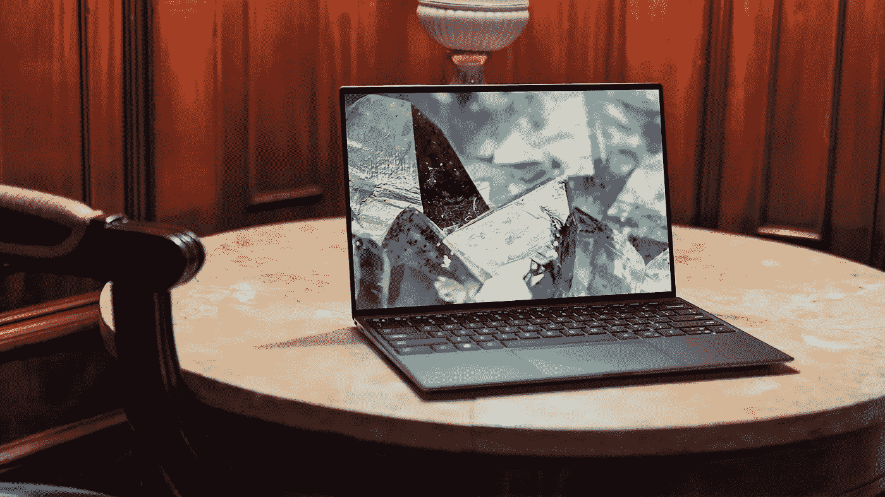
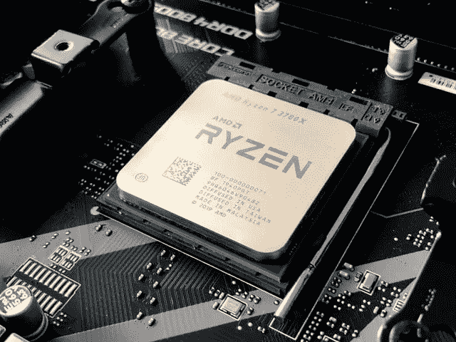
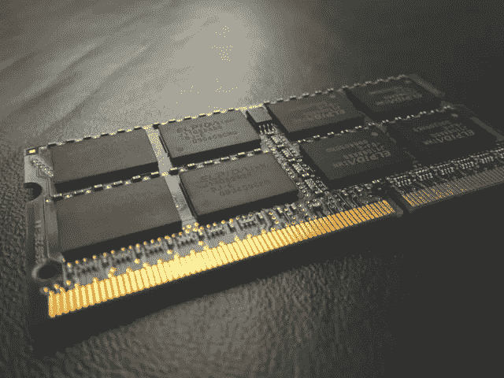
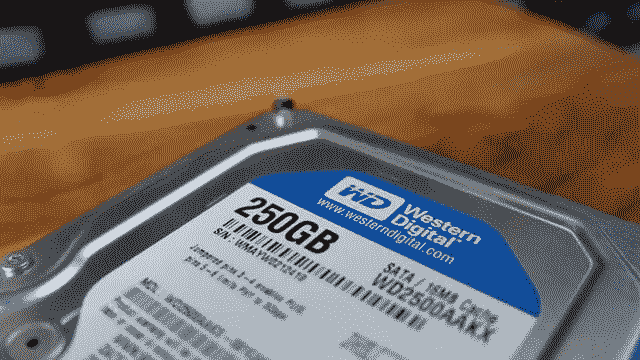
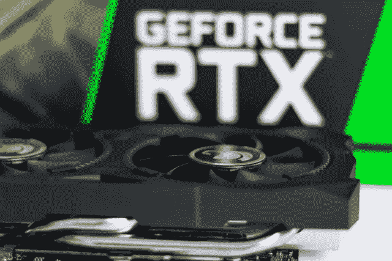

# 数据科学和机器学习任务对完美笔记本电脑的 20 项必要要求

> 原文：<https://towardsdatascience.com/20-necessary-requirements-of-a-perfect-laptop-for-data-science-and-machine-learning-tasks-7d0c59c3cb63?source=collection_archive---------0----------------------->

## 为数据科学和机器学习选择合适的笔记本电脑

照片由 [XPS](https://unsplash.com/@xps?utm_source=unsplash&utm_medium=referral&utm_content=creditCopyText) 在 [Unsplash](https://unsplash.com/?utm_source=unsplash&utm_medium=referral&utm_content=creditCopyText) 上拍摄

如果你正在学习数据科学和机器学习，你肯定需要一台笔记本电脑。这是因为您需要编写并运行自己的代码来获得实践经验。当你考虑便携性时，笔记本电脑是最好的选择，而不是台式机。

传统的笔记本电脑可能不太适合您的数据科学和机器学习任务。你需要仔细考虑笔记本电脑的规格来选择合适的笔记本电脑。如果你想买一台笔记本电脑用于数据科学和机器学习任务，这篇文章就是为你准备的！在这里，我将讨论一个完美的笔记本电脑数据科学和机器学习任务的 20 个必要要求。

我们开始吧！

# 选择正确的处理器(CPU)

照片由[奥利维尔·科莱](https://unsplash.com/@ocollet?utm_source=unsplash&utm_medium=referral&utm_content=creditCopyText)在 [Unsplash](https://unsplash.com/?utm_source=unsplash&utm_medium=referral&utm_content=creditCopyText) 上拍摄

## 要求 1:处理器的生成

始终考虑购买新一代处理器。英特尔第 11 代处理器和 AMD 第 5 代(5000 系列)处理器现已上市。英特尔第 8 代、英特尔第 10 代和 AMD 第 3 代(3000 系列)、AMD 第 4 代(4000 系列)处理器是您可以考虑的其他选项。然而，随着新一代处理器的出现，处理能力、新硬件兼容性、能效和散热管理都有了显著提高。

## 要求 2:内核和线程的数量

这是您应该考虑的最重要的需求之一。大多数机器学习任务需要并行计算。例如，当您训练随机森林算法或执行超参数调整时，如果您的处理器拥有更多内核，则可以指定更多内核供算法使用。这将大大加快这一进程。核心是单个芯片中独立 CPU 的数量。它们是硬件。线程是可以由单个 CPU 内核处理的指令。始终考虑购买具有更多 CPU 内核和线程的笔记本电脑，尤其是如果您的笔记本电脑没有单独的(独立)显卡(GPU)。4 核-8 线程处理器是我可以向您推荐的最低要求。如果你能负担得起更多的钱，你可以选择 6 核 12 线程或 8 核 16 线程或更高。

## 要求 3:基本时钟速度(频率)

基频是处理器的最低速度。基频越高，处理器越快。这通常以千兆赫(GHz)为单位。

## 要求 4:高速缓存

高速缓冲存储器充当 RAM 和 CPU 之间的缓冲器。它保存经常使用的数据和指令，以便在再次使用时 CPU 可以立即使用它们。高速缓冲存储器越高，计算机越快。高速缓存通常以兆字节(MB)为单位。建议使用 8 MB 的高速缓存。

## 要求 5:支持的内存类型、大小和速度

如果你打算将来升级内存，这是值得考虑的。推荐内存类型为 DDR-4，大小为 8 GB，速度为 3200 MHz。

考虑到以上需求，我可以为你推荐以下处理器。

*   **AMD 锐龙 7 4700U** (核心:8 个，线程:8 个，基本时钟:2.0 GHz，高速缓存:8 MB)
*   **AMD 锐龙 5 4500U** (核心 6 个，线程 6 个，基础时钟 2.3 GHz，缓存 8 MB)
*   **AMD 锐龙 7 4800H** (核心:8 个，线程:16 个，基础时钟:2.9 GHz，缓存:8 MB)
*   **AMD 锐龙 5 4600H** (核心:6 个，线程:12 个，基本时钟:3.0 GHz，高速缓存:8 MB)
*   **英特尔酷睿 i5–1135 G7**(内核:4 个，线程:8 个，基本时钟:2.4 GHz，高速缓存:8 MB)
*   **英特尔酷睿 i7–10700**(内核:8 个，线程:16 个，基本时钟:2.9 GHz，高速缓存:16 MB)

这是我的选择清单。您可以根据上述要求和预算自由选择合适的处理器。

# 选择正确的 RAM

[拥有摄影](https://unsplash.com/@possessedphotography?utm_source=unsplash&utm_medium=referral&utm_content=creditCopyText)的照片在 [Unsplash](https://unsplash.com/?utm_source=unsplash&utm_medium=referral&utm_content=creditCopyText) 上

## 要求 6: RAM 大小

这是大多数人认为的。但是请记住，增加内存大小并不能提高计算机的速度。更大的内存容量将允许你进行多任务处理。建议至少 8 GB 的 RAM 大小。我不推荐 4 GB 的内存，因为操作系统已经占用了大约 3 GB 的内存，只有 1 GB 可用于其他任务。如果你负担得起，并且你的笔记本电脑支持，升级到 12 GB 或 16 GB 是一个完美的选择。您通常希望在笔记本电脑上安装虚拟操作系统来进行大数据分析。这种虚拟操作系统至少需要 4 GB 的内存。当前的操作系统任务大约需要 3 GB 内存。在这种情况下，8 GB 的内存是不够的，12 GB 和 16 GB 是完美的选择。

## 要求 7: RAM 总线速度

建议速度为 2666 MHz。不要低于这个。现代 DDR-4 ram 支持 3200 MHz 的总线速度。总线速度越高，您的计算机就越快。

# 选择正确的存储器(辅助存储器)

图片由 [iyus sugiharto](https://unsplash.com/@foxxy2002?utm_source=unsplash&utm_medium=referral&utm_content=creditCopyText) 在 [Unsplash](https://unsplash.com/?utm_source=unsplash&utm_medium=referral&utm_content=creditCopyText) 上拍摄

## 要求 8:存储类型

这是最关键的要求。传统的笔记本电脑配有硬盘驱动器。硬盘非常非常慢。如果你买一台 i7 笔记本电脑，配一个传统的硬盘，你的笔记本电脑会非常慢。启动和打开程序要花很多时间。硬盘有移动的机械部件，会延迟信息处理，降低可靠性和耐用性。因此，有必要购买或升级您的笔记本电脑，配备 SSD(固态硬盘)。固态硬盘比硬盘功能强大得多。它们没有活动部件，性能卓越。NVMe 固态硬盘是普通固态硬盘的升级版本。它们比普通固态硬盘快 6 倍。如果你的笔记本电脑主板支持 NVMe 固态硬盘，你可以考虑升级。你甚至可以用普通的固态硬盘替换你的硬盘，但不能用 NVMe 的固态硬盘。为此，您应该购买 2.5 英寸的固态硬盘，而不是 M.2 的固态硬盘。NVMe 固态硬盘不支持 2.5 英寸外形。

## 要求 9:存储大小

如果考虑买带 SSD 的笔记本电脑，可能买不起 1 TB 的 SSD，因为贵很多。理想的大小是 512 GB。不要低于这个。

# 选择合适的显卡(GPU)

照片由[克里斯蒂安·威迪格](https://unsplash.com/@christianw?utm_source=unsplash&utm_medium=referral&utm_content=creditCopyText)在 [Unsplash](https://unsplash.com/?utm_source=unsplash&utm_medium=referral&utm_content=creditCopyText) 上拍摄

## 要求 10:品牌

NVIDIA 和 AMD 是显卡的两大品牌。Tensorflow 深度学习库使用 CUDA 处理器，只能在 NVIDIA 显卡上编译。因此，如果你打算做深度学习任务，我强烈建议你购买一台配备 NVIDIA GPU 的笔记本电脑。建议使用 GTX 1650 或更高的 GPU。拥有独立显卡的另一个优势是，普通的 GPU 有 100 多个核心，但标准的 CPU 有 4 个或 8 个核心。

## 要求 11: GPU 大小

建议至少 4 GB 的 GPU。

# 选择合适的显示器

丹尼尔·库切列夫在 [Unsplash](https://unsplash.com/?utm_source=unsplash&utm_medium=referral&utm_content=creditCopyText) 上拍摄的照片

## 要求 12:蓝光过滤功能(眼部护理)

这是你绝对应该考虑的事情。你的眼睛真的真的很值钱。数据科学和机器学习的学生在笔记本电脑前花费数小时的时间。大多数带有显示器的电子设备都会发出有害的蓝光，笔记本电脑也是如此。然而，现代笔记本电脑有蓝光过滤技术和无闪烁屏幕。另一个很好的选择是购买一台显示器，并将其与您现有的笔记本电脑连接。大多数现代显示器都配有经过认证的低蓝光、无闪烁屏幕。

## 要求 13:显示尺寸

强烈建议使用 15.6 英寸或 17.3 英寸的显示器。不要低于这个。拥有 22 英寸或 24 英寸的显示器是完美的选择。所以，可以考虑买个显示器，和笔记本电脑连接。

## 要求 14:显示分辨率

建议使用全高清(1080p)或高清(720p)显示器。

# 选择正确的品牌

我不能告诉你买一个特定的品牌。这完全由你来决定。以下是一些需要考虑的要点。

## 要求 15:可靠性

可靠性指的是笔记本电脑运行时出现故障的频率。意外关机、蓝屏错误和其他硬件故障是最常见的问题。

## 要求 16:耐久性

耐用性是指你可以使用笔记本电脑多长时间。你可以通过查看笔记本电脑的保修期来猜测它的耐用性。如果你的笔记本电脑能使用至少 4 年，它就不会浪费你的钱。

## 要求 17:售后服务和技术支持

您选择的品牌应该提供产品手册、升级选项和技术支持。

## 要求 18:可升级性

您选择的品牌应该提供添加 RAM 和辅助存储(例如固态硬盘)的简单升级选项

# 其他要求

## 要求 19:键盘类型

强烈建议使用带数字键盘的全尺寸键盘。

## 要求 20:操作系统

推荐 Windows 10。它是用户友好的。如果你愿意，Linux 等其他操作系统也可以在 Windows 操作系统中轻松运行。

我希望你下次能买到合适的笔记本电脑！

我的读者可以通过下面的链接注册成为会员，以获得我写的每个故事的全部信息，我将收到你的一部分会员费。

**报名链接:**【https://rukshanpramoditha.medium.com/membership 

非常感谢你一直以来的支持！下一个故事再见。祝大家学习愉快！

[鲁克山·普拉莫迪塔](https://medium.com/u/f90a3bb1d400?source=post_page-----7d0c59c3cb63--------------------------------)
2021–06–05