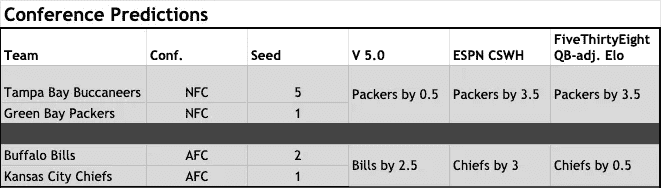
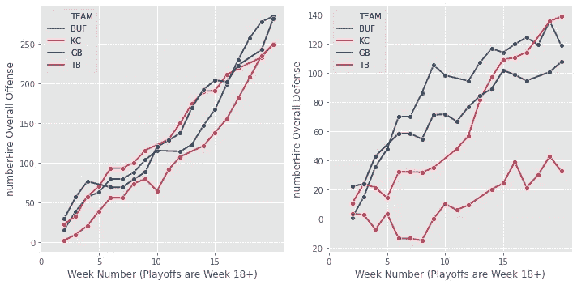
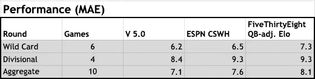

# 2020 年 NFL 季后赛机器学习模型预测会议

> 原文：<https://towardsdatascience.com/2020-nfl-postseason-predictions-from-machine-learning-model-conference-fb3be4012b89?source=collection_archive---------45----------------------->

## 数据科学

## 由于进攻激增和稳定的防守，包装工队以微弱的优势受到青睐

在 NFL 季后赛的前两周，我分享了我的模型(V 5.0)预测([外卡](https://nasir-bhanpuri.medium.com/2020-nfl-postseason-predictions-from-machine-learning-model-wild-card-3bf72a824702)、[分区](/2020-nfl-postseason-predictions-from-machine-learning-model-divisional-a9391ad23e79))。在 10 场比赛后，模型表现几乎与预测赢家的测试集中的表现完全匹配(实际:7/10，70%；测试集:69.6%)。再一次，当涉及到预测比分差异时，该模型的表现*比 [ESPN 分享的其他估计更好](https://www.espn.com/nfl/scoreboard)*(由凯撒体育图书提供，威廉希尔；CSWH) 和 [FiveThirtyEight (QB 调整后的 Elo](https://projects.fivethirtyeight.com/2020-nfl-predictions/games/?ex_cid=rrpromo) )【更多详细信息请参见**部门评审**部分】。相对于这些其他预测，该模型继续表现良好，本周首次预测了一个游戏中的不同赢家，比尔对酋长[更多详细信息见**为什么 V 5.0 支持比尔？**章节】。

以下是会议锦标赛的 V 5.0 预测，包括 CSWH 和 FiveThirtyEight 在撰写本文时提供的预测:

会议游戏预测对比(图片由作者提供)

与前两周相比，最受欢迎的人并不都匹配，因为 V 5.0 预测法案将获胜，而其他两人则倾向于酋长队。这三个都同意包装工受到青睐，但 V 5.0 预测比其他人更接近的比赛。

如果我们假设 V 5.0 的赢家准确率为 69.6%，那么最有可能的结果是两个预测都正确(2 个正确:48%，1 个正确:42%，0 个正确:9%)。

## **为什么 V 5.0 青睐票据？**

[上周我描述了](/2020-nfl-postseason-predictions-from-machine-learning-model-divisional-a9391ad23e79)随机森林算法的主要贡献者大多是权力排名[[eattrinkandsleepfootball](https://eatdrinkandsleepfootball.com/nfl/power-rankings/)]，还有效率指标[[number fire](https://www.numberfire.com/nfl/teams/power-rankings)]和 Elo 得分[ [FiveThirtyEight](https://data.fivethirtyeight.com/#nfl-elo) ]。对于比尔和酋长来说，权力排名和 Elo 得分非常相似，但效率指标略有不同，特别是在最近几周。

numberFires 的整体进攻和防守指标。对于进攻，正数更好。对于防御来说，负数更好。(图片由作者提供)

几乎整个赛季，酋长队的整体进攻得分都高于比尔队，但在第 16 周之后，比尔队在这一指标上领先，目前领先联盟。比尔队的进攻在对阵两个前 10 名防守球队(小马队和乌鸦队)时表现出色，这提高了他们的排名。另一方面，自第 13 周以来，比尔的总体防御评分一直相当稳定，而酋长队的评分则逐渐恶化。我不能不提这场比赛的一个关键因素 MVP 四分卫帕特里克·马霍斯的状况，他上周受了伤。如果他不参加，V 5.0 实际上可能低估了比尔获胜的机会。

对于海盗队和包装工队来说，虽然净效率评级有利于坦帕湾，但功率排名和 Elo 得分有利于格林湾，足以提示包装工队的方向。

## 部门审查

如上所述，在之前的两周，所有三个来源都预测了相同的赢家。因此，我们可以再次比较平均绝对误差(MAE，较低的值表示较好的预测)。

外卡和分区游戏的平均绝对误差比较(图片由作者提供)

在周日的比赛后，正确率肯定会有所不同，梅也可能会改变。我们将很快发现 V 5.0 是否仍然领先于其他进入超级碗 LV 的版本。

## 一些有趣的故事线

NFL 的球迷知道有趣的故事在联盟中比比皆是。我正在考虑参加联盟锦标赛的几个人:

*   与本周日比赛的其他三支球队不同，水牛比尔队从未赢得过超级碗。他们在 90 年代初连续四次出场，但都是 0-4。如果 V 5.0 是正确的，他们将在几周内再次冲击隆巴迪奖杯。
*   如果海盗队的一些事情进展顺利，他们能够击败包装工队，他们将是第一支在主场打超级碗的球队，可能会让他们超过他们的亚足联对手。汤姆·布拉迪也将填补他的超级碗出场记录(目前是 9 次)。