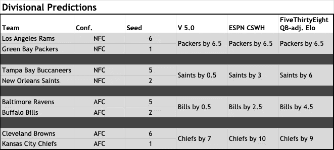
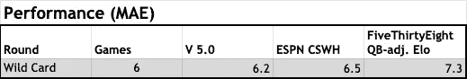

# 机器学习模型对 2020 年 NFL 季后赛的预测—分区

> 原文：<https://towardsdatascience.com/2020-nfl-postseason-predictions-from-machine-learning-model-divisional-a9391ad23e79?source=collection_archive---------43----------------------->

## 数据科学

## 酋长队和包装队得分，圣徒队和比尔队勉强领先

一周前，我分享了[我的模型预测(V 5.0)](https://nasir-bhanpuri.medium.com/2020-nfl-postseason-predictions-from-machine-learning-model-wild-card-3bf72a824702) ，事实证明，该模型在预测赢家方面的表现与预期一致(4/6，67%)。在预测比分差距方面，该模型比其他由 T4 ESPN(由凯撒体育出版社提供，威廉希尔；CSWH) 和 [FiveThirtyEight (QB 调整的 Elo](https://projects.fivethirtyeight.com/2020-nfl-predictions/games/?ex_cid=rrpromo) )【更多详情请参见**外卡审核**部分】。由于该模型迄今为止似乎在预测季后赛结果方面做得不错(尽管是在一个小样本中)，我想我应该分享一下它对分区赛的预测，并看看预测背后的主要特征(即数据输入)。

以下是 5.0 版对季后赛第二轮的预测，我再一次包括了 CSWH 和 FiveThirtyEight 在撰写本文时提供的预测:

分区赛预测对比(图片由作者提供)

同样，所有的收藏夹都匹配。预测的赢家按信心大小排序是:酋长、包装工、圣徒、比尔。相对于其他预测，V 5.0 也有预测更激烈游戏的趋势。

根据历史表现，本周 V 5.0 最有可能的结果是 4 个正确的赢家中有 3 个。此外，四大热门只有大约 20%的机会获胜。换句话说，在下周的联盟锦标赛中，我们至少有五分之四的机会看到五六个种子选手。

## 模型特征重要性

[上周我提到过](https://nasir-bhanpuri.medium.com/2020-nfl-postseason-predictions-from-machine-learning-model-wild-card-3bf72a824702)随机森林算法使用的特征类型:

*   团队效率指标[ [numberFire](https://www.numberfire.com/nfl/teams/power-rankings) ]
*   Elo 分数，根据游戏结果和对手实力来量化团队实力[ [FiveThirtyEight](https://data.fivethirtyeight.com/#nfl-elo)
*   不同来源的权力排名[[eattringandsleepfootball](https://eatdrinkandsleepfootball.com/nfl/power-rankings/)

与其他一些方法不同，随机森林的一个好处是可以在不影响性能的情况下使用大量的功能，因此系统的功能选择是不必要的。不过，一个不利之处是，可能更难判断哪些特征对预测贡献最大。有各种各样的方法可以用来评估特性的重要性，我发现在过去非常有用的一种方法是 [SHAP](https://github.com/slundberg/shap) 。

我计算了模型特征的 SHAP 值，结果让我有点吃惊。在前 10 项功能中，7 项是功耗排名，2 项是效率指标，只有 1 项与 Elo 得分相关(排名第 7)。这可能有助于解释为什么上周 V 5.0 的表现优于 FiveThirtyEight 更多细节见**外卡评论**部分]。我原本预计客观特征会比主观特征提供更多的信息，但分析表明事实正好相反。正如在许多其他类型的机器学习任务中所看到的那样，似乎结合客观和主观数据类型比单独使用任何一种类型都会产生更准确的模型。

**外卡回顾**

由于上周所有三个来源都预测了相同的赢家，所以值得考虑%正确率以外的指标。评估预测性能的另一种方法是计算平均绝对误差(MAE，较低的值表示预测较好)。虽然 CSWH 和 FiveThirtyEight 都准确预测了一个分数差异，但 V 5.0 的 MAE 总体最低:

百搭牌游戏的平均绝对误差比较(图片由作者提供)

下周的正确率肯定还是一样的，所以用 MAE 来比较分区赛的表现也是有意义的。

## 更接近的游戏？

最终只有一场外卡比赛以分差小于达阵结束。也许会再次有一些大的胜利，酋长队最有可能赢得一场大胜，但总的来说，V 5.0 预测本周会有更接近的比赛。看到一场比赛进入加时赛或以制胜一球结束，我不会感到惊讶——新奥尔良和布法罗的比赛最有可能出现戏剧性的结局。