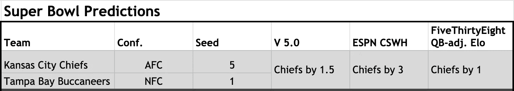
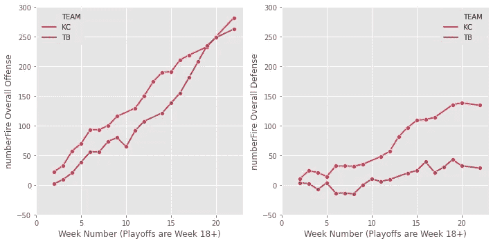
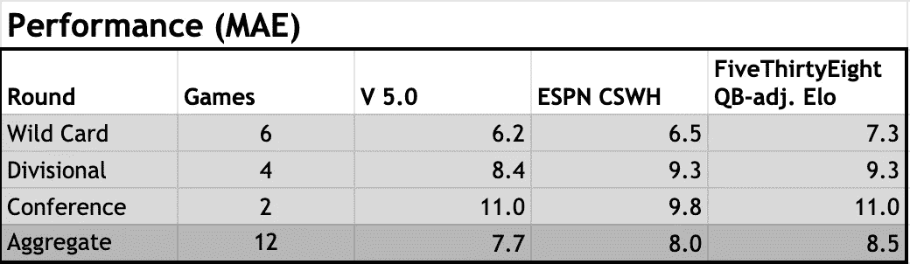

# 2020 年 NFL 季后赛机器学习模型预测-超级碗

> 原文：<https://towardsdatascience.com/2020-nfl-postseason-predictions-from-machine-learning-model-super-bowl-d5d7804e26ae?source=collection_archive---------31----------------------->

## 数据科学

## 酋长队有 1-2 分的优势，但是模型可能低估了酋长队的进攻

在 NFL 季后赛的前三轮，我分享了我随机的基于森林的模型(V 5.0)预测([外卡](https://nasir-bhanpuri.medium.com/2020-nfl-postseason-predictions-from-machine-learning-model-wild-card-3bf72a824702)、[分区](/2020-nfl-postseason-predictions-from-machine-learning-model-divisional-a9391ad23e79)、[大会](/2020-nfl-postseason-predictions-from-machine-learning-model-conference-fb3be4012b89))。虽然该模型在前两轮预测赢家后的表现与预期一致，但在会议轮中，它的预测结果是 0 比 2。进入超级碗 LV，其累计表现低于预期(实际:7/12，58%；测试集:69.6%)。然而，在预测比分差异时，在前三轮比赛中，该模型的表现超过了 ESPN(由凯撒体育杂志提供，威廉·希尔；CSWH) 和 [FiveThirtyEight (QB 调整后的 Elo](https://projects.fivethirtyeight.com/2020-nfl-predictions/games/?ex_cid=rrpromo) )【更多详情请参见**会议评审**部分】。对于超级碗，虽然所有三个预测都支持酋长队以 3 分或更少的优势击败海盗队，但会议回合的结果表明酋长队实际上可能有更大的优势[更多细节在**为什么 V 5.0 可能低估了酋长队？**一节】。

以下是 V 5.0、CSWH 和 FiveThirtyEight 对本赛季的最终预测(在撰写本文时可用):

超级碗预测对比(图片由作者提供)

## 为什么 V 5.0 可能低估了酋长的价值？

[在第一轮会议](/2020-nfl-postseason-predictions-from-machine-learning-model-conference-fb3be4012b89)中，我描述了 V 5.0 对法案胜利的预测主要是由效率指标的差异驱动的。然而，事实证明这是整个季后赛 V 5.0 最大的错误(16.5 分)。这可能仅仅是由于预测误差的典型变化，还是有可能 V 5.0 有一个系统缺陷？在仔细检查效率指标[由 [numberFire](https://www.numberfire.com/nfl/teams/power-rankings) 提供]并考虑到酋长队在会议回合中的出色进攻表现，我怀疑 KC 目前的整体进攻值可能被低估了。

numberFires 的整体进攻和防守指标。对于进攻，正数更好。对于防御来说，负数更好。(图片由作者提供)

酋长队和海盗队整个赛季都在提高整体进攻，进入超级碗 LV，酋长队有优势。尽管如此，考虑到这一指标在第 17-19 周之间的增长是适度的，当时 KC 休息了许多进攻首发，有一个轮空周，他们的 MVP 四分卫 Patrick Mahomes 和他们的前 3 名首发跑卫中的两名，Clyde Edwards-Helaire 和 Le'Veon Bell，错过了重要的时间。事后看来，进入第 20 周的整体进攻评分与比尔相比似乎太低了，而且可能仍然有点泄气，因为前几周关键球员在场边时产出较低。此外，防守对强大的比尔进攻做得很好，他们似乎在季后赛比常规赛打得更好。

## 会议评论

CSWH 和 FiveThirtyEight 在预测获胜者方面领先(8/12，67%)，并根据这一指标锁定了共同胜利，因为所有人都在选择酋长。当谈到预测得分差异时，V 5.0 保持领先，并锁定了该指标的胜利。

外卡、分区和会议游戏的平均绝对误差比较(图片由作者提供)

## **海盗队能赢得这场冷门吗？**

虽然这三个模型都支持酋长队(如上所述，可能有点低估他们)，但海盗队在最后两轮比赛中无视预测，一致不敌包装工队和圣徒队。事实上，根据 CSWH 和 FiveThirtyEight 的说法，他们爆冷的几率实际上与前几轮一样好，甚至更好。在落后于未来名人堂成员汤姆·布拉迪之后，他们的进攻有所改善，他们的防守将是酋长队在季后赛中遇到的最艰难的单位。值得注意的是，酋长队正在处理进攻线上的伤病，所以他们可能比平时更难保护马霍斯，并为爱德华兹-海莱尔创造跑动路线。

鉴于酋长队的进攻能力，(除非一个关键的伤病)很难想象海盗队通过多次达阵获胜，但如果一些事情打破了他们的方式，坦帕湾队可能会在主场庆祝超级碗的胜利。也许一次及时的失误或者一次意想不到的恶作剧是成功的关键。

即使一支球队开局很好，这两支顶级球队都有能力迅速得分，并卷土重来。如果模型是正确的，这将可能是一场势均力敌的比赛，甚至可能归结为一场致胜的比赛。