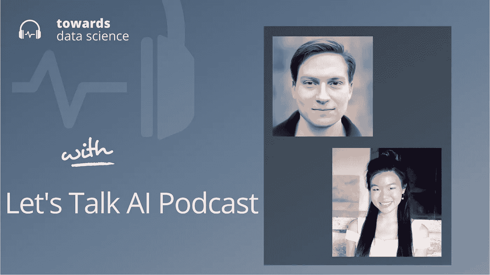

# 2021:人工智能一年(至今)

> 原文：<https://towardsdatascience.com/2021-a-year-in-ai-so-far-a97851a6869e?source=collection_archive---------29----------------------->

## [播客](https://towardsdatascience.com/tagged/tds-podcast)

## 在“让我们谈论人工智能”播客上，与我们的朋友一起回顾 2021 年最大的人工智能故事

[苹果](https://podcasts.apple.com/ca/podcast/towards-data-science/id1470952338?mt=2) | [谷歌](https://www.google.com/podcasts?feed=aHR0cHM6Ly9hbmNob3IuZm0vcy8zNmI0ODQ0L3BvZGNhc3QvcnNz) | [SPOTIFY](https://open.spotify.com/show/63diy2DtpHzQfeNVxAPZgU) | [其他](https://anchor.fm/towardsdatascience)

*编者按:这一集是我们关于数据科学和机器学习新兴问题的播客系列的一部分*，*由 Jeremie Harris 主持。除了主持播客，Jeremie 还帮助运营一家名为*[*sharpes minds*](http://sharpestminds.com)*的数据科学导师初创公司。*

2020 年对人工智能来说是不可思议的一年。我们第一次看到了大型语言模型潜力的强大暗示，这要归功于 [OpenAI 的 GPT-3](https://en.wikipedia.org/wiki/GPT-3) ，DeepMind 使用人工智能[解决了分子生物学中最大的公开问题之一](https://en.wikipedia.org/wiki/AlphaFold)，Boston Dynamics 展示了他们以戏剧性的方式[融合人工智能和机器人技术](https://www.youtube.com/watch?v=fn3KWM1kuAw&ab_channel=BostonDynamics)的能力。

人工智能的进展正在呈指数级加速，尽管 2021 年刚过一半，但今年已经成为书本上的又一年。因此，我们决定与我们的朋友在“让我们谈谈人工智能”上合作，这是一个播客，由斯坦福大学博士、前谷歌公司 [Sharon Zhou](https://twitter.com/realSharonZhou) 和斯坦福大学博士生 [Andrey Kurenkov](https://twitter.com/andrey_kurenkov) 共同主持，内容涉及人工智能领域的时事。

这是一次有趣的聊天，我们将来肯定会更多地使用这种形式:)

以下是我们讨论的一些主要主题:

*   ****多模态学习。**如果说 2020 年是大型语言模型和元学习的一年，那么 2021 年是将视觉和文本结合在一起的大型多模态模型的一年。OpenAI 的 CLIP 和 DALL-E 模型显示了语言建模和视觉的结合是多么的强大。尤其是 DALL-E，它已经证明自己能够根据用户指定的文本提示生成令人印象深刻的图像。据推测，这一领域还会有更多的发展，包括与机器人技术的集成，以及继续推动人工智能进入物理世界。**
*   **[**偏于 AI 型号**](https://www.wsj.com/articles/facial-recognition-tools-in-spotlight-in-new-jersey-false-arrest-case-11609269719) **。鉴于人工智能算法中存在偏见的既定问题，关于人工智能何时以及如何应用的新问题正在被提出。最近，一名黑人男子因被计算机视觉系统误认为是商店扒手而在监狱呆了 10 天后起诉了新泽西州警察局。像这样的事件激发了国家和国际监管机构对解决人工智能系统带来的挑战的新兴趣。它们还迫使我们客观地思考什么是公平和偏见:只有当我们严格定义这些术语时，它们才能在技术上易于处理。****
*   **[**生成性时代的所有权权利 AI**](https://www.billboard.com/articles/columns/rock/9551482/ai-software-generates-new-nirvana-song-27-years-after-kurt-cobain-death) **。最近，人工智能模型被用来生成一系列虚假的——但看似怪异的——涅槃乐队的歌曲，尽管他们的主唱柯特·科本在 1994 年去世了。这就引出了一个有趣的问题:谁拥有这首音乐的版权？而谁*应该*？随着人工智能系统让我们以新的方式思考创造力本身，它们也迫使我们质疑几个世纪以来我们对信用分配和版权的假设。越来越明显的是，对许多人来说，不理解人工智能不再是可选的——包括律师、法官和政治家——他们曾经可以将他们的思维外包给这类问题的专家。****

**你可以在推特[这里](https://twitter.com/jeremiecharris)关注我。**

****

## **章节:**

*   **0:00 介绍**
*   **六点零五分**
*   **13:05 对 GPT-3 的评论**
*   **19:43 面部识别技术的问题**
*   **27 俱乐部 31:20 丢失的磁带**
*   **42:20 总结**