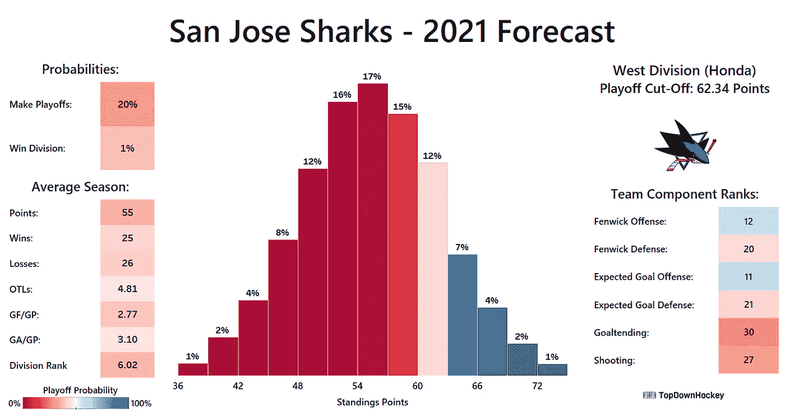

# 2021 年 NHL 预测模型:高级概述

> 原文：<https://towardsdatascience.com/2021-nhl-projection-model-high-level-overview-2366b3be5538?source=collection_archive---------28----------------------->

## 关于 TopDownHockey 的最新游戏模拟模型，你需要知道什么

2021 年圣何塞鲨鱼队的预测。(图片由作者提供)

我模拟了 2021 NHL 赛季 10000 次，以便确定每个结果的概率。我已经开始在 Twitter 上分享我的工作成果，并计划很快写一个完整的季度预览，但在此之前，我必须概述一下我所做的工作，以便读者可以分析这个过程，并确定他们认为该模型的优势和劣势。

我首先使用极端梯度推进来建立一个预期目标模型，该模型确定了每次射门成为目标的概率。关于这个过程的更多信息可以在这里找到[。(注意:当我在这里和本文的其余部分使用射门时，我指的是所有未被阻挡的射门，包括那些没有入网的射门。)然后，我使用事先知情的岭回归来获得每个滑冰运动员对他们的团队产生和允许射门和预期进球的速度的影响的点估计，以及力量比赛中的射门和预期进球，以及点球决胜中的射门和预期进球。为了获得每个运动员对他们自己的射门成为进球的概率的影响的点估计，以及每个守门员对他们面对的射门成为进球的概率的影响的点估计，我遵循了一个非常类似的过程，但使用了非事先知情(香草)岭回归。更多关于使用回归分析 NHL 滑手的过程可以在](https://topdownhockey.medium.com/a-new-expected-goal-model-that-is-better-than-corsi-at-predicting-future-goals-ecfa44dc84e9)[这里](/a-comprehensive-guide-to-using-regression-rapm-to-evaluate-nhl-skaters-with-source-code-ad76d1e1b8da)找到。

在过去的 6 个赛季中，我都重复了这个过程。(2014–2015 年至 2019–2020 年。)然后，我对这些赛季中的每一个赛季进行了线性回归，以获得系数估计值，这将为我提供放置在第 1、2 和 3 年的适当权重，以便最准确地预测球员在第 4 年的表现，然后将这一结果应用于过去 3 个赛季中每一个赛季的 NHL 选手。对于过去三个赛季都没有参加比赛的选手，我重复了这个过程，只用第一年和第二年来预测第三年，并将这些权重应用到第一年和第二年。对于只玩了一年的选手，我只是简单地复制和粘贴他们上个赛季的估计影响，并将其作为他们下个赛季的预计影响。

我最初计划对守门员使用相同的过程，但在之前赛季的测试中发现，守门员的表现每年都不太具有可重复性，并且我的预测守门员表现在解释我的预测排名中的差异方面发挥了比实际 NHL 排名更大的作用。这让我通过重复一个类似于我对溜冰者所做的过程来“减轻”守门的重量，而是直接从线性回归中获得拟合值，这将每个守门员的预期表现拉得更接近于零。这提高了模型在前几季测试中的性能。

我在这里得到的每一个投影值都是以比率的形式出现的；对于播放驱动组件，速率是每分钟，对于拍摄和保存组件，速率是每镜头。不是所有的运动员都会打相同的分钟数，也不是所有的运动员在冰场上的投篮命中率都是相同的，这使得这些数字在不知道他们下赛季会打多少和投多少的情况下毫无用处。

为了估计每个选手将上场的分钟数，我使用每个选手的冰上时间百分比(TOI%)重复了上述过程，以预测他们在 2021 年的 TOI 百分比，然后根据他们所有队友的预测 TOI 百分比调整该百分比，以确定每个选手实际上场时间的正确估计。这是用 TOI%平均力量(EV)、力量打法(PP)和点球决胜(PK)完成的。然后，我将他们在每种游戏强度下的预计 TOI%乘以我预计各队在每种游戏强度下的比赛时间——平均强度下大约为 90%,特殊团队为 10%,平均分布在 PP 和 PK 之间——然后将他们在每种游戏强度下的预计每分钟影响乘以我预计他们在该游戏强度下的比赛时间。

为了估计他们队中每个运动员投篮的百分比，我基本上重复了这个过程，得到了他们队中每个运动员投篮的百分比。然后，我将我预测的每个射手的投篮命中率乘以每个射手对投篮得分的影响。

对于守门员，我使用上赛季的比赛作为他们下赛季比赛的初步预测，然后将守门员预计参加的比赛次数除以他们团队中所有守门员预计参加的比赛次数，这为我提供了每个守门员将参加的球队比赛的百分比的估计。然后，我用每个守门员预计参加的比赛百分比乘以他们面对的射门对进球的预计影响。

对于每支球队，我使用了前 12 名前锋、前 6 名防守队员和前 2 名守门员来进行计算。我使用 EV TOI%的排名运动员来确定哪些运动员晋级，使用上赛季的比赛来确定哪些守门员晋级，但根据外部知识做出了一些随意的阵容决定。例如，亚伦·戴尔上赛季比杰克·坎贝尔打了更多的比赛，但基于多伦多枫叶队支付给每个球员的工资和他们收购坎贝尔的交易资产价格，我选择用坎贝尔代替戴尔。有几个队只有一个守门员；对于这些球队，我将守门员的预计表现乘以 47，然后除以 56，作为一种假设，他们将打 47 场比赛，而我一无所知的守门员将打 9 场比赛。对于那些我知道会使用我以前从未见过的滑手的球队，比如纽约流浪者队和亚历克西斯·拉弗雷涅尔队，我只是在那个位置上少用了一名滑手来构建团队组成。

我总结了每个团队的每个玩家对游戏每个部分的预期影响。这些因素的总和为我提供了一个团队对以下六个组成部分的独立影响:射门，射门，预期进球，预期进球，射门和守门。一支球队对前四个组成部分的影响是以每 60 分钟的影响形式出现的，而他们对后两个组成部分的影响是以每次投篮的形式出现的。这六个组件构成了模型的“核心”。

为了确定每支球队投篮和得分的比率，在我的模拟中，我将每支球队的预计影响与其对手的相应影响相结合，以确定每支球队对这些组成部分的总体影响，然后将其添加到球队投篮和得分的联盟平均比率中。为了更好地理解这个概念，想象一下下面这个虚构的游戏(由虚构的数据组成)，为了简洁起见，只关注主队的进攻:

-联盟平均水平的球队每 60 分钟射门 44 次，进球 3 个。

-成为主队增加一支球队的每小时投篮率 1，增加他们的每小时进球率 0.3。

-主队对+5.0 的投篮有影响，客队对-1.0 的投篮有影响。

-主队对预期目标的影响为+0.3，客队对预期目标的影响为-0.1。

-主队选手的射门对进球概率的影响为+0.1%，客场队选手的射门对进球概率的影响为-0.01%。

在对主队的射门质量和客场球队的守门质量进行调整之前，我们看到主队应该每小时射门 49 次，每小时进球 3.5 个，这意味着他们应该以 7.14%的射门得分。调整完成后，我们确定他们应该以 7.23%的命中率得分。

主队和客场队在每一场比赛中都重复这一过程，以获得他们投篮和得分的比率。一旦获得这些值，模拟就可以运行了。

我通过在 R 中创建一个具有 3，600 行和 2 列的数据帧来开始模拟。每行代表我正在模拟的游戏中的一秒钟，每列包含一个随机估计，即一个队是否会根据他们投篮的速度投篮；每个队的照片都有一栏。如果一支球队射门，我会根据他们射门得分的速度来判断这一球是否会成为进球。一旦每一行都完成了这个过程，每个队的进球数就会被加起来，如果一个队的进球数多，就会宣布一个队获胜。如果两个队都进了相同数量的球，我创建一个 600 行 2 列的附加数据帧来模拟加时赛。在加时赛中第一个得分的队赢得比赛，如果两个队都没有在加时赛的 600 秒内得分，将随机宣布一个获胜者，每个队获胜的概率为 50%。

我在 2019-2020 赛季按照相同的流程测试了该模型，并使用了每 82 场比赛的预计得分和每 82 场比赛的实际得分之间的对数损失和平均误差。我得到的对数损失大约为 0.678，平均误差大约为 8.1。该测试与真实和适当的测试略有不同；我同时处于不公平的优势，因为我可以进入球员效力的第一个球队，也处于不公平的劣势，因为我没有在每场比赛中更新阵容。由于这一点，我对我的结果持保留态度，但仍然对该模型在 2021 赛季的表现充满信心。

在未来，我希望建立一个更精细的模拟引擎，通过包括惩罚，得分效果，空网情况和更多的因素，更准确地反映一场 NHL 比赛，但我怀疑这不会大大改变球队赢得比赛的概率，但会花很长时间来获得这些概率。不过，就目前而言，我对自己所做的一切感到满意。

我现在已经计算了每场比赛的获胜概率。我计划根据每支球队的预计阵容更新整个赛季的阵容，并在每场比赛的前一天晚上为每场比赛进行 10，000 次模拟，并根据这些模拟的结果更新概率。在本赛季的某个时候，我计划使用事先知情的岭回归来更新我对每个球员影响的预测，但在我这样做之前，我希望获得本赛季相当大的样本数据。