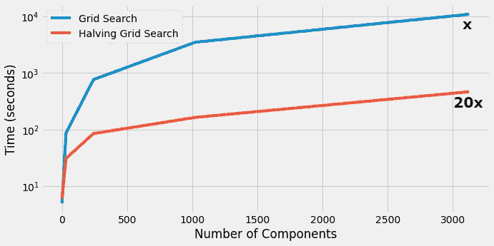
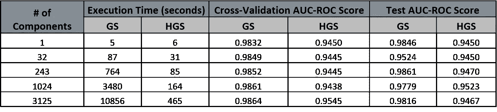

# 网格搜索交叉验证速度提高 20 倍

> 原文：<https://towardsdatascience.com/20x-times-faster-grid-search-cross-validation-19ef01409b7c?source=collection_archive---------4----------------------->

## 通过将网格搜索减半，加快交叉验证工作流程


图片由 [anncapictures](https://pixabay.com/users/anncapictures-1564471/?utm_source=link-attribution&amp;utm_medium=referral&amp;utm_campaign=image&amp;utm_content=2678544) 来自 [Pixabay](https://pixabay.com/?utm_source=link-attribution&amp;utm_medium=referral&amp;utm_campaign=image&amp;utm_content=2678544)

为了训练稳健的机器学习模型，必须选择正确的机器学习算法和正确的超参数组合。选择最佳参数集的过程称为超参数调整。

人们必须在所有机器学习算法和其超参数的不同组合上训练数据集，以提高性能度量。交叉验证技术可用于在各种机器学习算法上训练数据集，并从中选择最佳算法。



(图片由作者提供)，GridSearchCV 和 HalvingGridSearchCV 的时间约束比较

# 什么是交叉验证？

交叉验证是一种重采样技术，可用于在有限的数据集上评估和选择机器学习算法。k 折叠交叉验证是一种交叉验证，其中训练数据被分成 k 个折叠，并且(k-1)个折叠用于训练，第 k 个折叠用于模型的验证。


([来源](https://scikit-learn.org/stable/modules/cross_validation.html))，k 倍交叉验证

> 阅读 [scikit-learn 交叉验证文档](https://scikit-learn.org/stable/modules/cross_validation.html)以获得更好的理解。

# 网格搜索 CV:

网格搜索交叉验证是一种选择最佳机器学习模型的技术，由超参数网格参数化。Scikit-Learn 库附带网格搜索交叉验证实现。

网格搜索 CV 尝试模型的所有参数网格组合，并返回具有最佳性能分数的最佳参数集。这也是一个缺点，因为训练每个参数组合的模型增加了时间复杂度。

```
**param_grid** = {
"max_depth": [3, 4, 7, 10, 25],
"gamma": [0.5, 1, 5, 10, 25],
"min_child_weight": [1, 3, 5, 10, 25],
"reg_lambda": [5, 10, 50, 100, 300],
"scale_pos_weight": [1, 3, 5, 10, 25]
}# Grid Search CV implementation **xgb_cl = xgb.XGBClassifier(objective="binary:logistic")
grid_cv = GridSearchCV(xgb_cl, param_grid, scoring="roc_auc", n_jobs=-1, cv=3)
grid_cv.fit(X_train, y_train)**# Return set of parameters with the best performance
**grid_cv.best_params_**# Return the performance metric score
**grid_cv.best_score_**
```

上面的代码片段解释了网格搜索 CV 的用法，cv=3，它在所有的`**param_grid**` 参数组合上训练`**X_train**` 数据集。

对于大型数据集，网格搜索 CV 时间复杂度呈指数增长，因此实际上不可行。

可以转移到**随机搜索 CV** ，其中算法将随机选择参数的组合。随机搜索 CV 的性能在某种程度上等于或小于网格搜索 CV，但是时间复杂度降低，并且对大规模数据集应用网格搜索变得实际可行。

在本文中，我们将讨论一种将网格搜索 CV 减半的新算法，它的性能与网格搜索 CV 相当，但与网格搜索相比，时间复杂度大大降低。

# 减半网格搜索:

虽然网格搜索 CV 和随机搜索 CV 都在整个数据上训练所有成分(参数网格的组合)，但是减半网格搜索 CV 或减半随机搜索 CV 遵循一种 ***连续减半方法*** 。

将网格搜索(HGS) CV 减半的步骤如下:

1.  HGS 将数据子集训练成所有的参数组合。
2.  表现最好的候选人或组合被选中。
3.  在表现最好的候选人身上训练更大的训练数据子集。
4.  重复上述 3 个步骤，直到最佳超参数集保持不变。

使用 HGS，对于每个经过的迭代，参数分量在减少，而训练数据集在增加。由于该算法遵循连续减半的方法，因此与网格搜索 CV 相比，该算法的时间复杂度相对较小。

## 实施:

Scikit-Learn 库实现了减半网格搜索 CV 算法。下面的代码片段解释了算法的工作和实现。

```
**param_grid =** ***{
"max_depth": [3, 4, 7, 10, 25],
"gamma": [0.5, 1, 5, 10, 25],
"min_child_weight": [1, 3, 5, 10, 25],
"reg_lambda": [5, 10, 50, 100, 300],
"scale_pos_weight": [1, 3, 5, 10, 25]
}***# Grid Search CV implementation **xgb_cl = xgb.XGBClassifier(objective="binary:logistic")
halving_cv = HalvingGridSearchCV(xgb_cl, param_grid, scoring="roc_auc", n_jobs=-1, min_resources="exhaust", factor=3)**
**halving_cv.fit(X_train, y_train)**# Return set of parameters with the best performance
**halving_cv.best_params_**# Return the performance metric score
**halving_cv.best_score_**
```

# 基准时间和性能分数:

现在让我们比较网格搜索 CV 和减半搜索 CV 的性能得分和时间复杂度。

> [Kaggle](https://www.kaggle.com/mlg-ulb/creditcardfraud)的信用卡欺诈数据集用于计算时间数。这是一个分类问题，ROC-AUC 分数被用作比较性能的度量。
> 
> 只有大约 7.5k 记录用于 cv=3 的训练，大约 3k 记录用于测试目的。



(图片由作者提供)，网格搜索(GS)和减半网格搜索(HGS)交叉验证的基准时间约束和性能 AUC-ROC 得分

观察上面的时间数字，对于具有 3125 个组合的参数网格，网格搜索 CV 花费了 10856 秒(~3 小时)，而将网格搜索 CV 减半花费了 465 秒(~8 分钟)，这大约快了 23 倍。

# 结论:

在本文中，我们讨论了一种网格搜索 CV 的优化方法，即将网格搜索 CV 减半，然后采用逐次减半的方法来提高时间复杂度。也可以尝试随机搜索 CV 或减半随机搜索 CV，这可以进一步降低时间复杂度，但有时会以性能分数为代价。

最好的部分是减半网格搜索 CV 实现附带 scikit-learn 包以供使用。

# 参考资料:

[1]等分网格搜索 CV 文档:[https://sci kit-learn . org/stable/modules/generated/sk learn . model _ selection。HalvingGridSearchCV.html](https://scikit-learn.org/stable/modules/generated/sklearn.model_selection.HalvingGridSearchCV.html)

> 感谢您的阅读